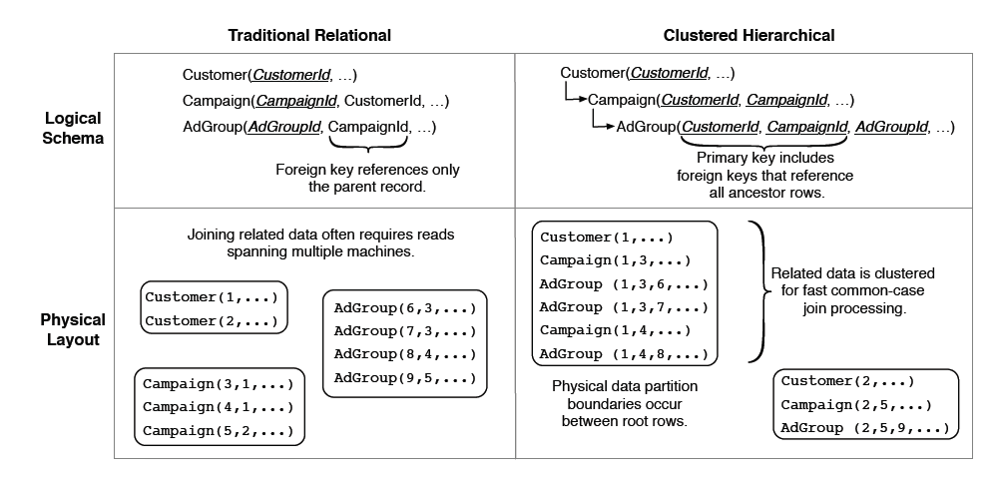

# PRODUCT REQUIREMENTS DOCUMENT (PRD)

> **Status: konsep historis — jangan diimplementasikan sebagai desain target.** Desain kanonik telah dipindahkan ke [docs/dev/README.md](dev/README.md). Khususnya, asumsi "satu Laravel runtime dengan Composer package", feature flag frontend sebagai mekanisme distribusi, dan update on-prem melalui Composer/webhook telah digantikan oleh service module API + UI artifact + database + Docker release unit serta bundle update bertanda tangan. SaaS dimonitor melalui control plane; on-prem perpetual independen dan konektor support bersifat opt-in. Dokumen ini dipertahankan hanya sebagai catatan kebutuhan awal.

**Proyek:** Arsitektur Sistem LeakStudio (SaaS Multi-Tenant Modular)
**Fokus:** Skalabilitas Database, Proteksi Kode Sumber (IP), dan CI/CD Deployment

## 1. Ringkasan Eksekutif
Sistem ini adalah platform *Software as a Service* (SaaS) *multi-tenant* yang dirancang dengan arsitektur sangat modular. Sistem harus mendukung dua model bisnis utama:
1.  **SaaS Terpusat (Cloud):** Berjalan di server utama, melayani banyak *tenant* sekaligus secara *real-time*.
2.  **SaaS On-Premise (Beli Putus):** Di-*deploy* di server klien secara mandiri. Klien hanya mendapatkan kode untuk modul yang mereka beli (misal: hanya modul POS), tanpa membocorkan *source code* modul lain (misal: modul Booking atau Studio).

## 2. Arsitektur Database (Terdistribusi & Skalabel)
Diadaptasi dari prinsip sistem berskala masif, arsitektur basis data menggunakan pendekatan **Shared Database dengan Sharding**:
*   **Clustered Hierarchical Schema:** Semua tabel anak (seperti transaksi, struk) memiliki relasi kuat dengan tabel induk (*tenant*) melalui `tenant_id`. Data milik satu *tenant* akan dikelompokkan dan disimpan di lokasi server fisik (*shard*) yang sama (Colocation) untuk menghindari penalti latensi saat melakukan *join* tabel.
*   **Horizontal Scaling:** Peningkatan kapasitas dilakukan dengan menambah *node/shard* baru, lalu mendistribusikan *tenant* ke *node* tersebut.
*   **Pemisahan Read/Write (Replication):** Transaksi *real-time* (OLTP) diarahkan ke server utama (*Primary Shard*). Kueri berat seperti penarikan laporan (OLAP) diarahkan secara otomatis oleh *Coordinator Node* ke *Read Replica* agar tidak mengganggu performa kasir.

## 3. Arsitektur Backend (Core + Plugin dengan Composer)
Backend menggunakan pendekatan *Package-Based Architecture* (seperti Laravel) untuk memisahkan fitur dasar dan fungsionalitas bisnis.
*   **SaaS Core (`/app`):** Menyimpan fondasi utama (Autentikasi, Manajemen *Tenant*, *Role/Permission*, dan sistem berlangganan).
*   **Modul Ekstensi (`/packages`):** Fitur spesifik (POS, Booking, Inventory) dikembangkan sebagai *package* mandiri (*mini-app*). Masing-masing memiliki *Controllers*, *Models*, *Routes*, dan *Migrations* sendiri.
*   **Deployment Klien (Anti-Bajak):** Di server klien "beli putus", *source code* modul lain tidak ada secara fisik. Modul ditarik menggunakan Dependency Manager (Composer) melalui repositori privat. File rute tidak di-*hardcode* di *Core*, melainkan didaftarkan secara dinamis oleh *Service Provider* modul yang terinstal.

## 4. Arsitektur Frontend (React + Vite Tree Shaking)
Frontend dirancang agar *browser* klien hanya merender dan mengunduh UI untuk fitur yang aktif, memastikan *source code* UI dari modul yang tidak dibeli benar-benar terhapus.
*   **Struktur Direktori:** Dibagi menjadi `src/core` (UI login, *sidebar*, *routing* utama) dan `src/modules` (komponen spesifik seperti halaman kasir atau kalender *booking*).
*   **Environment Variables:** Menggunakan sistem *flagging* di file `.env` (misal: `VITE_ENABLE_POS=true`, `VITE_ENABLE_STUDIO=false`).
*   **Dynamic Imports:** Router utama di Core menggunakan fungsi *import* asinkron berdasarkan nilai `.env`.
*   **Tree Shaking:** Saat *bundler* (Vite) menjalankan proses *build*, modul yang bernilai `false` akan dibuang seutuhnya dari hasil kompilasi. Klien hanya menerima file Javascript statis (`app-[hash].js`) yang ukurannya kecil, terenkripsi, dan hanya berisi modul langganan mereka.

## 5. Strategi CI/CD & Pembaruan (Update)
Pembaruan fitur baru atau perbaikan *bug* dilakukan dari satu *codebase* tersentralisasi dengan alur rilis berikut:
*   **SaaS Terpusat (Otomatis):** CI/CD merespons *merge* ke cabang `release`, mengeksekusi `composer update`, menjalankan *database migrations*, dan me-*replace* file *build* React di server *production* secara otomatis.
*   **Klien On-Premise (Pull/Webhook):**
    *   **Backend:** Klien menekan tombol "Update" di aplikasi, memicu server mereka menjalankan `composer update vendor-name/module-name` lalu mengeksekusi migrasi.
    *   **Frontend:** CI/CD membangun (*build*) *file statis (Artifact)* khusus untuk klien tersebut (berdasarkan konfigurasi `.env` mereka) menjadi file `.zip`. Sistem klien akan mengunduh dan menimpa folder *public/build* mereka dengan aset baru tanpa pernah menyentuh mesin NPM atau *source code* mentah di server mereka.

---

**Instruksi Lanjutan untuk LLM:**
Berdasarkan PRD di atas, tolong buatkan:
1. Skema desain arsitektur infrastruktur (diagram alur dari Klien -> Load Balancer -> Backend -> Database Terdistribusi).
2. Struktur direktori (*folder tree*) detail untuk Backend dan Frontend.
3. *Boilerplate* kode sederhana yang menunjukkan bagaimana Router di Frontend (React) memuat modul secara dinamis menggunakan *Environment Variables*.

