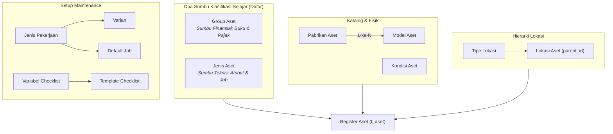
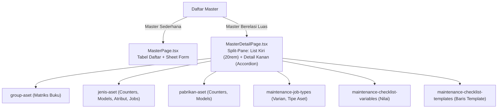

# Master data

Halaman ini untuk developer. Isinya arsitektur dan perilaku yang **dipakai bersama oleh seluruh master data** di modul aset — bukan sekadar penjelasan satu per satu.

Master data adalah daftar pilihan yang dipakai berulang di seluruh alur transaksi: `group-aset`, `jenis-aset`, `kondisi-aset`, `pabrikan-aset`, `model-aset`, `lokasi-aset`, `tipe-lokasi-aset`, `tipe-atribut`, `profil-penyusutan`, `buku-penyusutan`, tipe pekerjaan maintenance, dan master work order. Daftar lengkapnya ada di `routes/api/master-data.php` pada array `$masters`.



---

## Fungsi tiap master

| Master | Menjawab | Dibahas di |
| --- | --- | --- |
| `group-aset` | Barang ini disusutkan bagaimana, masuk kelompok pajak apa | [Group aset](/apps/management-aset/master/groupaset/) |
| `jenis-aset` | Data teknis apa yang harus diisi, pekerjaan apa yang berlaku | [Jenis aset](/apps/management-aset/master/jenisaset/) |
| `tipe-atribut` | Hal apa saja yang bisa dicatat sebagai data tambahan | [Jenis aset](/apps/management-aset/master/jenisaset/) |
| `pabrikan-aset` | Barang ini buatan siapa | [Pabrikan dan model](/apps/management-aset/master/katalog-model/) |
| `model-aset` | Tipe barang dari pabrikan itu | [Pabrikan dan model](/apps/management-aset/master/katalog-model/) |
| `kondisi-aset` | Keadaan fisik barang sekarang (misal: Baik, Rusak Ringan, Rusak Berat) | Halaman ini |
| `tipe-lokasi-aset` | Golongan tingkatan lokasi: site, gedung, lantai, ruang | [Lokasi](/apps/management-aset/master/lokasi/) |
| `lokasi-aset` | Di mana barangnya berada, dan siapa yang menanggung biayanya | [Lokasi](/apps/management-aset/master/lokasi/) |
| `profil-penyusutan` | Rumus dan frekuensi menghitung penyusutan | [Penyusutan](/apps/management-aset/master/depresiasi/) |
| `buku-penyusutan` | Untuk keperluan apa penyusutan dihitung (Komersial/Fiskal) | [Penyusutan](/apps/management-aset/master/depresiasi/) |
| `maintenance-job-types` | Jenis pekerjaan perawatan fisik | [Setup maintenance](/apps/management-aset/master/maintenance/) |
| `maintenance-job-type-variants` | Turunan pekerjaan (misal: servis 10.000 km) | [Setup maintenance](/apps/management-aset/master/maintenance/) |
| `maintenance-job-type-defaults` | Nilai bawaan jam & alat saat pekerjaan dibuat | [Setup maintenance](/apps/management-aset/master/maintenance/) |
| `maintenance-checklist-variables` | Variabel yang diukur atau dinilai saat pemeriksaan | [Setup maintenance](/apps/management-aset/master/maintenance/) |
| `maintenance-checklist-templates` | Susunan baris pemeriksaan yang dipakai berulang | [Setup maintenance](/apps/management-aset/master/maintenance/) |
| `tipe-work-order` | Golongan work order dan batas satu pekerja | [Master work order](/apps/management-aset/master/work-order/) |
| `tingkat-layanan` | Urgensi penanganan (angka kecil = prioritas tinggi) | [Master work order](/apps/management-aset/master/work-order/) |
| `trade` | Bidang keahlian yang dibutuhkan (mekanik, elektrik) | [Master work order](/apps/management-aset/master/work-order/) |
| `sebab-kerusakan` | Akar penyebab kerusakan saat WO ditutup | [Master work order](/apps/management-aset/master/work-order/) |
| `tindakan-perbaikan` | Tindakan teknis yang dilakukan untuk memperbaiki | [Master work order](/apps/management-aset/master/work-order/) |
| `fixed-asset-parameters` | Parameter global aset (Layar placeholder informatif) | [Monitoring dan layar kosong](/apps/management-aset/transaction/monitoring/) |
| `fixed-asset-posting-profiles` | Posting group aset: akun jurnal per group dan tanggal berlaku | [Posting group aset](/apps/management-aset/master/posting-group/) |

---

## Dua Pola Tata Letak UI di Frontend

UI master modul aset mengadopsi dua pola komponen tergantung kompleksitas relasi datanya:



1. **`MasterPage.tsx`**: Menampilkan tabel data satu layar penuh dengan Sheet drawer untuk penambahan dan pengeditan (dipakai oleh `kondisi-aset`, `tipe-lokasi-aset`, `trade`, `tingkat-layanan`, dll).
2. **`MasterDetailPage.tsx` & `RecordDetailPane.tsx`**: Menampilkan panel terbagi dua (*split-pane*). Panel kiri berisi daftar record yang dapat di-scroll tanpa batas (*infinite list*), dan panel kanan menampilkan formulir lengkap dengan accordion/sub-tab dinamis untuk mengelola entitas turunan tanpa berpindah halaman.

---

## Arsitektur Backend: Dua Base Controller

### 1. `MasterDataController` — Untuk Master Mandiri

Semua master mandiri tidak menulis ulang logika CRUD atau penomoran. Mereka hanya mewarisi `MasterDataController`:

```php
namespace App\Http\Controllers\master;

use App\Http\Controllers\MasterDataController;
use App\Models\master\Trade;

class TradeController extends MasterDataController
{
    protected function resource(): string { return 'trade'; }
    protected function model(): string { return Trade::class; }
}
```

Bila master memiliki induk atau anak, relasi dinyatakan melalui:
```php
protected function parentMasters(): array {
    return [
        new MasterParent('lokasi-aset', 'parent_id', 'parent', LokasiAset::class, required: false),
        new MasterParent('tipe-lokasi-aset', 'tipe_lokasi_id', 'tipe_lokasi', TipeLokasiAset::class, required: false),
    ];
}
```

### 2. `MasterLinkController` — Untuk Tabel Penghubung

Tabel matriks (misal: kaitan jenis aset ke model, kaitan job ke asset type, matriks group ke buku) mewarisi `MasterLinkController`.

| Karakteristik | Master Mandiri (`MasterDataController`) | Tabel Penghubung (`MasterLinkController`) |
| :--- | :--- | :--- |
| Punya kolom `kode` | Ya (Diterbitkan Core) | Tidak |
| Minta nomor ke Core | Ya | Tidak |
| Header `Idempotency-Key` | Wajib pada `POST` | Tidak (Metode `PUT` sudah idempoten) |
| Hak akses | Permission resource sendiri | Menggunakan permission milik entitas induk |
| Cara penyimpanan | Per satu record | Satu `PUT` mengganti seluruh array daftar |
| Mekanisme Konkurensi | Cek duplikasi unik creation key | Mengunci baris induk (*Pessimistic Lock*) |

---

## Lima Endpoint Standar Master

Setiap master mandiri mengekspos 5 rute REST yang konsisten:

| Metode & Endpoint | Permission | Gunanya |
| :--- | :--- | :--- |
| `GET /api/v1/{resource}` | `management-aset.{resource}.read` | Membaca daftar terpaginasi |
| `POST /api/v1/{resource}` | `management-aset.{resource}.create` | Membuat record baru (wajib `Idempotency-Key`) |
| `GET /api/v1/{resource}/{id}` | `management-aset.{resource}.read` | Membaca detail satu record |
| `PATCH /api/v1/{resource}/{id}` | `management-aset.{resource}.update` | Memperbarui kolom record |
| `DELETE /api/v1/{resource}/{id}` | `management-aset.{resource}.archive` | Soft delete / mengarsipkan record |

Permission berlaku per resource. Memiliki `group-aset.update` tidak memberikan izin mengubah `jenis-aset`.

---

## Aturan Bersama yang Dijaga

**Kode selalu dari Core.** `POST` meminta nomor ke Number Sequence lewat `NumberSequenceClient`. Jika referensi penomoran belum aktif di Control Plane, permintaan gagal `503 Service Unavailable`.

**`POST` wajib membawa `Idempotency-Key`.** Kunci disimpan di `creation_key` dengan batasan `unique(tenant_id, creation_key)` pada database. Kirim ulang kunci yang sama akan mengembalikan record yang sama dengan header `Idempotent-Replayed: true`.

**Induk lintas tenant ditolak database.** Foreign key selalu komposit `(tenant_id, parent_id) -> (tenant_id, id)`. Batasan integritas ditegakkan langsung oleh RDBMS, bukan sekadar validasi aplikasi.

**Pencegahan Siklus Relasi Hierarki.** Pada master yang menunjuk tabelnya sendiri (seperti `lokasi-aset`), rantai relasi melingkar (A $\rightarrow$ B $\rightarrow$ A) dideteksi dan ditolak oleh method `rejectParentCycle()`.

**Arsip Lunak (*Soft Delete*).** `DELETE` hanya mengisi timestamp `deleted_at`. Record yang sudah direferensikan dokumen transaksi historis tetap utuh dan konsisten, namun tidak lagi muncul pada dropdown pilihan baru.

---

## Di mana kodenya

| Berkas | Isinya |
| --- | --- |
| `src/Http/Controllers/MasterDataController.php` | Controller dasar seluruh master data |
| `src/Http/Controllers/MasterLinkController.php` | Controller dasar tabel penghubung / matriks |
| `src/Http/Controllers/master/` | Controller spesifik per master |
| `src/Models/master/` | Model Eloquent master |
| `src/Support/MasterParent.php`, `MasterChild.php` | Deklarasi metadata relasi induk-anak |
| `ui/master/MasterPage.tsx`, `MasterForm.tsx` | Layar master standar |
| `ui/master/detail/MasterDetailPage.tsx` | Layar master split-pane dua kolom |
| `ui/master/detail/RecordDetailPane.tsx` | Panel detail kanan ber-accordion |
| `ui/master/DynamicField.tsx` | Renderer kontrol field dinamis |

---

## Halaman terkait

- [Group aset](/apps/management-aset/master/groupaset/)
- [Jenis aset dan atribut](/apps/management-aset/master/jenisaset/)
- [Pabrikan dan model](/apps/management-aset/master/katalog-model/)
- [Lokasi aset](/apps/management-aset/master/lokasi/)
- [Penyusutan: profil dan buku](/apps/management-aset/master/depresiasi/)
- [Setup maintenance](/apps/management-aset/master/maintenance/)
- [Master work order](/apps/management-aset/master/work-order/)
- [Number sequence](/dev/14-number-sequences)
