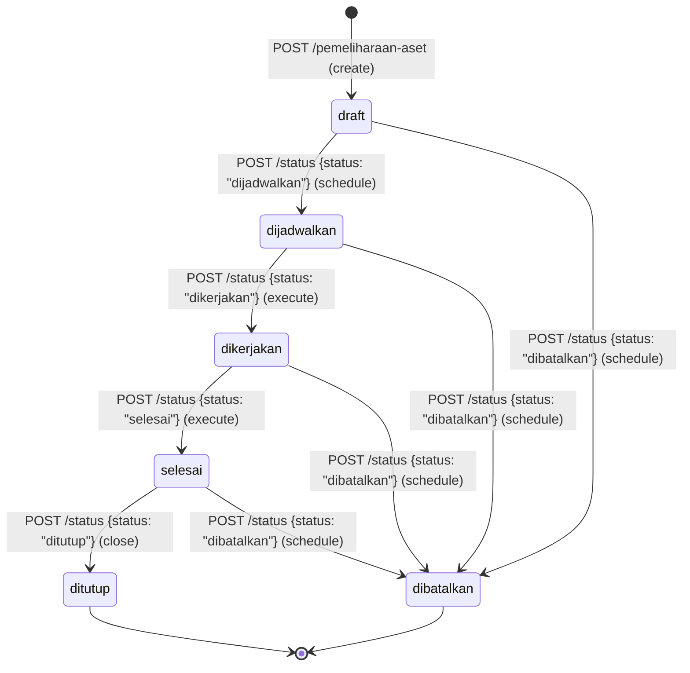
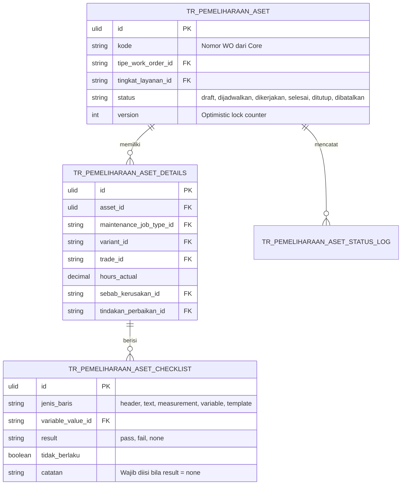

# Pemeliharaan aset

Halaman ini untuk developer. Penyiapannya ada di [Setup maintenance](/apps/management-aset/master/maintenance/) dan master pendukungnya di [Master work order](/apps/management-aset/master/work-order/).

Pemeliharaan aset — di kode disebut **work order** — adalah dokumen satu pekerjaan pada satu aset: apa yang dikerjakan, siapa yang mengerjakan, apa yang diperiksa, dan bagaimana hasilnya.



## Status dan siapa yang boleh memindahkannya

Berbeda dari aset, status work order **tidak disebar sebagai pemeriksaan di controller**. Seluruh grafik transisi dikumpulkan di satu kelas, `WorkOrderStatus`.

Alasannya ada di komentar kelas itu: work order berpindah tangan antar peran. Perencana menjadwalkan, teknisi mengerjakan, penyelia menutup. Kalau daftar transisi dan hak yang menjaganya tersebar di banyak tempat, satu jalur transisi pasti terlewat dan status bisa dilompati.

| Dari | Ke | Dijaga permission | Keterangan |
| --- | --- | --- | --- |
| `draft` | `dijadwalkan` | `schedule` | Perencana menetapkan waktu dan menugaskan teknisi |
| `draft` | `dibatalkan` | `schedule` | Rencana pekerjaan dibatalkan sebelum dimulai |
| `dijadwalkan` | `dikerjakan` | `execute` | Teknisi mulai melakukan pekerjaan fisik |
| `dijadwalkan` | `dibatalkan` | `schedule` | Dibatalkan oleh perencana/koordinator |
| `dikerjakan` | `selesai` | `execute` | Teknisi menyelesaikan checklist dan mencatat hasil |
| `dikerjakan` | `dibatalkan` | `schedule` | Dibatalkan di tengah pengerjaan |
| `selesai` | `ditutup` | `close` | Penyelia memverifikasi dan mengunci permanen |
| `selesai` | `dibatalkan` | `schedule` | Pekerjaan dibatalkan saat verifikasi akhir |

`ditutup` dan `dibatalkan` adalah status akhir. Dokumen di status ini tidak bisa diubah, tidak bisa berpindah status lagi, dan tidak bisa diarsipkan jadi status lain.

**Perhatikan pembatalan dijaga `schedule`, bukan `update` atau `execute`.** Teknisi yang hanya boleh mengerjakan tidak boleh membatalkan pekerjaannya sendiri — membatalkan pekerjaan yang sudah berjalan adalah keputusan penjadwalan/manajerial, bukan penyuntingan dokumen teknis.

---

## Struktur Data Work Order

Satu work order membawahi banyak baris pekerjaan (*job lines*), dan setiap baris pekerjaan dapat memiliki daftar pemeriksaan (*checklist*) tersendiri:



---

## Endpoint

| Endpoint | Gunanya |
| --- | --- |
| `GET /api/modules/management-aset/v1/pemeliharaan-aset` | Daftar work order, mendukung `?status=`, `?q=`, dan pagination |
| `GET /api/modules/management-aset/v1/pemeliharaan-aset/saya` | Daftar pekerjaan yang ditugaskan ke pengguna yang sedang login |
| `POST /api/modules/management-aset/v1/pemeliharaan-aset` | Membuat work order baru beserta baris pekerjaannya |
| `GET /api/modules/management-aset/v1/pemeliharaan-aset/{id}` | Detail work order, baris pekerjaan, checklist, dan status log |
| `PATCH /api/modules/management-aset/v1/pemeliharaan-aset/{id}` | Mengubah isi work order (hanya untuk status `draft`) |
| `DELETE /api/v1/pemeliharaan-aset/{id}` | Menghapus dokumen, hanya untuk `draft` dan `dibatalkan` |
| `POST /api/modules/management-aset/v1/pemeliharaan-aset/{id}/status` | Memindahkan status (misal `draft` $\rightarrow$ `dijadwalkan`) |
| `GET /api/modules/management-aset/v1/pemeliharaan-aset/{id}/jobs/{jobId}/checklist` | Membaca daftar checklist pada satu baris pekerjaan |
| `PUT /api/modules/management-aset/v1/pemeliharaan-aset/{id}/jobs/{jobId}/checklist` | Mengisi dan menyimpan jawaban checklist |
| `PATCH /api/modules/management-aset/v1/pemeliharaan-aset/{id}/jobs/{jobId}/execution` | Menyimpan hasil pelaksanaan (sebab kerusakan & tindakan) |
| `POST /api/modules/management-aset/v1/pemeliharaan-aset/{id}/jobs/{jobId}/checklist/dari-template` | Mengisi checklist dari template yang dipilih |

---

## Contoh Permintaan dan Respons

### 1. Membuat Work Order Baru

Wajib membawa header `Idempotency-Key` dan permission `management-aset.pemeliharaan-aset.create`.

```http
POST /api/modules/management-aset/v1/pemeliharaan-aset HTTP/1.1
Host: localhost:8000
Idempotency-Key: 9b1deb4d-3b7d-4bad-9bdd-2b0d7b3dcb6d
Content-Type: application/json

{
  "tipe_work_order_id": "01JMB8W3Z9E4T0K1M9P5A2Q3R1",
  "tingkat_layanan_id": "01JMB8W4A1B2C3D4E5F6G7H8J9",
  "deskripsi": "Perbaikan pompa pendingin ruang server",
  "jobs": [
    {
      "asset_id": "01JMB8W2X5N8V1B7K3P9M0Q2W4",
      "maintenance_job_type_id": "01JMB8W5P8Q7R6S5T4U3V2W1X0",
      "variant_id": "01JMB8W6M1N2P3Q4R5S6T7U8V9",
      "trade_id": "01JMB8W7A9B8C7D6E5F4G3H2J1",
      "estimated_hours": 2.5,
      "worker_id": "01JMB8W8K2L3M4N5P6Q7R8S9T0"
    }
  ]
}
```

### 2. Memindahkan Status Work Order

```http
POST /api/modules/management-aset/v1/pemeliharaan-aset/01JMB8W9A1B2C3D4E5F6G7H8J9/status HTTP/1.1
Host: localhost:8000
Content-Type: application/json

{
  "target_status": "dijadwalkan",
  "version": 1
}
```

### 3. Mengisi Checklist Baris Pekerjaan

Ketika teknisi memilih nilai variabel yang menghasilkan `result: "none"` (**Tidak dinilai**), kolom `catatan` **wajib** diisi dengan alasan kenapa item tersebut tidak dapat dinilai.

```http
PUT /api/modules/management-aset/v1/pemeliharaan-aset/01JMB8W9A1B2C3D4E5F6G7H8J9/jobs/01JMB8W9JOB123/checklist HTTP/1.1
Host: localhost:8000
Content-Type: application/json

{
  "items": [
    {
      "id": "01JMB8W9CHK001",
      "variable_value_id": "01JMB8W9VAL_PASS",
      "catatan": null,
      "tidak_berlaku": false
    },
    {
      "id": "01JMB8W9CHK002",
      "variable_value_id": "01JMB8W9VAL_NONE",
      "catatan": "Sensor suhu terhalang cover tambahan, tidak dapat diukur langsung.",
      "tidak_berlaku": false
    }
  ]
}
```

### 4. Menyimpan Pelaksanaan Pekerjaan (Sebab & Tindakan)

```http
PATCH /api/modules/management-aset/v1/pemeliharaan-aset/01JMB8W9A1B2C3D4E5F6G7H8J9/jobs/01JMB8W9JOB123/execution HTTP/1.1
Host: localhost:8000
Content-Type: application/json

{
  "sebab_kerusakan_id": "01JMB8W9SEB001",
  "sebab_keterangan": "Bantalan aus akibat pelumasan berkurang",
  "tindakan_perbaikan_id": "01JMB8W9TIN001",
  "tindakan_keterangan": "Penggantian bearing dan injeksi pelumas baru",
  "hours_actual": 3.0
}
```

---

## Layar dan Navigasi

Daftar dan rincian adalah dua halaman dengan alamat hash masing-masing:

| Alamat | Yang terbuka | Komponen UI |
| --- | --- | --- |
| `#/pemeliharaan-aset` | Daftar seluruh work order | `WorkOrderListPage` |
| `#/pemeliharaan-aset/saya` | Daftar pekerjaan milik pengguna yang login | `WorkOrderListPage` (tab filter saya) |
| `#/pemeliharaan-aset/baru` | Form pembuatan work order baru | `WorkOrderDetailPage` (`mode: create`) |
| `#/pemeliharaan-aset/<id>` | Rincian work order, mode baca | `WorkOrderDetailPage` (`mode: view`) |
| `#/pemeliharaan-aset/<id>/ubah` | Rincian work order, mode sunting | `WorkOrderDetailPage` (`mode: edit`) |
| `#/pemeliharaan-aset/<id>/checklist/<jobId>` | Rincian dengan drawer checklist terbuka | `WorkOrderDetailPage` |
| `#/validasi-status-work-order` | Matriks aturan transisi status | `StatusValidationPage` |

Karena mode dan checklist yang terbuka dibaca dari alamat URL, tombol kembali peramban (*back button*) membatalkan sunting alih-alih melompat keluar dari aplikasi, dan tautan yang disalin ke rekan kerja mendarat di work order yang sama.

### Seksi pada Layar Rincian (`WorkOrderDetailPage`)

1. **Header & Aksi Transisi Status**: Menampilkan nomor work order, badge status, dan tombol aksi transisi status sesuai hak yang dimiliki pengguna. Tombol berada di `@apperp/ui/record-action-bar` agar tetap terlihat saat formulir digulir.
2. **Informasi Utama**: Tipe work order, tingkat layanan, dan batas satu pekerja.
3. **Daftar Baris Pekerjaan (*Job Lines*)**:
   - Pencarian dan pemilihan aset (dengan auto-filter aset aktif).
   - Dropdown bertingkat: memilih Jenis Pekerjaan memuat pilihan Varian interval yang berlaku.
   - Bidang keahlian (*trade*), estimasi jam kerja, dan teknisi pelaksana.
   - Tombol **Checklist** yang membuka drawer pengisian pemeriksaan per baris pekerjaan.
4. **Form Pelaksanaan & Penutupan**: Pengisian sebab kerusakan dan tindakan perbaikan. Jika master sebab/tindakan memiliki flag `minta_keterangan: true`, kolom teks penjelasan wajib diisi teknisi.
5. **Riwayat Status (*Status Log*)**: Menampilkan kronologi perpindahan status, waktu, dan pelaku pemindahan.

---

## Aturan Validasi Status (`StatusValidationPage`)

Peralihan status dijaga oleh matriks aturan di `aset_m_validasi_status_work_order`. Tenant dapat mengatur tingkat keparahan untuk tiap aturan:

| Tingkat Keparahan | Perilaku saat Validasi Gagal |
| --- | --- |
| `informasi` | Hanya dicatat sebagai log, transisi tetap berjalan |
| `peringatan` | Peringatan tampil ke pengguna, transisi tetap diizinkan dan dicatat di status log |
| `galat` | **Memblokir transisi status** sampai syarat terpenuhi |

Contoh aturan yang diperiksa saat menuju status `selesai`:
- Seluruh checklist wajib harus sudah terisi.
- Baris pekerjaan harus memiliki sebab kerusakan dan tindakan perbaikan.
- Jam kerja aktual (`hours_actual`) harus lebih besar dari 0.

---

## Aturan yang Dijaga

**Isi hanya bisa disunting pada status draft.** Diperiksa lewat `WorkOrderStatus::dapatDisunting()`, bukan daftar status yang ditulis ulang di tiap endpoint.

**Menghapus hanya boleh untuk `draft` dan `dibatalkan`.** Pekerjaan yang sudah dijadwalkan sudah jadi komitmen ke pihak lain; dokumen dibatalkan, bukan dihilangkan.

**Perubahan memakai penanda versi (*Optimistic Lock*).** Kolom `version` dikirim saat update/transisi status. Kalau dokumen sudah berubah sejak terakhir dibaca, permintaan ditolak dengan pesan versi basi. Dua orang yang membuka pekerjaan yang sama tidak saling menimpa perubahan tanpa sadar.

**Checklist dari template dimekarkan saat diisi**, bukan disalin saat template dibuat. Memperbaiki template di master langsung memperbarui isian pekerjaan yang baru dibuka, tanpa merusak data checklist yang sudah pernah disimpan sebelumnya.

**Logika Penilaian Hasil Checklist:**
- Satu saja baris bernilai `fail` $\rightarrow$ Hasil pekerjaan menjadi `gagal`.
- Tidak ada `fail`, tetapi ada baris bernilai `none` $\rightarrow$ Hasil pekerjaan menjadi `tidak_dinilai`.
- Seluruh baris yang berlaku bernilai `pass` $\rightarrow$ Hasil pekerjaan menjadi `lulus`.
- Baris yang ditandai `tidak_berlaku: true` diabaikan dari kalkulasi kelulusan.

---

## Di mana kodenya

| Berkas | Isinya |
| --- | --- |
| `src/Support/WorkOrderStatus.php` | Grafik transisi dan hak penjaganya |
| `src/Http/Controllers/transaksi/PemeliharaanAset/PemeliharaanAsetController.php` | Dokumen work order dan CRUD baris pekerjaan |
| `src/Http/Controllers/transaksi/PemeliharaanAset/PelaksanaanController.php` | Pengisian checklist, pemekaran template, dan eksekusi |
| `src/Http/Controllers/master/ValidasiStatusWorkOrderController.php` | Controller matriks validasi status |
| `ui/transactions/pemeliharaan-aset/WorkOrderPage.tsx` | Router hash pemilih tampilan |
| `ui/transactions/pemeliharaan-aset/WorkOrderListPage.tsx` | Layar daftar work order dan tab Pekerjaan Saya |
| `ui/transactions/pemeliharaan-aset/WorkOrderDetailPage.tsx` | Layar detail, form job lines, dan drawer checklist |
| `ui/transactions/pemeliharaan-aset/StatusValidationPage.tsx` | Layar konfigurasi matriks validasi status |
| `ui/transactions/pemeliharaan-aset/workOrder.tsx` | Tipe data TypeScript, helper route, dan badge status |
| `database/migrations/2026_08_15_110000_create_work_order_tables.php` | Skema database tabel work order |
| `tests/Feature/WorkOrderTest.php`, `WorkOrderExecutionTest.php` | Pengujian fitur dan konkurensi |

---

## Halaman terkait

- [Setup maintenance](/apps/management-aset/master/maintenance/) — tipe pekerjaan, varian, template checklist
- [Master work order](/apps/management-aset/master/work-order/) — tingkat layanan, trade, validasi status
- [Register aset](/apps/management-aset/transaction/register-aset/) — aset yang dikerjakan
- [Identity dan access](/dev/09-identity-and-access) — permission dan duty
