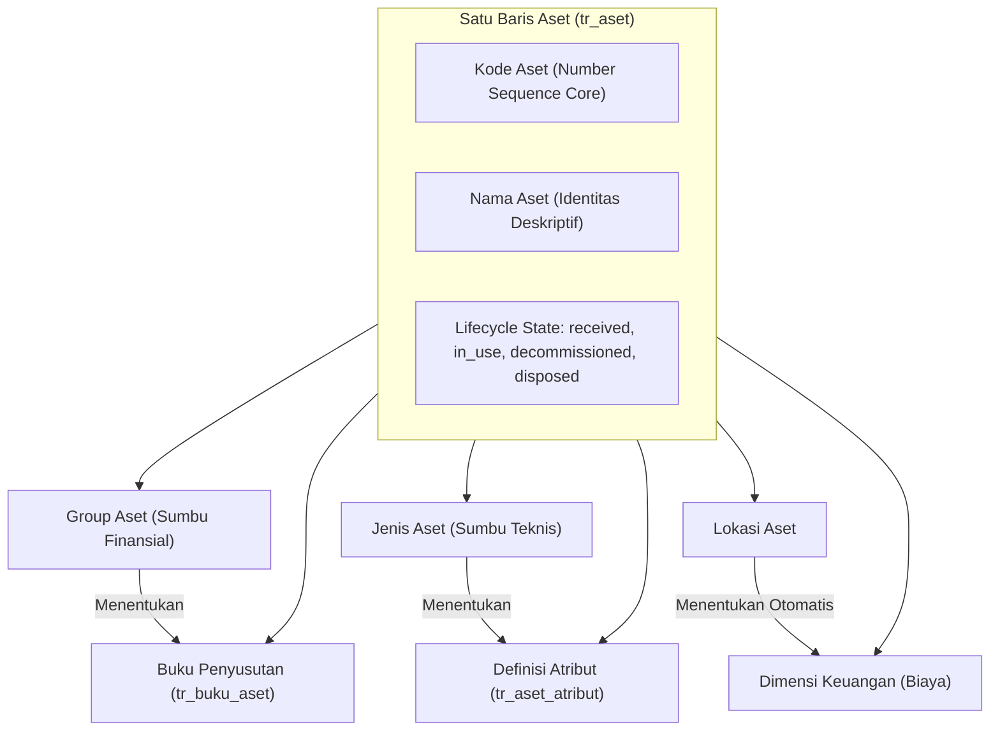
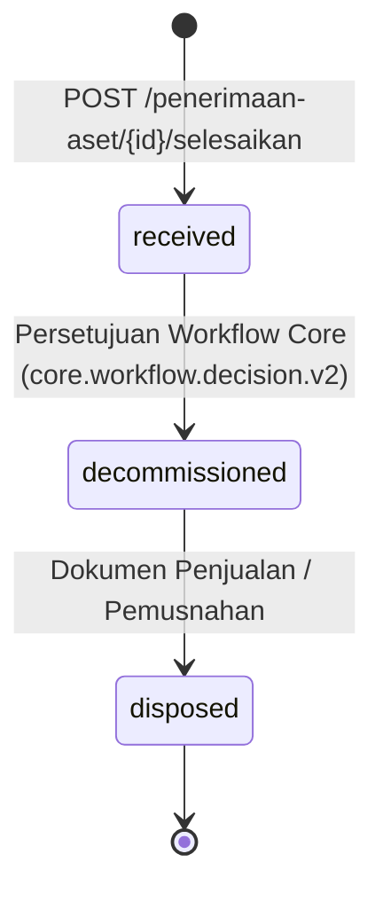
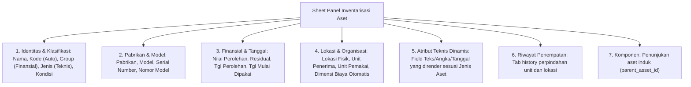

# Register aset

Halaman ini untuk developer. Isinya bukan cara memakai layar, melainkan cara kerja register aset di dalam: data apa yang disimpan, aturan mana yang dijaga kode, dan kenapa aturannya begitu.

Di menu modul, layarnya bernama **Inventarisasi aset** dan jalurnya `/management-aset/inventarisasi-aset` — id entri menu pada `app.yaml` sekaligus jalur rutenya. Nama "register aset" dipakai di sini dan di kode untuk datanya, bukan untuk layarnya.

Register aset adalah **catatan satu barang fisik milik perusahaan**, sejak diterima sampai dilepas. Satu baris di sini mewakili satu benda nyata: satu mesin, satu mobil, satu laptop. Bukan stok, bukan kuantitas agregat — kalau perusahaan membeli sepuluh laptop yang sama, ada sepuluh baris record.



---

## Dua sumbu klasifikasi, dan kenapa keduanya wajib

Ini konsep paling penting di modul ini. Setiap aset menunjuk **dua** master sekaligus, dan keduanya tidak saling menyaring:

| Sumbu | Kolom | Menentukan |
| --- | --- | --- |
| **Group aset** | `group_aset_id` | Perlakuan uang: buku penyusutan, kelompok harta fiskal, pembebanan |
| **Jenis aset** | `jenis_aset_id` | Perlakuan teknis: atribut apa yang harus diisi, pekerjaan maintenance apa yang berlaku |

Dua mobil bisa berada di group yang sama (disusutkan dengan metode yang sama) tetapi jenis yang berbeda (yang satu truk butuh catatan tonase dan kilometer, yang lain mobil dinas tidak). Sebaliknya juga bisa.

Karena itu **memilih group tidak mempersempit pilihan jenis**, dan sebaliknya. Kalau Anda melihat kode yang menyaring salah satu berdasarkan yang lain, itu bug.

Dulu keduanya tersusun sebagai rantai `group → kategori → jenis`. Susunan itu sudah dibongkar mengikuti model Dynamics 365 F&O; sekarang keduanya ditunjuk langsung dari aset secara datar dan sejajar.

---

## Perjalanan hidup satu aset

Kolomnya `lifecycle_state`. Tiga nilai yang hidup, dan hanya kode tertentu yang boleh mengubahnya:



| Status | Artinya | Diubah oleh |
| --- | --- | --- |
| `received` | Sudah tercatat sebagai aset | Otomatis saat aset dibuat |
| `decommissioned` | Disetujui untuk dihentikan pemakaiannya | Keputusan workflow dari Core |
| `disposed` | Sudah dijual atau dimusnahkan | Dokumen penjualan / pemusnahan |

::: warning `in_use` tidak lagi ditulis
Sampai 17 September 2026 ada nilai keempat, `in_use`, dan diagram di halaman ini menggambarkan `in_use --> decommissioned` seolah aset harus dipakai dulu sebelum boleh didekomisioning. **Itu tidak pernah benar.** Tidak satu pun pemeriksaan di kode menyebut `in_use`; ketujuh pembaca `lifecycle_state` hanya menanyakan `decommissioned` atau `disposed`, dan aset `received` selalu bisa langsung didekomisioning.

Yang menulis `in_use` hanya `POST /aset/{id}/penempatan`, sehingga nilainya juga terbalik dari namanya: aset yang dipakai harian tetapi tidak pernah dimutasi selamanya `received`, sedangkan aset yang dimutasi ke gudang penyimpanan berlabel "Digunakan". Endpoint itu dan penulisan `in_use` sama-sama dibuang.

Pertanyaan "aset ini sudah dipakai atau belum" dijawab `placed_in_service_on`, yang memang dibaca — ia menentukan `depreciation_start_on` tiap buku. Baris lama yang terlanjur bernilai `in_use` dibiarkan apa adanya dan tetap punya labelnya di layar.
:::

Arahnya satu jalan. Yang perlu diingat saat menulis kode baru:
- Aset `decommissioned` atau `disposed` **tidak bisa dimutasi** lagi.
- Aset `disposed` **tidak bisa diubah** sama sekali.
- Aset baru bisa dijual atau dimusnahkan **setelah** statusnya `decommissioned`. Persetujuan tidak bisa dilangkahi.

Status `decommissioned` tidak diputuskan app ini. Ia datang dari keputusan workflow milik Core lewat event bertanda tangan `core.workflow.decision.v2`.

---

## Data yang disimpan

Tabel utamanya `aset_tr_aset`, dan model PHP-nya `Aset`. Sampai 18 September 2026 tabel itu bernama `aset_tr_penerimaan_aset`: namanya menyebut kejadian penerimaannya, bukan asetnya. Nama itu kini dipakai dokumen penerimaan yang memang berhak atasnya, dan registernya memakai nama bendanya.

Kolom yang perlu Anda kenali:

| Kolom | Isi |
| --- | --- |
| `kode` | Nomor aset. Diterbitkan Core, tidak pernah dibuat app ini |
| `nama` | Nama yang menjelaskan benda nyata, misalnya "Mesin Bubut CNC Lathe 2000". Wajib diisi saat penerimaan dan boleh dikoreksi |
| `legal_entity_id` | Badan hukum pemilik. Menentukan tahun buku dan penyusutan |
| `responsible_org_unit_id` | Unit kerja penanggung jawab sekarang. Ikut berubah saat mutasi |
| `financial_dimension_org_unit_id` | Unit yang menanggung biayanya. Diambil dari lokasi kalau lokasinya dipetakan, kalau tidak ikut unit pemakai |
| `kelompok_harta_fiskal_id` | Kelompok pajak. **Disalin** dari group saat penerimaan |
| `parent_asset_id` | Induk, kalau aset ini komponen dari aset lain |
| `acquired_on` | Tanggal diterima |
| `placed_in_service_on` | Tanggal mulai dipakai. Ini yang jadi dasar hitungan penyusutan |
| `acquisition_value` | Nilai perolehan |

Tabel pendukung:

| Tabel | Isi |
| --- | --- |
| `aset_tr_penempatan_aset` | Riwayat penempatan. Satu baris per perpindahan, tidak pernah ditimpa |
| `aset_tr_aset_atribut` | Nilai atribut teknis dinamis milik aset ini |
| `aset_tr_buku_aset` | Buku penyusutan yang dibentuk otomatis saat aset dibuat |

---

## Endpoint

Semuanya di bawah `/api/v1`:

| Endpoint | Gunanya | Permission |
| --- | --- | --- |
| `GET /aset` | Daftar aset, mendukung `?q=` (kode, nama, serial), filter status | `aset.read` |
| `POST /penerimaan-aset` | Draf dokumen penerimaan (wajib `Idempotency-Key`) | `penerimaan-aset.create` |
| `POST /penerimaan-aset/{id}/selesaikan` | Melahirkan asetnya; satu unit satu aset bernomor | `aset.create` |
| `GET /penerimaan-aset/{id}/ringkasan` | Berapa aset yang akan lahir, dan mana yang tak akan disusutkan | `penerimaan-aset.read` |
| `GET /penerimaan-aset/{id}/pratinjau-posting` | Jurnal perolehan yang akan terbit, masalahnya, dan hal yang menolak penyelesaian | `penerimaan-aset.read` |
| `GET /penerimaan-aset/vendor?legal_entity_id=` | Vendor aktif entitas legal itu, untuk pemilih vendor | `penerimaan-aset.read` |
| `PUT /penerimaan-aset/{id}/aset` | Mengisi nomor seri seluruh aset dokumen sekaligus | `aset.update` |
| `GET /aset/{id}` | Detail aset lengkap dengan nilai atribut dan bukunya | `aset.read` |
| `PATCH /aset/{id}` | Koreksi data aset | `aset.update` |
| `GET /aset/{id}/history` | Riwayat penempatan dan mutasi | `aset.read` |
| `POST /mutasi-aset/{id}/selesaikan` | Memindahkan aset ke lokasi atau unit lain | `aset.mutate` |

---

## Contoh Permintaan dan Respons

### 1. Menerima Aset: Satu Dokumen, Dua Puluh Kursi

Dua langkah, seperti mutasi: susun dokumennya, lalu selesaikan. Draf belum melahirkan aset
apa pun, dan itulah kesempatan terakhir memperbaikinya — nomor aset tidak dapat ditarik
kembali setelah terbit.

Nilai diisi **per unit**, bukan total. Ambang kapitalisasi dibandingkan terhadap nilai satu
aset: dua puluh kursi lima ratus ribu tidak melewati ambang sepuluh juta hanya karena datang
bersamaan.

```http
POST /api/modules/management-aset/v1/penerimaan-aset HTTP/1.1
Host: localhost:8000
Idempotency-Key: f47ac10b-58cc-4372-a567-0e02b2c3d479
Content-Type: application/json

{
  "legal_entity_id": "01JMB8LE0001",
  "responsible_org_unit_id": "01JMB8W8K2L3M4N5P6Q7R8S9T0",
  "tanggal": "2026-03-01",
  "tanggal_siap_pakai": "2026-03-15",
  "lokasi_aset_id": "01JMB8W9A1B2C3D4E5F6G7H8J9",
  "currency_code": "IDR",
  "details": [
    {
      "nama": "Kursi tunggu tiga dudukan",
      "group_aset_id": "01JMB8W3Z9E4T0K1M9P5A2Q3R1",
      "jenis_aset_id": "01JMB8W4A1B2C3D4E5F6G7H8J9",
      "jumlah": 20,
      "nilai_per_unit": 500000.00,
      "residu_per_unit": 0
    },
    {
      "nama": "Generator Diesel 50kVA Cummins",
      "group_aset_id": "01JMB8W3Z9E4T0K1M9P5A2Q3R1",
      "jenis_aset_id": "01JMB8W4A1B2C3D4E5F6G7H8J9",
      "pabrikan_aset_id": "01JMB8W6M1N2P3Q4R5S6T7U8V9",
      "model_aset_id": "01JMB8W7A9B8C7D6E5F4G3H2J1",
      "jumlah": 1,
      "nilai_per_unit": 150000000.00,
      "residu_per_unit": 15000000.00,
      "atribut": [
        { "tipe_atribut_id": "01JMB8ATRIB001", "nilai": 50.0 },
        { "tipe_atribut_id": "01JMB8ATRIB002", "nilai": "Solar / HSD" }
      ]
    }
  ]
}
```

Lalu diselesaikan. Dua puluh satu aset lahir, masing-masing dengan kodenya sendiri dari
number sequence `management-aset.aset` — bukan diturunkan dari nomor dokumen, karena kode
aset adalah kunci alami yang dipakai seumur hidup aset dan tidak boleh bergantung pada
dokumen yang masih dapat dikoreksi.

```http
POST /api/modules/management-aset/v1/penerimaan-aset/01JMB8PNR0001/selesaikan HTTP/1.1
Content-Type: application/json

{ "version": 1 }
```

Nomor seri sengaja kosong saat penerimaan — kardusnya belum dibuka. Ia diisi sesudahnya,
sekaligus untuk seluruh dokumen:

```http
PUT /api/modules/management-aset/v1/penerimaan-aset/01JMB8PNR0001/aset HTTP/1.1
Content-Type: application/json

{
  "serial": [
    { "aset_id": "01JMB8AST0001", "serial_number": "CUM-2026-99182" },
    { "aset_id": "01JMB8AST0002", "serial_number": null }
  ]
}
```

### 2. Memindahkan / Mutasi Aset

Dua langkah: susun berita acaranya, lalu selesaikan serah terimanya. Draf belum memindahkan apa pun.

```http
POST /api/modules/management-aset/v1/mutasi-aset HTTP/1.1
Host: localhost:8000
Content-Type: application/json
Idempotency-Key: 6f1a2b3c-4d5e-6f70-8192-a3b4c5d6e7f8

{
  "legal_entity_id": "01JMB8LE_METTA",
  "responsible_org_unit_id": "01JMB8ORG_ENGINEER",
  "tanggal": "2026-06-01",
  "tujuan_lokasi_id": "01JMB8LOC_GEDUNG_B",
  "tujuan_org_unit_id": "01JMB8ORG_MAINTENANCE",
  "diserahkan_oleh_user_id": "01JMB8USR_EVA",
  "diterima_oleh_user_id": "01JMB8USR_DIVA",
  "alasan": "Relokasi ke Gedung Workshop B",
  "details": [
    { "asset_id": "01JMB8W9A1B2C3D4E5F6G7H8J9" }
  ]
}
```

```http
POST /api/modules/management-aset/v1/mutasi-aset/01JMB8MUT0001/selesaikan HTTP/1.1
Host: localhost:8000
Content-Type: application/json

{ "version": 1 }
```

Lokasi asal tidak dikirim: ia dibaca dari asetnya dan dibekukan pada baris dokumen saat serah terima diselesaikan.

---

## Layar dan Struktur Form (`AssetPage.tsx`)

Layar utama menampilkan tabel daftar aset dengan pencarian cepat dan Sheet formulir yang memiliki seksi ber-accordion:



---

## Hak akses dan Batas Tanggung Jawab

| Permission | Untuk |
| --- | --- |
| `management-aset.aset.read` | Melihat daftar dan detail |
| `management-aset.aset.create` | Menerima aset baru |
| `management-aset.aset.update` | Mengoreksi data |
| `management-aset.aset.mutate` | Memindahkan ke unit atau lokasi lain |

Punya permission belum cukup. Setiap pembacaan dan penulisan aset masih disaring lagi lewat `OrganizationScope`, memakai kebijakan `management-aset.asset-responsibility`.

Core menyusun daftar badan hukum dan unit kerja yang boleh diakses pengguna, dan modul membacanya lewat kontrak `KonteksPermintaan`. Kueri disaring berdasarkan daftar itu. Dua orang dengan permission yang sama persis tetap melihat daftar aset yang berbeda sesuai unit kerja mereka. **Jangan pernah mempercayai id organisasi yang dikirim dari browser.**

---

## Jurnal perolehan

Menyelesaikan penerimaan juga menerbitkan jurnal perolehan `asset.acquisition` ke [feed posting finance](/dev/34-feed-posting-finance), **di transaksi yang sama** dengan asetnya (`Services/AcquisitionPosting`, TODO 9.4). Penerimaan yang gagal tidak meninggalkan posting, dan penerimaan yang selesai pasti punya posting. `posting_id`-nya `AST-ACQ-<id penerimaan>`, jadi percobaan ulang tidak menerbitkan posting kedua.

| Baris | Akun dari posting group | Nilai |
| --- | --- | --- |
| Debit, per group dan unit dimensi | Harga perolehan | Jumlah nilai baris penerimaan |
| Debit, per group dan unit dimensi, bila ada PPN | PPN Masukan | Jumlah PPN baris penerimaan |
| Kredit, per group dan unit dimensi | Lawan hutang (`direct_payable`), perantara (`clearing`), atau lawan hibah (`hibah`) | Nilai + PPN |

Kepala dokumen membawa **cara perolehan** (`pembelian` bawaan, atau `hibah`), **vendor** milik Core, **nomor dan tanggal faktur vendor**; baris membawa **PPN per unit**. `posting_date` adalah tanggal terima, `document_date` tanggal faktur bila diisi, `occurred_at` jam penyelesaian.

**Pembulatan di sumber, dan register sama persis dengan jurnal** (K-20). Harga satuan dan PPN per unit boleh memakai presisi harga satuan mata uangnya (IDR bawaan 3 desimal). Nilai baris = bulat(harga satuan × jumlah) ke presisi nilai (IDR bawaan 2 desimal), dan nilai tiap aset adalah pembagian nilai yang sudah bulat itu: sisa pembulatannya dibagikan satu sen ke aset pertama. Tiga kursi × 333.333,333 menjadi 1.000.000,00 di jurnal dan 333.333,34 + 333.333,33 + 333.333,33 di register. Tanpa pembagian itu, register menjumlah 999.999,99 sementara hutangnya 1.000.000,00, dan selisih satu sen itu tidak pernah hilang.

**Yang menolak penyelesaian**, diperiksa sebelum nomor aset terbit dan ditampilkan lebih dulu di pratinjau:

- **Pembelian tanpa vendor** pada entitas legal bermode `direct_payable`, mode bawaan entitas yang belum disetel (TODO 9.2.1). Pada mode itu posting inilah hutangnya, dan hutang tanpa pemasok tidak dapat dibayar.
- **Group tanpa buku yang di-post ke finance**: semua buku di matriks group × buku memorandum (`posting_layer = none`), atau matriksnya kosong. Mengikuti Dynamics 365 (keputusan pemilik produk, 24 September 2026, K-26): F&O hanya menerima buku berlapisan Current pada purchase order dan vendor invoice dan menghentikan posting bila tidak ada, BC menolak faktur aset yang depreciation book-nya tidak terintegrasi ke G/L. Jurnal perolehan dibuat **sekali per aset**, lewat satu buku yang di-post (`current` lebih dulu), bukan sekali per buku.
- **Mata uang** yang presisinya belum disetel, atau presisi nilainya lebih halus dari dua desimal register aset.

**Yang tidak menolak**: pemetaan akun yang kosong atau nonaktif, dan unit tanpa nomor. Postingnya terbit sebagai `held` dan penerimaannya tetap selesai (K-18); setelah pemetaannya dibenahi, Validasi ulang melepasnya. Penerimaan bernilai nol tidak menerbitkan posting.

`PostingTidakSah` dari Core adalah bug penerbit (K-22): dilaporkan ke pemantauan kesalahan, transaksinya dibatalkan, dan layar menerima 500 `posting_failed` dengan pesan yang dapat dibaca.

## Aturan yang dijaga, dan alasannya

**Group tidak bisa diganti setelah aset dibuat.** Buku penyusutan sudah terbentuk dari matriks group × buku saat penerimaan. Mengganti group berarti bukunya salah tanpa ada yang menyadari. Permintaan yang mencoba mengubahnya ditolak dengan pesan yang menjelaskan alasannya.

**Nama aset wajib, sedangkan kode aset adalah identitas sistem.** Kode diterbitkan Core dan stabil sebagai referensi dokumen. Nama menjelaskan benda yang dilihat petugas di lapangan, sehingga daftar aset dan pencarian tidak memaksa pengguna menghafal kode atau nomor seri.

**Nilai perolehan tidak bisa diubah setelah ada periode penyusutan.** Periode yang sudah jalan dihitung dari nilai itu. Kalau memang harus diubah, periodenya dibalik dulu di modul penyusutan.

**Tanggal mulai dipakai hanya bisa digeser kalau belum ada penyusutan.** Alasannya sama.

**Mengganti jenis aset menghapus semua nilai atributnya.** Atribut milik jenis lama tidak berlaku untuk jenis baru, jadi nilainya wajib dikirim ulang. Kalau tidak dikirim, atributnya kosong — itu disengaja, bukan kehilangan data.

**Aset tidak bisa jadi induk dirinya sendiri.** Diperiksa langsung untuk mencegah circular relationship.

**Model harus cocok dengan jenis dan pabrikannya.** Kalau sebuah jenis aset sudah punya daftar model, hanya model dari daftar itu yang boleh dipilih. Pabrikan pada model harus sama dengan pabrikan pada aset.

**Aset tidak bisa ditempatkan kalau buku penyusutannya belum lengkap.** Saat mutasi pertama, kode memeriksa apakah matriks group × buku sudah terisi dan profil tiap buku yang menghitung bisa dipakai. Kalau belum, mutasi ditolak. Ini sengaja: aset yang sudah `in_use` tetapi bukunya belum benar akan menghasilkan penyusutan yang salah diam-diam.

**Koreksi mengunci baris asetnya.** Satu aset bisa dikoreksi dari beberapa instance API sekaligus; tanpa kunci, penggantian baris atribut bisa saling menyelip di antara hapus dan sisip.

---

## Atribut per jenis aset

Kolom aset sudah tetap, tapi tiap perusahaan punya data tambahan yang berbeda. Itu ditampung lewat atribut empat tabel:
1. `aset_m_tipe_atribut`: Definisi nama, tipe data, dan satuan Core.
2. `aset_m_tipe_atribut_nilai`: Daftar pilihan untuk tipe dropdown.
3. `aset_m_jenis_aset_atribut`: Matriks atribut apa yang berlaku untuk jenis apa, dan mana yang `wajib`.
4. `aset_tr_aset_atribut`: Nilai sebenarnya milik aset, disimpan pada kolom tipe data aslinya (`nilai_text`, `nilai_number`, `nilai_boolean`, `nilai_date`, `tipe_atribut_nilai_id`).

Nilai divalidasi oleh `AssetAttributeValidator`.

---

## Yang datang dari Core

| Hal | Dari mana | Catatan |
| --- | --- | --- |
| Nomor aset (`kode`) | Number Sequence Core | Diminta dengan `legal_entity_id`, karena penomorannya bisa direset per tahun buku |
| Tahun buku | Fiscal calendar Core | Dipakai untuk menentukan periode penyusutan |
| Satuan ukur atribut | Unit of Measure Core | Memastikan standar satuan seragam lintas modul |
| Hak akses dan batas organisasi | Kontrak `KonteksTenant` dan `KonteksPermintaan` | Tidak pernah dibaca dari tabel Core langsung, walau berada di database yang sama |

---

## Di mana kodenya

| Berkas | Isinya |
| --- | --- |
| `src/Http/Controllers/transaksi/InventarisasiAset/AssetController.php` | Register aset, koreksi, dan history |
| `src/Http/Controllers/transaksi/MutasiAset/MutasiAsetController.php` | Dokumen mutasi dan penyelesaian serah terima |
| `src/Models/transaksi/InventarisasiAset/Aset.php` | Model `Aset` (tabel `aset_tr_aset`) |
| `src/Support/OrganizationScope.php` | Penyaringan berdasarkan tanggung jawab organisasi |
| `src/Support/AssetAttributeValidator.php` | Validasi nilai atribut |
| `src/Services/PenerbitNomorAset.php` | Permintaan nomor ke Core |
| `ui/transactions/inventarisasi-aset/AssetPage.tsx` | Layar register aset, tabel, dan Sheet detail |
| `database/migrations/2026_07_28_090000_create_asset_register_and_depreciation_tables.php` | Tabel aset dan penyusutan |
| `database/migrations/2026_08_07_130000_create_asset_attribute_tables.php` | Tabel atribut dinamis |
| `contracts/src/paths/aset.yaml` | Kontrak OpenAPI endpoint aset |

---

## Lihat juga

- [Management Aset](/apps/management-aset/) — gambaran modul dan cara menjalankannya
- [Penempatan dan mutasi](/apps/management-aset/transaction/penempatan/) — proses perpindahan aset
- [Penyusutan: profil, buku, dan matriks](/apps/management-aset/master/depresiasi/) — pembentukan buku aset
- [Standar module](/dev/02-module-standard) — kontrak yang harus dipenuhi setiap app
- [Identity dan access](/dev/09-identity-and-access) — permission, duty, dan scope organisasi
- [Number sequence](/dev/14-number-sequences) — cara nomor diterbitkan
