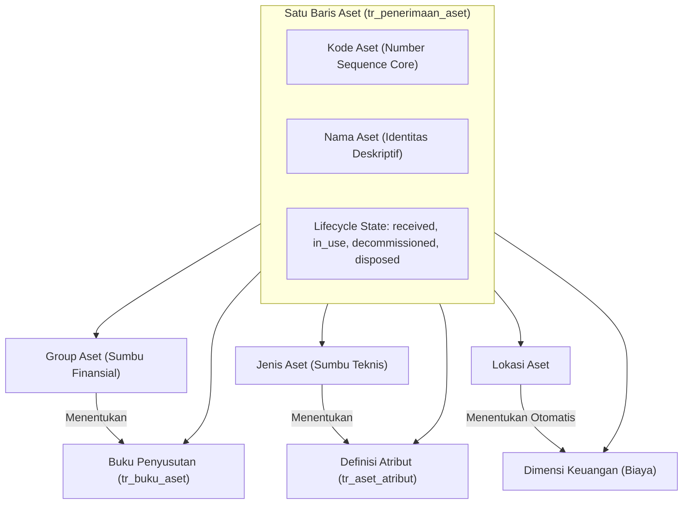
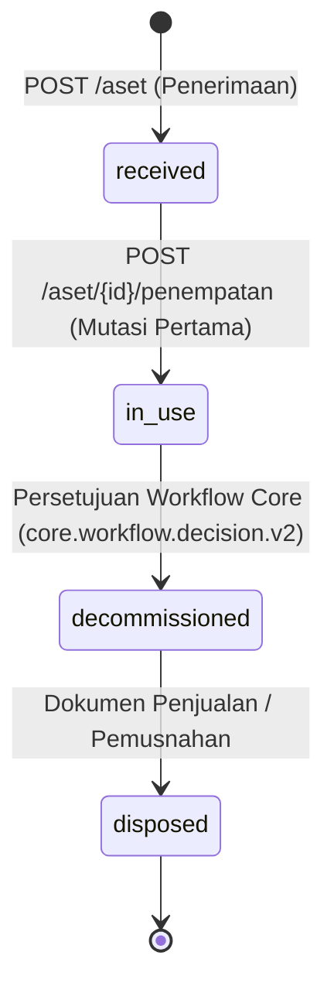
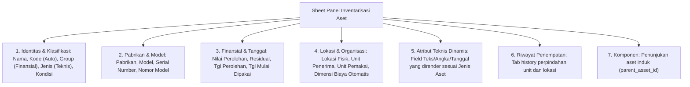

# Register aset

Halaman ini untuk developer. Isinya bukan cara memakai layar, melainkan cara kerja register aset di dalam: data apa yang disimpan, aturan mana yang dijaga kode, dan kenapa aturannya begitu.

Di menu app, layarnya bernama **Inventarisasi aset** (`?view=inventarisasi-aset`). Nama "register aset" dipakai di sini dan di kode untuk datanya, bukan untuk layarnya.

Register aset adalah **catatan satu barang fisik milik perusahaan**, sejak diterima sampai dilepas. Satu baris di sini mewakili satu benda nyata: satu mesin, satu mobil, satu laptop. Bukan stok, bukan kuantitas agregat — kalau perusahaan membeli sepuluh laptop yang sama, ada sepuluh baris record.



---

## Dua sumbu klasifikasi, dan kenapa keduanya wajib

Ini konsep paling penting di modul ini. Setiap aset menunjuk **dua** master sekaligus, dan keduanya tidak saling menyaring:

| Sumbu | Kolom | Menentukan |
| --- | --- | --- |
| **Group aset** | `group_aset_id` | Perlakuan uang: buku penyusutan, kelompok harta fiskal, pembebanan |
| **Jenis aset** | `jenis_aset_id` | Perlakuan teknis: atribut apa yang harus diisi, pekerjaan maintenance apa yang berlaku |

Dua mobil bisa berada di group yang sama (disusutkan dengan metode yang sama) tetapi jenis yang berbeda (yang satu truk butuh catatan tonase dan kilometer, yang lain mobil dinas tidak). Sebaliknya juga bisa.

Karena itu **memilih group tidak mempersempit pilihan jenis**, dan sebaliknya. Kalau Anda melihat kode yang menyaring salah satu berdasarkan yang lain, itu bug.

Dulu keduanya tersusun sebagai rantai `group → kategori → jenis`. Susunan itu sudah dibongkar mengikuti model Dynamics 365 F&O; sekarang keduanya ditunjuk langsung dari aset secara datar dan sejajar.

---

## Perjalanan hidup satu aset

Kolomnya `lifecycle_state`. Hanya empat nilai, dan hanya kode tertentu yang boleh mengubahnya:



| Status | Artinya | Diubah oleh |
| --- | --- | --- |
| `received` | Sudah tercatat, belum ditempatkan | Otomatis saat aset dibuat |
| `in_use` | Sudah ditempatkan di unit kerja dan aktif dipakai | `POST /aset/{id}/penempatan` |
| `decommissioned` | Disetujui untuk dihentikan pemakaiannya | Keputusan workflow dari Core |
| `disposed` | Sudah dijual atau dimusnahkan | Dokumen penjualan / pemusnahan |

Arahnya satu jalan. Yang perlu diingat saat menulis kode baru:
- Aset `decommissioned` atau `disposed` **tidak bisa dimutasi** lagi.
- Aset `disposed` **tidak bisa diubah** sama sekali.
- Aset baru bisa dijual atau dimusnahkan **setelah** statusnya `decommissioned`. Persetujuan tidak bisa dilangkahi.

Status `decommissioned` tidak diputuskan app ini. Ia datang dari keputusan workflow milik Core lewat event bertanda tangan `core.workflow.decision.v2`.

---

## Data yang disimpan

Tabel utamanya `t_aset` (alias `tr_penerimaan_aset`). Model PHP-nya `Asset`.

Kolom yang perlu Anda kenali:

| Kolom | Isi |
| --- | --- |
| `kode` | Nomor aset. Diterbitkan Core, tidak pernah dibuat app ini |
| `nama` | Nama yang menjelaskan benda nyata, misalnya "Mesin Bubut CNC Lathe 2000". Wajib diisi saat penerimaan dan boleh dikoreksi |
| `legal_entity_id` | Badan hukum pemilik. Menentukan tahun buku dan penyusutan |
| `responsible_org_unit_id` | Unit kerja penanggung jawab sekarang. Ikut berubah saat mutasi |
| `financial_dimension_org_unit_id` | Unit yang menanggung biayanya. Diambil dari lokasi kalau lokasinya dipetakan, kalau tidak ikut unit pemakai |
| `kelompok_harta_fiskal_id` | Kelompok pajak. **Disalin** dari group saat penerimaan |
| `parent_asset_id` | Induk, kalau aset ini komponen dari aset lain |
| `acquired_on` | Tanggal diterima |
| `placed_in_service_on` | Tanggal mulai dipakai. Ini yang jadi dasar hitungan penyusutan |
| `acquisition_value` | Nilai perolehan |

Tabel pendukung:

| Tabel | Isi |
| --- | --- |
| `tr_penempatan_aset` | Riwayat penempatan. Satu baris per perpindahan, tidak pernah ditimpa |
| `tr_aset_atribut` | Nilai atribut teknis dinamis milik aset ini |
| `tr_buku_aset` | Buku penyusutan yang dibentuk otomatis saat aset dibuat |

---

## Endpoint

Semuanya di bawah `/api/v1`:

| Endpoint | Gunanya | Permission |
| --- | --- | --- |
| `GET /aset` | Daftar aset, mendukung `?q=` (kode, nama, serial), filter status | `aset.read` |
| `POST /aset` | Menerima aset baru (wajib `Idempotency-Key`) | `aset.create` |
| `GET /aset/{id}` | Detail aset lengkap dengan nilai atribut dan bukunya | `aset.read` |
| `PATCH /aset/{id}` | Koreksi data aset | `aset.update` |
| `GET /aset/{id}/history` | Riwayat penempatan dan mutasi | `aset.read` |
| `POST /aset/{id}/penempatan` | Memindahkan aset ke lokasi atau unit lain | `aset.mutate` |

---

## Contoh Permintaan dan Respons

### 1. Menerima Aset Baru dengan Atribut Dinamis

```http
POST /api/v1/aset HTTP/1.1
Host: localhost:8000
Authorization: Bearer <context_token>
Idempotency-Key: f47ac10b-58cc-4372-a567-0e02b2c3d479
Content-Type: application/json

{
  "nama": "Generator Diesel 50kVA Cummins",
  "group_aset_id": "01JMB8W3Z9E4T0K1M9P5A2Q3R1",
  "jenis_aset_id": "01JMB8W4A1B2C3D4E5F6G7H8J9",
  "kondisi_aset_id": "01JMB8W5P8Q7R6S5T4U3V2W1X0",
  "pabrikan_aset_id": "01JMB8W6M1N2P3Q4R5S6T7U8V9",
  "model_aset_id": "01JMB8W7A9B8C7D6E5F4G3H2J1",
  "serial_number": "CUM-2026-99182",
  "acquired_on": "2026-03-01",
  "placed_in_service_on": "2026-03-15",
  "acquisition_value": 150000000.00,
  "residual_value": 15000000.00,
  "currency_code": "IDR",
  "receiving_org_unit_id": "01JMB8W8K2L3M4N5P6Q7R8S9T0",
  "asset_location_id": "01JMB8W9A1B2C3D4E5F6G7H8J9",
  "atribut": [
    {
      "tipe_atribut_id": "01JMB8ATRIB001",
      "nilai": 50.0
    },
    {
      "tipe_atribut_id": "01JMB8ATRIB002",
      "nilai": "Solar / HSD"
    }
  ]
}
```

### 2. Memindahkan / Mutasi Aset

```http
POST /api/v1/aset/01JMB8W9A1B2C3D4E5F6G7H8J9/penempatan HTTP/1.1
Host: localhost:8000
Authorization: Bearer <context_token>
Content-Type: application/json

{
  "effective_on": "2026-06-01",
  "reason": "Relokasi ke Gedung Workshop B",
  "asset_location_id": "01JMB8LOC_GEDUNG_B",
  "usage_org_unit_id": "01JMB8ORG_MAINTENANCE",
  "receiving_org_unit_id": "01JMB8ORG_MAINTENANCE"
}
```

---

## Layar dan Struktur Form (`AssetPage.tsx`)

Layar utama menampilkan tabel daftar aset dengan pencarian cepat dan Sheet formulir yang memiliki seksi ber-accordion:



---

## Hak akses dan Batas Tanggung Jawab

| Permission | Untuk |
| --- | --- |
| `management-aset.aset.read` | Melihat daftar dan detail |
| `management-aset.aset.create` | Menerima aset baru |
| `management-aset.aset.update` | Mengoreksi data |
| `management-aset.aset.mutate` | Memindahkan ke unit atau lokasi lain |

Punya permission belum cukup. Setiap pembacaan dan penulisan aset masih disaring lagi lewat `OrganizationScope`, memakai kebijakan `management-aset.asset-responsibility`.

Core mengirim daftar badan hukum dan unit kerja yang boleh diakses pengguna di dalam token konteks yang ditandatangani. App menyaring kueri berdasarkan itu. Dua orang dengan permission yang sama persis tetap melihat daftar aset yang berbeda sesuai unit kerja mereka. **Jangan pernah mempercayai id organisasi yang dikirim dari browser.**

---

## Aturan yang dijaga, dan alasannya

**Group tidak bisa diganti setelah aset dibuat.** Buku penyusutan sudah terbentuk dari matriks group × buku saat penerimaan. Mengganti group berarti bukunya salah tanpa ada yang menyadari. Permintaan yang mencoba mengubahnya ditolak dengan pesan yang menjelaskan alasannya.

**Nama aset wajib, sedangkan kode aset adalah identitas sistem.** Kode diterbitkan Core dan stabil sebagai referensi dokumen. Nama menjelaskan benda yang dilihat petugas di lapangan, sehingga daftar aset dan pencarian tidak memaksa pengguna menghafal kode atau nomor seri.

**Nilai perolehan tidak bisa diubah setelah ada periode penyusutan.** Periode yang sudah jalan dihitung dari nilai itu. Kalau memang harus diubah, periodenya dibalik dulu di modul penyusutan.

**Tanggal mulai dipakai hanya bisa digeser kalau belum ada penyusutan.** Alasannya sama.

**Mengganti jenis aset menghapus semua nilai atributnya.** Atribut milik jenis lama tidak berlaku untuk jenis baru, jadi nilainya wajib dikirim ulang. Kalau tidak dikirim, atributnya kosong — itu disengaja, bukan kehilangan data.

**Aset tidak bisa jadi induk dirinya sendiri.** Diperiksa langsung untuk mencegah circular relationship.

**Model harus cocok dengan jenis dan pabrikannya.** Kalau sebuah jenis aset sudah punya daftar model, hanya model dari daftar itu yang boleh dipilih. Pabrikan pada model harus sama dengan pabrikan pada aset.

**Aset tidak bisa ditempatkan kalau buku penyusutannya belum lengkap.** Saat mutasi pertama, kode memeriksa apakah matriks group × buku sudah terisi dan profil tiap buku yang menghitung bisa dipakai. Kalau belum, mutasi ditolak. Ini sengaja: aset yang sudah `in_use` tetapi bukunya belum benar akan menghasilkan penyusutan yang salah diam-diam.

**Koreksi mengunci baris asetnya.** Satu aset bisa dikoreksi dari beberapa instance API sekaligus; tanpa kunci, penggantian baris atribut bisa saling menyelip di antara hapus dan sisip.

---

## Atribut per jenis aset

Kolom aset sudah tetap, tapi tiap perusahaan punya data tambahan yang berbeda. Itu ditampung lewat atribut empat tabel:
1. `m_tipe_atribut`: Definisi nama, tipe data, dan satuan Core.
2. `m_tipe_atribut_nilai`: Daftar pilihan untuk tipe dropdown.
3. `m_jenis_aset_atribut`: Matriks atribut apa yang berlaku untuk jenis apa, dan mana yang `wajib`.
4. `tr_aset_atribut`: Nilai sebenarnya milik aset, disimpan pada kolom tipe data aslinya (`nilai_text`, `nilai_number`, `nilai_boolean`, `nilai_date`, `tipe_atribut_nilai_id`).

Nilai divalidasi oleh `AssetAttributeValidator`.

---

## Yang datang dari Core

| Hal | Dari mana | Catatan |
| --- | --- | --- |
| Nomor aset (`kode`) | Number Sequence Core | Diminta dengan `legal_entity_id`, karena penomorannya bisa direset per tahun buku |
| Tahun buku | Fiscal calendar Core | Dipakai untuk menentukan periode penyusutan |
| Satuan ukur atribut | Unit of Measure Core | Memastikan standar satuan seragam lintas modul |
| Hak akses dan batas organisasi | Token konteks bertanda tangan | Tidak pernah dibaca dari database Core langsung |

---

## Di mana kodenya

| Berkas | Isinya |
| --- | --- |
| `api/app/Http/Controllers/transaksi/InventarisasiAset/AssetController.php` | Seluruh logika register aset, penempatan, dan history |
| `api/app/Models/transaksi/InventarisasiAset/Asset.php` | Model `Asset` (tabel `tr_penerimaan_aset`) |
| `api/app/Support/OrganizationScope.php` | Penyaringan berdasarkan tanggung jawab organisasi |
| `api/app/Support/AssetAttributeValidator.php` | Validasi nilai atribut |
| `api/app/Services/NumberSequenceClient.php` | Permintaan nomor ke Core |
| `ui/src/transactions/inventarisasi-aset/AssetPage.tsx` | Layar register aset, tabel, dan Sheet detail |
| `database/migrations/2026_07_28_090000_create_asset_register_and_depreciation_tables.php` | Tabel aset dan penyusutan |
| `database/migrations/2026_08_07_130000_create_asset_attribute_tables.php` | Tabel atribut dinamis |
| `contracts/src/paths/aset.yaml` | Kontrak OpenAPI endpoint aset |

---

## Lihat juga

- [Management Aset](/apps/management-aset/) — gambaran modul dan cara menjalankannya
- [Penempatan dan mutasi](/apps/management-aset/transaction/penempatan/) — proses perpindahan aset
- [Penyusutan: profil, buku, dan matriks](/apps/management-aset/master/depresiasi/) — pembentukan buku aset
- [Standar module](/dev/02-module-standard) — kontrak yang harus dipenuhi setiap app
- [Identity dan access](/dev/09-identity-and-access) — permission, duty, dan scope organisasi
- [Number sequence](/dev/14-number-sequences) — cara nomor diterbitkan
