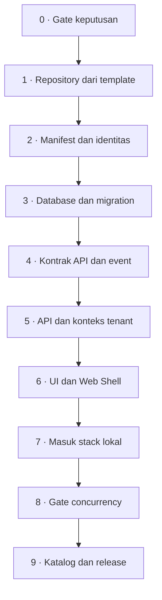

# Membangun app baru

Jalur teknis dari nol sampai app terdaftar di katalog. Sepuluh tahap, masing-masing punya **gate keluar** — syarat yang harus terpenuhi sebelum lanjut.

Urutannya bukan saran. Melompati tahap 0 adalah cara paling umum menghasilkan app yang harus dibongkar ulang.



---

## Sebelum tahap 0: persiapan teknis

**Perkakas dan akses** — semuanya sudah diperlukan sejak hari pertama, bukan nanti:

- Docker Desktop jalan, dan [stack lokal](/onboarding/setup) sudah pernah naik sampai `http://localhost:8000` terbuka
- Akses Bitbucket ke organisasi `metta-development`, termasuk hak membuat repository baru
- PowerShell (skrip stack lokal berbasis PowerShell)
- Node dan PHP **tidak** perlu dipasang di host — semuanya dibangun di Docker

**Orang** — satu app wajib punya **owner** yang bertanggung jawab atas code review, contract, database, release, rollback, dan incident app itu. Tetapkan sebelum repository dibuat, bukan sesudah.

## Konvensi penamaan dan alokasi

Tahap 2, 3, dan 7 memakai tabel ini. Tetapkan seluruh nilainya sekaligus supaya tidak ada yang ditambal belakangan.

| Yang ditetapkan | Pola | Contoh |
| --- | --- | --- |
| ID app (manifest) | `<app-key>`, huruf kecil, tanda hubung | `management-aset` |
| Repository | `app-erp-<app-key>` | `app-erp-procurement` |
| Nama folder lokal | sama dengan repository | `app-erp-procurement` |
| Database app resmi | `app_erp_<app>` | `app_erp_human_resources` |
| Database addon | `addon_<publisher>_<app>` | `addon_apperp_loyalty` |
| Image API | `registry.apperp.local/apps/<app-key>-api:<versi>` | `.../procurement-api:0.1.0` |
| Image UI | `registry.apperp.local/apps/<app-key>-ui:<versi>` | `.../procurement-ui:0.1.0` |
| Service Compose | `<app>-db`, `<app>-api`, `<app>-ui` | `procurement-db` |
| UI entry | `/apps-content/<app-id>/` | `/apps-content/procurement/` |
| Kode keamanan | `<app>.<resource>.<aksi>` | `procurement.purchase-order.read` |
| Channel event | `<app>.<aggregate>.<action>.vN` | `procurement.purchase-order.approved.v1` |

Seluruh kode keamanan **wajib** berawalan ID app — Control Plane menolak registrasi yang tidak.

### Alokasi yang sudah terpakai

Ambil nilai bebas berikutnya, jangan menebak. Sumber kebenarannya `erp-dev/compose.yaml`.

| Port host | Dipakai |
| ---: | --- |
| 8000 | Core app (control plane + shell) |
| 5543 | Core database |
| 5544 | Database Management Aset |
| 18080, 18081 | Stack loadtest Management Aset |
| 18090 | Situs dokumentasi |
| 18091, 18092 | API dan UI Management Aset |
| 18093 | UI Human Resources |

Database app berikutnya mengambil port `localhost` bebas berikutnya pada deret 55xx; API dan UI mengambil deret 180xx berikutnya. Port database **hanya** bind ke `127.0.0.1`.

| ID app terpakai | Database |
| --- | --- |
| `management-aset` | `management_aset` |
| `human-resources` | `app_erp_human_resources` |

::: warning Ketidakkonsistenan yang sudah ada
`management-aset` memakai database bernama `management_aset`, tanpa awalan `app_erp_`, sehingga menyimpang dari pola di [Standar module](/dev/02-module-standard). App baru **tetap memakai pola `app_erp_<app>`** — jangan meniru penyimpangan ini.
:::

## Berkas yang wajib ada di repository app

Repository dianggap lengkap hanya bila seluruh berkas berikut ada dan berisi hal yang sebenarnya:

| Berkas | Keterangan |
| --- | --- |
| `app.yaml` | Manifest: identitas, database, navigasi, empat lapis keamanan, reference nomor, data policy, tipe workflow |
| `api/` | Service API beserta `Dockerfile` |
| `ui/` | Artifact UI beserta `Dockerfile` |
| `database/migrations/` | Migration app; wajib ikut dalam build context image API |
| `contracts/openapi.yaml` | Kontrak endpoint sync |
| `contracts/asyncapi.yaml` | Kontrak event yang benar-benar dipublikasi |
| `deploy/compose.fragment.yaml` | Definisi service untuk bundle release, termasuk service database |
| `deploy/migrate.sh` | Dibawa image API sebagai `/coreerp/migrate.sh`; dijalankan worker sebelum API dan UI dinyalakan |
| `api/tests/Feature/` | Test yang menjaga batas tenant, permission, dan asal nomor |
| `loadtest/` | Stack gate concurrency |
| `README.md` | Domain, master, alur, dan batas versi |

Dockerfile, `.dockerignore`, deploy definition, migration, dan contract adalah bagian repository app — di-commit bersama app, bukan disimpan di CoreERP.

---

## 0 · Gate keputusan

**Sebelum satu baris kode.** Cari padanan resmi di Microsoft Learn Dynamics 365, lalu buat proposal keputusan yang menetapkan:

- pemilik data dan lifecycle-nya
- scope organisasi yang berlaku
- keamanan: entry point, permission, privilege, duty
- nomor: entitas mana yang memang perlu identitas terbaca manusia
- workflow dan SoD: hanya bila ada approval, exception, keputusan irreversible, atau handoff terkontrol
- kontrak API dan event

Kalau tidak ada padanan di Dynamics, **nyatakan itu terus terang**. Jangan mengarang klaim kesetaraan.

Pertanyaan yang wajib dijawab di sini: **app baru, atau tambahan ke app yang sudah ada?** App baru berarti repository, database, image, dan siklus rilis baru — biaya permanen.

::: danger Gate keluar
Proposal **disetujui**. Tanpa itu, tahap 1 tidak dimulai.
:::

Prosedur dan template: `.agents/skills/module-discovery/SKILL.md`. Aturan: [Gate penemuan dan keputusan](/dev/18-module-discovery-and-decision-gate).

---

## 1 · Repository dari template

Buat repository baru dari `app-erp-template`. Jangan menyalin app yang sudah jadi — kamu akan ikut membawa keputusan domainnya.

Repository app wajib berisi `api/`, `ui/`, `database/migrations/`, `contracts/`, dan `deploy/`.

::: tip Gate keluar
Repository berdiri, dan `rg -ni "change-me|change me|template app|app-template"` tidak lagi menyisakan nama template pada berkas produk.
:::

---

## 2 · Manifest dan identitas

`app.yaml` adalah sumber kebenaran yang dibaca Core. Isi identitas app yang sebenarnya:

```yaml
id: management-aset          # dipakai sebagai awalan semua kode keamanan
name: Management Aset
publisher: apperp
version: 0.1.0
kind: business-app
requires:
  core: ^0.1
```

Manifest juga mendeklarasikan navigasi, reference nomor, tipe workflow, data policy, dan **empat lapis keamanan**: entry point → permission → privilege → duty. Keempatnya wajib jadi empat baris terpisah, dan kode privilege tidak boleh sama dengan kode permission — Core menolak manifest yang meringkasnya. Aturan lengkap beserta diagramnya: [Rantai keamanan modul transaksi](/dev/19-transaction-security-chain).

Pola kode keamanan mengikuti `<app>.<resource>.<aksi>` — Control Plane menolak registrasi yang kodenya tidak berawalan ID app.

### Blok yang harus dikirim

| Blok | Kapan wajib | Akibatnya di Core |
| --- | --- | --- |
| `api`, `ui`, `database`, `events` | Selalu | Katalog mengenal artifact dan kontrak app |
| `ui.navigation` | Selalu | Menu app muncul di shell Core; item menu hanya boleh memakai permission `read` app sendiri |
| `security.entry_points`, `permissions`, `privileges`, `duties` | Selalu, keempatnya terpisah | Duty tersedia untuk disusun admin tenant jadi security role |
| `security.data_policies` | Hanya bila resource perlu dibatasi organisasi | Muncul sebagai batas data saat role diberikan ke anggota |
| `number_sequences.references` | Hanya bila app menerbitkan nomor | Reference muncul di layar **Nomor dokumen** (`settings/number-sequences`) untuk diaktifkan admin tenant |
| `workflow_types` | Hanya bila ada approval atau verifikasi | Tipe workflow tersedia untuk dikonfigurasi admin tenant |

Contoh reference nomor:

```yaml
number_sequences:
  references:
    - code: procurement.purchase-order
      name: Nomor purchase order
      default_prefix: PRCO
      allowed_scopes: [legal_entity]
```

`default_prefix` wajib **tepat empat huruf kapital**. `code` wajib berawalan ID app dan unik lintas app. `allowed_scopes` hanya boleh berisi `tenant`, `legal_entity`, atau `operating_unit`.

App **tidak** menerbitkan nomornya sendiri. Setelah admin mengaktifkan reference, app meminta nomor lewat API internal Core `POST /api/internal/v1/number-sequences/{reference}/issue` atau `/reserve`, dengan `idempotency_key` wajib.

Deklarasikan data policy **hanya bila** resource-nya memang perlu dibatasi organisasi. Ikuti Data policy decision gate di `.agents/skills/coreerp-architecture/SKILL.md`.

::: tip Contoh manifest utuh yang sudah jalan
`app-erp-management-aset/app.yaml` — 787 baris: 2 tipe workflow, 1 data policy, blok `security` sepanjang 600 baris, dan 11 reference nomor. Baca itu sebelum menulis manifest sendiri.
:::

::: tip Gate keluar
`app.yaml` berisi identitas, database, menu, dan permission yang sebenarnya — bukan placeholder. Registrasi katalog diterima Control Plane tanpa error validasi.
:::

---

## 3 · Database dan migration

App memiliki databasenya sendiri. Pola nama: `app_erp_<app>` untuk app resmi, `addon_<publisher>_<app>` untuk addon. Setiap database punya user/secret sendiri.

Semua record milik tenant membawa `tenant_id`. Data operasional membawa `org_unit_id` bila memang relevan.

**Tidak ada foreign key, Eloquent relation, atau query langsung lintas database.** Kalau kamu butuh data app lain, jawabannya tahap 4, bukan tahap ini.

Struktur klasifikasi milik domain app sendiri **boleh** memakai `parent_id` permanen — larangan `parent_id` hanya berlaku untuk identitas organization Core.

::: tip Gate keluar
Migration berjalan pada PostgreSQL, bukan SQLite. `deploy/migrate.sh` ada dan image API membawanya sebagai `/coreerp/migrate.sh`.
:::

---

## 4 · Kontrak API dan event

Dua berkas, keduanya wajib mencerminkan yang benar-benar ada:

| Berkas | Isinya |
| --- | --- |
| `contracts/openapi.yaml` | Endpoint sync di bawah `/api/v1` |
| `contracts/asyncapi.yaml` | Event yang benar-benar dipublikasi |

Nama channel event mengikuti `<app>.<aggregate>.<action>.vN`. Event hanya untuk **fakta setelah commit** yang dikonsumsi lintas app — bukan pengganti API command.

Endpoint production mendefinisikan response field, pagination, limit, dan ordering di OpenAPI.

::: tip Gate keluar
Kontrak menggambarkan implementasi nyata, bukan rencana. Event yang tidak dipublikasi tidak dicantumkan.
:::

---

## 5 · API dan konteks tenant

Titik paling rawan. Aturannya:

- Konteks tenant datang dari **token bertanda tangan Core**, bukan dari browser.
- Jangan menerima `tenant_id` atau scope organisasi bebas dari klien.
- Nomor dokumen diminta ke layanan Number Sequence Core, tidak diterbitkan sendiri.
- Operasi tulis menghormati `Idempotency-Key`.
- `GET /api/v1/health` menjawab kesiapan nyata, bukan literal hardcoded.

Pola yang terbukti di Management Aset: satu base controller memegang perilaku bersama — hak akses per resource, batas tenant, idempotency, penerbitan nomor, validasi induk, penjagaan arsip — sehingga tiap resource tidak menulis ulang penjagaan yang sama.

::: tip Gate keluar
Test feature menjaga hal yang tidak boleh regresi: induk lintas tenant tertolak, hak satu resource tidak merembet ke resource lain, dan kode dokumen selalu berasal dari Core.
:::

---

## 6 · UI dan Web Shell

UI app dimuat Web Shell dan menerima token konteks lewat `postMessage`. Ia **tidak** menerima `tenant_id` dari browser.

Teks untuk pengguna bisnis memakai bahasa sehari-hari. Istilah internal — `entitlement`, `artifact`, `placement`, `tenant_id` — dilarang tampil.

Komponen memakai SDK `@apperp/ui`. `Select` atau combobox di dalam `Sheet`, dialog, atau popover wajib menerima ref overlay lewat `portalContainer`; kalau tidak, menunya terbuka di bawah overlay dan tidak bisa dipilih.

::: tip Gate keluar
UI dibangun, dimuat Web Shell, dan tidak menampilkan istilah arsitektur ke pengguna bisnis.
:::

Aturan lengkap: `.agents/skills/coreerp-ui/SKILL.md` dan `.agents/skills/coreerp-page-standard/SKILL.md`.

---

## 7 · Masuk stack lokal

Tambahkan tiga service ke `erp-dev/compose.yaml`: `<app>-db`, `<app>-api`, `<app>-ui`. Database mendapat volume dan port localhost unik berikutnya. Lalu daftarkan path manifest, alamat UI lokal, dan nama service ke bootstrap di `start.ps1`.

```powershell
.\start.ps1 -Build
```

Skrip mencatat release lokal siap **hanya setelah** migration dan seluruh health check berhasil.

::: tip Gate keluar
App naik lewat `start.ps1 -Build`, menu-nya muncul di shell Core, dan layarnya terbuka dengan data nyata dari database app.
:::

Detail: [Development stack lokal](/dev/11-local-docker-development).

---

## 8 · Gate concurrency

**App belum selesai hanya karena test feature lulus.** Test feature menjalankan satu request pada satu proses terhadap SQLite; ia secara struktur tidak dapat melihat koneksi database habis, nomor terbit dua kali, batas tenant bocor saat request saling menyela, atau idempotency key berlomba dengan dirinya sendiri.

| Dimensi | Minimum |
| --- | --- |
| Virtual user serentak | 1000+, ditahan |
| Tenant digerakkan bersamaan | 100+ |
| Instance API di belakang load balancer | 2+, disarankan 4 |
| Database | PostgreSQL asli |
| Durasi pada beban penuh | 90 detik+ setelah pemanasan |

Gate kebenaran wajib **nol**, diverifikasi lewat SQL langsung ke database — bukan lewat API yang sedang diuji.

::: danger Gate keluar
Nol pelanggaran lintas tenant, nol nomor ganda, nol eskalasi hak, nol 5xx aplikasi. Kalau load test tidak dapat dijalankan, nyatakan app belum terverifikasi di bawah concurrency dan **jangan** laporkan selesai.
:::

Implementasi rujukan lengkap ada di `app-erp-management-aset/loadtest/`. Aturan: [Load dan concurrency testing](/dev/15-load-and-concurrency-testing).

---

## 9 · Katalog dan release

CI app membangun image API dan UI dengan digest immutable, membuat bundle `compose.yaml`, menaruhnya di `<COREERP_RELEASE_ROOT>/<app-id>/<version>/`, lalu mendaftarkan katalog dan release ke Control Plane.

Worker Core **tidak pernah** meng-clone repository app.

Registrasi katalog dikirim ulang setiap kali daftar permission, duty, atau reference nomor bertambah. Manifest adalah sumber kebenaran: metadata yang tidak lagi dideklarasikan akan dihapus — kecuali duty yang masih dipakai security role tenant, yang registrasinya ditolak agar hak berjalan tidak hilang diam-diam.

::: tip Gate keluar
App muncul di katalog, dan installation registry menyatakan placement `ready` setelah artifact ditempatkan, migration berhasil, dan health check nyata lulus.
:::

Detail: [Menerbitkan release app](/dev/13-publishing-an-app-release).

---

## 10 · Dokumentasi untuk developer

App yang sudah rilis tetapi tidak terdokumentasi memaksa orang berikutnya membaca controller baris per baris untuk mengetahui aturan yang dijaganya. Aturan itu ada di kepala penulisnya dan di komentar kode, dan keduanya hilang begitu ia pindah pekerjaan.

Yang ditulis di `docs/apps/<app-id>/`:

| Berkas | Isi |
| --- | --- |
| `index.md` | Ringkasan modul, dari template `docs/apps/_template/` |
| `arsitektur/` | Hal lintas fitur: batas tenant, integrasi Core, kontrak, database, pengujian |
| `master/` | Satu halaman per master yang punya aturan khusus |
| `transaction/` | Satu halaman per dokumen atau proses |

Isinya menjelaskan **apa yang disimpan, aturan apa yang dijaga kode, dan kenapa aturannya begitu** — bukan cara memakai layar. Bentuk, bahasa, dan hal yang tidak boleh ditulis ada di [Pola dokumen fitur](/apps/management-aset/pola-dokumen); contoh yang sudah jadi ada di [Management Aset](/apps/management-aset/).

::: tip Gate keluar
Tiap fitur yang lolos gate keluar tahap sebelumnya punya halamannya sendiri, seluruh halaman terdaftar di `docs/.vitepress/config.ts`, dan `npx vitepress build docs` lolos tanpa tautan mati.
:::

---

## Yang tidak termasuk jalur ini

**Upgrade versi.** Menaikkan versi release bukan bagian dari pembuatan app. Ia memerlukan compatibility matrix, backup terverifikasi, traffic drain, dependency check, dan prosedur rollback. Selama app masih di release pengembangan, jalankan migration baru pada placement pengembangan dan jangan memperlakukannya sebagai upgrade produksi.

**Fork Core.** Kebutuhan khusus customer diselesaikan dengan konfigurasi, integration connector, atau addon app.

## Lihat juga

- [Katalog app](/apps/) — app yang sudah ada beserta statusnya
- [Management Aset](/apps/management-aset/) — contoh app yang sudah melewati gate concurrency
- [Pola dokumen fitur](/apps/management-aset/pola-dokumen) — bentuk dokumen pada tahap 10
- [Standar module](/dev/02-module-standard) — kontrak lengkap satu app
- [Definition of done](/onboarding/definition-of-done) — standar selesai lintas jenis pekerjaan
