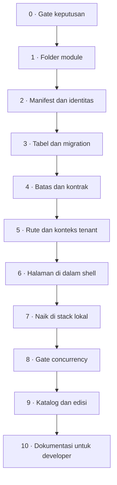

# Membangun modul baru

Jalur teknis dari nol sampai modul terdaftar di katalog. Sepuluh tahap, masing-masing punya **gate
keluar** — syarat yang harus terpenuhi sebelum lanjut.

Urutannya bukan saran. Melompati tahap 0 adalah cara paling umum menghasilkan modul yang harus
dibongkar ulang.

::: tip Halaman ini berbicara tentang module
Module berjalan di dalam runtime Core dan hidup di `modules/<penerbit>/<module>/` pada repo ini.
Itu bentuk yang berlaku untuk pekerjaan baru. App yang masih berupa container punya jalur
tersendiri yang belum dihapus — lihat [Standar module](/dev/02-module-standard#bentuk-lama-app-dengan-repository-dan-container-sendiri)
— tetapi jangan memilihnya untuk sesuatu yang baru.
:::



---

## Sebelum tahap 0: persiapan teknis

**Perkakas dan akses** — semuanya sudah diperlukan sejak hari pertama, bukan nanti:

- Docker Desktop jalan, dan [stack lokal](/onboarding/setup) sudah pernah naik sampai `http://localhost:8000` terbuka
- Akses tulis ke repo `CoreERP`
- PowerShell (skrip stack lokal berbasis PowerShell)
- Node dan PHP **tidak** perlu dipasang di host — semuanya dibangun di Docker

**Orang** — satu modul wajib punya **owner** yang bertanggung jawab atas code review, contract,
data, release, rollback, dan incident modul itu. Tetapkan sebelum foldernya dibuat, bukan sesudah.

## Konvensi penamaan

Tahap 1, 2, dan 3 memakai tabel ini. Tetapkan seluruh nilainya sekaligus supaya tidak ada yang
ditambal belakangan.

| Yang ditetapkan | Pola | Contoh |
| --- | --- | --- |
| ID module (manifest) | `<module-key>`, huruf kecil, tanda hubung | `management-aset` |
| Folder | `modules/<penerbit>/<module-key>/` | `modules/apperp/management-aset/` |
| Namespace PHP | diturunkan dari folder | `Modules\Apperp\ManagementAset\` |
| Awalan tabel | diturunkan dari nama folder | `aset_`, `hr_` |
| Nama halaman Inertia | `<id module>::<nama berkas>` | `management-aset::Daftar` |
| Jalur layar | `/<id module>/<id entri menu>` | `/management-aset/pemeliharaan-aset` |
| Kode keamanan | `<module>.<resource>.<aksi>` | `procurement.purchase-order.read` |
| Channel event | `<module>.<aggregate>.<action>.vN` | `procurement.purchase-order.approved.v1` |

Seluruh kode keamanan **wajib** berawalan ID module — Control Plane menolak registrasi yang tidak.

Tidak ada lagi yang perlu dialokasikan: module tidak punya port, tidak punya database, tidak punya
image, dan tidak punya nama service Compose. Ketiga daftar alokasi yang dulu ada di sini hilang
bersama container per app.

Aturan penurunan namespace dan awalan tabel, beserta contoh yang sudah jalan, ada di
`modules/README.md`.

## Berkas yang wajib ada di satu module

| Berkas | Keterangan |
| --- | --- |
| `app.yaml` | Manifest: identitas, navigasi, empat lapis keamanan, reference nomor, data policy, tipe workflow |
| `composer.json` | Package lokal, autoload PSR-4 untuk namespace module |
| `src/` | PHP module: `Http/`, `Models/`, `Services/`, `Listeners/`, dan penyedia layanannya |
| `database/migrations/` | Migration module saja, seluruhnya bertabel berawalan |
| `routes/` | `web.php` untuk layar, `api.php` untuk JSON; dimuat penyedia layanan module |
| `ui/` | Halaman React; ikut build shell Core |
| `tests/` | `Feature/` dan `Unit/` |
| `contracts/` | Hanya bila ada permukaan yang dipanggil dari luar runtime |

Yang **tidak boleh ada**, beserta sebabnya: `bootstrap/`, `public/`, dan `artisan` karena module
bukan aplikasi Laravel; `config/app.php` karena daftar provider dan alias dimiliki Core;
`Dockerfile`, `compose.yaml`, dan `nginx.conf` karena module tidak punya container; `.env` karena
module tidak punya proses sendiri; `vendor/` karena dependency diselesaikan sekali di akar repo.
Ada penjaga batas yang menolak masing-masing.

---

## 0 · Gate keputusan

**Sebelum satu baris kode.** Cari padanan resmi di Microsoft Learn Dynamics 365, lalu buat proposal keputusan yang menetapkan:

- pemilik data dan lifecycle-nya
- scope organisasi yang berlaku
- keamanan: entry point, permission, privilege, duty
- nomor: entitas mana yang memang perlu identitas terbaca manusia
- workflow dan SoD: hanya bila ada approval, exception, keputusan irreversible, atau handoff terkontrol
- kontrak API dan event

Kalau tidak ada padanan di Dynamics, **nyatakan itu terus terang**. Jangan mengarang klaim kesetaraan.

Pertanyaan yang wajib dijawab di sini: **modul baru, atau tambahan ke modul yang sudah ada?** Modul
baru berarti awalan tabel, katalog, dan siklus rilis baru — lebih murah daripada dulu, tetapi tetap
biaya permanen.

::: danger Gate keluar
Proposal **disetujui**. Tanpa itu, tahap 1 tidak dimulai.
:::

Prosedur dan template: `.agents/skills/module-discovery/SKILL.md`. Aturan: [Gate penemuan dan keputusan](/dev/18-module-discovery-and-decision-gate).

---

## 1 · Folder module

Folder module dibuat dari cetakan `modules/_template/`, lewat perintahnya:

```powershell
cd apps/control-plane
php artisan module:make kelola-contoh --nama="Kelola Contoh" --awalan=kelola_
```

Perintah itu menyalin cetakan, mengganti tiap penandanya menurut bentuknya — id module,
namespace StudlyCase, nama tampilan, dan awalan tabel adalah empat bentuk berbeda dari satu nama —
lalu mendaftarkan awalan tabelnya pada tabel pemetaan di `modules/README.md` dan package-nya pada
`composer.json` Core. Pilihan yang bisa diberikan: `--penerbit` (bawaannya `apperp`), `--nama`, dan
`--awalan`; dua yang terakhir diturunkan dari id module bila tidak disebut.

Satu langkah tersisa sesudahnya, dan perintahnya mencetak sendiri baris ini:

```powershell
composer update apperp/kelola-contoh
```

Tanpa itu kelas module tidak bisa dimuat — `repositories` pada `composer.json` hanya memberi tahu
Composer di mana package module dicari, bukan bahwa ia dipakai.

::: danger Jangan menyalin dengan tangan
Jangan menyalin folder cetakan sendiri, dan jangan menyalin modul yang sudah jadi. Yang kedua ikut
membawa keputusan domain modul itu beserta awalan tabelnya. Yang pertama tampak aman dan tidak:
sebuah module baru harus benar di enam tempat sekaligus sebelum satu pun penjaga batas hijau — id
manifest sama dengan nama foldernya, publisher sama dengan nama folder induknya, namespace PSR-4
sama dengan keduanya dalam StudlyCase, awalan tabel dinyatakan manifest **dan** terdaftar di
`modules/README.md`, dan package-nya terdaftar di `composer.json` Core. Tidak satu pun dari keenamnya
gagal dengan sendirinya saat disalin dengan tangan.

Masukan yang tidak sah ditolak, bukan dibetulkan diam-diam, dan module yang sudah ada tidak pernah
ditimpa. Penanda apa saja yang diganti, dan apa yang harus diganti sesudahnya, ada di
`modules/_template/README.md`.
:::

Isi cetakan adalah bentuk minimal satu module — manifest, satu migration bertabel berawalan, satu
model bertenant, satu rute, satu halaman, dan satu test penyaringan tenant — dan module yang keluar
darinya lulus penjaga batas apa adanya. Yang belum ada adalah domainnya; tahap 2 sampai 6 di
bawahlah yang menggantinya.

Tiga hal yang paling sering salah pada modul pertama seseorang:

- **`composer.json` module harus terdaftar** supaya autoload-nya jalan. Ada penjaga batas yang
  memeriksanya, jadi kegagalan ini muncul sebagai test merah, bukan sebagai kelas yang tidak
  ditemukan pada permintaan pertama di runtime.
- **Penyedia layanan module** yang memuat rute dan halaman adalah satu-satunya pintu masuknya ke
  runtime. Ia tidak didaftarkan di `config/app.php`; Core menemukannya dari manifest.
- **Module hanya boleh menyebut `App\Support\Modules\Contracts`.** Kelas Core lain di luar namespace
  itu terlarang, dan ada penjaga batas yang memeriksanya.

::: tip Gate keluar
`php artisan module:list` menyebut module baru, dan seluruh test di `tests/Feature/Boundary/` tetap hijau.
:::

---

## 2 · Manifest dan identitas

`app.yaml` adalah sumber kebenaran yang dibaca Core. Isi identitas modul yang sebenarnya:

```yaml
id: management-aset          # dipakai sebagai awalan semua kode keamanan
name: Management Aset
publisher: apperp
version: 0.1.0
kind: business-app
requires:
  core: ^0.1
```

Manifest juga mendeklarasikan navigasi, reference nomor, tipe workflow, data policy, dan **empat lapis keamanan**: entry point → permission → privilege → duty. Keempatnya wajib jadi empat baris terpisah, dan kode privilege tidak boleh sama dengan kode permission — Core menolak manifest yang meringkasnya. Aturan lengkap beserta diagramnya: [Rantai keamanan modul transaksi](/dev/19-transaction-security-chain).

Pola kode keamanan mengikuti `<module>.<resource>.<aksi>` — Control Plane menolak registrasi yang kodenya tidak berawalan ID module.

### Blok yang harus dikirim

| Blok | Kapan wajib | Akibatnya di Core |
| --- | --- | --- |
| `ui.navigation` | Selalu | Menu muncul di shell Core. **Id tiap entri menu adalah jalur rutenya**, jadi `routes/web.php` wajib punya rute dengan jalur itu; item menu hanya boleh memakai permission `read` module sendiri |
| `security.entry_points`, `permissions`, `privileges`, `duties` | Selalu, keempatnya terpisah | Duty tersedia untuk disusun admin tenant jadi security role |
| `security.data_policies` | Hanya bila resource perlu dibatasi organisasi | Muncul sebagai batas data saat role diberikan ke anggota |
| `number_sequences.references` | Hanya bila module menerbitkan nomor | Reference muncul di layar **Nomor dokumen** (`settings/number-sequences`) untuk diaktifkan admin tenant |
| `workflow_types` | Hanya bila ada approval atau verifikasi | Tipe workflow tersedia untuk dikonfigurasi admin tenant |
| `reports` | Hanya bila module punya dokumen cetak atau ekspor | Laporan masuk katalog Core; layout, antrean, dan render milik Core, module hanya menyediakan dataset lewat kontrak `PenyediaLaporanModul`. Lihat [dokumen cetak](/dev/23-document-rendering) |
| `dependsOn` | Hanya bila module butuh module lain | Dependency disimpan dengan rentang versi; Core menolak target yang belum ada, versi yang tidak cocok, dan cycle. Module tanpa dependency memakai `{}` |

Contoh reference nomor:

```yaml
number_sequences:
  references:
    - code: procurement.purchase-order
      name: Nomor purchase order
      default_prefix: PRCO
      allowed_scopes: [legal_entity]
```

`default_prefix` wajib **tepat empat huruf kapital**. `code` wajib berawalan ID module dan unik lintas app. `allowed_scopes` hanya boleh berisi `tenant`, `legal_entity`, atau `operating_unit`.

Module **tidak** menerbitkan nomornya sendiri. Setelah admin mengaktifkan reference, module meminta
nomor lewat kontrak `PenerbitNomor` — pemanggilan fungsi biasa, yang karena itu bisa berada di dalam
transaksi dokumen yang sedang disimpan.

Deklarasikan data policy **hanya bila** resource-nya memang perlu dibatasi organisasi. Ikuti Data policy decision gate di `.agents/skills/coreerp-architecture/SKILL.md`.

::: tip Contoh manifest utuh yang sudah jalan
`modules/apperp/management-aset/app.yaml`. Blok `security`-nya jauh lebih panjang dari sisanya. Baca itu sebelum menulis manifest sendiri.
:::

::: tip Gate keluar
`app.yaml` berisi identitas, menu, dan permission yang sebenarnya — bukan placeholder.
`app:register-manifest <id module>` diterima Control Plane tanpa error validasi. Bentuk berjalur
berkas sudah tidak diterima; perintahnya menerima **id module**.
:::

---

## 3 · Tabel dan migration

Module memakai database tenant yang sama dengan Core. Yang memisahkannya adalah **awalan nama
tabel** yang diturunkan dari nama folder module, dan awalan itu wajib pada setiap tabel tanpa
kecuali — termasuk tabel bantu seperti penyaring kejadian ganda, yang justru paling mudah lupa
diberi penanda dan paling mudah bertabrakan.

Semua record milik tenant membawa `tenant_id`, dan modelnya memakai trait `MilikTenant`. Data
operasional membawa `org_unit_id` bila memang relevan.

**Tidak ada foreign key, Eloquent relation, atau query ke tabel milik module lain.** Kalau kamu
butuh data module lain, jawabannya tahap 4, bukan tahap ini. Yang menolak di sini bukan database —
`DB::table()` akan berhasil menjangkaunya — melainkan penjaga batas di
`apps/control-plane/tests/Feature/Boundary/`. Itulah sebabnya query mentah pada tabel module
dilarang: ia melewati lapisan model, dan lapisan model itulah yang menegakkan penyaringan tenant.

Struktur klasifikasi milik domain module sendiri **boleh** memakai `parent_id` permanen — larangan `parent_id` hanya berlaku untuk identitas organization Core.

::: tip Gate keluar
`php artisan module:migrate <id module>` berjalan pada PostgreSQL, seluruh tabelnya berawalan, dan `ModuleTableBoundaryTest` beserta `ModelModuleMilikTenantTest` hijau.
:::

---

## 4 · Batas dan kontrak

Yang perlu ditulis bergantung pada batas mana yang dilewati:

| Batas | Bentuk | Perlu berkas kontrak? |
| --- | --- | --- |
| Module ke Core | Antarmuka di `App\Support\Modules\Contracts` | Tidak — kontraknya sudah ada di Core |
| Module ke module, di satu runtime | Event Laravel in-process | Ya bila event itu juga akan diterbitkan ke luar |
| Permukaan yang dipanggil dari luar runtime | REST/OpenAPI atau AsyncAPI | Ya |
| Rute yang hanya dipanggil halaman module sendiri | Rute biasa di `routes/api.php` | Tidak |

Baris terakhir sering mengejutkan. Alasannya: rute itu tidak melewati batas proses maupun batas
repo, jadi penyimpangannya terlihat pada test module dan pada halaman yang memanggilnya. Kontrak
terbit untuk permukaan semacam itu hanya menambah berkas yang harus dirawat tanpa menangkap apa pun.

Nama channel event tetap mengikuti `<module>.<aggregate>.<action>.vN`, dan envelope-nya tidak
berubah hanya karena pengirim dan penerimanya satu proses. Sebuah event harus tetap bisa diterbitkan
ke broker tanpa mengganti namanya.

Satu hal yang perlu diketahui sejak awal: **pengiriman di dalam proses mengubah waktunya, bukan
hanya jalurnya.** Listener berjalan sebelum pemanggilnya selesai, jadi ia ikut ke dalam transaksi
yang sedang berjalan — dokumen dan akibatnya berpindah status bersama atau tidak sama sekali.

::: tip Gate keluar
Kontrak menggambarkan implementasi nyata, bukan rencana. Event yang tidak dipublikasi tidak dicantumkan.
:::

---

## 5 · Rute dan konteks tenant

Titik paling rawan. Aturannya:

- Konteks tenant dibaca dari **middleware konteks module**, lewat kontrak `KonteksTenant` dan
  `KonteksPermintaan`. Tidak pernah dari body atau query.
- Grup rute module memasang `konteks-module:<id module>`. Middleware itu menerima id module sebagai
  parameter dan karena itu dipasang di grup rute module, bukan sebagai middleware global: izin
  bersifat per app, dan middleware global tidak tahu ia sedang melayani module yang mana.
- Jangan menerima `tenant_id` atau scope organisasi bebas dari klien.
- Nomor dokumen diminta lewat `PenerbitNomor`, tidak diterbitkan sendiri.
- Operasi tulis menghormati `Idempotency-Key`.

Pola yang terbukti di Management Aset: satu base controller memegang perilaku bersama — hak akses per resource, batas tenant, idempotency, penerbitan nomor, validasi induk, penjagaan arsip — sehingga tiap resource tidak menulis ulang penjagaan yang sama.

::: tip Gate keluar
Test module menjaga hal yang tidak boleh regresi: induk lintas tenant tertolak, daftar tidak pernah
memuat baris tenant lain, menyimpan atas nama tenant lain dibatalkan, hak satu resource tidak
merembet ke resource lain, dan kode dokumen selalu berasal dari Core. `RuteModuleTerlindungiTest`
hijau.
:::

---

## 6 · Halaman di dalam shell

Halaman module berada di `ui/Pages/` dan **ikut build shell Core**. Tidak ada iframe, tidak ada
aplikasi React kedua, dan tidak ada token yang dipertukarkan lebih dulu. Controller module
merendernya seperti halaman Inertia biasa:

```php
return Inertia::render('management-aset::Daftar', ['barang' => $barang]);
```

Penerbit tidak ikut disebut; pemilih halaman pada `apps/control-plane/resources/js/app.tsx`
mencocokkan akhiran jalurnya, dan id module sudah unik di seluruh runtime.

Tiga hal yang mengikat:

- **Halaman module hanya mengimpor `@apperp/ui`, React, `@inertiajs/react`, dan berkasnya sendiri.**
  Impor `@/...` milik shell akan berhasil dibangun — folder ini ikut build yang sama — dan justru
  itu bahayanya: module berhenti bisa dicabut, dan tidak ada satu pun langkah yang gagal saat itu
  terjadi.
- **Id entri menu pada `app.yaml` adalah jalur rutenya.** Mengganti salah satu tanpa yang lain
  membuat menunya mendarat di 404.
- **Halaman module dimuat malas.** Tuan rumahnya di `resources/js/lib/halaman-module.tsx` memasang
  pembatas penangguhan dan pembatas kesalahan; jangan menghapus salah satunya.

### Mencetak lewat Shell

Module tidak merender dokumen. Ia meminta shell membuka dialog cetak Core, dan Core yang memilih
layout, mengantrekan ekspor, serta memberi tahu hasilnya lewat tray dan lonceng di header. Jalurnya
sebuah `CustomEvent` pada `window` yang didengarkan shell — bukan impor langsung ke dialog cetak
Core, karena impor semacam itu memutus batas module.

Yang harus ada di module: blok `reports` di manifest, kelas dataset, dan pendaftaran
`PenyediaLaporanModul` dari penyedia layanannya. Semuanya dijelaskan di
[dokumen cetak, layout, dan ekspor](/dev/23-document-rendering).

### Bahasa dan komponen

Teks untuk pengguna bisnis memakai bahasa sehari-hari. Istilah internal — `entitlement`, `artifact`, `placement`, `tenant_id` — dilarang tampil.

Komponen memakai SDK `@apperp/ui`. `Select` atau combobox di dalam `Sheet`, dialog, atau popover wajib menerima ref overlay lewat `portalContainer`; kalau tidak, menunya terbuka di bawah overlay dan tidak bisa dipilih.

Berkas `ui/` diperiksa Prettier lewat `npm run format:check` di `apps/control-plane`. ESLint belum
mencakup folder ini, jadi untuk sementara ia hanya dijaga Prettier dan `tsc`.

::: tip Gate keluar
Halaman terbuka dari menu shell pada jalur `/<id module>/<id entri menu>`, tidak mengimpor apa pun
dari shell, dan tidak menampilkan istilah arsitektur ke pengguna bisnis. Pemeriksa bundel tetap
hijau: React hanya boleh termuat sekali.
:::

Aturan lengkap: `.agents/skills/coreerp-ui/SKILL.md` dan `.agents/skills/coreerp-page-standard/SKILL.md`.

---

## 7 · Naik di stack lokal

Tidak ada yang perlu ditambahkan ke stack. Skrip orkestrasi memindai
`CoreERP/modules/<penerbit>/<module>/app.yaml` setiap kali dijalankan, jadi module baru ikut terbaca
begitu foldernya ada.

```powershell
.\start.ps1 -Build
```

Skrip mendaftarkan manifest, menjalankan migration module, dan mencatat release lokal siap setelah
health check berhasil. `-Apps <id module>` membatasi ke module tertentu beserta dependency-nya.

::: tip Gate keluar
Module naik lewat `start.ps1 -Build`, menunya muncul di shell Core setelah dipasang untuk tenant yang dibuka, dan layarnya terbuka dengan data nyata.
:::

Detail: [Development stack lokal](/dev/11-local-docker-development).

---

## 8 · Gate concurrency

**Module belum selesai hanya karena test feature lulus.** Test feature menjalankan satu request pada satu proses; ia secara struktur tidak dapat melihat koneksi database habis, nomor terbit dua kali, batas tenant bocor saat request saling menyela, atau idempotency key berlomba dengan dirinya sendiri.

| Dimensi | Minimum |
| --- | --- |
| Virtual user serentak | 1000+, ditahan |
| Tenant digerakkan bersamaan | 100+ |
| Instance API di belakang load balancer | 2+, disarankan 4 |
| Database | PostgreSQL asli |
| Durasi pada beban penuh | 90 detik+ setelah pemanasan |

Gate kebenaran wajib **nol**, diverifikasi lewat SQL langsung ke database — bukan lewat API yang sedang diuji.

::: danger Gate keluar
Nol pelanggaran lintas tenant, nol nomor ganda, nol eskalasi hak, nol 5xx aplikasi. Kalau load test tidak dapat dijalankan, nyatakan module belum terverifikasi di bawah concurrency dan **jangan** laporkan selesai.
:::

Implementasi rujukan lengkap ada di `modules/apperp/management-aset/loadtest/`. Aturan: [Load dan concurrency testing](/dev/20-load-and-concurrency-testing).

---

## 9 · Katalog dan edisi

Manifest didaftarkan ke katalog Core dengan `app:register-manifest <id module>`, dibaca dari
`app.yaml` di dalam repo. Perintahnya menerima **id module**; bentuk berjalur berkas sudah ditolak.

Registrasi dikirim ulang setiap kali daftar permission, duty, atau reference nomor bertambah.
Manifest adalah sumber kebenaran: metadata yang tidak lagi dideklarasikan akan dihapus — kecuali
duty yang masih dipakai security role tenant, yang registrasinya ditolak agar hak berjalan tidak
hilang diam-diam. Kalau kamu memang hendak membuang duty semacam itu, lepaskan dulu relasi role-duty
lewat migration kecil, baru daftarkan ulang manifest.

Module ikut **image edisi** Core, bukan image sendiri. Sebuah edisi adalah satu berkas di
`editions/` yang menyebut modul apa yang dibeli pelanggan; modul yang tidak disebut di sana tidak
ada di dalam image, dan CI membuktikannya tiap pull request. Kalau module baru harus sampai ke
seorang pelanggan, yang berubah adalah berkas edisinya, bukan alur rilisnya.

::: tip Gate keluar
Module muncul di katalog, `php artisan edition:resolve <berkas edisi>` memulangkannya untuk edisi yang memang membelinya, dan installation registry menyatakan `ready` setelah migration berhasil.
:::

Detail: [Menerbitkan release app](/dev/13-publishing-an-app-release) dan [Release dan on-prem](/dev/03-release-and-on-prem#dua-bentuk-rilis).

---

## 10 · Dokumentasi untuk developer

Module yang sudah rilis tetapi tidak terdokumentasi memaksa orang berikutnya membaca controller baris per baris untuk mengetahui aturan yang dijaganya. Aturan itu ada di kepala penulisnya dan di komentar kode, dan keduanya hilang begitu ia pindah pekerjaan.

Yang ditulis di `docs/apps/<id module>/`:

| Berkas | Isi |
| --- | --- |
| `index.md` | Ringkasan modul, dari cetakan `docs/apps/_template/` |
| `arsitektur/` | Hal lintas fitur: batas tenant, integrasi Core, kontrak, database, pengujian |
| `master/` | Satu halaman per master yang punya aturan khusus |
| `transaction/` | Satu halaman per dokumen atau proses |

Isinya menjelaskan **apa yang disimpan, aturan apa yang dijaga kode, dan kenapa aturannya begitu** — bukan cara memakai layar. Bentuk, bahasa, dan hal yang tidak boleh ditulis ada di [Pola dokumen fitur](/apps/management-aset/pola-dokumen); contoh yang sudah jadi ada di [Management Aset](/apps/management-aset/).

::: tip Gate keluar
Tiap fitur yang lolos gate keluar tahap sebelumnya punya halamannya sendiri, seluruh halaman
terdaftar di `docs/.vitepress/config.ts`, dan `npm run docs:build` dari dalam `docs/` lolos tanpa
tautan mati.
:::

---

## Yang tidak termasuk jalur ini

**Upgrade versi.** Menaikkan versi release bukan bagian dari pembuatan modul. Ia memerlukan compatibility matrix, backup terverifikasi, traffic drain, dependency check, dan prosedur rollback. Selama module masih di release pengembangan, jalankan migration baru pada placement pengembangan dan jangan memperlakukannya sebagai upgrade produksi.

**Fork Core.** Kebutuhan khusus customer diselesaikan dengan konfigurasi, integration connector, atau addon.

## Lihat juga

- [Katalog app](/apps/) — app dan module yang sudah ada beserta statusnya
- [Management Aset](/apps/management-aset/) — contoh module yang sudah melewati gate concurrency
- [Pola dokumen fitur](/apps/management-aset/pola-dokumen) — bentuk dokumen pada tahap 10
- [Standar module](/dev/02-module-standard) — kontrak lengkap satu module
- [Definition of done](/onboarding/definition-of-done) — standar selesai lintas jenis pekerjaan
