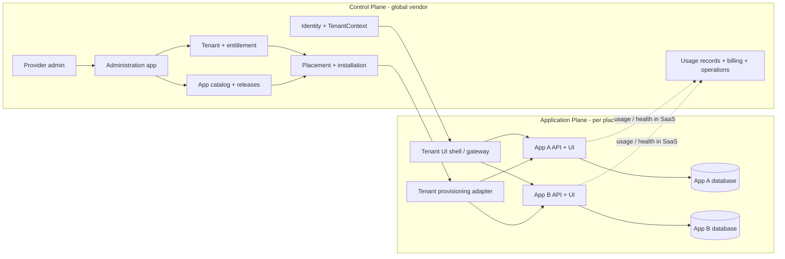
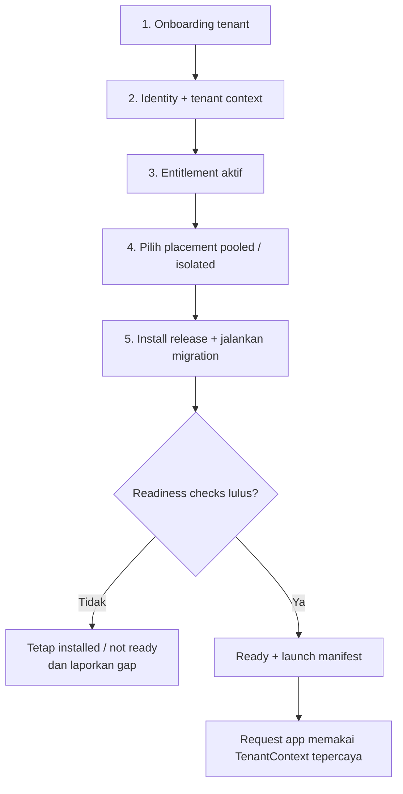
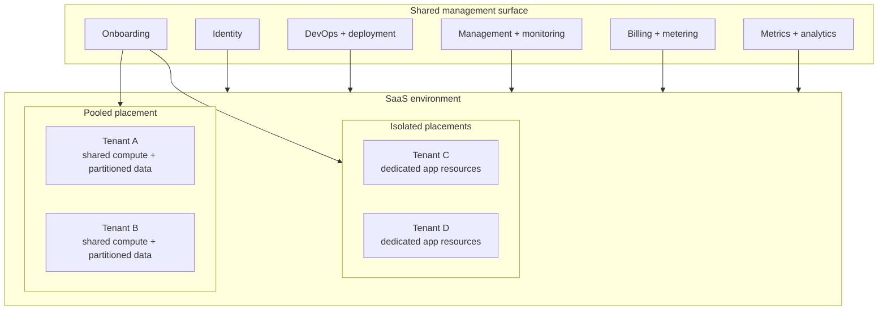
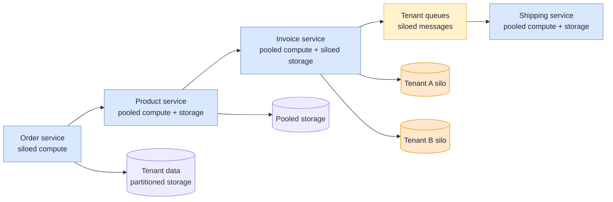

# Grand design: SaaS ERP berbasis app

## Keputusan arsitektur

CoreERP dibangun sebagai **app platform API-first**. Setiap app adalah release unit deployable dengan repository sendiri, bukan folder fitur di dalam aplikasi utama. Satu versi image app dapat dipakai pada cloud pooled, cloud isolated, maupun on-prem perpetual; yang berubah adalah placement, manifest instalasi, dan kanal update, bukan source business logic.

## Cara membaca grand design

Untuk orang yang baru masuk ke CoreERP, gunakan tiga kalimat ini sebagai peta:

1. **Control Plane mengatur lingkungan**: tenant, identity, entitlement, katalog app, placement, installation, operasi, dan metering.
2. **Application Plane menjalankan pekerjaan bisnis**: UI, API, database, migration, dan kontrak milik setiap app.
3. **Tenant adalah batas isolasi**: organisasi berada di dalam tenant, sedangkan `TenantContext` tepercaya ikut menentukan data apa yang boleh disentuh oleh request.

Control Plane dan Application Plane bukan dua nama untuk satu aplikasi besar. Keduanya adalah batas tanggung jawab. Control Plane mengetahui release dan placement, tetapi tidak boleh mengambil alih database bisnis app. Application Plane menjalankan fitur bisnis, tetapi tidak boleh membuat keputusan komersial atau deployment global sendiri.



Pemisahan ini mengikuti AWS untuk **SaaS yang dikelola vendor**: control plane mengelola onboarding, identity, tenant, billing, metering, dan operasi secara terpadu; application plane menyajikan fitur multi-tenant dan melakukan provisioning resource tenant. AWS juga memperbolehkan kombinasi pool dan silo pada service yang berbeda, selama pengalaman operasionalnya tetap terpadu. Lihat whitepaper lokal, bagian "Control plane vs application plane" dan "Pool and silo".

Diagram di atas berlaku untuk profile SaaS (`pooled` dan `isolated`). On-prem perpetual menjalankan application plane dan core runtime lokal; ia tidak bergantung pada control plane vendor agar aplikasi customer berfungsi.

### Batas tanggung jawab

| Bagian | Memiliki | Tidak boleh mengambil alih |
| --- | --- | --- |
| Control Plane | Tenant, identity, catalog, entitlement, release, placement, installation registry, usage records | Database transaksi app, aturan bisnis app, atau query lintas database app |
| Application Plane | UI, API, database, migration, business rule, dan kontrak app | Keputusan entitlement, penerbitan release, atau status `ready` tanpa registry |
| Deployment/runtime | Container, endpoint, secret reference, health, dan routing pada placement | Mengubah source app hanya karena tenant ditempatkan pada silo |

## Dari tenant baru sampai aplikasi siap dipakai

Status lifecycle harus dibaca berurutan. `catalogued`, `entitled`, `installed`, dan `ready` adalah fakta berbeda; satu status tidak boleh ditebak dari status sebelumnya.



Urutan ini menjelaskan kenapa launcher tidak boleh menampilkan app sebagai "terpasang" hanya karena tenant memiliki entitlement. Sumber kebenaran install adalah installation/deployment registry; sumber kebenaran readiness adalah runtime/placement status. Jika registry belum ada, dokumentasi dan UI harus menyebut gap, bukan membuat state optimistis.

## Pooled, isolated, dan on-prem

Pooled dan silo bukan pilihan antara "SaaS" dan "bukan SaaS". Keduanya adalah cara menempatkan resource di dalam pengalaman SaaS yang tetap dikelola secara terpadu. Satu service boleh pooled, sementara service lain silo, bila kebutuhan isolasi, noisy neighbor, regulasi, data residency, atau SLA membutuhkannya.



Pada `onprem-perpetual`, deployment dan installation state berada di infrastruktur customer. Aplikasi tetap bisa melayani pengguna tanpa telemetry, heartbeat, atau validasi lisensi online yang wajib. Support connector adalah pilihan terpisah dan hanya outbound mTLS dengan payload minimum.

## Silo dan pool pada level service

Keputusan pool/silo dapat dibuat per service, bukan hanya untuk seluruh stack. Diagram berikut hanya contoh pola; nama service bukan daftar module yang wajib ada di CoreERP.



**Partisi data bukan isolasi.** Partisi menjawab di mana data tenant disimpan, misalnya row dengan `tenant_id`, schema, tabel, atau database yang berbeda. Isolasi menjawab apakah request tenant A benar-benar dibatasi agar tidak dapat membaca atau menulis resource tenant B. Keduanya harus dirancang dan diuji secara terpisah.

## Aturan praktis untuk implementasi

- Mulai dari `TenantContext` yang tepercaya; `tenant_id` dari body atau query string bukan bukti akses.
- Organization berada di dalam tenant. Legal entity dan operating unit bukan pengganti tenant dan tidak boleh dijadikan satu pohon universal.
- Setiap app memiliki database owner sendiri. Integrasi lintas app memakai REST/OpenAPI untuk query atau perintah, dan event/AsyncAPI untuk fakta yang sudah terjadi.
- App tidak boleh menebak state global. Catalog, entitlement, installation, dan readiness punya sumber kebenaran masing-masing.
- Silo bukan fork source. Semua placement menjalankan release yang kompatibel; yang berubah adalah resource dan placement, bukan business logic secara diam-diam.

## Sumber dan diagram editable

Konsep control plane/application plane, pooled/silo, identitas SaaS, isolasi tenant, partisi data, serta perbedaan metering dan metrics diringkas dari [Dasar-dasar Arsitektur SaaS](../saas-architecture-fundamentals.pdf), terutama bagian halaman 12-14, 21-22, 30-32, dan 34-35 pada PDF. Keputusan boundary dan lifecycle di halaman ini tetap mengikuti aturan kanonik CoreERP.

Versi diagram yang dapat diedit di draw.io: [coreerp-saas-grand-design.drawio](../diagrams/drawio/coreerp-saas-grand-design.drawio).

## Invarian yang tidak boleh dilanggar

1. App tidak membaca atau menulis database app lain.
2. Semua request business API membawa `TenantContext` yang diterbitkan identity service; `tenant_id` dari body request tidak dipercaya.
3. Database credential hanya tersedia untuk service pemiliknya. Control plane menyimpan `secret_ref`, bukan password database.
4. Semua integrasi antar-app memakai OpenAPI, event contract, atau extension point yang dipublikasikan.
5. Aplikasi customer tidak mendapatkan source/artifact app yang tidak dilisensikan pada deployment on-prem.
6. On-prem perpetual tidak memiliki telemetry, heartbeat, atau validasi lisensi online yang wajib. Server customer boleh online untuk penggunanya tanpa membuka koneksi ke vendor.
7. Silo bukan izin fork source. Semua profile menjalankan release app yang kompatibel dengan matriks versi yang sama.
8. Organization identity tidak menyimpan parent/depth permanen; relasi parent-child berada dalam purpose-scoped hierarchy version.
9. Katalog, entitlement, installation, dan runtime readiness adalah fakta berbeda dengan sumber kebenaran berbeda.

## Deployment profile

| Profile | Compute app | Database app | Kapan dipilih |
| --- | --- | --- | --- |
| `pooled` | Service/API dipakai banyak tenant | Satu database logis per app; setiap row tenant-scoped membawa `tenant_id` | Default cloud, biaya efisien |
| `isolated` | Shared atau dedicated menurut SLA | Database app dedicated untuk satu tenant; optional compute dedicated | Regulasi, noisy neighbor, data residency, SLA |
| `onprem-perpetual` | Docker Compose di infrastruktur customer, memakai manifest dan state instalasi lokal | Database app hanya untuk app yang dibeli customer | Customer membeli putus, menjalankan dan memperbarui sendiri |

"Satu app satu database" berarti **satu ownership database logis dan satu database role per app**. Ia tidak selalu berarti satu VM atau satu PostgreSQL cluster per app.

- Pool dapat menempatkan `pos_pool_db` dan `booking_pool_db` dalam cluster PostgreSQL managed yang sama, dengan role dan credential berbeda.
- Isolated/on-prem dapat menempatkan `pos_tenant_acme_db` dan `booking_tenant_acme_db` pada PostgreSQL instance/container khusus bila tier mensyaratkannya.
- Citus adalah opsi scale-out untuk database pooled sebuah app setelah volume memerlukannya. Tabel dalam database app itu tetap didistribusikan oleh `tenant_id` agar data tenant colocated.

## Control-plane model

Pada SaaS, control plane merupakan sumber kebenaran placement, entitlement, dan versi. Tabel/aggregate konseptualnya:

| Aggregate | Tanggung jawab |
| --- | --- |
| `tenants` | Kontrak customer, status, edition, dan isolation profile. |
| `tenant_app_entitlements` | Hak komersial tenant, masa berlaku, dan quota; bukan installation state. |
| `app_catalog` / `app_releases` | Publisher, manifest, image digest, kontrak, dan compatibility matrix. |
| `tenant_deployments` | Satu tenant SaaS ditempatkan pada target pooled atau isolated mana. |
| `app_placements` | Endpoint API, secret reference database, image release, dan health per app deployment. Path UI tidak disimpan di sini; lihat [Routing UI per placement](#routing-ui-per-placement). |
| `app_installations` | Riwayat install, migration, enable, disable, upgrade, dan uninstall. |
| `usage_records` | Metering per tenant/app untuk billing dan observability SaaS. |

## Application-plane model

Setiap app memiliki:

```text
app = API service + UI artifact + database + migrator + contracts + manifest
```

Pada SaaS, gateway/UI shell meminta launch manifest setelah token tervalidasi. Entry app hanya dapat dimuat bila entitlement aktif, installation registry menyatakan release pada placement `ready`, dan user memiliki permission entry point. Pada on-prem perpetual, gateway membaca manifest bertanda tangan serta installation state lokal; local core runtime menyimpan administrator dan lisensi lokal.

Dalam pooled cloud, code app boleh dideploy satu kali untuk satu placement yang melayani banyak tenant. Installation registry tetap mencatat artifact, release, migration, dan readiness placement; tenant binding serta entitlement dicatat terpisah. Dalam isolated cloud, install juga membentuk resource dan menjalankan migration database khusus. Dalam on-prem perpetual, installer lokal memverifikasi bundle dan lisensi bertanda tangan, lalu mencatat lifecycle pada installation state lokal; ia tidak melaporkan runtime health ke vendor.

## Routing UI per placement

Shell menyajikan UI app di dalam iframe pada path yang selalu berbentuk:

```text
/apps-content/<placement>/<app-id>/
```

Path ini **diturunkan**, bukan disimpan. `App\Support\AppContentPath` menyusunnya
dari pasangan `(app_id, placement)`, dan itu satu-satunya tempat di seluruh
control plane yang menyusun URL konten app.

Penurunan ini bukan penghematan kolom. Ia menutup tiga kegagalan yang pernah
terjadi atau pasti terjadi:

- **Nilai tersimpan bisa basi.** Path yang pernah dicatat pada environment lokal
  menunjuk alamat IP yang sudah tidak dipegang mesin mana pun, dan app tampak mati
  padahal seluruh containernya sehat.
- **Placement adalah unit silo/pool.** Satu app boleh punya banyak placement —
  shard pooled kedua, atau silo milik satu tenant. Path yang hanya di-key app id
  akan membuat dua runtime berbeda berebut alamat yang sama.
- **Path bebas bisa bertabrakan dengan route host.** Nilai `/apps/<id>/` membuat
  iframe memuat ulang halaman host-nya sendiri. Segmen `apps-content` berbeda dari
  segmen `apps`, sehingga tabrakan itu tidak mungkin terjadi lagi.

Reverse proxy menerjemahkan path tersebut ke container UI milik placement
bersangkutan. Konfigurasinya di-generate dari registry, bukan ditulis tangan —
lihat [Release dan on-prem](03-release-and-on-prem.md) dan berkas
`deploy/apps-content-proxy.md` pada repository ini.

Karena path relatif, ia mewarisi host mana pun tempat shell disajikan. Isolasi
tenant tetap ditegakkan sebelum path ini dipakai: shell hanya memancarkannya
setelah entitlement aktif, placement `ready`, dan user memiliki permission entry
point.

Readiness app di dalam frame diukur dari pengumuman `coreerp.ready` milik app,
bukan dari `onLoad` iframe. Saat container UI mati, reverse proxy membalas halaman
errornya sendiri dan halaman itu berhasil dimuat — `onLoad` akan menyatakan sukses
untuk kegagalan. Pengumuman app adalah satu-satunya sinyal yang tidak bisa
dipalsukan halaman error.

### Keputusan yang belum diambil: cara mengalamati tenant

Hari ini seluruh tenant berbagi satu host shell dan dibedakan lewat path. Apakah
nanti kita memakai subdomain per tenant, custom domain milik pelanggan, atau tetap
seperti sekarang, **belum diputuskan**.

Path relatif membuat ketiganya tetap terbuka tanpa perubahan skema maupun migrasi
data. Bila keputusan itu diambil, yang perlu berubah hanya `AppContentPath` dan
perhitungan origin pada `apps/control-plane/resources/js/pages/apps/host.tsx`.

Satu konsekuensi perlu dicatat sejak sekarang: karena konten app disajikan
same-origin dengan shell, atribut `sandbox` pada iframe adalah pembatas tambahan,
bukan batas isolasi. Isolasi origin yang sungguhan menuntut host terpisah, dan itu
bagian dari keputusan yang sama.

## Silo dan customisasi

Silo menjawab **di mana resource berjalan**. Customisasi menjawab **perilaku apa yang boleh berubah**. Keduanya independen:

| Kombinasi | Contoh |
| --- | --- |
| Pooled + standard config | SaaS biasa dengan custom field dan approval workflow. |
| Isolated + standard product | Customer regulated dengan database dedicated, tetapi versi product tetap standar. |
| On-prem perpetual + private addon | Customer menjalankan POS, Booking, dan addon policy khusus pada Compose mereka sendiri, sesuai contract dan compatibility matrix. |
| Core fork | Tidak didukung sebagai pola SaaS; hanya proyek bespoke dengan konsekuensi support terpisah. |

Detail customisasi ada pada [05-customization-and-addons.md](05-customization-and-addons.md).

## Konektor support bukan bagian default on-prem

Customer dapat memilih paket **managed support** secara terpisah. Hanya pada mode ini `support-connector` opsional dipasang dan membuat koneksi **outbound mTLS** ke vendor. Payload dibatasi pada installation ID yang disetujui, versi/image digest, health service, kapasitas disk/CPU, dan error fingerprint. Ia tidak mengirim transaksi, master data, database dump, user/role, atau secret; tidak ada remote shell, port inbound, atau perintah update otomatis dari vendor. Menonaktifkan connector tidak mengubah kemampuan aplikasi on-prem untuk melayani pengguna.

## Lihat juga

- [Tenant dan hierarki organisasi](01a-tenant-and-org-hierarchy.md) — model organisasi di dalam tenant
- [Standar module](02-module-standard.md) — app sebagai release unit mandiri
- [Release dan on-prem](03-release-and-on-prem.md) — profile deployment dalam praktik
- [Reporting dan read replica](07-reporting-and-replicas.md) — konsekuensi boundary data lintas app
- [Gate fondasi Core](10-core-foundation-gates.md) — fondasi mana yang belum boleh dibangun
