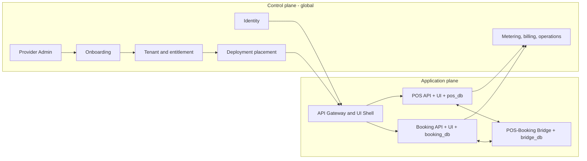

# Grand design: SaaS ERP modular

## Keputusan arsitektur

CoreERP dibangun sebagai **module platform API-first**. Setiap module adalah service deployable, bukan folder fitur di dalam aplikasi utama. Satu versi image module dapat dipakai pada cloud pooled, cloud isolated, maupun on-prem perpetual; yang berubah adalah placement, manifest instalasi, dan kanal update, bukan source business logic.



Pemisahan ini mengikuti AWS untuk **SaaS yang dikelola vendor**: control plane mengelola onboarding, identity, tenant, billing, metering, dan operasi secara terpadu; application plane menyajikan fitur multi-tenant dan melakukan provisioning resource tenant. AWS juga memperbolehkan kombinasi pool dan silo pada service yang berbeda, selama pengalaman operasionalnya tetap terpadu. Lihat whitepaper lokal, bagian "Control plane vs application plane" dan "Pool and silo".

Diagram di atas berlaku untuk profile SaaS (`pooled` dan `isolated`). On-prem perpetual menjalankan application plane dan core runtime lokal; ia tidak bergantung pada control plane vendor agar aplikasi customer berfungsi.

## Invarian yang tidak boleh dilanggar

1. Module tidak membaca atau menulis database module lain.
2. Semua request business API membawa `TenantContext` yang diterbitkan identity service; `tenant_id` dari body request tidak dipercaya.
3. Database credential hanya tersedia untuk service pemiliknya. Control plane menyimpan `secret_ref`, bukan password database.
4. Semua integrasi antarmodule memakai OpenAPI, event contract, atau extension point yang dipublikasikan.
5. Aplikasi customer tidak mendapatkan source/artifact module yang tidak dilisensikan pada deployment on-prem.
6. On-prem perpetual tidak memiliki telemetry, heartbeat, atau validasi lisensi online yang wajib. Server customer boleh online untuk penggunanya tanpa membuka koneksi ke vendor.
7. Silo bukan izin fork source. Semua profile menjalankan release module yang kompatibel dengan matriks versi yang sama.
8. Organization identity tidak menyimpan parent/depth permanen; relasi parent-child berada dalam purpose-scoped hierarchy version.
9. Katalog, entitlement, installation, dan runtime readiness adalah fakta berbeda dengan sumber kebenaran berbeda.

## Deployment profile

| Profile | Compute module | Database module | Kapan dipilih |
| --- | --- | --- | --- |
| `pooled` | Service/API dipakai banyak tenant | Satu database logis per module; setiap row tenant-scoped membawa `tenant_id` | Default cloud, biaya efisien |
| `isolated` | Shared atau dedicated menurut SLA | Database module dedicated untuk satu tenant; optional compute dedicated | Regulasi, noisy neighbor, data residency, SLA |
| `onprem-perpetual` | Docker Compose di infrastruktur customer, memakai manifest dan state instalasi lokal | Database module hanya untuk module yang dibeli customer | Customer membeli putus, menjalankan dan memperbarui sendiri |

"Satu module satu database" berarti **satu ownership database logis dan satu database role per module**. Ia tidak selalu berarti satu VM atau satu PostgreSQL cluster per module.

- Pool dapat menempatkan `pos_pool_db` dan `booking_pool_db` dalam cluster PostgreSQL managed yang sama, dengan role dan credential berbeda.
- Isolated/on-prem dapat menempatkan `pos_tenant_acme_db` dan `booking_tenant_acme_db` pada PostgreSQL instance/container khusus bila tier mensyaratkannya.
- Citus adalah opsi scale-out untuk database pooled sebuah module setelah volume memerlukannya. Tabel dalam database module itu tetap didistribusikan oleh `tenant_id` agar data tenant colocated.

## Control-plane model

Pada SaaS, control plane merupakan sumber kebenaran placement, entitlement, dan versi. Tabel/aggregate konseptualnya:

| Aggregate | Tanggung jawab |
| --- | --- |
| `tenants` | Kontrak customer, status, edition, dan isolation profile. |
| `tenant_module_entitlements` | Hak komersial tenant, masa berlaku, dan quota; bukan installation state. |
| `module_catalog` / `module_releases` | Publisher, manifest, image digest, kontrak, dan compatibility matrix. |
| `tenant_deployments` | Satu tenant SaaS ditempatkan pada target pooled atau isolated mana. |
| `module_placements` | Endpoint API/UI, secret reference database, image release, dan health per module deployment. |
| `module_installations` | Riwayat install, migration, enable, disable, upgrade, dan uninstall. |
| `usage_records` | Metering per tenant/module untuk billing dan observability SaaS. |

## Application-plane model

Setiap module memiliki:

```text
module = API service + UI artifact + database + migrator + contracts + manifest
```

Pada SaaS, gateway/UI shell meminta launch manifest setelah token tervalidasi. Entry module hanya dapat dimuat bila entitlement aktif, installation registry menyatakan release pada placement `ready`, dan user memiliki permission entry point. Pada on-prem perpetual, gateway membaca manifest bertanda tangan serta installation state lokal; local core runtime menyimpan administrator dan lisensi lokal.

Dalam pooled cloud, code module boleh dideploy satu kali untuk satu placement yang melayani banyak tenant. Installation registry tetap mencatat artifact, release, migration, dan readiness placement; tenant binding serta entitlement dicatat terpisah. Dalam isolated cloud, install juga membentuk resource dan menjalankan migration database khusus. Dalam on-prem perpetual, installer lokal memverifikasi bundle dan lisensi bertanda tangan, lalu mencatat lifecycle pada installation state lokal; ia tidak melaporkan runtime health ke vendor.

## Silo dan customisasi

Silo menjawab **di mana resource berjalan**. Customisasi menjawab **perilaku apa yang boleh berubah**. Keduanya independen:

| Kombinasi | Contoh |
| --- | --- |
| Pooled + standard config | SaaS biasa dengan custom field dan approval workflow. |
| Isolated + standard product | Customer regulated dengan database dedicated, tetapi versi product tetap standar. |
| On-prem perpetual + private addon | Customer menjalankan POS, Booking, dan addon policy khusus pada Compose mereka sendiri, sesuai contract dan compatibility matrix. |
| Core fork | Tidak didukung sebagai pola SaaS; hanya proyek bespoke dengan konsekuensi support terpisah. |

Detail customisasi ada pada [05-customization-and-addons.md](05-customization-and-addons.md).

## Konektor support bukan bagian default on-prem

Customer dapat memilih paket **managed support** secara terpisah. Hanya pada mode ini `support-connector` opsional dipasang dan membuat koneksi **outbound mTLS** ke vendor. Payload dibatasi pada installation ID yang disetujui, versi/image digest, health service, kapasitas disk/CPU, dan error fingerprint. Ia tidak mengirim transaksi, master data, database dump, user/role, atau secret; tidak ada remote shell, port inbound, atau perintah update otomatis dari vendor. Menonaktifkan connector tidak mengubah kemampuan aplikasi on-prem untuk melayani pengguna.
