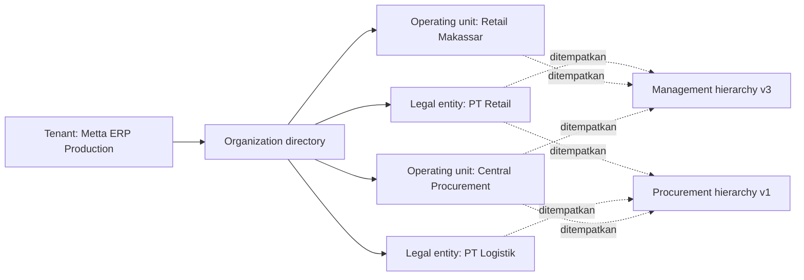

# Tenant, organization directory, dan hierarchy

Model kanonik CoreERP mengikuti pemisahan Microsoft Dynamics 365 antara tenant, identitas organisasi, dan penempatan organisasi dalam hierarchy. Referensi dan alasan keputusan ada di [referensi model organisasi Dynamics 365](../references/dynamics-365-organization-model.md).

## Batas yang tidak boleh dicampur

- `tenant_id` adalah batas kontrak, isolasi data, metering, dan placement SaaS.
- organization adalah identitas bisnis stabil di dalam tenant.
- legal entity dan operating unit adalah klasifikasi organization yang saling eksklusif dan mempunyai konsekuensi berbeda.
- hierarchy adalah satu sudut pandang parent-child untuk purpose tertentu; ia bukan identitas organization.
- job, position, WBS proyek, warehouse/bin, chart of accounts, dan sales territory bukan organization hierarchy.

Tenant bukan root organization. Satu tenant dapat memiliki beberapa legal entity dan operating unit, sedangkan organization yang sama dapat ditempatkan dalam hierarchy berbeda tanpa diduplikasi.



## Model data target

```text
clients
└── id, legal_name, commercial_status

tenants
└── id, client_id, name, edition, deployment_profile, status

organizations
├── id, tenant_id, name, status
└── identitas stabil; tidak menyimpan parent atau depth

legal_entities
└── organization_id, tenant_id, company_code, country_code, registration/tax data

operating_units
└── organization_id, type
   # business_unit | department | cost_center | value_stream | channel

organization_hierarchies
└── id, tenant_id, name, status

hierarchy_purposes
└── id, code, name

organization_hierarchy_purposes
└── hierarchy_id, purpose_id

organization_hierarchy_versions
└── id, hierarchy_id, status, effective_from, published_at

organization_hierarchy_nodes
├── version_id, organization_id, parent_node_id
└── parent-child hanya hidup dalam satu version

organization_hierarchy_closures
└── version_id, ancestor_organization_id, descendant_organization_id, distance
```

Closure adalah projection untuk query subtree pada satu hierarchy version. Kolom `distance` adalah jarak relasi, bukan batas kedalaman organisasi dan bukan pilihan tenant.

Setiap organization mempunyai tepat satu klasifikasi: legal entity atau operating unit. Establishment tidak ditambahkan sebagai nilai `operating_units.type`; status tersebut berlaku ketika operating unit ditempatkan pada hierarchy efektif dengan purpose `Enterprise establishment structure`. Dalam version tersebut, establishment harus berada di bawah tepat satu legal entity yang tetap menjadi badan hukum dan accounting entity.

## Kode legal entity

`organizations.id` adalah identitas sistem yang dipakai oleh relasi, API, event, dan transaksi. Ia tidak digantikan oleh kode yang dibaca pengguna.

Setiap legal entity wajib mempunyai `company_code` dengan aturan berikut:

- unik dalam satu tenant (`UNIQUE (tenant_id, company_code)`);
- dinormalisasi ke huruf besar;
- 2 sampai 16 karakter, hanya huruf A-Z, angka, dan tanda hubung; karakter pertama harus huruf atau angka;
- dibuat saat legal entity dibuat dan dikunci setelah data finansial pertama tercatat.

Operating unit tidak memiliki kode organisasi umum. Jika proses regulator atau integrasi membutuhkan nomor cabang/unit, simpan sebagai identifier domain yang eksplisit; jangan menjadikannya pengganti `organizations.id` atau memaksa semua operating unit memiliki kode. `company_code` bukan nomor registrasi, NPWP, atau nomor pajak.

## Registrasi dan setup awal

Registrasi tidak meminta jumlah level, jenis urutan unit, atau bentuk tree. Transaksi registrasi hanya membuat:

```text
identity user
  -> client
  -> tenant
  -> owner membership
  -> entitlement untuk produk yang dipilih
```

Setelah registrasi, guided setup meminta minimal satu legal entity sebelum proses finansial atau dokumen resmi digunakan. Operating unit dan hierarchy ditambahkan dari Organization Administration sesuai keadaan perusahaan:

- tenant dengan satu legal entity dapat bekerja tanpa hierarchy;
- branch, outlet, department, cost center, atau business unit dibuat sebagai operating unit bila benar-benar ada;
- hierarchy dibuat ketika reporting, policy, establishment, atau scope akses memerlukan hubungan parent-child;
- tidak ada urutan wajib `holding → legal entity → branch → outlet` dan tidak ada batas `1..4` level.

Pemilihan produk hanya menciptakan entitlement. Ia tidak membuktikan artifact sudah terpasang atau siap; status tersebut hanya berasal dari installation/deployment registry.

## Lifecycle hierarchy

1. Buat organization identity lebih dahulu.
2. Buat hierarchy dan tetapkan purpose yang dikonsumsi proses bisnis.
3. Susun version berstatus draft.
4. Validasi node unik, tidak bersiklus, dan sesuai jenis organization yang diterima purpose.
5. Publish dengan `effective_from`.
6. Pertahankan version lama untuk transaksi dan laporan historis.

Memindahkan organization berarti membuat atau mengubah draft version. Operasi tersebut tidak mengganti `organization.id` dan tidak menulis ulang sejarah version yang sudah berlaku.

## Konteks transaksi

Transaksi module selalu menyimpan `tenant_id`. Data yang mempunyai konsekuensi hukum/akuntansi juga menyimpan `legal_entity_id`. Data operasional menyimpan `org_unit_id` bila relevan; nilainya menunjuk organization yang diklasifikasikan sebagai operating unit.

```text
tenant_id       = metta-erp-production
legal_entity_id = pt-retail
org_unit_id     = retail-makassar
```

Module tidak membuat foreign key lintas database ke organization database. Ia menyimpan ID sebagai opaque reference dan mengonsumsi contract/event atau local projection untuk hierarchy yang memang dibutuhkan.

## Scope akses organisasi

Permission tidak berasal dari posisi organization di semua hierarchy. Security-role assignment memilih:

- organization yang menjadi scope;
- hierarchy yang dipakai bila descendants harus ikut tercakup;
- `include_descendants` untuk membedakan organization itu sendiri dan seluruh turunannya;
- periode aktif dan sumber assignment.

Karena hierarchy disebut eksplisit, perubahan management hierarchy tidak diam-diam mengubah scope yang memakai procurement hierarchy. Detail rantai role, duty, privilege, dan permission ada di [09-identity-and-access.md](09-identity-and-access.md).

## Tenant isolation

1. Semua tabel tenant-owned membawa `tenant_id`.
2. Setiap organization mempunyai tepat satu subtype yang sesuai klasifikasinya, dan subtype tersebut berada dalam tenant yang sama.
3. Semua node dalam hierarchy version harus menunjuk organization milik tenant hierarchy tersebut.
4. Satu organization hanya boleh muncul sekali dalam satu version dan graph harus acyclic.
5. Access token dan session membentuk `TenantContext` tepercaya; client tidak bebas menentukan tenant.
6. `tenant_relationships` hanya dipakai bila kontrak/admin/billing memang terpisah, bukan sebagai pengganti organization hierarchy.

## Active workspace

User dapat memilih satu tenant aktif, legal entity aktif, dan operating unit aktif yang termasuk assignment-nya. Pilihan disimpan pada session server dan selalu divalidasi ulang.

- tenant berasal dari membership aktif;
- legal entity harus termasuk tenant aktif;
- operating unit harus diizinkan oleh organization scope assignment;
- perubahan tenant menghitung ulang legal entity dan operating unit yang sah;
- module menerima `tenant_id`, `legal_entity_id`, dan `org_unit_id` dari `TenantContext`, bukan parameter bebas.

Endpoint first-party untuk mengganti konteks session tetap `PUT /api/v1/workspace-context`.

## Tenant terpisah atau organization?

| Kebutuhan | Model |
| --- | --- |
| Holding membeli satu ERP untuk seluruh grup | Satu tenant + beberapa legal entity/operating unit |
| Anak perusahaan berbadan hukum tetapi kontrak ERP bersama | Legal entity terpisah dalam tenant yang sama |
| Department/cabang/outlet berbagi badan hukum dan ledger | Operating unit |
| Susunan reporting dan procurement berbeda | Dua purpose-scoped hierarchy atas directory yang sama |
| Anak perusahaan mempunyai kontrak, admin, billing, dan isolation sendiri | Tenant terpisah + optional `tenant_relationships` |
| Reseller mengelola customer berbeda | Tenant reseller dan customer tetap tenant terpisah |

## Lihat juga

- [Query scope dan schema](08-query-scopes-and-schema.md) — bentuk tabel dan query scope-nya
- [Identity dan access](09-identity-and-access.md) — scope organisasi pada role assignment
- [Grand design dan boundary platform](01-grand-design.md) — posisi model ini di arsitektur keseluruhan
- [Model organisasi Dynamics 365](../references/dynamics-365-organization-model.md) — asal model legal entity dan operating unit
- [Glosarium](../onboarding/glosarium.md) — beda tenant, organization, legal entity, dan operating unit
