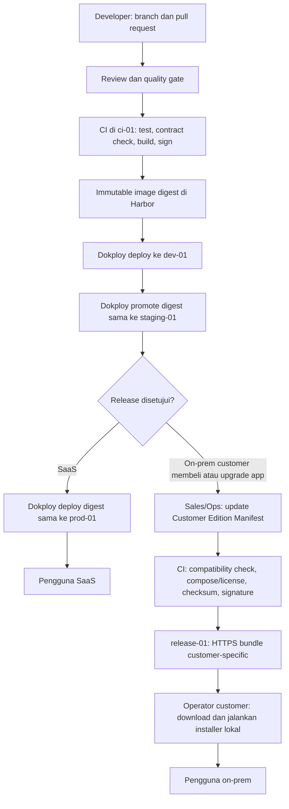

# Release, provisioning, dan on-prem perpetual

> **Sejak 15 September 2026 yang di-deploy selalu rilis, bukan `main`:** satu image untuk semua klien, dirakit
> sekali di server pertama, disimpan di Harbor, dipasang ke SaaS dev lewat digest, lalu dipilih operator di
> admin.erp untuk server klien dan dipasang agen dengan digest yang sama. Alurnya, beserta diagramnya, di
> [Dari branch sampai server klien](29-alur-rilis-server-klien.md).
>
> Bagian halaman ini tentang image per edisi, bundle, dan admin pelanggan yang menjalankan pembaruan sendiri
> menggambarkan jalur yang lebih dulu ada dan tidak berlaku untuk server klien yang dikelola. Aturan tentang
> migration yang kompatibel mundur dan pembaruan yang aman diulang tetap berlaku untuk keduanya.

## Dua bentuk rilis

Module yang berjalan di runtime Core **ikut image edisi Core**; ia tidak punya image sendiri. Satu
edisi adalah satu berkas manifest di `editions/`, berisi nama pelanggan, profil penempatan, nomor
rilis, dan id modul yang dibeli. Modul yang tidak disebut di sana **tidak ada di dalam image** —
bukan disembunyikan lisensi, melainkan berkasnya memang tidak ikut.

```bash
php artisan edition:resolve <nama berkas edisi>
```

Perintah itu yang menghitung daftar akhirnya: dependency ditutup transitif, modul penghubung ikut
hanya bila kedua sisinya ada, dan modul bahan uji ditolak. Bentuk dan aturannya ada di
`editions/README.md`.

Alur terbitnya dijaga CI, dan pembuktiannya dua arah: satu edisi dengan modul bisnis dan satu edisi
tanpa modul bisnis sama-sama dibangun, lalu pemeriksa kebocoran dijalankan pada keduanya — dan
sesudahnya pemeriksa itu sengaja dibuat merah untuk membuktikan ia masih memeriksa. Lihat
[CI/CD](22-ci-cd.md#yang-benar-benar-ada-hari-ini).

App yang masih berupa container tetap memakai jalur di bawah: image API dan UI sendiri, database
sendiri, dan bundle yang menyusunnya. Jalur itu tidak dihapus selama masih ada app yang
menjalankannya.

### Satu repo, satu `main`, rilis lewat edisi

Seluruh Core dan seluruh module hidup di satu repo dengan satu cabang utama. Yang membedakan satu
pelanggan dari pelanggan lain bukan cabang, melainkan **manifest edisi**.

Pemeliharaan versi lama memakai cabang tersendiri per edisi, dan **paling banyak dua edisi ke
belakang**. Hotfix untuk pelanggan yang belum naik versi dibuat dari cabang pemeliharaannya, bukan
dari `main` — mengambilnya dari `main` berarti mengirim perubahan yang belum pernah diuji bersama
versi yang sedang berjalan di sana. Batas dua edisi bukan angka teknis; ia batas berapa banyak versi
yang benar-benar sanggup dijaga tim sebesar ini.

### Apa yang ditulis manifest, dan apa yang dihitung mesin

Manifest edisi menyebut pelanggan, profil penempatan, nomor rilis, dan **daftar module yang dibeli**.
Yang sengaja **tidak** ditulis di sana: dependency, module penghubung, dan penolakan module bahan
uji. Ketiganya dihitung `edition:resolve`, karena daftar yang ditulis tangan akan ketinggalan pada
hari sebuah module menambah dependency baru — dan ketinggalannya baru terasa sebagai layar yang
kosong di tempat pelanggan.

Sumber kebenaran dependency adalah `depends_on` pada `app.yaml` tiap module, bukan tabel di database.
Alasannya sederhana dan mengikat: image edisi dibangun di CI, tempat tidak ada database mana pun.

Dua bentuk masukan ditolak, bukan disaring diam-diam: id module yang tidak ada di repo, dan module
bertanda `kind: internal-fixture`. Yang kedua penting — sebuah menu bernama "Contoh A" di layar
pelanggan adalah kegagalan yang tidak boleh mungkin terjadi, jadi ia harus gagal saat membangun,
bukan hilang tanpa suara.

Module penghubung dikenali dari `kind: link`. Ia ikut **hanya** bila seluruh sisinya terpilih, dan ia
**tidak pernah** menarik sisinya ikut masuk. Aturan itu berlaku juga untuk penghubung berlapis:
penghubung yang menarik sisinya akan diam-diam mengirim module yang tidak dibeli.

### Bagaimana image edisi dibangun

Pembangunannya menerima daftar module dan mengenal tiga bentuk nilai: semua module, kosong yang
berarti Core saja, dan daftar eksplisit. Pemangkasan `composer.json` beserta lockfile-nya terjadi
**sebelum** pemasangan dependency, lewat penghapusan paket tanpa memasang ulang — bukan lewat
pembaruan lockfile, yang akan ikut menaikkan versi paket lain tanpa diminta. Tahap akhir menyalin
dari tahap yang sudah dipangkas, bukan dari konteks pembangunan, supaya module yang dipangkas tidak
masuk lewat pintu belakang.

Image runtime tidak boleh memuat Dockerfile maupun suite test. Keduanya menyebut namespace module
secara harfiah, jadi keduanya adalah calon kebocoran yang akan lolos setiap pemeriksaan yang hanya
melihat folder `modules/`.

Isi `storage/` juga tidak ikut. Yang dikirim hanya rangka foldernya; berkas di dalamnya milik mesin
pembangun, dan Docker menyalin isi image ke named volume yang masih kosong — sehingga berkas mesin
pengembang berakhir di storage pelanggan pada boot pertama.

### Apa yang diperiksa sebelum sebuah edisi boleh terbit

Pemeriksaan kebocoran dijalankan pada image yang benar-benar dikirim, dan daftar module yang
dipakainya dihitung **di luar** image — image yang bocor tidak boleh menilai dirinya sendiri. Yang
diperiksa lebih dari satu jalur, karena satu module meninggalkan jejak di tempat yang berbeda dan
ketiganya bisa bocor sendiri-sendiri: berkas dan nama namespace di dalam image, tabel yang terbentuk
ketika migration dijalankan ke database kosong, dan bundel JavaScript.

Dua rincian yang menentukan apakah pemeriksanya berguna:

- Pemeriksaan tabel menjalankan migration tiap module **dari dalam image** lebih dulu. Tanpa itu, ia
  memeriksa database yang tidak pernah menerima satu pun tabel dan melaporkan bersih.
- Bundel dicari lewat bentuk yang khas — nama module diikuti pemisah — bukan lewat id telanjang. Id
  telanjang cocok dengan potongan kata yang kebetulan sama dan membanjiri hasilnya.

Pembuktian bahwa pemeriksanya **bisa merah** adalah langkah CI permanen, bukan catatan manual sekali
jalan: sebuah module yang memang dibeli diperlakukan seolah tidak dibeli, dan alurnya gagal bila
pemeriksanya tetap hijau.

Urutannya mengikat: bangun, periksa kebocoran, **baru** dorong. Satu image dibangun per **rilis**,
bukan satu image lengkap yang dipangkas per pelanggan — lapisan yang dibuang dari image lengkap tetap
ikut terkirim di dalam riwayat lapisannya.

Awalan versi yang bergerak seperti `latest` dilarang untuk penempatan, dan penjaganya berjalan
**sebelum** apa pun didorong.

### Pembaruan on-prem berbentuk satu perintah, dan aman diulang

Tidak ada saluran pembaruan otomatis, dan tidak direncanakan ada. **Pembaruan bersifat tarik, bukan
dorong**: server pelanggan tidak dibuka dari luar, dan admin di tempat pelangganlah yang
menjalankannya.

Karena admin itu tidak punya cara mengetahui apakah sebuah perintah sudah pernah jalan, **setiap
perintah pembaruan wajib aman diulang** — dijalankan dua kali harus memberi hasil yang sama persis
dengan sekali. Ini bukan anjuran gaya; ia yang membuat pembaruan bisa dilanjutkan setelah gagal di
tengah tanpa memulai dari awal.

Dua akibat langsung:

- **Migration yang sudah pernah dijalankan tidak disunting.** Perubahan skema datang lewat migration
  baru. Menyunting yang lama membuat dua server pelanggan berakhir dengan skema berbeda dari
  riwayat yang sama.
- **Fitur berparameter tidak boleh menuntut migration per parameter.** Simpan baris per kode dengan
  registry, sehingga parameter baru berarti satu entri registry dan satu titik penegakan — nol
  migration. Setiap migration harus berhasil di server setiap pelanggan, dan itu ongkos yang tidak
  sebanding untuk sebuah sakelar.

### Bentuk on-prem dan SaaS harus tetap sama

Penempatan gabungan dan penempatan terpisah memakai **skema yang persis sama**. Perbedaannya hanya
berapa banyak tenant yang tinggal di satu database, bukan bentuk tabelnya. Begitu keduanya boleh
berbeda, setiap migration harus dipikirkan dua kali dan setiap laporan bug harus menyebut profilnya
lebih dulu.

## Install bukan sekadar `composer install`

Installer membaca app manifest. Pada SaaS ia memperoleh placement dari control plane; pada on-prem perpetual ia memakai manifest dan lisensi yang tersedia lokal. Ia selalu menjalankan langkah idempotent berikut:

```text
validate license/signature/version/dependency
-> choose deployment target
-> pull image edisi Core
-> create or resolve tenant database
-> backup and run module migration
-> register manifest and event subscription
-> health check
-> record module installation for entitled tenant
```

### Perbedaan per profile

| Langkah | Pooled cloud | Isolated cloud | On-prem perpetual |
| --- | --- | --- | --- |
| Artifact | Image edisi Core sudah dideploy global | Image edisi Core per placement tenant | Operator memperoleh bundle image/manifest bertanda tangan untuk edition customer lalu memuatnya secara lokal |
| Database | Resolve database tenant yang sudah ada | Create/resolve database khusus tenant | Create volume/database Core di Compose |
| Enable | Entitlement per tenant | Entitlement + endpoint placement | Lisensi perpetual dan manifest instalasi lokal; tidak ada heartbeat vendor |
| UI | Ikut build shell Core; tidak ada artifact UI tersendiri | Sama | Sama |

Baris artifact dan database menyusut untuk module: artifact-nya adalah image Core edisi itu,
databasenya adalah database tenant yang sudah ada, dan yang dijalankan hanyalah `module:migrate`
beserta registrasi manifest.

## Workflow tim dan release self-hosted

Setiap app bisnis memiliki repository sendiri. Jumlah developer tidak mengubah boundary app, database, atau deployment. Platform dan setiap app menjalankan CI masing-masing; developer tidak pernah mengunggah image atau bundle customer secara manual.

```text
developer branch + pull request
-> CI test/build/sign pada ci-01
-> image immutable di release-01/Harbor
-> deploy digest yang sama ke Dev -> Staging -> SaaS Production
-> setelah Staging disetujui, CI membuat bundle customer bertanda tangan
-> release-01/Nginx menyajikan bundle HTTPS yang hanya dapat diakses customer berhak
```

Topologi self-hosted yang dikunci:

| Host | Peran | Akses penting |
| --- | --- | --- |
| `ops-01` | Dokploy untuk mengelola deployment `dev-01`, `staging-01`, dan `prod-01` | Tidak menyimpan source release customer. Dokploy bukan Control Plane ERP. |
| `ci-01` | Checkout source, test, build, scan, dan sign artifact | Satu-satunya host dengan hak tulis ke registry dan release directory. |
| `release-01` | Harbor untuk image private; Nginx dan filesystem `/srv/coreerp/releases/` untuk bundle customer | Customer tidak diberi akses Git atau Harbor. |
| `dev-01`, `staging-01`, `prod-01` | Menjalankan application stack melalui Dokploy | Hanya pull image yang telah dipromosikan; tidak menjalankan build. |
| `backup-01` | Backup off-host terenkripsi dari data Harbor, release directory, dan konfigurasi | Tidak melayani aplikasi. |

Aturan release yang wajib:

1. Pull request pada repository app memicu test, contract check, dan build app tersebut. Perubahan contract memicu compatibility check pada consumer yang terdaftar. CI boleh mengantri ketika banyak PR; antrean tidak mengubah hasil release.
2. CI membangun artifact sekali, memberi image digest immutable, lalu Dev, Staging, dan Production memakai digest yang sama. Tag mutable seperti `latest` dilarang untuk deployment.
3. Promotion Dev -> Staging -> Production adalah perpindahan reference digest yang telah lulus, bukan build ulang dari branch atau tag yang sama.
4. Bundle on-prem dibuat hanya dari release Production yang telah disetujui, diberi version, checksum, signature, dan path customer-specific. Versi bundle yang sudah terbit tidak boleh ditimpa.
5. Semua developer memakai branch dan pull request; credential write Harbor, signature key, serta akses `release-01` hanya tersedia bagi service account CI. Environment deployment hanya menerima credential pull dengan scope minimum.

Dengan aturan ini, tim app dapat bekerja paralel tanpa saling menimpa release. Bila volume job meningkat, kapasitas runner `ci-01` ditambah; bukan menambah jalur deploy, registry, atau proses install baru.

### Skema kerja developer sampai SaaS dan on-prem



| Tahap | Pelaksana | Yang dilakukan | Yang dilarang |
| --- | --- | --- | --- |
| Pengembangan | Developer | Mengubah satu boundary app di branch, menulis test, membuka PR | Deploy manual ke Dev/Staging/Prod atau server customer. |
| Build | CI `ci-01` | Test, contract check, build sekali, scan/sign, push image digest immutable | Menggunakan tag mutable atau credential developer. |
| Validasi | Reviewer/QA | Memeriksa release di Dev dan menyetujui promotion ke Staging | Build ulang dari branch yang berbeda. |
| SaaS | Ops/Dokploy | Mempromosikan digest Staging yang sama ke `prod-01` | Menarik source Git atau menjalankan build di Production. |
| On-prem | Sales/Ops, CI, operator customer | Memilih entitlement customer, menerbitkan bundle bertanda tangan, lalu customer meng-install lokal | Developer SSH ke server customer atau mengirim source/app tidak dibeli. |

Satu artifact source yang telah lulus dapat melayani kedua jalur. Perbedaannya: SaaS mempromosikan image ke deployment vendor, sedangkan on-prem membuat bundle hanya setelah ada Customer Edition Manifest dan entitlement customer. Server on-prem tidak menerima deployment otomatis dari Dokploy dan tidak membutuhkan koneksi runtime ke vendor.

## Customer Edition Manifest dan pembelian app tambahan

On-prem tidak membuat source branch, Docker image, atau aplikasi baru untuk setiap customer. Vendor menyimpan satu **Customer Edition Manifest** internal per instalasi customer. Manifest ini adalah input Release Manager/CI untuk memilih artifact resmi yang sudah dirilis dan membuat bundle customer-specific. Ia berada di `ci-01`/`release-01`, bukan di server customer, dan tidak memuat signing private key atau secret runtime customer.

Contoh PT.LeakStudio yang membeli POS dan Booking:

```yaml
customer_id: pt-leakstudio
deployment_profile: onprem-perpetual
release: 1.0.0
apps:
  core: 1.0.0
  pos: 1.3.0
  booking: 1.2.0
integrations:
  - pos-booking-bridge: 1.0.0
```

Release Manager memvalidasi compatibility matrix, mengambil image immutable yang tercantum, lalu menghasilkan:

```text
coreerp-leakstudio-v1.0.0.tar.gz
├── compose.yaml
├── release-manifest.json
├── license.sig
├── checksums.sha256
└── images/                 # hanya Core, POS, Booking, dan bridge berlisensi
```

Bundle disimpan di `release-01:/srv/coreerp/releases/pt-leakstudio/` dan disajikan melalui HTTPS terproteksi. Customer mengunduh lalu menjalankan installer lokal; server customer tidak melakukan `git clone`, `composer install`, atau `npm install`.

### Setelah customer membeli Backoffice

Sales/Ops menambahkan entitlement Backoffice ke Customer Edition Manifest. CI tidak meminta developer membuat kode atau mengakses server customer. Ia mencari Backoffice release yang kompatibel dengan Core/POS/Booking terpasang.

```yaml
apps:
  core: 1.0.0
  pos: 1.3.0
  booking: 1.2.0
  backoffice: 1.0.0
```

Jika versi tersebut kompatibel, CI membuat **signed add-on bundle** yang memuat Backoffice, migration, manifest/lisensi baru, dan hanya dependency upgrade yang diwajibkan oleh compatibility matrix. POS dan Booking yang telah ada tidak dibangun atau dikirim ulang. Bila tidak ada kombinasi yang kompatibel, Release Manager menolak penerbitan bundle dan menuntut upgrade prerequisite yang eksplisit.

Di server PT.LeakStudio, operator menjalankan installer add-on. Installer memverifikasi bundle, memuat image edisi baru yang sudah memuat module Backoffice, menjalankan `module:migrate` untuk module itu, mendaftarkan manifest dan event subscription, melakukan bootstrap data lewat kontrak pemilik datanya, lalu health check. Module Backoffice dilarang membaca tabel milik POS atau Booking secara langsung.

## Compose edition on-prem

Edition manifest menjelaskan dengan tepat apa yang boleh hadir pada server customer.

"Hadir" berarti berkas module itu ikut di dalam image Core edisi tersebut; ia tidak menambah satu
pun service Compose, database, atau volume. Karena itu bentuk Compose-nya tidak lagi tumbuh
mengikuti jumlah produk yang dibeli: berapa pun module yang dibeli customer, service-nya sama.

Sampai 10 September 2026 halaman ini memuat contoh kedua dengan enam service tambahan per app —
API, UI, dan database masing-masing. Contoh itu dibuang bersama jalur hosting container: tidak ada
lagi app yang dibangun sebagai image tersendiri, jadi bentuk itu tidak pernah muncul lagi pada
server pelanggan mana pun.

```yaml
services:
  gateway:
    image: coreerp/gateway:1.0.0
  core-api:
    image: coreerp/core-edition-leakstudio:1.0.0
  core-worker:
    image: coreerp/core-edition-leakstudio:1.0.0
  core-scheduler:
    image: coreerp/core-edition-leakstudio:1.0.0
  core-db:
    image: postgres:17
  # Engine render PDF milik platform; stateless, dipakai semua module. Lihat 23-document-rendering.md.
  core-renderer:
    image: gotenberg/gotenberg:8
```

Jika customer tidak membeli Booking, berkas module Booking tidak ikut ke dalam image edisi itu, tidak muncul pada manifest maupun inventaris bundle, dan tabelnya tidak pernah dibuat pada database server. Yang menegakkan batas komersialnya adalah ketiadaan berkas, bukan sebuah sakelar.

`core-renderer` adalah engine render dokumen milik Core: ia hanya mengubah berkas Office yang sudah diisi Core menjadi PDF, tidak menyimpan data, dan selalu ikut bundle. Ekspor laporan semua module dikerjakan `core-worker`; jumlah replica-nya adalah angka di compose customer, dan web serta worker Core berbagi volume storage.

`core-api` menyimpan identitas administrator lokal, manifest module aktif, riwayat pemasangan, dan lisensi perpetual yang telah diverifikasi. `core-db` adalah database platform beserta seluruh module yang dibeli, dipisahkan oleh awalan nama tabel per module. Control plane vendor **tidak** dijalankan pada server customer, juga tidak dibutuhkan agar deployment berfungsi. Images dapat dimuat dari bundle release (misalnya `docker load`) sehingga server runtime tidak perlu memiliki akses registry vendor.

Jika customer secara eksplisit membeli managed support, Compose dapat menambahkan `support-connector` terpisah. Connector hanya membuat koneksi outbound mTLS dan mengirim allow-list health/version minimum; detail batas data dan aksesnya ada di [01-grand-design.md](01-grand-design.md#konektor-support-bukan-bagian-default-on-prem).

## Update dan rollback

1. Operator mengunduh atau menerima media bundle release dan lisensi/app entitlement bertanda tangan.
2. Jalankan verifier lokal untuk signature/image digest dan cek compatibility matrix Core/app/dependency/database schema.
3. Backup database yang akan dimigrasikan.
4. Muat image, jalankan migration forward, deploy artifact baru, kemudian health check dan smoke API check.
5. Aktifkan traffic setelah health check sukses; catat installation registry dan audit event lokal.

Rollback image hanya boleh dilakukan bila migration kompatibel mundur. Jika tidak, gunakan forward fix dari release baru dan restore backup dengan prosedur recovery yang jelas.

### Perubahan skema dan mundur

**Yang dimundurkan saat rilis bermasalah adalah image, bukan database.** Migration tidak ikut mundur,
dan `down()` tidak pernah dipakai di produksi: memulihkan database dari cadangan membuang setiap
transaksi yang ditulis sesudah pembaruan, dan `down()` yang menghapus kolom membuang isinya. Di server
klinik, yang hilang adalah rekam medis dan kuitansi.

Karena itu setiap rilis wajib **kompatibel N-1**: skema sesudah migration rilis N harus tetap dapat
dipakai kode rilis N-1.

| Perubahan di migration | Kode rilis sebelumnya | Boleh dalam satu rilis |
| --- | --- | --- |
| Tabel baru | tidak mengenalnya | ya |
| Kolom baru yang boleh kosong atau punya nilai bawaan | tidak menyebutnya | ya |
| Index, constraint yang melonggarkan | tetap menulis nilai yang sah | ya |
| Kolom wajib diisi tanpa nilai bawaan pada tabel yang sudah ada | gagal saat menyisipkan baris | tidak |
| Menghapus atau mengganti nama kolom atau tabel | gagal saat membaca atau menulis | tidak |
| Mengubah tipe kolom, `SET NOT NULL`, constraint yang mengetatkan | gagal pada nilai yang dulu sah | tidak |

Perubahan yang memang harus merusak dikerjakan bertahap (**expand/contract**):

1. **Expand** — tambah kolom atau tabel baru yang boleh kosong. Kode lama tetap jalan.
2. Kode baru menulis ke yang lama dan yang baru, dan data lama diisikan ke yang baru.
3. Kode baru membaca dari yang baru.
4. **Contract** — yang lama dihapus, paling cepat satu rilis sesudah tidak ada kode yang membacanya.
   Migration-nya membawa penanda `@kontrak` beserta alasannya.

Mundur otomatis yang **memulihkan database** hanya terjadi di dalam pembaruan itu sendiri: `update.sh`
mencadangkan database tepat sebelum migration, dan memulihkannya bila migration gagal atau aplikasi
tidak menjadi sehat. Pada saat itu belum ada transaksi yang lahir di rilis baru selain yang ditulis
selama jendela pembaruan — alasan pembaruan hanya dijalankan di jendela yang disepakati.

Masalah yang ketahuan jam atau hari sesudahnya diselesaikan dengan salah satu dari tiga cara ini,
berurutan dari yang dipilih lebih dulu:

1. **Matikan fiturnya** tanpa mundur apa pun, bila fitur itu punya sakelar.
2. **Maju ke rilis perbaikan** (1.2.1), bukan mundur ke 1.1.0.
3. **Jalankan image rilis sebelumnya** di atas database yang ada. Ini aman karena aturan N-1.

Pemulihan database dari cadangan hanya untuk bencana, dan ia keputusan manusia di lokasi — bukan tombol.

**Penjaganya** `apps/core/tests/Feature/Boundary/MigrasiKompatibelMundurTest.php`. Ia membaca `up()`
setiap migration Core dan modul, dan menolak pola yang merusak kode lama kecuali migration itu
membawa `@kontrak <alasan>` (langkah contract) atau `@kompatibel-mundur <alasan>` (pola yang terbaca
merusak tetapi aman, misalnya melebarkan tipe kolom). Migration yang lahir sebelum aturan ini berlaku
dicatat di daftar beku di test itu, dan daftar itu hanya boleh berkurang.

## Disable dan uninstall

```text
disable entitlement -> hide UI / reject API -> drain workers
-> block new events -> validate dependents -> export/archive data
-> deregister routes/subscriptions -> remove placement/artifact
```

Urutan itu **berhenti di situ**. Tidak ada langkah yang menghapus data, dan tidak ada opsi untuk
menambahkannya. Baris terakhir dokumen ini dulu berbunyi `optional explicit purge database`, dan itu
menjanjikan tombol yang memang tidak ada — [standar module](02-module-standard.md#mencabut-modul-tidak-menyentuh-data)
melarangnya, penjaganya menolak perintah pencabutan yang punya opsi bernama `purge`, `delete`,
`drop`, atau `hapus`, dan retensi rekam medis menuntut data bertahan jauh lebih lama daripada masa
langganan. Memasang ulang app atau module yang sama pada tenant yang sama mengembalikan datanya
seperti sedia kala.

Kalau data memang harus benar-benar pergi — pelanggan berhenti dan memintanya — jalannya bukan
perintah pencabutan, melainkan serah terima atau ekspor lengkap yang ditulis di kontrak sebelum
pelanggan pergi.

Uninstall harus ditolak jika app lain masih declared dependency atau memiliki integration mapping aktif. Salesforce menerapkan prinsip serupa: package tidak dapat dilepas ketika komponen lain masih mereferensikannya. [Salesforce package uninstall](https://help.salesforce.com/s/articleView?id=000392277&language=en_US&type=1)

Untuk module, penolakan itu diperiksa **terhadap tenant, bukan terhadap katalog**: pencabutan ditolak
bila module masih menjadi dependency module lain yang terpasang pada tenant yang sama.

## License dan source protection

- License mengontrol entitlement; artifact composition mengontrol apa yang benar-benar terkirim.
- Source app yang tidak dibeli harus absent dari on-prem bundle, Compose manifest, build context, dan image cache.
- Lisensi perpetual dan app entitlement diverifikasi secara lokal dari signature vendor. Tidak ada call-home atau online grace period sebagai dependency runtime. Perpanjangan support atau pembelian app baru menghasilkan bundle/lisensi bertanda tangan yang dipasang operator.
- Kode yang dieksekusi di server customer tidak dapat dibuat 100% rahasia secara teknis. Signed artifact, registry access, container, kontrak lisensi, dan audit menaikkan proteksi; bukan pengganti SaaS/hybrid bila kerahasiaan absolut diperlukan.

## Lihat juga

- [Standar module](02-module-standard.md) — definisi release unit yang dirilis di sini
- [Mendaftarkan katalog produk](13-publishing-an-app-release.md) — kontrak CI untuk katalog dan release
- [Development stack lokal](11-local-docker-development.md) — versi lokal dari mekanisme yang sama
- [Gate fondasi Core](10-core-foundation-gates.md) — syarat sebelum deployment production aktif
- [Tiga kebenaran lifecycle](../onboarding/tiga-kebenaran.md) — kenapa "terpasang" bukan satu status
