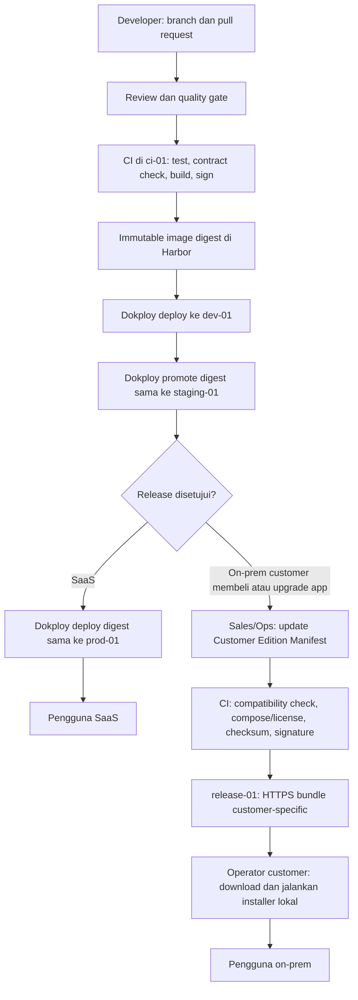

# Release, provisioning, dan on-prem perpetual

## Install bukan sekadar `composer install`

Installer membaca app manifest. Pada SaaS ia memperoleh placement dari control plane; pada on-prem perpetual ia memakai manifest dan lisensi yang tersedia lokal. Ia selalu menjalankan langkah idempotent berikut:

```text
validate license/signature/version/dependency
-> choose deployment target
-> pull API and UI artifact
-> create or resolve app database
-> backup and run migration
-> register API/UI/event subscription
-> health check
-> bind entitled tenant to ready placement
```

### Perbedaan per profile

| Langkah | Pooled cloud | Isolated cloud | On-prem perpetual |
| --- | --- | --- | --- |
| Artifact | Sudah dideploy global per release | Pull/deploy per tenant placement | Operator memperoleh bundle image/manifest bertanda tangan untuk edition customer lalu memuatnya secara lokal |
| Database | Resolve `app_pool_db` | Create/resolve `app_tenant_db` | Create volume/database app di Compose |
| Enable | Entitlement per tenant | Entitlement + endpoint placement | Lisensi perpetual dan manifest instalasi lokal; tidak ada heartbeat vendor |
| UI | CDN/registry manifest per tenant | Dedicated endpoint atau artifact | Static UI container pada server customer |

## Workflow tim dan release self-hosted

Setiap app bisnis memiliki repository sendiri. Jumlah developer tidak mengubah boundary app, database, atau deployment. Platform dan setiap app menjalankan CI masing-masing; developer tidak pernah mengunggah image atau bundle customer secara manual.

```text
developer branch + pull request
-> CI test/build/sign pada ci-01
-> image immutable di release-01/Harbor
-> deploy digest yang sama ke Dev -> Staging -> SaaS Production
-> setelah Staging disetujui, CI membuat bundle customer bertanda tangan
-> release-01/Nginx menyajikan bundle HTTPS yang hanya dapat diakses customer berhak
```

Topologi self-hosted yang dikunci:

| Host | Peran | Akses penting |
| --- | --- | --- |
| `ops-01` | Dokploy untuk mengelola deployment `dev-01`, `staging-01`, dan `prod-01` | Tidak menyimpan source release customer. Dokploy bukan Control Plane ERP. |
| `ci-01` | Checkout source, test, build, scan, dan sign artifact | Satu-satunya host dengan hak tulis ke registry dan release directory. |
| `release-01` | Harbor untuk image private; Nginx dan filesystem `/srv/coreerp/releases/` untuk bundle customer | Customer tidak diberi akses Git atau Harbor. |
| `dev-01`, `staging-01`, `prod-01` | Menjalankan application stack melalui Dokploy | Hanya pull image yang telah dipromosikan; tidak menjalankan build. |
| `backup-01` | Backup off-host terenkripsi dari data Harbor, release directory, dan konfigurasi | Tidak melayani aplikasi. |

Aturan release yang wajib:

1. Pull request pada repository app memicu test, contract check, dan build app tersebut. Perubahan contract memicu compatibility check pada consumer yang terdaftar. CI boleh mengantri ketika banyak PR; antrean tidak mengubah hasil release.
2. CI membangun artifact sekali, memberi image digest immutable, lalu Dev, Staging, dan Production memakai digest yang sama. Tag mutable seperti `latest` dilarang untuk deployment.
3. Promotion Dev -> Staging -> Production adalah perpindahan reference digest yang telah lulus, bukan build ulang dari branch atau tag yang sama.
4. Bundle on-prem dibuat hanya dari release Production yang telah disetujui, diberi version, checksum, signature, dan path customer-specific. Versi bundle yang sudah terbit tidak boleh ditimpa.
5. Semua developer memakai branch dan pull request; credential write Harbor, signature key, serta akses `release-01` hanya tersedia bagi service account CI. Environment deployment hanya menerima credential pull dengan scope minimum.

Dengan aturan ini, tim app dapat bekerja paralel tanpa saling menimpa release. Bila volume job meningkat, kapasitas runner `ci-01` ditambah; bukan menambah jalur deploy, registry, atau proses install baru.

### Skema kerja developer sampai SaaS dan on-prem



| Tahap | Pelaksana | Yang dilakukan | Yang dilarang |
| --- | --- | --- | --- |
| Pengembangan | Developer | Mengubah satu boundary app di branch, menulis test, membuka PR | Deploy manual ke Dev/Staging/Prod atau server customer. |
| Build | CI `ci-01` | Test, contract check, build sekali, scan/sign, push image digest immutable | Menggunakan tag mutable atau credential developer. |
| Validasi | Reviewer/QA | Memeriksa release di Dev dan menyetujui promotion ke Staging | Build ulang dari branch yang berbeda. |
| SaaS | Ops/Dokploy | Mempromosikan digest Staging yang sama ke `prod-01` | Menarik source Git atau menjalankan build di Production. |
| On-prem | Sales/Ops, CI, operator customer | Memilih entitlement customer, menerbitkan bundle bertanda tangan, lalu customer meng-install lokal | Developer SSH ke server customer atau mengirim source/app tidak dibeli. |

Satu artifact source yang telah lulus dapat melayani kedua jalur. Perbedaannya: SaaS mempromosikan image ke deployment vendor, sedangkan on-prem membuat bundle hanya setelah ada Customer Edition Manifest dan entitlement customer. Server on-prem tidak menerima deployment otomatis dari Dokploy dan tidak membutuhkan koneksi runtime ke vendor.

## Customer Edition Manifest dan pembelian app tambahan

On-prem tidak membuat source branch, Docker image, atau aplikasi baru untuk setiap customer. Vendor menyimpan satu **Customer Edition Manifest** internal per instalasi customer. Manifest ini adalah input Release Manager/CI untuk memilih artifact resmi yang sudah dirilis dan membuat bundle customer-specific. Ia berada di `ci-01`/`release-01`, bukan di server customer, dan tidak memuat signing private key atau secret runtime customer.

Contoh PT.LeakStudio yang membeli POS dan Booking:

```yaml
customer_id: pt-leakstudio
deployment_profile: onprem-perpetual
release: 1.0.0
apps:
  core: 1.0.0
  pos: 1.3.0
  booking: 1.2.0
integrations:
  - pos-booking-bridge: 1.0.0
```

Release Manager memvalidasi compatibility matrix, mengambil image immutable yang tercantum, lalu menghasilkan:

```text
coreerp-leakstudio-v1.0.0.tar.gz
├── compose.yaml
├── release-manifest.json
├── license.sig
├── checksums.sha256
└── images/                 # hanya Core, POS, Booking, dan bridge berlisensi
```

Bundle disimpan di `release-01:/srv/coreerp/releases/pt-leakstudio/` dan disajikan melalui HTTPS terproteksi. Customer mengunduh lalu menjalankan installer lokal; server customer tidak melakukan `git clone`, `composer install`, atau `npm install`.

### Setelah customer membeli Backoffice

Sales/Ops menambahkan entitlement Backoffice ke Customer Edition Manifest. CI tidak meminta developer membuat kode atau mengakses server customer. Ia mencari Backoffice release yang kompatibel dengan Core/POS/Booking terpasang.

```yaml
apps:
  core: 1.0.0
  pos: 1.3.0
  booking: 1.2.0
  backoffice: 1.0.0
```

Jika versi tersebut kompatibel, CI membuat **signed add-on bundle** yang memuat Backoffice, migration, manifest/lisensi baru, dan hanya dependency upgrade yang diwajibkan oleh compatibility matrix. POS dan Booking yang telah ada tidak dibangun atau dikirim ulang. Bila tidak ada kombinasi yang kompatibel, Release Manager menolak penerbitan bundle dan menuntut upgrade prerequisite yang eksplisit.

Di server PT.LeakStudio, operator menjalankan installer add-on. Installer memverifikasi bundle, membuat `backoffice_db`, menjalankan migration, memuat image Backoffice, mendaftarkan API/UI/event subscription, melakukan bootstrap data melalui API/event contract pemilik data, lalu health check. Ia dilarang membaca `pos_db` atau `booking_db` secara langsung.

## Compose edition on-prem

Edition manifest menjelaskan dengan tepat apa yang boleh hadir pada server customer. Contoh customer membeli Core, POS, Booking, dan bridge:

```yaml
services:
  gateway:
    image: coreerp/gateway:1.0.0
  core-api:
    image: coreerp/core-api:1.0.0
  core-db:
    image: postgres:17
  pos-api:
    image: coreerp/pos-api:1.0.0
  pos-ui:
    image: coreerp/pos-ui:1.0.0
  pos-db:
    image: postgres:17
  booking-api:
    image: coreerp/booking-api:1.0.0
  booking-ui:
    image: coreerp/booking-ui:1.0.0
  booking-db:
    image: postgres:17
  pos-booking-bridge:
    image: coreerp/pos-booking-bridge:1.0.0
  bridge-db:
    image: postgres:17
```

Jika customer tidak membeli Booking, seluruh `booking-*` dan `pos-booking-bridge` tidak muncul pada manifest, inventaris bundle, Compose file, image cache, atau database server. Dalam production cloud, `pos-db` dapat berarti database logis pada cluster managed; Compose menunjukkan boundary yang mudah dipahami pada server customer.

`core-api` menyimpan identitas administrator lokal, manifest app aktif, riwayat instalasi, dan lisensi perpetual yang telah diverifikasi. `core-db` adalah database milik platform core; ia bukan database POS atau Booking. Control plane vendor **tidak** dijalankan pada server customer, juga tidak dibutuhkan agar deployment berfungsi. Images dapat dimuat dari bundle release (misalnya `docker load`) sehingga server runtime tidak perlu memiliki akses registry vendor.

Jika customer secara eksplisit membeli managed support, Compose dapat menambahkan `support-connector` terpisah. Connector hanya membuat koneksi outbound mTLS dan mengirim allow-list health/version minimum; detail batas data dan aksesnya ada di [01-grand-design.md](01-grand-design.md#konektor-support-bukan-bagian-default-on-prem).

## Update dan rollback

1. Operator mengunduh atau menerima media bundle release dan lisensi/app entitlement bertanda tangan.
2. Jalankan verifier lokal untuk signature/image digest dan cek compatibility matrix Core/app/dependency/database schema.
3. Backup database yang akan dimigrasikan.
4. Muat image, jalankan migration forward, deploy artifact baru, kemudian health check dan smoke API check.
5. Aktifkan traffic setelah health check sukses; catat installation registry dan audit event lokal.

Rollback image hanya boleh dilakukan bila migration kompatibel mundur. Jika tidak, gunakan forward fix dari release baru dan restore backup dengan prosedur recovery yang jelas.

## Disable dan uninstall

```text
disable entitlement -> hide UI / reject API -> drain workers
-> block new events -> validate dependents -> export/archive data
-> deregister routes/subscriptions -> remove placement/artifact
-> optional explicit purge database
```

Uninstall harus ditolak jika app lain masih declared dependency atau memiliki integration mapping aktif. Salesforce menerapkan prinsip serupa: package tidak dapat dilepas ketika komponen lain masih mereferensikannya. [Salesforce package uninstall](https://help.salesforce.com/s/articleView?id=000392277&language=en_US&type=1)

## License dan source protection

- License mengontrol entitlement; artifact composition mengontrol apa yang benar-benar terkirim.
- Source app yang tidak dibeli harus absent dari on-prem bundle, Compose manifest, build context, dan image cache.
- Lisensi perpetual dan app entitlement diverifikasi secara lokal dari signature vendor. Tidak ada call-home atau online grace period sebagai dependency runtime. Perpanjangan support atau pembelian app baru menghasilkan bundle/lisensi bertanda tangan yang dipasang operator.
- Kode yang dieksekusi di server customer tidak dapat dibuat 100% rahasia secara teknis. Signed artifact, registry access, container, kontrak lisensi, dan audit menaikkan proteksi; bukan pengganti SaaS/hybrid bila kerahasiaan absolut diperlukan.
