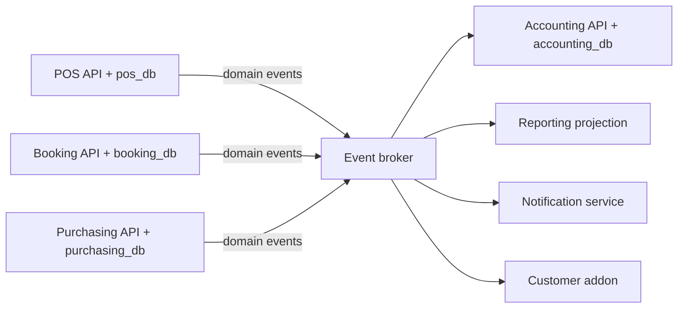
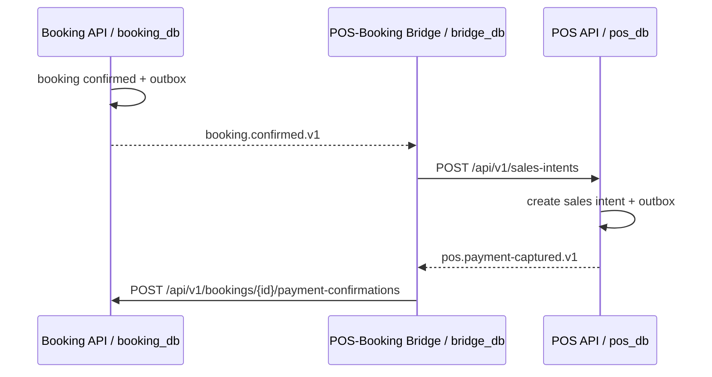

# API, event, dan integrasi module

## Satu aturan utama per jenis komunikasi

| Kebutuhan | Standar | Contoh |
| --- | --- | --- |
| Request/response browser, mobile, partner, dan admin | REST/JSON + OpenAPI 3.1 | `POST /api/v1/orders` |
| Dampak lintas database yang boleh async | Event + outbox/inbox + AsyncAPI | `pos.payment-captured.v1` |
| Streaming/latency internal yang terbukti tidak memenuhi SLO setelah optimasi | gRPC + Protobuf melalui ADR | Bukan standar v1 |
| Komposisi read model lintas module | REST BFF dahulu; GraphQL gateway melalui ADR | Dashboard holding |

REST adalah perintah atau permintaan data: "buat order" atau "tampilkan catalog". Event adalah fakta masa lalu: "order sudah dibayar". Event bukan pengganti REST, dan REST bukan transaction coordinator lintas database.

## Event backbone untuk banyak module

Event broker adalah backbone publish/subscribe bersama. Ia mencegah pola integration satu-ke-satu yang akan tumbuh tidak terkendali ketika module bertambah. Setiap module hanya mendeklarasikan event yang dipublish dan event yang disubscribe dalam AsyncAPI-nya.



Bridge bukan kewajiban bagi setiap pasangan module. Ia hanya digunakan bila integration memerlukan state mapping, orkestrasi, atau policy khusus. Contoh: POS-Booking Bridge menyimpan relasi booking ke sales intent dan mengorkestrasi alur pembayaran. Sebaliknya, Accounting atau Reporting biasanya cukup menjadi consumer event publik dari banyak module tanpa bridge per pasangan.

## Kontrak wajib

Setiap API versioned memakai prefix `/api/v1`. OpenAPI mendefinisikan auth scheme, request, response, error, pagination, idempotency key, dan rate limit. Event memakai nama `module.aggregate.action.vN`, metadata minimum berikut:

```json
{
  "id": "evt_01...",
  "type": "pos.payment-captured.v1",
  "occurred_at": "2026-07-20T10:00:00Z",
  "tenant_id": "ten_01...",
  "legal_entity_id": "org_legal_01...",
  "org_unit_id": "org_01...",
  "correlation_id": "req_01...",
  "data": {}
}
```

`tenant_id` wajib pada event tenant-owned. `legal_entity_id` wajib ketika fakta mempunyai konsekuensi hukum/akuntansi, sedangkan `org_unit_id` dipakai bila fakta dimiliki operating unit. Ketiganya mengikuti [model tenant dan organisasi](01a-tenant-and-org-hierarchy.md); producer tidak menebak legal entity dari posisi organization pada hierarchy saat event dikonsumsi kemudian.

Producer menyimpan payload ke `outbox_events` dalam transaksi yang sama dengan data bisnis. Publisher mengirimkannya setelah commit. Consumer menyimpan message ID pada inbox/processed-events sehingga retry tidak menciptakan efek ganda.

## POS dan Booking tanpa shared database



Bridge menyimpan mapping `booking_id <-> pos_sales_intent_id`, inbox, retry state, dan audit di `bridge_db`. POS dan Booking tetap dapat di-install sendiri. Bridge hanya bisa enabled bila keduanya available dan versi contract kompatibel.

## Extension point

Module hanya boleh membuka extension point yang eksplisit:

- Read API untuk data yang diizinkan.
- Command API dengan authorization dan idempotency.
- Domain event publish/subscribe yang versioned.
- UI host SDK untuk navigation, route, dan permitted widgets.
- Webhook outbound dengan signature dan retry.

Addon tidak boleh mendapat database credential module lain, meng-import model internal, atau menambahkan route ke service module lain.
