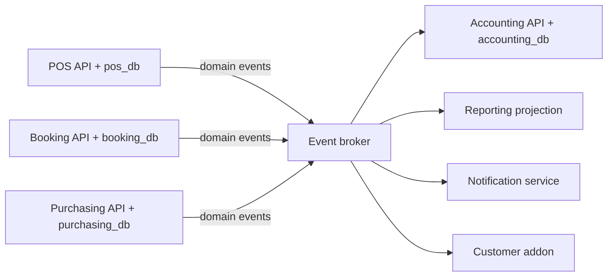
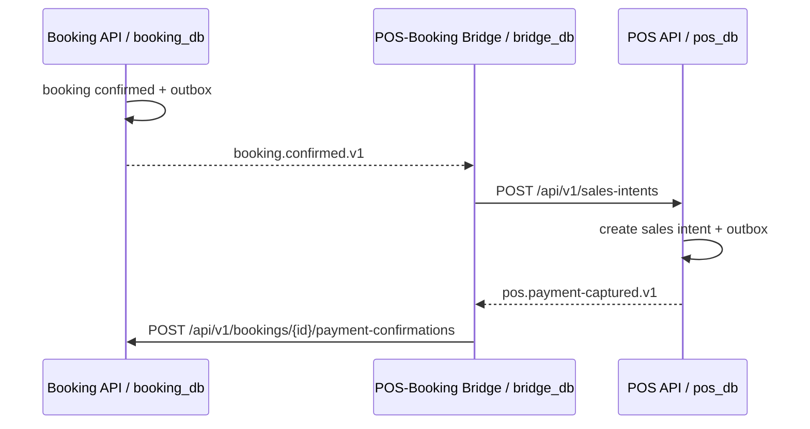

# API, event, dan integrasi module

## Batas mana yang sedang dilewati

Aturan di halaman ini menjawab pertanyaan "bagaimana melewati batas antar app". Bentuk jawabannya
bergantung pada batas mana yang dilewati:

| Batas | Bentuk |
| --- | --- |
| Module ke Core, di satu runtime | Pemanggilan fungsi lewat antarmuka di `App\Support\Modules\Contracts` |
| Module ke module, di satu runtime | Event Laravel yang dikirim di dalam proses, dengan nama dan envelope yang sama seperti event terbit |
| Addon pihak ketiga ke Core | REST `internal/v1` dengan token layanan |
| Sistem eksternal milik tenant | REST/OpenAPI, lihat [integrasi sistem eksternal](12-external-module-integration.md) |

Yang **tidak** berubah karena bentuknya: nama event `module.aggregate.action.vN`, isi envelope, dan
aturan versinya. Sebuah event yang hari ini dikirim di dalam proses harus tetap bisa diterbitkan ke
broker tanpa mengubah namanya, dan itulah sebabnya bentuknya tidak boleh disederhanakan hanya
karena pengirim dan penerimanya kebetulan satu proses.

Satu akibat yang mudah terlewat: **pengiriman di dalam proses mengubah waktunya, bukan hanya
jalurnya.** Listener berjalan sebelum pemanggilnya selesai, jadi ia ikut ke dalam transaksi yang
sedang berjalan. Itu keuntungan — dokumen dan akibatnya berpindah status bersama atau tidak sama
sekali — tetapi ia juga berarti listener yang lambat menahan transaksi.

## Kontrak module ke Core

### Satu namespace, dan hanya satu

Module hanya boleh menyebut **`App\Support\Modules\Contracts`**. Bukan `App\Support\Modules`,
bukan `App\Models`, bukan apa pun yang lain di dalam Core. Kelonggaran ke seluruh
`App\Support\Modules` sudah dicoba dan dibuang: begitu satu folder pembantu ikut terbuka, batasnya
berhenti bisa dijelaskan dalam satu kalimat, dan batas yang tidak bisa dijelaskan dalam satu kalimat
tidak akan dipatuhi.

Penjaganya `ModuleNamespaceBoundaryTest`. Ia **membaca berkas**, bukan menganalisa tipe: baris `use`
dan pemanggilan statis tidak sampai ke aturan PHPStan, jadi aturan tipe akan melaporkan bersih
sambil melewatkan justru bentuk yang paling sering dipakai. Yang boleh disebut module hanya kelas
Core di dalam `Contracts`, kerangka kerja, dan kelasnya sendiri.

### Antarmuka menerima id dan memulangkan baris biasa

Antarmuka kontrak menerima **id**, bukan model Core, dan memulangkan **baris biasa**, bukan model
Core. Alasannya bukan kerapian: memulangkan model berarti module memegang objek Core dan bisa
memanggil apa pun padanya — relasi, `save()`, scope — sehingga batas yang dijaga namespace bocor
lewat objek yang sudah telanjur diberikan.

Daftar layanan Core yang boleh dipanggil module ada di folder itu sendiri; jangan menuliskan
salinannya di sini, karena salinan akan menyimpang pada hari sebuah antarmuka bertambah. Satu baris
yang paling mudah terlewat pantas disebut: **konteks tenant**. Setiap module membutuhkannya sebelum
bisa melakukan apa pun, dan ia **gagal menutup**: tanpa tenant aktif, query dibatalkan dengan
pengecualian alih-alih dijalankan tanpa penyaringan. Kontraknya tidak boleh memulangkan `null` —
`null` memaksa setiap pemanggil memutuskan sendiri apa artinya, dan sebagian akan memutuskan
"berarti semua tenant".

### Kontrak dibangun dari kebutuhan pemanggilnya

Kontrak yang disusun dari **yang kebetulan tersedia** di layanan Core akan kehilangan hal yang
justru dipakai. Ini pernah terjadi: antarmuka kalender fiskal dibentuk mengikuti bentuk kembalian
layanan Core-nya, dan diam-diam kehilangan tanggal awal tahun fiskal yang dipakai pemanggilnya.
Bacalah pemanggilnya dulu, baru tulis antarmukanya.

Akibat wajar dari itu: kontrak harus punya pintu untuk kebutuhan yang nyata. Module yang tidak punya
pintu resmi tidak akan berhenti membutuhkannya — ia akan menyentuh model Core langsung, dan penjaga
namespace baru menangkapnya setelah kodenya ditulis.

### Pembungkus per module menerjemahkan kegagalan Core

Exception Core yang membocorkan nama field milik Core, atau perbedaan antara "memulangkan `null`"
dan "melempar" pada keadaan yang sama, tidak boleh diteruskan apa adanya ke pemanggil module. Itu
salah satu alasan pembungkus per module ada: ia menerjemahkan kegagalan Core menjadi kegagalan yang
masuk akal di dalam bahasa module.

### Module tidak melompat lewat HTTP ke Core

Module berada di proses yang sama dengan Core, jadi memanggil Core lewat HTTP berarti membayar
serialisasi, jaringan, dan satu jalur kegagalan baru untuk sesuatu yang sebenarnya pemanggilan
fungsi. Penjaganya `NoInternalHttpTest`, dan ia mencari **dua bahan sekaligus** — klien yang membuka
koneksi, serta alamat atau kredensial Core — karena satu bahan saja terlalu sering muncul pada kode
yang sah. Komentar dibuang sebelum diperiksa, dan **module yang sedang dipindah tidak dikecualikan**.

Akibat yang mengikuti: penerbitan nomor yang gagal menjawab **422, bukan 503**. Core tidak lagi
"tidak terjangkau", jadi kode kesalahan jaringan pada jalur itu bukan sekadar berhenti dipakai — ia
dibuat tidak bisa ditulis lagi.

### Nomor, dokumen, dan pengajuan workflow satu transaksi

Penerbitan nomor boleh dipanggil dari dalam transaksi pemanggilnya dan tidak wajib berada di
dalamnya; transaksi layanan nomor menjadi savepoint. Yang mengikat adalah hasilnya: nomor, dokumen,
dan pengajuan workflow berada dalam **satu** transaksi. Invarian yang dijaga test: ketika transaksi
gagal, nilai berikutnya kembali seperti semula dan tidak ada baris penerbitan yang selamat.

Pengaju dan korelasi adalah **parameter wajib**, bukan kunci opsional di dalam array — kunci opsional
yang lupa diisi menghasilkan jejak audit tanpa pelaku. Pengaju disebut dengan id pengguna, bukan id
keanggotaan; keanggotaan tenant milik Core dan bentuknya boleh berubah tanpa memberi tahu module.

### Event yang didengarkan module

Event yang didengarkan module tinggal di `Contracts`, karena ia bagian dari permukaan yang
dijanjikan Core. Listener keputusan berjalan **di dalam** transaksi keputusan, dan amplopnya disusun
sekali untuk baris outbox maupun event yang dikirim — dua penyusunan berarti dua bentuk yang akan
menyimpang.

Satu akibat yang mudah terlewat: listener wajib menerima dokumen yang id instance workflow-nya
**belum tercatat**. Pengiriman seketika memunculkan urutan yang dulu mustahil, karena dulu event
selalu tiba setelah transaksi pengirimnya selesai.

### Rute module dan rute Core tidak berbagi awalan

Rute API module hidup di bawah `/api/modules/<id module>/v1`. Awalan `/api/v1` milik Core sendiri
dan tidak dibagi dua pemilik: dua pemilik pada satu awalan berarti setiap penambahan rute Core harus
memeriksa dulu apakah sebuah module sudah memakainya.

Endpoint `/api/internal/v1/` **tidak dihapus** bersama jalur hosting container. Ia tetap ada untuk
integrasi luar dan addon pihak ketiga, dan kontraknya tetap dijaga pemeriksa cakupan.

Satu hal berubah di dalamnya: penentu kesiapan. Dulu sebuah pemanggil diterima bila tenantnya
berhak **dan** ada penempatan container yang berstatus siap. Penempatan itu tidak ada lagi, jadi
yang dibaca sekarang adalah catatan pemasangan module — tenant berhak dan module-nya terpasang.
Mempertahankan penentu lama berarti menolak setiap pemanggil, karena tidak ada lagi yang menulis
tabel penempatan.

### Setelan yang tetap ada meski pemakaiannya menyusut

`COREERP_APP_CONTEXT_SIGNING_KEY` tetap ada dan tidak boleh dihapus: ia masih menandatangani HMAC
event yang keluar dari proses ini. Menghapusnya tidak menjatuhkan apa pun dengan berisik — antrean
menumpuk tanpa satu pun kesalahan terlihat.

`COREERP_EVENT_ENDPOINTS` juga dipertahankan, dan nilainya `[]` bila tidak ada penerima luar. Module
di dalam image tidak lewat sini; mereka menerima event sebagai pemanggilan fungsi. Penerima di dalam
proses dikenali lewat kunci `module` pada setelan endpoint, **bukan** ditebak dari bentuk URL-nya,
dan barisnya tetap ditandai terkirim.

### Kontrak berkas untuk module bukan kontrak yang dijaga CI

Untuk module di dalam runtime, berkas `contracts/*.json` adalah **dokumentasi**, bukan kontrak yang
dijaga pemeriksa cakupan. Permukaan yang benar-benar melewati batas berpindah menjadi kontrak PHP di
dalam proses, dan di sanalah penyimpangannya ketahuan — pada waktu analisa tipe, bukan pada waktu
seseorang ingat membandingkan dua berkas.

## Satu aturan utama per jenis komunikasi

| Kebutuhan | Standar | Contoh |
| --- | --- | --- |
| Request/response browser, mobile, partner, dan admin | REST/JSON + OpenAPI 3.1 | `POST /api/v1/orders` |
| Dampak lintas database yang boleh async | Event + outbox/inbox + AsyncAPI | `pos.payment-captured.v1` |
| Streaming/latency internal yang terbukti tidak memenuhi SLO setelah optimasi | gRPC + Protobuf melalui ADR | Bukan standar v1 |
| Komposisi read model lintas module | REST BFF dahulu; GraphQL gateway melalui ADR | Dashboard holding |

REST adalah perintah atau permintaan data: "buat order" atau "tampilkan catalog". Event adalah fakta masa lalu: "order sudah dibayar". Event bukan pengganti REST, dan REST bukan transaction coordinator lintas database.

## Event backbone untuk banyak module

Event broker adalah backbone publish/subscribe bersama. Ia mencegah pola integration satu-ke-satu yang akan tumbuh tidak terkendali ketika module bertambah. Setiap module hanya mendeklarasikan event yang dipublish dan event yang disubscribe dalam AsyncAPI-nya.



Bridge bukan kewajiban bagi setiap pasangan module. Ia hanya digunakan bila integration memerlukan state mapping, orkestrasi, atau policy khusus. Contoh: POS-Booking Bridge menyimpan relasi booking ke sales intent dan mengorkestrasi alur pembayaran. Sebaliknya, Accounting atau Reporting biasanya cukup menjadi consumer event publik dari banyak module tanpa bridge per pasangan.

## Kontrak wajib

Setiap API versioned memakai prefix `/api/v1`. OpenAPI mendefinisikan auth scheme, request, response, error, pagination, idempotency key, dan rate limit. Event memakai nama `module.aggregate.action.vN`, metadata minimum berikut:

```json
{
  "id": "evt_01...",
  "type": "pos.payment-captured.v1",
  "occurred_at": "2026-07-20T10:00:00Z",
  "tenant_id": "ten_01...",
  "legal_entity_id": "org_legal_01...",
  "org_unit_id": "org_01...",
  "correlation_id": "req_01...",
  "data": {}
}
```

`tenant_id` wajib pada event tenant-owned. `legal_entity_id` wajib ketika fakta mempunyai konsekuensi hukum/akuntansi, sedangkan `org_unit_id` dipakai bila fakta dimiliki operating unit. Ketiganya mengikuti [model tenant dan organisasi](01a-tenant-and-org-hierarchy.md); producer tidak menebak legal entity dari posisi organization pada hierarchy saat event dikonsumsi kemudian.

Producer menyimpan payload ke `outbox_events` dalam transaksi yang sama dengan data bisnis. Publisher mengirimkannya setelah commit. Consumer menyimpan message ID pada inbox/processed-events sehingga retry tidak menciptakan efek ganda.

### Kontrak dijaga pemeriksa, bukan kedisiplinan

**Tidak ada satu test pun yang gagal ketika sebuah endpoint absen dari kontrak.** Itu sebabnya endpoint tak terdokumentasi bisa bertahan lama sementara seluruh test hijau — dan kenapa setiap app wajib punya pemeriksa cakupan yang jalan di CI, bukan hanya Core.

Pemeriksa membandingkan rute yang benar-benar terdaftar terhadap kontraknya, dua arah: rute tanpa kontrak, dan kontrak tanpa rute. Tiga hal menentukan apakah ia berguna:

- **Baca rute dari framework, bukan dari teks berkas rute.** Rute yang didaftarkan lewat loop tidak pernah muncul sebagai literal, jadi pencocokan teks melapor bersih sambil melewatkan puluhan rute. `php artisan route:list --json` adalah daftar yang berwenang.
- **Mekarkan jalur bertemplat yang parameternya ber-`enum`** sebelum membandingkan. Satu jalur bertemplat sah mendokumentasikan beberapa resource; dibandingkan apa adanya ia melaporkan endpoint yang sudah terdokumentasi sebagai hilang. Pemeriksa yang sering salah memberi peringatan akan berhenti dipercaya lalu diabaikan.
- **Sebut celah yang ditunda, jangan maafkan diam-diam.** Celah yang diketahui dan ada pemiliknya masuk daftar pengecualian beserta alasannya, dicetak tiap kali pemeriksa jalan. Entry yang tidak lagi cocok dengan rute hidup harus gagal, supaya pengecualian basi tidak memaafkan rute lain yang kelak memakai jalur itu.

Kebalikannya juga berlaku: **kode tidak boleh menerima field yang dilarang kontraknya.** Kalau skema memakai `additionalProperties: false` dan field itu tidak ada di dalamnya, ia tidak akan pernah tiba lewat jalur yang sah. Handler yang tetap memvalidasinya mengiklankan kemampuan yang tidak ada, dan pembaca berikutnya menyimpulkan penerbitnya bisa mengirimkannya. Kalau field itu memang ditunda, yang menunggu adalah kodenya, bukan kontraknya.

Implementasi rujukan: `contracts/check-contract-coverage.py` di Core, dijalankan langkah **Check internal API contract coverage** pada `.github/workflows/lint.yml`. Rutenya dibaca dari `php artisan route:list --json`, bukan dari teks `routes/api.php`.

Kontrak `internal/v1` Core ditulis terpecah di `apps/core/contracts/internal/`: satu berkas per path (`paths/`), per webhook (`webhooks/`), dan per komponen (`components/`), ditambah satu akar per pembaca. `python contracts/bundle.py` merakitnya menjadi `contracts/openapi-internal.yaml` (gabungan semua pembaca) dan `contracts/terbit/` (satu spesifikasi per akar, beserta `katalog.json`); langkah **Check internal API contract bundles** menolak berkas hasil yang tidak sama dengan sumbernya. Sistem di luar CoreERP mendapat satu akar per domain — `integrasi-finance.yaml` hari ini — dan akar yang `x-portal.publik`-nya `true` terbit tanpa login di portal `/docs` (tampilan Scalar). Kontrak app module, pusat admin, dan referensi Scramble untuk layar CoreERP tetap di balik gate `viewApiDocs`.

Aturan ini berlaku untuk permukaan yang **melewati batas proses**. Rute module yang hanya dipanggil halamannya sendiri, di dalam repo dan proses yang sama, tidak dikontrakkan sebagai OpenAPI terbit: penyimpangannya terlihat pada test module dan pada halaman yang memanggilnya, dan pemeriksa cakupan yang memaksakan kontrak di situ hanya menambah berkas yang harus dirawat. Yang tetap wajib berkontrak adalah permukaan yang dipanggil dari luar runtime.

## POS dan Booking tanpa shared database



Bridge menyimpan mapping `booking_id <-> pos_sales_intent_id`, inbox, retry state, dan audit di `bridge_db`. POS dan Booking tetap dapat di-install sendiri. Bridge hanya bisa enabled bila keduanya available dan versi contract kompatibel.

## Extension point

Module hanya boleh membuka extension point yang eksplisit:

- Read API untuk data yang diizinkan.
- Command API dengan authorization dan idempotency.
- Domain event publish/subscribe yang versioned.
- UI host SDK untuk navigation, route, dan permitted widgets.
- Webhook outbound dengan signature dan retry.

Addon tidak boleh mendapat database credential module lain, meng-import model internal, atau menambahkan route ke service module lain.

## Lihat juga

- [Standar module](02-module-standard.md) — kepemilikan database yang membuat kontrak ini perlu
- [Integrasi sistem eksternal](12-external-module-integration.md) — penerapan kontrak untuk pihak luar
- [Reporting dan read replica](07-reporting-and-replicas.md) — konsumsi event untuk laporan gabungan
- [Query scope dan schema](08-query-scopes-and-schema.md) — field scope yang dibawa envelope event
