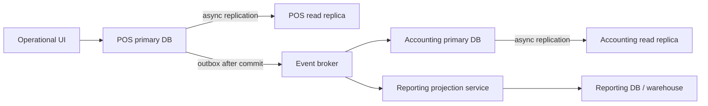

# Reporting, read replica, dan event projection

## Tiga sumber baca yang berbeda

Event broker dan database replica saling melengkapi; keduanya tidak menyelesaikan masalah yang sama.



| Kebutuhan | Sumber baca | Contoh |
| --- | --- | --- |
| Data operasional satu module | Read replica module, bila query boleh sedikit tertinggal | Laporan penjualan POS per outlet |
| Data operasional yang harus terbaru | Primary DB atau API module pemilik | Status payment yang baru saja diproses |
| Report gabungan beberapa module | Reporting DB/read model dari event projection | Dashboard holding: sales, booking, stock, finance |
| Analitik berat/historis | Warehouse/analytics store dari event atau CDC | KPI bulanan, forecasting, BI |

`pos_pool_db` dapat memiliki `pos_read_replica`; `accounting_db` dapat memiliki `accounting_read_replica`. Replica hanya menyalin satu database milik satu module. Ia tidak memberikan model data gabungan untuk query lintas module.

## Reporting projection lintas module

Reporting service subscribe ke event publik dari POS, Booking, Inventory, Accounting, dan module lain. Ia membangun tabel yang sengaja didenormalisasi di `reporting_db`, misalnya:

```text
daily_sales_summary
branch_revenue_summary
booking_revenue_summary
tenant_kpi_daily
finance_dashboard_projection
```

Jangan menjalankan join lintas `pos_read_replica`, `booking_read_replica`, dan `accounting_read_replica`. Setiap replica memiliki lag sendiri, credential database harus tetap private, dan cross-module join merusak ownership database.

## Konsistensi dan pengalaman pengguna

Replica dan projection adalah **eventually consistent**. Tampilan report harus membawa metadata seperti `data_as_of`, `projection_lag_seconds`, atau status sinkronisasi.

Jika sebuah keputusan bisnis membutuhkan data terbaru dan kuat konsistensinya, panggil API atau baca primary milik module yang menjadi source of truth. Contoh: sebelum menyelesaikan refund, POS memeriksa payment pada source of truth; jangan memakai dashboard/reporting projection.

## Reliability rules

1. Module menulis business record dan `outbox_events` dalam satu transaksi primary database.
2. Publisher mengirim event hanya setelah commit.
3. Projection dan consumer lain memakai inbox/processed-event ID agar event yang terkirim ulang tidak menghitung data dua kali.
4. Ordering dijamin per aggregate/source key bila diperlukan, bukan sebagai global ordering seluruh event broker.
5. Projection failure masuk retry/dead-letter flow dan memiliki monitoring lag per tenant/module.
6. Backup/restore reporting DB tidak menggantikan backup database source module; bila perlu projection dapat dibangun ulang dari event history atau source snapshot.

## Per deployment profile

| Profile | Default reporting strategy |
| --- | --- |
| Pooled cloud | Read replica untuk report operasional module yang berat; reporting projection/warehouse untuk report gabungan. |
| Isolated cloud | Replica dan reporting placement mengikuti SLA tenant; isolated tenant dapat memiliki reporting DB dedicated. |
| On-prem perpetual | Mulai dari primary untuk report ringan; aktifkan replica/projection lokal ketika resource dan beban membenarkan. Tidak ada usage/health yang wajib dikirim ke control plane vendor. |

Pada semua profile, business module tetap tidak mengetahui apakah consumer adalah reporting service, accounting, addon customer, atau module lain. Ia hanya menerbitkan contract event yang stabil.
