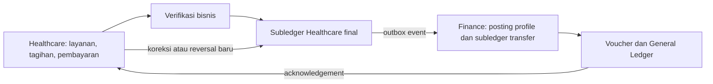

# Healthcare, verifikasi, dan Finance subledger

> **Status: usulan desain.** Dokumen ini mengunci batas tanggung jawab dan
> kontrak yang harus dipenuhi sebelum app Healthcare atau Finance/GL dibangun.
> Ia tidak menetapkan chart of accounts, tarif, atau aturan pajak suatu faskes.

## Keputusan

Healthcare adalah pemilik fakta operasional pasien dan bertindak sebagai
**subledger**. Finance/GL adalah pemilik konfigurasi akun, jurnal resmi,
voucher, buku besar, serta penutupan periode.

Proses verifikasi berada di Healthcare. Verifikasi memastikan fakta layanan,
tagihan, pembayaran, dan hak jasa sudah layak dijadikan fakta akuntansi; ia
tidak mengakses database Finance dan tidak membuat jurnal GL secara langsung.



Pemindahan dari subledger ke GL dapat diproses asynchronous atau dalam batch.
Keduanya tidak mengubah kepemilikan data: dokumen pasien tetap milik Healthcare,
sedangkan voucher dan saldo ledger tetap milik Finance.

## Fakta bisnis yang tidak boleh disamakan

Pembayaran pasien bukan selalu pengakuan pendapatan, dan hak jasa tenaga
kesehatan bukan selalu pembayaran jasa. Healthcare harus memodelkan fakta ini
secara terpisah:

| Fakta | Contoh dampak akuntansi yang mungkin |
| --- | --- |
| Layanan ditagihkan | piutang pasien/penjamin dan pendapatan layanan |
| Pembayaran diterima | kas/bank dan pelunasan piutang atau deposit |
| Deposit diterima atau dipakai | kas/bank, kewajiban deposit, atau pelunasan tagihan |
| Refund | pengembalian kas/bank dan pembalikan saldo terkait |
| Jasa tenaga kesehatan disetujui | beban jasa dan utang jasa, bila kebijakan akuntansi faskes menyatakannya sebagai kewajiban |
| Koreksi | adjustment atau reversal baru yang merujuk dokumen asal |

Contoh tersebut menjelaskan bentuk ekonomi, bukan menetapkan akun. Finance
menentukan akun dan dimensi yang benar melalui konfigurasi faskes.

## Peran verifikator

Verifikator adalah kontrol proses di dalam Healthcare. Ia meninjau kelengkapan
dan keabsahan komponen layanan sebelum dokumen menjadi final. Status minimum:

```text
draft -> siap diverifikasi -> perlu perbaikan | terverifikasi
terverifikasi -> dikirim ke Finance -> terposting | gagal diposting
```

Setelah Finance menerbitkan voucher, Healthcare tidak menghapus atau mengedit
fakta yang telah final. Perbaikan dibuat sebagai dokumen adjustment atau
reversal baru yang menyimpan referensi ke `posting_id` asal.

Workflow approval, bila diperlukan, memakai workflow platform; Healthcare
tetap menyimpan dokumen dan menerapkan hasil workflow. Workflow platform tidak
menjadi pemilik transaksi pasien atau jurnal.

## Kontrak Healthcare ke Finance

Healthcare menerbitkan event hanya setelah fakta subledger final tersimpan dan
outbox ditulis dalam transaksi database yang sama. Nama event mengikuti pola
berversi, misalnya:

- `healthcare.patient-service-invoiced.v1`
- `healthcare.patient-payment-received.v1`
- `healthcare.patient-deposit-applied.v1`
- `healthcare.practitioner-fee-approved.v1`
- `healthcare.revenue-recognition-reversed.v1`

Setiap event membawa `id`, `occurred_at`, `tenant_id`, `legal_entity_id`,
`org_unit_id` bila relevan, `correlation_id`, `posting_id` stabil, reference
dokumen sumber, tanggal efektif, currency, dan rincian ekonomi yang dibutuhkan
Finance. `posting_id` harus unik untuk satu fakta final dan dipakai Finance
sebagai idempotency key.

Finance menyimpan inbox untuk mencegah efek ganda saat event diulang. Setelah
posting berhasil atau gagal tervalidasi, Finance menerbitkan acknowledgement
yang menyertakan `posting_id`, status, voucher/reference Finance bila ada, dan
alasan kegagalan yang aman ditampilkan kepada pengguna.

Tidak ada foreign key, query, atau insert langsung lintas database. Jika kelak
integrasi membutuhkan mapping state atau orkestrasi yang benar-benar khusus,
ia menjadi bridge app dengan database sendiri; bridge bukan default untuk
Healthcare ke Finance.

## Variasi jurnal antar faskes

Variasi jurnal diakomodasi melalui **posting profile** milik Finance, bukan
fork kode Healthcare atau skrip jurnal per faskes.

Satu posting profile dibatasi oleh tenant dan legal entity; ia dapat mempunyai
aturan lebih khusus untuk operating unit tanpa menjadikan pilihan workspace
sebagai bukti otorisasi. Aturan harus berversi dan bertanggal efektif supaya
perubahan konfigurasi tidak mengubah jurnal historis.

| Bagian aturan | Contoh nilai yang dikonfigurasi |
| --- | --- |
| Pemilih profile | legal entity dan tanggal efektif |
| Kondisi | jenis fakta, kelompok layanan, pembayar/penjamin, metode bayar, unit, kategori tenaga kesehatan, atau pajak |
| Hasil | sisi debit/kredit, main account, financial dimension, pembulatan, dan narasi voucher |
| Pengendalian | prioritas, status aktif, approval Finance, dan riwayat perubahan |

Healthcare mengirim atribut bisnis yang stabil, seperti kelompok layanan,
pembayar, metode bayar, dan unit. Ia tidak mengirim `main_account`, kombinasi
akun, atau debit/kredit yang di-hardcode. Finance memilih satu aturan yang
tepat, membentuk entry subledger yang seimbang, kemudian memindahkannya ke GL.

Konfigurasi harus menolak dua keadaan berikut secara eksplisit:

1. lebih dari satu aturan posting cocok dengan prioritas sama;
2. tidak ada aturan posting yang cocok.

Keduanya menghasilkan kegagalan posting yang dapat ditindaklanjuti, bukan akun
default tersembunyi. Sebelum aturan baru aktif, Finance harus dapat menjalankan
simulasi posting terhadap contoh fakta Healthcare dan meninjau jurnal yang
akan dihasilkan.

## Batas kustomisasi

| Kebutuhan faskes | Tempatnya |
| --- | --- |
| akun, dimensi, pemetaan layanan/penjamin, tanggal berlaku, dan metode bayar | posting profile Finance |
| formula hak jasa, kelayakan penerima, dan bukti verifikasi | konfigurasi/proses Healthcare |
| alur persetujuan | workflow platform dengan callback ke Healthcare |
| proses yang tidak dapat dinyatakan oleh kontrak dan konfigurasi publik | addon atau bridge app berversi |

Addon tidak boleh mendapat credential database Finance atau Healthcare. Ia
hanya memakai API, event, dan extension point yang dipublikasikan.

## Prasyarat dan urutan implementasi

Posting nyata tidak boleh dimulai sebelum Finance/GL mempunyai chart of
accounts, ledger per legal entity, currency, fiscal period, financial
dimensions, posting profile, voucher, serta outbox/inbox. Healthcare dapat
lebih dahulu menyiapkan model dokumen dan kontrak event, tetapi tidak boleh
memalsukan state `terposting` hanya karena event telah dikirim.

Implementasi awal dibatasi pada satu alur—misalnya tagihan layanan rawat jalan
dan pembayaran tunai—dengan rekonsiliasi Healthcare ke voucher Finance. Klaim
penjamin, deposit, refund, pajak, dan jasa tenaga kesehatan ditambahkan setelah
alur awal tersebut terbukti end-to-end.

## Referensi

- [Ledger, subledger, and subledger journal accounting entries overview](https://learn.microsoft.com/en-us/dynamics365/finance/general-ledger/ledger-subledger) — sumber Dynamics 365 untuk subledger, posting profile, entry seimbang, voucher, dan transfer ke ledger.
- [Subledger transfer to the general ledger](https://learn.microsoft.com/en-us/dynamics365/finance/general-ledger/subledger-transfer) — sumber Dynamics 365 untuk transfer asynchronous dan scheduled batch.
- [Recommended practices for posting profiles](https://learn.microsoft.com/en-us/dynamics365/finance/general-ledger/recommended-practices-pstg-prfles) — sumber Dynamics 365 untuk pengelolaan posting profile dan rekonsiliasi subledger ke GL.
- [API, event, dan integrasi module](04-api-and-integration.md) — standar event, outbox/inbox, dan batas bridge CoreERP.
- [Standar app dan addon app](02-module-standard.md) — batas ownership database, kontrak, dan addon CoreERP.
- [Fondasi finansial](../todo/general/05-fondasi-finansial.md) — status kemampuan Finance/GL yang masih menjadi prasyarat.
