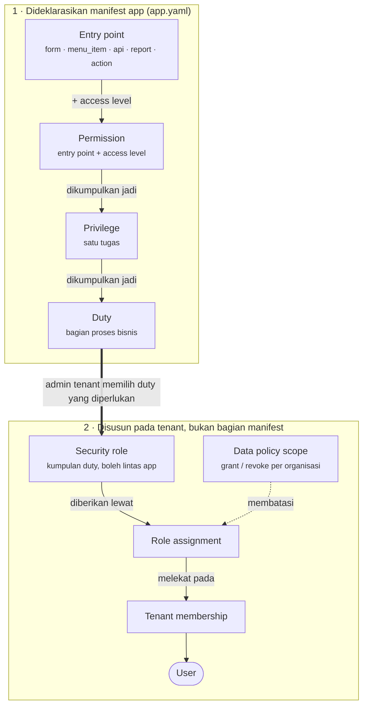

# Rantai keamanan modul transaksi

Saat membuat modul transaksi baru, keamanannya tidak boleh diputuskan belakangan. Ada **empat lapis yang wajib dideklarasikan manifest app**, lalu **satu lapis lagi yang disusun di tenant** sebelum hak itu sampai ke seorang user.

Dokumen ini menyatukan aturannya menjadi satu rantai yang bisa dibaca sekali jalan. Sumber normatifnya tetap [Standar module](02-module-standard.md) untuk bentuk manifest dan [Identity dan access](09-identity-and-access.md) untuk model aksesnya.

## Rantainya

Versi drawio yang dapat diedit: [`docs/diagrams/drawio/coreerp-rantai-keamanan.drawio`](../diagrams/drawio/coreerp-rantai-keamanan.drawio).

## Empat lapis yang wajib ada di manifest

Mengikuti [role-based security Dynamics 365](https://learn.microsoft.com/en-us/dynamics365/fin-ops-core/dev-itpro/sysadmin/role-based-security).

| Lapis | Arti | Pola kode |
| --- | --- | --- |
| Entry point | Yang dilindungi: form, menu item, API/service operation, report, atau action | `<app>.<resource>.<form\|api>` |
| Permission | Pasangan entry point + access level | `<app>.<resource>.<aksi>` |
| Privilege | Satu tugas; kumpulan permission | `<app>.<resource>.<tugas>` |
| Duty | Bagian proses bisnis; kumpulan privilege | `<app>.<resource>.<proses>` |

`type` entry point: `form`, `menu_item`, `api`, `report`, `action`.

`access` permission memakai access level Dynamics 365: `read`, `update`, `create`, `correct`, `delete`, `invoke`. Aksi lifecycle penghapusan CoreERP — `archive`, `void`, `retire` — memakai `delete`. Service operation tanpa CRUD memakai `invoke`.

## Contoh utuh: satu transaksi register aset

Bentuk yang harus dapat ditelusuri dari layar admin sampai API. Kode finalnya milik manifest app, bukan dibuat dari UI tenant.

| Lapis | Isi | Dibuat oleh |
| --- | --- | --- |
| Entry point | Layar register aset; API tambah/ubah register aset; tindakan arsipkan register aset | Pemilik app, lewat manifest |
| Permission | `Lihat register aset` (`read`); `Tambah register aset` (`create`); `Ubah register aset` (`update`); `Arsipkan register aset` (`delete`) | Pemilik app |
| Privilege | `Pelihara register aset` = lihat + tambah + ubah; `Arsipkan register aset` = arsipkan | Pemilik app |
| Duty | `Kelola register aset` = privilege pelihara + privilege arsipkan | Pemilik app; tampil sebagai pilihan di UI role |
| Security role | `Petugas Aset` memilih duty `Kelola register aset` bila memang dibutuhkan | Admin tenant |
| Assignment | Seorang pekerja menerima role tersebut | Admin tenant |
| Batas data | Badan hukum dan unit kerja penanggung jawab aset | Admin tenant, hanya bila policy-nya mengharuskan |

Perhatikan pemisahan `Pelihara` dan `Arsipkan` menjadi dua privilege. Itulah yang membuat tenant dapat memberi hak mengubah tanpa memberi hak mengarsipkan. Kalau keduanya digabung, pilihan itu hilang.

`delete` dipakai untuk tindakan lifecycle seperti arsipkan atau retire — bukan berarti harus ada hard delete.

## Lapis kelima dibuat di tenant

Manifest mendeklarasikan entry point, permission, privilege, dan duty bawaan. Tenant dapat menambah privilege/duty khusus lewat **Konfigurasi keamanan**, tetapi tidak dapat membuat entry point atau permission baru. Tiga hal berikut **bukan** bagian manifest app dan tidak dibatasi ke satu app:

- **Security role** — administrator tenant menyusunnya dari duty yang diperlukan, termasuk duty milik app lain.
- **Role assignment** — pemberian role kepada satu membership.
- **Organization scope** — data policy scope pada role assignment itu.

Role tidak mempunyai `module_id` dan tidak dimiliki department. Satu role assignment boleh memiliki beberapa scope `grant`/`revoke`; kolom pembatas yang bernilai `null` berarti tidak dibatasi.

## Aturan yang tidak boleh dilanggar

::: danger Empat lapis tidak boleh diringkas
Keempatnya disimpan sebagai **empat baris berbeda**. Kode privilege tidak boleh sama dengan kode permission-nya.

Kalau disamakan, rantai `duty → privilege → permission` runtuh menjadi satu lapis bersalin tiga, dan tenant kehilangan kemampuan memberi satu tugas tanpa memberi seluruh duty. **Core menolak manifest semacam itu.**
:::

**`access_level` selalu dideklarasikan manifest.** Tidak pernah ditebak dari potongan kode.

**Permission menyatakan kemampuan bisnis, bukan visibilitas menu.** UI boleh menyembunyikan action yang tidak dimiliki user, tetapi API tetap memvalidasi authorization. Menyembunyikan tombol bukan pengamanan.

**App tidak mengetahui hierarchy role.** Core memperluas rantainya lebih dulu, lalu menerbitkan permission efektif pada token konteks bertanda tangan, sehingga hak warisan tiba di app persis seperti hak langsung.

**Hierarchy role menyusun tanggung jawab, bukan organisasi.** Ia graph berarah tanpa siklus — bukan tree. Jangan meresolusi hierarchy role memakai organization hierarchy, atau sebaliknya.

## Yang divalidasi Control Plane saat registrasi

Saat manifest didaftarkan, Core memeriksa bahwa:

- setiap kode memakai awalan ID app;
- permission menunjuk entry point yang dideklarasikan;
- privilege hanya memakai permission app tersebut;
- duty hanya memakai privilege app tersebut.

Manifest adalah sumber kebenaran: metadata yang tidak lagi dideklarasikan akan dihapus. Pengecualiannya **duty yang masih dipakai security role tenant** — registrasi ditolak dengan menyebut duty tersebut, supaya hak yang sedang berjalan tidak hilang diam-diam.

Karena itu, menghapus duty yang sudah dipakai memerlukan migration kecil untuk melepas relasi role-duty lebih dulu, baru manifest didaftarkan ulang.

## Yang sudah disediakan Core

Rantai ini **bukan rencana** — Core sudah menegakkannya dan menampilkannya. Saat kamu merancang duty dan privilege, rancanglah dengan sadar bahwa hasilnya akan tampil di layar berikut:

| Kemampuan | Di mana | Artinya bagi perancang modul |
| --- | --- | --- |
| Rincian akses per duty | Dialog security role — tiap duty dapat dibuka sampai privilege dan permission efektifnya, lengkap dengan access level dan entry point | Nama duty yang kabur akan terlihat kabur oleh admin tenant |
| Audit "kenapa orang ini bisa?" | Layar akses anggota — telusuran read-only `role → duty → privilege → permission → entry point`, diikuti batas datanya | Rantai yang diringkas membuat layar ini tidak informatif |
| Ringkasan tindakan efektif | Daftar security role — diringkas per entry point, misalnya `Register aset: lihat, tambah, ubah` | Duty yang terlalu lebar langsung terlihat sebelum diberikan ke orang |
| Validasi manifest | Ditolak saat registrasi katalog | Manifest yang meringkas lapis tidak akan pernah masuk |

Konsekuensi praktisnya dua:

**Privilege bukan salinan permission.** Kalau satu privilege hanya membungkus satu permission, layar audit menampilkan tiga baris yang isinya sama, dan tenant kehilangan kemampuan memberi satu tugas tanpa memberi seluruh duty.

**Duty adalah bagian proses bisnis, bukan tabel.** `Kelola register aset` adalah duty yang baik karena orang mengerjakannya sebagai satu tanggung jawab. Satu duty raksasa `Kelola semua aset` membuat ringkasan tindakan efektif menjadi tidak berguna.

## Segregation of Duties: yang sudah ada dan yang belum

**Sudah ada.** Rule konflik disimpan per tenant — pasangan duty, tingkat risiko, alasan, opsi mitigasi, masa berlaku. Saat admin memberi role secara manual, Core menghitung seluruh duty efektif lintas role **termasuk role turunan**, lalu menolak assignment yang memegang kedua duty konflik.

**Belum ada.** Tiga hal, dan tidak boleh dianggap tersedia:

- **Mitigasi belum berjalan.** Kolomnya ada di tabel konflik, tetapi tidak ada jalur kode yang mengisinya. Konflik ditolak tanpa jalan pintas.
- **Konflik tidak dicatat.** Tabel `sod_conflicts` tidak pernah ditulis di luar migration, sehingga belum ada jejak audit konflik maupun layar untuk melihatnya.
- **Penegakan baru pada satu jalur.** Pemeriksaan berjalan saat admin mengubah assignment anggota. Jalur penukaran kode undangan memberikan seluruh role pada undangan **tanpa** pemeriksaan yang sama.

::: warning Kalau modulmu memerlukan SoD
Rancang pasangan duty konfliknya, tetapi jangan bergantung pada penegakan otomatis di seluruh jalur. Status dan sisa pekerjaannya ada di [backlog entry point dan SoD](../todo/entrypointPERMISSIONprevilage/README.md).
:::

## Checklist untuk satu modul transaksi

Untuk **setiap** transaksi baru, tetapkan dan deklarasikan:

- [ ] Entry point-nya apa saja — form, menu item, endpoint API, report, action
- [ ] Permission per entry point, dengan access level eksplisit
- [ ] Privilege: tugas apa yang dikerjakan orang, bukan cerminan tabel
- [ ] Duty: bagian proses bisnis yang menampung privilege itu
- [ ] Role tenant seperti apa yang masuk akal disusun dari duty tersebut — didokumentasikan, walaupun role-nya dibuat admin tenant
- [ ] Perlukah data policy scope? Deklarasikan **hanya bila** resource-nya memang perlu dibatasi organisasi
- [ ] Perlukah SoD? Hanya bila pengaju tidak boleh sekaligus memverifikasi atau menyetujui
- [ ] Perlukah workflow? Hanya untuk approval, exception, keputusan berisiko/irreversible, atau handoff terkontrol
- [ ] Perlukah nomor? Hanya untuk master atau dokumen bisnis yang butuh identitas terbaca manusia

Empat item pertama wajib. Sisanya diputuskan sadar — termasuk keputusan "tidak perlu", yang juga dicatat.

## Lihat juga

- [Standar module](02-module-standard.md) — bentuk manifest dan aturan kode empat lapis
- [Identity dan access](09-identity-and-access.md) — model akses lengkap, hierarchy role, SoD, workforce
- [Menerbitkan release app](13-publishing-an-app-release.md) — payload registrasi dan aturan prune
- [Gate penemuan dan keputusan](18-module-discovery-and-decision-gate.md) — keputusan sebelum transaksi dibuat
- [Query scope dan schema](08-query-scopes-and-schema.md) — scope organisasi pada level data
- [Membangun app baru](../apps/membangun-app-baru.md) — posisi rantai ini dalam jalur membangun app
