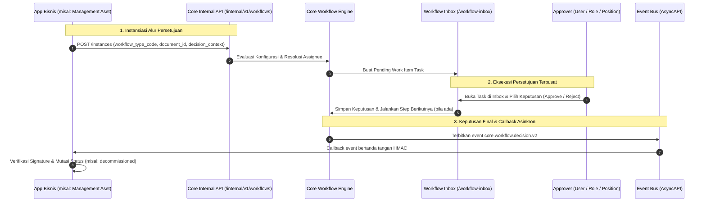
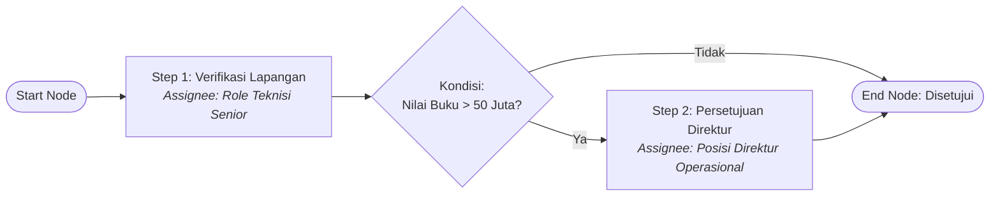

# Visual Workflow Engine

CoreERP menyediakan layanan alur persetujuan terpusat (**Visual Workflow Engine**) yang berjalan di Control Plane. Aplikasi bisnis tidak membangun mesin persetujuan (*approval engine*) atau antrian task sendiri; mereka mendeklarasikan tipe workflow pada manifest, menyerahkan instansiasi dokumen ke Core, dan mendengarkan event keputusan yang diterbitkan Core.



---

## Prinsip Utama

1. **App Bisnis tidak menyimpan approver.** App bisnis hanya mengetahui bahwa dokumen membutuhkan persetujuan dan mengirim konteks data keputusan (*decision context*). Siapa yang menyetujui, berapa tahapan (*step*), dan batas nominal persetujuan adalah konfigurasi admin tenant di Core.
2. **Asinkron dan Idempoten.** Keputusan persetujuan dapat terjadi beberapa menit hingga berhari-hari kemudian. App bisnis menyimpan `workflow_instance_id` sejak awal dan mendengarkan event bertanda tangan `core.workflow.decision.v2`.
3. **Pemisahan Tugas (*Segregation of Duties / SoD*).** Pembuat dokumen (*initiator*) secara struktural dicegah menyetujui dokumennya sendiri pada step yang sama.

---

## 1. Deklarasi di Manifest App (`app.yaml`)

Setiap aplikasi yang memiliki proses persetujuan wajib mendeklarasikan `workflow_types` pada `app.yaml`:

```yaml
workflow_types:
  - code: management-aset.dekomisioning-aset-verification
    name: Verifikasi usulan dekomisioning aset
    decision_context_schema:
      type: object
      required: [document_id, asset_id, nilai_buku]
      properties:
        document_id:
          type: string
        asset_id:
          type: string
        nilai_buku:
          type: number
```

### Kolom Deklarasi:
* `code`: Kode unik global berformat `<app-id>.<workflow-identifier>`.
* `name`: Nama alur yang dipahami oleh administrator bisnis.
* `decision_context_schema`: Skema JSON yang memvalidasi data kontekstual yang dikirim aplikasi saat memicu workflow. Kolom di dalam skema ini dapat dipakai sebagai variabel kondisi pada editor visual Core.

---

## 2. Konfigurasi Visual di Control Plane

Admin tenant mengonfigurasi alur kerja pada menu **Settings $\rightarrow$ Workflows** (`/settings/workflows`) dan editor graf visual (`/settings/workflows/{id}/editor`).



### Tipe Assignee yang Didukung:
1. **Specific User**: Mengarahkan task ke satu anggota tenant tertentu (`user_id`).
2. **Security Role**: Mengarahkan task ke seluruh anggota yang memegang role tertentu (misal: `Asset Manager`). Siapa pun pemegang role dapat mengklaim dan memutuskan.
3. **Position (via HR)**: Mengarahkan task ke posisi spesifik (misal: `Kepala Cabang`) yang datanya diterbitkan oleh modul Human Resources.
4. **Hierarki Organisasi**: Menelusuri rantai pelaporan unit kerja ke atas (*managerial hierarchy*).

---

## 3. Integrasi Pemanggilan dari App Bisnis

::: warning Sudah berubah untuk modul di dalam runtime
Contoh di bawah menggambarkan app yang berjalan sebagai proses tersendiri. Modul yang dimuat
runtime yang sama mengajukan lewat kontrak `App\Support\Modules\Contracts\MesinWorkflow` dan
menerima keputusannya sebagai event `KeputusanWorkflowDiambil`, bukan lewat HTTP; lihat
[kontrak module ke Core](04-api-and-integration.md#kontrak-module-ke-core). Jalur HTTP di bawah tetap
berlaku untuk app di luar proses.
:::

App bisnis di luar proses memicu alur persetujuan melalui service client internal `WorkflowClient`:

```php
namespace App\Services;

class WorkflowClient
{
    public function start(string $workflowTypeCode, string $documentId, array $context): string
    {
        $response = Http::withHeaders([
            'Authorization' => 'Bearer ' . $this->contextToken,
            'Idempotency-Key' => (string) Str::uuid(),
        ])->post($this->coreUrl . '/internal/v1/workflows/instances', [
            'workflow_type_code' => $workflowTypeCode,
            'document_id' => $documentId,
            'decision_context' => $context,
        ]);

        if ($response->failed()) {
            throw new WorkflowException('Gagal memicu alur persetujuan di Core.');
        }

        return $response->json('data.instance_id');
    }
}
```

---

## 4. Format Callback Event `core.workflow.decision.v2`

Setelah seluruh tahapan persetujuan selesai atau ditolak, Core menerbitkan event berikut melalui bus asinkron:

```json
{
  "specversion": "1.0",
  "id": "01JMB8W9EVT001",
  "source": "core.workflow",
  "type": "core.workflow.decision.v2",
  "time": "2026-08-19T10:30:00Z",
  "tenant_id": "01JMB8W3Z9E4T0K1M9P5A2Q3R1",
  "datacontenttype": "application/json",
  "data": {
    "instance_id": "01JMB8W9INST123",
    "workflow_type_code": "management-aset.dekomisioning-aset-verification",
    "document_id": "01JMB8W9DOC456",
    "decision": "approved",
    "decided_by_user_id": "01JMB8W9USR789",
    "decided_at": "2026-08-19T10:30:00Z",
    "notes": "Disetujui untuk pemusnahan unit rusak total.",
    "decision_context": {
      "asset_id": "01JMB8W2X5N8V1B7K3P9M0Q2W4",
      "nilai_buku": 0
    }
  }
}
```

### Nilai Keputusan (`decision`):
* `approved`: Seluruh step persetujuan berhasil disetujui. App bisnis melanjutkan mutasi status ke tahap berikutnya (misal: aset menjadi `decommissioned`).
* `rejected`: Salah satu step menolak usulan. Dokumen kembali ke draf atau dibatalkan.
* `cancelled`: Workflow dibatalkan oleh permohonan pembuat dokumen.

---

## 5. Inbox Persetujuan Terpusat (`/workflow-inbox`)

Pengguna tidak perlu memeriksa aplikasi bisnis satu per satu untuk mengetahui persetujuan yang tertahan. Control Plane menyediakan **Workflow Inbox** terpusat di `/workflow-inbox`:
* Menampilkan seluruh work item yang ditugaskan ke user atau role miliknya lintas seluruh aplikasi bisnis.
* Menyediakan pratinjau ringkasan dokumen dan tombol aksi instan: **Setujui (*Approve*)**, **Tolak (*Reject*)**, dan **Delegasikan (*Delegate*)**.

---

## Parameter workflow per tenant

Sebagian perilaku workflow dapat disetel per tenant. Tiga aturan menjaga agar setelan itu tidak
menjadi lubang diam-diam.

**Bawaannya mengikuti Dynamics 365: pengaju boleh menyetujui, kecuali tenant melarang.** Yang
menentukan bukan bawaannya, melainkan **kapan larangan itu ditegakkan** — di waktu **penugasan**,
bukan di waktu keputusan. Kalau ia ditegakkan di waktu keputusan, sebuah tugas yang jatuh ke
pengajunya sendiri tanpa jalur delegasi menjadi jalan buntu: tidak bisa disetujui, dan tidak ada
orang lain yang bisa mengambilnya. Persetujuan oleh pengaju sendiri, ketika memang diizinkan, selalu
tercatat pada riwayat workflow — izin bukan alasan untuk diam.

**Perubahan setelan diaudit, dan pelakunya wajib.** Setiap perubahan tercatat ke jejak audit akses
dengan aksi tersendiri, dan pelaku adalah **parameter wajib** pada perintah penyimpanannya — bukan
kunci opsional yang lupa diisi lalu menghasilkan jejak tanpa siapa pun di dalamnya. Sakelar yang
disimpan tetapi **tidak berubah nilainya** tidak dicatat; jejak yang penuh baris tanpa perubahan
menyembunyikan baris yang benar-benar mengubah sesuatu.

**Tipe nilai ditegakkan saat dibaca, bukan hanya saat ditulis.** Nilai setelan disimpan sebagai
`jsonb`, dan `jsonb` menerima apa saja. Registry-lah yang menegakkan tipe yang dijanjikan setiap kali
nilai dibaca, dan pesan penolakannya menyebut nama parameter beserta tipe yang dijanjikan — tanpa
itu, penolakan hanya memberi tahu bahwa ada sesuatu yang salah, bukan apa.

Bentuk penyimpanan ini juga yang membuat parameter baru **tidak menuntut migration**: satu entri
registry dan satu titik penegakan sudah cukup. Alasannya ada di
[release dan on-prem](03-release-and-on-prem.md) — setiap migration harus berhasil di server setiap
pelanggan yang menjalankan pembaruannya sendiri, dan itu ongkos yang tidak sebanding untuk sebuah
sakelar.

## Di mana kodenya

| Berkas | Isinya |
| --- | --- |
| `apps/control-plane/app/Http/Controllers/Workflow/WorkflowConfigurationController.php` | Manajemen konfigurasi dan editor graf workflow |
| `apps/control-plane/app/Http/Controllers/Workflow/InternalWorkflowInstanceController.php` | Endpoint internal `/internal/v1/workflows/instances` |
| `apps/control-plane/app/Http/Controllers/Workflow/WorkflowInboxController.php` | Pengelolaan work items dan inbox persetujuan |
| `apps/control-plane/resources/js/pages/settings/workflows.tsx` | Layar daftar konfigurasi workflow per tipe |
| `apps/control-plane/resources/js/pages/settings/workflow-editor.tsx` | Editor kanvas visual untuk menyusun step dan rule kondisi |
| `apps/control-plane/resources/js/pages/workflow-inbox.tsx` | Layar antrian inbox persetujuan terpusat |
| `apps/control-plane/contracts/asyncapi.yaml` | Kontrak event `core.workflow.decision.v2` |

---

## Halaman terkait

- [Standar module](02-module-standard.md) — deklarasi `workflow_types` pada manifest
- [API dan integrasi](04-api-and-integration.md) — signature envelope event bertanda tangan
- [Identity dan access](09-identity-and-access.md) — role dan hak akses pengguna
- [Dokumen siklus aset](/apps/management-aset/transaction/siklus-aset/) — contoh pemakai workflow
