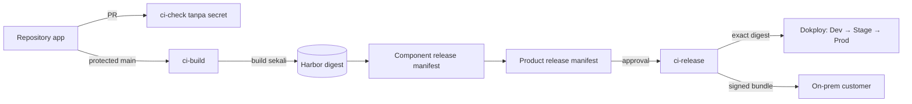

# CI/CD polyrepo

Dokumen ini menetapkan cara source, test, image, release, promotion, dan bundle
customer bergerak di CoreERP. Tujuannya bukan membuat semua repository berjalan
bersama, tetapi memberi setiap repository jalur release yang sama tanpa Git
submodule atau build pada server production.

## Yang benar-benar ada hari ini

> Bagian ini menggambarkan alur yang berjalan di repo ini pada 9 September 2026. Sisa dokumen —
> mulai dari [Keputusan](#keputusan) ke bawah — menggambarkan **target** Forgejo, Harbor, dan
> Dokploy beserta dunia polyrepo yang sedang ditinggalkan. Keduanya sengaja dibiarkan
> berdampingan: yang di bawah masih menjadi arah, yang di sini yang menjaga pull request hari
> ini. Yang berbahaya bukan rencana yang belum terwujud, melainkan dokumen yang tidak
> membedakan keduanya.

Empat alur, seluruhnya di GitHub Actions:

| Alur | Kapan | Yang dijaganya |
| --- | --- | --- |
| `tests.yml` | tiap pull request, push ke `main`, dan jadwal mingguan | Satu perintah menjalankan test Core **dan** seluruh module — `php artisan test --parallel`, dengan suite `Module` yang menyapu `modules/*/*/tests`. Tidak ada alur kedua untuk module. Ditambah pemeriksa bundel: React hanya boleh termuat sekali. |
| `lint.yml` | tiap pull request | Gaya PHP (`pint`, termasuk `modules/`), gaya dan tipe frontend, format berkas. |
| `edition.yml` | tiap pull request dan push ke `main` | Membangun dua image edisi dan membuktikan modul yang tidak dibeli tidak ada di dalamnya, lalu membuat pemeriksanya merah dengan sengaja untuk membuktikan ia masih memeriksa. |
| `release.yml` | push ke `main` | Membangun image tiap edisi, memeriksanya, lalu mendorongnya ke registry bertanda SHA commit. |

**Penandaan penempatan memakai digest atau SHA, tidak pernah awalan yang bergerak.** Dua server
pelanggan yang menarik `latest` pada hari berbeda mendapat isi yang berbeda, dan ketika salah
satunya bermasalah tidak ada cara mengetahui versi mana yang sedang berjalan di sana. Larangan
itu dijaga satu langkah di dalam `release.yml` yang membaca alur itu sendiri.

**Yang belum ada, dan disebut di sini supaya tidak dikira ada.** Bundle on-prem beserta skrip
pemasangannya (F5-06) belum dibangun: kriteria selesainya menuntut pemasangan di mesin virtual
bersih. Registry yang dipakai `release.yml` masih GitHub Container Registry, bukan Harbor.
Langkah `docker push` sendiri baru berjalan pada penggabungan pertama ke `main` — sampai itu
terjadi, yang terbukti hanya bagian bangun dan periksanya, yang memang dijalankan tiap pull
request lewat `edition.yml`.

**Pemeriksa susunan repo app yang lama** (`app-erp-ci-workflows`, action
`validate-app-repository`) tidak dipanggil satu pun alur di repo ini. Aturannya yang masih
berlaku — manifest sah, rantai keamanan lengkap, awalan tabel terdaftar — dipasang ulang sebagai
penjaga batas di `apps/core/tests/Feature/Boundary/`, tempat ia benar-benar dijalankan
tiap pull request. Syarat lamanya tentang Dockerfile per app, potongan compose, dan skrip
migrasi per app sudah tidak berlaku sama sekali.

## Aturan yang ditegakkan pemeriksa hari ini

Keempat alur di atas menjalankan aturan; bagian ini menjelaskan aturannya beserta alasannya,
supaya sebuah langkah yang tampak sewenang-wenang tidak dibuang orang berikutnya.

### Pemeriksa yang menjangkau `modules/` didaftar, bukan ditunggu

Pertanyaan yang harus diajukan sebelum sebuah module baru mendarat adalah **"apa saja di Core
yang memindai `modules/`"** — bukan "apa yang rusak". Keduanya berakhir pada daftar yang sama,
tetapi yang kedua menyusunnya satu per satu lewat putaran CI merah, dan tiap putaran memakan
waktu tunggu yang sebenarnya tidak perlu dibayar. Daftarnya bisa dibaca; ia tidak perlu ditunggu.

Daftar itu sengaja tidak ditulis di sini, karena ia akan basi pada pemeriksa berikutnya yang
ditambahkan. Yang ditulis adalah cara membacanya:

1. Telusuri tiap langkah di `.github/workflows/lint.yml` dan `.github/workflows/tests.yml`
   berurutan. Nama langkah menyebut alatnya, perintahnya menyebut skrip yang dipanggil.
2. Buka perintah itu di `apps/core/composer.json` atau `apps/core/package.json`.
   Sebuah pemeriksa menjangkau module bila jalur `../../modules` muncul pada perintahnya sendiri
   atau pada berkas setelannya — `paths` dan `scanDirectories` di `apps/core/phpstan.neon`,
   `include` di `apps/core/tsconfig.json`.
3. Jalankan seluruhnya di mesin sendiri pada pohon hasil penggabungan sebelum mendorong.
   `composer ci:check` di `apps/core` menjalankan gaya PHP, gaya dan format frontend,
   analisa tipe, dan test dalam satu perintah. Yang tidak ikut di dalamnya — salinan skill,
   cakupan kontrak internal, dan pemeriksa bundel — dijalankan seperti yang tertulis di kedua
   berkas alur itu.

Satu pemeriksaan lokal atas seluruh alur lebih murah daripada tiga putaran CI, dan ia menemukan
hal yang sama.

**Semua langkah alur wajib.** Tidak ada satu pun `continue-on-error` di alur mana pun, dan
tidak boleh ditambahkan. Langkah yang boleh merah tanpa menggagalkan alur tidak menjaga apa pun,
sementara keberadaannya tetap terbaca seolah ada yang dijaga.

**Jangkauan ESLint dijaga, karena ia pernah hilang tanpa berbunyi.** `eslint.config.js` hidup di
**akar repo**, dan perintah lint menargetkan akar repo. Keduanya bukan selera: ESLint 9 menetapkan
base path dari letak berkas konfigurasinya, dan sampai 10 September 2026 berkas itu ada di
`apps/core/` — sehingga `eslint .` memeriksa **nol** berkas di bawah `modules/` dan
`packages/`, lalu keluar dengan kode 0.

Bukan menolak, bukan memperingatkan; hanya diam. Puluhan berkas UI module karena itu tidak pernah
diperiksa aturan hook React maupun urutan impor sejak module pertama mendarat, sementara alur ini
melaporkan linter hijau di setiap pull request. Begitu jangkauannya dibuka, ratusan temuan mekanis
muncul sekaligus.

Yang menjaganya sekarang `scripts/periksa-jangkauan-eslint.mjs`, dipanggil dari `lint:check`
sesudah ESLint sendiri: ia menolak bila tidak satu pun berkas yang diperiksa berada di bawah
`modules/` atau `packages/`. Ia juga menolak bila kedua folder itu kosong — daftar tanpa subjek
membuat pemeriksanya hijau tanpa membuktikan apa pun.

Pelajarannya lebih umum daripada ESLint, dan ia berlaku untuk setiap pemeriksa yang menyaring
berkas: **sebuah pemeriksa yang tidak menemukan subjek tidak dapat dibedakan dari pemeriksa yang
tidak menemukan pelanggaran.** Lihat [standar penjaga dan pengujian](25-standar-penjaga-dan-pengujian.md).

### Baseline analisa tipe hanya boleh menyusut

`apps/core/phpstan-baseline.neon` membekukan temuan yang sudah ada sejak sebelum
analisanya dijalankan sungguhan. Tanpa pembekuan itu langkah `Run Type Analysis` tidak pernah
hijau, dan langkah yang tidak pernah hijau tidak memeriksa apa pun karena tidak ada lagi yang
membaca hasilnya. Yang dibeli pembekuan itu satu hal: kode baru diperiksa penuh pada level yang
tertulis di `apps/core/phpstan.neon` sejak hari pertama.

Karena itu berkas tersebut **hanya boleh menyusut**. Menambah baris ke dalamnya berarti
menyembunyikan temuan baru di balik izin yang diberikan untuk kode lama, dan itu ditolak saat
peninjauan. Cara menyusutkannya: perbaiki temuannya, lalu jalankan `composer types:check` —
baris yang sudah tidak terpakai akan dilaporkan.

Tidak ada mesin yang menahan pertumbuhannya. Pull request yang menambah baris ke berkas itu
tetap hijau, jadi yang menahannya adalah peninjau yang membaca diff.

Sejak 10 September 2026 aturan itu punya mesin: `scripts/periksa-baseline-phpstan.mjs`, dijalankan
langkah **Periksa baseline analisa tipe tidak bertambah** pada `lint.yml`.

Yang dibandingkan **per entri**, bukan totalnya. Rancangan pertamanya membandingkan total dan
terbukti tidak menjaga apa pun: pada cabang yang membuang tujuh belas bungkaman, menambahkan tiga
bungkaman baru masih terbaca "menyusut" dan lolos. Aturan yang berlaku sekarang lebih sempit dan
lebih jujur — **tidak boleh ada bungkaman baru**, termasuk menaikkan `count:` pada entri yang sudah
ada. Membuang entri tetap bebas.

Kedua bentuk kegagalan itu dibuktikan merah sebelum langkahnya dipasang.

### Dua folder skill wajib identik

`.agents/skills` dan `.claude/skills` dibaca alat yang berbeda dan berisi salinan yang sama.
Keduanya sudah pernah menyimpang diam-diam, dan penyimpangannya dua arah: masing-masing folder
membawa aturan yang tidak dimiliki salinannya, sehingga menimpa satu folder dengan yang lain
akan membuang aturan yang sah. Tidak ada test yang gagal karena sebuah aturan hilang di salinan
yang kebetulan tidak sedang dibaca.

`.github/scripts/check-skill-copies.py` membandingkan setiap skill yang ada di kedua folder dan
gagal bila isinya berbeda; ia berjalan pada langkah `Check skill copies are in sync` di
`.github/workflows/lint.yml`. Skill yang hanya ada di satu folder dibiarkan — yang berjanji sama
hanyalah nama yang ada di keduanya. Sebuah penyimpangan yang sengaja dibuat harus membuat alur
merah; bila tidak, yang rusak adalah pemeriksanya.

### Cabang utama dikunci, dan sampai mana penguncian itu berlaku

Perubahan masuk lewat pull request, dan sebuah pull request tidak digabungkan sebelum alurnya
hijau. Aturan inilah yang membuat kalimat "selesai bila test lulus" punya arti di seluruh
dokumen ini. Sebelumnya alur yang merah diabaikan berbulan-bulan, dan itu wajar: ketika setiap
pull request merah, warna merah tidak membedakan apa pun.

Jumlah persetujuan yang diwajibkan disetel **nol**, bukan satu. Timnya satu engineer dengan tiga
magang, dan penulis tidak boleh menyetujui pull request-nya sendiri — mewajibkan satu persetujuan
berarti pull request pemimpin tim tidak pernah bisa digabungkan. Yang ditegakkan mesin adalah
pemeriksaan otomatis; peninjauan manusia untuk pull request magang tetap dilakukan, tetapi
ditegakkan orang.

Konsekuensinya harus dinyatakan terang-terangan supaya tidak ada yang salah mengira:
**perlindungan cabang tidak tersedia pada paket GitHub yang dipakai repo ini, sehingga setiap
pemeriksaan pada dokumen ini bisa dilewati dengan satu klik gabungkan.** Menaikkan paket dan
memasang penambal sama-sama sudah ditimbang dan ditolak. Yang berbeda dari keadaan sebelumnya
hanya satu hal, tapi bukan hal kecil: alurnya sekarang benar-benar hijau, jadi merahnya berarti
sesuatu.

Ada celah kedua yang mengikuti dari bentuk pemicunya: `lint.yml` dan `tests.yml` hanya dipicu
`pull_request`, jadi push langsung ke `main` tanpa pull request tidak diperiksa sama sekali.
Pertimbangan kuota di balik pilihan itu ditulis di kepala kedua berkas alur.

### `import/order` dimatikan pada berkas ber-penanda `@chisel-*`

`laravel/chisel` menghapus kode di antara sepasang penanda `@chisel-*` ketika sebuah fitur
dimatikan. Penanda itu berada di tengah blok impor, dan `import/order` menata ulang impor
melewatinya: penandanya berpindah, isinya berubah, lalu penghapusan fitur membuang baris yang
salah tanpa ada yang berbunyi. Karena itu aturan `import/order` dimatikan pada berkas-berkas
tersebut di `apps/core/eslint.config.js`, dan urutan impornya dijaga tangan sampai
penandanya tidak lagi dipakai. Daftar berkasnya ada di berkas konfigurasi itu, bukan di sini.

Yang membuat penanda itu bergerak adalah `composer update`: ia memicu `install:features` lewat
`post-update-cmd` di `apps/core/composer.json` dan mengubah berkas di luar perubahan
yang sedang dikerjakan. Jangan menjalankan `composer update` di repo ini tanpa memeriksa berkas
apa saja yang ikut berubah.

### Pemangkasan per edisi dibuat skrip, dan CI yang membuktikannya

Klaim produknya berbunyi "modul yang tidak dibeli **tidak ada** di server pelanggan", bukan
"modulnya dimatikan". Klaim sekuat itu hanya sah bila mesin membuktikannya pada image yang
benar-benar dikirim; tanpa itu ia cuma janji.

Karena itu pemangkasannya dibuat skrip, bukan dikerjakan tangan per pelanggan.
`scripts/edisi-pangkas.php` membuang module yang tidak dibeli dari pohon bangunan di dalam
Dockerfile, `scripts/build-edition.sh` membangun satu image per edisi, dan
`scripts/verify-edition.sh` memeriksa tiga jalur kebocoran yang masing-masing bisa bocor
sendiri-sendiri: berkas dan nama namespace di dalam image, tabel yang terbentuk ketika migration
dijalankan ke database kosong, dan bundel JavaScript. Satu saja bocor, alurnya gagal.

Daftar edisi dibaca dari folder `editions/`, tidak ditulis di dalam alur. Sebuah edisi baru yang
tidak ikut terbangun adalah kegagalan yang tidak berbunyi — pelanggannya baru tahu saat
memutakhirkan. Langkah `Kumpulkan daftar edisi` di `.github/workflows/release.yml` yang
membacanya, dan ia gagal bila folder itu kosong.

Yang belum ada, dan disebut supaya tidak dikira ada: pemangkasan source per edisi hanya hidup di
dalam pembangunan image. Tidak ada keluaran ekspor source per edisi yang berdiri sendiri di luar
image, dan `scripts/edisi-pangkas.php` mengubah berkas di tempat — menjalankannya di repo
sungguhan akan memangkas repo itu sendiri.

## Keputusan

> Mulai dari sini sampai akhir halaman, "repository app" berarti repo `app-erp-*` yang masih
> berjalan sebagai container sendiri. Module di bawah `modules/` tidak punya pipeline sendiri:
> ia diuji, di-lint, dan diterbitkan bersama Core lewat empat alur di atas.

Target platform adalah **Forgejo LTS + Forgejo Actions runner terpisah + Harbor +
Dokploy**. Semua komponennya self-hosted. GitHub yang sudah dipakai saat ini boleh
menjadi bootstrap dan mirror sampai layanan Forgejo, backup, dan restore-nya
terbukti; ia bukan registry artifact dan tidak boleh menjadi dependency runtime
customer.

Pembagian tanggung jawabnya:

| Komponen | Tanggung jawab | Bukan tanggung jawab |
| --- | --- | --- |
| Forgejo | Git, pull request, review, branch protection, dan antrean workflow | Menyimpan image release atau menjalankan production |
| Runner `ci-check` | Manifest check, lint, type check, test, contract coverage | Menerima credential registry, signing key, atau Dokploy |
| Runner `ci-build` | Build image sekali dari commit `main`, scan, push candidate | Deploy production atau menandatangani bundle customer |
| Runner `ci-release` | Verifikasi digest, tanda tangan, promotion, dan bundle | Menjalankan source dari pull request biasa |
| Harbor | OCI image, signature, SBOM, scan result, dan retention | Menentukan kombinasi versi produk |
| Repository release | Product release manifest dan promotion history | Menyalin source repository app |
| Dokploy | Menjalankan Compose dari digest yang sudah disetujui | Memilih versi, build source, atau menjadi installation registry |
| Control Plane / state lokal on-prem | Fakta catalogued, entitled, installed, dan ready sesuai profile | Menyimpulkan readiness dari keberadaan image |

Forgejo dipilih karena biaya lisensinya nol, runner dapat ditambah horizontal,
dan source serta kebijakan tim tetap berada pada infrastruktur sendiri. GitLab CE
tidak dipilih karena beban operasi dan resource-nya tidak sebanding untuk tim
awal. GitHub Free dengan self-hosted runner adalah alternatif bootstrap yang sah,
tetapi bukan target permanen ketika governance banyak tim mulai membutuhkan fitur
yang berada di luar paket gratis.

Alur lengkapnya tersedia sebagai [diagram draw.io yang dapat diedit](../diagrams/drawio/coreerp-ci-cd-polyrepo.drawio).



## Lima sumber kebenaran

Jangan membuat satu file atau dashboard berpura-pura memiliki semua state.

| Fakta | Sumber kebenaran |
| --- | --- |
| Source yang ditinjau | Commit Git pada branch terlindungi |
| Bentuk dan kontrak app | `app.yaml`, OpenAPI, dan AsyncAPI di repository app |
| Artifact satu app | Component release manifest berisi image digest immutable |
| Kombinasi produk | Product release manifest bertanda tangan di repository release |
| Sudah terpasang dan siap | Installation/deployment registry serta health check runtime |

Product release manifest tidak memuat source checkout atau branch. Ia hanya
menunjuk component release yang sudah terbit:

```json
{
  "schema_version": 1,
  "release": "2026.08.0",
  "components": [
    {
      "app_id": "example-app",
      "version": "1.4.0",
      "api_image": "registry.example/apps/example-api@sha256:<64-hex>",
      "ui_image": "registry.example/apps/example-ui@sha256:<64-hex>"
    }
  ]
}
```

Nama customer, produk, dan app yang dijual berasal dari katalog dan manifest;
pipeline tidak memiliki daftar nama besar yang di-hardcode.

## Pipeline repository app

### Pull request: cepat dan tanpa secret

Setiap pull request menjalankan:

1. validasi struktur dan `app.yaml`;
2. install dependency dari lock file;
3. lint dan type check yang tersedia;
4. test API dan build UI;
5. `contracts/check-contract-coverage.py` dari repository app;
6. validasi Dockerfile tanpa push bila runner build tersedia;
7. pemeriksaan migration terhadap PostgreSQL untuk perubahan schema.

Job pull request tidak mendapat credential Harbor, signing key, token Control
Plane, API key Dokploy, atau secret production. Pull request dari fork tidak
dijalankan pada trusted runner sebelum disetujui maintainer.

### Main: build sekali

Merge ke `main` menghasilkan API dan UI image sekali. Image diberi candidate tag
berdasarkan commit untuk pencarian manusia, tetapi output pipeline yang dipakai
selanjutnya adalah digest:

```text
git commit
  -> build API + UI
  -> vulnerability scan
  -> push Harbor
  -> component-release.json berisi digest
```

Tag `latest` dilarang. Build untuk Dev, Staging, Production, dan on-prem tidak
diulang. Bila source commit berubah, itu artifact berbeda dan harus melewati gate
dari awal.

### Component release

Tag SemVer harus sama dengan `app.yaml`. Release job mengambil candidate digest
dari commit tersebut, memverifikasi scan dan kontrak, menandatangani kedua image,
kemudian menerbitkan component release manifest sebagai OCI artifact. Release job
menolak tag jika candidate dari commit itu tidak ditemukan; ia tidak membangun
ulang secara diam-diam.

### Product release dan promotion

Repository release membuat pull request yang hanya mengubah product release
manifest. Gate-nya:

```text
component manifests
  -> compatibility check
  -> integration test
  -> deploy Dev
  -> persetujuan Staging
  -> deploy digest yang sama ke Staging
  -> persetujuan Production
  -> deploy digest yang sama ke Production
  -> buat bundle on-prem bertanda tangan
```

Persetujuan adalah merge/release action pada ref terlindungi, bukan perubahan
manual tag image. Dokploy dipanggil melalui API key per environment dan hanya
menerima Compose yang sudah menunjuk digest.

Upgrade belum boleh dipromosikan sebagai install biasa. Selama compatibility
matrix, backup terverifikasi, drain, dependency order, dan rollback worker belum
ada, pipeline hanya boleh menghasilkan artifact dan deployment baru yang memang
didukung oleh gate lifecycle saat ini.

## Runner trust zones dan scale-out

Label runner menyatakan kemampuan penjadwalan, bukan boundary keamanan. Tiga kelas
runner harus berada pada VM/host terpisah dari production:

| Runner | Source yang boleh dijalankan | Secret | Cara scale |
| --- | --- | --- | --- |
| `ci-check` | Pull request | Tidak ada release secret | Tambah instance berlabel sama |
| `ci-build` | Commit `main` terlindungi | Robot account Harbor per project | Tambah worker build disposable |
| `ci-release` | Workflow library dan ref release terlindungi | Signing key, release storage, deploy key per environment | Sedikit instance; serial per product release |

Jangan mount Docker socket host yang menjalankan Forgejo, Harbor, atau layanan
lain ke job. Build runner berjalan pada VM disposable/dedicated. Compromise pada
job build harus berhenti di VM tersebut dan robot account satu project, bukan
membuka seluruh registry atau production.

Pertumbuhan dilakukan dengan menambah runner pada pool yang sama. Jangan membuat
pipeline baru per tim atau server CI khusus per app. Antrean boleh bertambah;
hasil release tidak boleh berubah karena runner yang mengambil job berbeda.

## Workflow library dan ownership

Saat GitHub masih menjadi bootstrap, workflow berulang hidup di satu repository
private workflow library milik organisasi yang sama. File aktifnya berada tepat
di `.github/workflows/`; akses Actions antarrepository private harus diaktifkan
pada repository library. Saat migrasi penuh ke Forgejo, gunakan workflow library
public-read sesuai batasan Forgejo. Caller di repository app hanya berisi trigger
dan referensi:

```yaml
jobs:
  checks:
    uses: <organisasi>/app-erp-ci-workflows/.github/workflows/app-checks.yml@<commit-sha>
```

Referensi wajib commit immutable. Branch seperti `main` dan tag yang dapat
dipindah bukan pin supply-chain. Upgrade workflow library dilakukan melalui pull
request mekanis ke repository app, lalu setiap app membuktikan versi baru lulus.
Direktori `deploy/` hanya menyimpan asset deployment; ia bukan lokasi workflow
GitHub aktif.

Repository app tetap memiliki checker contract dan test domainnya sendiri.
Workflow library mengatur urutan dan runtime; ia tidak menyimpan pengecualian
domain suatu app.

Ownership minimum:

- perubahan source biasa: satu approval dari owner app;
- perubahan workflow, Dockerfile, migration, contract terbit, atau release
  manifest: approval owner terkait;
- promotion Production dan signing policy: dua orang berbeda ketika jumlah tim
  sudah memungkinkan;
- akun manusia tidak mempunyai credential push Harbor atau signing key.

Tim memakai trunk-based development: `main` terlindungi, branch pendek, dan pull
request. Branch `develop`, `master`, atau branch environment permanen tidak
dipakai. Environment adalah digest yang dipromosikan, bukan branch.

## Secret dan supply chain

- Dependency memakai lock file dan mode install reproducible (`composer install`
  dan `npm ci`).
- Action eksternal dan CI toolbox dipin ke commit/image digest.
- Harbor memakai robot account per project dengan hak minimum dan masa berlaku.
- Signature image dan bundle menggunakan key berbeda dari license signing key.
- Private key hanya tersedia pada `ci-release`; public verification key ikut
  installer/on-prem bundle.
- Log tidak boleh mencetak token, `.env`, license, atau payload data bisnis.
- SBOM, provenance, vulnerability result, signature, dan component manifest
  melekat pada digest yang sama.
- Backup Forgejo, Harbor metadata/blob, release directory, konfigurasi Dokploy,
  dan signing key dilakukan off-host serta diuji restore berkala.

## Tahapan adopsi

### Tahap 1 — tim sekarang

1. Rapikan semua repository ke `main` dan branch protection.
2. Pasang check pipeline tanpa secret pada semua repository.
3. Jalankan satu `ci-check` dan satu `ci-build` pada host CI terpisah.
4. Pasang Harbor dan gunakan robot account per repository/app.
5. Build candidate dari `main`; production masih membutuhkan persetujuan manual.
6. Jadikan GitHub mirror sementara bila Forgejo belum lolos backup/restore test.

### Tahap 2 — release pertama

1. Aktifkan signing dan component release manifest.
2. Jadikan repository deployment sebagai repository product release, bukan tempat
   clone/build source.
3. Hubungkan promotion ke Dokploy API per environment.
4. Uji backup, failed migration, retry, dan restore di Staging.
5. Buat bundle on-prem hanya dari product release Production yang disetujui.

### Tahap 3 — banyak tim

1. Tambah runner berdasarkan panjang antrean dan waktu tunggu, bukan jumlah repo.
2. Terapkan CODEOWNERS per app/contract/workflow.
3. Tambah compatibility test consumer untuk perubahan contract.
4. Pisahkan signing ke service/HSM atau OpenBao bila jumlah operator dan release
   meningkat.
5. Tambah registry replication dan disaster-recovery site ketika RTO/RPO bisnis
   membutuhkannya.

Kubernetes, Argo CD, dan autoscaler runner bukan syarat tahap awal. Mereka baru
ditambahkan bila deployment Compose atau kapasitas VM terbukti menjadi bottleneck,
bukan karena jumlah repository bertambah.

## Kondisi repository saat keputusan dibuat

- CoreERP baru memiliki GitHub workflow untuk lint dan test Control Plane.
- Repository app yang diaudit belum mempunyai workflow CI.
- Hanya satu app pilot yang memiliki contract coverage checker berbasis route
  Laravel. Untuk repository app yang tersisa, checker itu tetap standar. Untuk module
  ia tidak dipasang lagi: permukaan yang dipanggil dari luar runtime sudah bukan HTTP,
  dan rute yang hanya dipanggil halamannya sendiri dijaga test module.
- Repository deployment masih mempunyai mode yang clone dan build source pada
  server deployment. Mode itu adalah gap transisi dan tidak boleh menjadi jalur
  Production setelah Harbor tersedia.
- Upgrade worker dan rollback terverifikasi belum tersedia, sehingga pipeline
  tidak boleh menyatakan upgrade otomatis sudah aman.

## Lihat juga

- [Release dan on-prem perpetual](03-release-and-on-prem.md)
- [Menerbitkan app dari repository terpisah](13-publishing-an-app-release.md)
- [Target pemisahan repository](06-worktree-target.md)
- [Gate fondasi Core](10-core-foundation-gates.md)
- [Load dan concurrency testing](20-load-and-concurrency-testing.md)

## Referensi implementasi resmi

- [Forgejo Actions reference](https://forgejo.org/docs/v15.0/user/actions/reference/)
- [Forgejo Actions security](https://forgejo.org/docs/latest/user/actions/security/)
- [Menjalankan Docker dengan Forgejo Actions](https://forgejo.org/docs/v15.0/admin/actions/docker-access/)
- [Harbor vulnerability scanning](https://goharbor.io/docs/main/administration/vulnerability-scanning/)
- [Harbor robot accounts](https://goharbor.io/docs/2.12.0/administration/robot-accounts/)
- [Cosign container signing](https://docs.sigstore.dev/cosign/signing/signing_with_containers/)
- [Cosign verification](https://docs.sigstore.dev/cosign/verifying/verify/)
- [Dokploy Compose API](https://docs.dokploy.com/docs/api/reference-compose)
