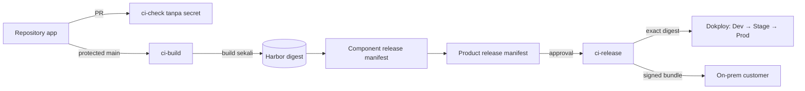

# CI/CD polyrepo

Dokumen ini menetapkan cara source, test, image, release, promotion, dan bundle
customer bergerak di CoreERP. Tujuannya bukan membuat semua repository berjalan
bersama, tetapi memberi setiap repository jalur release yang sama tanpa Git
submodule atau build pada server production.

## Keputusan

Target platform adalah **Forgejo LTS + Forgejo Actions runner terpisah + Harbor +
Dokploy**. Semua komponennya self-hosted. GitHub yang sudah dipakai saat ini boleh
menjadi bootstrap dan mirror sampai layanan Forgejo, backup, dan restore-nya
terbukti; ia bukan registry artifact dan tidak boleh menjadi dependency runtime
customer.

Pembagian tanggung jawabnya:

| Komponen | Tanggung jawab | Bukan tanggung jawab |
| --- | --- | --- |
| Forgejo | Git, pull request, review, branch protection, dan antrean workflow | Menyimpan image release atau menjalankan production |
| Runner `ci-check` | Manifest check, lint, type check, test, contract coverage | Menerima credential registry, signing key, atau Dokploy |
| Runner `ci-build` | Build image sekali dari commit `main`, scan, push candidate | Deploy production atau menandatangani bundle customer |
| Runner `ci-release` | Verifikasi digest, tanda tangan, promotion, dan bundle | Menjalankan source dari pull request biasa |
| Harbor | OCI image, signature, SBOM, scan result, dan retention | Menentukan kombinasi versi produk |
| Repository release | Product release manifest dan promotion history | Menyalin source repository app |
| Dokploy | Menjalankan Compose dari digest yang sudah disetujui | Memilih versi, build source, atau menjadi installation registry |
| Control Plane / state lokal on-prem | Fakta catalogued, entitled, installed, dan ready sesuai profile | Menyimpulkan readiness dari keberadaan image |

Forgejo dipilih karena biaya lisensinya nol, runner dapat ditambah horizontal,
dan source serta kebijakan tim tetap berada pada infrastruktur sendiri. GitLab CE
tidak dipilih karena beban operasi dan resource-nya tidak sebanding untuk tim
awal. GitHub Free dengan self-hosted runner adalah alternatif bootstrap yang sah,
tetapi bukan target permanen ketika governance banyak tim mulai membutuhkan fitur
yang berada di luar paket gratis.

Alur lengkapnya tersedia sebagai [diagram draw.io yang dapat diedit](../diagrams/drawio/coreerp-ci-cd-polyrepo.drawio).



## Lima sumber kebenaran

Jangan membuat satu file atau dashboard berpura-pura memiliki semua state.

| Fakta | Sumber kebenaran |
| --- | --- |
| Source yang ditinjau | Commit Git pada branch terlindungi |
| Bentuk dan kontrak app | `app.yaml`, OpenAPI, dan AsyncAPI di repository app |
| Artifact satu app | Component release manifest berisi image digest immutable |
| Kombinasi produk | Product release manifest bertanda tangan di repository release |
| Sudah terpasang dan siap | Installation/deployment registry serta health check runtime |

Product release manifest tidak memuat source checkout atau branch. Ia hanya
menunjuk component release yang sudah terbit:

```json
{
  "schema_version": 1,
  "release": "2026.08.0",
  "components": [
    {
      "app_id": "example-app",
      "version": "1.4.0",
      "api_image": "registry.example/apps/example-api@sha256:<64-hex>",
      "ui_image": "registry.example/apps/example-ui@sha256:<64-hex>"
    }
  ]
}
```

Nama customer, produk, dan app yang dijual berasal dari katalog dan manifest;
pipeline tidak memiliki daftar nama besar yang di-hardcode.

## Pipeline repository app

### Pull request: cepat dan tanpa secret

Setiap pull request menjalankan:

1. validasi struktur dan `app.yaml`;
2. install dependency dari lock file;
3. lint dan type check yang tersedia;
4. test API dan build UI;
5. `contracts/check-contract-coverage.py` dari repository app;
6. validasi Dockerfile tanpa push bila runner build tersedia;
7. pemeriksaan migration terhadap PostgreSQL untuk perubahan schema.

Job pull request tidak mendapat credential Harbor, signing key, token Control
Plane, API key Dokploy, atau secret production. Pull request dari fork tidak
dijalankan pada trusted runner sebelum disetujui maintainer.

### Main: build sekali

Merge ke `main` menghasilkan API dan UI image sekali. Image diberi candidate tag
berdasarkan commit untuk pencarian manusia, tetapi output pipeline yang dipakai
selanjutnya adalah digest:

```text
git commit
  -> build API + UI
  -> vulnerability scan
  -> push Harbor
  -> component-release.json berisi digest
```

Tag `latest` dilarang. Build untuk Dev, Staging, Production, dan on-prem tidak
diulang. Bila source commit berubah, itu artifact berbeda dan harus melewati gate
dari awal.

### Component release

Tag SemVer harus sama dengan `app.yaml`. Release job mengambil candidate digest
dari commit tersebut, memverifikasi scan dan kontrak, menandatangani kedua image,
kemudian menerbitkan component release manifest sebagai OCI artifact. Release job
menolak tag jika candidate dari commit itu tidak ditemukan; ia tidak membangun
ulang secara diam-diam.

### Product release dan promotion

Repository release membuat pull request yang hanya mengubah product release
manifest. Gate-nya:

```text
component manifests
  -> compatibility check
  -> integration test
  -> deploy Dev
  -> persetujuan Staging
  -> deploy digest yang sama ke Staging
  -> persetujuan Production
  -> deploy digest yang sama ke Production
  -> buat bundle on-prem bertanda tangan
```

Persetujuan adalah merge/release action pada ref terlindungi, bukan perubahan
manual tag image. Dokploy dipanggil melalui API key per environment dan hanya
menerima Compose yang sudah menunjuk digest.

Upgrade belum boleh dipromosikan sebagai install biasa. Selama compatibility
matrix, backup terverifikasi, drain, dependency order, dan rollback worker belum
ada, pipeline hanya boleh menghasilkan artifact dan deployment baru yang memang
didukung oleh gate lifecycle saat ini.

## Runner trust zones dan scale-out

Label runner menyatakan kemampuan penjadwalan, bukan boundary keamanan. Tiga kelas
runner harus berada pada VM/host terpisah dari production:

| Runner | Source yang boleh dijalankan | Secret | Cara scale |
| --- | --- | --- | --- |
| `ci-check` | Pull request | Tidak ada release secret | Tambah instance berlabel sama |
| `ci-build` | Commit `main` terlindungi | Robot account Harbor per project | Tambah worker build disposable |
| `ci-release` | Workflow library dan ref release terlindungi | Signing key, release storage, deploy key per environment | Sedikit instance; serial per product release |

Jangan mount Docker socket host yang menjalankan Forgejo, Harbor, atau layanan
lain ke job. Build runner berjalan pada VM disposable/dedicated. Compromise pada
job build harus berhenti di VM tersebut dan robot account satu project, bukan
membuka seluruh registry atau production.

Pertumbuhan dilakukan dengan menambah runner pada pool yang sama. Jangan membuat
pipeline baru per tim atau server CI khusus per app. Antrean boleh bertambah;
hasil release tidak boleh berubah karena runner yang mengambil job berbeda.

## Workflow library dan ownership

Saat GitHub masih menjadi bootstrap, workflow berulang hidup di satu repository
private workflow library milik organisasi yang sama. File aktifnya berada tepat
di `.github/workflows/`; akses Actions antarrepository private harus diaktifkan
pada repository library. Saat migrasi penuh ke Forgejo, gunakan workflow library
public-read sesuai batasan Forgejo. Caller di repository app hanya berisi trigger
dan referensi:

```yaml
jobs:
  checks:
    uses: <organisasi>/app-erp-ci-workflows/.github/workflows/app-checks.yml@<commit-sha>
```

Referensi wajib commit immutable. Branch seperti `main` dan tag yang dapat
dipindah bukan pin supply-chain. Upgrade workflow library dilakukan melalui pull
request mekanis ke repository app, lalu setiap app membuktikan versi baru lulus.
Direktori `deploy/` hanya menyimpan asset deployment; ia bukan lokasi workflow
GitHub aktif.

Repository app tetap memiliki checker contract dan test domainnya sendiri.
Workflow library mengatur urutan dan runtime; ia tidak menyimpan pengecualian
domain suatu app.

Ownership minimum:

- perubahan source biasa: satu approval dari owner app;
- perubahan workflow, Dockerfile, migration, contract terbit, atau release
  manifest: approval owner terkait;
- promotion Production dan signing policy: dua orang berbeda ketika jumlah tim
  sudah memungkinkan;
- akun manusia tidak mempunyai credential push Harbor atau signing key.

Tim memakai trunk-based development: `main` terlindungi, branch pendek, dan pull
request. Branch `develop`, `master`, atau branch environment permanen tidak
dipakai. Environment adalah digest yang dipromosikan, bukan branch.

## Secret dan supply chain

- Dependency memakai lock file dan mode install reproducible (`composer install`
  dan `npm ci`).
- Action eksternal dan CI toolbox dipin ke commit/image digest.
- Harbor memakai robot account per project dengan hak minimum dan masa berlaku.
- Signature image dan bundle menggunakan key berbeda dari license signing key.
- Private key hanya tersedia pada `ci-release`; public verification key ikut
  installer/on-prem bundle.
- Log tidak boleh mencetak token, `.env`, license, atau payload data bisnis.
- SBOM, provenance, vulnerability result, signature, dan component manifest
  melekat pada digest yang sama.
- Backup Forgejo, Harbor metadata/blob, release directory, konfigurasi Dokploy,
  dan signing key dilakukan off-host serta diuji restore berkala.

## Tahapan adopsi

### Tahap 1 — tim sekarang

1. Rapikan semua repository ke `main` dan branch protection.
2. Pasang check pipeline tanpa secret pada semua repository.
3. Jalankan satu `ci-check` dan satu `ci-build` pada host CI terpisah.
4. Pasang Harbor dan gunakan robot account per repository/app.
5. Build candidate dari `main`; production masih membutuhkan persetujuan manual.
6. Jadikan GitHub mirror sementara bila Forgejo belum lolos backup/restore test.

### Tahap 2 — release pertama

1. Aktifkan signing dan component release manifest.
2. Jadikan repository deployment sebagai repository product release, bukan tempat
   clone/build source.
3. Hubungkan promotion ke Dokploy API per environment.
4. Uji backup, failed migration, retry, dan restore di Staging.
5. Buat bundle on-prem hanya dari product release Production yang disetujui.

### Tahap 3 — banyak tim

1. Tambah runner berdasarkan panjang antrean dan waktu tunggu, bukan jumlah repo.
2. Terapkan CODEOWNERS per app/contract/workflow.
3. Tambah compatibility test consumer untuk perubahan contract.
4. Pisahkan signing ke service/HSM atau OpenBao bila jumlah operator dan release
   meningkat.
5. Tambah registry replication dan disaster-recovery site ketika RTO/RPO bisnis
   membutuhkannya.

Kubernetes, Argo CD, dan autoscaler runner bukan syarat tahap awal. Mereka baru
ditambahkan bila deployment Compose atau kapasitas VM terbukti menjadi bottleneck,
bukan karena jumlah repository bertambah.

## Kondisi repository saat keputusan dibuat

- CoreERP baru memiliki GitHub workflow untuk lint dan test Control Plane.
- Repository app yang diaudit belum mempunyai workflow CI.
- Hanya satu app pilot yang memiliki contract coverage checker berbasis route
  Laravel; checker ini harus menjadi standar semua repository app.
- Repository deployment masih mempunyai mode yang clone dan build source pada
  server deployment. Mode itu adalah gap transisi dan tidak boleh menjadi jalur
  Production setelah Harbor tersedia.
- Upgrade worker dan rollback terverifikasi belum tersedia, sehingga pipeline
  tidak boleh menyatakan upgrade otomatis sudah aman.

## Lihat juga

- [Release dan on-prem perpetual](03-release-and-on-prem.md)
- [Menerbitkan app dari repository terpisah](13-publishing-an-app-release.md)
- [Target pemisahan repository](06-worktree-target.md)
- [Gate fondasi Core](10-core-foundation-gates.md)
- [Load dan concurrency testing](15-load-and-concurrency-testing.md)

## Referensi implementasi resmi

- [Forgejo Actions reference](https://forgejo.org/docs/v15.0/user/actions/reference/)
- [Forgejo Actions security](https://forgejo.org/docs/latest/user/actions/security/)
- [Menjalankan Docker dengan Forgejo Actions](https://forgejo.org/docs/v15.0/admin/actions/docker-access/)
- [Harbor vulnerability scanning](https://goharbor.io/docs/main/administration/vulnerability-scanning/)
- [Harbor robot accounts](https://goharbor.io/docs/2.12.0/administration/robot-accounts/)
- [Cosign container signing](https://docs.sigstore.dev/cosign/signing/signing_with_containers/)
- [Cosign verification](https://docs.sigstore.dev/cosign/verifying/verify/)
- [Dokploy Compose API](https://docs.dokploy.com/docs/api/reference-compose)
