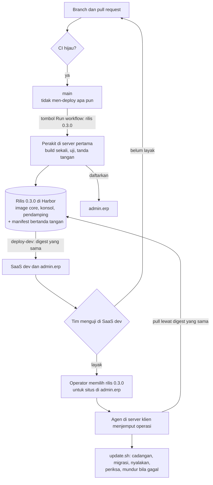
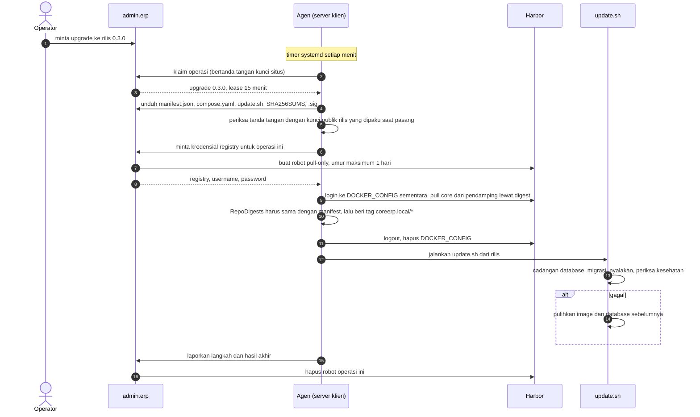

# Dari branch sampai server klien

Halaman ini menjawab satu pertanyaan: **bagaimana kode yang saya merge sampai ke SaaS dev dan ke server klien?**
Alurnya berlaku sejak 15 September 2026 dan berbeda dari sebelumnya, jadi bacalah "Anggapan yang keliru" lebih
dulu.

Rancangan lengkapnya ada di tiga PRD: [registry Harbor](/todo/registry-harbor/),
[pemasangan satu perintah](/todo/pasang-satu-perintah/), dan [lisensi yang mengunci](/todo/lisensi-mengunci/).
Halaman ini merangkum bagaimana ketiganya bertemu.

> **Keadaan per 15 September 2026.** Seluruh bagiannya sudah di `main`, tetapi belum pernah diuji ujung-ke-ujung
> di server klien sungguhan (E2E-01 di PRD registry). Lihat [Yang belum ada](#yang-belum-ada).

## Satu kalimat

**Tidak ada yang di-deploy dari `main`.** Yang di-deploy selalu **rilis**: image yang dibangun sekali, disimpan di
Harbor, dan dipakai persis sama oleh SaaS dev lalu oleh server klien. Yang lolos diuji di SaaS dev adalah yang
dikirim ke klien.

## Anggapan yang keliru

| Anggapan | Yang sebenarnya |
| --- | --- |
| Merge ke `main` memperbarui SaaS dev | Merge ke `main` hanya menjalankan CI. SaaS dev berubah ketika sebuah **rilis** dibuat. |
| Rilis ditandai tag git atau GitHub Release | Rilis dibuat lewat tombol **Run workflow** alur `rilis` dengan nomor rilis. Nomor itu menjadi tag di Harbor yang tidak dapat ditimpa; tidak ada tag git. |
| SaaS dev dan klien menjalankan build masing-masing | Image dibangun **sekali** per rilis. SaaS dev dan server klien menarik digest yang sama dari Harbor. |
| Agen mengambil tag rilis dari Harbor | Agen menarik **lewat digest** yang tertulis di manifest rilis bertanda tangan. Tag hanya untuk dibaca manusia dan untuk retensi. |
| Agen yang mendistribusikan rilis | **admin.erp** yang memutuskan server klien mana memasang rilis mana, dan kapan. Agen di setiap server klien hanya menjemput operasi miliknya sendiri. |
| Server klien memegang akun registry | Server klien tidak pernah memegang kredensial tetap. Setiap operasi mendapat robot **pull-only** dari admin.erp yang mati bersama operasinya. |

## Gambaran besar

Tiga hal yang sering tertukar:

- **Kotak "Rilis" adalah satu-satunya sumber image.** SaaS dev, admin.erp, dan server klien semuanya menarik dari
  sana; tidak ada yang dibangun saat men-deploy.
- **Tidak ada panah dari server pertama ke server klien.** Server pertama tidak pernah menghubungi server klien;
  agenlah yang menghubungi admin.erp dan Harbor.
- **Memilih rilis untuk klien bukan bagian alur GitHub.** Ia keputusan per situs, di admin.erp, dan pembaruan
  hanya dijalankan di jendela pembaruan situs itu.

## Tahap demi tahap

| Tahap | Siapa | Di mana | Yang dikerjakan | Penjaga |
| --- | --- | --- | --- | --- |
| 1. Pengembangan | Pengembang | Branch dan PR | Mengubah kode, menulis test | CI: `quality`, `ci`, `konsol`, `agen`, `edisi` |
| 2. Merge | Pengembang atau reviewer | GitHub | Merge ke `main` — **tidak ada deploy** | Cabang utama dikunci; lihat [CI/CD](22-ci-cd.md) |
| 3. Membuat rilis | Siapa pun yang boleh menjalankan workflow | GitHub → Actions → `rilis` → Run workflow | Isi nomor rilis (misalnya `0.3.0`) dan commit (`main` atau SHA di `main`) | Nomor yang sudah dipakai ditolak; commit di luar `main` ditolak |
| 4. Merakit | Perakit, otomatis | Server pertama | Build image core dan konsol, `uji-image.sh`, push ke Harbor beserta pendamping, manifest v2 bertanda tangan, daftar ke admin.erp | Tag immutable, compose wajib `pull_policy: never`, tanda tangan diperiksa ulang oleh admin.erp |
| 5. SaaS dev | `deploy-dev`, otomatis sesudah tahap 4 | Server pertama | Menarik image core dan konsol lewat digest, migrasi, menyalakan SaaS dev dan admin.erp | RepoDigests dicocokkan; `/up` harus menjawab; tidak ada layanan yang keluar dengan galat |
| 6. Menguji | Tim | SaaS dev | Mencoba rilis itu | — |
| 7. Memilih untuk klien | Operator | admin.erp | Pemasangan pertama: **Buat perintah pasang** di panel Server klien (rilis terbaru). Pembaruan: minta operasi `upgrade` di halaman situs | Rilis harus terdaftar dan lebih baru dari yang terpasang |
| 8. Pemasangan pertama | Teknisi di lokasi klien | Server klien | Menempel perintah `curl … \| sudo bash` sekali | `pasang.sh` menolak folder dan proyek compose milik stack lain |
| 9. Menjemput dan memasang | Agen | Server klien | Lihat diagram di bawah | Tanda tangan, digest, kredensial per operasi, jendela pembaruan |
| 10. Selesai | Agen dan admin.erp | Keduanya | Hasil dilaporkan, robot registry dihapus, jejak audit tercatat | Robot tersapu juga bila operasi gagal atau tenggatnya habis |

`upgrade` hanya diserahkan kepada agen **di dalam jendela pembaruan situs**. `install` kapan saja, karena belum
ada yang sedang dilayani di server itu.

### Memasang ulang atau mundur di SaaS dev

GitHub → Actions → `deploy-dev` → Run workflow, dengan nomor rilis yang **sudah** dirakit. Tidak ada yang
dibangun: rilis itu ditarik lagi dari Harbor, dengan compose dan migrasi dari commit rilis itu sendiri. Dipakai
sesudah menyunting `/etc/coreerp/saas.env`, atau untuk kembali ke rilis sebelumnya bila rilis baru bermasalah di
SaaS dev — ingat aturan migration di bawah.

## Satu pembaruan di server klien, langkah demi langkah

Selama pull yang panjang agen terus melaporkan langkahnya, sehingga lease tidak habis. Pemasangan pertama di
server dengan unduhan lambat bisa memakan waktu berjam-jam, karena image pendamping gotenberg saja ratusan
megabyte. Pembaruan rutin hanya menarik lapisan kode yang berubah, sekitar 11 MB.

## Siapa memegang apa

| Rahasia atau identitas | Tempatnya | Gunanya | Kalau bocor |
| --- | --- | --- | --- |
| Kunci privat rilis | Server pertama, root 0600 | Menandatangani berkas rilis | Rilis palsu dapat ditandatangani. Dipindah ke mesin terpisah sebelum klien produksi pertama. |
| Kunci publik rilis | admin.erp dan setiap server klien | Memeriksa tanda tangan rilis | Tidak rahasia |
| Secret SSH `deploy` | GitHub | Menjalankan `rilis` dan `deploy-dev` | Dapat membuat rilis dari commit yang **sudah di `main`** dan memasangnya ke SaaS dev — lewat satu aturan sudo untuk `/usr/local/sbin/coreerp-rilis`, tidak lebih |
| Robot perakit | Server pertama, root 0600 | Push image rilis ke Harbor | Tag rilis tidak dapat ditimpa, dan image tanpa tanda tangan sah tidak pernah dijalankan agen |
| Robot SaaS dev | `/etc/coreerp/saas-registry.env`, root:coreerp 0640 | Menarik rilis ke SaaS dev | Pull saja |
| Token rilis | Konsol dan perakit | Mendaftarkan rilis ke admin.erp | admin.erp tetap menolak berkas yang tanda tangannya tidak sah |
| Robot sistem konsol | Database admin.erp, terenkripsi | Membuat dan menghapus robot situs | Robot baru hanya dapat pull, tidak dapat push |
| Robot situs | Memori agen selama satu operasi | Pull image di server klien | Mati bersama operasinya, paling lama satu hari |
| Kunci situs | Server klien, root 0600 | Menandatangani setiap permintaan agen ke admin.erp | Dicabut dari admin.erp; situs yang dicabut tidak dapat menarik apa pun lagi |

## Kenapa bentuknya begini

- **Build sekali.** Image yang dibangun ulang dari commit yang sama belum tentu sama isinya — paket OS dan
  dependensi dapat bergerak di antara dua build. Satu build per rilis berarti yang diuji tim di SaaS dev adalah
  byte yang sama dengan yang diterima klien.
- **Rilis tidak otomatis setiap merge.** `main` berubah beberapa kali sehari, dan setiap rilis menambah lapisan yang
  tidak dapat ditimpa di Harbor. Rilis adalah keputusan, dan nomornya dipilih orang.
- **Build di server kita, bukan di runner GitHub.** Pemilik produk memutuskan tidak ada biaya GitHub untuk
  membangun dan membagikan rilis. Runner hanya membuka SSH; kunci privat rilis tidak pernah meninggalkan server
  pertama.
- **Digest, bukan tag.** Tag dapat dipindahkan siapa pun yang memegang hak push; digest adalah sidik jari isi
  image. Digest itu tertulis di manifest yang ditandatangani kunci rilis, dan kunci itu tidak dipegang robot
  mana pun — jadi robot perakit yang dicuri tetap tidak dapat membuat server klien menjalankan image lain.
- **Tarik, bukan dorong.** Server klien tidak dibuka dari internet. Agen yang menghubungi keluar; admin.erp hanya
  menaruh operasi di antrean.
- **Host registry tidak pernah tersimpan di server klien.** Alamat dan kredensial datang di setiap operasi, dan
  compose hanya mengenal nama lokal `coreerp.local/*` dengan `pull_policy: never`. Registry dapat pindah tanpa
  menyentuh satu pun server klien.
- **Satu image untuk semua klien.** Image berisi Core dan seluruh modul. App yang boleh dibuka tenant diatur dari
  admin.erp dan dijaga lisensi yang mengunci, bukan dengan membuang modul dari image.

## Nomor rilis

- Bentuknya angka bertitik: `0.3.0`, `1.0.0`.
- Satu nomor untuk satu isi. Nomor yang sudah dipakai ditolak perakit sebelum membangun, dan ditolak admin.erp bila
  isinya berbeda. Perubahan sekecil apa pun yang ingin dicoba di SaaS dev berarti nomor berikutnya.
- Rilis untuk server klien hanya boleh maju. admin.erp dan agen sama-sama menolak pembaruan ke rilis yang sama
  atau lebih lama; mundur di server klien hanya terjadi di dalam `update.sh` ketika pembaruan gagal.
- Migration harus tetap dapat dipakai kode rilis sebelumnya, karena yang dimundurkan saat rilis bermasalah adalah
  image, bukan database. Aturannya di [Release dan on-prem](03-release-and-on-prem.md#perubahan-skema-dan-mundur).

## Yang belum ada

- **Uji ujung-ke-ujung di server klien sungguhan** (E2E-01). Setiap bagian diuji sendiri-sendiri, dan kredensial
  registry diuji terhadap Harbor sungguhan, tetapi belum ada server klien yang dipasang dari awal sampai akhir
  lewat alur ini.
- **Penandatanganan di mesin terpisah** sebelum klien produksi pertama.
- **Tag `terpasang-*` dan retensi otomatis** (CP-05). Sampai itu ada, rilis lama tidak dibuang dari Harbor.
- **Mundur ke rilis sebelumnya di server klien atas perintah operator.** Hari ini mundur di server klien hanya
  terjadi otomatis saat pembaruan gagal.
- **SaaS produksi.** Alur ini hanya mengenal SaaS dev. Produksi kelak memasang rilis yang sama lewat gerbang
  persetujuan tersendiri.

## Lihat juga

- [Release dan on-prem](03-release-and-on-prem.md) — edisi, migration yang kompatibel mundur, dan on-prem perpetual.
- [CI/CD](22-ci-cd.md) — pemeriksaan yang harus hijau sebelum merge.
- `.github/workflows/rilis.yml` dan `.github/workflows/deploy-dev.yml` — kedua tombol.
- `deploy/perakit/README.md` — perakit, pembungkus sudo, dan pemasangannya.
- `deploy/saas/pasang-rilis.sh` — pemasangan rilis ke SaaS dev.
- `deploy/registry/README.md` dan `deploy/registry/RUNBOOK.md` — Harbor, robot, dan prosedur operator.
- `deploy/agent/README.md` — agen di server klien.
