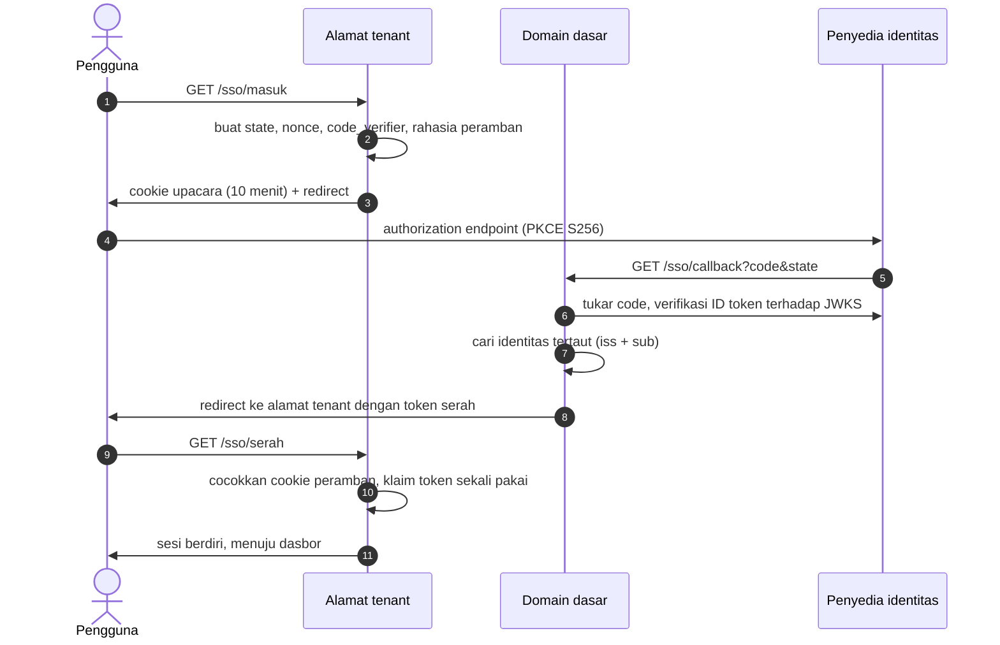

# SSO: masuk lewat penyedia identitas

Halaman ini menjelaskan **bagaimana SSO bekerja di kode ini** — alur, alamat, penjaga, dan setelannya. Aturan
tentang *kapan sebuah tenant memakai SSO* dan *dua jenis undangan* ada di
[Identity dan access](09-identity-and-access.md#kapan-sebuah-tenant-memakai-sso); halaman ini tidak
mengulangnya.

Dua aplikasi memakai SSO dengan penyedia yang sama tetapi **klien OIDC yang berbeda**: Core untuk pengguna
tenant, dan [admin.erp](31-admin-erp-konsol.md) untuk operator. Keduanya memakai OIDC authorization code +
PKCE, dan keduanya memverifikasi ID token sendiri terhadap JWKS penyedia.

## Anggapan yang keliru

| Anggapan | Yang sebenarnya |
| --- | --- |
| Identitas ditautkan lewat email | Tidak pernah. Tautannya `iss` + `sub`. Penyedia menulis `email_verified_at` pada pendaftaran mandiri tanpa memverifikasi apa pun, jadi email adalah klaim yang dapat dipilih sendiri oleh penyerang |
| Masuk lewat SSO membuatkan akun | Tidak. Akun SSO yang belum tertaut ditolak, dan pesannya menyuruh masuk dengan kata sandi lalu menautkan dari Pengaturan. Satu-satunya jalur akun baru lahir adalah undangan yang terikat subjek |
| Alamat balik ada di alamat tenant | Alamat balik **satu per penempatan**, di domain dasar. Ia diturunkan dari domain dasar, bukan dari `APP_URL` |
| Menyalakan SSO menutup kata sandi | Tidak. Keduanya hidup berdampingan; pintu kata sandi ditutup terpisah, dan di konsol ada daftar alamat surel yang tetap boleh masuk |
| Satu klien OIDC untuk semua | Core dan konsol adalah dua klien. ID token terbitan klien Core **ditolak** konsol, dan ada test yang memakukannya |

## Alur di Core: tiga kaki, dua alamat

Upacaranya menyeberangi dua alamat, dan itu yang membuat bentuknya tidak biasa.



**Kenapa ada kaki ketiga.** Penyedia hanya mengenal satu alamat balik per penempatan, sedangkan setiap tenant
punya alamatnya sendiri. Kaki ketiga memindahkan hasilnya ke alamat tenant. Karena cookie sesi tidak
diseberangkan antar-alamat, upacara membawa **rahasia peramban** sendiri: token serah saja tidak cukup, ia
harus datang dari peramban yang memulai. Tanpa itu, tautan yang bocor dari log atau riwayat menjadi sesi.

Yang disimpan di `sso_login_attempts` hanya hash: `state`, rahasia peramban, dan token serah. `code_verifier`
tersimpan terenkripsi. Token serah **sekali pakai**, dan klaimnya dilakukan dengan satu `UPDATE` bersyarat,
sehingga dua tab yang berlomba hanya menghasilkan satu sesi.

Tiga pintu masuk memakai upacara yang sama dan berbeda hanya pada cabang akhirnya:

| Pintu | Untuk | Akhir |
| --- | --- | --- |
| `/sso/masuk` | Masuk | Identitas tertaut → sesi |
| `/sso/hubungkan` | Menautkan akun yang sedang masuk | Baris `external_identities` baru |
| `/sso/gabung` | Menukar undangan terikat | Akun, keanggotaan, dan peran lahir dalam satu transaksi |

## Alur di konsol operator

Konsol punya satu alamat saja, jadi tidak ada kaki ketiga dan tidak ada tabel upacara: `state`, `nonce`, dan
`code_verifier` tinggal di sesi dan diambil sekali pakai. Sesudah ID token terbukti, konsol menuntut dua hal
berurutan — identitas itu tertaut ke sebuah akun, dan akun itu **operator**. Akun tertaut yang bukan operator
ditolak tanpa sesi.

## Yang diperiksa sebelum sebuah sesi berdiri

- **`state`** acak panjang, disimpan sebagai hash, sekali pakai. Yang tidak dikenal ditolak **sebelum** kode
  ditukarkan — penukaran adalah bagian yang menghubungi penyedia, dan ia tidak boleh dipicu tamu.
- **PKCE S256**, tanpa jalur `plain`. `response_type` hanya `code`.
- **Penerbit**: dokumen discovery wajib menyebut `issuer` yang sama persis dengan yang disetel; ID token wajib
  `iss` yang sama dan `aud` yang memuat client id aplikasi ini.
- **Tanda tangan** RS256 terhadap JWKS penyedia, dengan toleransi jam satu menit. JWKS di-cache satu jam, dan
  `kid` yang tidak dikenal memicu **satu** pengambilan ulang sebelum ditolak — kunci yang baru dirotasi tidak
  boleh berarti semua orang gagal masuk sampai cache kedaluwarsa.
- **`nonce`**: dikirim selalu. Bila ada di ID token, wajib cocok. **Bila tidak ada, diterima dan dicatat
  sebagai peringatan** — penyedia bersama hari ini tidak mengembalikannya pada alur kode, dan RFC 9700
  menerima PKCE *atau* nonce sebagai pengikat. Ini kelonggaran sementara yang dipaku test di kedua aplikasi;
  cabut begitu penyedia mengembalikan nonce.
- **Keunikan tautan**: satu identitas penyedia hanya boleh menunjuk satu akun, dan satu akun hanya punya satu
  identitas per penerbit. Pengambilalihan tautan ditolak ke arah mana pun.
- **Menautkan menuntut kata sandi diketik ulang**, di Core maupun di konsol. Tanpa itu, peramban yang
  ditinggalkan terbuka cukup untuk memasang identitas penyerang pada akun korban.

Setiap kegagalan menutup upacaranya, mencatat sebabnya di log, dan mengembalikan pengguna ke halaman masuk
dengan **kode tetap** di alamat — tidak pernah kalimat bebas. Halaman masuk tidak pernah mencetak teks yang
datang dari alamat, dan ada test untuk itu di kedua aplikasi.

## Keluar: back-channel logout

Penyedia mengirim `POST /sso/backchannel-logout` berisi logout token bertanda tangan. CSRF dikecualikan —
pengirimnya server, bukan peramban — dan yang menjaganya tanda tangan token: wajib memuat event logout, wajib
menyebut `sub`, dan **dilarang** memuat `nonce`.

Akibatnya berbeda di dua aplikasi, dan bedanya nyata di produksi:

| | Core | Konsol |
| --- | --- | --- |
| Penyimpan sesi | Database | Berkas |
| Yang terjadi | Seluruh baris sesi milik pengguna itu dihapus seketika | Waktu logout ditandai di cache; sesi berakhir pada permintaan berikutnya |

Sesi berkas tidak dapat dicari per pengguna — itu sebabnya konsol menunda satu permintaan, bukan karena
kelalaian.

## Setelan

Kosongkan untuk mematikan SSO sepenuhnya: rute `/sso/*` menjawab 404, dan halaman masuk hanya menampilkan
pintu kata sandi.

| Aplikasi | Kunci | Catatan |
| --- | --- | --- |
| Core | `COREERP_SSO_ISSUER`, `COREERP_SSO_CLIENT_ID`, `COREERP_SSO_CLIENT_SECRET` | Klien untuk pengguna tenant |
| Core | `COREERP_SSO_API_URL`, `COREERP_SSO_API_CLIENT_ID`, `COREERP_SSO_API_CLIENT_SECRET` | API pengelolaan penyedia (pencarian pengguna, pengiriman undangan). Kosong berarti diturunkan dari issuer dan memakai pasangan di atas |
| Core | `COREERP_BASE_DOMAIN` | Menentukan alamat balik |
| Konsol | `CONSOLE_SSO_ISSUER`, `CONSOLE_SSO_CLIENT_ID`, `CONSOLE_SSO_CLIENT_SECRET` | Klien terpisah |
| Konsol | `CONSOLE_PASSWORD_LOGIN`, `CONSOLE_BREAK_GLASS_EMAILS` | Menutup pintu kata sandi, dan daftar yang tetap boleh masuk ketika penyedia mati |

Alamat yang didaftarkan di penyedia, satu pasang per penempatan:

```text
<skema>://<domain dasar>/sso/callback
<skema>://<domain dasar>/sso/backchannel-logout
```

**Di laptop alamat itu bukan `APP_URL`.** Alamat balik diturunkan dari domain dasar penempatan, sehingga
pemasangan lokal mendaftarkan `http://erp.localhost:8000/sso/callback`, bukan `http://localhost:8000/...`.
Salah mendaftar di sini muncul sebagai kegagalan di sisi penyedia, jauh dari kodenya.

Server klien on-prem tidak pernah memakai SSO: templat `.env` agen tidak memuat satu pun kunci di atas.

## Menguji

Suite SSO memverifikasi token yang **benar-benar ditandatangani** RSA di dalam test, bukan token tiruan.
Penolakannya ditulis kembar di Core dan di konsol — itulah yang menahan dua salinan klien OIDC tetap sepakat.

```bash
cd apps/core && php vendor/phpunit/phpunit/phpunit --filter "Sso"
cd apps/control-plane && php vendor/phpunit/phpunit/phpunit --filter "Sso"
```

Yang dijaga, secara garis besar: bentuk permintaan otorisasi, sesi yang hanya berdiri di kaki ketiga, subjek
yang menang atas email yang berubah, akun tak tertaut yang ditolak walau emailnya sama dan "terverifikasi",
token dari klien lain, `aud`/`iss`/tanda tangan/kedaluwarsa, `state` sekali pakai, token serah yang tidak dapat
membuka alamat tenant lain, dan halaman masuk yang tidak pernah mencetak teks dari alamat.

## Yang belum ada, dan yang sementara

- **Nonce yang dilonggarkan** (lihat di atas) — sementara, dan ditunggu perbaikan penyedia.
- **Mode "penyedia milik pelanggan"**: skemanya berdiri, integrasinya belum. Kolom domain email sudah ada dan
  belum dibaca siapa pun.
- **Layar setelan penyedia identitas** belum ada; pengecualian per tenant masih lewat perintah artisan. Ketika
  layarnya dibuat, ia wajib menampilkan hasil keputusan `TenantSso::availableFor()`, bukan isi baris tabelnya —
  tenant tanpa baris mengikuti bawaan penempatan, dan layar yang menampilkan tabel akan menyebutnya "mati".
- **Baris upacara tidak pernah dibersihkan**: tidak ada job yang menghapus `sso_login_attempts` yang sudah
  kedaluwarsa.
- **Kredensial API pengelolaan masih memakai pasangan klien OIDC yang sama**, karena penyedia belum mengenal
  kredensial mesin terpisah. Endpoint pencarian penggunanya tidak mengenal scope, jadi penahannya batas laju dan
  jejak audit, bukan izin.
- **Dua salinan klien OIDC** di Core dan konsol, disengaja karena keduanya image terpisah. Ubah keduanya, dan
  Core yang berwenang.

## Halaman terkait

- [Identity dan access](09-identity-and-access.md) — kapan tenant memakai SSO, dan dua jenis undangan.
- [admin.erp: konsol operator](31-admin-erp-konsol.md) — siapa yang dianggap operator.
- `apps/core/app/Support/Sso/` dan `apps/control-plane/app/Sso/` — kodenya.
