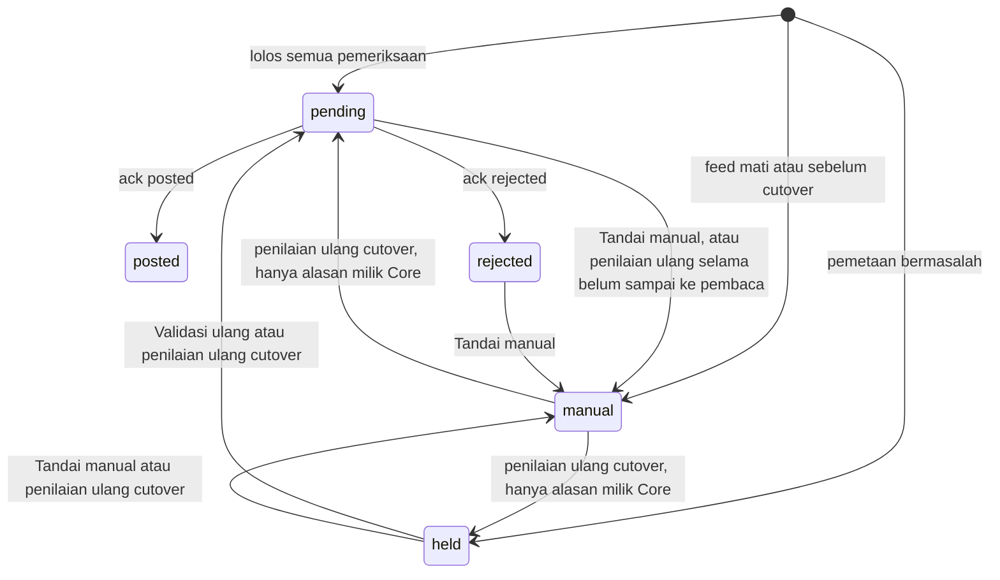

# Feed posting finance

Feed posting finance adalah jalur di Core yang membawa jurnal dari module ke aplikasi finance milik pelanggan. Satu baris `finance_postings` adalah **satu posting**: satu dokumen sumber — misalnya satu penerimaan aset — beserta jurnalnya yang sudah seimbang, dengan akun milik aplikasi finance pelanggan dan dimensi keuangan di setiap baris. Core tidak membukukan apa pun. Module menerbitkan posting, Core memeriksa dan menyimpannya, lalu aplikasi finance — di halaman ini disebut **pembaca** — mengambilnya lewat pull atau menerimanya lewat push, membukukannya, dan melapor balik lewat ack.

Halaman ini untuk developer yang akan menyentuh kodenya: apa yang disimpan, aturan apa yang ditegakkan kode, dan kenapa. Dokumen berikut melengkapinya dan tidak diulang di sini:

- [PRD feed posting finance](../todo/feed-posting-finance/README.md) — alasan setiap keputusan. Halaman ini merujuknya sebagai K-01, K-02, dan seterusnya.
- [TODO feed posting finance](../todo/feed-posting-finance/TODO.md) — butir kerja dan keadaannya.
- Spesifikasi **Integrasi · Finance** di portal `/docs` aplikasi Core, terbuka tanpa login — kontrak dan panduan untuk tim pembaca. Sumbernya `apps/core/contracts/internal/integrasi-finance.yaml`.

::: warning Belum ada module yang menerbitkan posting
Per 23 September 2026 modul aset belum memanggil `PenerbitPosting` — area 9 sampai 12 di TODO belum dikerjakan — dan module lain juga belum. Feed di server mana pun karena itu kosong. Perilaku di halaman ini dibuktikan test Core yang menyusun masukan module sendiri. Perbarui peringatan ini bersama kolom **Tersedia** di kontrak (lihat [menambah jenis posting](#menambah-jenis-posting-dari-modul-lain)) ketika jenis pertama benar-benar terbit.
:::

```text
module                              Core                                   pembaca
──────                              ────                                   ───────
simpan dokumen ──┐
                 └─▶ PenerbitPosting ─▶ finance_postings ─── pull ─────────▶ aplikasi finance
                     (transaksi         held · pending ·    atau push
                      dokumen itu)      manual
                                        posted · rejected ◀──── ack ────────
```

Posting ditulis di dalam transaksi database dokumen sumbernya. Dokumen yang batal tidak meninggalkan posting, dan dokumen yang tersimpan pasti punya posting. Tabelnya milik Core, bukan module (K-02).

## Konsep yang mudah tertukar

| Yang sering dikira sama | Bedanya |
| --- | --- |
| `posting_id` dan `id` | `posting_id` dipilih module, tetap untuk satu dokumen sumber, unik per tenant, dan menjadi kunci idempotensi di Core maupun di pembaca. `id` adalah ULID baris; di luar database ia hanya dipakai layar pantau. Rute ack memakai `posting_id`; rute layar pantau memakai `id`. |
| `payload` dan `input` | `payload` adalah bentuk kontrak persis seperti yang disajikan ke pembaca. `input` adalah permintaan asli module, disimpan supaya posting yang tertahan dapat dibentuk ulang dari sumber yang sama. `source_document.url` dan `mapping` hanya ada di `input`. |
| Exception dan `held` | Jurnal yang tidak mungkin benar — tidak seimbang, satu baris berisi debit sekaligus kredit, nilai lebih halus dari presisi mata uang — adalah bug penerbit: `PostingTidakSah` dilempar dan dokumennya batal. Pemetaan yang belum lengkap bukan bug: posting tetap terbit sebagai `held` dan dokumennya tetap tersimpan. |
| `held`, `manual`, `rejected` | Ketiganya tidak disajikan ke pembaca, tetapi yang memutuskan berbeda. `held` diputuskan Core karena pemetaan. `manual` diputuskan Core karena cutover atau feed mati, atau diputuskan pengguna. `rejected` diputuskan pembaca. |
| Disajikan dan di-ack | `served_count` hanya menghitung berapa kali posting ikut jawaban pull. Pembaca yang melakukan pull belum tentu membukukan. Yang mengakhiri posting hanya ack. |
| Terkirim dan di-ack (mode push) | Jawaban 2xx tanpa body ack berarti terkirim. Posting tetap `pending` sampai di-ack lewat API. |
| Mode untuk transaksi baru dan mode koreksi | Posting baru memakai mode yang dipilih module dari `SetelanPostingFinance::modePenyelesaian()` pada tanggal dokumennya. Koreksi dan pembalikan mewarisi mode posting asalnya, walaupun setelan entitas legal sudah berganti (K-10). |

## Status



| Status | Artinya | Disajikan ke pembaca | Yang boleh memindahkannya |
| --- | --- | --- | --- |
| `held` | Ditahan Core karena pemetaan bermasalah. Masalahnya per baris ada di `hold_reasons`. | Tidak | Validasi ulang dan Tandai manual oleh pengguna; penilaian ulang cutover saat setelan feed diubah |
| `pending` | Siap dibukukan | Ya, pada setiap pull dan lewat kiriman push, sampai di-ack | Ack pembaca; Tandai manual; penilaian ulang cutover, hanya selama posting belum pernah di-pull dan belum pernah dicoba dikirim |
| `posted` | Pembaca sudah membukukan. `external_reference` berisi nomor voucher atau fakturnya. | Tidak | Tidak ada. Status akhir. |
| `rejected` | Pembaca menolak dengan `reason_code` dan `reason` | Tidak | Tandai manual. Tidak pernah diberi tanggal ulang (K-17): kesalahannya diperbaiki dengan posting koreksi dari dokumen sumbernya, di periode yang masih terbuka. |
| `manual` | Tidak akan dikirim. `manual_reason` menyebut siapa yang memutuskan: `before_cutover` atau `feed_disabled` dari Core, atau `user` dari pengguna. | Tidak | Penilaian ulang cutover, hanya untuk alasan milik Core. Tanda `user` tidak pernah dinilai ulang. |

## Data yang disimpan

Tabelnya lahir di `apps/core/database/migrations/2026_09_22_150000_create_finance_postings_tables.php`.

| Tabel | Tanggung jawab |
| --- | --- |
| `finance_postings` | Satu posting: status, `payload`, `input`, `input_hash`, masalah penahanan, hasil ack, dan jejak pull |
| `finance_posting_lines` | Baris jurnal sebagai kolom, dengan `business_unit_code` dan `department_code` di sampingnya, supaya laporan per unit tidak perlu membongkar JSON (padanan *global dimension* BC, K-07). Dihapus lalu ditulis ulang setiap kali posting dibentuk ulang. |
| `finance_posting_deliveries` | Jejak kiriman mode push, satu baris per pasangan posting dan klien: jumlah percobaan, jadwal percobaan berikutnya, kode jawaban dan kesalahan terakhir. Mode pull tidak menulis di sini. |
| `finance_posting_events` | Riwayat untuk layar pantau, beserta pelakunya: pengguna, klien integrasi, atau kosong untuk tindakan sistem. Nama peristiwanya ditentukan pemanggil `FinancePostingEvent::catat()` di `PostingPublisher`, `PostingAcknowledger`, dan `PostingPusher`. |

Kolom yang mudah salah paham:

| Kolom | Isi |
| --- | --- |
| `finance_postings.input_hash` | SHA-256 atas isi akuntansi masukan. Lihat [Idempotensi](#idempotensi). |
| `finance_postings.hold_reasons` | Daftar masalah per baris, masing-masing `{line_no, code, message, object, fix}`. Hanya terisi selama `held`; status lain menyimpannya kosong. |
| `finance_postings.manual_reason` | `before_cutover`, `feed_disabled`, atau `user`. Alasan tertulis pengguna tidak disimpan di sini, melainkan di `finance_posting_events.data` bersama pelakunya. Kolom ini hanya mencatat *siapa* yang memutuskan, karena penilaian ulang cutover membacanya. |
| `finance_postings.published_at` | Jam posting terbit. Tidak berubah walaupun posting dibentuk ulang, jadi letaknya dalam urutan pull tetap. |
| `finance_postings.occurred_at`, `published_at` | Kolomnya disimpan dalam zona waktu aplikasi. `payload` membawa offset aslinya. |
| `finance_postings.total_debit`, `total_credit` | `decimal(24,6)`. `payload.totals` membawa string berskala persis presisi mata uang; layar pantau membaca total dari `payload`. |
| `finance_postings.source_id` | Id dokumen sumber di module. Tidak ikut `payload`. |
| `finance_postings.served_count`, `last_served_at` | Berapa kali posting ikut jawaban pull, dan kapan terakhir. Klien mana yang melakukan pull tidak dicatat per posting; satu `UPDATE` menaikkan penghitung seluruh isi satu halaman. |
| `finance_postings.acknowledged_by_client_id` | Klien integrasi yang mengirim ack. |
| `finance_postings.contract_version` | Versi bentuk `payload`, hari ini `PostingPublisher::CONTRACT_VERSION`. |

Yang dijaga database, bukan hanya kode:

- `status` hanya salah satu nilai di tabel [Status](#status), dan `manual_reason` terisi **tepat** ketika status `manual`.
- `total_debit = total_credit`, dan nilainya lebih dari nol.
- `posted` wajib punya `external_reference`; `rejected` wajib punya `reason_code`.
- Setiap baris tidak negatif dan berisi tepat satu sisi (`finance_posting_lines_one_side_check`).
- `(tenant_id, posting_id)` unik. Entitas legal ditunjuk lewat foreign key gabungan `(tenant_id, legal_entity_id)` ke `organizations (tenant_id, id)`, jadi database sendiri menolak entitas legal milik tenant lain. `tenant_id` tidak diberi foreign key ke `tenants`, karena tabel itu milik sisi pusat (`FkMenyeberangBatasTest`).
- Feed yang aktif wajib punya cutover (`finance_posting_settings_enabled_needs_cutover`). Tanpa cutover, feed akan mengirim seluruh riwayat, termasuk yang sudah dijurnal manual.
- Klien mode push wajib punya URL `https://` dan signing secret (`integration_clients_push_check`).

Keadaan-keadaan ini ditolak database, bukan hanya kode, supaya jalur yang tidak lewat penerbit tetap tidak dapat menuliskannya.

Tabel lain yang dibaca penerbit:

| Tabel | Dibaca untuk |
| --- | --- |
| `organizations` dan `legal_entities` | Entitas legal milik tenant itu, dan kodenya (`company_code`) yang disalin ke `payload.legal_entity.code` |
| `finance_reference_accounts` | Akun per baris: ada, aktif, dan berlaku untuk entitas legal itu. Nomor dan namanya disalin ke `payload`. |
| `operating_units` dan hierarki organisasi | Nilai dimensi: nomor unit, dan business unit induk pada hierarki manajemen ([nomor operating unit](01a-tenant-and-org-hierarchy.md)) |
| `vendors` dan `parties` | Nomor dan nama vendor ([Buku alamat](24-global-address-book.md)) |
| `finance_posting_settings` | Feed aktif dan tanggal cutover per entitas legal |
| `currency_precisions` | Jumlah desimal nilai per mata uang. IDR punya bawaan di `MoneyPrecision::DEFAULTS`. |

`finance_settlement_modes` tidak dibaca penerbit untuk posting baru. Module yang membacanya lewat kontrak `SetelanPostingFinance`, lalu mengirim `settlement_mode` dan `requires_vendor`.

## Endpoint dan hak akses

Module tidak memanggil HTTP. Ia menerbitkan lewat kontrak `PenerbitPosting`, di dalam proses yang sama.

| Endpoint | Guna | Penjaga |
| --- | --- | --- |
| `GET /api/internal/v1/finance-postings` | Mode pull: posting yang siap dibukukan | Klien integrasi dengan scope `finance-postings.read` |
| `POST /api/internal/v1/finance-postings/{posting_id}/ack` | Ack pembaca | Klien integrasi dengan scope `finance-postings.ack` |
| `GET /api/internal/v1/vendors` | Sinkron vendor untuk tabel penerjemah pembaca | Scope `vendors.read` |
| `GET /api/internal/v1/operating-units` | Sinkron nomor unit untuk tabel penerjemah pembaca | Scope `operating-units.read`, atau kredensial app module |
| `GET /settings/finance-postings` | Layar pantau | Owner atau admin |
| `GET /api/v1/finance-postings/{id}` | Detail satu posting | Owner atau admin |
| `POST /api/v1/finance-postings/{id}/revalidate` | Validasi ulang | Owner atau admin |
| `POST /api/v1/finance-postings/{id}/mark-manual` | Tandai manual, `reason` wajib | Owner atau admin |
| `GET`, `PUT /api/v1/organizations/{organization}/finance-posting` | Setelan feed satu entitas legal; `PUT` memicu penilaian ulang cutover | Membaca: semua anggota tenant. Mengubah: owner atau admin. |
| `/api/v1/integration-clients…` | Klien integrasi: terbitkan, ubah, cabut, token baru, signing secret baru, kirim uji | Owner atau admin |

Ditambah perintah `finance-postings:push`, dijadwalkan setiap menit di `apps/core/routes/console.php`.

Kenapa dibagi begitu:

- **Pull dan ack adalah dua scope.** Pembaca yang hanya memantau tidak perlu dapat menandai posting sudah dibukukan.
- **Layar pantau tertutup bagi anggota biasa, termasuk untuk melihat**, karena isinya jurnal keuangan tenant. Core belum punya katalog izin sendiri, jadi izin terpisah untuk melihat dan menindaklanjuti (TODO 7.4) menunggu katalog itu. Sementara itu penjaganya `canManageAccess()`, yaitu owner atau admin. Prop `canManage` sudah dikirim ke halaman, supaya halamannya tidak perlu berubah ketika izinnya dipisah.
- **Posting dan klien integrasi milik tenant lain dijawab 404, bukan 403.** Keberadaannya pun tidak boleh terbaca.

## Penerbit dan urutan pemeriksaannya

Semua posting lahir di `PostingPublisher`. Kontrak `PenerbitPosting` meneruskan ke kelas itu, begitu juga validasi ulang dan penilaian ulang cutover, supaya pratinjau di layar module dan posting yang benar-benar terbit tidak pernah diperiksa dengan cara berbeda.

**`terbitkan()` harus dipanggil di dalam transaksi dokumen sumbernya.** Di luar transaksi ia melempar `LogicException`. Ia tidak membuka transaksi sendiri, sehingga dokumen yang batal membawa postingnya ikut batal. Penyimpanannya berjalan di dalam SAVEPOINT (transaksi bersarang): bentrokan `posting_id` dengan permintaan lain yang menyimpan bersamaan tidak boleh membatalkan transaksi dokumen pemanggil, karena PostgreSQL membatalkan seluruh transaksi pada kesalahan pertama.

Pemeriksaannya berlapis, dan urutannya disengaja:

| Lapis | Gagal berarti | Akibatnya |
| --- | --- | --- |
| 1. Bentuk | Jurnal yang tidak mungkin benar, apa pun pemetaannya | `PostingTidakSah` dilempar. Dokumen sumber ikut batal. |
| 2. Cutover | Posting ini tidak boleh dikirim | Terbit sebagai `manual` |
| 3. Pemetaan | Akun atau dimensi belum dapat dibentuk | Terbit sebagai `held`, dengan masalah per baris |

### Lapis 1: bentuk

`PostingPublisher::normalize()` memeriksa:

- Field wajib dan panjangnya. `posting_id` hanya huruf, angka, titik, titik dua, garis bawah, dan strip. `posting_type` berbentuk `modul.peristiwa` (`PostingPublisher::POLA_JENIS`).
- `legal_entity_id` adalah entitas legal milik tenant itu.
- `currency_code` adalah kode tiga huruf yang presisinya diketahui. Mata uang tanpa setelan dan tanpa bawaan ditolak, bukan ditebak: menebak dua desimal untuk JPY berarti jurnal yang tidak cocok dengan pembacanya.
- `posting_date` dan `document_date` persis `Y-m-d`; `occurred_at` wajib membawa offset zona waktu (K-21).
- `source_document.module` dan `source_document.type` terisi. `source_document.url`, bila ada, harus jalur di dalam aplikasi yang diawali satu `/`: tautan ke host lain dari data posting akan menjadi pintu pengalihan ke luar CoreERP.
- Paling banyak satu dari `reverses_posting_id` dan `adjusts_posting_id`. Posting asalnya harus ada di entitas legal yang sama. Mode yang kosong diwarisi dari posting asal; mode yang berbeda dari posting asal ditolak (K-10).
- `vendor_id` adalah vendor entitas legal yang sama, dan `requires_vendor: true` tanpa vendor ditolak. Layar module yang memilih vendor per entitas legal dan mewajibkannya, jadi vendor kosong atau salah entitas yang sampai ke penerbit adalah bug module, bukan keadaan yang diserahkan ke pengguna. Status vendor tidak diperiksa: memilih vendor aktif adalah tugas layar module lewat `DaftarVendor::aktif()`.
- `lines` berisi sedikitnya dua baris dan paling banyak `PostingPublisher::MAX_LINES`. Jurnal yang lebih panjang harus diringkas per akun dan dimensi, seperti rencana posting penyusutan (K-14).
- Nilai debit dan kredit adalah string desimal tanpa tanda dan tanpa pemisah ribuan. Bilangan bulat PHP diterima; float tidak. Setiap baris berisi tepat satu sisi yang tidak nol. Nilai negatif tidak ada: arah jurnal dibawa sisinya, jadi selisih negatif ditulis di sisi sebaliknya.
- Nilai tidak boleh lebih halus dari presisi mata uang. Nilai yang lebih kasar dilengkapi nolnya — `"500000000"` menjadi `"500000000.00"` pada presisi dua.
- Jurnal seimbang, dihitung dengan desimal pasti (`brick/math`), bukan float.
- `mapping.label` wajib bila `mapping` diisi, dan `mapping.fix_url`, bila ada, harus jalur di dalam aplikasi seperti `source_document.url`, karena keduanya menjadi tautan di layar pantau. `details` harus objek, bukan daftar.

**Kenapa exception, bukan `held`.** Jurnal yang tidak seimbang adalah bug penerbit (K-22). Menyerahkannya ke pengguna berarti menyuruh orang mencari selisih yang dibuat kode. Exception membatalkan dokumen dan sampai ke SigNoz lewat [pelapor kesalahan](28-pelaporan-kesalahan.md) biasa.

**Kenapa nilai yang terlalu halus ditolak, bukan dibulatkan.** Aturannya K-20: nilai dibulatkan **di sumber, per baris**, lewat `PresisiMataUang`, lalu jurnal disusun dari nilai yang sudah bulat sehingga seimbang dengan sendirinya. Sistem lama tidak pernah seimbang karena front office menyimpan lebih banyak desimal daripada finance. Membulatkan diam-diam di Core akan menyembunyikan selisih yang sama.

### Lapis 2: cutover

`PostingPublisher::evaluate()` menentukan status:

1. Entitas legal tanpa setelan, atau feed-nya tidak aktif → `manual` dengan `feed_disabled`.
2. `posting_date` sebelum tanggal cutover → `manual` dengan `before_cutover`.
3. Ada masalah pemetaan → `held`.
4. Selain itu → `pending`.

Cutover diperiksa **sebelum** masalah pemetaan. Posting `manual` tidak menyimpan `hold_reasons`, walaupun pemetaannya belum lengkap. Cutover ada supaya riwayat yang sudah dijurnal manual di aplikasi finance tidak terkirim ulang (K-16), dan posting yang memang tidak akan dikirim tidak perlu ditahan karena pemetaannya. Posting `manual` tetap disimpan, dan dinilai ulang bila setelan feed berubah.

### Lapis 3: pemetaan

`PostingPublisher::bentuk()` memeriksa setiap baris dan mengumpulkan semua masalahnya — satu baris boleh punya lebih dari satu. Kode yang dipakai hari ini:

| Kode | Muncul ketika | Jalan pintas perbaikan (`fix`) |
| --- | --- | --- |
| `ACCOUNT_NOT_MAPPED` | `account_id` baris kosong | `mapping.fix_url`, bila module mengirimnya |
| `ACCOUNT_UNKNOWN` | `account_id` tidak ada di daftar akun tenant | `mapping.fix_url` |
| `ACCOUNT_INACTIVE` | Akunnya nonaktif | `mapping.fix_url`, atau daftar akun yang dicari dengan nomor akunnya |
| `ACCOUNT_OTHER_LEGAL_ENTITY` | Akunnya khusus entitas legal lain | `mapping.fix_url` |
| `DIMENSION_SOURCE_MISSING` | Baris tanpa `org_unit_id` | Tidak ada |
| `ORG_UNIT_UNKNOWN` | `org_unit_id` bukan operating unit tenant ini | Tidak ada |
| `BUSINESS_UNIT_UNRESOLVED` | Tidak ada tepat satu business unit di atas unit itu pada hierarki manajemen yang berlaku di `posting_date` | Hierarki organisasi |
| `BUSINESS_UNIT_NUMBER_MISSING` | Business unit-nya belum bernomor | Organisasi, bagian operating unit |
| `DEPARTMENT_REQUIRED` | Akun laba rugi, tetapi unit baris bukan department | Tidak ada |
| `DEPARTMENT_NUMBER_MISSING` | Department-nya belum bernomor | Organisasi, bagian operating unit |

Setiap masalah berbentuk `{line_no, code, message, object, fix}`. `object` menyebut benda yang bermasalah (`account` atau `organization`), dan `fix` berisi label serta alamat layar perbaikannya. Pesan untuk akun yang kosong atau tidak dikenal memakai `mapping.label` dari module, misalnya "Group KENDARAAN · akun aset belum dipetakan ke akun", karena Core tidak tahu posting group milik module.

**Kenapa ditahan, bukan dilempar.** Kesalahan pemetaan tidak boleh menghalangi pekerjaan operasional: dokumen sumber tetap tersimpan, dan postingnya menunggu pemetaan diperbaiki. Dan tidak ada akun cadangan (K-18). Pemetaan yang kosong berarti ditahan, tidak pernah dijurnal ke akun lain — verifikator lama pernah menjurnal ke akun 0 tanpa error karena konfigurasinya kosong.

Aturan dimensinya:

- **Jenis akun menentukan dimensinya** (K-09). Akun neraca hanya membawa `BUSINESS_UNIT`. Akun laba rugi membawa `BUSINESS_UNIT` dan `DEPARTMENT`.
- **`BUSINESS_UNIT` diturunkan dari unit baris** oleh `BusinessUnitResolver`, lewat hierarki bertujuan `management` pada versi yang berlaku di `posting_date`, bukan hari ini. Jurnal bulan lalu tetap masuk ke klinik yang benar walaupun polinya dipindah minggu ini. Unit baris boleh business unit itu sendiri. Dua hierarki manajemen aktif yang menjawab berbeda tidak ditebak; hasilnya `BUSINESS_UNIT_UNRESOLVED`. Padanannya *derived dimensions* F&O (K-07).
- **`DEPARTMENT` adalah unit baris itu sendiri**, wajib bertipe department dan bernomor.
- Setiap dimensi berbentuk `{code, display_name, value_code, value_display_name, value_id}`, sejajar dengan `dimensionSetLines` BC.

### Yang disalin saat terbit

Nomor dan nama akun, nomor dan nama unit, nomor dan nama vendor, serta kode entitas legal disalin ke `payload` **pada saat terbit**. Mengganti nama sesudahnya tidak mengubah posting yang sudah terbit, dan itu yang diharapkan pembaca: jurnal yang sudah ia terima tidak berubah diam-diam.

Pengecualiannya posting yang dibentuk ulang — lihat [Validasi ulang](#validasi-ulang). Ia membaca nama terbaru, karena belum pernah sampai ke pembaca.

## Idempotensi

Kuncinya `(tenant_id, posting_id)`. `publish()` mencari `posting_id` itu lebih dulu:

- **Belum ada** → posting baru.
- **Sudah ada dengan `input_hash` yang sama** → posting yang ada dikembalikan apa adanya, dengan `created: false` dan `published_at` yang lama.
- **Sudah ada dengan `input_hash` berbeda** → `PostingTidakSah`. Dokumen yang sudah terbit dikoreksi lewat posting koreksi, bukan diterbitkan ulang dengan isi lain.

Dua permintaan yang menyimpan `posting_id` yang sama bersamaan diselesaikan indeks unik: yang kalah menangkap `UniqueConstraintViolationException` di dalam SAVEPOINT-nya, membaca posting pemenang, lalu membandingkan hash yang sama.

`input_hash` hanya menangkap **isi akuntansi**: jenis, entitas legal, mata uang, tanggal posting, tanggal dokumen, mode sesudah pewarisan, `vendor_id`, posting yang dibalik atau dikoreksi, dan untuk setiap baris akun, debit, kredit, serta unit organisasinya (nilai sesudah dinormalkan ke presisi). Masukan untuk `posting_id` yang sudah ada dinormalkan dengan presisi posting itu sendiri (`currency_decimals`), bukan presisi mata uang hari ini. Module yang menerbitkan ulang dokumen yang sama setelah presisi diturunkan — nilainya kini dibulatkan ke presisi baru — tetap mendapat posting yang sama, bukan penolakan "isi berbeda". Yang **tidak** ikut: `occurred_at`, seluruh `source_document` termasuk `url`, deskripsi baris, `mapping`, `details`, dan `vendor_invoice_reference`.

Akibatnya: menerbitkan ulang dengan deskripsi atau `details` yang berbeda mengembalikan posting lama tanpa memperbaruinya. Teks penjelas yang berubah tidak boleh menghasilkan jurnal kedua, dan juga tidak mengubah jurnal yang mungkin sudah di-pull pembaca.

`pratinjau()` mengikuti aturan yang sama: `posting_id` yang sudah terbit mengembalikan posting yang ada, dan isi berbeda tetap dilempar.

Di sisi pembaca, idempotensinya `UNIQUE(posting_id)`. Posting yang sama bisa sampai lebih dari sekali — disajikan ulang pada setiap pull, atau dikirim ulang setelah jawaban yang hilang — dan menerimanya lagi tidak boleh menghasilkan jurnal kedua.

## Validasi ulang

`PostingPublisher::revalidate()`, dari tombol **Validasi ulang** di layar pantau.

- Hanya untuk `held`. Controller menjawab 422 untuk status lain; kelasnya sendiri mengembalikan posting tanpa perubahan.
- Posting dibentuk ulang dari `input` yang tersimpan, lewat `normalize()` dan `evaluate()` yang sama dengan penerbitan. `posting_id` dan `published_at` tetap; baris jurnal di `finance_posting_lines` ditulis ulang.
- Hasilnya bisa `pending`, tetap `held` dengan daftar masalah yang diperbarui, atau `manual` bila setelan feed sudah berubah.
- Karena seluruh masukan dinormalkan ulang, yang dibaca ulang bukan hanya akun, dimensi, dan cutover, tetapi juga kode entitas legal dan salinan vendor. Presisinya tidak: posting dibentuk ulang dengan `currency_decimals` miliknya, presisi saat ia terbit, karena perubahan presisi mata uang hanya berlaku untuk posting berikutnya (K-20).
- Masukan yang dulu sah bisa kini ditolak — misalnya vendornya sudah diarsipkan. Controller melaporkan `PostingTidakSah` itu ke pemantauan kesalahan, lalu menjawab 422 "Posting ini tidak dapat dibentuk ulang".
- Perubahannya ditulis di dalam kunci baris (`lockForUpdate`). Posting yang di antaranya sudah `posted` atau `rejected`, yang sudah sampai ke pembaca, atau yang baru ditandai manual oleh pengguna, dibiarkan. Posting dipilih sebelum dikunci, jadi tanda pengguna yang jatuh di antaranya hanya terlihat di dalam kunci.
- Peristiwa `revalidated` dicatat bersama penggunanya.

`posting_id` tidak berganti karena dokumennya sama, dan pembaca mengenali dokumen itu dari `posting_id`-nya.

## Tandai manual

`PostingPublisher::markManual()`, dari tombol **Tandai manual** di layar pantau.

- Hanya untuk `held`, `pending`, dan `rejected` (`FinancePosting::MARKABLE_MANUAL`). `posted` tidak termasuk: pembaca sudah membukukannya, jadi menandainya manual berarti jurnal kedua.
- Alasannya wajib, dan dicatat di peristiwa `marked_manual` bersama penggunanya. `manual_reason` menjadi `user`, dan `hold_reasons` dikosongkan.
- **Status diperiksa ulang di dalam kunci baris.** Ack pembaca bisa tiba di antara layar dibuka dan tombol ditekan. Bila statusnya sudah tidak mengizinkan, `StatusPostingBerubah` dilempar, dan controller menjawab 422 "Status posting ini baru saja berubah". Kelasnya sendiri, bukan `RuntimeException` biasa, karena `QueryException` juga turunan `RuntimeException`: menangkap induknya akan ikut menelan kesalahan database dan menampilkannya sebagai "status berubah".
- Posting `pending` yang sudah pernah di-pull atau dicoba dikirim tetap boleh ditandai. Pengguna yang memutuskan, dan layar pantau memperingatkan bahwa pembaca mungkin sudah membukukannya. Ack yang tiba sesudahnya dijawab 409, karena postingnya sudah bukan `pending`.

## Penilaian ulang cutover

`PostingPublisher::reevaluateCutover()`, dipanggil `FinancePostingSettingController::update()` setiap kali setelan feed satu entitas legal disimpan. Jawaban `PUT` membawa jumlahnya di `meta.reevaluated_postings`.

Yang dipilih hanya posting entitas legal itu yang **belum pernah sampai ke pembaca**:

- `held`;
- `manual` dengan `manual_reason` `before_cutover` atau `feed_disabled`;
- `pending` dengan `served_count` nol **dan** tanpa satu pun baris di `finance_posting_deliveries`. Kiriman yang masih menunggu jeda atau sudah gagal ikut dihitung: posting itu sudah pernah dicoba dikirim.

Yang tidak pernah dipilih: `posted`, `rejected`, `manual` dengan `manual_reason = user`, dan `pending` yang sudah pernah di-pull atau dicoba dikirim. Status posting yang sudah disajikan tidak diubah diam-diam, karena pembacanya mungkin sudah membukukan. Tanda dari pengguna tidak dinilai ulang, karena keputusan pengguna tidak boleh dibatalkan diam-diam oleh perubahan setelan. Tanda yang jatuh sesudah posting dipilih pun dilewati: pembentukan ulang dan penjadian manual memeriksa `manual_reason = user` lagi di dalam kunci baris.

Untuk setiap posting yang dipilih: feed mati → `manual` dengan `feed_disabled`; sebelum cutover → `manual` dengan `before_cutover`; selain itu posting yang bukan `pending` dibentuk ulang seperti validasi ulang, sehingga menjadi `pending` atau `held`. Posting `pending` yang tetap sah dibiarkan, termasuk `payload`-nya. Setiap posting yang dibentuk ulang atau dijadikan manual dicatat sebagai peristiwa `cutover_reevaluated`; `meta.reevaluated_postings` hanya menghitung yang statusnya berubah.

Setelan disimpan lebih dulu, lalu penilaian ulang berjalan per posting, masing-masing dalam transaksinya sendiri — bukan satu transaksi bersama setelannya. Posting yang gagal dibentuk ulang (`PostingTidakSah`, misalnya vendornya sudah diarsipkan) dilaporkan ke pemantauan kesalahan dan dibiarkan di statusnya, dan penilaian ulang lanjut ke posting berikutnya.

## Ack dan konflik

`PostingAcknowledger` menerapkan ack dari dua jalan masuk — `POST …/ack` pada mode pull dan body jawaban pada mode push — supaya aturan idempotensinya tidak pernah berbeda di antara keduanya.

1. Posting dicari dengan tenant milik klien, `posting_id`, dan prefix jenis milik klien. Tidak ditemukan → 404. Posting yang tidak dikenal, milik tenant lain, atau di luar prefix klien dijawab sama, dan pembaca tidak dapat membedakannya.
2. Body-nya divalidasi (422 bila salah). `posted` wajib membawa `external_reference`. `rejected` wajib membawa `reason_code` dari `FinancePosting::REJECTION_CODES` dan `reason`.
3. Di dalam kunci baris:
   - `pending` → status akhir diterapkan, `acknowledged_at` dan `acknowledged_by_client_id` diisi, dan peristiwa `acknowledged_posted` atau `acknowledged_rejected` dicatat.
   - Sudah berstatus akhir yang sama → 200 tanpa perubahan. "Sama" berarti status sama dan `external_reference` sama untuk `posted`, atau `reason_code` sama untuk `rejected`. Teks `reason` yang berbeda dengan kode yang sama tetap dianggap sama, dan teks yang tersimpan tidak diganti.
   - Selain itu → 409, dengan isi posting yang tercatat di CoreERP. Termasuk ack atas posting `held` atau `manual`, yang memang tidak pernah disajikan.

Klien yang mengirim ack tidak harus klien yang melakukan pull atas posting itu; syaratnya scope `finance-postings.ack` dan prefix jenis yang cocok.

Posting yang ditolak tidak diberi tanggal ulang (K-17). Tanggal akuntansi tidak boleh bergeser diam-diam; pengguna membuat koreksi dari dokumen sumbernya di periode yang masih terbuka.

## Mode pull

`FinancePostingFeedController::index()`.

- Hanya `pending`. Query lebih dulu dipersempit ke prefix jenis milik klien, baru parameter diterapkan: `posting_type` berupa jenis lengkap atau prefix dengan `.*`; `legal_entity` berupa `company_code` atau id entitas legal (yang tidak dikenal menghasilkan daftar kosong, bukan kesalahan); `limit` bawaan 100 dan paling banyak 500; `status` hanya menerima `pending`.
- Urutannya `posting_date`, lalu `published_at`, lalu `id`. `meta.has_more` memberi tahu masih ada posting sesudah halaman ini.
- **Disajikan ulang pada setiap pull sampai di-ack, tanpa cursor.** Cursor "id terakhir" dapat melewatkan baris yang commit-nya terlambat; model ack tidak (K-03). Posting yang terbit di tengah pull, walaupun bertanggal lebih awal, muncul pada pull berikutnya di tempat urutannya.
- Posting yang ikut jawaban dinaikkan `served_count`-nya dan diisi `last_served_at`, dan klien diisi `last_pulled_at`.
- `details` yang kosong dikirim sebagai objek `{}`, bukan `[]`. `FinancePosting::servedPayload()` melakukannya satu kali untuk pull dan push.

## Mode push

`PostingPusher`, dijalankan `finance-postings:push` setiap menit dengan `onOneServer()` dan `withoutOverlapping()`. `--limit` membatasi jumlah posting per klien dalam satu putaran; sisanya menunggu putaran berikutnya.

- Untuk setiap klien aktif bermode push: posting `pending` milik tenantnya, dipersempit prefix jenisnya, dikurangi posting yang untuk klien itu sudah `delivered` atau `failed`. Urutannya sama dengan pull.
- Body-nya `payload` yang sama persis dengan satu elemen jawaban pull. Headernya `X-CoreERP-Event-Timestamp` (detik Unix), `X-CoreERP-Event-Signature` (HMAC-SHA256 heksadesimal atas `<timestamp>.<raw body>`, dengan signing secret klien sebagai key), dan `X-CoreERP-Client-Id`. Polanya sama dengan `PublishWorkflowEvents`, supaya pembaca yang sudah memverifikasi event workflow tidak perlu belajar cara kedua. Pembaca wajib menolak timestamp yang terlalu jauh dari jamnya sendiri, supaya kiriman yang disadap tidak dapat diputar ulang.
- Redirect tidak diikuti. Tujuan yang sudah lolos pemeriksaan bisa mengalihkan ke jaringan privat, dan pengalihan itu tidak pernah diperiksa. Jawaban 3xx dihitung gagal.

| Jawaban pembaca | Kiriman | Posting |
| --- | --- | --- |
| 2xx dengan body ack yang sah | `delivered` | Ack diterapkan seperti `POST …/ack` |
| 2xx tanpa body ack | `delivered` | Tetap `pending` sampai di-ack lewat API, dan tidak dikirim lagi ke klien itu |
| 408, 429, 5xx, atau tidak terjangkau | `retrying`, dicoba lagi dengan jeda 1, 2, 4, … sampai 60 menit | Tetap `pending` |
| Masih gagal sesudah `coreerp.finance_push_retry_hours` sejak percobaan pertama (bawaan 24 jam, `COREERP_FINANCE_PUSH_RETRY_HOURS`) | `failed` | Tetap `pending`, tampil di layar pantau |
| 3xx, 4xx lain, atau tujuan ditolak `PushDestination` | `failed` | Tetap `pending`, tampil di layar pantau |

**Urutan per klien.** Posting yang sedang menunggu jeda menahan posting sesudahnya, untuk klien itu saja, supaya pembaca menerima dalam urutan yang sama dengan pull. Klien lain tidak ikut tertahan. Posting yang `failed` tidak menahan apa pun: ia sudah keluar dari antrean dan menunggu tindakan manusia.

**Tujuan push** diperiksa `PushDestination`, saat klien disimpan dan lagi setiap kali mengirim, karena DNS dapat diganti sesudah URL disimpan:

- Wajib `https://`, karena yang terkirim jurnal keuangan dan data vendor.
- Di SaaS — ketika `coreerp.base_domain` terisi — alamat yang menunjuk jaringan privat atau rentang khusus ditolak. URL itu diketik admin tenant, sedangkan server SaaS melayani banyak tenant; tanpa aturan ini satu tenant dapat membuat server kita memanggil jaringan dalamnya sendiri (SSRF). Di on-prem aturan ini tidak berlaku, karena aplikasi finance pelanggan lazim berada di LAN yang sama.

**Kirim uji** (`POST /api/v1/integration-clients/{id}/test-push`) mengirim body uji dengan signature (`type: coreerp.integration.test`), bukan posting, supaya penerima dapat memastikan verifikasi signature-nya benar sebelum posting sungguhan dikirim.

## Salinan sandbox tidak menyajikan dan tidak mengirim

Salinan produksi membawa klien integrasi yang sama. Tanpa penjagaan, server uji akan menyajikan posting yang lalu dibukukan finance produksi.

- **Pull dan ack**: `AuthenticateIntegrationClient`, sesudah memeriksa token, IP, dan scope, mengikat tenant klien lalu bertanya `ActiveEnvironment::outboundAllowed()`. Bila jawabannya tidak boleh, permintaan dijawab 503 dengan alasan dari `refusalReason()`.
- **Push**: `PostingPusher::run()` bertanya sekali di awal putaran. Bila tidak boleh, tidak ada yang dikirim dan tidak ada yang ditandai; antrean produksi yang tersalin dibiarkan utuh.
- **Kirim uji** menjawab `ok: false` dengan alasan yang sama.

Batas penjagaan push ada di bagian [Celah yang diketahui](#celah-yang-diketahui).

## Klien integrasi

Sistem di luar CoreERP masuk lewat klien integrasi, bukan kredensial app. Kredensial app (`AuthenticateAppService`) mensyaratkan hak dan pemasangan sebuah module, sedangkan aplikasi finance pelanggan bukan module. Layarnya **Identity & access › Klien integrasi** (`settings/integration-clients`), hanya untuk owner dan admin.

**Token.** Bentuknya `<client_id>.<secret>`. Yang disimpan hanya digest SHA-256 secret-nya, dan token ditampilkan **sekali**, saat klien dibuat atau saat token baru diterbitkan; token lama langsung mati. `AuthenticateIntegrationClient` memakai id untuk memilih tepat satu klien aktif, lalu membandingkan digest dengan `hash_equals`, pola yang sama dengan `AuthenticateAppService`.

**Urutan pemeriksaan per permintaan:** token (401) → allowlist IP (403) → scope rute (403) → salinan sandbox (503).

**Tenant selalu dari klien**, tidak pernah dari URL, query, body, atau header. `X-CoreERP-Tenant-Id` yang dikirim pemanggil tidak dipakai. Di SaaS, alamat permintaan sudah menunjuk satu tenant; token milik tenant lain ditolak dengan pesan yang sama dengan token salah, supaya penolakannya tidak membocorkan tenant pemilik token itu.

**Scope** ada di `IntegrationClient::SCOPES`, sengaja sempit dan per sumber daya. `GET /operating-units` juga dibaca module lewat kredensial app, dari rute dan kontrak yang sama (`AuthenticateInternalCaller`): dua rute untuk data yang sama berarti dua kontrak yang kelak menyimpang.

**Prefix jenis posting** (`posting_type_prefixes`) membatasi jenis yang boleh sampai ke klien (K-23). Tanpa prefix berarti semua jenis, termasuk jenis baru dari modul mana pun. Ejaan `asset.*` disimpan sebagai `asset.`. Prefix dibandingkan sebagai awal teks di SQL oleh `FinancePosting::batasiUntukKlien()`, yang dipakai pull, ack, dan push sekaligus supaya ketiganya tidak pernah berbeda. Karena dibandingkan sebagai teks, prefix tanpa titik seperti `asset` juga cocok dengan `assets.x`; tulis prefix dengan titik.

**Allowlist IP** (`allowed_ips`) opsional, berisi IP atau CIDR. Kosong berarti semua alamat. Ia lapisan tambahan di atas token untuk pembaca yang alamatnya tetap; feed sendiri tidak bergantung pada letak jaringan pembaca (K-03).

**Mode pengiriman** satu per klien (`delivery_mode`). Berpindah ke push menerbitkan signing secret baru, yang ditampilkan sekali; berpindah ke pull membuangnya. Signing secret disimpan terenkripsi, bukan digest, karena CoreERP sendiri yang memakainya untuk membuat signature kiriman push.

**Mencabut klien bersifat final.** Klien yang dicabut tidak dapat dihidupkan lagi; buat klien baru.

**Rate limit** per klien, dikunci pada id di depan token (`coreerp.integration_api_rate_limit`, bawaan 120 per menit), bukan per alamat IP: satu aplikasi finance biasanya memanggil dari satu alamat, dan yang perlu dibatasi adalah kliennya. Permintaan tanpa token dibatasi per alamat. `last_used_at` diperbarui paling sering sekali semenit: ia tanda bahwa klien masih hidup, bukan jejak audit, dan setiap pull tidak perlu menulis ke baris klien yang sama.

## Layar pantau posting

`/settings/finance-postings`, menu **Posting finance › Pantau posting**. Controller-nya `FinancePostingMonitorController`, halamannya `apps/core/resources/js/pages/settings/finance-postings.tsx`.

- **Daftar**: saringan status, jenis, entitas legal, rentang `posting_date`, dan pencarian `posting_id` atau nomor dokumen sumber; jumlah per status; umur posting yang menunggu. Pilihan status tampil berurutan dari yang paling perlu ditindaklanjuti: `held`, `pending`, `rejected`, `manual`, `posted`. Pilihan jenis diambil dari jenis yang benar-benar ada di tenant, bukan dari kontrak, karena saringan yang menawarkan jenis tanpa satu posting pun hanya menghasilkan daftar kosong.
- **Detail**: dokumen sumber dengan nama app dari katalog, baris jurnal dan dimensinya, masalah per baris, alasan penolakan, riwayat beserta nama pelakunya, dan jejak kiriman push.
- Nama dan kode entitas legal diterjemahkan saat dibaca, bukan disalin dari posting. Entitas yang berganti nama tampil dengan nama barunya.
- Tautan ke dokumen sumber diambil dari `input.source_document.url`, tidak pernah dari `payload`: pembaca tidak menerimanya.
- **Aksinya hanya Validasi ulang dan Tandai manual.** Tidak ada aksi mengubah tanggal atau nilai (K-17): posting yang keliru diperbaiki dengan posting koreksi dari dokumen sumbernya, bukan disunting di sini.

Tampilan jurnal dan masalahnya dikerjakan komponen `apps/core/resources/js/components/finance/posting-check.tsx`, gaya *Journal Check* BC (K-22): jumlah baris diperiksa, baris bermasalah, dan total masalah; saringan baris bermasalah; saldo berjalan; dan tombol jalan pintas ke layar perbaikan yang terbuka di tab baru, supaya setelah memperbaiki pengguna tinggal kembali dan menekan Validasi ulang. Komponen itu juga disiapkan untuk pratinjau penerimaan aset (TODO 9.3) dan "Post penyusutan" (TODO 11.2.7). Letaknya di Core, bukan di paket `@apperp/ui`, karena UI module ikut dikompilasi Core dengan alias `@/`, sedangkan mengubah SDK menuntut alur vendoring tarball.

## Menambah jenis posting dari modul lain

Satu endpoint melayani semua jenis (K-23). Menambah jenis tidak membutuhkan tabel, rute, atau migration baru di Core, dan pemeriksa coverage kontrak (`apps/core/contracts/check-contract-coverage.py`) tidak terpengaruh karena tidak ada rute baru. Yang dikerjakan ada di module dan di kontrak.

### 1. Namai jenisnya

`posting_type` berbentuk `<modul>.<peristiwa>`: huruf kecil, angka, dan garis bawah, setiap ruas diawali huruf, sedikitnya dua ruas (pola `PostingPublisher::POLA_JENIS`), paling panjang 80 karakter. Contohnya `cashier.receipt`. Ruas pertama menjadi prefix yang dipakai admin tenant untuk membatasi klien integrasi, jadi pakai satu ruas pertama untuk seluruh jenis dari module itu.

### 2. Susun masukan di pembungkus sisi module

Buat satu kelas di module yang memegang kontrak `PenerbitPosting`, mengikuti pola `modules/apperp/management-aset/src/Services/KalenderFiskalAset.php`: kelas itu menyusun masukan dari dokumen module dan menerjemahkan `PostingTidakSah` menjadi pesan untuk pengguna (rencana TODO 9.7), sehingga pemanggil di module tidak menyentuh bentuk kontrak secara langsung. Bentuk masukan lengkapnya ada di docblock `apps/core/app/Support/Modules/Contracts/PenerbitPosting.php`. Yang perlu diperhatikan:

- **`tenant_id`** dari `KonteksTenant::tenantId()`, tidak pernah dari permintaan.
- **`posting_id` deterministik dari dokumen sumbernya**, misalnya kode singkat jenisnya ditambah id dokumen, seperti `AST-ACQ-…` pada contoh kontrak. Menyelesaikan dokumen yang sama dua kali harus menghasilkan `posting_id` yang sama, supaya idempotensi bekerja. Proses yang boleh dijalankan berulang untuk periode yang sama membutuhkan nomor urut proses di dalam `posting_id`, seperti rencana "Post penyusutan" (TODO 11.2.4). Paling panjang 120 karakter.
- **Tanggal.** `posting_date` adalah tanggal akuntansi dari dokumen, bukan dari jam server. `document_date` tanggal di dokumen. `occurred_at` jam kejadian dengan offset zona waktu (K-21).
- **`settlement_mode` dan `requires_vendor`.** Bila jurnal jenis ini bergantung pada kebijakan penyelesaian, baca `SetelanPostingFinance::modePenyelesaian()` pada tanggal dokumennya, dan kirim `requires_vendor: true` untuk pembelian dengan `direct_payable`. Penerbit tidak membaca setelan mode untuk posting baru; ia mempercayai module. Untuk koreksi dan pembalikan, kosongkan mode: penerbit mewarisinya dari posting asal.
- **Vendor** dari `DaftarVendor` milik entitas legal itu.
- **`source_document`**: `module` berisi id module, `type`, `number`, `description`, `id`, dan `url` opsional. `url` adalah jalur layar dokumen itu di module, `/<id module>/<id entri menu>/…` (lihat [UI modul di dalam shell](27-ui-modul-dalam-shell.md)). `url` dan `id` tidak ikut `payload`; `url` hanya dipakai layar pantau untuk menautkan dokumennya.
- **`lines[].account_id`** adalah id akun dari `DaftarAkun`, diambil dari pemetaan module — bukan nomor akun, karena nomor dapat berubah pada impor ulang (K-05). Kirim `null` bila pemetaannya belum ada: posting akan `held`, bukan dilempar.
- **Nilai** dibulatkan per baris lewat `PresisiMataUang::bulatkan()` sebelum dijumlah, lalu jurnal disusun dari nilai yang sudah bulat. Jangan memakai `round()` PHP atau float. Tidak ada nilai negatif: selisih negatif ditulis di sisi sebaliknya.
- **`lines[].org_unit_id`** adalah operating unit yang menanggung baris itu, sumber kedua dimensinya. Untuk akun laba rugi, unit itu harus department.
- **`lines[].mapping`**: `label` menamai asal akun baris itu, misalnya "Group KENDARAAN · akun aset", dan `fix_url` jalur layar pemetaan di module. Keduanya dipakai pesan masalah dan tombol "Buka pemetaan akun" di layar pantau dan pratinjau, dan tidak ikut `payload`. `fix_url` yang bukan jalur di dalam aplikasi ditolak, sama seperti `source_document.url`.
- **`details`** objek bebas, hanya informasi untuk pelacakan. Pembaca tidak boleh menjurnal dari sana. Harga satuan dengan presisi yang lebih halus hanya boleh muncul di sini, tidak pernah di baris jurnal.

### 3. Terbitkan di dalam transaksi dokumen

Panggil `PenerbitPosting::terbitkan()` di dalam `DB::transaction` yang sama dengan penyimpanan dokumennya. `held` bukan kegagalan: dokumen tersimpan, posting menunggu pemetaannya.

`PostingTidakSah` harus membatalkan dokumennya. Module boleh menangkapnya untuk menampilkan "dokumen gagal disimpan karena kesalahan sistem", tetapi tidak boleh menelannya lalu menyimpan dokumen tanpa posting. Bila exception itu diterjemahkan menjadi pesan, panggil `report()` lebih dulu, supaya ia tetap sampai ke pemantauan kesalahan — layar pantau melakukan hal yang sama saat validasi ulang gagal.

### 4. Tampilkan pratinjau sebelum konfirmasi

`PenerbitPosting::pratinjau()` menjalankan pemeriksaan yang sama tanpa menyimpan apa pun, dan tidak membutuhkan transaksi. Masalahnya dikembalikan bila hasilnya `held`; tampilkan dengan komponen `PostingCheck` (`import { PostingCheck } from '@/components/finance/posting-check'`) sebelum pengguna menekan konfirmasi (K-22).

Satu hal yang mudah terlewat: untuk entitas legal yang feed-nya mati, atau dokumen bertanggal sebelum cutover, pratinjau menjawab `manual` **tanpa** masalah, karena cutover diperiksa sebelum pemetaan. Pratinjau tidak menunjukkan pemetaan yang kurang pada keadaan itu.

`PenerbitPosting::status()` mengembalikan keadaan posting untuk ditampilkan di dokumen sumbernya, termasuk nomor voucher pembaca dan daftar masalahnya.

### 5. Daftarkan jenisnya di kontrak

Jenis yang tidak ada di kontrak tidak dapat ditemukan tim pembaca. Tambahkan di setiap tempat berikut, dengan daftar dan urutan yang sama:

1. Tabel di bagian "Jenis posting (posting_type)" pada `apps/core/contracts/internal/integrasi-finance.yaml`.
2. Tabel di `description` pada `apps/core/contracts/internal/components/schemas/PostingType.yaml`.
3. `examples` di berkas yang sama.
4. Daftar di deskripsi parameter `posting_type` pada `apps/core/contracts/internal/paths/finance-postings.yaml`.

Tambahkan juga contoh payload jenis itu di `examples` respons 200 pada `apps/core/contracts/internal/paths/finance-postings.yaml`, seperti contoh `asset.acquisition` yang sudah ada (TODO 13.1).

Aturan penulisannya dari gerbang kontrak di skill `coreerp-architecture` (aturan 11):

- Daftar yang dapat bertambah ditulis dengan `examples`, bukan `enum`. Menambah nilai `enum` merusak konsumen yang sudah ada.
- Judul bagian panduan tidak memakai backtick. Scalar membentuk tautan hasil pencarian dari seluruh teks judul, tetapi membuang bagian kode saat memberi id pada judulnya, sehingga hasil pencarian menunjuk jangkar yang tidak ada.

**Kolom Tersedia.** Jenis baru masuk dengan *Belum*. Setelah module-nya benar-benar menerbitkan jenis itu, ubah isinya menjadi *Sudah*, di tabel panduan dan di tabel `PostingType`. Ketika jenis pertama menjadi *Sudah*, kalimat di bawah kedua tabel ("Selama semuanya masih *Belum* …") tidak lagi benar dan harus ditulis ulang, begitu juga peringatan di kepala halaman ini.

Lalu rakit ulang dari `apps/core`:

```bash
cd apps/core
python contracts/bundle.py
```

Perakit menulis ulang isi `apps/core/contracts/terbit/` — satu spesifikasi per akar, ditambah `katalog.json` untuk portal — dan `apps/core/contracts/openapi-internal.yaml`. CI menjalankan `python3 contracts/bundle.py --check` (`.github/workflows/lint.yml`) dan gagal bila berkas hasil tidak sama dengan sumbernya.

### 6. Pastikan DocsPortalTest lulus

`DocsPortalTest::test_daftar_jenis_posting_punya_bagian_sendiri_dan_sama_di_setiap_tempat` memeriksa bahwa tabel panduan, tabel `PostingType`, dan `examples` memuat daftar yang sama dengan urutan yang sama; bahwa deskripsi parameter menyebut setiap jenis dalam backtick; bahwa contoh payload hanya memakai jenis yang terdaftar; dan bahwa `FinancePosting.posting_type` merujuk `PostingType`. `test_contoh_payload_di_panduan_cocok_dengan_skemanya_dan_seimbang` mencocokkan setiap contoh dengan skema `FinancePosting` dan memeriksa jurnalnya seimbang.

Yang tidak diperiksanya:

- **Test membaca berkas hasil**, `apps/core/contracts/terbit/integrasi-finance.yaml`, bukan sumbernya. Sumber yang diubah tanpa menjalankan perakit membuat test tetap hijau di atas berkas hasil yang lama; yang menangkapnya `--check` di CI.
- **Kolom Tersedia tidak diperiksa.** Isinya tanggung jawab penulis.

### 7. Beri tahu admin tenant dan tim pembaca

Klien yang dibatasi prefix, misalnya `asset.`, tidak menerima jenis baru sampai admin tenant menambahkan prefix module-nya (misalnya `cashier.`) di layar Klien integrasi. Klien tanpa prefix langsung menerimanya — dan kontrak mewajibkan pembaca menolak jenis yang belum ia kenal lewat ack dengan kode `INVALID`. Tanpa pemberitahuan lebih dulu, setiap posting jenis baru akan kembali sebagai `rejected`.

### 8. Test di module

Test module ada di `modules/<penerbit>/<module>/tests/Feature/` dan memakai `Tests\TestCase` milik Core. Yang minimal, mengikuti rencana TODO 9.5:

- jurnal seimbang, untuk setiap mode penyelesaian yang berlaku;
- pemetaan kosong → dokumen tetap selesai, posting `held`;
- gagal di tengah transaksi → tidak ada dokumen dan tidak ada posting;
- menyelesaikan ulang → tetap satu posting;
- harga satuan berdesimal → jurnal tetap seimbang di presisi mata uang.

Cocokkan `payload`-nya dengan skema kontrak lewat `Tests\Concerns\CocokDenganKontrak`, `assertCocokSkema($payload, 'FinancePosting')`, seperti `FinancePostingFeedTest`.

## Di mana test untuk tiap aturan

Test Core ada di `apps/core/tests/Feature/ControlPlane/`. Aturan penerbit, pull, ack, dan push masuk ke `FinancePostingFeedTest`; aturan layar pantau ke `FinancePostingMonitorTest`; aturan klien integrasi ke `IntegrationClientTest`.

```bash
cd apps/core
php vendor/phpunit/phpunit/phpunit --filter "FinancePosting|IntegrationClient|DocsPortal"
```

Jangan menjalankan dua phpunit bersamaan: keduanya memakai database test yang sama, dan kegagalannya terlihat seperti regresi.

| Aturan | Test |
| --- | --- |
| Rollback dokumen tidak meninggalkan posting | `FinancePostingFeedTest::test_penerbitan_di_dalam_transaksi_yang_dibatalkan_tidak_meninggalkan_posting` |
| Salinan akun, dimensi, dan vendor di `payload` | `FinancePostingFeedTest::test_posting_terbit_pending_dengan_salinan_akun_dimensi_dan_vendor` |
| Dimensi menurut jenis akun | `FinancePostingFeedTest::test_akun_laba_rugi_membawa_business_unit_dan_department` |
| `posting_id` sama mengembalikan yang ada; isi berbeda dilempar | `FinancePostingFeedTest::test_posting_id_sama_mengembalikan_yang_ada_dan_isi_berbeda_ditolak` |
| Tidak seimbang, dua sisi, dan presisi terlalu halus adalah bug penerbit | `FinancePostingFeedTest::test_jurnal_tidak_seimbang_atau_baris_dua_sisi_adalah_bug_penerbit`, `test_nilai_lebih_halus_dari_presisi_mata_uang_ditolak_dan_nilai_bulat_dilengkapi` |
| Vendor wajib dan milik entitas legal yang sama | `FinancePostingFeedTest::test_vendor_wajib_untuk_pembelian_dan_harus_milik_entitas_legal_itu` |
| Koreksi mewarisi mode posting asal | `FinancePostingFeedTest::test_koreksi_mewarisi_mode_penyelesaian_posting_asal` |
| Masalah pemetaan menahan posting, dengan jalan pintasnya | `FinancePostingFeedTest::test_pemetaan_kosong_akun_nonaktif_dan_unit_tanpa_nomor_menahan_posting` |
| Pratinjau memeriksa sama tanpa menyimpan | `FinancePostingFeedTest::test_pratinjau_memeriksa_sama_tanpa_menyimpan` |
| Validasi ulang | `FinancePostingFeedTest::test_validasi_ulang_setelah_pemetaan_diperbaiki_memindahkan_held_ke_pending`, `FinancePostingMonitorTest::test_validasi_ulang_hanya_untuk_posting_tertahan` |
| Cutover, feed mati, dan penilaian ulang | `FinancePostingFeedTest::test_sebelum_cutover_dan_feed_mati_menjadi_manual_lalu_dinilai_ulang_saat_setelan_berubah` |
| Posting yang sudah terbit tetap pada presisinya saat presisi mata uang diturunkan | `FinancePostingFeedTest::test_lowering_currency_precision_keeps_published_postings_at_their_own_precision` |
| Tanda manual yang jatuh di antara pemilihan dan kunci tidak tertimpa | `FinancePostingFeedTest::test_revalidation_and_cutover_reevaluation_keep_a_manual_mark_made_meanwhile` |
| `mapping.fix_url` hanya jalur di dalam aplikasi | `FinancePostingFeedTest::test_mapping_fix_url_must_be_a_path_inside_the_app` |
| Tandai manual: alasan, pelaku, dan tanda pengguna yang tidak dinilai ulang | `FinancePostingMonitorTest::test_tandai_manual_wajib_beralasan_dan_tercatat_dengan_pelaku_dan_alasannya` |
| Status diperiksa ulang di dalam kunci baris | `FinancePostingMonitorTest::test_status_diperiksa_ulang_di_dalam_kunci_baris` |
| `posted` tidak dapat ditandai manual | `FinancePostingMonitorTest::test_posting_yang_sudah_dibukukan_tidak_dapat_ditandai_manual` |
| Pull: hanya `pending`, urutan, disajikan ulang, cocok skema | `FinancePostingFeedTest::test_tarikan_hanya_pending_urut_tanggal_dan_disajikan_ulang_sampai_di_ack` |
| Ack idempoten dan 409 | `FinancePostingFeedTest::test_ack_idempoten_dan_ack_yang_bertentangan_409`, `test_ack_posting_tidak_dikenal_milik_tenant_lain_atau_yang_ditahan` |
| Prefix jenis klien | `FinancePostingFeedTest::test_klien_berawalan_asset_tidak_pernah_menerima_jenis_lain`, `IntegrationClientTest::test_awalan_jenis_posting_dan_ejaan_bintang` |
| Tenant terisolasi | `FinancePostingFeedTest::test_tenant_terisolasi_dan_posting_id_boleh_sama_di_tenant_lain`, `FinancePostingMonitorTest::test_posting_tenant_lain_menjawab_404` |
| Scope pull dan ack terpisah | `FinancePostingFeedTest::test_cakupan_tarik_dan_ack_terpisah`, `IntegrationClientTest::test_cakupan_yang_kurang_menghasilkan_403` |
| Push: signature dan ack di jawaban | `FinancePostingFeedTest::test_push_bertanda_tangan_dan_ack_di_jawaban_menutup_posting` |
| Push: jeda, gagal, redirect, dan urutan per klien | `FinancePostingFeedTest::test_push_5xx_dicoba_lagi_dengan_jeda_4xx_berhenti_dan_urutan_per_klien_dijaga`, `test_push_batas_waktu_habis_dan_redirect_menjadi_gagal` |
| Salinan sandbox | `FinancePostingFeedTest::test_salinan_sandbox_tidak_mengirim_apa_pun`, `IntegrationClientTest::test_salinan_sandbox_menjawab_503_dengan_alasannya`, `test_kirim_uji_di_sandbox_tidak_mengirim_apa_pun` |
| Token, pencabutan, IP, dan tenant dari klien | `IntegrationClientTest::test_klien_pull_menerima_token_sekali_dan_hanya_digest_yang_disimpan`, `test_token_salah_atau_dicabut_ditolak`, `test_menerbitkan_ulang_token_mematikan_token_lama`, `test_alamat_di_luar_allowlist_ditolak`, `test_tenant_tidak_dapat_ditimpa_lewat_header` |
| URL push, SSRF di SaaS, dan signing secret | `IntegrationClientTest::test_klien_push_wajib_https_dan_rahasia_penanda_tangan_disimpan_terenkripsi`, `test_di_saas_url_push_ke_jaringan_privat_ditolak_tetapi_di_on_prem_boleh`, `test_pindah_mode_mengatur_rahasia_penanda_tangan`, `test_kirim_uji_ditandatangani_hmac_atas_stempel_dan_badan`, `test_test_push_to_an_unknown_host_reports_the_cause_without_curl_noise` |
| Layar pantau: akses, saringan, detail, dan tautan dokumen | `FinancePostingMonitorTest::test_hanya_owner_dan_admin_yang_dapat_melihat_dan_menindak`, `test_saringan_status_jenis_entitas_tanggal_dan_pencarian`, `test_detail_memuat_baris_jurnal_masalah_per_baris_dan_riwayat_dengan_nama_pelaku`, `test_tautan_dokumen_sumber_hanya_jalur_relatif_dan_tidak_ikut_isi_untuk_pembaca` |
| Setelan feed, mode per tanggal, dan presisi | `FinancePostingSettingsTest` |
| Daftar jenis posting dan contoh payload di kontrak | `DocsPortalTest::test_daftar_jenis_posting_punya_bagian_sendiri_dan_sama_di_setiap_tempat`, `test_contoh_payload_di_panduan_cocok_dengan_skemanya_dan_seimbang` |
| Kontrak terbaca parser YAML yang ketat | `apps/core/tests/Unit/ContractYamlTest.php` |

## Celah yang diketahui

- **Belum ada module yang menerbitkan posting.** Modul aset sudah menyiapkan kode group aset dan buku penyusutan yang diketik manual (TODO 8.7) dan [posting group aset](/apps/management-aset/master/posting-group/) beserta pewarisan dimensi lokasi (area 8). Penerimaan, saldo awal, penyusutan, dan koreksi nilai (area 9 sampai 12) yang menerbitkan posting belum dikerjakan. Semua jenis di kontrak masih *Belum*.
- **Izin granular layar pantau (TODO 7.4)** menunggu katalog izin Core. Sampai katalog itu ada, layar dan aksinya hanya untuk owner dan admin, termasuk untuk melihat.
- **Endpoint pratinjau HTTP (TODO 7.6.5)** belum ada. Logikanya sudah tersedia sebagai `PenerbitPosting::pratinjau()`, dan layar module dapat memanggilnya lewat controller module-nya sendiri.
- **Tidak ada aksi kirim ulang untuk kiriman push yang `failed` (TODO 7.3.4).** Postingnya tetap `pending` tetapi tidak dikirim lagi ke klien itu. Yang tersedia hari ini: Tandai manual, atau pembaca melakukan pull lewat API — endpoint pull tidak memeriksa mode klien, jadi klien push yang punya scope `finance-postings.read` tetap dapat melakukan pull.
- **Pemeriksaan tujuan push hanya meresolusi IPv4 (TODO 4.8).** `PushDestination` memakai `gethostbynamel()`, dan klien HTTP meresolusi lagi saat mengirim. Di SaaS, host yang punya alamat IPv4 publik sekaligus IPv6 privat lolos, begitu juga DNS yang diganti di antara pemeriksaan dan pengiriman.
- **Penjagaan sandbox pada mode push bergantung pada environment yang terikat.** `ActiveEnvironment` menjawab *boleh* ketika tidak tahu environment-nya (alasannya di docblock kelas itu). Hanya `ResolveEnvironment`, middleware permintaan HTTP, yang mengikat `ActiveEnvironment::KEY`; penjadwal tidak. Test sandbox mengikat kunci itu sendiri. `CopyEnvironment::disarm()` juga tidak menyentuh `integration_clients` maupun posting `pending` yang ikut tersalin. Penjadwal yang berjalan di atas database salinan akan mencoba mengirim.

## Di mana kodenya

| Berkas | Isi |
| --- | --- |
| `apps/core/app/Support/Modules/Contracts/PenerbitPosting.php` | Kontrak module: bentuk masukan dan hasil |
| `apps/core/app/Support/Modules/Contracts/PostingTidakSah.php` | Exception untuk bug penerbit |
| `apps/core/app/Services/Modules/PenerbitPostingCore.php` | Pelaksana kontrak, diikat di `apps/core/app/Support/Modules/CoreServices.php` |
| `apps/core/app/Support/Finance/PostingPublisher.php` | Penerbitan, pratinjau, validasi ulang, tandai manual, dan penilaian ulang cutover |
| `apps/core/app/Support/Finance/PostingInput.php` | Masukan yang sudah dinormalkan, beserta hash-nya |
| `apps/core/app/Support/BusinessUnitResolver.php` | Business unit induk lewat hierarki manajemen pada tanggal posting |
| `apps/core/app/Support/Finance/MoneyPrecision.php` | Presisi per mata uang dan satu-satunya cara membulatkan |
| `apps/core/app/Support/Finance/PostingSettings.php` | Feed aktif, cutover, dan mode per tanggal |
| `apps/core/app/Support/Finance/PostingAcknowledger.php` | Aturan ack untuk pull dan push |
| `apps/core/app/Support/Finance/PostingPusher.php` | Kiriman push: urutan, jeda, dan kegagalan |
| `apps/core/app/Support/Finance/StatusPostingBerubah.php` | Status berubah di antara layar dibuka dan tombol ditekan |
| `apps/core/app/Support/Integration/SignedPush.php` | Signature dan kiriman HTTP |
| `apps/core/app/Support/Integration/PushDestination.php` | Aturan URL tujuan push |
| `apps/core/app/Console/Commands/PushFinancePostings.php` | Perintah `finance-postings:push` |
| `apps/core/app/Http/Controllers/Internal/FinancePostingFeedController.php` | Pull dan ack |
| `apps/core/app/Http/Middleware/AuthenticateIntegrationClient.php` | Token, IP, scope, dan salinan sandbox |
| `apps/core/app/Http/Middleware/AuthenticateInternalCaller.php` | Rute yang dibaca module dan klien integrasi sekaligus |
| `apps/core/app/Http/Controllers/Finance/FinancePostingMonitorController.php` | Layar pantau dan aksinya |
| `apps/core/app/Http/Controllers/Finance/FinancePostingSettingController.php` | Setelan feed per entitas legal |
| `apps/core/app/Http/Controllers/Finance/IntegrationClientController.php` | Klien integrasi |
| `apps/core/app/Models/FinancePosting.php` | Status, alasan manual, kode penolakan, dan penyempitan per klien |
| `apps/core/app/Models/IntegrationClient.php` | Scope, allowlist IP, dan mode pengiriman |
| `apps/core/database/migrations/2026_09_22_150000_create_finance_postings_tables.php` | Tabel feed dan pemeriksaan database-nya |
| `apps/core/routes/api.php` | Rute `internal/v1` dan penjaganya |
| `apps/core/resources/js/pages/settings/finance-postings.tsx` | Halaman layar pantau |
| `apps/core/resources/js/components/finance/posting-check.tsx` | Komponen pemeriksaan posting |
| `apps/core/contracts/internal/` | Sumber kontrak, dirakit `apps/core/contracts/bundle.py` |

## Halaman terkait

- [PRD feed posting finance](../todo/feed-posting-finance/README.md) dan [TODO-nya](../todo/feed-posting-finance/TODO.md).
- [Tenant dan hierarki organisasi](01a-tenant-and-org-hierarchy.md) — nomor operating unit sebagai nilai dimensi.
- [Buku alamat](24-global-address-book.md) — vendor sebagai peran party.
- [Number sequence](14-number-sequences.md) — nomor vendor `core.vendor`, reference milik Core.
- [UI modul di dalam shell](27-ui-modul-dalam-shell.md) — alamat layar module untuk `source_document.url` dan `mapping.fix_url`.
- [Pelaporan kesalahan](28-pelaporan-kesalahan.md) — ke mana `PostingTidakSah` pergi.
- [admin.erp](31-admin-erp-control-plane.md#kesehatan-feed-posting-finance) — ringkasan jumlah per status, `pending` tertua, dan pull terakhir tiap server klien (`finance-postings:summary`).
- [Integrasi sistem eksternal](12-external-module-integration.md) — aturan umum sistem luar yang bertukar data dengan module.
- [Healthcare finance subledger](17-healthcare-finance-subledger.md) — rancangan posting ke Finance/GL yang lebih luas.
- [Penyusutan dan bridge backoffice](../todo/managementaset/03-penyusutan-dan-bridge-backoffice.md) — kontrak ekspor lama yang digantikan feed ini.
