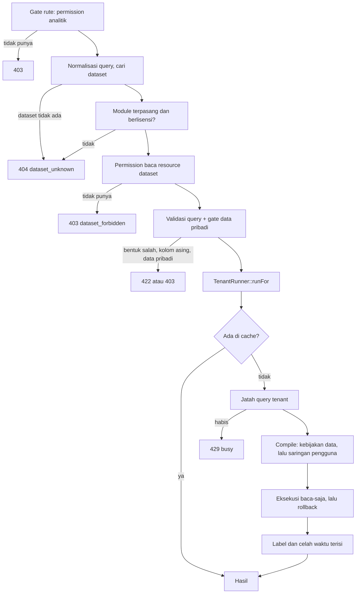

# Engine analitik

Engine analitik adalah bagian Core yang menjawab pertanyaan "berapa" atas data module — berapa aset per group, berapa nilai perolehan tahun ini, berapa jam downtime per bulan — tanpa menulis laporan baru untuk setiap pertanyaan. Module menyatakan **dataset**: tabel mana yang boleh dianalisis, kolom mana yang boleh dikelompokkan, nilai mana yang sah dijumlah, dan kolom mana yang menegakkan kebijakan datanya. Core mengubah query JSON menjadi SQL atas tabel itu dan menjalankannya baca-saja. Pengguna menyusun hasilnya menjadi **dasbor**, tanpa rilis baru.

Satu baris di `analytics_dashboards` adalah satu dasbor milik satu pengguna, satu baris di `analytics_widgets` adalah satu tile, grafik, tabel, atau teks di dasbor itu, dan satu baris di `analytics_saved_queries` adalah satu query bernama dari penjelajah. Dataset sendiri tidak tersimpan di database: ia kode di module, dibaca registry saat dibutuhkan.

Halaman ini untuk developer yang akan menyentuh kodenya: apa yang disimpan, aturan apa yang ditegakkan kode, dan kenapa. Ia menjelaskan yang **sudah dikirim**. Rencana, riset, dan keputusan `KA-xx` ada di [folder rencana engine analitik](../todo/analitik/README.md); bila rencana dan kode berbeda, kodenya yang benar.

::: info Yang sudah ada dan yang menyusul
Sudah ada di Core: kontrak dataset dan registry, model query, compiler dan eksekusi baca-saja, keamanan baca beserta rantai permission, penyimpanan dasbor dan API layarnya, layar dasbor, cache, batas beban, dan log query, serta — dari fase 2 — rumus, perbandingan periode, persen terhadap total, dan token tahun fiskal di mesin query. Module aset sudah menyatakan dataset ([daftarnya](/apps/management-aset/transaction/analitik/)).

Menyusul, dan tidak ditulis di sini sebelum kodenya ada: pembangun widget dan penjelajah ([area 8](../todo/analitik/todo-fase-1.md)), uji beban ([area 10](../todo/analitik/todo-fase-1.md)), editor rumus di pembangun, dan sisa [fase 2](../todo/analitik/todo-fase-2.md) — slicer, drill, dimensi bersama lintas module, publikasi, feed OData, embed, dan template. Bagian [Yang belum ada](#yang-belum-ada) merinci batasnya.
:::

## Konsep yang mudah tertukar

### Dataset dan laporan

Dua-duanya bernama "dataset" di kode, dan dua-duanya milik module, tetapi menjawab pertanyaan yang berbeda.

| | Dataset laporan (`ModuleReportProvider`) | Dataset analitik (`Contracts\Analytics\Dataset`) |
| --- | --- | --- |
| Pertanyaan yang dijawab | "Isi dokumen ini apa?" — satu work order, atau satu daftar | "Berapa, dikelompokkan menurut apa?" |
| Bentuk hasil | Baris dan kolom tetap, dibaca layout Word atau Excel | Kelompok dan nilai agregat, bentuknya ditentukan query |
| Siapa yang menjalankan query | Module: Core meminta, module menyaring dengan hak penggunanya dan menyerahkan baris | Core: engine menyusun SQL atas tabel module dari definisi yang dinyatakan module |
| Siapa yang tahu aturan bacanya | Kode module, di dalam query-nya sendiri | Definisi dataset: permission, dan kolom kebijakan data yang dinyatakan module |
| Mesin pemakainya | Mesin dokumen cetak dan ekspor ([dokumen cetak](23-document-rendering.md)) | Engine analitik, dasbor |

Konsekuensinya praktis. Laporan baru tidak otomatis menjadi dataset, dan dataset tidak menggantikan laporan: dasbor tidak dapat mencetak berita acara, dan laporan tidak dapat menjawab "nilai buku per group per bulan" tanpa ditulis ulang. Karena kedua jalur membaca tabel yang sama dengan aturan yang sama dari layar daftarnya, keduanya wajib memberi himpunan baris yang sama bagi pengguna yang sama. Di sisi analitik, test paritas menjaganya.

Pemisahan yang sama ada di Business Central: *report object* terdiri dari dataset dan layout yang menampilkannya ([report object](https://learn.microsoft.com/en-us/dynamics365/business-central/dev-itpro/developer/devenv-report-object)), sedangkan analitik bertumpu pada *query object* yang menyatakan kolom, agregat, dan join ([query object](https://learn.microsoft.com/en-us/dynamics365/business-central/dev-itpro/developer/devenv-query-totals-grouping)).

### Dataset, tabel, dan measure

**Dataset bukan tabel.** Satu dataset dapat memakai satu tabel, tabel dengan join, atau query sumber yang menggabungkan beberapa tabel module. Yang menjadi janji kepada widget tenant adalah **kode dataset** dan **kunci field dan measure**-nya, bukan nama tabel.

**Kolom angka bukan measure.** Hanya measure yang dinyatakan dataset yang sah dihitung. `acquisition_value` sah dijumlah; `tahun_perolehan` atau nomor urut tidak, walau tipenya angka. Business Central membolehkan `Sum`, `Average`, `Min`, dan `Max` pada kolom bertipe angka mana pun; engine ini lebih sempit dengan sengaja, karena hanya pemilik tabel yang tahu bedanya.

**`count` dan `count_distinct`.** `Count` menghitung baris (dengan field: baris yang field-nya terisi). Work order per aset dihitung `CountDistinct` pada id asetnya, bukan `Count`.

**Rujukan, dimensi bersama, dan join.** Rujukan (`reference()`) menunjuk master milik module yang sama dan labelnya datang dari join di SQL. Dimensi bersama (`shared()`) menunjuk benda milik Core atau Foundation — entitas legal, unit kerja, pengguna, vendor, mata uang — dan labelnya diterjemahkan Core sesudah agregasi. Join (`join()`) memasukkan kolom tabel lain milik module yang sama sebagai field.

### Dasbor pribadi, dasbor bersama, dan publikasi

| | Pribadi | Bersama | Publikasi |
| --- | --- | --- | --- |
| Ada di kode | Ya | Ya | Belum (fase 2, area 15) |
| Siapa yang melihat | Pemiliknya; orang lain mendapat 404 | Setiap pemegang `core.analytics.dashboard.read` di tenant | Pihak di luar CoreERP lewat klien integrasi |
| Siapa yang mengubah | Pemiliknya, bila memegang `dashboard.create` | Pemegang `core.analytics.shared-dashboard.update` | — |
| Angkanya dihitung dengan hak siapa | Yang melihat | **Yang melihat**, bukan pembuatnya | Rencananya: pembuat publikasi, dipersempit saringan terkunci |
| Nama harus unik | Per pemilik | Per tenant | — |

**Membagikan dasbor membagikan susunannya, bukan hak penyusunnya.** Widget di dasbor bersama dihitung dengan permission dataset dan hibah kebijakan data orang yang membukanya. Kepala unit A yang membuka dasbor buatan direktur melihat angka unit A saja, dan staf tanpa permission baca dataset itu melihat "tidak punya akses", bukan angka pinjaman. Tanpa aturan ini, menyusun dasbor bersama akan menjadi jalan pintas untuk meminjamkan hak. Dijaga `SharedDashboardRunsAsViewerTest`.

Publikasi belum ada kodenya. Rancangannya — bahwa ia keluar dari tenant atas nama pembuatnya dan tidak pernah membawa data pribadi — tertulis di [akses luar](../todo/analitik/akses-luar.md) dan belum berlaku.

### Permission dataset dan permission analitik

Dua pemeriksaan yang berbeda, dan keduanya harus lulus.

| | Permission analitik (KA-14) | Permission dataset (KA-15) |
| --- | --- | --- |
| Menjawab | "Boleh memakai **fitur** analitik?" — melihat dasbor, menyusun, menjalankan analisis bebas | "Boleh membaca **angka** resource ini?" |
| Kodenya | `core.analytics.*`, milik Core | Permission baca resource module yang sama dengan layar daftarnya, misalnya `management-aset.aset.read` |
| Dibuat di | Migration katalog keamanan Core | Manifest module yang sudah ada; module tidak menambah kode izin untuk analitik |
| Ditegakkan | Gate rute (`CoreSecurityCatalog::gate(...)`) | `DatasetAccess::authorize()` untuk setiap query |
| Bila gagal | 403 dari gate rute | 403 `analytics.dataset_forbidden` |

Pengguna yang memegang duty analis tetapi tidak memegang `aset.read` melihat katalog kosong untuk aset, dan query atas dataset asetnya dijawab 403. Pengguna yang memegang `aset.read` tetapi tidak memegang permission analitik tidak dapat membuka halamannya sama sekali. **Hak dataset tidak diduplikasi** ke dalam kode izin analitik, karena dua daftar yang menjawab pertanyaan yang sama pasti menyimpang: angka aset di dasbor tidak boleh lebih luas daripada daftar aset yang dapat dibuka orang yang sama.

Data pribadi punya permission ketiga, `core.analytics.personal-data.read`, yang bukan hak dataset maupun hak fitur — lihat [Hak akses](#hak-akses).

## Satu query dari awal sampai angka

Setiap jalur masuk — penjelajah, widget, dan kelak publikasi dan embed — membuat principal-nya sendiri lalu memanggil `Actions\RunQuery`. Tidak ada jalur yang dapat melewati satu langkah.



Setiap query yang sampai ke `RunQuery`, berhasil maupun ditolak, meninggalkan satu baris di `analytics_query_log`.

Pemeriksaan hak terjadi **sebelum** query dicocokkan dengan dataset (`QueryValidator`), dan cache dibaca **sesudah** keduanya. `QueryParser` yang berjalan lebih dulu hanya memeriksa bentuk — tipe nilai dan kunci query yang dikenal — dan tidak tahu dataset-nya, jadi galatnya tidak membocorkan nama kolom. Pengguna tanpa hak tidak belajar nama kolom dari pesan galat validator, dan hasil cache tidak pernah melewati pemeriksaan hak.

## Data yang disimpan

Semua tabel `analytics_*` adalah tabel tenant biasa: `tenant_id`, kolom jejak, `version`, klasifikasi data per kolom, dan trigger jejak perubahan. Mereka tinggal di database environment tenant, bukan database pusat. Migrationnya `2026_10_04_120000_create_analytics_dashboard_tables.php` dan `2026_10_04_130000_create_analytics_query_cache_and_log_tables.php`.

| Tabel | Tanggung jawab |
| --- | --- |
| `analytics_dashboards` | Satu dasbor: nama, `shared`, dan `layout` letak widget |
| `analytics_widgets` | Satu widget: `type`, query JSON, `visual`, dan `cache_ttl_seconds` |
| `analytics_saved_queries` | Query bernama dari penjelajah, dengan `code` yang unik per tenant |
| `analytics_query_cache` | Hasil query yang sudah dihitung, satu baris per kunci cache |
| `analytics_query_log` | Satu baris per query yang sampai ke engine |

Kolom yang mudah salah paham:

| Kolom | Isi |
| --- | --- |
| `analytics_widgets.dataset_code` | Kode dataset, **bukan foreign key**. Dataset hidup di kode module dan dapat hilang bersama module yang dicabut, sedangkan widget-nya tidak ikut dihapus. |
| `analytics_widgets.dataset_version` | Versi dataset saat query disimpan. Dibandingkan dengan versi sekarang untuk memetakan kunci yang diganti nama saat widget dibaca. |
| `analytics_widgets.query` | Query dalam bentuk ringkas, sama dengan badan `POST api/v1/analytics/query`: kunci yang bernilai bawaan tidak ditulis. |
| `analytics_dashboards.layout` | Hanya letak yang pernah diatur pengguna. Widget tanpa letak ditempatkan di bawah oleh `DashboardPresenter`, sehingga menambah widget tidak mengubah versi dasbor. |
| `analytics_dashboards.slicers`, `template_code`, `template_version` | Disiapkan untuk fase 2. Belum ditulis dan belum dibaca kode apa pun. |
| `analytics_saved_queries.code` | Dibuat dari nama bila tidak dikirim, unik per tenant, dan **tidak dapat diganti** sesudah dibuat, karena publikasi kelak menunjuk query dengan kode itu. |
| `analytics_query_cache.payload` | Hasil yang dikompres gzip, tipe `bytea`. Dibaca sebagai aliran, bukan teks. |
| `analytics_query_log.principal` | `membership:<id>` untuk pengguna; bentuk lain disiapkan untuk publikasi dan embed. |
| `analytics_query_log.source` | Jalur masuk (`QueryLog::SOURCE_*`), sengaja tanpa CHECK karena jalur baru akan datang di fase 2. |

Tidak ada baris dasbor, widget, atau query tersimpan yang dihapus fisik: mengarsipkan mengisi `deleted_at`, dan mengarsipkan dasbor ikut mengarsipkan widget-nya. **Pengecualiannya `analytics_query_cache`**: isinya salinan hasil hitung, bukan data bisnis, dan baris kedaluwarsa dihapus fisik saat terbaca atau saat tenant yang sama menulis cache.

## Endpoint

Rute ada di `apps/core/routes/analytics.php`, yang di-require dari grup `auth` di `routes/web.php` — bukan dari grup `api/v1`, karena berkas yang sama memuat halaman dan API. Daftar yang berlaku adalah isi berkas itu; tabel di bawah peta untuk pembaca. Path API tanpa awalan berada di `/api/v1/analytics/`.

API ini hanya dipanggil layar Core sendiri, jadi ia bukan permukaan app-ke-Core dan tidak ditulis di `contracts/internal/`. Permukaan yang dipanggil dari luar CoreERP (publikasi, feed, embed; fase 2) wajib ditulis tangan di kontrak sebelum dikirim.

| Rute | Hak | Gunanya |
| --- | --- | --- |
| `GET /analytics`, `GET /analytics/dashboards/{id}` | `dashboard.read` | Halaman Dasbor |
| `GET /analytics/explore` | `explore.invoke` | Halaman Analisis data sementara, sampai penjelajah selesai |
| `POST /api/v1/analytics/query` | `explore.invoke` | Query bebas, dijalankan sebagai pengguna yang meminta |
| `GET datasets`, `GET datasets/{code}` | `dashboard.read` | Katalog dataset, field, dan measure yang boleh dipakai pengguna ini |
| `GET/POST dashboards`, `GET/PATCH/DELETE dashboards/{id}` | `dashboard.read`; membuat juga `dashboard.create` | Dasbor; aturan berbagi diputuskan `DashboardAccess` |
| `POST dashboards/{id}/widgets`, `PATCH/DELETE widgets/{id}` | Seperti mengubah dasbornya | Widget; query diperiksa saat disimpan |
| `GET widgets/{id}/data`, `POST widgets/{id}/refresh` | Seperti melihat dasbornya, ditambah permission dataset | Hasil widget, dihitung sebagai yang melihat |
| `GET/POST saved-queries`, `GET/PATCH/DELETE saved-queries/{id}` | Seperti dasbor | Query tersimpan |

Perilaku yang perlu diketahui pemanggil:

- **Setiap perubahan membawa versi baris** (`If-Match` atau field `version`): tanpa versi 428, versi basi 409. Versi naik dua kali pada perubahan yang menulis kolom, karena `RowVersion::claim` menaikkannya sekali dan penyimpanan sekali lagi. Pakai `ETag` dari jawaban, jangan menghitung sendiri.
- **Galat simpan widget** berbentuk `{error: {code, message, field}}` dengan `field` berawalan `query.` atau `visual.`; isian dasar memakai galat validasi Laravel biasa. Kode galat engine yang lain ada di `AnalyticsQueryException` dan di `Dashboards\WidgetDefinition` (`analytics.invalid_visual`).
- **Dasbor bersama yang terlihat tetapi tidak boleh diubah dijawab 403** dengan alasannya, karena yang membukanya sudah tahu dasbor itu ada. Dasbor pribadi orang lain dan id milik tenant lain dijawab 404.
- **Rate limit** `analytics-interactive` per pengguna berlaku untuk query bebas, data widget, dan Muat ulang. Jawabannya galat analitik `analytics.rate_limited`, bukan pesan bawaan Laravel.

## Hak akses

Katalognya ditulis migration `2026_10_03_120000_register_analytics_security_catalog.php`, kode persis seperti yang disetujui pemilik produk (KA-14). Kode yang sudah masuk role tenant tidak dapat diganti diam-diam, jadi menambah atau mengganti nama kode adalah keputusan, bukan perapian. Konstanta `CoreSecurityCatalog::ANALYTICS_*` hanya ada untuk kode yang dipakai kode aplikasi.

| Duty | Isinya | Dipisah karena |
| --- | --- | --- |
| `core.analytics.inquire` | Melihat dasbor (`dashboard.read`) | Staf operasional cukup melihat dasbor |
| `core.analytics.analyze` | Menyusun dasbor pribadi dan menjalankan analisis bebas (`dashboard.create`, `explore.invoke`) | Query bebas adalah kemampuan analis |
| `core.analytics.manage` | Mengelola dasbor bersama (`shared-dashboard.update`) | Mengubah apa yang dilihat semua orang berbeda tingkatnya dari mengubah dasbor sendiri |
| `core.analytics.personal-data` | Memakai field data pribadi (`personal-data.read`) | Pemberiannya harus selalu disengaja dan tampak di daftar duty role |
| `core.analytics.publish` | Mengelola publikasi dan embed (`publication.*`) | Publikasi membawa data keluar atas nama pembuatnya. Katalognya sudah ada, **belum dipakai kode apa pun**. |

Hanya role Owner memegang duty ini otomatis, termasuk data pribadi. Role lain mendapat duty ini hanya bila admin tenant memberikannya.

## Aturan yang dijaga, dan alasannya

### Batas dengan module

**Core membaca tabel module hanya lewat dataset yang didaftarkan module, dan tidak pernah menulis nama tabel atau kolom module.** Pelanggan boleh membeli satu module saja, jadi module yang membaca module lain tidak dapat dipasang sendirian, sedangkan Core ada di setiap pemasangan — itu alasan Core diizinkan membaca (keputusan pemilik produk, 3 Oktober 2026; rumusan lengkapnya di [ownership dan data](02-module-standard.md#ownership-dan-data)). Izin itu tidak berarti Core boleh menebak: nama tabel dan kolom selalu datang dari definisi dataset. `AnalyticsBoundaryTest` membaca teks berkas di `app/Platform/Analytics` dan menolak namespace `Modules\`, awalan tabel module (dibaca dari `table_prefix` setiap `app.yaml`), dan `DB::table(` atau `DB::select…(` di luar kelas yang memang menyusun SQL. Teks komentar ikut dibaca: nama yang ditulis mati di komentar adalah nama yang akan disalin ke kode berikutnya.

**Dataset hanya memakai model module-nya sendiri.** Model, join, dan rujukan ke module lain ditolak `DatasetValidator`. Analisis lintas module nantinya lewat dimensi bersama (setiap dataset dikelompokkan menurut dimensi yang sama lalu digabung menurut nilainya), bukan join baris. Core sebenarnya boleh membaca keduanya; yang tidak ada adalah pihak yang berhak menyatakan join itu — kelas module A yang menyebut model module B melanggar batas module, dan Core yang menyatakannya berarti menulis nama module di Core.

**Dataset dinyatakan, bukan ditebak.** Tiga hal yang hanya diketahui pemilik tabel: kolom angka mana yang sah dijumlah, kolom mana yang menegakkan kebijakan data, dan kolom mana yang menyimpan mata uang. Contoh nyatanya: aset dibatasi menurut `responsible_org_unit_id`, bukan `financial_dimension_org_unit_id`, walau keduanya menunjuk unit kerja. Salah pilih kolom berarti kepala unit melihat aset unit lain, tanpa galat apa pun. Test paritas module menjaganya.

**Dataset yang rusak dilewati di runtime dan ditolak di CI.** Di runtime `DatasetRegistry` melewati dataset yang tidak lolos validasi dengan satu `Log::warning` per proses, supaya satu dataset salah tidak menjatuhkan aplikasi. Di CI, `AnalyticsDatasetsBoundaryTest` dan `php artisan analytics:datasets` gagal untuk dataset yang sama. Definisi dibaca sekali per proses, tetapi hasil kompilasinya disimpan **per database**, karena satu proses — terutama pekerja FrankenPHP — melayani beberapa database environment, dan kolom satu database belum tentu sama dengan yang lain. Dataset yang tabelnya belum ada di database itu tidak disimpan: module yang dipasang sesudahnya di proses yang sama langsung terbaca.

### Tenant dan jangkauan baris

**Query dijalankan di dalam `TenantRunner::runFor()`.** Model module menyaring tenant lewat `TenantScope`, yang gagal tertutup (fail closed) bila tenant belum terikat, dan rute Core tidak melewati middleware konteks module yang biasanya mengikatnya. Tanpa `runFor()`, query atas model module tidak menemukan apa pun.

**Tabel dasar tidak pernah diberi alias.** `TenantScope` disisipkan dengan nama tabel sebenarnya; tabel beralias membuat saringan tenant menunjuk nama yang tidak ada di query itu. Dataset bersumber query (`fromQuery()`) wajib memilih `tenant_id`, dan Core menyaring tenant sekali lagi di query luarnya, karena subquery tidak membawa scope ke luar. Sumber query yang melepas scope tenant ditolak validator.

**Urutan jangkauan: tenant, lalu kebijakan data, lalu saringan terkunci, lalu saringan pengguna.** Setiap langkah sesudahnya hanya dapat menyempitkan. `DataPolicyScope` memasang kebijakan lewat `DataPolicyFilter` — aturan yang sama dengan layar module — pada kolom yang dinyatakan dataset. Tanpa hibah, hasilnya nol baris; tidak pernah semua.

**Saringan terkunci yang kosong berarti nol baris.** `FieldFilterExpression` membaca nilai kosong sebagai "tanpa saringan", jadi daftar nilai `[]` yang tidak dijaga akan diam-diam melepas saringannya. Hal yang sama berlaku untuk saringan terkunci yang menyebut field yang tidak lagi dikenal dataset. Saringan terkunci belum dipakai pengguna biasa (principal pengguna selalu mengembalikan kosong); ia disiapkan untuk publikasi dan embed.

**Saringan pada kolom yang tidak dikenal ditolak, bukan diabaikan.** Saringan yang diabaikan memulangkan angka yang lebih besar dari yang diminta, tanpa tanda apa pun. Prinsip yang sama berlaku untuk bagian query yang tidak dikenal: ia ditolak dengan path-nya, bukan dilewati.

**Hak membaca diperiksa sebelum query dicocokkan dengan dataset.** Pengguna tanpa hak tidak boleh belajar nama kolom dari pesan galat. Module yang tidak terpasang atau tidak berlisensi dijawab 404 seperti dataset yang tidak ada; tanpa permission baca dijawab 403. Pemasangan dibaca dari catatan `core_module_installations` lewat `LaunchableAppCatalog::readyModules()`, tidak dari entitlement.

### Data pribadi

**Field `EndUserIdentifiableInformation` tertutup bawaan dan dibuka per permission.** Yang dijaga bukan hanya kolom yang tampil: menyaring `nama_pasien = 'Budi'` lalu membaca jumlahnya sama dengan membaca datanya. `PersonalDataGate` karena itu menolak field tertutup sebagai pengelompok, saringan, kolom rentang waktu, dan bahan measure — termasuk saringan tetap measure, karena `max(nama_pasien)` memulangkan nama. Urutan terjaga sendiri karena `sort` hanya boleh memakai kunci yang sudah dipilih. Katalog menyembunyikan field dan measure yang sama, jadi layar tidak menawarkan yang akan ditolak. Klasifikasi dibaca dari klasifikasi kolom model; gate tidak membuat klasifikasi sendiri, dan kolom `AccountData` ditolak `DatasetValidator` sejak definisi.

**Id pengguna dan pekerja tetap boleh dikelompokkan; nama di baliknya tidak.** `EndUserPseudonymousIdentifiers` boleh sebagai pengelompok, tetapi label nama orang disembunyikan `SharedDimensionRegistry::labels()` bagi principal tanpa hak data pribadi. Label vendor ikut berkelas data pribadi karena nama party di buku alamat dapat berupa orang.

**Celah yang tercatat.** Kolom bahan `min` atau `max` yang bukan field dataset tidak punya klasifikasi di `CompiledDataset`, jadi gate tidak dapat memeriksanya. Sekarang tidak ada dataset yang memakainya. Penutupnya aturan `DatasetValidator` yang belum ditulis: kolom bahan harus field dataset.

### Query dan SQL

**Setiap query berjalan baca-saja, dibatasi waktu, dan dibatasi baris — dan transaksinya di-rollback, tidak di-commit.** Baca-saja (`SET TRANSACTION READ ONLY`) ditegakkan database, bukan compiler: PostgreSQL menolak `INSERT`, `UPDATE`, `DELETE`, dan perintah `CREATE`, `ALTER`, `DROP` di transaksi seperti itu ([dokumentasi](https://www.postgresql.org/docs/current/sql-set-transaction.html)), sehingga compiler yang salah pun tidak dapat menulis. Batas waktunya `SET LOCAL statement_timeout` ([dokumentasi](https://www.postgresql.org/docs/current/runtime-config-client.html)). Hasil dibatasi `LIMIT n + 1`; baris terakhir hanya penanda bahwa hasil terpotong. Akhir transaksinya `ROLLBACK` karena engine sering dipanggil di dalam transaksi lain (test, job): Laravel membuka savepoint, rollback ke savepoint membatalkan `READ ONLY` dan batas waktu tadi, sedangkan commit ke savepoint membiarkan keduanya berlaku sampai transaksi luar selesai dan `INSERT` berikutnya gagal. Dijaga `WalkingSkeletonTest::test_executor_rolls_back_to_its_savepoint_so_the_callers_transaction_can_still_write`.

**Uang tidak pernah dijumlah lintas mata uang, dan kuantitas tidak pernah dijumlah lintas satuan.** Compiler menambahkan kolom mata uang atau satuan measure sebagai dimensi tersirat, dan total dikelompokkan menurut kolom yang sama. `DatasetValidator` menolak measure uang yang tidak menyebut kolom mata uangnya, dan measure kuantitas tanpa kolom satuan. Itu sebabnya polis asuransi belum punya measure uang: tabelnya tidak menyimpan mata uang (KA-22).

**Waktu dihitung menurut zona pengguna.** Pengelompokan menurut waktu (time bucket) dan token rentang relatif seperti `@this_month` memakai zona pengguna dari `UserClock`, bukan zona server. Pukul 23.30 di Jakarta pada 31 Desember sudah 1 Januari di Makassar, jadi "tahun ini" bagi keduanya berbeda pada saat yang sama. Zona ditulis sebagai literal yang dicocokkan dengan `DateTimeZone::listIdentifiers()`. Kolom `timestamp` dianggap UTC (kebiasaan repo), `timestamptz` dikonversi langsung, dan `date` tidak punya zona. `to_char()` pada `timestamptz` tidak dipakai karena ia memakai zona sesi database. Minggu dimulai hari Senin, ditulis eksplisit supaya tidak bergantung pada locale.

**Tidak ada SQL mentah yang disusun dari nama kolom.** Larastan menuntut `literal-string` pada `selectRaw`, `orderByRaw`, dan `groupByRaw`, jadi nama kolom dari definisi dataset tidak dapat disambung ke string. Kolom dipilih lewat `addSelect()`, `groupBy()`, dan `orderBy()`, dan agregat lewat objek `Expression` yang disusun grammar (`MeasureExpression`, `TimeBucketExpression`, `IsNullExpression`). Nama kolom juga sudah diperiksa registry sebagai pengenal (huruf kecil, angka, garis bawah). Nilai saringan hanya lewat binding.

**Pengelompokan dan pengurutan memakai alias, bukan ekspresi.** Alias `d0…` untuk dimensi, `c0…` untuk mata uang dan satuan tersirat, `m0…` untuk measure. Ekspresi berparameter yang diulang di `GROUP BY` menjadi parameter lain bagi PostgreSQL, dan pengelompokannya ditolak. Alias join `d0`, `m0`, dan sejenisnya karena itu dilarang untuk module.

**Setiap join adalah `LEFT JOIN` dan hanya dipasang bila query menyebut kolomnya.** Menambah satu pengelompok tidak boleh mengubah jumlah baris. Join data membawa `tenant_id` yang sama dan `deleted_at IS NULL`; join label tetap menyertakan baris terarsip, supaya aset yang group-nya sudah diarsipkan tetap bernama.

**Hasil kosong di akhir pada urutan turun.** `orderBy()` tidak menerima `nulls last`, dan alias tidak dapat dipakai di dalam ekspresi `ORDER BY`, jadi kolom yang dapat kosong didahului kunci `(<ekspresi>) is null`. Tanpa itu, kelompok tanpa nilai muncul paling atas pada "terbesar dulu".

**Celah deret waktu diisi, kecuali mengisinya akan berbohong.** Bulan tanpa baris tetap tampil: nol untuk `count` dan `sum`, kosong untuk `avg`, `min`, dan `max` — rata-rata dari nol baris bukan nol. `GapFiller` tidak mengisi bila hasil terpotong (periode yang hilang mungkin terpotong, bukan kosong), bila urutan pertama bukan periodenya, atau bila isiannya melebihi batas titik atau baris.

**Desimal keluar sebagai string.** Jumlah baris dikirim sebagai angka; uang dan desimal sebagai string, karena `numeric` PostgreSQL lebih presisi daripada angka JavaScript. Layar memformatnya lewat `resources/js/lib/analytics/format.ts`, bukan menghitungnya.

### Rumus, perbandingan periode, dan persen terhadap total

Tiga bagian query fase 2 (area 13). Bentuk JSON-nya di [mesin query](../todo/analitik/mesin-query.md#bahasa-rumus) dan di skema `resources/schemas/analytics-query.schema.json`.

**Rumus adalah bahasa kecil sendiri yang dikompilasi ke SQL, bukan DAX dan bukan SQL dari pengguna (KA-19).** `Query\Formula\Parser` membaca teks rumus menjadi pohon simpul dengan daftar fungsi tertutup — `BAGI`, `JIKA`, `ABS`, `BULAT`, `MIN`, `MAKS` — dan menolak apa pun di luarnya **di karakter tempatnya**, sebelum ada SQL: fungsi asing, kurung tanpa pasangan, titik koma di luar fungsi, perbandingan di luar `JIKA`. `[count]); drop table x; --` berhenti di karakter 8. `FormulaExpression` menyusun SQL dari pohon itu saja: angka menjadi binding `cast(? as numeric)`, measure menjadi ekspresi agregatnya, dan tanda hitung dipetakan dari daftar tetap. Galatnya 422 `analytics.invalid_formula` dengan `field` (`formulas.0.expression`) dan `position`, supaya editor dapat menandai tempatnya.

**Angka ditulis cara Indonesia, seperti filter tambahan K-30.** `1.000,5` adalah seribu koma lima; isian fungsi karena itu dipisah titik koma, `BAGI([a]; [b])`.

**Bagi nol tidak pernah menjadi galat.** `a / b` kosong bila `b` nol, `BAGI(a; b)` nol, `BAGI(a; b; c)` bernilai `c`. Setiap measure di dalam rumus dibulatkan ke `numeric`, jadi `[a] / [count]` tidak menjadi pembagian bilangan bulat.

**Rumus dihitung di atas agregat, di SQL yang sama.** Ia dipilih lewat `measures` seperti measure dataset, jadi `sort` dan `limit` dapat memakainya, dan total menghitung rumus atas total — rasio jumlah, bukan jumlah rasio. Rumus tidak boleh memakai rumus lain, dan hanya measure yang hasilnya angka boleh dirujuk: terkecil atau terbesar atas tanggal ditolak.

**Rumus mewarisi mata uang measure di dalamnya (KA-22).** Kolom mata uang dan satuan measure yang dirujuk ikut dikelompokkan walau measure-nya sendiri tidak dipilih. Rumus yang mencampur dua kolom mata uang, atau dua kolom satuan, ditolak; uang dibagi hitungan boleh. Format `money` dan `quantity` butuh measure uang atau kuantitas di dalam rumusnya, dan kolom hasilnya membawa `currency_key` atau `unit_key` measure itu.

**Perbandingan periode menjalankan langkah filter dan pengelompokan dua kali, lalu menggabungkan keduanya di SQL.** `Comparison` menghitung rentang pembanding menurut zona principal: `previous_year` mundur dua belas bulan; `previous_period` memakai langkah token — bulan ini dengan bulan lalu, awal bulan sampai hari ini dengan tanggal yang sama bulan lalu — dan untuk rentang tertulis, sebanyak bulan penuhnya atau harinya. Rentang bulan penuh tetap bulan penuh, jadi Februari kabisat terbaca sampai tanggal 29. Ember waktu query pembanding digeser maju sebanyak pergeserannya (`TimeBucketExpression`), sehingga Oktober tahun lalu jatuh di ember Oktober tahun ini. Kedua sisi disatukan dengan `UNION ALL` lalu `GROUP BY` semua dimensi — sama dengan gabungan luar penuh dengan kosong bertemu kosong; `FULL JOIN … IS NOT DISTINCT FROM` ditolak PostgreSQL. Kelompok yang hanya ada di periode lalu tetap muncul dengan nilai sekarang nol, dan bulan yang kosong di kedua periode diisi `GapFiller`.

**Setiap measure mendapat tiga kolom turunan**: `<kunci>__previous`, `<kunci>__change`, dan `<kunci>__change_pct`, ditandai `derived_from` dan `derivation` di kolom hasil. Persen perubahan memakai nilai mutlak pembanding sebagai penyebut, dan kosong bila pembandingnya nol — bukan tak hingga. Perbandingan butuh rentang waktu yang jelas awal dan akhirnya, dan kolom tanggal yang dikelompokkan harus memakai ukuran waktu.

**Persen terhadap total (`percent_of_total`) dihitung sebelum `LIMIT`, per mata uang.** `nilai / sum(nilai) over (partition by <mata uang>)`: top-10 tetap menunjukkan bagian dari seluruh kelompok, dan persen nilai rupiah tidak dicampur dengan dolar. Kolomnya `<kunci>__percent_of_total`.

**Token tahun fiskal dihitung lewat `FiscalCalendarDirectory`, untuk tepat satu perusahaan.** `@this_fiscal_year` dan `@last_fiscal_year` memakai perusahaan dari saringan (tepat satu nilai pada field entitas legal, termasuk saringan terkunci), atau perusahaan workspace pengguna (`UserPrincipal::workspaceLegalEntity()`). Tanpa perusahaan, dengan dua perusahaan, dengan perusahaan tenant lain, atau dengan kalender yang belum mencakup hari ini, token ditolak dengan pesan — tidak diam-diam menjadi tahun kalender. `FiscalYearRange` berjalan di dalam `runFor()` sebelum kunci cache dihitung, dan rentang hasilnya ikut di bentuk normal query, sehingga dua perusahaan dengan tahun fiskal berbeda tidak berbagi hasil cache.

**Kunci cache membedakan semuanya.** Rumus (kunci, nama, teks, format), perbandingan, dan persen terhadap total ikut di `AnalyticsQuery::normalized()` hanya bila diisi, jadi hash query lama tidak berubah. Urutan daftar rumus dan persen tidak mengubah kunci.

### Cache dan batas beban

**Cache tinggal di tabel database tenant, bukan di cache store Laravel.** `EnvironmentConnection::pins()` mengarahkan cache store ke database pusat, dan angka tenant yang punya database sendiri tidak boleh tersalin ke sana (KA-18). Kunci stampede dan jatah query boleh di store kunci pusat karena namanya hanya memuat id tenant dan hash, tidak pernah data.

**Kunci cache memuat semua yang menentukan isi hasil.** Tenant, kode dan hash definisi dataset, query dalam bentuk normal, `ScopeFingerprint` principal, zona waktu, tanggal hari ini, dan batas baris. Dua pengguna dengan hibah yang sama berbagi hasil; hibah berbeda tidak pernah. Tanggal hari ini ikut karena `@this_month` berubah arti setiap hari, dan batas baris ikut karena hasil terpotong berbeda per batas. `ScopeFingerprint` sengaja hanya mengurutkan hibah dan tidak menggabungkannya: aturan penggabungan yang keliru sekali saja membuat dua jangkauan berbeda berbagi cache, sedangkan kehilangan sedikit pembagian cache jauh lebih murah. Dijaga `AnalyticsCacheIsolationTest`.

**TTL adalah umur terlama yang diterima pembaca.** Pembaca tidak menerima hasil yang lebih tua dari TTL-nya sendiri walau baris itu ditulis pemanggil ber-TTL lebih panjang. Ada batas bawah TTL (`QueryCache::MIN_TTL_SECONDS`), dan `0` berarti tanpa cache. Muat ulang menghitung ulang tanpa membaca cache lalu menimpa hasilnya. Hasil yang setelah dikompres melebihi `analytics.cache.max_payload_kb` tidak disimpan.

**Cache stampede dicegah dengan kunci per kunci cache.** Pemanggil kedua menunggu sambil membaca ulang cache, lalu memakai hasil pemanggil pertama; sesudah batas waktu ia menghitung sendiri, karena perhitungan pemanggil pertama mungkin sudah gagal.

**Jumlah query yang dihitung bersamaan per tenant dibatasi.** Server on-prem menjalankan Core dengan jumlah proses PHP terbatas; beberapa query yang masing-masing sah berjalan bisa menahan semuanya, dan layar transaksi menunggu. `QuerySlots` memberi jatah bernomor di store kunci Laravel; jatah habis dijawab 429 `analytics.busy` dengan `Retry-After`. Hasil dari cache tidak memakai jatah. Setiap jatah punya **masa berlaku** — dua kali batas waktu query ditambah beberapa detik, karena satu query menjalankan dua pernyataan (hasil dan total) yang masing-masing dibatasi `statement_timeout` — supaya proses yang mati keras tidak mengurangi jatah tenant itu selamanya. Dijaga `QueryLimitsTest`.

**Batas bentuk query dan batas widget diperiksa sebelum ada SQL.** Jumlah pengelompok, measure, saringan, dan kunci urutan per query, serta jumlah widget per dasbor, dibaca dari `config/analytics.php`. Melewatinya dijawab 422 `analytics.limit_exceeded`.

### Log query

**Setiap query dicatat, termasuk yang ditolak, dan nilai saringan yang berisiko disamarkan.** Penolakan itulah yang dicari saat menelusuri akses. Log dibaca operator yang belum tentu berhak atas data itu, jadi nilai saringan pada field yang klasifikasinya bukan isi bisnis biasa (data pribadi, id orang, data akun), pada field yang tidak dikenal dataset, dan seluruh nilai bila datasetnya tidak dikenal — tanpa klasifikasi, gagal tertutup — diganti `[disamarkan]`. Rentang waktu pada field data pribadi, seperti tanggal lahir, disamarkan sama. `query_hash` dihitung dari bentuk yang sudah disamarkan: hash bentuk asli dapat ditebak ulang dari bentuk tersamar dengan mencoba nama satu per satu. Dijaga `QueryLogTest`.

Retensi lewat kebijakan `analytics_query_log` di `RetentionPolicies`, bawaannya dari `analytics.log.retention_days`, dan admin tenant mengubahnya di Pengaturan → Retensi data. Log bukan jejak audit perubahan; perubahan dasbor tercatat trigger `log_change` seperti tabel tenant lain.

### Dasbor dan widget

**Id di URL hanya dicari di tenant aktif, lewat satu penangkal: route binding.** `BindsWithinActiveTenant` membuat id dasbor, widget, atau query tersimpan milik tenant lain menjadi 404 sebelum controller berjalan, sehingga keberadaannya tidak bocor lewat 403. `DashboardAccess` sengaja tidak membandingkan tenant lagi, supaya penangkalnya tinggal satu dan `AnalyticsTenantIsolationTest` dapat membuktikannya merah bila dilepas. Test itu membaca daftar rute ber-id dari router, jadi rute baru tanpa baris di test-nya gagal.

**Widget diperiksa saat disimpan, terhadap dataset saat ini dan hak penyimpannya.** Query lewat parser, normalisasi, dataset terpasang dan boleh dibaca penyimpan, lalu validator dengan gate data pribadinya; `visual` lewat aturan per jenis widget (`Dashboards\WidgetDefinition`). Bagian `visual` yang tidak dikenal ditolak, bukan diabaikan. Hak penyimpan **tidak ikut tersimpan**: saat widget dibuka, hak yang melihatlah yang berlaku. Mengganti judul atau masa simpan tidak memeriksa ulang query, supaya widget lama yang kolomnya sudah hilang tetap dapat diganti nama atau diarsipkan.

**Widget yang kolomnya hilang rusak terang, tidak salah diam-diam.** `StoredQuery::read()` memetakan kunci yang diganti nama lewat `renamed()` dataset; kunci yang sudah tidak ada menjadikan status widget `field_removed` beserta nama kolomnya, dan data widget dijawab 422 `analytics.field_removed`, bukan 500. Kolom tidak pernah dibuang diam-diam dari query lama, karena angka tanpa satu saringan lebih besar dari yang diminta penyusunnya. Dasbor juga menyebut `dataset_unavailable` untuk dataset yang tidak terdaftar atau module-nya tidak terpasang.

**Setiap perubahan memakai versi baris, dan jumlah widget per dasbor dihitung di bawah kunci baris dasbor.** Dua penambahan bersamaan tidak boleh sama-sama lolos dari batas widget.

**Teks widget bukan HTML dan bukan Markdown.** Widget teks menyimpan teks biasa, dan React meng-escape-nya. Tooltip grafik tidak memakai `dangerouslySetInnerHTML`.

**Letak widget dibatasi.** `layout` hanya menerima widget milik dasbor itu, masing-masing sekali, dan tidak melewati grid 12 kolom (`DashboardController::WIDTHS` dan `MAX_HEIGHT`). Kelas Tailwind lebar dipetakan dari tabel lengkap, tidak disusun dari string (`col-span-${w}`), karena Tailwind tidak melihat kelas yang disusun saat jalan.

## Menyatakan dataset di module

Contoh yang berjalan ada di `modules/apperp/management-aset/src/Analytics/AssetRegisterDataset.php`; yang bersumber query ada di `DepreciationEntriesDataset.php`.

1. **Baca controller daftar resource-nya dulu.** Permission yang dicek dan cara ia memanggil `OrganizationScope` (`asetQuery`, `query` dengan kolom tertentu, atau `legalEntityQuery`) menentukan `permission()` dan `dataPolicy()`. Jangan menebak kolom kebijakan dari namanya.
2. **Tulis satu kelas** di `modules/<penerbit>/<module>/src/Analytics/` yang mengimplementasikan `Contracts\Analytics\Dataset`: `moduleId()` dan `definition()`. Definisinya hanya mengumpulkan pernyataan lewat `DatasetDefinition`; ia tidak boleh membaca database, sesi, atau konteks permintaan, karena definisi sama untuk setiap tenant dan pengguna.
3. **Daftarkan di `ModuleServiceProvider::boot()`**, di samping pendaftaran laporan: `Datasets::register()`. `Datasets` diikat singleton di `CoreServices::SINGLETON_BINDINGS`; diikat biasa, setiap pendaftaran masuk ke salinan yang langsung dibuang dan Core melihat daftar kosong tanpa satu pun galat.
4. **Tulis test** di `tests/Feature/Analytics/<Nama>DatasetTest.php` dengan trait `ProbesAssetDatasets` dan `ChecksMoneyPerCurrency` sebagai contoh: isolasi tenant, paritas kebijakan data terhadap endpoint daftar module, penolakan tanpa permission baca, dan uang per mata uang. Lihat setiap test merah sekali dengan merusak penangkalnya, terutama paritas: ganti kolom kebijakan dataset dengan kolom yang mirip dan test harus gagal.
5. **Jalankan** `php artisan analytics:datasets` dan `tests/Feature/Boundary`. Tidak ada perubahan manifest, katalog, atau migration yang dibutuhkan: hak baca memakai permission resource yang sudah ada (KA-15), dan validator membaca permission dan kebijakan data dari manifest gabungan module, bukan dari database.

Bagian utama `DatasetDefinition` (daftar lengkapnya di `apps/core/app/Platform/Modules/Contracts/Analytics/DatasetDefinition.php`):

| Method | Gunanya |
| --- | --- |
| `model()` atau `fromQuery()` | Sumber: model ber-`BelongsToTenant`, atau query Eloquent untuk bentuk yang tidak dapat dinyatakan sebagai tabel ditambah join. Tepat satu. |
| `permission()` | Permission baca resource yang sudah ada di manifest module, dengan access `read`. |
| `dataPolicy()` | Kode kebijakan dan kolom legal entity dan unit kerja yang menegakkannya. Wajib bila permission itu dilindungi kebijakan di manifest. |
| `fieldsFromModel()` | Seluruh katalog filter tambahan K-30 model dasar menjadi field, dengan `only` dan `except`. Nama tampilan dan pilihan tidak ditulis ulang. |
| `field()` | Field yang tidak ada di katalog model; wajib untuk dataset bersumber query, dengan klasifikasinya. |
| `reference()`, `shared()`, `join()` | Rujukan ke master module, dimensi bersama, dan tabel lain milik module yang sama. |
| `measure()` | Nilai yang sah dihitung: agregat, field, format, kolom mata uang atau satuan, dan saringan tetap `where`. |
| `time()` | Field tanggal untuk rentang dan pengelompokan; boleh lebih dari satu, satu bisa `default`. |
| `version()` | Naikkan saat kunci field atau measure dihapus atau diganti; `renamed` memetakan kunci lama ke baru. |

Memilih `fromQuery()` hanya bila memang perlu — misalnya karena mata uang atau unit ada di tabel lain, atau nilai harus dihitung dari beberapa kolom. Query sumbernya disusun dari `SourceQuery::from(Model::class)` di module aset, bukan `Model::query()`: kontrak meminta `Builder<Model>`, dan analisa tipe menolak `Builder<ModelKonkret>` karena parameter template `Builder` tidak kovarian. Hasilnya sama, scope tenant dan penanda arsip model tetap terpasang.

Mengubah dataset yang sudah dipakai widget tenant:

| Perubahan | Cara | Akibat bagi widget tenant |
| --- | --- | --- |
| Menambah field atau measure | Langsung | Tidak ada |
| Mengganti nama tampilan | Langsung (caption bukan kunci) | Judul berubah, widget tetap |
| Mengganti kunci | `version(n+1, renamed: ['lama' => 'baru'])` | Widget dipetakan otomatis saat dibaca |
| Menghapus field atau measure | `version(n+1)` tanpa peta | Widget yang memakainya menampilkan kolom itu sudah tidak tersedia |
| Mengganti kolom kebijakan | Langsung, beserta test paritas | Jangkauan baris berubah seperti layar module |
| Menghapus dataset | Hapus pendaftarannya | Widget menampilkan data tidak tersedia |

Aturan definisi dijalankan `DatasetValidator` (`apps/core/app/Platform/Analytics/Datasets/DatasetValidator.php`); pesan galatnya menyebut aturan yang dilanggar, dan `analytics:datasets` menampilkannya. Tabel aturan beserta alasannya ada di [model semantik](../todo/analitik/model-semantik.md#yang-diperiksa-datasetvalidator).

## Perintah

Dari `apps/core`.

```bash
php artisan analytics:datasets
```

Daftar dataset per module, versi, jumlah field dan measure, dan hasil pemeriksaan. Dataset rusak tampil beserta sebabnya, dan perintahnya keluar dengan kode gagal, sehingga dapat dipakai di CI. Pertanyaan pertama saat dataset "tidak muncul": jalankan ini.

```bash
php artisan analytics:explain --query='<json>' --tenant=<id tenant> --user=<email>
```

SQL hasil compile (dan SQL total bila diminta) beserta `EXPLAIN` tanpa `ANALYZE`, untuk melihat indeks yang dipakai dan bentuk join tanpa membaca data. Query disusun **sebagai pengguna yang disebut** — hak, hibah kebijakan data, dan zona waktunya — lewat langkah yang sama dengan `RunQuery`, jadi SQL-nya sama dengan yang dijalankan untuk orang itu. `--query` memakai bentuk yang sama dengan badan `POST /api/v1/analytics/query`. Perintah ini belum menerima widget; untuk menjelaskan query widget, salin isi `query` widget dari dasbornya.

Test terarah (satu berkas atau folder memakai phpunit langsung; suite penuh memakai `composer test:fast`, lihat aturan repo):

```bash
php -d memory_limit=1G vendor/phpunit/phpunit/phpunit tests/Feature/Platform/Analytics
php -d memory_limit=1G vendor/phpunit/phpunit/phpunit tests/Unit/Platform/Analytics
php -d memory_limit=1G vendor/phpunit/phpunit/phpunit tests/Feature/Boundary
```

## Konfigurasi

Semua kunci ada di `apps/core/config/analytics.php`, dengan variabel env berawalan `COREERP_ANALYTICS_`. Nilai bawaan disetel untuk on-prem satu container; menaikkannya keputusan operator, bukan bawaan, jadi angkanya tidak disalin ke halaman ini.

| Kelompok kunci | Yang diatur |
| --- | --- |
| `timeouts.*` | `statement_timeout` query dari layar |
| `limits.rows_interactive` | Batas baris hasil, sekaligus batas tertinggi `limit` query |
| `limits.dimensions`, `measures`, `filters`, `sort`, `formulas` | Batas bentuk query; panjang (500 karakter) dan kedalaman (20 tingkat) satu rumus bagian dari bahasanya, bukan setelan |
| `limits.widgets_per_dashboard` | Widget per dasbor |
| `limits.concurrent_per_tenant` | Query yang dihitung bersamaan per tenant |
| `cache.*` | TTL bawaan dan ukuran hasil terbesar yang disimpan |
| `rate_limits.*` | Permintaan analisis per pengguna per menit |
| `log.retention_days` | Retensi bawaan log query |

## Yang datang dari tempat lain

Engine memakai ulang, dan tidak membuat ulang:

| Yang dipakai | Dipakai untuk |
| --- | --- |
| `FieldFilterExpression` (sintaks filter tambahan K-30 yang sama dengan layar laporan) | Saringan pengguna dan rentang waktu |
| `DataPolicyFilter` dan `DataPolicyAccessResolver` | Kebijakan data dan hibah principal |
| `LaunchableAppCatalog` | Module terpasang dan berlisensi, serta permission module |
| `TenantRunner` | Mengikat tenant untuk model module |
| `UserClock` | Zona waktu pengguna |
| `FiscalCalendarDirectory`, `CurrentWorkspace` | Rentang token tahun fiskal dan perusahaan workspace |
| `RowVersion` | Versi baris pada dasbor, widget, dan query tersimpan |
| `RetentionPolicies` | Retensi log query |
| `CoreSecurityCatalog` | Gate rute |
| Klasifikasi data per kolom (`DataClass`) | Gate data pribadi |
| `@apperp/ui/chart` | Grafik di layar dasbor |

## Di mana kodenya

| Berkas | Isinya |
| --- | --- |
| `apps/core/app/Platform/Modules/Contracts/Analytics/` | Kontrak yang dipenuhi module: `Dataset`, `Datasets`, `DatasetDefinition`, `Aggregate`, `MeasureFormat`, `SharedDimension` dan resolvernya |
| `apps/core/app/Platform/Modules/Contracts/DataPolicyFilter.php` | Aturan kebijakan data yang dipakai bersama module dan engine |
| `app/Platform/Analytics/Datasets/` | `DatasetRegistry`, `DatasetValidator`, `CompiledDataset`, `DatasetCatalog`, `SharedDimensionRegistry` |
| `app/Platform/Analytics/Query/` | Parser, normalizer, validator, `RelativeRange`, compiler, `JoinPlanner`, ekspresi SQL, `QueryExecutor`, `ResultSet`, `LabelResolver`, `GapFiller`, `AnalyticsQueryException`, `Comparison`, `FiscalYearRange` |
| `app/Platform/Analytics/Query/Formula/` | Bahasa rumus: `Lexer`, `Parser`, simpul pohon (`Node/`), `Formula`, dan `FormulaExpression` yang menyusun SQL-nya |
| `app/Platform/Analytics/Actions/RunQuery.php` | Satu query dari ujung ke ujung, tempat cache, jatah, dan log menumpang |
| `app/Platform/Analytics/Security/` | `AnalyticsPrincipal`, `UserPrincipal`, `DatasetAccess`, `DataPolicyScope`, `PersonalDataGate`, `ScopeFingerprint` |
| `app/Platform/Analytics/Cache/QueryCache.php`, `Support/QuerySlots.php`, `Support/QueryLog.php` | Cache hasil, jatah query bersamaan, log tersamar |
| `app/Platform/Analytics/Dashboards/` | `DashboardAccess`, `StoredQuery`, `WidgetDefinition` |
| `app/Platform/Analytics/Models/`, `Http/` | Model tabel `analytics_*`, controller, dan `DashboardPresenter` |
| `app/Platform/Analytics/Console/` | `analytics:datasets`, `analytics:explain` |
| `apps/core/routes/analytics.php`, `config/analytics.php` | Rute dan konfigurasi |
| `apps/core/resources/schemas/analytics-query.schema.json` | Bentuk query sebagai skema JSON; satu test menjaganya sama dengan parser |
| `apps/core/resources/js/pages/platform/analytics/`, `components/analytics/`, `lib/analytics/` | Layar dasbor, komponen widget, dan pembantu |
| `modules/apperp/management-aset/src/Analytics/` | Dataset module aset |
| `apps/core/tests/Fixtures/modules/apperp/contoh-a/` | Dataset bahan uji engine, supaya test engine tidak bergantung pada module produk |

## Test penjaga

| Test | Menjaga |
| --- | --- |
| `AnalyticsBoundaryTest` | Engine tidak menyebut namespace atau tabel module, dan tidak membaca lewat `DB::table(` di luar kelas penyusun SQL |
| `AnalyticsDatasetsBoundaryTest` | Setiap dataset terdaftar lolos validator terhadap database |
| `DatasetValidatorTest`, `DatasetRegistryTest` | Setiap aturan definisi menolak definisi rusak; registry melewati yang rusak tanpa menjatuhkan aplikasi |
| `QueryShapeSyncTest` | Kunci query di skema JSON, parser, tipe TypeScript, dan daftar token sama |
| `WalkingSkeletonTest` | Dua tenant tidak bercampur, permission, kebijakan data sama dengan daftar module, uang per mata uang, rollback ke savepoint, rentang waktu menurut zona |
| `PersonalDataGateTest` | Field data pribadi ditolak sebagai pengelompok, saringan, urutan, dan bahan measure |
| `AnalyticsTenantIsolationTest` | Setiap endpoint ber-id menjawab 404 untuk tenant lain |
| `SharedDashboardRunsAsViewerTest` | Widget dasbor bersama dihitung dengan hak yang melihat |
| `AnalyticsCacheIsolationTest`, `QueryCacheTest` | Kunci cache berubah oleh tiap komponennya; tenant dan jangkauan berbeda tidak berbagi hasil |
| `QueryLimitsTest`, `QueryLogTest` | Jatah query dan rate limit; log mencatat penolakan dan menyamarkan nilai |
| `DashboardApiTest` | Versi baris, aturan berbagi, validasi widget, kunci yang diganti nama, dan halaman Inertia yang merah bila berkas komponennya hilang |
| `FormulaTest`, `FormulaValidationTest` | Rumus ditolak di posisinya (termasuk sisipan SQL), angka sebagai binding, mata uang tidak tercampur, measure bukan angka ditolak, kunci cache membedakan rumus, perbandingan, persen, dan tahun fiskal |
| `ComparisonTest` | Rentang pembanding per token, batas tahun, tahun kabisat, rentang tertulis, zona principal |
| `FormulaAndComparisonTest` | Angka rumus sampai database, bagi nol, top-N atas rumus, persen per mata uang, perbandingan dengan kelompok periode lalu, bulan kosong, total |
| `FiscalYearAndStoredFormulaTest` | Tahun fiskal dari workspace atau saringan beserta cache per perusahaan, penolakannya, dan widget yang menyimpan rumus |
| `<Nama>DatasetTest` di module aset | Isolasi tenant, paritas kebijakan data terhadap endpoint daftar, permission, dan uang per mata uang, untuk setiap dataset |

Setiap penjaga di atas dilihat merah sekali dengan merusak penangkalnya sebelum dipercaya ([standar penjaga](25-standar-penjaga-dan-pengujian.md)).

## Yang belum ada

Ini batas yang dikirim, supaya tidak dijanjikan lebih dari yang ada:

- **Pembangun widget dan penjelajah** (area 8). Halaman `/analytics/explore` masih halaman sementara yang menyusun satu tile dan satu grafik dari dataset pertama yang boleh dibaca pengguna. Menu widget memang belum punya aksi Ubah; widget baru hanya dapat dibuat lewat API.
- **Uji beban** (area 10). Menurut aturan repo, fitur ini belum dinyatakan selesai sebelum lulus gate beban.
- **Slicer, cross-filter, drill, ekspor widget, dimensi bersama lintas module, publikasi, feed OData, embed, dan template** (fase 2).
- **Editor rumus dan tampilan perbandingan di layar** (area 13.7). Mesinnya sudah menerima `formulas`, `compare`, dan `percent_of_total`, dan widget menyimpannya; pembangun belum menawarkannya, dan tile belum menggambar selisih dan persen perubahan.
- **Tahun fiskal yang tidak dua belas bulan pada "periode sebelumnya"**: rentang tahun fiskal digeser sebanyak bulan penuhnya, bukan dicari ulang di kalender. Tahun fiskal lalu (`@last_fiscal_year`) sendiri dicari di kalender.
- **Measure bersaringan dan uji waktu berzona pada dataset aset** (area 5): compiler sudah mengerjakan `FILTER (WHERE …)`; yang belum adalah measure yang memakainya di dataset aset.
- **Menyalin dasbor bersama menjadi dasbor pribadi**, argumen widget di `analytics:explain`, dan pembersihan terjadwal `analytics_query_cache` (menunggu perintah terjadwal yang dapat berjalan per environment; sementara itu pembersihan terjadi saat baca dan tulis).

Rinciannya, beserta butir kerja dan keputusan yang menunggu, ada di [TODO fase 1](../todo/analitik/todo-fase-1.md).

## Pembanding dan sumber

- **Business Central, query object**: kolom yang diberi `Method` mengelompokkan hasil menurut kolom lain di query itu, dan `Sum`, `Average`, `Min`, dan `Max` hanya untuk kolom bertipe angka ([agregasi di query object](https://learn.microsoft.com/en-us/dynamics365/business-central/dev-itpro/developer/devenv-query-totals-grouping)). Dataset di sini mengikuti bentuk itu dan menyempitkannya: hanya measure yang dinyatakan yang sah.
- **Business Central, report object**: model data dan layout dipisah ([report object](https://learn.microsoft.com/en-us/dynamics365/business-central/dev-itpro/developer/devenv-report-object)). Itulah pemisahan dataset laporan dan layout di mesin dokumen Core.
- **Dynamics 365 Finance and Operations**: *aggregate measurement* dan *aggregate dimension* menyatakan apa yang boleh dijumlah dan menurut apa ia dikelompokkan, dengan dimensi yang dipakai bersama ([menambah dimensi keuangan](https://learn.microsoft.com/en-us/dynamics365/fin-ops-core/dev-itpro/analytics/add-financial-dimensions-aggregate-measurements)). Padanannya di sini adalah measure dan dimensi bersama.
- **Power BI**: *semantic model* adalah sumber data yang siap untuk pelaporan dan visualisasi ([semantic model](https://learn.microsoft.com/en-us/power-bi/connect-data/service-datasets-understand)). Dataset analitik berperan sama, tanpa mesin Analysis Services di baliknya.
- **PostgreSQL**: [`SET TRANSACTION`](https://www.postgresql.org/docs/current/sql-set-transaction.html) untuk transaksi baca-saja, dan [`statement_timeout`](https://www.postgresql.org/docs/current/runtime-config-client.html).

## Halaman terkait

- [Dataset analitik Management Aset](/apps/management-aset/transaction/analitik/) — dataset yang sudah dinyatakan, permission, dan kolom kebijakannya
- [Standar module](02-module-standard.md) — ownership data, penyaringan tenant, klasifikasi data, versi baris
- [Dokumen cetak, layout, dan ekspor](23-document-rendering.md) — dataset laporan, pasangan yang sering tertukar dengan dataset analitik
- [Kebutuhan khusus pelanggan](05-customization-and-addons.md) — dasbor sebagai setelan tenant
- [Identity dan access](09-identity-and-access.md) — role, duty, privilege, permission, dan kebijakan data
- [Standar penjaga dan pengujian](25-standar-penjaga-dan-pengujian.md) — syarat sebuah test penjaga dipercaya
- [Rencana engine analitik](../todo/analitik/README.md) — PRD, riset, keputusan `KA-xx`, dan butir kerja fase 1 sampai 3
