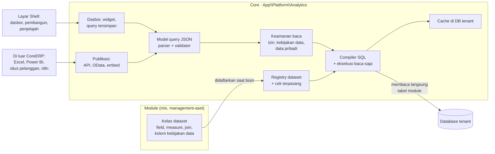

# Engine analitik: dasbor, query sendiri, dan data untuk luar

Rencana kerja engine analitik CoreERP — padanan Power BI yang dibangun di dalam produk sendiri —
bukan desain kanonik. Ditulis 3 Oktober 2026, sesudah pemilik produk memutuskan membangunnya
sendiri. Halaman-halaman di folder ini ditulis supaya beberapa agen dapat mengerjakannya bersamaan
tanpa saling menunggu dan tanpa saling menimpa. Kerangka berjalan (area 0) sudah dikirim pada hari yang
sama; begitu kode sebuah bagian ada di repo, kodenya yang menjadi rujukan, dan [halaman kanonik engine
analitik](/dev/35-analitik) menjelaskan yang sudah dikirim. Halaman di folder ini tetap rencana, riset, dan
keputusan; bila berbeda dengan kode, kodenya yang benar.

**Kenapa dibangun.** Hampir setiap fasilitas kesehatan dari sekitar seratus pelanggan sistem lama
meminta dasbor — persediaan, kasir, aset, dan lain-lain — dan keinginannya berbeda-beda. Dulu
setiap dasbor ditulis tangan per pelanggan. Power BI berbayar per kapasitas dan per pengguna, dan
embed ke situs pelanggan butuh kapasitas premium. Pemilik produk: daripada pelanggan membayar
Power BI, lebih baik membayar perangkat lunak kita.

**Apa yang berubah bagi pelanggan.** Dasbor yang tadinya ditulis tangan menjadi **setelan** milik
tenant: konsultan atau admin pelanggan menyusunnya sendiri dari dataset yang dinyatakan module,
tanpa rilis baru. Itu memindahkan permintaan dasbor dari urutan 3–4 ke urutan 1 di
[kebutuhan khusus pelanggan](/dev/05-customization-and-addons) (lihat KA-25).

## Isi folder ini

| Halaman | Isi | Dibaca oleh |
| --- | --- | --- |
| [Engine analitik, halaman kanonik](/dev/35-analitik) | Yang **sudah dikirim**: aturan beserta alasannya, endpoint, hak akses, dan cara module menyatakan dataset | Semua, sebelum halaman rencana |
| [PRD](/todo/analitik/prd) | Masalah, pengguna, cakupan, kebutuhan fungsional dan nonfungsional, rilis, risiko | Semua, pertama kali |
| [Riset](/todo/analitik/riset) | BC, F&O, Power BI, semantic layer terbuka, REST vs OData vs GraphQL, embed aman, pengaman PostgreSQL | Yang meragukan sebuah keputusan |
| [Arsitektur](/todo/analitik/arsitektur) | Letak di lapis Platform, komponen, alur data, tenant dan database sendiri, berkas per komponen | Semua agen backend |
| [Model semantik](/todo/analitik/model-semantik) | Kontrak dataset yang dinyatakan module, dengan contoh kode | Agen module dan agen kontrak |
| [Mesin query](/todo/analitik/mesin-query) | Bentuk query JSON, compiler ke SQL, eksekusi baca-saja, hasil, rumus | Agen mesin |
| [Keamanan](/todo/analitik/keamanan) | Rantai izin, kebijakan data, data pribadi, ancaman, test penjaga | Semua, sebelum membuka PR |
| [Dasbor dan visual](/todo/analitik/dasbor-dan-visual) | Penyimpanan dasbor, widget, layar, grafik, slicer, drill | Agen UI dan API layar |
| [Akses luar](/todo/analitik/akses-luar) | Publikasi, Query API, feed OData, embed, kontrak `integrasi-analitik.yaml` | Agen akses luar |
| [Kinerja dan uji beban](/todo/analitik/kinerja-dan-uji-beban) | Cache, batas beban, ringkasan, skenario k6, oracle SQL | Agen kualitas |
| [TODO](/todo/analitik/TODO) | Indeks area kerja, ketergantungan, lajur paralel, aturan pengerjaan | Setiap agen sebelum mulai |
| [TODO fase 1](/todo/analitik/todo-fase-1) · [fase 2](/todo/analitik/todo-fase-2) · [fase 3](/todo/analitik/todo-fase-3) | Butir kerja per area, berkas, test, perintah, kriteria selesai | Agen yang mengerjakan areanya |

Skill untuk agen yang mengerjakan: `coreerp-analytics` (`.agents/skills/coreerp-analytics/SKILL.md`),
ditambah skill per area yang disebut di TODO.

## Gambaran dalam satu diagram

Core membaca tabel module secara langsung — keputusan pemilik produk 3 Oktober 2026, rumusan
kanoniknya di [ownership dan data](/dev/02-module-standard#ownership-dan-data). Nama tabel dan
kolomnya selalu datang dari kelas dataset yang didaftarkan module, tidak pernah ditulis mati di
Core.

## Keputusan

Nomor `KA-xx` tidak pernah dipakai ulang. Keputusan yang dibalik ditandai dan diganti nomor baru.
Alasan setiap keputusan ada di PRD atau halaman yang disebut.

| Kode | Keputusan | Status |
| --- | --- | --- |
| KA-01 | Membangun engine sendiri. Tidak memakai Power BI, Metabase, Superset, atau Cube sebagai runtime | Diputuskan pemilik, 2–3 Okt 2026 |
| KA-02 | Engine tinggal di Core, lapis Platform (`App\Platform\Analytics`), di runtime yang sama. Bukan module dan bukan repo terpisah | Diputuskan (usulan 2 Okt disetujui) |
| KA-03 | Core membaca tabel module langsung lewat dataset yang didaftarkan module. Module tidak membaca module lain. Analisis lintas module lewat dimensi bersama (drill-across), bukan join baris lintas module | Diputuskan pemilik, 3 Okt 2026; drill-across turunan teknisnya |
| KA-04 | Sumber data hanya tabel CoreERP (module dan Core). Tidak ada impor berkas bebas, ETL, SQL bebas, atau koneksi ke database luar | Diputuskan (usulan disetujui) |
| KA-05 | Kolom `EndUserIdentifiableInformation` tertutup bawaan dan dibuka per permission khusus; `AccountData` tidak pernah tersedia; publikasi ke luar tidak membawa data pribadi | Diputuskan (usulan disetujui); rincian di [keamanan](/todo/analitik/keamanan) |
| KA-06 | Paket jual: melihat dasbor dan template bawaan untuk semua paket; pembangun query, publikasi, dan peringatan sebagai add-on berbayar | Arah diputuskan; **mekanisme hak menunggu** (Core belum punya hak per fitur) |
| KA-07 | Query ditulis sebagai JSON berbentuk Cube: `dataset`, `dimensions`, `measures`, `filters`, `time_range`, `sort`, `limit` | Keputusan teknis |
| KA-08 | Saringan memakai sintaks BC milik filter tambahan laporan (K-30, `FieldFilterExpression`) ditambah token rentang tanggal relatif | Keputusan teknis |
| KA-09 | Akses luar v1: publikasi lewat REST JSON/CSV, feed OData v4 baca-saja, dan embed bertoken. GraphQL tidak di v1 | Diputuskan dari riset yang diminta pemilik; pemilik dapat membaliknya |
| KA-10 | Token embed opak, dicetak lewat API oleh backend situs pelanggan, berumur 10 menit, disimpan sebagai hash, diserahkan lewat fragment URL dan `postMessage`, tanpa cookie; `frame-ancestors` per embed | Keputusan teknis |
| KA-11 | Pemanggil luar memakai klien integrasi yang sudah ada (`integration_clients`) dengan scope baru, dan hanya membaca **publikasi** yang dibuat pengguna tenant — bukan query bebas | Disetujui pemilik, 3 Okt 2026 |
| KA-12 | Grafik memakai Recharts 3.8 yang sudah terpasang (`@apperp/ui/chart`). Tata letak fase 1 grid CSS tanpa seret-lepas; react-grid-layout v2 ditimbang di fase 2 | Keputusan teknis; dependency baru di fase 2 butuh persetujuan |
| KA-13 | Feed OData: subset buatan sendiri atau pustaka `flat3/lodata` | **Menunggu spike** (area 16) |
| KA-14 | Rantai izin analitik: entry point, permission, privilege, dan duty di [keamanan](/todo/analitik/keamanan#rantai-izin-yang-diusulkan) | Disetujui pemilik apa adanya, 3 Okt 2026 |
| KA-15 | Hak membaca dataset = permission baca resource module yang sudah ada. Module tidak menambah kode izin untuk analitik | Disetujui pemilik bersama KA-14, 3 Okt 2026 |
| KA-16 | Ringkasan (pra-agregasi) ala Analysis View BC di fase 3; bentuk dan pemicunya diputuskan saat itu | Ditunda |
| KA-17 | Template dasbor bawaan berupa kode yang didaftarkan module; dasbor tenant berupa data. Memperbarui template tidak menimpa salinan tenant | Keputusan teknis |
| KA-18 | Hasil query di-cache di tabel database tenant (`analytics_query_cache`), bukan di cache store bawaan yang menunjuk database pusat | Keputusan teknis; alasannya di [kinerja](/todo/analitik/kinerja-dan-uji-beban#cache) |
| KA-19 | Rumus memakai bahasa kecil sendiri yang dikompilasi ke SQL dengan daftar fungsi tertutup; bukan DAX | Keputusan teknis |
| KA-20 | Data produk lama (CI3) masuk lewat kontrak masuk | Ditunda; di luar fase 1–3 |
| KA-21 | Penjelajah data per dataset (padanan *Data analysis mode* BC) di Core; tombol Analisis di layar daftar module opsional per module | Keputusan teknis, fase 2–3 |
| KA-22 | Uang tidak pernah dijumlah lintas mata uang; kuantitas tidak pernah dijumlah lintas satuan | Keputusan teknis, mengikat |
| KA-23 | Tidak ada analitik lintas tenant. Konsolidasi terjadi di dalam satu tenant lewat legal entity | Mengikuti [standar module](/dev/02-module-standard#ownership-dan-data) |
| KA-24 | Setiap query analitik berjalan di transaksi baca-saja dengan batas waktu dan batas baris | Keputusan teknis, mengikat |
| KA-25 | Halaman kanonik `docs/dev/05` diperbarui saat fase 1 selesai: dasbor yang dapat disusun dari dataset pindah dari "integrasi di luar" ke "setelan" | Dikerjakan di area 11 (4 Okt 2026): `docs/dev/05` diperbarui dan halaman kanonik `docs/dev/35-analitik.md` terbit; sapuan akhir menunggu area 8 dan 10 |

## Fase dan lajur

| Fase | Isi | Hasil yang dapat dilihat pelanggan |
| --- | --- | --- |
| 0 | Kerangka berjalan: satu dataset, satu query, satu halaman dengan satu tile dan satu grafik | Belum ada; membuktikan semua lapis tersambung |
| 1 | Engine lengkap untuk satu module (aset), dasbor pribadi dan bersama, pembangun widget, penjelajah, cache, uji beban | Admin menyusun dasbor aset sendiri |
| 2 | Slicer, cross-filter, drill, rumus, perbandingan waktu, lintas module, publikasi, OData, embed, template, dasbor per peran | Dasbor dipasang di situs pelanggan; Excel/Power BI membaca feed |
| 3 | Pivot, subtotal, peringatan, kirim terjadwal, ringkasan, paket jual, module lain | Analitik sebagai add-on berbayar |

Rincian area, ketergantungan, dan lajur ada di [TODO](/todo/analitik/TODO).

## Istilah

| Di dokumen | Nama di kode | Padanan |
| --- | --- | --- |
| Dataset | `Dataset` (kontrak), kelas `…Dataset` di module | Query object BC, *aggregate measurement* F&O, tabel di model semantik Power BI |
| Field | `Field` | Kolom query BC, atribut dimensi F&O |
| Dimensi | field yang dipakai mengelompokkan | *Group by* |
| Measure | `Measure` | `Method = Sum` di BC, measure Power BI |
| Rumus | `Formula` | Measure DAX sederhana |
| Dimensi bersama | `SharedDimension` | *Conformed dimension* Kimball |
| Query analitik | `AnalyticsQuery` | Query Cube, visual query Power BI |
| Widget | `Widget` | Tile/visual Power BI, cue dan chart part BC |
| Dasbor | `Dashboard` | Dashboard Power BI, Role Center BC, workspace F&O |
| Query tersimpan | `SavedQuery` | — |
| Publikasi | `Publication` | Embed token Power BI, entity OData BC |
| Embed | `Embed` | *Embed for your customers* Power BI |
| Template dasbor | `DashboardTemplate` | Laporan Power BI bawaan app PowerBIReports |
| Ringkasan | `Rollup` | Analysis View BC, entity store F&O |
| Principal | `AnalyticsPrincipal` | Pengguna, klien integrasi, atau embed yang menjalankan query |

Di layar pengguna bisnis, istilah teknis di atas tidak tampil. Layar memakai "Dasbor", "Analisis",
"Kolom", "Nilai", "Saring", dan "Bagikan"; daftar kata yang dilarang tampil ada di
[glosarium](/onboarding/glosarium).

## Koordinasi dengan pekerjaan lain

- **Dasbor aset sesi "Struktur layer"** (`AssetDashboardController`, belum di-merge saat halaman ini
  ditulis) tetap jalan sebagai layar module. Setelah area 18, isinya menjadi template dasbor bawaan
  engine dan endpoint lamanya dapat diarsipkan. Mesin dasbor generik tidak dibangun di dalam module.
- **API untuk integrator** ([halaman](/todo/api-untuk-integrator/)) membuka API module untuk
  sistem luar. Akses luar analitik tidak menunggunya: ia memakai klien integrasi yang sudah ada
  (KA-11). Query bebas dari luar menunggu akun aplikasi punya peran, yang menjadi bagian halaman itu.
- **Database sendiri per environment** ([TODO](/todo/produksi-database-sendiri/TODO)): job antrean
  dan perintah terjadwal belum membawa environment-nya (butir 4.1 dan 4.2). Peringatan dan kirim
  terjadwal di fase 3 menunggu keduanya.
