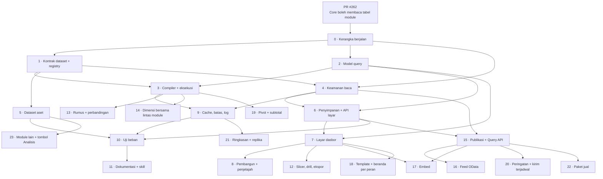

# TODO engine analitik — indeks dan aturan kerja

Indeks area kerja [engine analitik](/todo/analitik/). Butir kerjanya ada di tiga halaman fase:
[fase 1](/todo/analitik/todo-fase-1) (termasuk area 0), [fase 2](/todo/analitik/todo-fase-2), dan
[fase 3](/todo/analitik/todo-fase-3). Halaman ini tidak memuat status: status tinggal di judul area
masing-masing, supaya beberapa pull request yang memperbarui status area berbeda tidak saling
bentrok di satu tabel.

Status mengikuti [aturan backlog](/todo/): `[ ]` belum, `[~]` sedang dikerjakan, `[x]` selesai **dan**
ada test yang membuktikannya. Setiap area punya **Tempat**, **Setelah** (yang harus selesai lebih
dulu), **Keputusan** (yang harus sudah diputuskan), **Skill**, **Berkas**, dan **Selesai bila**.
Area yang keputusannya masih menunggu belum boleh dimulai.

## Peta ketergantungan



## Lajur paralel

Setelah area 0 digabung, enam agen dapat bekerja bersamaan tanpa menunggu satu sama lain, karena
kontrak di antara mereka sudah dibekukan area 0 (antarmuka PHP, bentuk query JSON, bentuk hasil).

| Lajur | Area, berurutan | Mulai bersamaan dengan |
| --- | --- | --- |
| Mesin | 1 → 3 → 13 → 19 → 21 | 2, 4, 5, 6, 7 |
| Model query | 2 → (bahan 3, 6, 8, 15, 16) | 1, 4, 5, 6, 7 |
| Keamanan | 4 → 9 → 15 | 1, 2, 5, 6, 7 |
| Module | 5 → 23 | 1, 2, 4, 6, 7 |
| Penyimpanan dan API | 6 → 15 → 16, 17 | 1, 2, 4, 5, 7 |
| Layar | 7 → 8 → 12 → 18 | 1, 2, 4, 5, 6 (dengan API tiruan dari tipe area 2) |
| Kualitas | 10 → 11, lalu tinjauan setiap fase | Setelah 5, 6, 9 |

Area 4 dan 1 menyentuh berkas berbeda tetapi saling membaca; agen keduanya menyepakati nama method
`CompiledDataset` lewat [arsitektur](/todo/analitik/arsitektur) dan memperbarui halaman itu bila
berubah.

## Daftar area

| Area | Nama | Fase | Keputusan | Skill utama |
| --- | --- | --- | --- | --- |
| 0 | Kerangka berjalan | 0 | KA-02, KA-03, KA-07, KA-24 | `coreerp-analytics`, `coreerp-architecture`, `laravel-tdd` |
| 1 | Kontrak dataset dan registry | 1 | KA-03, KA-15, KA-22 | `coreerp-analytics`, `laravel-patterns` |
| 2 | Model query | 1 | KA-07, KA-08 | `coreerp-analytics`, `laravel-tdd` |
| 3 | Compiler, eksekusi, hasil | 1 | KA-22, KA-24 | `coreerp-analytics`, `laravel-patterns`, `laravel-tdd` |
| 4 | Keamanan baca | 1 | KA-05, KA-14, KA-15 | `coreerp-analytics`, `coreerp-architecture`, `security-review` |
| 5 | Dataset module aset | 1 | KA-15, KA-22 | `coreerp-analytics`, `module-discovery` (tanpa tabel baru) |
| 6 | Penyimpanan dasbor dan API layar | 1 | KA-12, KA-14, KA-17 | `coreerp-analytics`, `api-design`, `laravel-patterns` |
| 7 | Layar dasbor | 1 | KA-12 | `coreerp-ui`, `coreerp-page-standard`, `react-patterns` |
| 8 | Pembangun widget dan penjelajah | 1 | KA-08, KA-21 | `coreerp-ui`, `coreerp-page-standard` |
| 9 | Cache, batas beban, log | 1 | KA-18, KA-24 | `coreerp-analytics`, `laravel-patterns` |
| 10 | Uji beban | 1 | — | `coreerp-architecture` (gate beban) |
| 11 | Dokumentasi dan skill | 1 | KA-25 | `coreerp-docs` |
| 12 | Slicer, cross-filter, drill, ekspor widget | 2 | — | `coreerp-ui`, `coreerp-analytics` |
| 13 | Rumus dan perbandingan periode | 2 | KA-19 | `coreerp-analytics`, `laravel-tdd` |
| 14 | Dimensi bersama lintas module | 2 | KA-03 | `coreerp-analytics`, `coreerp-architecture` |
| 15 | Publikasi dan Query API luar | 2 | KA-05, KA-09, KA-11 | `coreerp-architecture` (kontrak), `api-design`, `security-review` |
| 16 | Feed OData | 2 | KA-09, KA-13 | `api-design`, `security-review` |
| 17 | Embed | 2 | KA-10, KA-11 | `security-review`, `coreerp-ui` |
| 18 | Template dan beranda per peran | 2 | KA-17 | `coreerp-ui`, `coreerp-analytics` |
| 19 | Pivot dan subtotal | 3 | — | `coreerp-analytics` |
| 20 | Peringatan dan kirim terjadwal | 3 | — | `coreerp-architecture` |
| 21 | Ringkasan pra-agregasi dan replika baca | 3 | KA-16 | `coreerp-analytics`, `coreerp-architecture` |
| 22 | Paket jual dan hak add-on | 3 | KA-06 | `coreerp-architecture` |
| 23 | Module lain, tombol Analisis, dataset terhitung | 3 | PQ-08 | `module-discovery`, `coreerp-analytics` |

## Aturan pengerjaan untuk setiap agen

1. **Baca dulu**: halaman peta, PRD bagian yang relevan, halaman rancangan yang disebut area, dan
   skill `coreerp-analytics`. Jangan mulai dari ingatan tentang dokumen lain.
2. **Area yang keputusannya belum ditutup tidak dimulai.** Keputusan yang menunggu tercantum di
   [peta](/todo/analitik/#keputusan); bila ragu, tanyakan pemilik produk, jangan menebak.
3. **Satu area, satu cabang dari `origin/main`.** Checkout utama `D:\Kerja\CoreERP` dipakai sesi
   lain: buat worktree, jangan `checkout` atau `switch` di sana, dan jangan pernah `git stash` polos.

   ```bash
   git -C D:/Kerja/CoreERP fetch origin
   ```

   ```bash
   git -C D:/Kerja/CoreERP worktree add .claude/worktrees/analitik-03 -b feat/analitik-03-compiler origin/main
   ```

4. **Sebelum mulai, pastikan area itu belum dipegang orang lain**: cari cabang `feat/analitik-<nomor>-*`
   di remote dan pull request terbuka berjudul "analitik"; area yang sudah punya cabang sedang
   dikerjakan.

   ```bash
   gh pr list --state open --search "analitik in:title"
   ```

5. **Tandai `[~]` di judul area pada pull request pertama area itu**, dan `[x]` hanya bila semua butir
   serta test-nya selesai. Status butir diperbarui di pull request yang mengerjakannya.
6. **Berkas bersama hanya ditambah, tidak disusun ulang** (lihat tabel di bawah). Merapikan berkas
   bersama adalah pull request tersendiri.
7. **Nama di kode bahasa Inggris, tanpa kecuali**; docblock, komentar, pesan commit, dan teks layar
   bahasa Indonesia sehari-hari. Istilah baku (endpoint, scope, token, push, pull) tidak
   diterjemahkan.
8. **Pisahkan perubahan format dari perubahan perilaku** (skill `code-formatting`). Jangan menjalankan
   formatter penulis atas berkas yang tidak diubah area itu.
9. **Selesai berarti terbukti**: test merah-hijau, suite paralel hijau, layar dibuka di runtime yang
   dibangun ulang, dokumentasi diperbarui. Gabungkan pull request sendiri bila CI hijau, sesuai
   kebiasaan repo; jangan menggabungkan yang merah.
10. **Temuan yang ternyata salah diperbaiki di halaman rancangan**, lalu dilaporkan — jangan tetap
    mengerjakan hal yang tidak perlu ([aturan backlog](/todo/)).

## Berkas bersama

Berkas yang disentuh lebih dari satu area. Pemilik awalnya yang membuat; area lain hanya menambah
baris di bagian yang disediakan.

| Berkas | Dibuat oleh | Ditambah oleh | Cara menambah |
| --- | --- | --- | --- |
| `apps/core/routes/analytics.php` | 0 | 6, 8, 12, 13, 15, 16, 17, 18 | Satu blok per area, berkomentar nomor area |
| `apps/core/routes/web.php` | — | 0 (satu baris `require`), 17 (rute embed di luar grup `web`) | Hanya baris itu |
| `apps/core/config/analytics.php` | 0 | 3, 9, 15, 16, 17 | Kunci baru di bagian area |
| `apps/core/app/Platform/Modules/Support/CoreServices.php` | — | 0 (`Datasets`), 14 (`SharedDimensions`), 18 (`DashboardTemplates`) | Satu baris di `SINGLETON_BINDINGS` |
| `apps/core/app/Platform/Access/Support/CoreSecurityCatalog.php` | — | 4 (butir 4.6; KA-14 disetujui 3 Okt 2026), 15 | Konstanta baru di akhir |
| `apps/core/app/Platform/Retention/Support/RetentionPolicies.php` | — | 9, 17 | Satu `RetentionPolicy` per tabel |
| `apps/core/app/Platform/Integration/Models/IntegrationClient.php` | — | 15 | Dua entri di `SCOPES` |
| `apps/core/resources/js/components/app-sidebar.tsx` | — | 7, 15 | Satu item per area |
| `apps/core/resources/js/lib/analytics/types.ts` | 0 | 2, 6, 12, 13 | Tipe baru di akhir; tipe yang ada hanya diperluas |
| `apps/core/vite.config.ts` | — | 17 (entri embed) | Satu entri |
| `modules/apperp/management-aset/src/ModuleServiceProvider.php` | — | 0, 5, 18 | Satu daftar dataset dan satu daftar template |
| `apps/core/contracts/internal/integrasi-analitik.yaml` | 15 | 16, 17 | Path baru di bawah `paths:` |
| `docs/.vitepress/config.ts` | folder ini | 11 | Halaman baru di grup Analitik |

## Perintah verifikasi

Dari `apps/core` di worktree area, kecuali disebut lain.

| Kegunaan | Perintah |
| --- | --- |
| Satu berkas atau folder test (saat menelusuri) | `php -d memory_limit=1G vendor/phpunit/phpunit/phpunit tests/Feature/Platform/Analytics` |
| Suite Core seperti CI (sebelum menyatakan hijau) | `composer test:fast` |
| Gaya PHP | `composer lint:check` |
| Analisa tipe PHP | `composer types:check` |
| Gaya, tipe, dan lint TypeScript | `npm run format:check`, `npm run types:check`, `npm run lint:check` |
| Build layar dan ukuran bundel | `npm run build`, `npm run bundle:check` |
| Kontrak (area 15–17) | `python contracts/bundle.py`, lalu `python contracts/check-contract-coverage.py` |
| Salinan skill | `python .github/scripts/check-skill-copies.py` (dari akar repo) |
| Dokumentasi | `npm run docs:build` (dari `docs/`) |
| Runtime lokal setelah mengubah layar | `D:\Kerja\erp-dev\start.ps1 -Build`, lalu buka layar lewat rail di `http://localhost:8000` |

Catatan lingkungan yang sudah memakan waktu sesi lain:

- Worktree baru butuh `composer install --ignore-platform-req=ext-opentelemetry` (lewat PowerShell)
  dan `npm ci`, lalu `npm run build -w packages/ui` dari akar repo. Tanpa build SDK, `tsc` membaca
  `@apperp/ui` dari checkout utama yang mungkin basi.
- Satu putaran test pada satu waktu per database. Suite paralel memakai database per proses; phpunit
  langsung memakai `core_erp_test` bersama, dan dua putaran serentak saling menjatuhkan tabel.
- Repo ini tidak punya penguji unit JavaScript. Layar dibuktikan dengan tipe, lint, build, dan
  pemeriksaan di runtime — jangan menambah penguji baru tanpa persetujuan.
