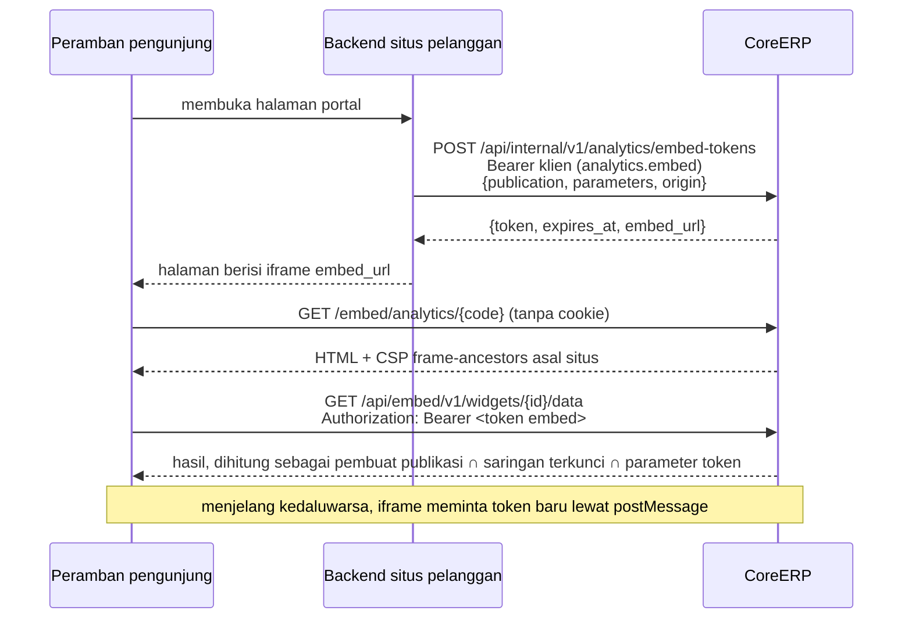

# Akses luar: publikasi, Query API, feed OData, dan embed

Bagian dari [engine analitik](/todo/analitik/), fase 2 (area 15–17). Halaman ini menjawab
pertanyaan pemilik produk "datanya bisa di-embed ke luar lewat apa": lewat **publikasi** — query
tersimpan atau dasbor yang sengaja dibuka pengguna tenant — yang dibaca sebagai JSON/CSV, feed
OData, atau dipasang sebagai embed di situs pelanggan. Alasan memilih bentuk ini, dan bukan
GraphQL, ada di [riset](/todo/analitik/riset#_3-membuka-data-ke-luar-rest-odata-atau-graphql).

## Kenapa lewat publikasi

Klien integrasi bukan anggota tenant. Akun aplikasinya (`IntegrationClientAccounts`) tidak punya
keanggotaan, peran, maupun hibah kebijakan data, jadi tidak ada dasar untuk menjawab "boleh membaca
apa" bila ia menjalankan query bebas. Publikasi memecahkan itu tanpa mengubah model identitas:

- Yang dibuka ke luar selalu **benda yang dapat ditinjau**: query tersimpan atau dasbor tertentu,
  bukan seluruh dataset.
- Jangkauannya adalah **jangkauan pembuatnya saat ini, dipersempit saringan terkunci** publikasi.
  Pembuat yang kehilangan hak membuat publikasinya berhenti (403 `analytics.publication_suspended`).
- Setiap publikasi menyebut **klien integrasi mana** yang boleh membacanya, dan untuk embed, **asal
  situs mana** yang boleh memasangnya.
- Publikasi tidak pernah membawa field data pribadi (KA-05) dan dapat menyembunyikan kelompok
  kecil (PQ-07).

Query bebas dari luar menunggu akun aplikasi punya peran — bagian rencana
[API untuk integrator](/todo/api-untuk-integrator/), bukan rencana ini (KA-11).

## Tabel

```php
Schema::create('analytics_publications', function (Blueprint $table): void {
    $table->ulid('id')->primary();
    $table->ulid('tenant_id');
    $table->string('code', 80);                        // dipakai di URL dan sebagai nama entity set OData
    $table->string('name', 120);
    $table->text('description')->nullable();
    $table->string('kind', 20);                        // query | dashboard
    $table->ulid('saved_query_id')->nullable();
    $table->ulid('dashboard_id')->nullable();
    $table->unsignedBigInteger('owner_user_id');       // jangkauannya yang dipakai; dapat dipindah admin
    $table->jsonb('locked_filters')->default('{}');    // {dataset: {field: nilai}}
    $table->jsonb('client_ids')->default('[]');        // klien integrasi yang boleh membaca
    $table->jsonb('formats')->default('["json"]');     // json, csv, odata
    $table->jsonb('embed_origins')->default('[]');     // https://portal.klinik.example
    $table->jsonb('embed_parameters')->default('[]');  // [{key, field, required, allowed_values?}]
    $table->unsignedInteger('min_group_size')->nullable();
    $table->string('status', 20)->default('active');   // active | paused | revoked
    $table->timestamp('last_used_at')->nullable();
    $table->timestamps();
    $table->softDeletes();
    $table->unsignedBigInteger('created_by_user_id')->nullable();
    $table->unsignedBigInteger('updated_by_user_id')->nullable();
    $table->unsignedInteger('version')->default(1);
});
// unik (tenant_id, lower(code)) untuk baris hidup, tiga trigger seperti tabel analitik lain

Schema::create('analytics_embed_tokens', function (Blueprint $table): void {
    $table->ulid('id')->primary();
    $table->ulid('tenant_id');
    $table->ulid('publication_id');
    $table->ulid('integration_client_id');             // yang mencetak
    $table->char('token_digest', 64)->unique();         // sha256, AccountData
    $table->jsonb('parameters')->default('{}');        // nilai embed_parameters yang dikunci
    $table->string('origin', 255);
    $table->timestamp('expires_at');
    $table->timestamp('revoked_at')->nullable();
    $table->timestamps();
    // kolom jejak dan version seperti tabel tenant lain
});
```

`token_digest` diklasifikasi `AccountData`, sama dengan `integration_clients.token_digest`.
Token kedaluwarsa dihapus `RetentionService` (`analytics_embed_tokens`, satu hari setelah
kedaluwarsa); tabel itu tabel teknis, bukan data bisnis.

## Scope klien integrasi

Dua scope baru di `IntegrationClient::SCOPES`, dipilih admin saat menerbitkan klien:

| Scope | Nama di layar | Membuka |
| --- | --- | --- |
| `analytics.read` | Membaca publikasi analitik | Daftar publikasi, metadata, baris JSON/CSV, feed OData |
| `analytics.embed` | Mencetak token embed analitik | `POST analytics/embed-tokens` |

Keduanya tetap dipersempit daftar `client_ids` setiap publikasi: scope membuka pintu, publikasi
menentukan ruangan mana.

## Endpoint

Di bawah `https://{alamat tenant}/api/internal/v1`, tenant dari token klien seperti integrasi finance.

| Metode dan path | Scope | Isi |
| --- | --- | --- |
| `GET analytics/publications` | `analytics.read` | Publikasi yang boleh dibaca klien ini |
| `GET analytics/publications/{code}` | `analytics.read` | Kolom, tipe, format, field yang boleh disaring |
| `GET analytics/publications/{code}/rows` | `analytics.read` | Baris; `format=json\|csv`, `cursor`, `limit` ≤ 5000, `filter[field]=ekspresi` |
| `POST analytics/embed-tokens` | `analytics.embed` | Token embed untuk publikasi dasbor |
| `GET analytics/odata/` | `analytics.read` | Service document OData |
| `GET analytics/odata/$metadata` | `analytics.read` | CSDL |
| `GET analytics/odata/{entitySet}` | `analytics.read` | Entity set = satu publikasi query |

Saringan tambahan pemanggil (`filter[...]`, `$filter`) hanya menyempitkan: ia dipasang **bersama**
saringan terkunci dan kebijakan data, tidak menggantikannya, dan hanya pada field yang menjadi
dimensi publikasi.

Contoh respons baris:

```json
{
  "columns": [
    { "key": "unit_kerja", "caption": "Unit kerja", "type": "text" },
    { "key": "jumlah_aset", "caption": "Jumlah aset", "type": "number", "format": "number" }
  ],
  "rows": [ { "unit_kerja": "Instalasi Farmasi", "jumlah_aset": 42 } ],
  "meta": { "publication": "aset-per-unit", "generated_at": "2026-10-15T09:00:00+07:00", "next_cursor": null }
}
```

CSV memakai bentuk ekspor daftar yang sudah ada: angka mentah dengan titik desimal, tanggal ISO, teks
berawalan `=`, `+`, `-`, atau `@` diberi petik supaya tidak dibaca sebagai rumus spreadsheet.

**Google Sheets** tidak dapat mengirim header lewat `IMPORTDATA`. Yang disarankan adalah Apps Script
dengan `UrlFetchApp.fetch(url, {headers: {Authorization: 'Bearer …'}})`, dijadwalkan dengan trigger
Apps Script. Tautan CSV dengan kunci di URL tidak disediakan di v1, karena kunci di URL tercatat di
setiap log yang dilewatinya.

**n8n, Make, Zapier**: node HTTP dengan header `Authorization: Bearer <client_id>.<secret>`.

## Feed OData v4

Untuk Excel ("From OData feed"), Power BI Desktop dan service, dan Tableau. Hanya baca, hanya atas
publikasi berjenis query, dan hanya subset protokol yang dipakai alat-alat itu. Pilihan antara subset
buatan sendiri dan pustaka `flat3/lodata` diputuskan spike di area 16 (KA-13); bentuk luarnya sama.

| Bagian | Yang didukung |
| --- | --- |
| Service document | Daftar entity set yang boleh dibaca klien |
| `$metadata` | CSDL 4.0: satu `EntityType` per publikasi, kunci sintetis `RowId` (`Edm.Int64`) |
| Tipe | teks, pilihan, rujukan → `Edm.String`; jumlah baris → `Edm.Int64`; angka dan uang → `Edm.Decimal`; tanggal dan periode → `Edm.Date`; tanggal-jam → `Edm.DateTimeOffset`; ya/tidak → `Edm.Boolean` |
| `$select` | Ya |
| `$filter` | `eq ne gt ge lt le and or not`, kurung, `in`, `contains`, `startswith`, `endswith`, literal teks/angka/tanggal — hanya pada kolom dimensi; diterjemahkan menjadi saringan query analitik, bukan SQL |
| `$orderby`, `$top`, `$skip`, `$count=true` | Ya |
| Halaman | `@odata.nextLink` dengan `$skiptoken`, 5.000 baris per halaman, `Prefer: odata.maxpagesize` dihormati sampai batas itu |
| `$apply`, `$expand`, `$batch`, tulis | Tidak; dijawab 501 dengan pesan |
| Galat | `{"error": {"code": "...", "message": "..."}}`, header `OData-Version: 4.0` |

`$filter` dibaca parser kecil menjadi pohon saringan yang sama dengan saringan query analitik, lalu
melewati compiler yang sama. Tidak ada jalur SQL kedua untuk OData.

### Autentikasi feed

Konektor OData Power Query tidak dapat mengirim header `Authorization: Bearer` buatan sendiri. Ia
menawarkan Basic dan kunci "Web API" yang dikirim di query string
([riset](/todo/analitik/riset#_3-membuka-data-ke-luar-rest-odata-atau-graphql)). Karena itu rute OData
punya middleware penerjemah di depan `integration-client:analytics.read`:

- **Basic**: nama pengguna = id klien, kata sandi = rahasia. Diterjemahkan ke bentuk
  `<id>.<rahasia>` lalu diperiksa jalur yang sama dengan Bearer.
- **Kunci Web API** (`?key=<id>.<rahasia>`): diterima hanya di rute OData, dihapus dari permintaan
  sebelum apa pun mencatatnya, dan **disamarkan** di log proxy dan trace SigNoz. Tanpa penyamaran
  itu, kunci tersimpan di tempat yang dibaca operator. Penyamarannya bagian dari selesai, bukan
  polesan.

Spike area 16 memastikan dua hal sebelum feed dijanjikan ke pelanggan: refresh terjadwal di Power BI
service berhasil dengan Basic tanpa gateway, dan Excel membaca `$metadata` serta halaman berikutnya.

## Embed

Embed adalah publikasi berjenis dasbor yang dipasang di situs pelanggan dalam iframe.



### Aturan token

| Aturan | Nilai | Kenapa |
| --- | --- | --- |
| Bentuk | 32 byte acak, base64url, opak | Hanya Core yang membacanya; tidak perlu JWT atau dependency baru |
| Disimpan | `sha256` saja | Basis data yang bocor tidak membocorkan token |
| Umur | 600 detik (`analytics.embed.token_ttl_seconds`) | Token yang bocor cepat tidak berguna |
| Terikat ke | Satu publikasi, satu asal situs, nilai parameter yang dikunci | Token untuk dasbor A tidak membuka dasbor B |
| Dicabut | Publikasi dihentikan atau dicabut → semua tokennya berhenti di permintaan berikutnya | Pencabutan tidak menunggu kedaluwarsa |
| Diserahkan | Fragment URL (`#token=`) untuk yang pertama, `postMessage` untuk pembaruan | Fragment tidak dikirim di `Referer` dan tidak sampai ke log server |
| Dipakai | Header `Authorization: Bearer` dari kode halaman embed | Tanpa cookie: Safari dan Firefox memblokir cookie pihak ketiga |
| Parameter | Nilai wajib, hanya dari daftar `allowed_values` bila ada; daftar kosong ditolak 422 | Jebakan Metabase: parameter terkunci kosong tidak boleh berarti "semua" |

### Halaman embed

- Rute `GET /embed/analytics/{code}` **di luar grup `web`**: tanpa sesi, tanpa cookie, tanpa CSRF.
  Isinya HTML kecil yang memuat entri Vite `resources/js/embed/analytics.tsx` — tanpa Shell.
- Header: `Content-Security-Policy: frame-ancestors <embed_origins>; default-src 'self'; connect-src 'self'; img-src 'self' data:`,
  `Referrer-Policy: no-referrer`, `X-Content-Type-Options: nosniff`, dan **tanpa** `X-Frame-Options`
  (yang bertentangan dengan `frame-ancestors`). Halaman Shell tetap tidak boleh di-frame; hanya rute
  embed yang longgar, dan hanya untuk asal yang terdaftar.
- Data lewat `/api/embed/v1/*` dengan middleware `AuthenticateEmbedToken`: token ada, belum
  kedaluwarsa, belum dicabut, publikasi aktif; lalu tenant diikat lewat `TenantRunner` dan
  `EmbedPrincipal` dibuat. Rate limit per token dan per publikasi.
- Kode halaman embed membaca `location.hash`, menyimpan token di memori, dan langsung menghapus
  fragment dengan `history.replaceState`, supaya token tidak tertinggal di riwayat.

### Protokol `postMessage`

| Arah | Pesan | Gunanya |
| --- | --- | --- |
| iframe → situs | `{type: 'coreerp:analytics:ready'}` | Embed siap |
| iframe → situs | `{type: 'coreerp:analytics:token-expiring', expires_at}` | Dikirim 60 detik sebelum kedaluwarsa |
| iframe → situs | `{type: 'coreerp:analytics:height', height}` | Situs menyesuaikan tinggi iframe |
| iframe → situs | `{type: 'coreerp:analytics:error', code}` | Token ditolak, publikasi berhenti |
| situs → iframe | `{type: 'coreerp:analytics:token', token}` | Token pengganti |

Kedua sisi memeriksa asal: iframe hanya menerima pesan dari `window.parent` dengan `event.origin`
yang tercantum di publikasi; situs hanya menerima dari asal CoreERP-nya.

Contoh untuk developer situs pelanggan, ikut terbit di panduan kontrak:

```php
// Backend situs (PHP). Rahasia klien integrasi tidak pernah dikirim ke peramban.
$response = Http::withToken(env('COREERP_CLIENT_TOKEN'))     // "<client_id>.<secret>"
    ->post('https://klinik-a.erp.example/api/internal/v1/analytics/embed-tokens', [
        'publication' => 'aset-per-unit',
        'parameters' => ['unit_kerja' => [$portalUser->unitKerjaId]],
        'origin' => 'https://portal.klinik-a.example',
    ])->throw()->json();

return view('portal.dasbor', ['embedUrl' => $response['embed_url'].'#token='.$response['token']]);
```

```html
<iframe id="dasbor-aset" title="Dasbor aset" src="{{ $embedUrl }}" style="width:100%;border:0"></iframe>
<script>
  const COREERP = 'https://klinik-a.erp.example';
  const frame = document.getElementById('dasbor-aset');
  window.addEventListener('message', async (event) => {
    if (event.origin !== COREERP || event.source !== frame.contentWindow) return;
    if (event.data?.type === 'coreerp:analytics:token-expiring') {
      const { token } = await fetch('/portal/coreerp-embed-token', { credentials: 'same-origin' }).then((r) => r.json());
      frame.contentWindow.postMessage({ type: 'coreerp:analytics:token', token }, COREERP);
    }
    if (event.data?.type === 'coreerp:analytics:height') {
      frame.style.height = `${event.data.height}px`;
    }
  });
</script>
```

## Kontrak

Satu akar domain baru, `apps/core/contracts/internal/integrasi-analitik.yaml`, terbit tanpa login di
`/docs` seperti integrasi finance. Path ditulis satu berkas per path di `contracts/internal/paths/`,
skema di `components/schemas/`, dan skema autentikasi memakai ulang `integrationClient` ditambah
`basicAuth` untuk OData.

```yaml
# Akar domain analitik untuk sistem di luar CoreERP. Dirakit ke contracts/terbit/ oleh bundle.py.
x-portal:
  judul: Integrasi · Analitik
  publik: true
  urutan: 20
openapi: 3.1.0
info:
  title: CoreERP — Publikasi analitik
  version: 1.0.0
  description: |
    Panduan untuk developer yang membaca angka CoreERP dari sistem lain atau memasang dasbor
    CoreERP di situs sendiri. Yang dapat dibaca hanyalah **publikasi** yang dibuat admin tenant
    Anda: query tersimpan atau dasbor, dengan saringan yang sudah dikunci.

    ## Memulai
    …
servers:
  - url: 'https://{alamat}/api/internal/v1'
security:
  - integrationClient: []
paths:
  /analytics/publications: { $ref: 'paths/analytics_publications.yaml' }
  /analytics/publications/{code}: { $ref: 'paths/analytics_publications_code.yaml' }
  /analytics/publications/{code}/rows: { $ref: 'paths/analytics_publications_code_rows.yaml' }
  /analytics/embed-tokens: { $ref: 'paths/analytics_embed-tokens.yaml' }
  /analytics/odata/: { $ref: 'paths/analytics_odata.yaml' }
  /analytics/odata/$metadata: { $ref: 'paths/analytics_odata_metadata.yaml' }
  /analytics/odata/{entitySet}: { $ref: 'paths/analytics_odata_entitySet.yaml' }
components:
  securitySchemes:
    integrationClient: { $ref: 'components/securitySchemes/integrationClient.yaml' }
    basicAuth: { $ref: 'components/securitySchemes/analyticsBasic.yaml' }
```

Aturan kontrak yang berlaku penuh (skill `coreerp-architecture`, *Contract decision gate*):

- Setelah rute dan kontrak berubah: `python contracts/bundle.py` lalu
  `python contracts/check-contract-coverage.py` dari `apps/core`.
- Panduan di `info.description` ditulis untuk orang luar: tanpa riwayat keputusan internal dan tanpa
  jalur kode.
- Daftar nilai yang dipilih pembaca (format, operator `$filter`, kode galat) mendapat judul bagian
  dan skema sendiri, ditulis dengan `examples`, bukan `enum`, karena daftarnya dapat bertambah.
- Rute embed halaman (`/embed/analytics/{code}`) dan `/api/embed/v1/*` dipakai halaman embed milik
  kita sendiri, jadi tidak masuk kontrak; protokol `postMessage` dan cara memasang iframe **masuk**
  panduan, karena developer situs pelanggan bergantung padanya.

## Kenapa bukan GraphQL, dan kapan dipertimbangkan

GraphQL tidak dibaca Excel, Power BI, Tableau, Looker Studio, maupun Google Sheets tanpa kode
tambahan; ia butuh pembatas kedalaman dan kompleksitas supaya satu permintaan tidak menghabiskan
database; dan kelebihannya — pemanggil memilih field sendiri — sudah diberikan publikasi dan query
analitik. Ia dipertimbangkan bila seorang partner yang membangun aplikasi di atas CoreERP memintanya
dengan alasan yang tidak terjawab REST, dan saat itu ia menjadi pintu tambahan di atas mesin query
yang sama, melalui ADR seperti yang sudah tertulis di
[API dan integrasi](/dev/04-api-and-integration#satu-aturan-utama-per-jenis-komunikasi).

## Test yang wajib

- Klien tanpa scope, klien tidak terdaftar di publikasi, dan publikasi berhenti: masing-masing
  ditolak dengan status dan pesan yang benar.
- Pembuat publikasi dicabut haknya → permintaan berikutnya 403 `analytics.publication_suspended`.
- `filter[...]` dan `$filter` tidak pernah melebarkan: hasil dengan saringan tambahan ⊆ hasil tanpa.
- Field data pribadi tidak pernah muncul di metadata, baris, `$metadata`, maupun CSV.
- `$filter` dengan injeksi (`Name eq 'x'' or 1 eq 1'`) dibaca sebagai teks, tidak mengubah arti.
- Kunci Web API tidak muncul di log aplikasi maupun trace (diperiksa dengan pengekspor trace di test).
- Token embed: kedaluwarsa, dicabut, publikasi lain, asal lain, parameter kosong — semuanya ditolak;
  pembaruan lewat `postMessage` diuji di peramban (area 17).
- Halaman embed: header CSP memuat asal yang terdaftar saja; tanpa `Set-Cookie`.
