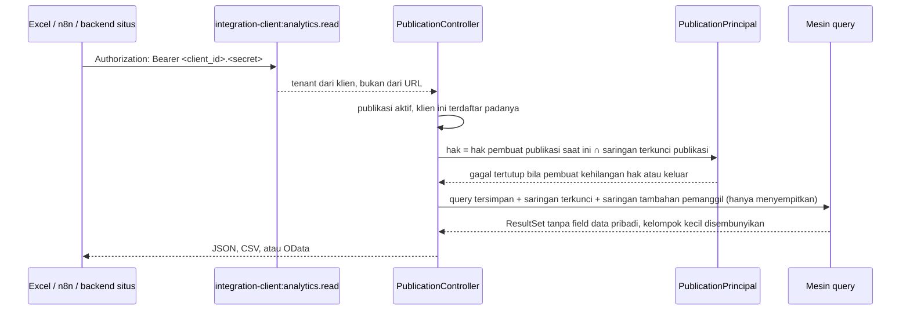

# Arsitektur engine analitik

Bagian dari [engine analitik](/todo/analitik/). Halaman ini menjawab di mana setiap bagian tinggal,
bagaimana satu permintaan mengalir, dan apa yang menjaga batasnya. Bentuk kontrak dataset ada di
[model semantik](/todo/analitik/model-semantik); bentuk query di [mesin query](/todo/analitik/mesin-query).

## Letak di lapis Core

| Bagian | Namespace | Kenapa di sana |
| --- | --- | --- |
| Engine (registry, query, compiler, eksekusi, keamanan baca, cache, dasbor, publikasi, embed) | `App\Platform\Analytics` | Mesin tanpa kosakata bisnis, dipakai semua module — persis definisi lapis Platform di [lapis Core](/todo/lapis-core/) |
| Kontrak yang dipenuhi module | `App\Platform\Modules\Contracts\Analytics` | Module hanya boleh menyebut `App\Platform\Modules\Contracts`; penjaganya `ModuleNamespaceBoundaryTest`, yang menerima sub-namespace karena mencocokkan awalan |
| Pembantu kebijakan data yang dipakai bersama | `App\Platform\Modules\Contracts\DataPolicyFilter` | Satu aturan untuk module dan Core, supaya analitik dan layar module tidak pernah menyaring berbeda (R-11) |
| Kelas dataset | `Modules\<Penerbit>\<Modul>\Analytics` | Milik module; module yang tahu tabelnya |
| Dimensi bersama milik Foundation (vendor, nanti item) | didaftarkan penyedia layanan fitur Foundation ke registry Platform | Platform tidak boleh menyebut Foundation (`LayerDirectionBoundaryTest`); arah sebaliknya boleh |
| Layar | `apps/core/resources/js/pages/platform/analytics/*`, komponen di `resources/js/components/analytics/*` | Halaman Core di Shell; tidak dibuat per module |
| Halaman embed | entri Vite tersendiri `resources/js/embed/analytics.tsx` | Tanpa Shell, tanpa sesi, tanpa cookie |

Engine **bukan module**. Ia tidak punya `app.yaml`, tidak dipasang per tenant, dan tidak punya
awalan tabel module. Tabelnya berawalan `analytics_`, tabel Core biasa.

## Komponen

| Komponen | Kelas utama | Tanggung jawab | Area |
| --- | --- | --- | --- |
| Registry dataset | `Datasets\DatasetRegistry` | Mengumpulkan dataset dari module, memvalidasi definisinya, menyaring menurut module terpasang | 1 |
| Katalog untuk layar | `Datasets\DatasetCatalog` | Field dan measure yang boleh dilihat principal ini (izin, data pribadi) | 1, 4 |
| Dimensi bersama | `Datasets\SharedDimensionRegistry` | Unit kerja, legal entity, pengguna, periode, vendor: label dan pemilih | 14 |
| Model query | `Query\AnalyticsQuery`, `Query\QueryParser`, `Query\QueryValidator` | JSON → objek tak berubah; batas jumlah; hanya anggota dataset | 2 |
| Rentang relatif | `Query\RelativeRange` | Token `@this_month` dan kawan-kawan → rentang tanggal menurut zona pengguna | 2 |
| Compiler | `Query\QueryCompiler`, `Query\MeasureSql`, `Query\TimeBucketSql`, `Query\JoinPlanner` | Objek query → query builder Laravel di atas model module | 3 |
| Eksekusi | `Query\QueryExecutor` | Transaksi baca-saja, batas waktu, batas baris, pemetaan galat | 3 |
| Hasil | `Query\ResultSet`, `Query\LabelResolver`, `Query\GapFiller` | Kolom bertipe, label rujukan, deret waktu tanpa celah, total | 3 |
| Principal | `Security\AnalyticsPrincipal` + `UserPrincipal`, `PublicationPrincipal` | Siapa yang bertanya: tenant, izin, hibah kebijakan, hak data pribadi, zona waktu | 4 |
| Akses dataset | `Security\DatasetAccess` | Module terpasang dan permission baca resource | 4 |
| Kebijakan data | `Security\DataPolicyScope` → `Contracts\DataPolicyFilter` | Hibah → predikat SQL pada kolom yang dinyatakan dataset | 4 |
| Data pribadi | `Security\PersonalDataGate` | Menyembunyikan dan menolak field data pribadi | 4 |
| Sidik jari scope | `Security\ScopeFingerprint` | Kunci cache yang memisahkan pengguna dengan jangkauan berbeda | 4, 9 |
| Cache | `Cache\QueryCache` | Hasil di tabel tenant, kunci terhadap serbuan, TTL | 9 |
| Log | `Support\QueryLog` | Satu baris per query: sumber, durasi, baris, status | 9 |
| Dasbor | `Models\Dashboard`, `Models\Widget`, `Models\SavedQuery`, `Http\Controllers\*` | Penyimpanan dan API layar | 6 |
| Template | `Contracts\Analytics\DashboardTemplates` + `Templates\TemplateInstaller` | Template bawaan module → dasbor tenant | 18 |
| Publikasi | `Models\Publication`, `External\PublicationController` | Query tersimpan atau dasbor yang dibuka ke luar | 15 |
| Feed OData | `External\OData\*` | `$metadata`, entity set, `$filter` → query analitik | 16 |
| Embed | `Embed\EmbedTokenIssuer`, `Embed\AuthenticateEmbedToken`, `Embed\EmbedPageController` | Token, halaman tanpa Shell, CSP | 17 |
| Rumus | `Query\Formula\*` | Bahasa rumus → SQL | 13 |
| Ringkasan | `Rollups\*` | Pra-agregasi per tenant (fase 3) | 21 |

## Satu permintaan widget, dari klik sampai angka

```mermaid
sequenceDiagram
    participant UI as Layar dasbor
    participant C as WidgetDataController
    participant P as UserPrincipal
    participant R as DatasetRegistry
    participant V as QueryValidator
    participant K as QueryCache
    participant X as QueryCompiler + Executor
    participant DB as Database tenant

    UI->>C: GET /api/v1/analytics/widgets/{id}/data?slicers=…
    C->>P: dari keanggotaan sesi (izin, hibah, zona waktu)
    C->>R: dataset widget, hanya bila module terpasang
    C->>V: query widget + slicer → AnalyticsQuery tervalidasi
    V-->>C: tolak bila field tidak dikenal, data pribadi, atau melebihi batas
    C->>K: kunci = tenant + dataset@versi + query + sidik jari scope + zona
    alt ada di cache
        K-->>C: ResultSet
    else belum
        C->>X: compile di dalam TenantRunner::runFor(tenant)
        X->>DB: BEGIN; SET TRANSACTION READ ONLY; SET LOCAL statement_timeout
        X->>DB: SELECT … FROM tabel module (scope tenant + kebijakan + saringan) GROUP BY …
        DB-->>X: baris
        X->>DB: ROLLBACK
        X-->>C: ResultSet (label, celah waktu, total)
        C->>K: simpan dengan TTL widget
    end
    C-->>UI: kolom + baris + meta (cached, generated_at, truncated)
```

Empat hal pada diagram itu yang paling mudah salah:

1. **Query dijalankan di dalam `TenantRunner::runFor()`.** Model module memakai `TenantScope`, yang
   **gagal tertutup** bila tenant belum terikat. Rute Core (`/api/v1/...`) tidak melewati
   `ResolveModuleContext`, jadi tidak ada yang mengikat tenant untuk model module kecuali engine
   sendiri. `ReportSource::forModule()` menempuh jalan yang sama.
2. **Transaksi diakhiri `ROLLBACK`, bukan `COMMIT`.** Query baca tidak butuh commit, dan rollback
   juga membatalkan `SET LOCAL` di dalam savepoint — penting saat engine dipanggil di dalam transaksi
   lain, misalnya di test. Rinciannya di [mesin query](/todo/analitik/mesin-query#eksekusi-baca-saja).
3. **Kunci cache memuat sidik jari scope**, bukan id pengguna. Dua pengguna dengan hibah yang sama
   berbagi cache; dua pengguna dengan hibah berbeda tidak pernah.
4. **Cache tinggal di database tenant.** Store cache bawaan Laravel menunjuk database pusat (lihat
   `EnvironmentConnection::pins()`), jadi menyimpan hasil di sana menyalin data tenant ber-database
   sendiri ke database pusat (KA-18).

## Publikasi dibaca dari luar



Klien integrasi bukan anggota tenant (`IntegrationClientAccounts`: akun aplikasinya tidak punya
keanggotaan dan peran). Karena itu pemanggil luar tidak menjalankan query atas namanya sendiri; ia
membaca **publikasi** yang dibuat pengguna tenant, dan jangkauannya adalah jangkauan pembuatnya yang
dipersempit saringan terkunci (KA-11). Rinciannya di [akses luar](/todo/analitik/akses-luar).

## Tenant, environment, dan koneksi

- **Koneksi.** `ResolveEnvironment` menukar `database.default` ke database environment tenant pada
  setiap permintaan HTTP. Model module memakai koneksi bawaan, jadi query analitik otomatis berjalan
  di database tenant yang benar. Engine tidak membuka koneksi sendiri dan tidak menyimpan nama
  koneksi.
- **Job dan jadwal.** Job antrean dan perintah terjadwal belum membawa environment-nya
  ([TODO database sendiri](/todo/produksi-database-sendiri/TODO), butir 4.1 dan 4.2). Fase 1 dan 2
  tidak punya job analitik selain pembersihan; peringatan dan kirim terjadwal di fase 3 menunggu
  kedua butir itu.
- **Tabel `analytics_*` adalah tabel tenant** (`tenant_id`, kolom jejak, `version`, klasifikasi).
  Mereka tinggal di database environment, bukan di database pusat, sama seperti `report_presets`.
- **Tidak ada analitik lintas tenant** (KA-23). Tidak ada satu pun jalur yang menerima `tenant_id`
  dari pemanggil.

## Join, label, dan lintas module

| Kebutuhan | Cara | Batas |
| --- | --- | --- |
| Field dari tabel lain milik module yang sama | Join yang dinyatakan dataset | Join selalu membawa `tenant_id` sama dan `deleted_at IS NULL` tabel yang di-join |
| Label rujukan milik module | Join label yang dinyatakan dataset (`reference(..., label: 'nama')`) | Dikelompokkan bersama id-nya |
| Label rujukan milik Core (unit kerja, legal entity, pengguna) | Resolver dimensi bersama, setelah agregasi, sekali per himpunan id | Layar menampilkan nama, tidak pernah ULID; id tetap dikirim untuk drill dan saringan |
| Angka dari dua module dalam satu widget | Drill-across: setiap dataset dikelompokkan menurut dimensi bersama yang sama, lalu digabung menurut nilai dimensi itu (area 14) | Hanya bila kedua module terpasang; tidak ada join baris lintas module |

Join baris lintas module tidak ditawarkan bukan karena Core dilarang membacanya — Core boleh — tetapi
karena **tidak ada yang berhak menyatakannya**. Kelas dataset module A yang menyebut model module B
melanggar `ModuleNamespaceBoundaryTest`, dan Core yang menyatakannya berarti menulis mati nama
module di Core. Dimensi bersama menyelesaikan kebutuhan yang sama tanpa salah satu pelanggaran itu.

## Susunan berkas

```text
apps/core/app/Platform/Analytics/
├── AnalyticsServiceProvider.php        rute embed, rate limiter, jadwal pembersihan
├── Datasets/
│   ├── DatasetRegistry.php             implements Contracts\Analytics\Datasets
│   ├── DatasetValidator.php            aturan definisi (kolom ada, kebijakan, klasifikasi)
│   ├── DatasetCatalog.php              katalog per principal
│   └── SharedDimensionRegistry.php     implements Contracts\Analytics\SharedDimensions
├── Query/
│   ├── AnalyticsQuery.php  QueryParser.php  QueryValidator.php  QueryNormalizer.php
│   ├── RelativeRange.php   TimeGranularity.php
│   ├── QueryCompiler.php   JoinPlanner.php  MeasureSql.php  TimeBucketSql.php
│   ├── QueryExecutor.php   QueryLimits.php
│   ├── ResultSet.php       LabelResolver.php  GapFiller.php  TotalsQuery.php
│   ├── AnalyticsQueryException.php
│   └── Formula/            Lexer.php  Parser.php  Node/*  SqlEmitter.php      (fase 2)
├── Security/
│   ├── AnalyticsPrincipal.php  UserPrincipal.php  PublicationPrincipal.php
│   ├── DatasetAccess.php  DataPolicyScope.php  PersonalDataGate.php  ScopeFingerprint.php
├── Cache/QueryCache.php
├── Support/QueryLog.php  AnalyticsSecurityCatalog.php
├── Models/
│   ├── Dashboard.php  Widget.php  SavedQuery.php  QueryLogEntry.php  QueryCacheEntry.php
│   ├── Publication.php  EmbedToken.php                                        (fase 2)
├── Http/
│   ├── Controllers/  DatasetController  QueryController  DashboardController
│   │                 WidgetController  WidgetDataController  SavedQueryController
│   ├── Requests/     StoreDashboardRequest  UpdateWidgetRequest  RunQueryRequest …
│   └── Presenters/   DashboardPresenter  ResultSetPresenter
├── External/       PublicationController.php  OData/*                         (fase 2)
├── Embed/          EmbedTokenIssuer.php  AuthenticateEmbedToken.php  EmbedPageController.php
├── Templates/      TemplateInstaller.php                                      (fase 2)
├── Console/        AnalyticsDatasetsCommand.php  AnalyticsExplainCommand.php  PurgeAnalyticsCache.php
└── Rollups/        (fase 3)

apps/core/app/Platform/Modules/Contracts/
├── DataPolicyFilter.php
└── Analytics/
    ├── Dataset.php  Datasets.php  DatasetDefinition.php
    ├── Aggregate.php  MeasureFormat.php  SharedDimension.php  SharedDimensions.php
    └── DashboardTemplate.php  DashboardTemplates.php                          (fase 2)

apps/core/config/analytics.php
apps/core/routes/analytics.php                 di-require dari routes/web.php (grup api/v1)
apps/core/database/migrations/2026_10_xx_*_analytics_*.php
apps/core/resources/js/
├── pages/platform/analytics/  index.tsx  dashboard.tsx  explore.tsx  publications.tsx
├── components/analytics/      widget-frame.tsx  kpi-tile.tsx  chart-widget.tsx  table-widget.tsx
│                              widget-builder.tsx  filter-editor.tsx  dataset-picker.tsx …
├── lib/analytics/             types.ts  api.ts  format.ts  query.ts
└── embed/analytics.tsx                                                         (fase 2)

modules/apperp/management-aset/src/Analytics/
├── AssetRegisterDataset.php  WorkOrderDataset.php  DisposalDataset.php …
└── (didaftarkan satu baris di ModuleServiceProvider::boot)
```

Nama dan letak di atas adalah usulan yang mengikat antar-area: area lain menulis kode yang
memanggilnya. Mengubahnya berarti memperbarui halaman ini dalam pull request yang sama.

## Konfigurasi

`apps/core/config/analytics.php`, dengan variabel env berawalan `COREERP_ANALYTICS_`:

| Kunci | Bawaan | Gunanya |
| --- | --- | --- |
| `timeouts.interactive_ms` | 8000 | `statement_timeout` untuk layar |
| `timeouts.external_ms` | 20000 | Untuk publikasi, OData, embed |
| `timeouts.job_ms` | 60000 | Untuk job (fase 3) |
| `limits.rows_interactive` | 5000 | Baris hasil kelompok dari layar |
| `limits.rows_external_page` | 5000 | Baris per halaman luar |
| `limits.dimensions` | 4 | Dimensi per query |
| `limits.measures` | 12 | Measure per query |
| `limits.filters` | 20 | Saringan per query |
| `limits.widgets_per_dashboard` | 24 | |
| `limits.concurrent_per_tenant` | 4 | Query analitik bersamaan per tenant per instance |
| `cache.default_ttl_seconds` | 300 | TTL widget bawaan |
| `cache.max_payload_kb` | 512 | Hasil lebih besar tidak di-cache |
| `rate_limits.interactive_per_minute` | 120 | Per pengguna |
| `embed.token_ttl_seconds` | 600 | KA-10 |

Nilai on-prem satu container sengaja rendah. Menaikkannya keputusan operator, bukan bawaan.

## Mode gagal

| Keadaan | Jawaban | Kenapa begitu |
| --- | --- | --- |
| Module dataset tidak terpasang untuk tenant | Dataset tidak ada di katalog; widget lama tampil "Data ini berasal dari module yang tidak terpasang" | Katalog, hak, dan pemasangan tiga fakta berbeda |
| Pengguna kehilangan permission baca resource | Widget "Anda tidak punya akses ke data ini" | Widget kosong terbaca sebagai nol |
| Hibah kebijakan data kosong | Nol baris | Gagal tertutup, sama dengan `OrganizationScope::query()` |
| Field hilang dari dataset versi baru, tanpa peta nama | Widget "Kolom X sudah tidak tersedia"; penyusun diminta memperbaiki | Rusak terang lebih baik dari salah diam-diam |
| `statement_timeout` tercapai (`57014`) | 422 `analytics.query_timeout` dengan saran mempersempit saringan atau memakai ringkasan | Query berat tidak boleh menahan koneksi |
| Hasil melewati batas baris | Hasil terpotong, `meta.truncated = true`, widget menandainya | Lebih jujur daripada diam-diam memotong |
| Batas query bersamaan tenant tercapai | 429 dengan `Retry-After` | Satu tenant tidak menghabiskan proses server on-prem |
| Pembuat publikasi kehilangan hak | Publikasi menjawab 403 `analytics.publication_suspended` | Hak publikasi tidak boleh hidup lebih lama dari pembuatnya |
| Token embed kedaluwarsa | 401; halaman embed meminta token baru lewat `postMessage` | Token pendek adalah penjaganya |

## Penjaga batas yang baru

Ditambahkan di `apps/core/tests/Feature/Boundary/` (area 1 dan 4):

- **`AnalyticsBoundaryTest`** membaca berkas di `app/Platform/Analytics` dan menolak: nama namespace
  `Modules\`, nama tabel yang berawalan salah satu awalan module di `modules/README.md`, dan
  `DB::table(`/`DB::select(` di luar daftar kelas yang memang menyusun SQL (compiler, cache, log).
  Alasannya: Core boleh membaca tabel module, tetapi hanya lewat definisi yang didaftarkan module,
  tidak pernah dengan nama yang ditulis mati.
- **`AnalyticsDatasetsBoundaryTest`** menjalankan `DatasetValidator` atas seluruh dataset yang
  terdaftar di suite: kolom dan join ada di database, kolom kebijakan ada, field data pribadi
  ditandai, permission ada di manifest module, kode dataset berawalan id module.

Penjaga yang sudah ada tetap berlaku: `DataClassificationBoundaryTest` dan `AuditColumnsBoundaryTest`
untuk tabel `analytics_*`, `ModuleNamespaceBoundaryTest` untuk kelas dataset module,
`MigrasiKompatibelMundurTest` untuk setiap migration baru, dan `LayerDirectionBoundaryTest` untuk
`App\Platform\Analytics`.
