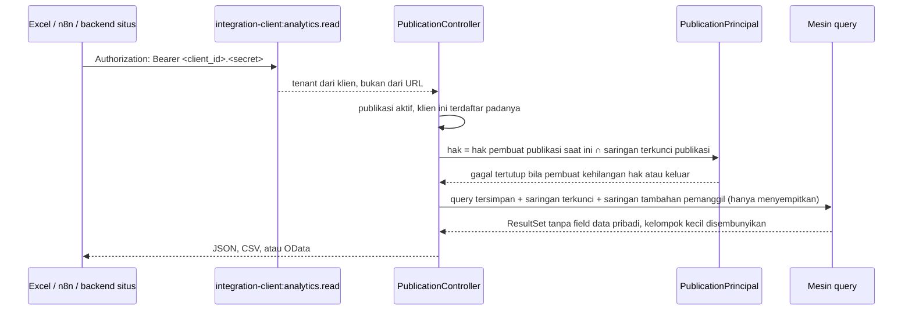

# Arsitektur engine analitik

Bagian dari [engine analitik](/todo/analitik/). Halaman ini menjawab di mana setiap bagian tinggal,
bagaimana satu permintaan mengalir, dan apa yang menjaga batasnya. Bentuk kontrak dataset ada di
[model semantik](/todo/analitik/model-semantik); bentuk query di [mesin query](/todo/analitik/mesin-query).

## Letak di lapis Core

| Bagian | Namespace | Kenapa di sana |
| --- | --- | --- |
| Engine (registry, query, compiler, eksekusi, keamanan baca, cache, dasbor, publikasi, embed) | `App\Platform\Analytics` | Mesin tanpa kosakata bisnis, dipakai semua module — persis definisi lapis Platform di [lapis Core](/todo/lapis-core/) |
| Kontrak yang dipenuhi module | `App\Platform\Modules\Contracts\Analytics` | Module hanya boleh menyebut `App\Platform\Modules\Contracts`; penjaganya `ModuleNamespaceBoundaryTest`, yang menerima sub-namespace karena mencocokkan awalan |
| Pembantu kebijakan data yang dipakai bersama | `App\Platform\Modules\Contracts\DataPolicyFilter` | Satu aturan untuk module dan Core, supaya analitik dan layar module tidak pernah menyaring berbeda (R-11) |
| Kelas dataset | `Modules\<Penerbit>\<Modul>\Analytics` | Milik module; module yang tahu tabelnya |
| Dimensi bersama milik Foundation (vendor, nanti item) | didaftarkan penyedia layanan fitur Foundation ke registry Platform | Platform tidak boleh menyebut Foundation (`LayerDirectionBoundaryTest`); arah sebaliknya boleh |
| Layar | `apps/core/resources/js/pages/platform/analytics/*`, komponen di `resources/js/components/analytics/*` | Halaman Core di Shell; tidak dibuat per module |
| Halaman embed | entri Vite tersendiri `resources/js/embed/analytics.tsx` | Tanpa Shell, tanpa sesi, tanpa cookie |

Engine **bukan module**. Ia tidak punya `app.yaml`, tidak dipasang per tenant, dan tidak punya
awalan tabel module. Tabelnya berawalan `analytics_`, tabel Core biasa.

## Komponen

| Komponen | Kelas utama | Tanggung jawab | Area |
| --- | --- | --- | --- |
| Satu query | `Actions\RunQuery` | Registry, akses, validasi, lalu compile dan eksekusi di dalam `TenantRunner::runFor()`; dipakai setiap jalur masuk, tempat cache dan log menumpang | 0, 9 |
| Registry dataset | `Datasets\DatasetRegistry`, `Datasets\DatasetValidator` | Mengumpulkan dataset dari module, memvalidasi definisinya dua tahap, menyaring menurut module terpasang dan berlisensi | 0 (tipis), 1 |
| Katalog untuk layar | `Datasets\DatasetCatalog` | Field dan measure yang boleh dilihat principal ini (izin, data pribadi) | 6 |
| Dimensi bersama | `Datasets\SharedDimensionRegistry` | Unit kerja, legal entity, pengguna, vendor, mata uang: label (area 1); periode, pemilih, dan drill-across (area 14) | 1, 14 |
| Model query | `Query\AnalyticsQuery`, `Query\QueryParser`, `Query\QueryNormalizer`, `Query\QueryValidator` | JSON → objek tak berubah → bentuk normal; batas jumlah; hanya anggota dataset | 0 (tipis), 2 |
| Rentang relatif | `Query\RelativeRange` | Token `@this_month` dan kawan-kawan → rentang tanggal menurut zona pengguna | 2 |
| Titik panggil data pribadi | `Query\FieldUseGate` | Antarmuka yang dipanggil `QueryValidator` dengan semua kolom yang dipakai query; `Security\PersonalDataGate` (area 4) mengimplementasikannya | 2, 4 |
| Compiler | `Query\QueryCompiler`, `Query\JoinPlanner`, `Query\MeasureExpression`, `Query\TimeBucketExpression`, `Query\IsNullExpression` | Objek query → query builder Laravel di atas model module, tanpa SQL mentah (lihat [mesin query](/todo/analitik/mesin-query#dari-objek-ke-sql)); query total ikut disusun di sini | 0 (tipis), 3 |
| Eksekusi | `Query\QueryExecutor` | Transaksi baca-saja, batas waktu, batas baris, pemetaan galat; `explain()` untuk `analytics:explain` | 0, 3 |
| Hasil | `Query\ResultSet`, `Query\ResultColumn`, `Query\LabelResolver`, `Query\GapFiller` | Kolom bertipe, label, deret waktu tanpa celah, total | 0 (tipis), 3 |
| Principal | `Security\AnalyticsPrincipal` + `UserPrincipal`, `PublicationPrincipal` | Siapa yang bertanya: tenant, izin, hibah kebijakan, hak data pribadi, zona waktu | 0 (tipis), 4 |
| Akses dataset | `Security\DatasetAccess` | Module terpasang dan berlisensi (`LaunchableAppCatalog::readyModules()`), lalu permission baca resource | 0 (tipis), 4 |
| Kebijakan data | `Security\DataPolicyScope` → `Contracts\DataPolicyFilter` | Hibah → predikat SQL pada kolom yang dinyatakan dataset, lalu saringan terkunci principal | 4 |
| Data pribadi | `Security\PersonalDataGate` | Menyembunyikan dan menolak field data pribadi | 4 |
| Sidik jari scope | `Security\ScopeFingerprint` | Kunci cache yang memisahkan pengguna dengan jangkauan berbeda | 4, 9 |
| Cache | `Cache\QueryCache` | Hasil di tabel tenant, kunci terhadap serbuan, TTL | 9 |
| Log | `Support\QueryLog` | Satu baris per query: sumber, durasi, baris, status | 9 |
| Dasbor | `Models\Dashboard`, `Models\Widget`, `Models\SavedQuery`, `Dashboards\*`, `Http\Controllers\*`, `Http\Presenters\DashboardPresenter` | Penyimpanan, aturan berbagi, pemeriksaan widget, dan API layar | 6 |
| Template | `Contracts\Analytics\DashboardTemplates` + `Templates\TemplateInstaller` | Template bawaan module → dasbor tenant | 18 |
| Publikasi | `Models\Publication`, `External\PublicationController` | Query tersimpan atau dasbor yang dibuka ke luar | 15 |
| Feed OData | `External\OData\*` | `$metadata`, entity set, `$filter` → query analitik | 16 |
| Embed | `Embed\EmbedTokenIssuer`, `Embed\AuthenticateEmbedToken`, `Embed\EmbedPageController` | Token, halaman tanpa Shell, CSP | 17 |
| Rumus | `Query\Formula\*` | Bahasa rumus → SQL | 13 |
| Ringkasan | `Rollups\*` | Pra-agregasi per tenant (fase 3) | 21 |

## Satu permintaan widget, dari klik sampai angka

```mermaid
sequenceDiagram
    participant UI as Layar dasbor
    participant C as WidgetDataController
    participant P as UserPrincipal
    participant R as DatasetRegistry
    participant V as QueryValidator
    participant K as QueryCache
    participant X as QueryCompiler + Executor
    participant DB as Database tenant

    UI->>C: GET /api/v1/analytics/widgets/{id}/data?slicers=…
    C->>P: dari keanggotaan sesi (izin, hibah, zona waktu)
    C->>R: dataset widget, hanya bila module terpasang
    C->>V: query widget + slicer → AnalyticsQuery tervalidasi
    V-->>C: tolak bila field tidak dikenal, data pribadi, atau melebihi batas
    C->>K: kunci = tenant + dataset@versi + query + sidik jari scope + zona
    alt ada di cache
        K-->>C: ResultSet
    else belum
        C->>X: compile di dalam TenantRunner::runFor(tenant)
        X->>DB: BEGIN; SET TRANSACTION READ ONLY; SET LOCAL statement_timeout
        X->>DB: SELECT … FROM tabel module (scope tenant + kebijakan + saringan) GROUP BY …
        DB-->>X: baris
        X->>DB: ROLLBACK
        X-->>C: ResultSet (label, celah waktu, total)
        C->>K: simpan dengan TTL widget
    end
    C-->>UI: kolom + baris + meta (cached, generated_at, truncated)
```

Empat hal pada diagram itu yang paling mudah salah:

1. **Query dijalankan di dalam `TenantRunner::runFor()`.** Model module memakai `TenantScope`, yang
   **gagal tertutup** bila tenant belum terikat. Rute Core (`/api/v1/...`) tidak melewati
   `ResolveModuleContext`, jadi tidak ada yang mengikat tenant untuk model module kecuali engine
   sendiri. `ReportSource::forModule()` menempuh jalan yang sama.
2. **Transaksi diakhiri `ROLLBACK`, bukan `COMMIT`.** Query baca tidak butuh commit, dan rollback
   juga membatalkan `SET LOCAL` di dalam savepoint — penting saat engine dipanggil di dalam transaksi
   lain, misalnya di test. Rinciannya di [mesin query](/todo/analitik/mesin-query#eksekusi-baca-saja).
3. **Kunci cache memuat sidik jari scope**, bukan id pengguna. Dua pengguna dengan hibah yang sama
   berbagi cache; dua pengguna dengan hibah berbeda tidak pernah.
4. **Cache tinggal di database tenant.** Store cache bawaan Laravel menunjuk database pusat (lihat
   `EnvironmentConnection::pins()`), jadi menyimpan hasil di sana menyalin data tenant ber-database
   sendiri ke database pusat (KA-18).

## Publikasi dibaca dari luar



Klien integrasi bukan anggota tenant (`IntegrationClientAccounts`: akun aplikasinya tidak punya
keanggotaan dan peran). Karena itu pemanggil luar tidak menjalankan query atas namanya sendiri; ia
membaca **publikasi** yang dibuat pengguna tenant, dan jangkauannya adalah jangkauan pembuatnya yang
dipersempit saringan terkunci (KA-11). Rinciannya di [akses luar](/todo/analitik/akses-luar).

## Tenant, environment, dan koneksi

- **Koneksi.** `ResolveEnvironment` menukar `database.default` ke database environment tenant pada
  setiap permintaan HTTP. Model module memakai koneksi bawaan, jadi query analitik otomatis berjalan
  di database tenant yang benar. Engine tidak membuka koneksi sendiri dan tidak menyimpan nama
  koneksi.
- **Job dan jadwal.** Job antrean dan perintah terjadwal belum membawa environment-nya
  ([TODO database sendiri](/todo/produksi-database-sendiri/TODO), butir 4.1 dan 4.2). Fase 1 dan 2
  tidak punya job analitik selain pembersihan; peringatan dan kirim terjadwal di fase 3 menunggu
  kedua butir itu.
- **Tabel `analytics_*` adalah tabel tenant** (`tenant_id`, kolom jejak, `version`, klasifikasi).
  Mereka tinggal di database environment, bukan di database pusat, sama seperti `report_presets`.
- **Tidak ada analitik lintas tenant** (KA-23). Tidak ada satu pun jalur yang menerima `tenant_id`
  dari pemanggil.

## Join, label, dan lintas module

| Kebutuhan | Cara | Batas |
| --- | --- | --- |
| Field dari tabel lain milik module yang sama | Join yang dinyatakan dataset | Join selalu membawa `tenant_id` sama dan `deleted_at IS NULL` tabel yang di-join |
| Label rujukan milik module | Join label yang dinyatakan dataset (`reference(..., label: 'nama')`) | Dikelompokkan bersama id-nya |
| Label rujukan milik Core (unit kerja, legal entity, pengguna) | Resolver dimensi bersama, setelah agregasi, sekali per himpunan id | Layar menampilkan nama, tidak pernah ULID; id tetap dikirim untuk drill dan saringan |
| Angka dari dua module dalam satu widget | Drill-across: setiap dataset dikelompokkan menurut dimensi bersama yang sama, lalu digabung menurut nilai dimensi itu (area 14) | Hanya bila kedua module terpasang; tidak ada join baris lintas module |

Join baris lintas module tidak ditawarkan bukan karena Core dilarang membacanya — Core boleh — tetapi
karena **tidak ada yang berhak menyatakannya**. Kelas dataset module A yang menyebut model module B
melanggar `ModuleNamespaceBoundaryTest`, dan Core yang menyatakannya berarti menulis mati nama
module di Core. Dimensi bersama menyelesaikan kebutuhan yang sama tanpa salah satu pelanggaran itu.

## Susunan berkas

Berkas bertanda `(0)` sudah ada sejak kerangka berjalan (area 0), dalam bentuk tipis yang diperluas
area pemiliknya.

```text
apps/core/app/Platform/Analytics/
├── AnalyticsServiceProvider.php        (9) limiter `analytics-interactive`; rute embed (17)
├── Actions/
│   └── RunQuery.php                    (0) satu query dari ujung ke ujung, untuk setiap jalur masuk
├── Datasets/
│   ├── DatasetRegistry.php             (0, 1) implements Contracts\Analytics\Datasets
│   ├── CompiledDataset.php  CompiledMeasure.php  InvalidDatasetDefinition.php      (0, 1)
│   ├── DatasetValidator.php  DeclaredDataset.php                                   (1) aturan definisi
│   ├── CompiledJoin.php  CompiledReference.php                                     (1)
│   ├── DatasetCatalog.php              (6) katalog per principal
│   ├── SharedDimensionRegistry.php     (1) implements Contracts\Analytics\SharedDimensions
│   └── OrganizationLabels.php  MemberLabels.php                                    (1) resolver milik Platform
├── Query/
│   ├── AnalyticsQuery.php  Dimension.php  TimeRange.php  TimeGranularity.php       (0)
│   ├── QueryParser.php  QueryValidator.php                                        (0)
│   ├── QueryNormalizer.php  RelativeRange.php  FieldUseGate.php                   (2)
│   ├── QueryCompiler.php  MeasureExpression.php  CompiledQuery.php                (0, 3)
│   ├── JoinPlanner.php  TimeBucketExpression.php  IsNullExpression.php            (3)
│   ├── QueryExecutor.php                                                          (0, 3)
│   ├── ResultSet.php  ResultColumn.php  AnalyticsQueryException.php               (0, 3)
│   ├── LabelResolver.php  GapFiller.php                                           (3)
│   └── Formula/            Lexer.php  Parser.php  Node/*  SqlEmitter.php      (fase 2)
├── Security/
│   ├── AnalyticsPrincipal.php  UserPrincipal.php  DatasetAccess.php               (0)
│   ├── DataPolicyScope.php  ScopeFingerprint.php                                  (4)
│   ├── PersonalDataGate.php                                                   (4)
│   ├── PublicationPrincipal.php                                               (fase 2)
├── Cache/QueryCache.php                (9) cache hasil di tabel database tenant
├── Support/QueryLog.php  QuerySlots.php (9) log query tersamar; jatah query bersamaan per tenant
├── Dashboards/
│   ├── DashboardAccess.php             (6) aturan berbagi dasbor dan query tersimpan (K-25)
│   ├── StoredQuery.php                 (6) query widget dan query tersimpan: periksa, ringkas, baca + `renamed`
│   └── WidgetDefinition.php            (6) aturan `visual` per jenis widget
├── Models/
│   ├── Dashboard.php  Widget.php  SavedQuery.php  BindsWithinActiveTenant.php     (6)
│   ├── QueryLogEntry.php  QueryCacheEntry.php                                     (9)
│   ├── Publication.php  EmbedToken.php                                        (fase 2)
├── Http/
│   ├── Controllers/  QueryController  ExploreController                           (0)
│   │                 DatasetController  DashboardController  DashboardPageController
│   │                 WidgetController  WidgetDataController  SavedQueryController  (6)
│   ├── Middleware/   (EnsureAnalyticsEnabled area 0 dibuang area 4 bersama saklarnya)
│   ├── Requests/     (area 6 memvalidasi di controller, seperti preset laporan)
│   └── Presenters/   DashboardPresenter (6)   (ResultSetPresenter tidak dibuat: `ResultSet::toArray()`)
├── External/       PublicationController.php  OData/*                         (fase 2)
├── Embed/          EmbedTokenIssuer.php  AuthenticateEmbedToken.php  EmbedPageController.php
├── Templates/      TemplateInstaller.php                                      (fase 2)
├── Console/        AnalyticsDatasetsCommand.php (1)  AnalyticsExplainCommand.php (3)
│                   PurgeAnalyticsCache.php (belum dibuat: menunggu perintah terjadwal per environment)
└── Rollups/        (fase 3)

apps/core/app/Platform/Modules/Contracts/
├── DataPolicyFilter.php                                                       (0)
└── Analytics/
    ├── Dataset.php  Datasets.php  DatasetDefinition.php                       (0)
    ├── Aggregate.php  MeasureFormat.php                                       (0)
    ├── SharedDimension.php  SharedDimensions.php  SharedDimensionResolver.php  (1)
    └── DashboardTemplate.php  DashboardTemplates.php                          (fase 2)

apps/core/app/Foundation/Vendor/Support/VendorLabels.php,
apps/core/app/Foundation/Currency/Support/CurrencyLabels.php   (1) didaftarkan penyedia layanan fiturnya
                                                               ke SharedDimensions

apps/core/config/analytics.php                                                 (0)
apps/core/resources/schemas/analytics-query.schema.json                        (2) sumber bentuk query
apps/core/routes/analytics.php     (0) di-require dari routes/web.php, grup `auth` (bukan grup `api/v1`):
                                   halaman `/analytics/...` dan API `api/v1/analytics/...` di satu berkas
apps/core/database/migrations/2026_10_xx_*_analytics_*.php
apps/core/resources/js/
├── pages/platform/analytics/  explore.tsx (0, sementara)  index.tsx  dashboard.tsx  publications.tsx
├── components/analytics/      widget-frame.tsx  kpi-tile.tsx  chart-widget.tsx  table-widget.tsx
│                              widget-builder.tsx  filter-editor.tsx  dataset-picker.tsx …
├── lib/analytics/             types.ts (0)  format.ts (0)  query.ts (2)  api.ts
└── embed/analytics.tsx                                                         (fase 2)

modules/apperp/management-aset/src/Analytics/
├── AssetRegisterDataset.php (0)  WorkOrderDataset.php  DisposalDataset.php …
└── (didaftarkan satu baris di ModuleServiceProvider::boot)
```

Nama dan letak di atas adalah usulan yang mengikat antar-area: area lain menulis kode yang
memanggilnya. Mengubahnya berarti memperbarui halaman ini dalam pull request yang sama.

## CompiledDataset

`Datasets\CompiledDataset` adalah dataset sesudah dibaca registry, dan satu-satunya bentuk dataset
yang dipegang compiler, keamanan baca, dan API layar. Area 1 dan 4 sama-sama memperluasnya; nama
method di bawah sudah dipakai kode area 0 dan tidak diganti tanpa memperbarui halaman ini.

| Anggota | Isi | Area |
| --- | --- | --- |
| `code`, `caption`, `moduleId`, `version` | Kode dataset (berawalan id module), nama tampilan, module pemilik, versi definisi | 0 |
| `description`, `recordRoute` | Penjelasan untuk katalog; alamat layar record dengan `{id}`, atau null | 1 |
| `model`, `table` | Model dasar module dan nama tabelnya; tabel dasar tidak pernah diberi alias. Dataset bersumber query: model query sumbernya, dan `table` = `SOURCE_ALIAS` (`base`) | 0, 1 |
| `permission` | Permission baca resource module (KA-15) | 0 |
| `policy` | `{code, legal_entity, operating_unit}` atau null; kolom kebijakan tanpa awalan tabel, atau `alias.kolom` untuk tabel join | 0, 1 |
| `baseQuery()` | `Model::query()` — `TenantScope` dan `SoftDeletes` ikut, dipasang saat query dijalankan. Dataset bersumber query: `FROM (<sumber>) AS base WHERE base.tenant_id = ?`, gagal tertutup tanpa tenant aktif | 0, 1 |
| `isQuerySource()` | Dataset bersumber query (`fromQuery()`) | 1 |
| `fields()`, `hasField($key)`, `filterField($key)` | Field sebagai `FilterField` K-30, kolomnya berkualifikasi nama tabel (atau alias join, atau `base`) | 0 |
| `classification($key)` | `DataClass` kolom field; tidak pernah `AccountData` atau belum diklasifikasi — bahan gerbang data pribadi area 4 | 1 |
| `columnType($key)` | Nama tipe PostgreSQL kolom field (`int4`, `numeric`, `varchar`, `date`, …) | 1 |
| `timeType($key)` | `date`, `timestamp` (berisi UTC), atau `timestamptz` untuk field waktu — bahan SQL ember waktu area 3 | 1 |
| `sharedDimension($key)` | `SharedDimension` yang ditunjuk field, atau null; labelnya dari `SharedDimensionRegistry::labels()` sesudah query | 1 |
| `reference($key)`, `labelColumnsFor($key)` | `CompiledReference` (tabel master, alias join label `r0…`, kolom lokal, `id`, label, kode) dan kolom label berkualifikasi `['label' => 'r0.nama', 'code' => 'r0.kode']`; kosong untuk field selain rujukan module | 1 |
| `joins()` | `CompiledJoin` per alias: model, tabel, kolom lokal dan tujuan berkualifikasi, `includeArchived`, `archivable` (model ber-`SoftDeletes`) | 1 |
| `measures()`, `hasMeasure($key)`, `measure($key)` | `CompiledMeasure`: `key`, `caption`, `aggregate`, `field`, `format`, `currency`, `unit`, `where`; `field`/`currency`/`unit` kunci field, kolom tabel dasar, atau `alias.kolom` | 0, 1 |
| `qualified($name)` | Kolom berkualifikasi untuk kunci field, nama kolom tabel dasar, `alias.kolom` join, atau `<tabel>.<kolom>` yang sudah berkualifikasi | 0, 1 |
| `times()`, `defaultTime()` | Field waktu dan field waktu utama | 0 |
| `renamed()` | Peta kunci lama ke kunci baru dari `version()`, untuk membaca widget lama (area 6.5) | 1 |
| `hash()` | Sidik jari sha256 definisi sesudah dibaca terhadap database ini (64 heksadesimal), untuk kunci cache area 9 | 1 |

**Yang dibaca `QueryValidator` (area 2)** dari tabel di atas: `hasField()`, `hasMeasure()`, `times()`, dan
`defaultTime()`; ember waktu dan rentang waktu hanya sah pada kunci yang ada di `times()`. Kebutuhan
`FieldUseGate` area 4 — kolom mana yang memuat data pribadi — dijawab `classification(string $key): DataClass`
yang dikirim area 1: melempar `LogicException` untuk kunci tak dikenal seperti `filterField()`, dan diisi
validator dari klasifikasi model pemilik kolom (`COLUMN_CLASSIFICATION`, kolom jejak, lalu
`#[DataClassification]`) sekali per kompilasi dataset; field dataset bersumber query menyatakan
klasifikasinya sendiri.

**Yang dibaca compiler dan hasil (area 3):** `baseQuery()`, `qualified()`, `filterField()`, `joins()`,
`reference()`, `labelColumnsFor()` (hanya `label`; kode rujukan belum dikirim di hasil), `timeType()`,
`sharedDimension()`, `measure()`, `policy`, dan `defaultTime()`. Tidak ada method baru yang diminta.
Yang dipegang area lain dari area 3: `CompiledQuery` (`builder`, `totals`, `columns`, `limit`) untuk
memeriksa SQL tanpa membaca data; `ResultSet::toArray()` sebagai bentuk JSON hasil; dan titik pasang cache
dan log area 9 di `RunQuery`, di sekeliling isi closure `runFor()` sesudah pemeriksaan hak. Jangkauan
principal (`DataPolicyScope`: kebijakan data lalu saringan terkunci) dipasang di `QueryCompiler::filtered()`,
satu langkah untuk query hasil dan query total; kolom kebijakan dan kolom saringan terkunci ikut menentukan
join lewat `QueryCompiler::filterColumns()`.

Registry membaca **definisi** sekali per proses (tahap tanpa database, `DatasetValidator::declare()`) dan
**hasil kompilasi** sekali per database (`DatasetValidator::compile()`, dikunci alamat, nama database, dan
`search_path` koneksi), karena satu proses — terutama pekerja FrankenPHP — melayani beberapa database
environment. Yang disimpan hanya definisi dan skema, tidak pernah data tenant: pemasangan module per
tenant dan lisensi dibaca ulang di setiap `forTenant()`. Dataset rusak disimpan sebagai rusak (peringatan
sekali per proses); dataset yang tabelnya belum ada di database itu tidak disimpan, sehingga module yang
dipasang sesudahnya di proses yang sama langsung terbaca. `find()` dan `all()` tidak menyaring pemasangan;
`forTenant()` menyaring module terpasang (catatan `core_module_installations`) dan berlisensi, lewat
`LaunchableAppCatalog::readyModules()` — penentu yang sama dengan peluncur dan `DatasetAccess` (area 4).
`diagnose()` memeriksa ulang setiap dataset terdaftar tanpa simpanan dan tanpa log, untuk
`analytics:datasets` dan `AnalyticsDatasetsBoundaryTest`.

## Konfigurasi

`apps/core/config/analytics.php`, dengan variabel env berawalan `COREERP_ANALYTICS_`. Kunci bertanda
`(0)` sudah ada; yang lain ditambahkan area pemiliknya.

| Kunci | Bawaan | Gunanya |
| --- | --- | --- |
| `timeouts.interactive_ms` (0) | 8000 | `statement_timeout` untuk layar |
| `timeouts.external_ms` | 20000 | Untuk publikasi, OData, embed |
| `timeouts.job_ms` | 60000 | Untuk job (fase 3) |
| `limits.rows_interactive` (0) | 5000 | Baris hasil kelompok dari layar; juga batas tertinggi `limit` |
| `limits.rows_external_page` | 5000 | Baris per halaman luar |
| `limits.dimensions` (2) | 4 | Dimensi per query |
| `limits.measures` (2) | 12 | Measure per query |
| `limits.filters` (2) | 20 | Saringan per query |
| `limits.sort` (2) | 3 | Kunci urutan per query |
| `limits.widgets_per_dashboard` | 24 | |
| `limits.concurrent_per_tenant` (9) | 4 | Query analitik yang dihitung bersamaan per tenant, untuk seluruh instance (store kunci bersama) |
| `cache.default_ttl_seconds` (9) | 300 | TTL widget bawaan; di bawah 60 dinaikkan ke 60, `0` tanpa cache |
| `cache.max_payload_kb` (9) | 512 | Hasil yang sesudah dikompres lebih besar tidak di-cache |
| `rate_limits.interactive_per_minute` (9) | 120 | Limiter `analytics-interactive`, per pengguna |
| `log.retention_days` (9) | 90 | Bawaan retensi `analytics_query_log` (PQ-05); admin tenant mengubahnya, minimum 7 |
| `embed.token_ttl_seconds` | 600 | KA-10 |

Nilai on-prem satu container sengaja rendah. Menaikkannya keputusan operator, bukan bawaan.

## Mode gagal

| Keadaan | Jawaban | Kenapa begitu |
| --- | --- | --- |
| Module dataset tidak terpasang untuk tenant | Dataset tidak ada di katalog; widget lama tampil "Data ini berasal dari module yang tidak terpasang" | Katalog, hak, dan pemasangan tiga fakta berbeda |
| Pengguna kehilangan permission baca resource | Widget "Anda tidak punya akses ke data ini" | Widget kosong terbaca sebagai nol |
| Hibah kebijakan data kosong | Nol baris | Gagal tertutup, sama dengan `OrganizationScope::query()` |
| Field hilang dari dataset versi baru, tanpa peta nama | Widget "Kolom X sudah tidak tersedia"; penyusun diminta memperbaiki | Rusak terang lebih baik dari salah diam-diam |
| `statement_timeout` tercapai (`57014`) | 422 `analytics.query_timeout` dengan saran mempersempit saringan atau memakai ringkasan | Query berat tidak boleh menahan koneksi |
| Hasil melewati batas baris | Hasil terpotong, `meta.truncated = true`, widget menandainya | Lebih jujur daripada diam-diam memotong |
| Batas query bersamaan tenant tercapai | 429 dengan `Retry-After` | Satu tenant tidak menghabiskan proses server on-prem |
| Pembuat publikasi kehilangan hak | Publikasi menjawab 403 `analytics.publication_suspended` | Hak publikasi tidak boleh hidup lebih lama dari pembuatnya |
| Token embed kedaluwarsa | 401; halaman embed meminta token baru lewat `postMessage` | Token pendek adalah penjaganya |

## Penjaga batas yang baru

Ditambahkan di `apps/core/tests/Feature/Boundary/` (area 0, 1, dan 4):

- **`AnalyticsBoundaryTest`** membaca berkas di `app/Platform/Analytics` dan menolak: nama namespace
  `Modules\` dan nama tabel yang berawalan salah satu awalan module — dibaca dari `table_prefix` setiap
  `app.yaml`, termasuk module contoh bahan uji — termasuk di komentar (area 0); lalu
  `DB::table(`/`DB::select…(` di luar `SQL_COMPOSERS`: `Query/QueryCompiler.php`, `Cache/QueryCache.php`,
  dan `Support/QueryLog.php` (area 1).
  Alasannya: Core boleh membaca tabel module, tetapi hanya lewat definisi yang didaftarkan module,
  tidak pernah dengan nama yang ditulis mati.
- **`AnalyticsDatasetsBoundaryTest`** menjalankan `DatasetValidator` atas seluruh dataset yang
  terdaftar di suite — module produk dan dataset bahan uji `contoh-a` — lewat
  `DatasetRegistry::diagnose()`: kolom dan join ada di database, kolom kebijakan ada, field
  berklasifikasi, permission dan kebijakan ada di manifest module, kode dataset berawalan id module
  dan unik (area 1).

Penjaga yang sudah ada tetap berlaku: `DataClassificationBoundaryTest` dan `AuditColumnsBoundaryTest`
untuk tabel `analytics_*`, `ModuleNamespaceBoundaryTest` untuk kelas dataset module,
`MigrasiKompatibelMundurTest` untuk setiap migration baru, dan `LayerDirectionBoundaryTest` untuk
`App\Platform\Analytics`.
