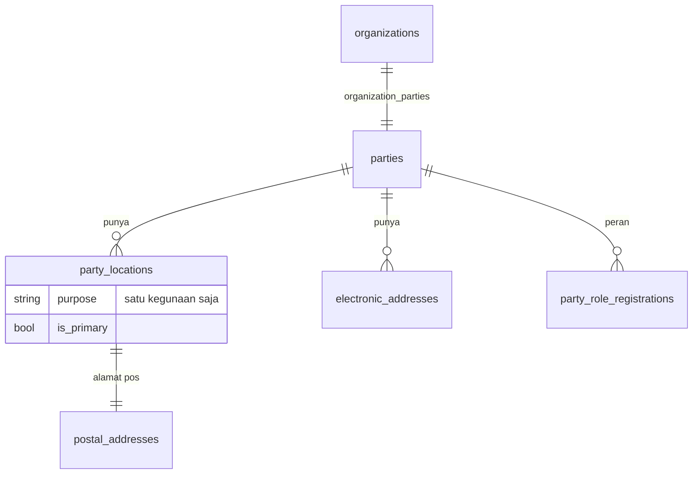
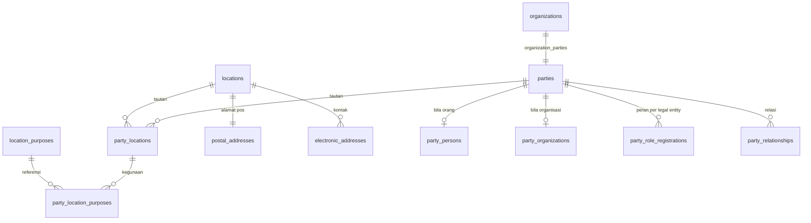

# Buku alamat global: bentuk lokasi, peran, dan relasi

Rencana kerja, bukan desain kanonik. Ditulis 17 September 2026 setelah pemilik produk memutuskan buku
alamat dikerjakan sampai sebentuk **Global Address Book Dynamics 365**, supaya app dan modul yang
menyusul dapat menyambung langsung tanpa membongkar tabelnya lagi.

Desain kanonik yang berlaku hari ini ada di [Buku alamat: party, alamat, dan kontak](../../dev/24-global-address-book.md).
Halaman ini **mengusulkan perubahan atasnya**; ketika sebuah tahap selesai, halaman kanonik itu yang
diperbarui, bukan halaman ini. Ia juga menutup dua temuan audit yang masih terbuka: `ORG-01` pada
[Organisasi dan konsolidasi](../general/01-organisasi-dan-konsolidasi.md) dan `PLAT-04` pada
[Layanan platform](../general/04-layanan-platform.md), yang sama-sama berhenti pada "keputusan yang
harus diambil" dan kini sudah diambil.

Ditulis supaya orang atau agen lain dapat mengerjakannya **tanpa ikut percakapan yang melahirkannya**:
setiap keputusan membawa alasannya, dan setiap butir kerja membawa kriteria terima.

::: tip Diperbarui 29 September 2026
Halaman ini tertahan di cabang sejak 17 September, dan main bergerak di bawahnya. Yang berubah sejak itu:
Core sudah menjadi warga katalog dan halamannya dijaga permission `core.*` (Tahap 0 hampir seluruhnya
selesai, lihat [Tahap 0](#tahap-0-core-sebagai-warga-katalog)); vendor milik Core lahir sebagai party
berperan `vendor`, jadi registry peran kini punya penulis; dan pemilik produk menyatakan bentuk F&O tetap
dipakai setelah dibandingkan dengan Business Central (lihat
[Perbandingan dengan Business Central](#perbandingan-dengan-business-central)). OWN-03 dan OWN-05 sudah
diputuskan.
:::

## Pertanyaan yang dijawab halaman ini

- Apa yang sudah berjalan hari ini, dan bagian mana yang hanya tampak ada?
- Kenapa bentuk lokasi diubah **sekarang**, bukan nanti setelah app pelanggan atau pemasok pertama?
- Bagaimana modul (HR, aset, procurement) memakai party tanpa menyalin alamat ke tabelnya sendiri?
- Apa yang terjadi pada master wilayah `ref_*` yang sudah dibangun, dan pada dua tabel negara yang
  sekarang hidup berdampingan?
- Apa saja butir kerjanya, di file mana, dengan urutan apa?

## Keadaan sekarang

Dibaca langsung dari kode pada 17 September 2026, bukan dari dokumen.

| Bagian | Keadaan | Bukti |
| --- | --- | --- |
| `parties`, `party_locations`, `postal_addresses`, `electronic_addresses`, `organization_parties` | Ada dan dipakai | `apps/core/database/migrations/2026_07_27_020000_create_party_and_address_book_tables.php:45-133` |
| Satu-satunya kode yang pernah **membuat** party | Buku alamat organisasi: legal entity dan operating unit | `apps/core/app/Support/AddressBook/OrganizationAddressBook.php:38` |
| Satu-satunya kode yang **membaca** alamat | Identitas cetak, untuk kop dokumen | `apps/core/app/Support/AddressBook/OrganizationAddressBook.php:188-197` |
| `party_role_registrations` | Sejak 22 September punya satu penulis: pembuatan vendor mencatat peran `vendor` per legal entity | `apps/core/app/Actions/Finance/SaveVendor.php` |
| Halaman **Buku Alamat Global** | Mockup: rute tanpa controller, tombol Simpan memanggil `alert`, nomor party diacak di browser | `apps/core/routes/web.php:167`, `apps/core/resources/js/pages/settings/global-address-book/index.tsx:189,215` |
| Bagian **Relasi** pada halaman itu | Hanya state React, tidak ada tabelnya | `apps/core/resources/js/components/global-address-book/relationship-section.tsx` |
| `party_types` (5 kode: person, organization, legal_entity, team, operating_unit) | Ada sebagai referensi, tidak dirujuk `parties.type` | `apps/core/database/migrations/2026_08_24_100000_create_party_types_table.php:20-26` |
| Worker di HR | Menyimpan nama dan email sendiri, tanpa `party_id` | `modules/apperp/human-resources/database/migrations/2026_07_30_120000_create_human_resources_tables.php:11-23` |
| Master wilayah `ref_countries` → `ref_villages`, beserta importer, kode pos, dan halaman **Address setup** | Lengkap dan berjalan | `apps/core/database/migrations/2026_08_24_110000_create_address_hierarchy_tables.php`, `apps/core/routes/web.php:177-194` |
| Alamat pos terhadap master wilayah itu | Tidak tersambung: provinsi, kota, dan kecamatan disimpan sebagai teks bebas | `…2026_07_27_020000_…:84-90` |
| Tabel negara | **Dua**: `country_regions` (dirujuk `postal_addresses`) dan `ref_countries` (dipakai master wilayah) | `…2026_07_27_020000_…:38`, `…2026_08_24_110000_…:11` |

Ringkasnya: yang berjalan adalah **buku alamat organisasi kita sendiri**, ditambah vendor milik Core yang
memakai party. Sisanya tabel kosong, layar palsu, dan satu master wilayah yang tidak pernah bertemu alamat.
Tabel di atas dibaca 17 September; baris vendor ditambahkan 29 September. Sebelum GAB-00, baca ulang dari
kode.

### Bentuk sekarang

Tiga hal membedakannya dari Dynamics 365, dan ketiganya menempel pada satu tabel:

1. **Lokasi dimiliki tepat satu party.** `party_locations.party_id` membuat alamat tidak dapat dipakai
   bersama. Dua pihak di gedung yang sama menyimpan alamat dua kali, dan mengubah satu tidak mengubah
   yang lain.
2. **Kontak menempel ke party, bukan ke lokasi.** Tidak ada cara menyatakan "nomor ini milik cabang
   Bandung".
3. **Satu lokasi hanya punya satu kegunaan.** Alamat yang dipakai untuk kirim sekaligus tagih harus
   dimasukkan dua kali, dan keduanya lalu berubah sendiri-sendiri.

## Kenapa dikerjakan sekarang

**Karena tabelnya praktis masih kosong.** Satu-satunya kode yang pernah membuat party adalah buku
alamat organisasi, jadi isi `parties` hari ini hanya legal entity dan operating unit milik tenant
sendiri — puluhan baris, bukan puluhan ribu. Selama itu masih benar, perubahan bentuk di bawah adalah
mengubah tabel, bukan memigrasi data. Begitu app pelanggan, pemasok, atau pasien pertama menulis ke
sana, pekerjaan yang sama berubah menjadi migrasi data yang harus benar pada percobaan pertama.

Dua alasan lain menguatkannya:

- **Modul berikutnya sudah mengantre.** Procurement butuh alamat pemasok, alamat kirim, dan alamat
  tagih — tiga kegunaan pada satu pihak sebelum app itu punya fitur apa pun. Kalau bentuknya belum
  benar saat mereka datang, mereka akan menyalin alamat ke tabel sendiri, dan itu persis yang
  `PLAT-04` peringatkan.
- **Audit fondasi berhenti menunggu keputusan ini**, bukan menunggu kode. `ORG-01` mencatat dua
  rencana yang bertabrakan: alamat sebagai kolom pada legal entity, versus satu direktori bersama ala
  D365. Keputusan pemilik produk 17 September 2026: **direktori bersama**, mengikuti diagram D365.

## Perbandingan dengan Business Central

Analisa gap fase 1 memakai Business Central sebagai pembanding, jadi pertanyaan "kenapa buku alamat
tidak mengikuti BC" pasti datang. Dibaca dari source Base App (`BCApps`, 29 September 2026):

| Hal | Business Central | Rencana ini (F&O) |
| --- | --- | --- |
| Letak alamat | Kolom langsung di `Customer`, `Vendor`, `Company Information`, dan `Contact` | Tabel `locations` bersama, ditautkan ke party |
| Alamat tambahan | Satu tabel per pemilik: `Ship-to Address` (pelanggan), `Order Address` (vendor), `Alternative Address` (pegawai); isinya salinan | Satu lokasi dengan banyak kegunaan |
| Identitas bersama | `Contact` ditautkan ke customer, vendor, bank, atau pegawai lewat `Contact Business Relation` | `parties` + `party_role_registrations` |
| Negara | Satu tabel `Country/Region`, dengan `Address Format` per negara | Satu tabel `country_regions` (GAB-24) |
| Kode pos | `Post Code`: kode, kota, county, negara, **dan zona waktu** | Master wilayah `ref_*` sampai kelurahan |
| Siapa mengubah negara dan kode pos | Setiap company mengubah tabelnya sendiri | Dikunci dari tenant (OWN-05) |

**Bentuk F&O tetap dipakai** — keputusan pemilik produk, 29 September 2026. Alasannya: vendor milik Core
sudah lahir sebagai party, dan pola BC yang menyalin alamat ke setiap tabel pemilik persis masalah yang
diperingatkan `PLAT-04`. Dua hal diambil dari BC karena tidak bertentangan:

- **Format alamat per negara** (`Address Format`) — padanannya sudah ada: `ref_address_parameters`
  disimpan per negara. Yang belum, memakainya untuk bentuk cetak alamat (GAB-23).
- **Zona waktu dari wilayah** (`Post Code."Time Zone"`) — master wilayah sudah menyimpan zona per wilayah;
  zona entitas legal (area 7 analisa gap, K-10) dapat diusulkan dari alamatnya begitu alamat Indonesia
  menunjuk wilayah (GAB-23). Hanya usulan: zona tetap dipilih manusia.

Master wilayah sampai kelurahan tidak punya padanan di keduanya. Ia kebutuhan alamat Indonesia, bukan
tiruan.

## Keputusan

| Keputusan | Diambil | Yang dibeli | Yang dibayar |
| --- | --- | --- | --- |
| Bentuk acuan | **Global Address Book Dynamics 365**: satu direktori bersama; party adalah identitas, lokasi adalah tempat | Alamat diubah sekali dan seluruh peran ikut berubah; tidak ada app yang menyimpan alamat sendiri | Tabelnya lebih banyak daripada sekadar "kolom alamat di tabel pemasok" |
| Pemilik party | **Core**. App `business-partner` dihapus dari repo pada 17 September 2026 | Legal entity, operating unit, pegawai, pemasok, dan pasien hidup di satu direktori; identitas organisasi memang sudah di Core | Modul bisnis memiliki **peran** pemasok/pelanggan beserta prosesnya, dan harus memanggil buku alamat untuk identitasnya |
| Lokasi | **Berdiri sendiri** (`locations`), ditautkan ke party lewat tabel penghubung | Satu gedung dapat dipakai beberapa pihak; pindah kantor cukup satu baris | Satu tabel dan satu join tambahan pada setiap pembacaan alamat |
| Kegunaan alamat | **Boleh lebih dari satu**, disimpan pada tautan party–lokasi | Satu alamat bisa sekaligus alamat bisnis, kirim, dan tagih | Kegunaan tidak lagi satu kolom yang terbaca sekilas |
| Kontak elektronik | **Menempel ke lokasi**, seperti D365 | Telepon cabang melekat pada cabangnya | Kontak pada lokasi yang dipakai bersama otomatis ikut terbagi |
| Penanda utama | Satu **lokasi utama per party** (tetap dijaga partial unique index), satu **kontak utama per lokasi per jenis**; kontak utama sebuah party diturunkan dari lokasi utamanya | Arti "utama" bagi kop dokumen tidak berubah | Kontak yang hanya ada di lokasi bukan-utama tidak akan tercetak di kop |
| Jenis party | `parties.type` **dirujuk ke `party_types`**, dan legal entity serta operating unit memakai jenisnya sendiri | Sama dengan `DirPartyType` di D365; tabel referensi yang sudah di-seed akhirnya berguna | Baris party organisasi yang ada harus diperbaiki jenisnya saat migrasi |
| Riwayat alamat | **Ditunda.** Masa berlaku tetap pada tautan party–lokasi; alamat pos belum diberi `valid_from`/`valid_to` | Dokumen lama sudah aman karena bentuk tercetak disalin ke kolom `formatted` | "Alamat pemasok ini tahun lalu apa?" belum terjawab; menambahnya nanti hanya menambah kolom |
| Person dan Organization | **Tabel turunan sendiri** (`party_persons`, `party_organizations`) | Nama depan/belakang, gender, tanggal lahir, NPWP, dan nomor registrasi punya tempat yang benar | Dua tabel lagi, dan satu aturan bagaimana `parties.name` disusun dari nama orang |
| Tabel negara | **Satu**: `country_regions` menang sebagai identitas negara; kolom tambahan `ref_countries` dipindahkan ke sana | Alamat pos dan master wilayah akhirnya menunjuk negara yang sama | Master wilayah, importer, dan halaman Address setup ikut berubah — kode yang ditulis orang lain |
| Siapa boleh mengubah negara | **Bukan tenant.** Daftar negara adalah data bersama: isinya dari migrasi dan seeder, perubahannya lewat admin | Satu tenant tidak dapat mengubah pilihan alamat milik tenant lain | Menambah negara menuntut rilis atau tindakan admin, bukan swalayan di layar tenant |
| Alamat terstruktur | Alamat Indonesia **menunjuk baris wilayah** (`ref_provinces` … `ref_villages`) dan tetap menyimpan namanya untuk dicetak | Kode pos dan ejaan berhenti jadi tebakan pengetik | Alamat luar negeri tetap teks bebas, jadi kode menangani dua bentuk |
| Cara modul memakainya | **Kontrak PHP dalam satu proses**, didaftarkan di `CoreServices::PEMETAAN`, seperti `PenerbitNomor` dan `DirektoriOrganisasi` | Pola yang sudah dipakai HR dan Management Aset; tanpa token, tanpa HTTP, ikut transaksi pemanggilnya | Modul di luar runtime tidak terlayani sampai ada yang memintanya |
| `internal/v1` untuk party | **Belum**, sampai ada pemanggil di luar runtime | Kontrak tidak ditulis untuk pemanggil yang belum ada | Integrator luar menunggu; dicatat di [API untuk sistem pelanggan](../api-untuk-integrator/) |
| Address book (grup) | **Tahap terakhir, boleh tidak pernah dikerjakan** | — | Tanpa ini, seluruh party terlihat oleh siapa pun yang boleh membuka buku alamat |
| Nomor party | Lewat **Number Sequence** Core: referensi `core.party`, awalan `PIHK`, non-continuous, lingkup tenant, tanpa reset | Nomor yang dapat diucapkan dan dicari, seperti `PartyNumber` di D365 | Referensi number sequence menuntut baris `apps` untuk Core — dikerjakan bersama izin di bawah |

### Yang sengaja tidak diputuskan di sini

- **Event keluar** (`core.party.*.v1`). Tidak ada konsumen di luar runtime hari ini, dan kontrak yang
  ditulis sebelum pemanggilnya ada selalu melewatkan yang benar-benar dipakai.

## Izin buku alamat, dan Core sebagai warga katalog

Bagian ini menjawab OWN-01. Ia lahir dari satu temuan yang mengubah bentuk pertanyaannya.

### Temuan: rantai izin Core tidak pernah dipakai Core

Rantai `entry point → permission → privilege → duty → security role → penugasan` **sudah berjalan
penuh** di produk ini, tetapi hanya untuk modul. Yang menjaga halaman Core sendiri adalah Gate
platform di `apps/core/app/Providers/AppServiceProvider.php:126-143` — `manage-access`,
`manage-reference-data`, dan seterusnya — dan semuanya bermuara pada satu pertanyaan yang sama:
apakah `system_role` keanggotaan ini `owner` atau `admin` (`app/Models/TenantMembership.php:45-48`).

Akibatnya tepat seperti yang kamu keluhkan: **izin buku alamat tidak dapat diberikan kepada seorang
pengguna.** Yang ada hanya "jadikan dia admin tenant" — yang sekaligus memberinya hak mengatur hak
akses, katalog nomor, layout dokumen, dan seluruh master referensi.

Tiga hal di kode yang menentukan jalan keluarnya:

| Kenyataan | Bukti | Akibat |
| --- | --- | --- |
| `app_entry_points.app_id` dan `permissions.app_id` **NOT NULL**, dengan foreign key ke tabel `apps` | `database/migrations/2026_07_20_000000_create_core_identity_access_tables.php:128-147` | Permission milik Core mustahil disimpan sebelum Core punya baris di `apps` |
| Tidak ada baris `apps` untuk Core | tidak ada manifest untuk Core; satu-satunya jalur pendaftaran adalah `app:register-manifest` dari `modules/*/*/app.yaml` | Core bukan warga katalog hari ini |
| Halaman `settings/access` dan `settings/security-configuration` menyaring duty dan privilege lewat `tenant_app_entitlements` | `app/Http/Controllers/Access/AccessController.php:27-30`, `.../SecurityConfigurationController.php:281-286` | Duty Core tidak akan pernah terlihat kecuali setiap tenant punya entitlement ke `core` |

`security_privileges.app_id` dan `security_duties.app_id` sudah boleh kosong (untuk objek custom milik
tenant), tetapi entry point dan permission tidak. Jadi tidak ada jalan pintas: **Core harus punya baris
`apps` sendiri.**

### Keputusan

1. **Core menjadi warga katalog dengan id `core`.** Satu baris `apps` bernama Core, tanpa UI yang
   diluncurkan. Ini tidak memunculkan kartu produk di launcher, karena launcher membaca
   `core_module_installations`, bukan tabel `apps`.
2. **Setiap tenant otomatis ter-entitle ke `core`** — saat tenant dibuat, dan lewat backfill untuk
   tenant yang sudah ada. Tanpa itu, duty Core tidak terlihat di layar hak akses.
3. **Objek keamanan Core dideklarasikan di repo**, bukan dibuat lewat UI, dan di-ingest lewat jalur
   validasi yang sama dengan manifest modul (`AppCatalogRequest` + `RegisterAppCatalog`), sehingga
   aturan yang sudah ada ikut berlaku: kode wajib berawalan `core.`, kode privilege tidak boleh sama
   dengan kode permission, permission wajib menunjuk entry point yang dideklarasikan.
4. **Admin tenant tetap lolos tanpa penugasan role.** `owner` dan `admin` terus memperoleh akses penuh
   seperti hari ini; permission baru menambah jalan bagi pengguna biasa, bukan mencabut jalan yang ada.
   Tanpa jembatan ini, setiap tenant kehilangan akses buku alamatnya pada menit pertama setelah rilis.

### Pembagian izin

Dipecah menurut **resource dan aksi**, bukan menurut nama halaman. Empat resource, karena empat hal ini
memang dikerjakan orang yang berbeda:

| Resource | Kenapa berdiri sendiri |
| --- | --- |
| `party` | Membuat pihak baru berarti menambah identitas ke direktori bersama seluruh tenant |
| `location` | Memperbaiki alamat adalah pekerjaan harian; ia tidak boleh menuntut hak membuat pihak |
| `contact` | Sama seperti alamat, dan sering dikerjakan orang yang sama |
| `relationship` | Relasi antar-pihak menyentuh dua pihak sekaligus, termasuk milik orang lain |

Permission (entry point ditulis lengkap saat implementasi):

| Kode | Aksi | Untuk |
| --- | --- | --- |
| `core.address-book.party.read` | read | Melihat kartu pihak dan daftarnya |
| `core.address-book.party.create` | create | Menambah pihak baru |
| `core.address-book.party.update` | update | Mengubah nama dan atribut pihak |
| `core.address-book.party.archive` | delete | Mengarsipkan pihak |
| `core.address-book.location.read` / `.create` / `.update` / `.archive` | read/create/update/delete | Alamat dan lokasi |
| `core.address-book.contact.read` / `.create` / `.update` / `.archive` | read/create/update/delete | Email, telepon, whatsapp |
| `core.address-book.relationship.read` / `.create` / `.archive` | read/create/delete | Relasi antar-pihak |
| `core.address-book.role.read` | read | Registry peran; penulisnya modul, bukan manusia |

Privilege — satu tugas, bukan satu tabel:

| Kode | Isi |
| --- | --- |
| `core.address-book.view` | seluruh `*.read` |
| `core.address-book.party.maintain` | `party.create`, `party.update` |
| `core.address-book.address.maintain` | `location.*` dan `contact.*` selain archive |
| `core.address-book.address.retire` | `location.archive`, `contact.archive` |
| `core.address-book.party.retire` | `party.archive` |
| `core.address-book.relationship.maintain` | `relationship.create`, `relationship.archive` |

Duty — yang dipasang tenant ke role-nya:

| Kode | Isi | Untuk siapa |
| --- | --- | --- |
| `core.address-book.lihat` | view | Staf yang perlu membaca alamat pemasok atau pegawai |
| `core.address-book.kelola-alamat` | view + address.maintain | Staf yang memperbaiki alamat dan kontak sehari-hari |
| `core.address-book.kelola-pihak` | view + party.maintain + address.maintain + relationship.maintain | Orang yang memang mengurus direktori |
| `core.address-book.pensiunkan` | party.retire + address.retire | Dipisah karena mengarsipkan pihak berdampak ke seluruh modul |

### Yang ikut berubah

Endpoint alamat dan kontak organisasi (`app/Http/Controllers/GlobalAddressBook/`) hari ini menuntut
`canManageAccess()`. Setelah ini ia menuntut permission di atas, dengan admin tenant tetap lolos. Itulah
inti perubahannya: memperbaiki alamat kantor tidak lagi menuntut hak mengatur hak akses.

## Bentuk target

| Tabel | Isi | Dijaga database |
| --- | --- | --- |
| `locations` *(baru)* | Satu tempat: nama, milik tenant | Unique `(tenant_id, id)` agar tabel anak menolak induk milik tenant lain |
| `party_locations` *(berubah)* | Tautan party ke lokasi: berlaku dari–sampai, penanda utama | Unique `(tenant_id, party_id, location_id)`; partial unique satu lokasi utama per party |
| `party_location_purposes` *(baru)* | Kegunaan satu tautan: bisnis, kirim, tagih, bayar, rumah | Unique `(tautan, kegunaan)`; partial unique satu kegunaan utama per party |
| `location_purposes` *(baru, referensi)* | Daftar kegunaan standar platform | Kunci utama kode, dirujuk tabel di atas |
| `postal_addresses` *(berubah)* | Alamat pos satu lokasi dan bentuk tercetaknya | Unique `(tenant_id, location_id)`; kode negara wajib ada di `country_regions`; untuk alamat Indonesia, `village_id` wajib ada di `ref_villages` |
| `electronic_addresses` *(berubah)* | Kontak satu lokasi: email, telepon, whatsapp, fax, url | Partial unique satu kontak utama per lokasi per jenis |
| `party_persons` *(baru)* | Nama depan/tengah/belakang, gelar, gender, tanggal lahir | Kunci utama `party_id`, hanya untuk party bertipe `person` |
| `party_organizations` *(baru)* | Nomor registrasi, NPWP, jumlah pegawai, nama fonetik | Kunci utama `party_id`, hanya untuk party berbentuk organisasi |
| `party_relationships` *(baru)* | Relasi berarah antar-party beserta jenis dan masa berlakunya | Unique `(tenant, dari, ke, jenis, berlaku_dari)`; baris yang menunjuk dirinya sendiri ditolak |
| `party_relationship_types` *(baru, referensi)* | Jenis relasi dan sebutan arah baliknya | Kunci utama kode |
| `party_role_registrations` *(tetap)* | Registry peran per legal entity, ditulis modul pemilik peran | Unique `(party, peran, legal entity)` |
| `organization_parties` *(tetap)* | Tautan organisasi ke party-nya | Unique per party |

Dua aturan yang tidak berubah di tahap mana pun: **setiap tabel membawa `tenant_id`**, dan **setiap
tabel anak memakai composite foreign key** `(tenant_id, induk_id)` supaya database sendiri yang menolak
induk milik tenant lain — bukan hanya scope Eloquent.

### Tempat tidak menuntut party

Dibaca dari dokumentasi Microsoft, bukan dari diagram ringkasnya: tabel `LogisticsLocation`
**tidak punya kolom party sama sekali** — isinya nama, kode, induk, dan penanda alamat pos.
Party menempel padanya lewat `DirPartyLocation`, dan hal lain yang butuh alamat menempel lewat
tabel penghubungnya sendiri dengan bentuk yang sama persis: gudang memakai
`InventLocationLogisticsLocation`, yang membawa `Location`, `IsPrimary`, `IsPrivate`,
`IsPostalAddress`, dan `AttentionToAddressLine`.

Dua akibat bagi kita:

1. **Aturan "tempat yang tidak dipakai party mana pun ikut terhapus" dicabut** (GAB-12). Ia
   tidak ada di Dynamics, dan begitu modul menunjuk tempat secara langsung, ia menghapus tempat
   yang masih dipakai — sementara Core tidak boleh mengintip tabel modul untuk memeriksanya.
   Melepas tautan berarti melepas tautan, bukan menghancurkan tempatnya.
2. **Lokasi aset tidak dipaksa menjadi party.** Modul aset menunjuk tempat lewat miliknya
   sendiri, sebagaimana gudang di Dynamics.

Dua kolom `LogisticsLocation` yang belum ada di `locations` kita: kode lokasi (`LocationId`) dan
induk lokasi (`ParentLocation`). Keduanya belum punya pemanggil; hierarki lokasi aset hari ini
dipegang modul aset sendiri. Ditinggal tercatat di sini, bukan dibangun mendahului kebutuhan.

### Yang berubah bagi pembaca yang sudah ada

Identitas cetak membaca alamat dan kontak organisasi lewat `OrganizationAddressBook::summary()`. Setelah
kontak pindah ke lokasi, ringkasan itu membaca **kontak pada lokasi utama** organisasi. Untuk data yang
ada sekarang hasilnya sama persis, dan test yang membuktikannya sudah ada:
`test_print_identity_reads_address_and_contacts_from_the_address_book`
(`apps/core/tests/Feature/ControlPlane/OrganizationAddressBookTest.php:109`). Test itu tidak boleh diubah
saat mengerjakan GAB-02 sampai GAB-05; kalau ia merah, yang salah kodenya.

## Migrasi data

Satu migrasi, satu transaksi, urutan ini:

1. Buat `locations`, `location_purposes`, `party_location_purposes`.
2. Untuk setiap baris `party_locations` lama: buat `locations` memakai `name`-nya, arahkan
   `postal_addresses.location_id` ke sana, lalu tulis kegunaannya dari kolom `purpose`.
3. Untuk setiap `electronic_addresses`: pindahkan dari `party_id` ke lokasi **utama** party itu. Bila
   party belum punya lokasi, buat satu lokasi tanpa alamat pos bernama "Kontak" lalu tautkan.
4. Perbaiki `parties.type` untuk party organisasi: legal entity menjadi `legal_entity`, operating unit
   menjadi `operating_unit`, lalu pasang foreign key ke `party_types`.
5. Buang `name` dan `purpose` dari `party_locations`, buang `party_id` dari `electronic_addresses`, lalu
   pasang ulang seluruh partial unique index pada kunci barunya.

Migrasi turun mengembalikan bentuk lama dengan memilih **satu** kegunaan per lokasi dan membuang sisanya.
Itu kehilangan data, jadi `down` hanya untuk pengembangan; di server berisi data, mundur dilakukan lewat
pemulihan cadangan. Aturannya sama dengan [Mundur tanpa kehilangan data](../rilis-kompatibel-mundur/).

**Sebelum dijalankan di server mana pun**, hitung dulu isi tabelnya (GAB-00). Kalau ternyata sudah ada
party bukan-organisasi, rencana ini berhenti dan migrasinya ditulis ulang sebagai migrasi data betulan
dengan uji pulih.

## Bagaimana modul memakainya

Sejak pemindahan ke satu runtime, modul memanggil Core lewat **kontrak PHP yang di-resolve dari
container**, bukan HTTP. Polanya sudah dipakai di dua tempat: `PenerbitNomor` untuk nomor dokumen dan
`DirektoriOrganisasi` untuk anggota serta unit operasi. Daftar resminya di
`apps/core/app/Support/Modules/CoreServices.php:39-57`, implementasinya di
`apps/core/app/Services/Modules/`, dan contoh pemakaiannya di
`modules/apperp/human-resources/src/Services/DirektoriHr.php:33`.

Buku alamat menyusul dengan bentuk yang sama: kontrak `App\Platform\Modules\Contracts\BukuAlamat`,
implementasi `App\Services\Modules\BukuAlamatCore`, didaftarkan di `CoreServices::PEMETAAN`. Karena
sekoneksi dan seproses, pendaftaran peran ikut transaksi pemanggilnya: worker yang gagal disimpan tidak
meninggalkan peran menggantung.

**Isi kontraknya ditentukan dari sisi pemanggil, bukan dari sisi Core** (GAB-10). Yang dibaca lebih dulu
adalah jalur pembuatan worker di HR; metode yang tidak dipakai pemanggil mana pun tidak ditulis. Perkiraan
awal, untuk diperiksa ulang saat GAB-10 selesai:

| Yang dibutuhkan pemanggil | Bentuk kasar |
| --- | --- |
| Menemukan party yang sudah ada sebelum membuat yang baru | cari berdasarkan nama ternormalisasi dan tenant |
| Membuat party orang atau organisasi | satu metode per bentuk, mengembalikan id |
| Mencatat dan mencabut peran pada satu legal entity | tulis ke `party_role_registrations`, idempoten |
| Membaca alamat dan kontak utama untuk ditampilkan | ringkasan kecil, tanpa membuat apa pun |
| Membaca beberapa party sekaligus untuk daftar | satu panggilan untuk banyak id, bukan N panggilan |

`internal/v1` **tidak ditambah di tahap ini**. Permukaan itu dijaga kontrak tulisan tangan
`apps/core/contracts/openapi-internal.yaml` beserta pemeriksa cakupan
`apps/core/contracts/check-contract-coverage.py` yang berjalan di CI
(`.github/workflows/lint.yml:136-139`); menambah endpoint di sana berarti menambah kontrak untuk pemanggil
yang belum ada. Ia dibuka ketika integrator luar benar-benar memintanya — lihat
[API untuk sistem pelanggan](../api-untuk-integrator/).

## Tahapan

| Tahap | Isi | Selesai berarti |
| --- | --- | --- |
| **0** | Core menjadi warga katalog: baris `apps`, entitlement, objek keamanan buku alamat, dan referensi nomor pihak | Hak buku alamat dapat diberikan kepada seorang pengguna tanpa menjadikannya admin tenant |
| **1** | Bentuk lokasi: lokasi berdiri sendiri, kegunaan ganda, kontak pindah ke lokasi, jenis party dibereskan | Buku alamat organisasi berjalan persis seperti sekarang di atas bentuk baru, dan empat test lama hijau tanpa diubah |
| **2** | Tempat dapat dipakai modul: kontrak `BukuAlamat`, dan lokasi aset memperoleh alamat | Lokasi aset punya alamat yang dipakai bersama, bukan kolom alamat baru di modul aset |
| **3** | Person dan organisasi punya isinya; relasi antar-party | Kontak person sebuah organisasi, keluarga pasien, dan penjamin dapat dicatat |
| **4** | Halaman Buku Alamat Global yang sesungguhnya | Mockup diganti: daftar party, detail, simpan beneran, izin sesuai OWN-01 |
| **5** | Alamat terstruktur dan satu tabel negara | Alamat Indonesia menunjuk wilayah; `ref_countries` tidak ada lagi |
| **6** | Address book (grup) — opsional | Party dapat dipilah per grup, dan hak melihatnya mengikuti grup |

Tahap 0 dan Tahap 1 tidak saling menunggu: yang satu menyentuh katalog dan izin, yang lain menyentuh
bentuk tabel alamat. Keduanya dapat dikerjakan berbarengan, dan Tahap 2 menunggu keduanya.

## TODO

Setiap butir menyebut tempat kerjanya, kriteria terimanya, dan butir yang harus selesai lebih dulu.
Sebuah butir hanya boleh ditandai `[x]` bila memenuhi aturan 3 pada
[Gate fondasi Core](../../dev/10-core-foundation-gates.md): ada penulis, pembaca, keadaan gagal, dan test
yang membuktikan keadaan sebelumnya tidak dapat menyamar sebagai keadaan berikutnya.

### Pemilik produk

| ID | Pekerjaan | Selesai bila |
| --- | --- | --- |
| OWN-01 | **Dijawab di halaman ini**, lihat [Izin buku alamat](#izin-buku-alamat-dan-core-sebagai-warga-katalog). Yang tersisa untukmu: menyetujui empat duty yang dipasang tenant ke role-nya | Kamu menyatakan setuju, atau menyebut duty mana yang dipecah lain |
| OWN-02 | **Dijawab di halaman ini**: referensi `core.party`, awalan `PIHK`, non-continuous, lingkup tenant, tanpa reset | Kamu menyatakan setuju, atau menyebut awalan lain |
| OWN-03 | **Diputuskan 29 September 2026:** dua tabel negara digabung; dikerjakan Claude, termasuk master wilayah yang ikut berubah | — |
| OWN-05 | **Diputuskan 29 September 2026: dikunci seperti negara.** Provinsi sampai kode pos diisi migrasi, seeder, dan perintah impor; tenant hanya membaca. Alasannya: isinya dari data resmi, dan salinan per tenant melipatgandakan puluhan ribu kelurahan tanpa manfaat. Perubahan oleh admin produk menyusul bila ada kebutuhan | Rute tulis dicabut dari sisi tenant (GAB-24) |

### Tahap 0 — Core sebagai warga katalog

Keadaan 29 September 2026: CORE-01, CORE-03, dan CORE-06 sudah berjalan lewat katalog keamanan Core
(`database/migrations/2026_09_25_120100_register_core_security_catalog.php`, `App\Support\Access\CoreSecurityCatalog`).
Buku alamat belum punya kelompok sendiri: alamat dan kontak organisasi dijaga `core.organization.update`
(`app/Http/Controllers/GlobalAddressBook/`), jadi CORE-02 dan CORE-04 tinggal memecahnya menjadi
permission buku alamat. CORE-05 belum.

| ID | Pekerjaan | Selesai bila | Setelah |
| --- | --- | --- | --- |
| CORE-01 | Baris `apps` untuk `core`, entitlement otomatis saat tenant dibuat, dan backfill untuk tenant yang sudah ada | Tenant baru maupun lama punya entitlement `core` aktif; test membuktikan tenant baru tidak pernah lahir tanpanya | — |
| CORE-02 | Deklarasi entry point, permission, privilege, dan duty buku alamat, di-ingest lewat jalur validasi manifest | Keempat lapis tersimpan sebagai baris berbeda; kode privilege tidak sama dengan kode permission; test | CORE-01 |
| CORE-03 | Penegakan izin Core: satu jalan memeriksa permission `core.*` di luar rute module, dengan `owner`/`admin` tetap lolos | Anggota tanpa duty ditolak 403; anggota dengan duty `kelola-alamat` mengubah alamat tanpa menjadi admin; admin lama tidak kehilangan apa pun | CORE-02 |
| CORE-04 | Endpoint alamat dan kontak organisasi pindah dari `canManageAccess()` ke permission buku alamat | Test lama tetap hijau; test baru membuktikan anggota biasa dengan duty dapat menulis | CORE-03 |
| CORE-05 | Referensi number sequence `core.party` (awalan `PIHK`, lingkup tenant) beserta draft per tenant | Referensinya tampil di halaman Number sequences dan satu nomor dapat diterbitkan | CORE-01 |
| CORE-06 | Duty Core tampil dan dapat dipasang ke role di `settings/access` | Test: role dengan duty `core.address-book.kelola-alamat` menghasilkan permission yang benar lewat `permissionsFor` | CORE-02 |

### Tahap 1 — Core, buku alamat

Percobaan pertamanya (cabang `feat/buku-alamat-bentuk-lokasi`, 17 September) ditinggalkan dan ditulis
ulang di atas main, karena tiga aturan menyusul sesudahnya: tempat tidak dihapus saat tautan terakhir
dilepas (GAB-12), tidak ada baris yang dihapus fisik — melepas tautan dan kontak berarti mengisi
`deleted_at` — dan setiap tabel tenant baru ikut log perubahan (area 2 analisa gap). Nama di kode ditulis
bahasa Inggris. Rancangan tabel dan test berpacunya tetap dipakai sebagai contekan.

**Status 29 September 2026: Tahap 1 selesai** (GAB-00 sampai GAB-09, dan GAB-12). Hasil GAB-00 di database dev:
3 party (semuanya party organisasi tenant sendiri), 2 tautan lokasi, 2 alamat pos, 5 kontak. Dua simpangan dari
rencana di atas:

- **GAB-07 hanya separuh.** `parties.type` kini dijaga foreign key ke `party_types`, tetapi party legal entity
  dan operating unit **tetap** berjenis `organization`. Kontrak vendor yang sudah terbit
  (`contracts/internal/components/schemas/Vendor.yaml`) menerbitkan `party_type` sebagai `organization|person`,
  dan legal entity yang menjadi vendor akan melanggarnya. Organisasi dikenali lewat `organization_parties`;
  `type` tetap berarti bentuk nama.
- **Penulis "utama" diantrekan dengan mengunci baris party**, bukan menangkap 23505 dengan SAVEPOINT. Index
  tetap penjaga terakhir, dan `SharedLocationConcurrencyTest` membuktikannya merah bila index dilepas.

| ID | Pekerjaan | Selesai bila | Setelah |
| --- | --- | --- | --- |
| GAB-00 | Hitung isi `parties`, `party_locations`, `postal_addresses`, `electronic_addresses` di database dev dan SaaS dev | Jumlah baris per tabel tercatat di deskripsi PR, dan terbukti tidak ada party di luar organisasi tenant sendiri | — |
| GAB-01 | Migrasi bentuk baru beserta pemindahan datanya, sesuai urutan pada bagian Migrasi data | `migrate` dan `migrate:rollback` berjalan di PostgreSQL kosong **dan** di salinan database dev; `tests/Feature/Boundary` hijau lokal | GAB-00 |
| GAB-02 | Model dan relasi: `Location`, `PartyLocation` sebagai tautan, `PartyLocationPurpose`, `ElectronicAddress` menempel ke lokasi | PHPStan hijau tanpa baseline baru; model membawa composite key sesuai polanya | GAB-01 |
| GAB-03 | `OrganizationAddressBook` mengikuti bentuk baru; aturan satu utama pindah ke kunci barunya; `summary()` membaca kontak lokasi utama | `test_print_identity_reads_address_and_contacts_from_the_address_book` hijau **tanpa diubah** | GAB-02 |
| GAB-04 | Controller lokasi dan kontak organisasi: kegunaan menjadi banyak, kontak memilih lokasi, validasi kegunaan ke `location_purposes` | 422 untuk kegunaan yang tidak terdaftar; 404 lintas tenant dan 403 untuk bukan admin tetap seperti sekarang | GAB-03 |
| GAB-05 | UI kartu organisasi (`components/organization/address-book-section.tsx`): kegunaan jadi pilihan ganda, kontak memilih lokasinya | Alamat dengan dua kegunaan dapat dibuat dan tampil benar; halaman identitas cetak tetap menampilkan hal yang sama | GAB-04 |
| GAB-06 | Test baru: satu lokasi dipakai dua party, satu alamat dengan tiga kegunaan, kontak per lokasi, dan dua request berpacu menandai "utama" | Test race gagal bila partial unique index dilepas; penanganan 23505 memakai SAVEPOINT sehingga transaksi tidak batal total | GAB-04 |
| GAB-07 | `parties.type` dirujuk ke `party_types`; party legal entity dan operating unit memakai jenisnya sendiri | Test: party organisasi baru lahir dengan jenis yang benar; jenis di luar daftar ditolak database | GAB-01 |
| GAB-08 | Jalankan seluruh test Core dan alur quality lokal sebelum menunggu CI | Delapan pemeriksaan Core hijau lokal | GAB-05, GAB-06 |
| GAB-09 | Perbarui [halaman kanonik buku alamat](../../dev/24-global-address-book.md) dan diagramnya | Halaman itu menggambarkan bentuk baru, bukan bentuk lama; tabel "yang belum ada" dipangkas | GAB-08 |

### Tahap 2 — party untuk modul

Pemanggil pertamanya **management aset**, bukan Human Resources. Keputusan pemilik produk,
17 September 2026: modul HR belum dipakai siapa pun, dan kontrak yang dibangun dari kebutuhan
pemanggil yang tidak ada adalah kontrak yang ditebak. Registry peran ikut ditunda bersamanya —
peran berlaku per legal entity, dan tidak ada modul yang memegang legal entity hari ini.

| ID | Pekerjaan | Selesai bila | Setelah |
| --- | --- | --- | --- |
| GAB-10 | Baca jalur master lokasi aset dan pabrikan di modul aset, tulis daftar kebutuhan konkretnya sebelum kontrak ditulis | Daftar kebutuhan ada di PR; setiap metode kontrak dapat ditunjuk pemanggilnya | GAB-09 |
| GAB-11 | Kontrak `BukuAlamat` + `BukuAlamatCore` + pendaftaran di `CoreServices::PEMETAAN` | Modul dapat resolve lewat container; test membuktikan panggilan dari modul ikut transaksi pemanggil | GAB-10 |
| GAB-12 | Tempat tidak lagi dihapus saat tautan party terakhir dilepas | Test: tempat yang masih ditunjuk modul tetap ada sesudah organisasi melepas alamatnya | — |
| AST-01 | `m_lokasi_aset` menunjuk tempat di Core, dan layarnya menyimpan alamat lewat kontrak | Lokasi aset punya alamat; tidak ada kolom alamat baru di modul aset | GAB-11, GAB-12 |
| AST-02 | Alamat lokasi aset diwariskan dari induknya bila kosong, mengikuti aturan functional location Dynamics 365 | Test: sub-lokasi tanpa alamat menampilkan alamat induknya; yang punya alamat sendiri tidak tertimpa | AST-01 |
| AST-03 | Pabrikan (`m_pabrikan_aset`) menjadi party organisasi, dengan alamat dan kontak dari buku alamat | Kartu pabrikan menampilkan alamat dan kontak; tidak ada kolom kontak baru di modul aset | GAB-11 |

### Tahap 3 sampai 6 — garis besar

| ID | Pekerjaan | Selesai bila |
| --- | --- | --- |
| GAB-20 | `party_persons` dan `party_organizations`, beserta aturan penyusunan `parties.name` | Nama orang tersimpan terpisah dan tetap dapat dicari lewat `search_name` |
| GAB-21 | `party_relationships` dan jenis relasinya, termasuk sebutan arah balik | Kontak person sebuah organisasi dan keluarga pasien dapat dicatat; relasi ke diri sendiri ditolak |
| GAB-22 | Halaman Buku Alamat Global sesungguhnya: daftar, detail, simpan, izin OWN-01 | Mockup dan `alert` hilang dari repo |
| GAB-23 | Alamat terstruktur menunjuk `ref_villages`, bentuk cetak memakai `ref_address_parameters` | Alamat Indonesia tidak lagi teks bebas; alamat luar negeri tetap bisa disimpan |
| GAB-24 | Satu tabel negara: kolom `ref_countries` pindah ke `country_regions`, master wilayah menunjuk ke sana, dan rute tulis master wilayah dicabut dari tenant (OWN-05). `ref_countries` ditinggal satu rilis sebagai bekal mundur, lalu dibuang | Tidak ada foreign key yang menunjuk `ref_countries`; halaman Address setup tetap berjalan dan hanya membaca |
| GAB-25 | Address book (grup) dan hak melihat per grup | Party dapat dipilah; tanpa grup, perilakunya sama seperti sebelumnya |

## Data bersama yang belum punya pemilik

Master wilayah menyimpan negara, provinsi, kabupaten, kecamatan, kelurahan, jalan, gedung, dan kode pos
dalam tabel `ref_*`. Setiap tabel itu **punya kolom `tenant_id`, tetapi tidak ada satu pun kode yang
mengisinya**: controller layar Address setup tidak pernah menulis `tenant_id` sama sekali. Artinya baris
yang dibuat satu tenant langsung menjadi milik semua tenant.

Sampai 17 September 2026 seluruh endpoint tulisnya juga tidak memeriksa hak apa pun, sehingga akun mana
pun — termasuk akun tanpa keanggotaan tenant — dapat menambah dan menghapus isinya. Dua hal sudah
dikerjakan:

- **Negara: pintu tulisnya dibuang dari layar tenant.** Ia kunci yang dirujuk seluruh alamat pos;
  menghapusnya menyentuh dokumen tenant lain. Isinya datang dari migrasi `seed_country_regions` dan
  seeder `WorldCountriesSeeder`.
- **Sisa wilayahnya dijaga hak `manage-reference-data`** di rute, supaya method baru ikut terjaga.

Yang belum diputuskan: apakah provinsi sampai kode pos juga dikunci seperti negara, atau diberi pemilik
sungguhan dengan mengisi `tenant_id` sehingga tambahan satu tenant tidak terlihat tenant lain. Lihat
OWN-05.

## Risiko dan jebakan yang sudah diketahui

- **Migration baru wajib diikuti test Boundary.** `tests/Feature/Boundary` lokal memakan sekitar 18 detik
  dan menangkap tabel yang lupa dijaga; jangan menunggu CI untuk itu.
- **Penomoran file migration bertabrakan dengan sesi lain.** Beberapa branch menambah migrasi Core pada
  hari yang sama; pakai jam yang belum terpakai dan rebase ke `origin/main` sebelum membuka PR.
- **Menangkap 23505 di dalam transaksi PostgreSQL membatalkan seluruh transaksi** kecuali dibungkus
  SAVEPOINT. Ini mengenai jalur "satu utama" saat dua request berpacu — persis yang diuji GAB-06.
- **File yang dipakai bersama sesi lain**: `routes/web.php`, `components/app-sidebar.tsx`, dan
  `layouts/settings/layout.tsx`. Sentuh sesedikit mungkin, satu PR per potongan.
- **Suite test dapat mengosongkan database kerja** bila koneksinya salah. `Tests\TestCase` sudah memaksa
  `pgsql_test` dan menolak database kerja; jangan melonggarkannya untuk mempercepat.
- **PR yang menumpuk belum tentu sampai ke main.** Sesudah merge, periksa `git log origin/main`, jangan
  percaya status MERGED di daftar PR.

## Yang harus ikut berubah ketika selesai

| Halaman | Perubahan |
| --- | --- |
| [Buku alamat: party, alamat, dan kontak](../../dev/24-global-address-book.md) | Tabel, aturan, dan bagian "yang belum ada" mengikuti bentuk baru |
| [Dokumen cetak, layout, dan ekspor](../../dev/23-document-rendering.md) | Kalimat tentang dari mana kop membaca kontak |
| [Organisasi dan konsolidasi](../general/01-organisasi-dan-konsolidasi.md) | `ORG-01` ditutup dengan menunjuk halaman ini |
| [Layanan platform](../general/04-layanan-platform.md) | `PLAT-04` ditutup dengan menunjuk halaman ini |
