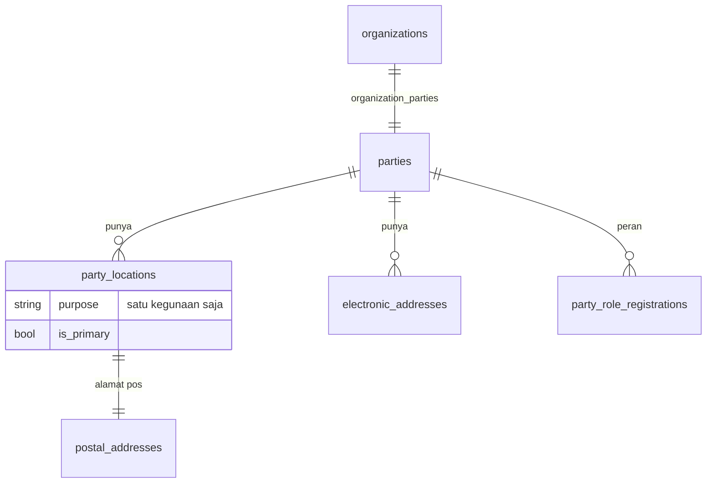
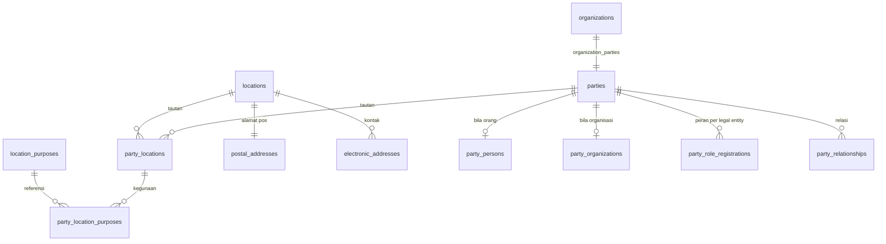

# Buku alamat global: bentuk lokasi, peran, dan relasi

Rencana kerja, bukan desain kanonik. Ditulis 17 September 2026 setelah pemilik produk memutuskan buku
alamat dikerjakan sampai sebentuk **Global Address Book Dynamics 365**, supaya app dan modul yang
menyusul dapat menyambung langsung tanpa membongkar tabelnya lagi.

Desain kanonik yang berlaku hari ini ada di [Buku alamat: party, alamat, dan kontak](../../dev/24-global-address-book.md).
Halaman ini **mengusulkan perubahan atasnya**; ketika sebuah tahap selesai, halaman kanonik itu yang
diperbarui, bukan halaman ini. Ia juga menutup dua temuan audit yang masih terbuka: `ORG-01` pada
[Organisasi dan konsolidasi](../general/01-organisasi-dan-konsolidasi.md) dan `PLAT-04` pada
[Layanan platform](../general/04-layanan-platform.md), yang sama-sama berhenti pada "keputusan yang
harus diambil" dan kini sudah diambil.

Ditulis supaya orang atau agen lain dapat mengerjakannya **tanpa ikut percakapan yang melahirkannya**:
setiap keputusan membawa alasannya, dan setiap butir kerja membawa kriteria terima.

## Pertanyaan yang dijawab halaman ini

- Apa yang sudah berjalan hari ini, dan bagian mana yang hanya tampak ada?
- Kenapa bentuk lokasi diubah **sekarang**, bukan nanti setelah app pelanggan atau pemasok pertama?
- Bagaimana modul (HR, aset, procurement) memakai party tanpa menyalin alamat ke tabelnya sendiri?
- Apa yang terjadi pada master wilayah `ref_*` yang sudah dibangun, dan pada dua tabel negara yang
  sekarang hidup berdampingan?
- Apa saja butir kerjanya, di file mana, dengan urutan apa?

## Keadaan sekarang

Dibaca langsung dari kode pada 17 September 2026, bukan dari dokumen.

| Bagian | Keadaan | Bukti |
| --- | --- | --- |
| `parties`, `party_locations`, `postal_addresses`, `electronic_addresses`, `organization_parties` | Ada dan dipakai | `apps/core/database/migrations/2026_07_27_020000_create_party_and_address_book_tables.php:45-133` |
| Satu-satunya kode yang pernah **membuat** party | Buku alamat organisasi: legal entity dan operating unit | `apps/core/app/Support/AddressBook/OrganizationAddressBook.php:38` |
| Satu-satunya kode yang **membaca** alamat | Identitas cetak, untuk kop dokumen | `apps/core/app/Support/AddressBook/OrganizationAddressBook.php:188-197` |
| `party_role_registrations` | Tabel ada, tidak ada satu pun penulis maupun pembaca di seluruh repo | grep `PartyRoleRegistration` hanya mengenai model dan migrasinya |
| Halaman **Buku Alamat Global** | Mockup: rute tanpa controller, tombol Simpan memanggil `alert`, nomor party diacak di browser | `apps/core/routes/web.php:167`, `apps/core/resources/js/pages/settings/global-address-book/index.tsx:189,215` |
| Bagian **Relasi** pada halaman itu | Hanya state React, tidak ada tabelnya | `apps/core/resources/js/components/global-address-book/relationship-section.tsx` |
| `party_types` (5 kode: person, organization, legal_entity, team, operating_unit) | Ada sebagai referensi, tidak dirujuk `parties.type` | `apps/core/database/migrations/2026_08_24_100000_create_party_types_table.php:20-26` |
| Worker di HR | Menyimpan nama dan email sendiri, tanpa `party_id` | `modules/apperp/human-resources/database/migrations/2026_07_30_120000_create_human_resources_tables.php:11-23` |
| Master wilayah `ref_countries` → `ref_villages`, beserta importer, kode pos, dan halaman **Address setup** | Lengkap dan berjalan | `apps/core/database/migrations/2026_08_24_110000_create_address_hierarchy_tables.php`, `apps/core/routes/web.php:177-194` |
| Alamat pos terhadap master wilayah itu | Tidak tersambung: provinsi, kota, dan kecamatan disimpan sebagai teks bebas | `…2026_07_27_020000_…:84-90` |
| Tabel negara | **Dua**: `country_regions` (dirujuk `postal_addresses`) dan `ref_countries` (dipakai master wilayah) | `…2026_07_27_020000_…:38`, `…2026_08_24_110000_…:11` |

Ringkasnya: yang berjalan adalah **buku alamat organisasi kita sendiri**. Sisanya tabel kosong, layar
palsu, dan satu master wilayah yang tidak pernah bertemu alamat.

### Bentuk sekarang

Tiga hal membedakannya dari Dynamics 365, dan ketiganya menempel pada satu tabel:

1. **Lokasi dimiliki tepat satu party.** `party_locations.party_id` membuat alamat tidak dapat dipakai
   bersama. Dua pihak di gedung yang sama menyimpan alamat dua kali, dan mengubah satu tidak mengubah
   yang lain.
2. **Kontak menempel ke party, bukan ke lokasi.** Tidak ada cara menyatakan "nomor ini milik cabang
   Bandung".
3. **Satu lokasi hanya punya satu kegunaan.** Alamat yang dipakai untuk kirim sekaligus tagih harus
   dimasukkan dua kali, dan keduanya lalu berubah sendiri-sendiri.

## Kenapa dikerjakan sekarang

**Karena tabelnya praktis masih kosong.** Satu-satunya kode yang pernah membuat party adalah buku
alamat organisasi, jadi isi `parties` hari ini hanya legal entity dan operating unit milik tenant
sendiri — puluhan baris, bukan puluhan ribu. Selama itu masih benar, perubahan bentuk di bawah adalah
mengubah tabel, bukan memigrasi data. Begitu app pelanggan, pemasok, atau pasien pertama menulis ke
sana, pekerjaan yang sama berubah menjadi migrasi data yang harus benar pada percobaan pertama.

Dua alasan lain menguatkannya:

- **Modul berikutnya sudah mengantre.** Procurement butuh alamat pemasok, alamat kirim, dan alamat
  tagih — tiga kegunaan pada satu pihak sebelum app itu punya fitur apa pun. Kalau bentuknya belum
  benar saat mereka datang, mereka akan menyalin alamat ke tabel sendiri, dan itu persis yang
  `PLAT-04` peringatkan.
- **Audit fondasi berhenti menunggu keputusan ini**, bukan menunggu kode. `ORG-01` mencatat dua
  rencana yang bertabrakan: alamat sebagai kolom pada legal entity, versus satu direktori bersama ala
  D365. Keputusan pemilik produk 17 September 2026: **direktori bersama**, mengikuti diagram D365.

## Keputusan

| Keputusan | Diambil | Yang dibeli | Yang dibayar |
| --- | --- | --- | --- |
| Bentuk acuan | **Global Address Book Dynamics 365**: satu direktori bersama; party adalah identitas, lokasi adalah tempat | Alamat diubah sekali dan seluruh peran ikut berubah; tidak ada app yang menyimpan alamat sendiri | Tabelnya lebih banyak daripada sekadar "kolom alamat di tabel pemasok" |
| Pemilik party | **Core**. App `business-partner` dihapus dari repo pada 17 September 2026 | Legal entity, operating unit, pegawai, pemasok, dan pasien hidup di satu direktori; identitas organisasi memang sudah di Core | Modul bisnis memiliki **peran** pemasok/pelanggan beserta prosesnya, dan harus memanggil buku alamat untuk identitasnya |
| Lokasi | **Berdiri sendiri** (`locations`), ditautkan ke party lewat tabel penghubung | Satu gedung dapat dipakai beberapa pihak; pindah kantor cukup satu baris | Satu tabel dan satu join tambahan pada setiap pembacaan alamat |
| Kegunaan alamat | **Boleh lebih dari satu**, disimpan pada tautan party–lokasi | Satu alamat bisa sekaligus alamat bisnis, kirim, dan tagih | Kegunaan tidak lagi satu kolom yang terbaca sekilas |
| Kontak elektronik | **Menempel ke lokasi**, seperti D365 | Telepon cabang melekat pada cabangnya | Kontak pada lokasi yang dipakai bersama otomatis ikut terbagi |
| Penanda utama | Satu **lokasi utama per party** (tetap dijaga partial unique index), satu **kontak utama per lokasi per jenis**; kontak utama sebuah party diturunkan dari lokasi utamanya | Arti "utama" bagi kop dokumen tidak berubah | Kontak yang hanya ada di lokasi bukan-utama tidak akan tercetak di kop |
| Jenis party | `parties.type` **dirujuk ke `party_types`**, dan legal entity serta operating unit memakai jenisnya sendiri | Sama dengan `DirPartyType` di D365; tabel referensi yang sudah di-seed akhirnya berguna | Baris party organisasi yang ada harus diperbaiki jenisnya saat migrasi |
| Riwayat alamat | **Ditunda.** Masa berlaku tetap pada tautan party–lokasi; alamat pos belum diberi `valid_from`/`valid_to` | Dokumen lama sudah aman karena bentuk tercetak disalin ke kolom `formatted` | "Alamat pemasok ini tahun lalu apa?" belum terjawab; menambahnya nanti hanya menambah kolom |
| Person dan Organization | **Tabel turunan sendiri** (`party_persons`, `party_organizations`) | Nama depan/belakang, gender, tanggal lahir, NPWP, dan nomor registrasi punya tempat yang benar | Dua tabel lagi, dan satu aturan bagaimana `parties.name` disusun dari nama orang |
| Tabel negara | **Satu**: `country_regions` menang sebagai identitas negara; kolom tambahan `ref_countries` dipindahkan ke sana | Alamat pos dan master wilayah akhirnya menunjuk negara yang sama | Master wilayah, importer, dan halaman Address setup ikut berubah — kode yang ditulis orang lain |
| Alamat terstruktur | Alamat Indonesia **menunjuk baris wilayah** (`ref_provinces` … `ref_villages`) dan tetap menyimpan namanya untuk dicetak | Kode pos dan ejaan berhenti jadi tebakan pengetik | Alamat luar negeri tetap teks bebas, jadi kode menangani dua bentuk |
| Cara modul memakainya | **Kontrak PHP dalam satu proses**, didaftarkan di `CoreServices::PEMETAAN`, seperti `PenerbitNomor` dan `DirektoriOrganisasi` | Pola yang sudah dipakai HR dan Management Aset; tanpa token, tanpa HTTP, ikut transaksi pemanggilnya | Modul di luar runtime tidak terlayani sampai ada yang memintanya |
| `internal/v1` untuk party | **Belum**, sampai ada pemanggil di luar runtime | Kontrak tidak ditulis untuk pemanggil yang belum ada | Integrator luar menunggu; dicatat di [API untuk sistem pelanggan](../api-untuk-integrator/) |
| Address book (grup) | **Tahap terakhir, boleh tidak pernah dikerjakan** | — | Tanpa ini, seluruh party terlihat oleh siapa pun yang boleh membuka buku alamat |
| Nomor party | Lewat **Number Sequence** Core: non-continuous, lingkup tenant, tanpa reset | Nomor yang dapat diucapkan dan dicari, seperti `PartyNumber` di D365 | Satu referensi number sequence baru; **menunggu persetujuan**, lihat OWN-02 |

### Yang sengaja tidak diputuskan di sini

- **Pembagian permission** untuk halaman buku alamat. Core hari ini tidak punya entry point per halaman:
  penjaganya Gate platform `manage-access`, `manage-reference-data`, dan seterusnya di
  `apps/core/app/Providers/AppServiceProvider.php:125-141`, dan buku alamat organisasi memakai
  `canManageAccess()` (`app/Http/Controllers/GlobalAddressBook/OrganizationLocationController.php:80-85`).
  Gate keamanan menuntut resource dan action, bukan nama menu, dan pilihannya milik pemilik produk.
  Usulan terkecil ada di OWN-01.
- **Event keluar** (`core.party.*.v1`). Tidak ada konsumen di luar runtime hari ini, dan kontrak yang
  ditulis sebelum pemanggilnya ada selalu melewatkan yang benar-benar dipakai.

## Bentuk target

| Tabel | Isi | Dijaga database |
| --- | --- | --- |
| `locations` *(baru)* | Satu tempat: nama, milik tenant | Unique `(tenant_id, id)` agar tabel anak menolak induk milik tenant lain |
| `party_locations` *(berubah)* | Tautan party ke lokasi: berlaku dari–sampai, penanda utama | Unique `(tenant_id, party_id, location_id)`; partial unique satu lokasi utama per party |
| `party_location_purposes` *(baru)* | Kegunaan satu tautan: bisnis, kirim, tagih, bayar, rumah | Unique `(tautan, kegunaan)`; partial unique satu kegunaan utama per party |
| `location_purposes` *(baru, referensi)* | Daftar kegunaan standar platform | Kunci utama kode, dirujuk tabel di atas |
| `postal_addresses` *(berubah)* | Alamat pos satu lokasi dan bentuk tercetaknya | Unique `(tenant_id, location_id)`; kode negara wajib ada di `country_regions`; untuk alamat Indonesia, `village_id` wajib ada di `ref_villages` |
| `electronic_addresses` *(berubah)* | Kontak satu lokasi: email, telepon, whatsapp, fax, url | Partial unique satu kontak utama per lokasi per jenis |
| `party_persons` *(baru)* | Nama depan/tengah/belakang, gelar, gender, tanggal lahir | Kunci utama `party_id`, hanya untuk party bertipe `person` |
| `party_organizations` *(baru)* | Nomor registrasi, NPWP, jumlah pegawai, nama fonetik | Kunci utama `party_id`, hanya untuk party berbentuk organisasi |
| `party_relationships` *(baru)* | Relasi berarah antar-party beserta jenis dan masa berlakunya | Unique `(tenant, dari, ke, jenis, berlaku_dari)`; baris yang menunjuk dirinya sendiri ditolak |
| `party_relationship_types` *(baru, referensi)* | Jenis relasi dan sebutan arah baliknya | Kunci utama kode |
| `party_role_registrations` *(tetap)* | Registry peran per legal entity, ditulis modul pemilik peran | Unique `(party, peran, legal entity)` |
| `organization_parties` *(tetap)* | Tautan organisasi ke party-nya | Unique per party |

Dua aturan yang tidak berubah di tahap mana pun: **setiap tabel membawa `tenant_id`**, dan **setiap
tabel anak memakai composite foreign key** `(tenant_id, induk_id)` supaya database sendiri yang menolak
induk milik tenant lain — bukan hanya scope Eloquent.

### Yang berubah bagi pembaca yang sudah ada

Identitas cetak membaca alamat dan kontak organisasi lewat `OrganizationAddressBook::summary()`. Setelah
kontak pindah ke lokasi, ringkasan itu membaca **kontak pada lokasi utama** organisasi. Untuk data yang
ada sekarang hasilnya sama persis, dan test yang membuktikannya sudah ada:
`test_print_identity_reads_address_and_contacts_from_the_address_book`
(`apps/core/tests/Feature/ControlPlane/OrganizationAddressBookTest.php:109`). Test itu tidak boleh diubah
saat mengerjakan GAB-02 sampai GAB-05; kalau ia merah, yang salah kodenya.

## Migrasi data

Satu migrasi, satu transaksi, urutan ini:

1. Buat `locations`, `location_purposes`, `party_location_purposes`.
2. Untuk setiap baris `party_locations` lama: buat `locations` memakai `name`-nya, arahkan
   `postal_addresses.location_id` ke sana, lalu tulis kegunaannya dari kolom `purpose`.
3. Untuk setiap `electronic_addresses`: pindahkan dari `party_id` ke lokasi **utama** party itu. Bila
   party belum punya lokasi, buat satu lokasi tanpa alamat pos bernama "Kontak" lalu tautkan.
4. Perbaiki `parties.type` untuk party organisasi: legal entity menjadi `legal_entity`, operating unit
   menjadi `operating_unit`, lalu pasang foreign key ke `party_types`.
5. Buang `name` dan `purpose` dari `party_locations`, buang `party_id` dari `electronic_addresses`, lalu
   pasang ulang seluruh partial unique index pada kunci barunya.

Migrasi turun mengembalikan bentuk lama dengan memilih **satu** kegunaan per lokasi dan membuang sisanya.
Itu kehilangan data, jadi `down` hanya untuk pengembangan; di server berisi data, mundur dilakukan lewat
pemulihan cadangan. Aturannya sama dengan [Mundur tanpa kehilangan data](../rilis-kompatibel-mundur/).

**Sebelum dijalankan di server mana pun**, hitung dulu isi tabelnya (GAB-00). Kalau ternyata sudah ada
party bukan-organisasi, rencana ini berhenti dan migrasinya ditulis ulang sebagai migrasi data betulan
dengan uji pulih.

## Bagaimana modul memakainya

Sejak pemindahan ke satu runtime, modul memanggil Core lewat **kontrak PHP yang di-resolve dari
container**, bukan HTTP. Polanya sudah dipakai di dua tempat: `PenerbitNomor` untuk nomor dokumen dan
`DirektoriOrganisasi` untuk anggota serta unit operasi. Daftar resminya di
`apps/core/app/Support/Modules/CoreServices.php:39-57`, implementasinya di
`apps/core/app/Services/Modules/`, dan contoh pemakaiannya di
`modules/apperp/human-resources/src/Services/DirektoriHr.php:33`.

Buku alamat menyusul dengan bentuk yang sama: kontrak `App\Support\Modules\Contracts\BukuAlamat`,
implementasi `App\Services\Modules\BukuAlamatCore`, didaftarkan di `CoreServices::PEMETAAN`. Karena
sekoneksi dan seproses, pendaftaran peran ikut transaksi pemanggilnya: worker yang gagal disimpan tidak
meninggalkan peran menggantung.

**Isi kontraknya ditentukan dari sisi pemanggil, bukan dari sisi Core** (GAB-10). Yang dibaca lebih dulu
adalah jalur pembuatan worker di HR; metode yang tidak dipakai pemanggil mana pun tidak ditulis. Perkiraan
awal, untuk diperiksa ulang saat GAB-10 selesai:

| Yang dibutuhkan pemanggil | Bentuk kasar |
| --- | --- |
| Menemukan party yang sudah ada sebelum membuat yang baru | cari berdasarkan nama ternormalisasi dan tenant |
| Membuat party orang atau organisasi | satu metode per bentuk, mengembalikan id |
| Mencatat dan mencabut peran pada satu legal entity | tulis ke `party_role_registrations`, idempoten |
| Membaca alamat dan kontak utama untuk ditampilkan | ringkasan kecil, tanpa membuat apa pun |
| Membaca beberapa party sekaligus untuk daftar | satu panggilan untuk banyak id, bukan N panggilan |

`internal/v1` **tidak ditambah di tahap ini**. Permukaan itu dijaga kontrak tulisan tangan
`apps/core/contracts/openapi-internal.yaml` beserta pemeriksa cakupan
`apps/core/contracts/check-contract-coverage.py` yang berjalan di CI
(`.github/workflows/lint.yml:136-139`); menambah endpoint di sana berarti menambah kontrak untuk pemanggil
yang belum ada. Ia dibuka ketika integrator luar benar-benar memintanya — lihat
[API untuk sistem pelanggan](../api-untuk-integrator/).

## Tahapan

| Tahap | Isi | Selesai berarti |
| --- | --- | --- |
| **1** | Bentuk lokasi: lokasi berdiri sendiri, kegunaan ganda, kontak pindah ke lokasi, jenis party dibereskan | Buku alamat organisasi berjalan persis seperti sekarang di atas bentuk baru, dan empat test lama hijau tanpa diubah |
| **2** | Party dapat dipakai modul: kontrak `BukuAlamat`, registry peran diisi, worker HR menjadi party | "Pemasok ini pelanggan kita juga?" dapat dijawab satu query, dan pegawai punya alamat tanpa kolom alamat di HR |
| **3** | Person dan organisasi punya isinya; relasi antar-party | Kontak person sebuah organisasi, keluarga pasien, dan penjamin dapat dicatat |
| **4** | Halaman Buku Alamat Global yang sesungguhnya | Mockup diganti: daftar party, detail, simpan beneran, izin sesuai OWN-01 |
| **5** | Alamat terstruktur dan satu tabel negara | Alamat Indonesia menunjuk wilayah; `ref_countries` tidak ada lagi |
| **6** | Address book (grup) — opsional | Party dapat dipilah per grup, dan hak melihatnya mengikuti grup |

Tahap 1 berdiri sendiri dan tidak menunggu keputusan apa pun. Tahap 2 ke atas menunggu OWN-01.

## TODO

Setiap butir menyebut tempat kerjanya, kriteria terimanya, dan butir yang harus selesai lebih dulu.
Sebuah butir hanya boleh ditandai `[x]` bila memenuhi aturan 3 pada
[Gate fondasi Core](../../dev/10-core-foundation-gates.md): ada penulis, pembaca, keadaan gagal, dan test
yang membuktikan keadaan sebelumnya tidak dapat menyamar sebagai keadaan berikutnya.

### Pemilik produk

| ID | Pekerjaan | Selesai bila |
| --- | --- | --- |
| OWN-01 | Memutuskan pembagian izin buku alamat. Usulan terkecil: baca untuk semua anggota tenant aktif (seperti sekarang), tulis lewat satu Gate baru `manage-address-book` yang terpisah dari `manage-access`, karena mengubah alamat pemasok bukan pekerjaan yang sama dengan mengatur hak akses | Keputusannya tertulis di halaman ini, dan Gate-nya ada di `AppServiceProvider` bersama `manage-*` yang lain |
| OWN-02 | Menyetujui nomor party lewat Number Sequence: non-continuous, lingkup tenant, tanpa reset, format usulan `P-########` | Referensinya terdaftar dan tertulis di [Number sequence](../../dev/14-number-sequences.md) |
| OWN-03 | Menyetujui penggabungan dua tabel negara, dan menunjuk siapa yang mengerjakan master wilayah yang ikut berubah | Keputusan tertulis; pemilik kerjanya tahu |

### Tahap 1 — Core, buku alamat

| ID | Pekerjaan | Selesai bila | Setelah |
| --- | --- | --- | --- |
| GAB-00 | Hitung isi `parties`, `party_locations`, `postal_addresses`, `electronic_addresses` di database dev dan SaaS dev | Jumlah baris per tabel tercatat di deskripsi PR, dan terbukti tidak ada party di luar organisasi tenant sendiri | — |
| GAB-01 | Migrasi bentuk baru beserta pemindahan datanya, sesuai urutan pada bagian Migrasi data | `migrate` dan `migrate:rollback` berjalan di PostgreSQL kosong **dan** di salinan database dev; `tests/Feature/Boundary` hijau lokal | GAB-00 |
| GAB-02 | Model dan relasi: `Location`, `PartyLocation` sebagai tautan, `PartyLocationPurpose`, `ElectronicAddress` menempel ke lokasi | PHPStan hijau tanpa baseline baru; model membawa composite key sesuai polanya | GAB-01 |
| GAB-03 | `OrganizationAddressBook` mengikuti bentuk baru; aturan satu utama pindah ke kunci barunya; `summary()` membaca kontak lokasi utama | `test_print_identity_reads_address_and_contacts_from_the_address_book` hijau **tanpa diubah** | GAB-02 |
| GAB-04 | Controller lokasi dan kontak organisasi: kegunaan menjadi banyak, kontak memilih lokasi, validasi kegunaan ke `location_purposes` | 422 untuk kegunaan yang tidak terdaftar; 404 lintas tenant dan 403 untuk bukan admin tetap seperti sekarang | GAB-03 |
| GAB-05 | UI kartu organisasi (`components/organization/address-book-section.tsx`): kegunaan jadi pilihan ganda, kontak memilih lokasinya | Alamat dengan dua kegunaan dapat dibuat dan tampil benar; halaman identitas cetak tetap menampilkan hal yang sama | GAB-04 |
| GAB-06 | Test baru: satu lokasi dipakai dua party, satu alamat dengan tiga kegunaan, kontak per lokasi, dan dua request berpacu menandai "utama" | Test race gagal bila partial unique index dilepas; penanganan 23505 memakai SAVEPOINT sehingga transaksi tidak batal total | GAB-04 |
| GAB-07 | `parties.type` dirujuk ke `party_types`; party legal entity dan operating unit memakai jenisnya sendiri | Test: party organisasi baru lahir dengan jenis yang benar; jenis di luar daftar ditolak database | GAB-01 |
| GAB-08 | Jalankan seluruh test Core dan alur quality lokal sebelum menunggu CI | Delapan pemeriksaan Core hijau lokal | GAB-05, GAB-06 |
| GAB-09 | Perbarui [halaman kanonik buku alamat](../../dev/24-global-address-book.md) dan diagramnya | Halaman itu menggambarkan bentuk baru, bukan bentuk lama; tabel "yang belum ada" dipangkas | GAB-08 |

### Tahap 2 — party untuk modul

| ID | Pekerjaan | Selesai bila | Setelah |
| --- | --- | --- | --- |
| GAB-10 | Baca jalur pembuatan dan pengubahan worker di HR, tulis daftar kebutuhan konkretnya sebelum kontrak ditulis | Daftar kebutuhan ada di PR; setiap metode kontrak dapat ditunjuk pemanggilnya | GAB-09 |
| GAB-11 | Kontrak `BukuAlamat` + `BukuAlamatCore` + pendaftaran di `CoreServices::PEMETAAN` | Modul dapat resolve lewat container; test membuktikan panggilan dari modul ikut transaksi pemanggil | GAB-10 |
| GAB-12 | Registry peran diisi lewat kontrak, idempoten, dan dicabut saat perannya berakhir | Test: mendaftarkan peran dua kali tidak membuat dua baris; peran hilang saat worker diarsipkan | GAB-11 |
| HR-01 | `hr_workers.party_id` dan penautannya saat worker dibuat atau diubah | Worker baru selalu punya party; worker lama ditautkan lewat migrasi data | GAB-11 |
| HR-02 | Alamat dan kontak pegawai dibaca dari buku alamat, bukan dari kolom HR | Tidak ada kolom alamat baru di HR; halaman pegawai menampilkan alamat dari party | HR-01 |
| GAB-13 | Bagian "peran" pada kartu party membaca registry | "Pemasok ini pelanggan kita juga?" terjawab satu query tanpa menyentuh tabel modul | GAB-12 |

### Tahap 3 sampai 6 — garis besar

| ID | Pekerjaan | Selesai bila |
| --- | --- | --- |
| GAB-20 | `party_persons` dan `party_organizations`, beserta aturan penyusunan `parties.name` | Nama orang tersimpan terpisah dan tetap dapat dicari lewat `search_name` |
| GAB-21 | `party_relationships` dan jenis relasinya, termasuk sebutan arah balik | Kontak person sebuah organisasi dan keluarga pasien dapat dicatat; relasi ke diri sendiri ditolak |
| GAB-22 | Halaman Buku Alamat Global sesungguhnya: daftar, detail, simpan, izin OWN-01 | Mockup dan `alert` hilang dari repo |
| GAB-23 | Alamat terstruktur menunjuk `ref_villages`, bentuk cetak memakai `ref_address_parameters` | Alamat Indonesia tidak lagi teks bebas; alamat luar negeri tetap bisa disimpan |
| GAB-24 | Satu tabel negara: kolom `ref_countries` pindah ke `country_regions`, master wilayah menunjuk ke sana | `ref_countries` tidak ada lagi; halaman Address setup tetap berjalan |
| GAB-25 | Address book (grup) dan hak melihat per grup | Party dapat dipilah; tanpa grup, perilakunya sama seperti sebelumnya |

## Risiko dan jebakan yang sudah diketahui

- **Migration baru wajib diikuti test Boundary.** `tests/Feature/Boundary` lokal memakan sekitar 18 detik
  dan menangkap tabel yang lupa dijaga; jangan menunggu CI untuk itu.
- **Penomoran file migration bertabrakan dengan sesi lain.** Beberapa branch menambah migrasi Core pada
  hari yang sama; pakai jam yang belum terpakai dan rebase ke `origin/main` sebelum membuka PR.
- **Menangkap 23505 di dalam transaksi PostgreSQL membatalkan seluruh transaksi** kecuali dibungkus
  SAVEPOINT. Ini mengenai jalur "satu utama" saat dua request berpacu — persis yang diuji GAB-06.
- **File yang dipakai bersama sesi lain**: `routes/web.php`, `components/app-sidebar.tsx`, dan
  `layouts/settings/layout.tsx`. Sentuh sesedikit mungkin, satu PR per potongan.
- **Suite test dapat mengosongkan database kerja** bila koneksinya salah. `Tests\TestCase` sudah memaksa
  `pgsql_test` dan menolak database kerja; jangan melonggarkannya untuk mempercepat.
- **PR yang menumpuk belum tentu sampai ke main.** Sesudah merge, periksa `git log origin/main`, jangan
  percaya status MERGED di daftar PR.

## Yang harus ikut berubah ketika selesai

| Halaman | Perubahan |
| --- | --- |
| [Buku alamat: party, alamat, dan kontak](../../dev/24-global-address-book.md) | Tabel, aturan, dan bagian "yang belum ada" mengikuti bentuk baru |
| [Dokumen cetak, layout, dan ekspor](../../dev/23-document-rendering.md) | Kalimat tentang dari mana kop membaca kontak |
| [Organisasi dan konsolidasi](../general/01-organisasi-dan-konsolidasi.md) | `ORG-01` ditutup dengan menunjuk halaman ini |
| [Layanan platform](../general/04-layanan-platform.md) | `PLAT-04` ditutup dengan menunjuk halaman ini |
