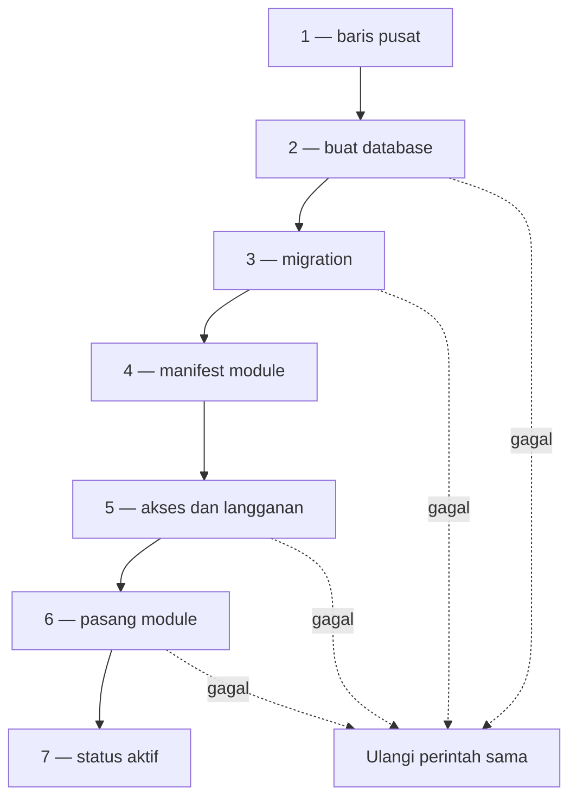
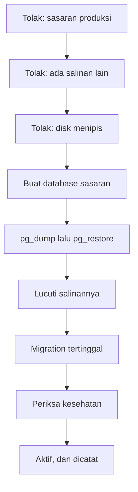

# Environment dan pusat admin

Halaman ini rencana kerja, bukan desain kanonik. Ia menunggu review; bila disetujui, isinya naik ke
`docs/dev/` sebagai halaman desain tersendiri — dan itulah yang menutup instruksi `LIFE-15`.

## Kenapa ini ada

Hari ini satu pelanggan hanya dapat memiliki satu tempat kerja. Tidak ada tempat mencoba rilis
sebelum ia menyentuh data sungguhan, tidak ada tempat melatih pengguna baru tanpa mengotori pembukuan,
dan tidak ada tempat memperlihatkan produk kepada calon pelanggan tanpa memberinya server sendiri.

Lubang itu sudah tercatat. Audit terhadap Dynamics 365 F&O menuliskannya sebagai `LIFE-15` pada
[lifecycle dan deployment](../general/03-lifecycle-dan-deployment.md):

> No environment management: the schema structurally forbids a sandbox, and there is no
> copy-environment, data upgrade, feature flag, or maintenance mode.

Verifiernya menambahkan urutan yang mengikat: ia harus **mendahului** `LIFE-06`, worker upgrade —
karena memutakhirkan data pelanggan tanpa pernah mencobanya lebih dulu bukan sesuatu yang boleh
dibangun. Dan temuan itu ditutup satu perintah: *"Write the design into docs/dev before building."*

Tetapi kalimat temuan itu membundel lima hal yang pembenarannya berbeda-beda, dan halaman ini hanya
mengambil dua di antaranya. Menuliskan mana yang **ditolak** sama pentingnya dengan menuliskan mana
yang dikerjakan — kalau tidak, tiga pekerjaan yang tidak perlu ikut terbawa.

| Klaim `LIFE-15` | Diterima? |
| --- | --- |
| Skema melarang sandbox | **Sudah tidak akurat.** Benar saat ditulis; `tenant_deployments` kini tidak punya pembaca, jadi ongkosnya jauh lebih kecil daripada yang ditaksir temuan itu |
| Tidak ada copy-environment | **Diterima** — dan ia inti halaman ini |
| Tidak ada data upgrade | **Ditolak.** Itu istilah Dynamics untuk pipeline tersendiri yang mengubah data lama saat naik versi mayor. Di sini perubahan skema **adalah** migration, dan aturannya sudah maju-saja serta aman diulang. Yang sebenarnya ditunjuk klaim ini adalah worker upgrade — `LIFE-06`, temuan lain |
| Tidak ada feature flag | **Ditolak dari cakupan ini.** Bentuknya sudah diputuskan di [release dan on-prem](../../dev/03-release-and-on-prem.md): baris per kode dengan registry, nol migration per parameter. Yang belum ada hanya penyimpanannya, dan ia tidak berhubungan dengan environment |
| Tidak ada maintenance mode | **Diterima**, tetapi kecil — ia muncul sendiri begitu migration berjalan ke banyak environment |

Dan alasan yang menopang dua yang diterima **bukan** "Dynamics punya". Alasannya berdiri sendiri:
jalur upgrade tidak dapat dibangun dengan aman tanpa tempat mencobanya. Repo ini sudah membayar
harganya sekali — dua cacat jalur mundur di [bundle on-prem](../bundle-on-prem/README.md) baru
ketahuan **karena dijalankan**, bukan karena dibaca.

Kata **demo** tidak muncul satu kali pun di seluruh `docs/`. Halaman ini yang pertama menuliskannya.

## Yang sudah ada hari ini

| Bagian | Keadaan | Tempatnya |
| --- | --- | --- |
| Pendaftaran usaha lengkap dengan pemasangan module | Ada | `App\Actions\Onboarding\RegisterBusiness` |
| Pemasangan, penonaktifan, dan pencabutan module per tenant | Ada | `module:install`, `module:disable`, `module:uninstall` |
| Registry module dari berkas, tanpa daftar yang ditulis tangan | Ada | `App\Support\Modules\ModuleRegistry` |
| Scope tenant yang gagal tertutup pada baca **dan** tulis | Ada | `TenantScope`, `MilikTenant` |
| Konteks aktif per permintaan, dimemoisasi | Ada | `CurrentWorkspace`, `ResolveModuleContext` |
| Menghitung modul sebuah edisi | Ada | `php artisan edition:resolve` |
| Membuktikan modul yang tidak dibeli tidak ada di image | Ada, dijaga CI | `scripts/verify-edition.sh` |
| Bundle on-prem beserta pemasangan dan jalur mundurnya | Ada, sudah dijalankan | [bundle on-prem](../bundle-on-prem/README.md) |
| Identitas operator vendor | Ada, tetapi hanya dua izin | tabel `provider_access` |

## Yang belum ada

- Registry environment. `tenants` tidak punya kolom jenis maupun lingkungan.
- Jalur operator untuk membuat apa pun. Tenant hanya lahir dari **pendaftaran mandiri**; tidak ada
  satu pun layar atau endpoint yang membuat, menangguhkan, atau mengatur tenant.
- Menyalin sebuah environment, mengosongkannya, memulihkannya, atau menetapkan masa berlakunya.
- Mode pemeliharaan.
- Data contoh. Repo hanya punya seeder bahan uji dan satu factory.
- Batas antara alat vendor dan aplikasi pelanggan — lihat bagian berikutnya, dan ini yang paling
  mendesak dari seluruh daftar ini.

## Bagaimana Microsoft melakukannya

Dibaca dari sumbernya pada 11 September 2026, bukan dari ingatan. Enam hal yang menentukan bentuk
rancangan di bawah.

**1. Environment adalah objek kelas satu dengan penyimpanan sendiri.** Satu pelanggan memiliki banyak
environment, dan masing-masing punya database, alamat, jenis, dan versinya sendiri. Batasnya ditegakkan
penyimpanan, bukan kode: aplikasi di environment Test *"only is permitted to connect to the Test
database"*.

**2. Cara menskalakannya adalah berbagi runtime, bukan berbagi baris.** Azure menyebutnya
*horizontally partitioned deployment* — satu application tier bersama, penyimpanan terpisah per
tenant. Untungnya disebut apa adanya: masalah *noisy neighbor* hilang. Risikonya juga: pembuatan
komponen per-tenant itu wajib otomatis, karena sekarang jumlahnya banyak.

**3. Jenis adalah properti, bukan produk yang berbeda.** Production, Sandbox, Trial, Developer. Hanya
Sandbox yang punya `Copy` dan `Reset`. Trial kedaluwarsa dan dibersihkan sendiri.

**4. Jumlahnya dibatasi kuota, dan kuotanya diperiksa tiga kali.** Business Central memberi satu
produksi dan tiga sandbox; sisanya dibeli. Kuota diperiksa saat membuat, **saat menyalin**, dan **saat
memulihkan** — bukan hanya saat membuat.

**5. `Copy` adalah operasi intinya, dan salinannya dilucuti senjatanya.** Ini bagian yang paling
berharga, dan yang paling mudah dilupakan kalau hanya membaca ringkasan fiturnya. Ketika produksi
disalin menjadi sandbox, Business Central menghentikan job queue, mematikan agent, menonaktifkan
**seluruh webhook**, menghapus detail SMTP beserta akun emailnya, mengosongkan setup integrasi, dan
memblokir panggilan HTTP keluar dengan pesan yang menyebut alasannya:
*"The request was blocked by the runtime to prevent accidental use of production services."*

Tanpa itu, "demo" akan mengirim email sungguhan kepada pelanggan sungguhan.

**6. Menghapus itu lunak dulu, keras kemudian** — dan setiap tindakan masuk log operasi, dengan
riwayat per environment yang menyebut siapa memulai apa dan kapan.

Satu hal yang **tidak** dilakukan Microsoft, dan ini dinyatakan terang-terangan: ia **tidak
menyamarkan data** saat menyalin. *"Any action taken for the purpose of complying with privacy laws
and regulations must be handled separately and repeated for the environment."* Yang dilucuti adalah
sambungan keluarnya, bukan datanya. Konsekuensinya untuk kita ada di
[bagian terakhir](#di-mana-keputusan-yang-dikunci-menggigit).

::: tip Istilahnya sudah diterjemahkan Microsoft
Localization Indonesia produknya memakai **"Lingkungan"** untuk *environment* dan **"Pusat admin"**
untuk *admin center*. Dokumen ini dan nama kode tetap memakai `environment` sebagai kata pinjaman
teknis — kalau tidak, ia bertabrakan dengan "lingkungan lokal" pada
[setup](../../onboarding/setup.md) — tetapi **setiap layar menulis "Lingkungan"**.
:::

## Dan bagaimana ERP sekelas kita melakukannya

Meniru Microsoft saja lemah sebagai pembenaran: ia perusahaan dengan ribuan engineer, menjual ke pasar
yang berbeda, dan sanggup membangun apa pun yang dirancangnya. Yang membuat pola ini layak ditiru
adalah hal lain — **vendor dengan ukuran yang sangat berbeda sampai pada bentuk yang sama.**

**Odoo**, yang paling dekat skalanya dengan kita. Staging branch-nya adalah *"neutralized duplicates
of the production database"*, dan tujuannya ditulis persis seperti kebutuhan di halaman ini:
*"meant to test new features using production data without compromising the actual production database
with test records."* Yang dinetralkan: scheduled action, email keluar — **dialihkan ke penampung
surat, bukan sekadar dimatikan**, sehingga orang masih dapat melihat surat apa yang seharusnya
terkirim — penyedia pembayaran, metode pengiriman, dan layanan berbayar per pakai.

**Frappe dan ERPNext**, lewat `bench`: banyak site, **satu database per site**, dan menggandakan site
adalah operasi biasa, bukan prosedur khusus.

**Business Central**, dengan daftar pelucutan yang sudah dikutip di atas.

Tiga vendor, tiga ukuran tim yang jauh berbeda, satu bentuk yang sama: **salin, lalu lucuti.** Itu
pembenaran yang jauh lebih kuat daripada selisih terhadap satu produk enterprise.

Dan satu hal yang Odoo lakukan lebih baik daripada keduanya, yang halaman ini tiru: sejak v16, aturan
netralisasi hidup di **berkas milik tiap module**, bukan di satu daftar terpusat. Alasannya ada di
[pelucutan](#operasi-copy-beserta-pelucutannya), dan ia menambal lubang yang rancangan awal halaman
ini akui sendiri.

## Pemisahan plane, dan kenapa ia mendahului segalanya

Pekerjaan ini menyingkap cacat yang sudah ada sebelum ia dimulai, dan cacat itu harus dibereskan lebih
dulu karena semua yang lain berdiri di atasnya.

**`apps/control-plane` bukan control plane.** Ia application plane — runtime Core, layanan platform,
dan UI yang dipakai pelanggan. Seluruh dokumen dan seluruh berkas compose sudah memanggilnya Core:
`core-app`, `core-db`, `core-worker`, "image edisi Core", "runtime Core". Hanya nama foldernya yang
menyimpang, dan selama ia menyimpang, kata "control plane" tidak dapat dipakai untuk benda yang
benar-benar control plane.

**Dan pusat admin tidak boleh ikut ke server pelanggan.**
[Release dan on-prem](../../dev/03-release-and-on-prem.md) mengikat bahwa source app yang tidak dibeli
harus absent dari bundle on-prem, dan bahwa *"yang menegakkan batas komersialnya adalah ketiadaan
berkas, bukan sebuah sakelar."* Pusat admin bukan app yang dibeli siapa pun — ia alat vendor, dan ia
memuat registry seluruh pelanggan. Hari ini tidak ada satu pun yang memeriksanya, karena pemeriksa
kebocoran edisi hanya melihat folder `modules/`.

### Keputusan: satu repo, dua aplikasi

| | `apps/core/` | `apps/pusat-admin/` |
| --- | --- | --- |
| Isi | runtime Core dan seluruh module bisnis | registry environment, orkestrasi, log operasi, konsol operator |
| Plane | application | control |
| Penghuni | pelanggan | vendor |
| Ikut bundle on-prem | **Ya** | **Tidak pernah** |

`apps/control-plane` → `apps/core` adalah **rename**, bukan penulisan ulang: ia menyelaraskan nama
folder dengan nama yang sudah dipakai di mana-mana.

Bukan dua repo. [Grand design](../../dev/01-grand-design.md) mengunci satu repo dengan satu cabang
utama, dan pemindahan ke satu runtime pada 10 September 2026 mengarsipkan empat repo justru karena
ongkosnya. Repo terpisah menuntut salinan model identitas, auth sendiri, CI sendiri, dan deploy
sendiri — untuk masalah yang tidak diselesaikannya.

### Siapa memerintah, siapa mengerjakan

Pembagiannya mengikuti penempatan AWS, yang menaruh provisioning di **application plane** justru
karena *"the resources it must provision and configure are more directly connected to services that
are created and configured in the application plane."*

Yang tahu cara membuat database, menjalankan migration, membaca registry module, dan menyemai data
awal hanyalah Core. Jadi pusat admin **memerintah** dan Core **mengerjakan**: pusat admin menulis
baris `environments`, memanggil Core lewat `/api/internal/v1/...` memakai kredensial layanan yang
sudah ada, lalu mencatat hasilnya di `environment_operations`. Tidak ada mekanisme baru yang perlu
ditemukan; `AuthenticateAppService` sudah melakukan persis autentikasi mesin-ke-mesin ini.

### Ditegakkan mesin, bukan diniatkan

`scripts/verify-edition.sh` — pemeriksa kebocoran yang sudah ada, dijaga CI, dan sudah terbukti dapat
merah — diperluas menolak setiap jejak `pusat-admin` di dalam image edisi: berkas, nama namespace, dan
rute. Mesinnya sudah ada; yang ditambah hanya satu sasaran.

::: warning Core harus tetap hidup ketika pusat admin mati
Core membaca tabel `environments` dengan peran database **hanya-baca** lalu memoisasinya. Memanggil
pusat admin pada setiap permintaan akan menjadikan konsol operator titik gagal tunggal bagi seluruh
pelanggan — dan konsol operator adalah bagian yang paling jarang diuji.
:::

Dan on-prem justru menyederhana: tidak ada pusat admin, tidak ada database pusat, tidak ada registry
environment. Core berjalan sebagai satu-satunya environment, persis seperti hari ini.

## Batas antara data pusat dan data environment

Satu aturan menentukan seluruh pembagian ini: **database environment harus sanggup menjadi
keseluruhannya.** On-prem adalah satu environment tanpa control plane; kalau sebuah permintaan tidak
dapat dijawab dari database environment saja, jalur on-prem patah.

Akibatnya, sisi environment adalah CoreERP yang hampir utuh dan sisi pusat adalah lapisan tipis. Itu
juga yang menentukan koneksi mana yang diberi nama: **`control` yang bernama, environment yang menjadi
bawaan** — sisi environment menyentuh hampir setiap query di repo ini, sisi pusat hanya segelintir.

| Sisi | Isi |
| --- | --- |
| Pusat | `users` beserta passkey dan 2FA, `sessions`, `cache`, `jobs`, `clients`, `tenants`, `provider_access`, ditambah `environments`, `environment_members`, `environment_operations` |
| Environment | Semua sisanya: organisasi beserta hierarchy, seluruh rantai `role → duty → privilege → permission`, katalog dan entitlement, urutan nomor, kalender fiskal, satuan, workflow, `outbox_events`, catatan pemasangan module, dan seluruh tabel module |

### Kenapa katalog ikut ke sisi environment

Ini pembenaran yang menanggung seluruh rancangan, dan ia bukan selera.

`LaunchableAppCatalog::permissionQuery()` berjalan pada **setiap permintaan module** dan menyambung
`security_role_duties → security_duty_privileges → security_privilege_permissions → permissions` —
tiga tabel milik tenant dan satu tabel katalog, dalam satu join. PostgreSQL tidak dapat join lintas
database. Menaruh katalog di pusat mengubah query terpanas di sistem ini menjadi dua perjalanan
jaringan beserta penyaringan di PHP.

Lagipula `security_privileges` dan `security_duties` **bukan katalog murni**: sejak migration yang
menambahkan konfigurasi keamanan per tenant, keduanya memuat baris dari manifest **dan** baris yang
ditulis tenant sendiri. Keduanya tidak dapat dibelah.

Ini gratis justru karena keputusan "satu versi untuk semua environment": katalog menjadi fungsi murni
dari image, dan `app:register-manifest` sudah aman diulang.

::: danger Cara membelah yang salah, dan ia menggoda
Membelah dengan kalimat "control plane memiliki identitas" akan menaruh `tenant_memberships` dan
`roles` di sisi pusat. Akibatnya sandbox **berbagi baris membership dengan produksi**, dan menyunting
sebuah role di sandbox untuk mencobanya mengubah akses di produksi. Itu versi rancangan ini yang
terkirim lalu diam-diam memberi orang hak produksi.
:::

`environment_members` ada di pusat sebagai **indeks navigasi, bukan sumber otorisasi**. Ia menjawab
"environment mana yang muncul di pengalih", sementara yang menjawab "boleh berbuat apa" tetap
`tenant_memberships` di dalam environment. Baris basi di sana hanya boleh menghasilkan 403, tidak
pernah izin tambahan — dan kalimat itu wajib ikut sebagai komentar migrationnya, karena orang pertama
yang mengoptimalkan akan tergoda mempercayainya.

### `control` yang menunjuk koneksi bawaan

Pada on-prem dan di seluruh test suite, `control` dan koneksi bawaan adalah koneksi yang sama, PDO
yang sama, transaksi yang sama. Hanya SaaS yang memisahkan keduanya.

Itu bukan kelicikan, melainkan syarat. `RefreshDatabase` hanya membungkus koneksi bawaan dalam
transaksi; dua koneksi sungguhan ke database yang sama masing-masing membuka transaksi sendiri, dan
data yang ditulis satu koneksi tidak terlihat oleh koneksi lainnya. Test menjadi tidak dapat melihat
datanya sendiri. Satu keputusan ini yang menyelamatkan jalur edisi on-prem **dan** seluruh test suite
yang sudah ada; perilaku multi-database diuji suite kecil tersendiri yang benar-benar membuat dan
membuang database.

## Cara sebuah permintaan memilih databasenya

Middleware pemilih environment berjalan **sesudah** `auth` dan **sebelum** middleware Inertia.
Urutannya sah karena `auth` hanya membaca `users` dan `sessions`, dan keduanya selalu di pusat —
tidak ada yang membutuhkan environment sebelum environment diketahui.

`CurrentWorkspace` mendapat kunci session keempat di samping tiga yang sudah ada, dan
`ResolveModuleContext` tidak berubah sama sekali.

### Gagal tertutup, dua lapis

1. **Pada mode SaaS, koneksi bawaan menunjuk database yang tidak ada.** Binding yang lupa gagal dengan
   `database "coreerp_no_environment" does not exist` sebelum satu baris pun bergerak. PostgreSQL yang
   menegakkannya; tidak ada kode yang dapat melupakannya.
2. Sebuah penjaga mendengar event koneksi dan melempar dengan pesan yang terbaca manusia. Ia
   dipersenjatai hanya ketika mode environment menyala, sehingga on-prem dan test suite tidak
   tersentuh.

Lapis pertama tidak dapat dihapus tanpa sengaja. Lapis kedua yang membuat pesannya berguna.

### Empat jalur yang wajib disebut

Keempatnya pernah menjadi sumber bug kelas ini di sistem mana pun yang melakukannya.

| Jalur | Aturannya |
| --- | --- |
| Queue job | Wajib membawa id environment. Job tanpa itu **melempar**, bukan memakai sisa permintaan sebelumnya |
| Perintah artisan | `--environment` wajib untuk apa pun yang menyentuh data tenant |
| Scheduler | Berjalan memutari seluruh environment, dan **melanjutkan setelah kegagalan** |
| `internal/v1` | Tidak berubah — lihat di bawah |

::: warning Jebakan yang hanya ketahuan kalau kodenya dibaca
Laravel men-deserialisasi payload job **sebelum** job middleware berjalan. Job yang membawa model sisi
tenant sebagai propertinya akan mencoba me-resolve-nya tanpa environment terikat. Job yang ada hari
ini kebetulan bersih karena ia membawa id, bukan model — dan "kebetulan" bukan jaminan. Kunci dengan
boundary test: **job antrean dilarang membawa model sisi tenant sebagai properti konstruktor.**
:::

Untuk scheduler, melanjutkan setelah kegagalan bukan kenyamanan. Loop naif yang berhenti pada
environment ketiga membuat environment keempat sampai terakhir tidak pernah menjalankan pemulihan
nomor, sementara scheduler membuang keluarannya — jadi tidak ada yang tahu sampai sebuah urutan nomor
kontinu kehabisan, berbulan-bulan kemudian.

### `internal/v1` tidak mendapat header baru

Menambah `X-CoreERP-Environment-Id` berarti mengubah kontrak dan seluruh pemanggilnya. Sebagai
gantinya, `app_service_credentials` pindah ke sisi pusat dan membawa id environment. Token sudah
berbentuk `<credential_id>.<secret>`, jadi id kredensialnya yang menentukan environment.

Dua sifat lahir gratis dari perpindahan itu:

- token produksi **tidak dapat** mengalamati sandbox — secara konstruksi, bukan lewat pemeriksaan;
- sandbox tiba **tanpa satu pun token layanan**, karena tabelnya memang tidak ikut tersalin.

Yang kedua adalah butir pelucutan nomor satu, dan ongkosnya nol.

::: warning Ongkos yang baru terasa pada load test
Mengganti database per permintaan berarti memutus dan menyambung ulang koneksi pada setiap permintaan,
sementara tidak ada PgBouncer di berkas compose mana pun. Ini hal pertama yang akan bergerak pada
[gate load](../../dev/20-load-and-concurrency-testing.md). Dua jalan keluarnya: pasang PgBouncer dalam
mode transaksi, atau simpan koneksi per environment di dalam proses dan terima bahwa umurnya
mengikuti proses.
:::

## Pendaftaran yang sebenarnya sudah tidak atomik

`RegisterBusiness` terbaca seperti satu transaksi, dan ia bukan. Pemasangan module, seeding, dan draft
urutan nomor berjalan di `DB::afterCommit` — **sesudah** commit. Kegagalan di sana, hari ini, sudah
meninggalkan tenant yang punya entitlement dan role Owner tetapi nol module terpasang: pengguna yang
berhasil mendaftar lalu masuk ke launcher kosong.

Jadi memisahkan database tidak menghilangkan atomicity. Ia membuat retakan yang sudah ada menjadi
kelihatan, dan dapat diperbaiki.

Penggantinya satu perintah — `environment:provision` — yang **aman diulang** dan dapat dilanjutkan
setelah gagal di tengah, sesuai aturan yang sudah berlaku di
[release dan on-prem](../../dev/03-release-and-on-prem.md).

| Langkah | Yang dikerjakan | Kunci aman-diulangnya |
| --- | --- | --- |
| 1 | `users`, `clients`, `tenants`, dan baris `environments` berstatus menyiapkan | Id environment, dicetak paling dulu |
| 2 | Membuat database — **di luar transaksi**, karena PostgreSQL melarangnya di dalam | Nama database diturunkan dari id; "sudah ada" diperlakukan berhasil |
| 3 | Menjalankan migration | Tabel migration milik environment itu |
| 4 | Mendaftarkan manifest seluruh module di image | Sudah aman diulang hari ini |
| 5 | Membership, entitlement, role Owner, data policy, dan satuan bawaan | Kunci alaminya sudah punya unique index |
| 6 | Memasang module yang dibeli | Sudah aman diulang hari ini |
| 7 | Menaikkan status menjadi aktif | Transisi status dijaga |

Yang membuat ini aman bagi pengguna: **`aktif` adalah satu-satunya status yang dapat dirutekan.**
Provision yang gagal menghasilkan environment yang tidak bisa dimasuki — bukan environment yang
dimasuki lalu ternyata rusak.

Dua perubahan kecil wajib ikut, karena tanpanya langkah kelima gagal pada percobaan kedua: pembuatan
role, membership, role assignment, dan entitlement harus memakai bentuk yang menerima baris yang sudah
ada; dan pembuatan slug yang berpola periksa-lalu-sisip harus menjadi sisip-lalu-tangkap, supaya dua
pendaftaran bernama sama tidak saling menjatuhkan.

::: danger Jangan menulis rollback kompensasi
Menghapus tenant ketika provision gagal melanggar larangan hapus fisik repo ini, dan ia balapan dengan
percobaan ulang: pengulangan yang menyala saat kompensasi sedang berjalan akan kehilangan baris yang
baru saja dibuatnya. Perbaikan **maju** yang aman diulang adalah satu-satunya bentuk yang sejalan
dengan aturan yang sudah ada.
:::

## Migration yang menyebar ke banyak environment

Riwayat migration hidup di dalam masing-masing environment. Satu perintah menjalankannya ke semua, dan
mencatat **sidik skema** — nama migration terakhir yang teraplikasi — pada baris pusatnya.

Sidik, bukan kolom versi. Justru karena versinya cuma satu, "tertinggal" adalah fakta yang dihitung
dengan membandingkan sidik environment terhadap sidik image, bukan angka yang harus dijaga seseorang.

Environment yang gagal di tengah ditandai dan **menolak dirutekan**, dengan halaman pemeliharaan. Satu
environment buruk tidak menyandera yang lain, dan ia juga tidak diam-diam melayani skema yang belum
selesai dimigrasi.

::: warning Masalah yang harus diputuskan sebelum pelanggan ke-50, bukan sesudahnya
`deploy/compose.edition.yaml` menjalankan `core-migrate` sebagai layanan sekali-jalan, dan ketiga
layanan lain menunggunya selesai. Membuatnya memutari setiap environment berarti **setiap rilis
tertahan selama seluruh environment dimigrasi, sebelum satu permintaan pun dilayani.**

Sepuluh environment tidak terasa. Dua ratus adalah jendela pemeliharaan berpuluh menit, pada setiap
rilis, untuk semua pelanggan sekaligus. Business Central menghindarinya dengan membiarkan tiap
environment mengambil pembaruannya sendiri — persis yang dilarang keputusan satu versi untuk semua.

Dua jalan keluarnya, dan yang pertama direkomendasikan untuk tahun pertama:

1. **Pertahankan gerbangnya, batasi migrationnya.** Wajibkan setiap migration aman dijalankan saat
   sistem hidup, dan jaga dengan pemindai berkas — bentuk penjaga yang sudah biasa di repo ini.
2. **Lepaskan gerbangnya.** Migrasikan environment di latar, dan sajikan halaman pemeliharaan bagi
   yang tertinggal. Bergulir, bukan serentak — tetapi kode baru berjalan di atas skema lama selama
   satu jendela, yang menghormati satu versi di dalam kode sambil melanggarnya dalam praktik.
:::

## Operasi Copy, beserta pelucutannya

**Tidak ada downtime produksi.** `pg_dump` berjalan dalam satu transaksi *repeatable read*, jadi
salinannya konsisten pada satu titik waktu tanpa menghentikan apa pun. Jangan menambahkan langkah
pembekuan; itu sandiwara yang mengganggu pelanggan tanpa menambah jaminan.

### Pelucutan, dua lapis yang tidak saling menggantikan

**Di dalam database, sesudah restore** — membunuh yang sudah terlanjur ikut tersalin:

| Yang disalin | Bahayanya | Tindakan |
| --- | --- | --- |
| `outbox_events` yang belum terbit | Publisher akan **mengirim ulang event produksi dari sandbox** ke endpoint sungguhan. Ini bahaya paling konkret yang benar-benar ada di repo hari ini | Ditandai sudah terbit |
| Ekspor laporan yang masih antre | Berjalan lagi dan menulis ke storage | Ditandai gagal, dengan alasan berbahasa Indonesia |
| Reservasi nomor yang menggantung | Perintah pemulihan akan mengaduknya | Dilepas |
| Catatan pemasangan module | **Tidak disentuh** — sandbox tanpa module terpasang bukan salinan | — |
| Job antrean dan kredensial layanan | Tidak ikut tersalin sama sekali; keduanya di sisi pusat | Gratis |

**Deklarasi per module** — membunuh yang tidak dapat diungkapkan sebagai baris, **termasuk yang belum
ada saat halaman ini ditulis.**

Environment non-produksi menyalakan penolakan sambungan keluar. Tetapi yang menentukan apa saja yang
ditolak **bukan daftar di dalam Core**, melainkan berkas pelucutan yang **dideklarasikan tiap module**
— bentuk yang ditiru dari `neutralize.sql` milik Odoo.

Bedanya menentukan, dan inilah alasan bentuk ini dipilih menggantikan daftar terpusat: daftar terpusat
**pasti** basi pada hari sebuah module menambah panggilan keluar, dan basinya baru ketahuan ketika
sebuah sandbox menghubungi sistem sungguhan milik pelanggan. Deklarasi per module tidak basi, karena
ia hidup di sebelah kode yang membuat panggilan itu — dan penjaganya dapat dibuat konkret memakai
bentuk yang sudah ada di repo ini. `NoInternalHttpTest` sudah memindai berkas module untuk mencari
panggilan HTTP, justru karena — dalam kata-katanya sendiri — pemindai berkas menemukan "jalur yang
ada tetapi tidak pernah dijalankan test mana pun". Penjaga berbentuk sama dapat menolak module yang
memanggil keluar tanpa mendeklarasikan pelucutannya. Daftar terpusat yang lupa diperbarui tidak dapat
dijaga seperti itu.

Core menyediakan tiga hal, dan hanya tiga: tempat deklarasi itu dibaca, bendera yang dibaca saat
berjalan, dan jaring terakhir.

| Titik | Perilaku di environment non-produksi | Milik siapa |
| --- | --- | --- |
| Penerbit event workflow | Tidak mengirim; ditandai terbit dengan catatan bahwa ia dilucuti | Core |
| Pengirim laporan kesalahan ke Discord | Ditekan | Core |
| Perender PDF | **Tetap diizinkan** — layanan internal, dan memblokirnya mematikan pencetakan di setiap sandbox | Core |
| Baris dan setelan milik module | Apa pun yang module itu deklarasikan sendiri | Module |
| Panggilan HTTP lain apa pun | Ditolak jaring global, dengan pesan yang menyebut alasannya | Core |

Jaring global tetap ada sebagai **lapis terakhir, bukan sebagai pengganti**: ia menangkap module yang
lupa mendeklarasikan, dan menangkapnya dengan **gagal**, bukan dengan diam.

Konsekuensinya disebut apa adanya, karena ia melebarkan pekerjaan: [standar module](../../dev/02-module-standard.md)
bertambah satu berkas yang boleh dideklarasikan module, dan halaman itu ikut berubah ketika halaman
ini naik ke `docs/dev/`.

::: tip Dua dugaan yang keliru, dan keduanya terkoreksi dengan membaca kodenya
**Mengosongkan SMTP tidak punya sasaran di sini** — repo ini tidak memanggil `Mail::` maupun
`Notification::` satu kali pun; trait `Notifiable` pada model `User` adalah bawaan Laravel dan tidak
dipakai siapa pun. Yang perlu dilucuti adalah webhook dan event, bukan email — dan kalimat ini
berhenti benar pada hari sebuah module mengirim email, yang pada hari itu menambah satu baris ke
daftar pelucutan di atas.

**Telemetri tidak dapat dimatikan per environment lewat env var**, karena
pengaturannya bersifat proses — lihat `docs/dev/28-pelaporan-kesalahan.md` — dan satu proses
environment. Itu justru alasan benderanya harus ada sama sekali.
:::

### Di mana pg_dump dijalankan

Sebagai **klien lewat jaringan**, dari container Core. Bukan lewat docker socket — itu menghindari
persis jebakan yang dulu membuat worker penempatan tidak pernah bisa berjalan di environment mana pun
yang dihasilkan repo ini.

Ongkosnya satu paket klien PostgreSQL di dalam image, dan satu hal yang **harus diselesaikan sebelum
ini dikirim**: berkas compose memakai PostgreSQL 16 sementara halaman release menampilkan 17.
`pg_dump` menolak server yang lebih baru daripada dirinya, jadi ketidakcocokan itu berubah menjadi
kegagalan pada saat menyalin — bukan pada saat membaca dokumen.

Dan satu pelebaran hak yang disebut terang-terangan: peran database yang dipakai jalur provisioning
harus dapat membuat database dan membaca setiap database environment. Karena itu ia **peran
tersendiri**, bukan peran yang dipakai jalur permintaan biasa.

### Pembuktiannya

Tiga test, dan yang ketiga yang membuat dua lainnya berarti:

1. Restore sebuah fixture ke environment sandbox, lalu buktikan tidak ada event yang belum terbit dan
   tidak ada ekspor yang masih antre.
2. Masuk ke sandbox, buktikan panggilan HTTP keluar **melempar** dan tercatat, sementara perender
   internal tetap berhasil.
3. Alur yang sama pada environment produksi harus **mengirim**. Penjaga yang hijau karena buta adalah
   kegagalan yang sudah dua kali membakar repo ini.

## Tabel baru

Tiga tabel, dan yang pantas diperdebatkan saat review bukan kolomnya melainkan constraint-nya —
karena constraint yang membuat keadaan terlarang **tidak dapat diwakili**, bukan sekadar tidak
diinginkan.

`environments` menyimpan tenant pemiliknya, jenis, nama, slug yang menjadi label subdomain, nama
database, status, environment sumber bila ia salinan, tanggal berakhir, bendera sambungan keluar,
sidik skema, tanggal hapus lunak beserta tanggal boleh hilang permanen, dan siapa membuatnya.

| Constraint | Kenapa ia ada |
| --- | --- |
| Satu produksi hidup per tenant | Partial unique index. "Dua produksi" bukan keadaan yang sistem ini kenal |
| Sambungan keluar hanya boleh menyala pada produksi | Membuat "beri sandbox ini email sehari saja" menjadi perubahan skema dan sebuah percakapan. Itu memang benar: seluruh fitur ini ada supaya salinan produksi tidak dapat menghubungi pelanggan produksi |
| Hanya sandbox yang boleh punya environment sumber | Produksi tidak pernah lahir dari salinan |
| Demo tanpa tanggal berakhir ditolak | Itu bug yang tidak disadari siapa pun sampai disknya penuh |
| Hapus lunak dan tanggal hilang permanen selalu berpasangan | Menghapus tanpa jadwal berarti menyimpan selamanya tanpa ada yang memutuskannya |

`environment_members` memasangkan pengguna dengan environment yang boleh ia lihat. Sekali lagi:
**indeks navigasi, bukan sumber otorisasi.**

`environment_operations` adalah riwayatnya — jenis operasi, status, siapa memintanya, environment
sumber, **langkah terakhir yang tercapai**, dan pesan kegagalannya. Dua kolom terakhir itu jawaban
langsung atas cacat berulang yang sudah dinamai audit: kegagalan yang tidak dapat dibaca siapa pun.

Satu constraint di sini menggantikan kunci yang tidak kita punya: **partial unique index yang
mengizinkan tepat satu operasi berjalan per environment.** Tanpa Redis, itu kunci termurah yang
tersedia — dan ia sekaligus memenuhi anjuran Microsoft untuk membatasi refresh satu pada satu waktu.

::: tip `tenant_deployments` tidak perlu dibongkar
Temuan `LIFE-15` menyatakan `unique('tenant_id')` pada tabel itu mengunci satu environment per tenant,
dan bahwa lima query kesiapan menyambung lewatnya sehingga retrofitnya mahal. **Itu benar saat ditulis
dan tidak lagi benar**: kelima query itu ikut terbuang bersama jalur hosting container, dan tabelnya
kini tidak punya pembaca.

Jadi `environments` berdiri di sebelahnya, dan `tenant_deployments` bergabung ke daftar tabel yatim
yang memang sengaja dibiarkan. Entri auditnya dikoreksi bersama pekerjaan ini, karena entri itulah
yang akan dibaca orang berikutnya untuk menaksir besar pekerjaannya.
:::

## Layar

Bentuknya diturunkan dari pusat admin Power Platform yang sebenarnya — dibuka, bukan dibaca
dokumentasinya. Empat hal yang hanya terlihat kalau layarnya dipakai:

**Formulirnya pendek dan berurutan.** Hanya tiga isian wajib, dan **jenis dipilih paling dulu** karena
ia yang menentukan sisanya. Segala sesuatu yang lain berada di balik satu bagian terlipat. Bagi kita:
jenis, lalu pelanggan, lalu nama — dan di dalam lipatan, masa berlaku untuk demo atau environment
sumber untuk sandbox.

**Ada kartu ringkasan yang hidup di bawah formulir**, dan ia menyebut juga yang **tidak** dipilih. Itu
yang menggantikan dialog konfirmasi tersendiri — dan di tempat kita, itu tempat paling tepat untuk
menyatakan akibat pelucutan sebelum tombolnya ditekan.

**"Operasi terakhir" adalah kartu di halaman rincian**, bukan sesuatu yang dikubur: jenis, waktu
mulai, siapa memulai, status, dan tautan ke riwayat lengkap.

**Pembuatnya boleh bukan manusia, dan id-nya ditampilkan apa adanya.** Dua akibatnya mengikat: kolom
pembuat **nullable**, dan halaman rincian menampilkan id mentahnya supaya operator dapat
mencocokkannya dengan log dan SigNoz.

| Layar | Untuk siapa |
| --- | --- |
| Daftar environment — pelanggan, jenis, status, sidik skema, sisa masa berlaku, operasi terakhir | Operator |
| Rincian beserta riwayat operasinya dan tombol salin, tangguhkan, perpanjang, arsipkan, pulihkan | Operator |
| Dialog pembuatan | Operator |
| Log operasi dengan pesan kegagalan apa adanya | Operator |
| **Pengalih lingkungan dan spanduk permanen** | **Pelanggan** |

Yang terakhir bukan operator, dan **tidak opsional**. Setiap kali lingkungannya bukan produksi, Shell
menampilkan spanduk yang tidak dapat ditutup, berbunyi kira-kira:

> Ini lingkungan uji coba. Email, pengiriman otomatis ke sistem lain, dan laporan terjadwal dimatikan
> di sini. Apa pun yang kamu kerjakan di halaman ini tidak memengaruhi data sebenarnya.

Pengguna yang tidak tahu ia sedang di sandbox akan memperlakukan angka sandbox sebagai angka sungguhan
lalu mengambil keputusan di atasnya. Itu kerusakan yang tidak meninggalkan jejak di log mana pun.

::: tip Dua audiens, dua kosakata
[Glosarium](../../onboarding/glosarium.md) melarang `entitlement`, `placement`, dan `tenant_id` pada
layar pengguna bisnis, dengan pengecualian untuk layar operator teknis. Jadi layar operator boleh
tepat; spanduk dan pengalih di atas tidak boleh.
:::

### Yang sengaja tidak ditiru

Ditulis supaya tidak dikira terlupa: pilihan wilayah dan geografi — ia batas residensi data, dan kita
punya satu server di satu negara; halaman penggunaan dan inventaris — itu metering, dan audit sudah
mencatat tabelnya belum ada sama sekali; grup lingkungan; lingkungan terkelola; dan prabayar.

::: danger Satu bentuk yang tidak boleh ditiru dari repo ini sendiri
`routes/web.php` mendaftarkan satu endpoint katalog **tanpa middleware apa pun** sambil memulangkan
nama database, sementara halaman yang menampilkan data yang sama dijaga gate. Untuk katalog produk itu
kebocoran kecil. Untuk daftar environment seluruh pelanggan, ia kelas yang sama sekali berbeda —
pastikan setiap rute baru berada di dalam grup yang dijaga.
:::

## Alamat dan sertifikat

Pola yang diinginkan mengikuti Dynamics: `<pelanggan>-<lingkungan>.<jenis>.<domain>`, misalnya
`ivs-uat.sandbox.contoh.co.id`.

Ia menabrak satu aturan TLS yang menentukan bentuk domainnya, dan lebih baik diketahui sekarang
daripada saat sertifikatnya ditolak peramban: **sebuah wildcard hanya mencakup satu label.**
`*.contoh.co.id` **tidak** mencakup `ivs-uat.sandbox.contoh.co.id`; yang mencakupnya adalah
`*.sandbox.contoh.co.id`, satu wildcard per jenis.

Dan Let's Encrypt hanya menerbitkan wildcard lewat **DNS-01** — *"Wildcard issuance must use the DNS-01
challenge"* — yang menuntut akses API ke penyedia DNS. HTTP-01 tidak bisa, dan tidak ada jalan
memutarnya.

| Bentuk | Sertifikat | Ongkos |
| --- | --- | --- |
| Satu tingkat: `ivs-uat.contoh.co.id` | Satu wildcard untuk semuanya | Paling murah; jenis environment tidak terbaca dari domainnya |
| Bertingkat seperti Microsoft | Satu wildcard per jenis | Jenis terbaca dari bilah alamat; setiap jenis baru menuntut sertifikat baru |

Rekomendasi: **satu tingkat lebih dulu**, dan jenisnya dinyatakan spanduk — yang memang lebih terbaca
daripada sebuah label di domain. Bertingkat dicatat sebagai jalur naik, bukan dibuang.

## Tempat database

Satu server PostgreSQL untuk semuanya, **sekarang**, dengan tiga penjaga yang membuat pilihan murah
tetap aman:

1. satu salinan pada satu waktu — sudah ditegakkan indeks pada `environment_operations`;
2. penolakan bila sisa disk di bawah ambang;
3. jendela di luar jam sibuk untuk salinan besar.

Microsoft menaruh sandbox pada tier yang lebih rendah justru karena alasan ini, dan mengatakannya
terang-terangan: menyalin di jam sibuk memengaruhi sistem produksi. Ambang pemisahan ditulis sebagai
angka, bukan perasaan: ketika salinan mulai mengganggu waktu tanggap produksi yang terukur, atau
ketika disknya tidak lagi muat, non-produksi pindah ke servernya sendiri.

## Data contoh untuk demo

Pekerjaan tersendiri yang belum ada sama sekali. Repo hari ini hanya punya seeder bahan uji dan satu
factory; tidak ada satu pun data contoh yang layak diperlihatkan kepada calon pelanggan.

::: danger Data pelanggan sungguhan tidak boleh menjadi data demo
Skrip muat data hasil migrasi dari sistem lama — yang sempat hidup sebagai `migrasi-data-lokal/` di
mesin pengembang dan dapat muncul lagi kapan saja — memuat data pelanggan sungguhan. Ia tidak boleh
menjadi data demo, tidak boleh disalin ke environment demo, dan tidak boleh dijadikan fixture test.
**Data contoh dikarang, bukan diambil.**
:::

## Keputusan yang sudah diambil, beserta sumbernya

| Keputusan | Nilai | Dari mana |
| --- | --- | --- |
| Isolasi | Database sendiri per environment, satu runtime bersama | Model *horizontally partitioned* Azure |
| Jenis | `production`, `sandbox`, `demo` | Padanan Production / Sandbox / Trial |
| Versi | Satu versi untuk semua environment | Keputusan pemilik produk; ongkosnya ada di bagian migration |
| Data pribadi | Lucuti sambungan keluar, jangan samarkan datanya | Business Central menyatakan kepatuhan privasi ditangani terpisah per environment |
| Pemakai | Operator internal saja | Keputusan pemilik produk |
| Kedaluwarsa | Hapus lunak, dapat dipulihkan, baru hilang | Bentuk Business Central |
| Alamat | Subdomain per environment | Setiap environment Microsoft punya URL-nya sendiri |
| Batas vendor | Dua aplikasi, satu repo | Penempatan control plane dan application plane milik AWS |

## Yang sengaja tidak dibangun

Bagian ini sama pentingnya dengan yang dibangun, karena ia menjawab pertanyaan yang akan datang lagi:
*"kalau nanti ada produk lain di luar ERP, apakah ini masih cukup?"*

Sebuah produk bergaya Copilot **bukan sebuah environment**. Ia tidak memiliki database catatan bisnis;
ia membaca data produk lain dan bertindak atas nama penggunanya — persis cara Copilot Microsoft
bekerja di atas tenant yang sama. Ia akan memakai seluruh control plane ini, sebagian besar layanan
platform, dan **tidak** memakai nomor dokumen, kalender fiskal, maupun ledger. Yang akan
menghalanginya bukan bentuk control plane ini, melainkan kontrak dan event — temuan yang audit sendiri
tandai sebagai berdampak paling luas.

Dan [peta app](../general/08-peta-app.md) sudah menjawab separuh kekhawatiran itu lebih dulu:
healthcare, procurement, finance, HRD, dan pajak sudah dipetakan sebagai **app di atas satu platform**,
dengan garis pemisah yang ditulis di sana — *"apakah ini policy dan koordinasi lintas tenant, atau data
bisnis milik satu domain?"* Multi-produk sudah ditangani, dan yang menanganinya adalah module.

Empat sistem yang pernah membongkar dirinya, dibaca dari sumbernya:

| Kasus | Yang terjadi | Yang diambil |
| --- | --- | --- |
| eBay | Perl, lalu C++, lalu Java — tiga kali dibongkar | Fowler: *"much of that success was built on the discarded software of the 90's."* Aturan Google: rancang untuk sekitar 10 kali pertumbuhan, rencanakan menulis ulang sebelum 100 kali |
| Netscape | Menulis ulang dari nol | Spolsky: *"the single worst strategic mistake."* Kode lama memuat perbaikan bug bertahun-tahun yang ikut terbuang |
| Shopify | Jutaan baris, batas yang tidak terlihat | Seorang developer di tim shipping *"would also need to understand how orders are created, how we process payments."* Mereka menolak microservice, memilih modular monolith, lalu **harus membangun alat sendiri** untuk menemukan pelanggaran batas |
| Segment | Pecah menjadi puluhan microservice terlalu dini | *"you'll be unable to do new product development because you're drowning in the complexity."* Kembali ke monolith |

Kegagalannya satu dan sama, dan ia bukan soal monolith melawan microservice: **mereka tidak dapat
mengetahui kapan sebuah batas dilanggar.**

Maka yang **tidak** dibangun di sini: tidak ada lapisan plugin, tidak ada kolom produk spekulatif,
tidak ada abstraksi untuk produk yang belum ada. [Gate fondasi Core](../../dev/10-core-foundation-gates.md)
aturan pertama sudah melarangnya — gate yang belum terpenuhi tidak menghasilkan compatibility layer
maupun tabel placeholder.

Yang dibangun sebagai gantinya adalah **tiga penjaga batas yang ditegakkan mesin**:

1. pusat admin tidak boleh ada di dalam image edisi;
2. tabel pusat tidak boleh membawa kolom berbau ERP;
3. kode control plane tidak boleh menyentuh tabel environment secara langsung.

Repo ini sudah mahir membuat penjaga semacam itu, dan itu keunggulan nyata: Shopify harus membangun
alatnya **setelah** jutaan baris; di sini penjaga batas sudah berjalan sejak module kedua.

::: tip Kanari yang bisa diukur
Diturunkan langsung dari gejala Shopify: **bila seorang magang tidak dapat menambah field di sebuah
module tanpa harus memahami urutan nomor Core, batasnya sudah mulai busuk.** Tanda itu muncul jauh
sebelum testnya pecah.
:::

## Di mana keputusan yang dikunci menggigit

Empat, ditulis apa adanya supaya tidak ada yang mengira ongkosnya nol.

1. **Satu versi untuk semua environment** membuat katalog gratis untuk direplikasi dan membuat
   "tertinggal versi" menjadi fakta terhitung. Ongkosnya: setiap rilis menunggu seluruh environment
   selesai dimigrasi. Pilih jalan keluarnya sebelum pelanggan ke-50.
2. **Satu runtime bersama** membuat telemetri, mail, dan endpoint event bersifat proses — sehingga
   keduanya **tidak dapat** dilucuti per environment lewat konfigurasi. Hanya bendera yang dibaca dari
   database yang bisa. Itu bukan selera rancangan; ia terpaksa.
3. **Tanpa penyamaran data, seperti Microsoft** aman di sana karena sandbox hanya dapat dimasuki tenant
   pelanggan itu sendiri. Di sini, operator vendor yang sama dapat membuat **dan** memasuki sandbox
   berisi data produksi pelanggan. Jadi ini **keputusan akses data, bukan keputusan teknis**, dan ia
   dicatat sebagai begitu: `environment_members` yang membatasi siapa boleh masuk, dan
   `environment_operations` yang menjadi jejak siapa menyalin apa dan kapan. Latar data healthcare
   membuat ini pantas ditinjau ulang sebelum sandbox pertama yang berisi data asli dibuat.
4. **Perpindahan `app_service_credentials` ke sisi pusat** adalah satu-satunya tabel yang menyeberang.
   Pada database yang sudah hidup, itu berarti migration maju yang menyalin, bukan memindahkan. Pada
   on-prem ia tidak berdampak apa pun, karena kedua koneksi menunjuk database yang sama — dan itu
   sekaligus tanda paling jelas bahwa batasnya ditarik di tempat yang benar.

Ditambah satu batasan alat: penjaga baseline PHPStan membandingkan entri per entri terhadap `main`,
jadi **tidak ada entri baseline baru yang boleh ditambahkan.** Seluruh kode baru harus bersih, dan
resolver koneksi dinamis persis bentuk yang dikeluhkan analisa statis.

## Irisan pengerjaan

Lima, dan masing-masing berguna serta dapat dibuktikan sendiri. Urutannya bukan selera.

### `[ ]` Irisan 0 — rename `apps/control-plane` menjadi `apps/core`

Mekanis, nol perubahan perilaku, tetapi **lebar**: ia menyentuh Dockerfile, berkas compose edisi,
seluruh workflow CI, `start.ps1` di repo `erp-dev` beserta jalur sumbernya, repo penyebaran, dan
rujukan di seluruh `docs/`.

Ia **paling murah dikerjakan sekarang**, sebelum ada satu baris pun kode pusat admin yang ikut
bergerak, dan tiap minggu ia bertambah mahal.

*Terbukti oleh:* stack lokal menyala, alur edisi hijau, dan tidak ada satu pun perubahan perilaku.

### `[ ]` Irisan 1 — registry, tanpa database kedua

Tiga tabel baru. `RegisterBusiness` menulis baris `environments` alih-alih `tenant_deployments`.
Koneksi `control` diperkenalkan tetapi masih menunjuk database yang sama. Bendera sambungan keluar
beserta titik-titik cekiknya. `apps/pusat-admin` berdiri dengan satu layar daftar, dan pemeriksa
kebocoran edisi diperluas menolak jejaknya.

**Nol perubahan perilaku bagi setiap pelanggan yang ada, on-prem termasuk.**

### `[ ]` Irisan 2 — environment demo

`environment:provision`, pembuatan database, middleware pemilih environment beserta penjaganya,
scheduler yang memutari seluruh environment, dan pengalih serta spanduk di sisi pelanggan. Demo saja;
belum ada salin.

### `[ ]` Irisan 3 — Copy

Klien PostgreSQL di dalam image, `environment:copy`, pelucutan di dalam database, dan jenis `sandbox`.

### `[ ]` Irisan 4 — lifecycle

Sapuan kedaluwarsa, hapus lunak, pemulihan, penghapusan permanen, dan penyebaran migration beserta
sidik skemanya.

::: danger Jangan mulai dari irisan 3
`Copy` adalah fitur yang terlihat dan alasan orang meminta pekerjaan ini. Tetapi salinan ke dalam
runtime yang belum dapat merutekan ke database kedua dan belum dapat menyebarkan schedulernya adalah
salinan yang tidak dapat dipakai siapa pun.
:::

## Selesai bila

Mengikuti aturan ketiga [gate fondasi Core](../../dev/10-core-foundation-gates.md): sebuah pekerjaan
selesai hanya ketika ia punya writer, reader, failure state, dan test yang membuktikan state
sebelumnya tidak dapat menyamar sebagai state berikutnya.

Jalur hijaunya:

- Sebuah environment demo dibuat dari layar, berisi data contoh, dan dapat dimasuki.
- Sebuah sandbox dibuat dari produksi, berisi data yang sama, dan produksi tidak pernah berhenti
  melayani selama penyalinan.
- Sebuah demo yang kedaluwarsa hilang dari daftar, lalu **dipulihkan** sebelum masa tenggangnya habis.
- On-prem tetap terpasang dan termutakhirkan seperti sebelumnya, tanpa database pusat.

Jalur merahnya — dan ini yang membuat jalur hijau di atas berarti. Masing-masing dibuktikan dengan
menjalankannya, bukan dengan membaca kodenya:

- Query yang berjalan tanpa environment terikat **melempar**, dan gagalnya datang dari PostgreSQL
  sebelum satu baris pun bergerak.
- Job antrean tanpa environment **melempar**, bukan memakai sisa permintaan sebelumnya.
- Salinan kedua yang dijalankan bersamaan pada environment yang sama **ditolak**.
- Environment produksi **menolak** dihapus permanen dari console.
- Sandbox **tidak dapat** menjangkau Discord maupun endpoint event — **sementara produksi terbukti
  masih bisa**, dalam test yang sama.
- Sebuah token layanan produksi **ditolak** ketika dipakai mengalamati sandbox.
- Demo tanpa tanggal berakhir **ditolak database**, bukan ditolak validasi aplikasi.
- Sebuah berkas `pusat-admin` yang sengaja disusupkan ke dalam image edisi membuat pemeriksa kebocoran
  **merah**.

Yang terakhir mengikuti pola yang sudah dipakai [bundle on-prem](../bundle-on-prem/README.md):
penjaganya sendiri harus dibuktikan dapat merah, bukan dipercaya karena ia hijau.

## Keadaan pada 11 September 2026

Belum ada satu baris kode pun. Halaman ini ditulis lebih dulu, sesuai instruksi penutup temuan
`LIFE-15` dan sesuai aturan folder ini: tidak ada yang dimulai sebelum direview dan disetujui.

Yang sudah dikerjakan bersama halaman ini: pembacaan langsung ke dokumentasi Microsoft, Azure, dan
AWS; pemeriksaan bahwa `tenant_deployments` memang tidak lagi punya pembaca; dan pemeriksaan bahwa
repo ini tidak memanggil `Mail::` di mana pun — yang mengubah isi daftar pelucutannya.

Tiga hal yang **belum** diperiksa dan pantas diketahui sebelum pengerjaan dimulai:

- apakah domain dan akses API DNS-nya sudah dimiliki;
- berapa besar database produksi terbesar hari ini, yang menentukan apakah satu server masih cukup;
- ketidakcocokan versi PostgreSQL antara berkas compose dan halaman release.

## Sumber

Dibaca dari sumbernya pada 11 September 2026.

**Model environment**

- [Power Platform environments overview](https://learn.microsoft.com/en-us/power-platform/admin/environments-overview) — environment sebagai container, satu database per environment, tabel jenis
- [Create and manage environments](https://learn.microsoft.com/en-us/power-platform/admin/create-environment) — isian formulirnya
- [Sandbox environments](https://learn.microsoft.com/en-us/power-platform/admin/sandbox-environments) — reset dan mode administrasi
- [Managing production and sandbox environments — Business Central](https://learn.microsoft.com/en-us/dynamics365/business-central/dev-itpro/administration/tenant-admin-center-environments) — kuota, riwayat operasi, retensi lognya
- [Copy an environment — Business Central](https://learn.microsoft.com/en-us/dynamics365/business-central/dev-itpro/administration/tenant-admin-center-environments-copy) — **daftar pelucutannya**, dan pernyataan bahwa kepatuhan privasi ditangani terpisah
- [Environment planning — Dynamics 365 F&O](https://learn.microsoft.com/en-us/dynamics365/fin-ops-core/dev-itpro/organization-administration/environment-planning) — tier dan bentuk topologinya
- [Refresh database — Dynamics 365 F&O](https://learn.microsoft.com/en-us/dynamics365/fin-ops-core/dev-itpro/database/database-refresh) — satu refresh pada satu waktu, di luar jam sibuk

**ERP lain yang memecahkan persoalan yang sama**

- [Branches — Odoo.sh](https://www.odoo.com/documentation/18.0/administration/odoo_sh/getting_started/branches.html) — staging sebagai salinan produksi yang dinetralkan, beserta daftar yang dinetralkannya
- [bench — CLI multi-site Frappe](https://github.com/frappe/bench) — banyak site, satu database per site

**Bentuk multi-tenant dan batas plane**

- [Tenancy models for a multitenant solution — Azure](https://learn.microsoft.com/en-us/azure/architecture/guide/multitenant/considerations/tenancy-models) — *horizontally partitioned deployments*
- [Control plane vs. application plane — AWS](https://docs.aws.amazon.com/whitepapers/latest/saas-architecture-fundamentals/control-plane-vs.-application-plane.html) — control plane bukan multi-tenant, dan provisioning ditaruh di application plane
- [Manage tenants across multiple SaaS products on a single control plane — AWS](https://docs.aws.amazon.com/prescriptive-guidance/latest/patterns/manage-tenants-across-multiple-saas-products-on-a-single-control-plane.html) — beserta keterbatasannya yang ditulis apa adanya

**Sertifikat**

- [Let's Encrypt FAQ](https://letsencrypt.org/docs/faq/) — wildcard hanya lewat DNS-01

**Sistem yang pernah membongkar dirinya**

- [Sacrificial Architecture — Martin Fowler](https://martinfowler.com/bliki/SacrificialArchitecture.html)
- [Things You Should Never Do, Part I — Joel Spolsky](https://www.joelonsoftware.com/2000/04/06/things-you-should-never-do-part-i/)
- [Deconstructing the Monolith — Shopify](https://shopify.engineering/deconstructing-monolith-designing-software-maximizes-developer-productivity)
- [Goodbye Microservices — Segment](https://www.twilio.com/en-us/blog/developers/best-practices/goodbye-microservices)

## Lihat juga

- [Lifecycle dan deployment](../general/03-lifecycle-dan-deployment.md) — temuan `LIFE-15` yang menjadi asal halaman ini
- [Release, provisioning, dan on-prem](../../dev/03-release-and-on-prem.md) — aturan idempotency, edisi, dan batas komersial yang mengikat rancangan ini
- [Gate fondasi Core](../../dev/10-core-foundation-gates.md) — definisi selesai yang dipakai di atas
- [Bundle dan pemasangan di server pelanggan](../bundle-on-prem/README.md) — jalur on-prem yang tidak boleh terganggu
- [Peta app dan kemampuan Core](../general/08-peta-app.md) — kenapa multi-produk sudah ditangani module
- `docs/dev/28-pelaporan-kesalahan.md` — kenapa telemetri bersifat proses
- [Tiga kebenaran lifecycle](../../onboarding/tiga-kebenaran.md) — `catalogued`, `entitled`, `installed`
