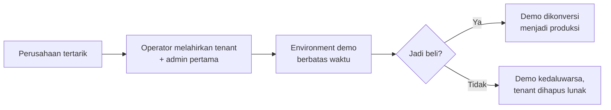
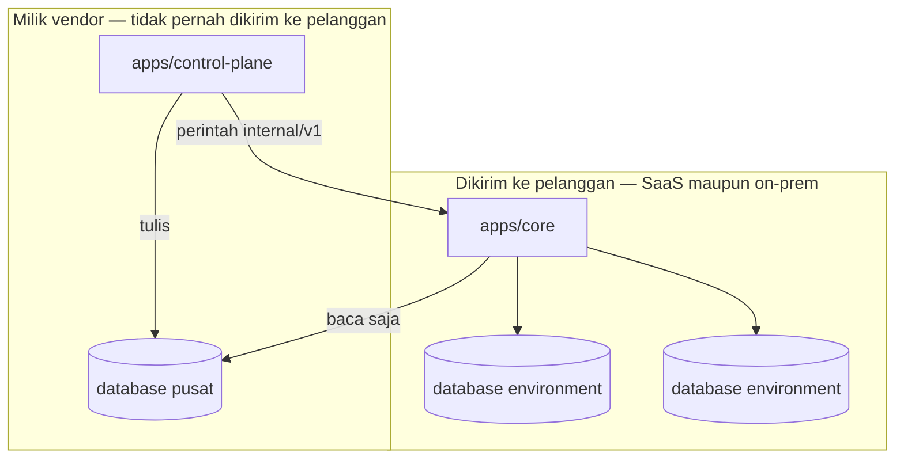
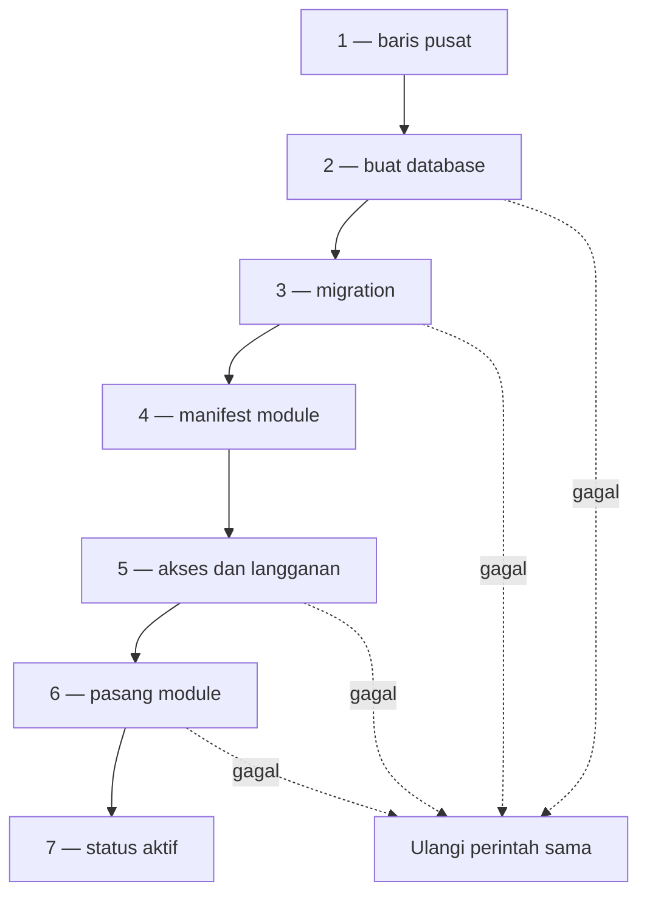
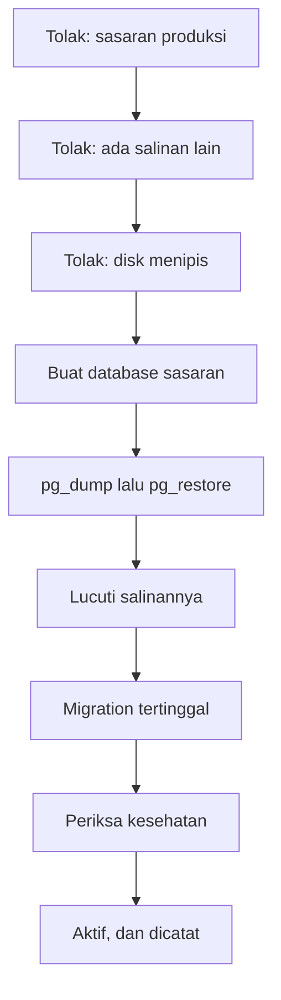

# Control plane: pelanggan, environment, dan cara keduanya lahir

Halaman ini rencana kerja, bukan desain kanonik. Ia menunggu review; bila disetujui, isinya naik ke
`docs/dev/` sebagai halaman desain tersendiri — dan itulah yang menutup instruksi `LIFE-15`.

## Pertanyaan yang harus dijawab halaman ini

> *Sebuah perusahaan tertarik dengan sistem kita. Apa yang harus saya lakukan sekarang?*

Itu pertanyaan pemilik produk, dan ia yang menentukan seluruh bentuk halaman ini. Jawabannya —
beserta alasannya di [bagian tersendiri](#dari-tertarik-sampai-jadi-pelanggan) — adalah:

**Buatkan tenant untuk perusahaan itu, berisi satu environment demo berbatas waktu.** Jangan
menumpangkan demonya ke tenant milik kita sendiri.

Versi pertama halaman ini menjawab pertanyaan yang salah. Ia merancang **daftar environment** untuk
tenant yang sudah ada, padahal pekerjaannya dimulai satu langkah sebelumnya: tenant itu sendiri
harus dilahirkan, beserta admin pertamanya. Hari ini tenant **hanya bisa lahir dari pendaftaran
mandiri** — tidak ada satu pun jalur bagi operator. Konsol yang dibangun di atas rancangan lama
karena itu hanya dapat melayani pelanggan yang kebetulan sudah mendaftar sendiri, kebalikan dari
alur jualan yang sebenarnya.

## Kenapa ini ada

Hari ini satu pelanggan hanya dapat memiliki satu tempat kerja. Tidak ada tempat mencoba rilis
sebelum ia menyentuh data sungguhan, tidak ada tempat melatih pengguna baru tanpa mengotori pembukuan,
dan tidak ada tempat memperlihatkan produk kepada calon pelanggan tanpa memberinya server sendiri.

Lubang itu sudah tercatat. Audit terhadap Dynamics 365 F&O menuliskannya sebagai `LIFE-15` pada
[lifecycle dan deployment](../general/03-lifecycle-dan-deployment.md):

> No environment management: the schema structurally forbids a sandbox, and there is no
> copy-environment, data upgrade, feature flag, or maintenance mode.

Verifiernya menambahkan urutan yang mengikat: ia harus **mendahului** `LIFE-06`, worker upgrade —
karena memutakhirkan data pelanggan tanpa pernah mencobanya lebih dulu bukan sesuatu yang boleh
dibangun. Dan temuan itu ditutup satu perintah: *"Write the design into docs/dev before building."*

Tetapi kalimat temuan itu membundel lima hal yang pembenarannya berbeda-beda, dan halaman ini hanya
mengambil dua di antaranya. Menuliskan mana yang **ditolak** sama pentingnya dengan menuliskan mana
yang dikerjakan — kalau tidak, tiga pekerjaan yang tidak perlu ikut terbawa.

| Klaim `LIFE-15` | Diterima? |
| --- | --- |
| Skema melarang sandbox | **Sudah tidak akurat.** Benar saat ditulis; `tenant_deployments` kini tidak punya pembaca, jadi ongkosnya jauh lebih kecil daripada yang ditaksir temuan itu |
| Tidak ada copy-environment | **Diterima** — dan ia inti halaman ini |
| Tidak ada data upgrade | **Ditolak.** Itu istilah Dynamics untuk pipeline tersendiri yang mengubah data lama saat naik versi mayor. Di sini perubahan skema **adalah** migration, dan aturannya sudah maju-saja serta aman diulang. Yang sebenarnya ditunjuk klaim ini adalah worker upgrade — `LIFE-06`, temuan lain |
| Tidak ada feature flag | **Ditolak dari cakupan ini.** Bentuknya sudah diputuskan di [release dan on-prem](../../dev/03-release-and-on-prem.md): baris per kode dengan registry, nol migration per parameter. Yang belum ada hanya penyimpanannya, dan ia tidak berhubungan dengan environment |
| Tidak ada maintenance mode | **Diterima**, tetapi kecil — ia muncul sendiri begitu migration berjalan ke banyak environment |

Dan alasan yang menopang dua yang diterima **bukan** "Dynamics punya". Alasannya berdiri sendiri:
jalur upgrade tidak dapat dibangun dengan aman tanpa tempat mencobanya. Repo ini sudah membayar
harganya sekali — dua cacat jalur mundur di [bundle on-prem](../bundle-on-prem/README.md) baru
ketahuan **karena dijalankan**, bukan karena dibaca.

Kata **demo** tidak muncul satu kali pun di seluruh `docs/`. Halaman ini yang pertama menuliskannya.

## Yang sudah ada hari ini

| Bagian | Keadaan | Tempatnya |
| --- | --- | --- |
| Pendaftaran usaha lengkap dengan pemasangan module | Ada | `App\Actions\Onboarding\RegisterBusiness` |
| Pemasangan, penonaktifan, dan pencabutan module per tenant | Ada | `module:install`, `module:disable`, `module:uninstall` |
| Registry module dari berkas, tanpa daftar yang ditulis tangan | Ada | `App\Support\Modules\ModuleRegistry` |
| Scope tenant yang gagal tertutup pada baca **dan** tulis | Ada | `TenantScope`, `MilikTenant` |
| Konteks aktif per permintaan, dimemoisasi | Ada | `CurrentWorkspace`, `ResolveModuleContext` |
| Menghitung modul yang ikut ke dalam image | Ada | `php artisan edition:modules` |
| Membuktikan modul yang tidak dibeli tidak ada di image | Ada, dijaga CI | `scripts/verify-edition.sh` |
| Bundle on-prem beserta pemasangan dan jalur mundurnya | Ada, sudah dijalankan | [bundle on-prem](../bundle-on-prem/README.md) |
| Identitas operator vendor | Ada, tetapi hanya dua izin | tabel `provider_access` |

## Yang belum ada, diukur bukan ditaksir

Dibaca dari kode pada 12 September 2026. Tiap baris punya bukti negatifnya — bukan "sepertinya
belum ada", melainkan "pemanggilnya dihitung dan jumlahnya nol".

| Kemampuan | Keadaan |
| --- | --- |
| **Operator membuat tenant** | **Nol jalur.** `Tenant::create` hanya punya satu pemanggil di seluruh `apps/core`: `RegisterBusiness`. Dua perintah beban uji menyisipkan baris `tenants` mentah, tetapi tanpa user, membership, role, maupun environment — hasilnya tenant yang tidak bisa dimasuki siapa pun |
| **Operator membuat admin pertama** | **Mustahil, dan dikunci tiga tempat.** Undangan dilarang memberi owner (`CreateInvitation`: *"Invitations cannot grant owner access"*); layar akses dilarang memindahkannya (`UpdateMembership`); dan `system_role='owner'` hanya pernah ditulis di `RegisterBusiness` |
| **Satu orang di banyak tenant** | **Sudah ada** sejak 13 September 2026, lewat jalur kedua: orang yang **sudah masuk** menukar kodenya, dan yang dikirim hanya kodenya. Penolakan email-sudah-terdaftar pada jalur tamu sengaja **tetap berdiri** — mencabutnya membuka pengambilalihan akun |
| **Undangan yang benar-benar terkirim** | **Tidak ada email sama sekali di repo.** Folder `app/Mail` dan `app/Notifications` tidak ada; nol hit untuk `Mailable`, `Mail::`, `->notify(`. Admin menyalin kodenya lalu mengirim sendiri |
| **Undangan yang aman** | Kodenya **tidak ditujukan ke siapa pun** (tidak ada kolom email), **tidak pernah kedaluwarsa** (`expires_at` ditulis `null` harfiah), dan **dapat dipakai berkali-kali tanpa batas** |
| **Ubah app setelah tenant lahir** | **Tidak ada.** `entitlements()->create` hanya satu pemanggil. Pelanggan yang ingin menambah app harus disunting langsung di database |
| **Registry environment** | Sudah ada sejak irisan pertama; sebelumnya `tenants` tidak punya kolom jenis maupun lingkungan |
| **`environment_members`** | **Ditulis, tidak pernah dibaca.** Satu-satunya penulis `RegisterBusiness`; nol pembaca di seluruh repo |
| **Scope tenant pada model inti Core** | **Tidak ada global scope.** Sisi module dijaga keras — query tanpa tenant aktif melempar. Sisi Core menyaring `where('tenant_id', ...)` manual per controller: lupa berarti **bocor diam-diam**, bukan 500, dan tidak ada test yang menangkapnya |
| **SSO** | **Tidak ada.** Nol Socialite, nol SAML, nol OIDC, nol Entra. Yang terpasang Fortify + passkey/WebAuthn — itu *passwordless*, bukan *single sign-on*. Audit repo sendiri menamainya `SEC-14` |
| **Alamat per tenant** | **Tidak ada.** Nol `Route::domain` di seluruh repo. Satu alamat, satu halaman login, satu sesi |
| Menyalin environment, mengosongkan, memulihkan, masa berlaku | Belum ada |
| Mode pemeliharaan | Belum ada |
| Data contoh | Belum ada. Repo hanya punya seeder bahan uji dan satu factory |

Dua baris yang paling menentukan pekerjaan ini: **operator tidak dapat melahirkan apa pun**, dan
**model inti Core bocor diam-diam kalau sebuah controller lupa menyaring**. Yang kedua jadi tajam
begitu orang luar — calon pelanggan yang belum membeli apa pun — masuk ke sistem yang sama.

## Dari tertarik sampai jadi pelanggan

### Kata yang menentukan segalanya

> **Tenant** adalah batas identitas satu pelanggan.
> **Environment** adalah tempat kerja di dalam batas itu.

Calon pelanggan **sudah** pelanggan yang berbeda — ia hanya belum membayar. "Belum membayar" adalah
status **entitlement**, bukan alasan menaruhnya di dalam batas identitas orang lain.

### Kenapa demo tidak boleh menumpang tenant kita

Alasan yang paling mengikat bukan kerapian melainkan identitas: kalau demo hidup di tenant kita,
admin calon pelanggan itu harus menjadi **anggota tenant kita**. Ia masuk ke daftar keanggotaan
perusahaan kita sendiri — dan sebagaimana tercatat di atas, model inti Core belum punya global
scope, sehingga satu controller yang lupa menyaring sudah cukup untuk memperlihatkan data kita
kepada orang yang belum membeli apa pun.

Microsoft menjawabnya dengan kalimat harfiah:

> *"If the prospect is convinced and decides to buy Business Central, you can then either let them
> keep the environment that they're currently using, or create a new production environment for
> them. **If the tenant is yours rather than the prospect's, then a new tenant is provided to
> them.**"*

Baca kalimat terakhirnya: demo yang ditaruh di tenant vendor **tetap dibuang** saat deal jadi.
Dan lisensi partner sandbox mereka melarangnya terang-terangan — *"You aren't allowed to use this
license for customers (in a customer tenant), nor for production use."*

| | Demo di tenant kita | Demo di tenant mereka |
| --- | --- | --- |
| Saat jadi beli | Tenant baru; data trial tidak terbawa; akun admin dibuat ulang | Tambah environment produksi di tenant yang sama — identitas, keanggotaan, entitlement lanjut |
| Saat tidak jadi | Sisa keanggotaan orang luar di tenant kita, selamanya | Hapus lunak tenantnya, bersih |
| Kuota dan tagihan | Tidak terhitung per pelanggan | Natural per tenant |
| Kalau scoping bocor | Data kita terlihat orang luar | Hanya data mereka sendiri |

### Alurnya



### Konversi, bukan environment kedua

Ketika prospek jadi membeli, environment demonya **dikonversi di tempat** — bukan diganti
environment baru yang kosong.

Power Platform melakukannya persis begitu:

> *"You can convert a trial environment to a production environment by switching it to consume from
> paid capacity, preventing it from being disabled or deleted."*

Syaratnya kapasitas diperiksa lebih dulu, dan operasinya memakan waktu. Business Central justru
tidak punya konversi tipe environment sama sekali — yang berubah di sana langganannya.

**Kita mengikuti Power Platform**, dan alasannya bukan kemiripan: **data yang diisi prospek selama
demo adalah alasan terkuat ia jadi membeli.** Membuangnya lalu menyuruhnya mengetik ulang adalah
cara termurah kehilangan pelanggan yang sudah hampir menandatangani.

Satu jebakan yang layak dicatat dari Business Central, karena bentuknya mudah terulang: di sana
akhir masa trial dipicu **peristiwa identitas** — siapa yang pertama kali masuk setelah lisensi
dipasang — dan bukan aksi admin. *"If an administrator is the first person to sign in after the
license was applied... then the trial will continue until it expires."* Pemicu yang bergantung pada
urutan login adalah pemicu yang akan salah, dan konversi kita tidak boleh berbentuk begitu: ia
operasi eksplisit yang dijalankan operator, tercatat di `environment_operations`.

### Template demo — menyiapkan sekali, memakai berulang

Menyiapkan satu demo yang matang — data contoh bagus, setelan rapi — lalu memakainya berulang per
prospek **bukan** "demo di tenant vendor". Itu **template**, dan ia sumber kebingungan yang wajar
karena hasilnya terlihat mirip.

Bedanya: template tidak pernah dimasuki pelanggan mana pun. Ia cetakan, bukan tempat kerja.

Azure SQL memakai pola yang sama untuk melahirkan tenant baru — *"Elastic Jobs can also be used to
maintain a template database used to create new tenants"* — dan di PostgreSQL ia hampir gratis:
`CREATE DATABASE ... TEMPLATE` menyalin seluruh isinya tanpa memutar ulang satu migration pun.

Business Central menyediakan jalur ketiga yang **tidak** kita ambil: partner menyiapkan demo di
tenantnya sendiri lalu **memindahkan environment itu** ke tenant pelanggan. Protokolnya tetap layak
dicontoh karena ketiganya menutup lubang nyata, dan ketiganya akan kita pakai pada operasi panjang
mana pun:

| Yang dicontoh | Lubang yang ditutupnya |
| --- | --- |
| **Serah terima dua sisi** — sumber mengajukan, tujuan menerima | Pemindahan sepihak tidak pernah punya saksi |
| **Jendela penerimaan yang kedaluwarsa** (8 jam di sana) | Permintaan yang menggantung selamanya menumpuk tanpa ada yang menutupnya |
| **Kuota diperiksa saat eksekusi, bukan saat diterima** | *"Accepting a transfer doesn't reserve the quota, and the transfer fails if quota is no longer available"* |

Dan satu garis yang harus kita putuskan sekarang, bukan nanti: di sana **data environment ikut
pindah utuh, identitas tidak** — *"these users aren't migrated to the new Microsoft Entra tenant.
You have to recreate the users on the target tenant."* Selama `tenant_id` dan `environment_id`
belum menjadi dua sumbu yang terpisah, memindahkan environment lintas tenant berarti menulis ulang
setiap baris.

## Identitas: siapa yang masuk, dan lewat mana

Lima keputusan, semuanya diambil pemilik produk pada 12 September 2026.

### Admin pertama dibuatkan operator

Operator mengisi nama dan email saat melahirkan tenant. Sistem membuat akunnya dengan **kata sandi
sementara**, dan masuk pertama **wajib menggantinya**.

Yang dibeli: kecepatan. Akses dapat diberikan di tengah pertemuan, tanpa menunggu email.
Yang dibayar: kata sandi sempat melewati tangan operator, dan itu tercatat sebagai akses vendor ke
akun pelanggan. Alternatifnya — undangan lewat email — ditolak karena **repo ini tidak punya satu
pun jalur email**, sehingga ia bukan pilihan yang tersedia hari ini.

### Satu orang boleh berada di banyak tenant

Satu akun, satu email, banyak keanggotaan. Konsultan, akuntan, dan operator vendor sendiri
membutuhkannya, dan pengalihnya **sudah ada** di navbar Core (`workspace-switcher`, tiga tingkat:
tenant → legal entity → unit kerja).

**Ini menabrak sesuatu — dan cara mengatasinya bukan yang pertama terpikir.** `RedeemInvitation`
menolak email yang sudah punya akun, dan selama penolakan itu berdiri sendirian, satu orang di
tenant kedua mustahil lewat jalur mana pun.

Tetapi **mencabut penolakan itu adalah lubang pengambilalihan akun.** Kode undangan dirancang untuk
dibagikan — ia bukan bukti identitas. Tanpa penolakan itu, siapa pun yang memegang satu kode dapat
mengetik email orang lain beserta kata sandi pilihannya sendiri, dan keluar sebagai pemilik akun itu.

Yang dikerjakan karena itu **menambah jalur, bukan mencabut penjaga**: orang yang sudah masuk
menukar kodenya tanpa mengirim nama, email, maupun kata sandi — identitasnya sudah dibuktikan oleh
sesinya, dan undangan hanya menambah tempat ia boleh bekerja. Rutenya keluar dari grup `guest`,
karena selama ia dijaga begitu orang yang sudah punya akun bahkan tidak dapat mencapainya.

Selesai 13 September 2026. Keanggotaan yang sudah aktif ditolak tanpa melahirkan baris kedua, dan
keanggotaan yang pernah dicabut dihidupkan kembali — mengundang ulang orang yang pernah keluar
adalah alasan undangan itu ada.

Risikonya ditulis apa adanya: satu akun yang bocor menjangkau banyak pelanggan sekaligus. Itu
ongkos yang diterima sadar, dan ia yang membuat SSO per tenant menjadi penting kelak.

### Alamat bertingkat

`<tenant>.<jenis>.contoh.co.id`, dengan produksi tanpa label jenis: `<tenant>.contoh.co.id`.

Jenisnya terbaca dari bilah alamat, dan cookie terpisah antar jenis secara alami — sandbox tidak
dapat membaca sesi produksi karena peramban sendiri yang memisahkannya.

### SSO disiapkan untuk dua mode sekaligus

Tabel setelan penyedia identitas **per tenant**, dengan tiga keadaan:

1. ikut penyedia bersama milik kita;
2. pakai penyedia sendiri — OIDC lebih dulu, SAML kemudian;
3. kata sandi lokal saja.

Keduanya sangat mungkin terjadi: pelanggan kecil akan memakai yang pertama, pelanggan korporat akan
menuntut yang kedua karena mereka mau mencabut akses karyawan dari direktori mereka sendiri.

**Yang dibangun sekarang hanya tempatnya, bukan integrasinya.** Yang penting dua hal: jalur masuk
tidak boleh dirancang dengan asumsi hanya ada kata sandi, dan **domain harus sudah dapat menentukan
tenant sebelum orangnya mengetik apa pun** — karena itulah yang memungkinkan mengarahkan orang ke
penyedia identitas yang benar.

::: warning Bagian ini sudah usang
Kalimat di atas ditulis sebelum SSO dibangun. **SSO OIDC sudah ada di repo ini sejak 13 September
2026**, untuk pengguna tenant maupun untuk operator admin.erp, beserta undangan yang terikat subjek
penyedia. Keadaan sekarang ada di [SSO](/dev/32-sso) dan
[Identity dan access](/dev/09-identity-and-access#kapan-sebuah-tenant-memakai-sso).

Yang masih benar dari rencana di atas: mode "penyedia milik pelanggan" baru berupa skema — tabelnya
berdiri, integrasinya belum, dan pengarahan berdasarkan domain email belum dibaca kode mana pun.
:::

### Operator vendor boleh masuk, tanpa jejak — untuk sekarang

Keputusan sadar, beserta akibatnya yang ditulis di sini supaya tidak mengejutkan siapa pun: pada
hari pertama ada keluhan *"siapa yang mengubah data saya"*, tidak ada yang bisa menjawab.

Microsoft menempuh jalan berlawanan dan patut dicatat sebagai arah, bukan sebagai celaan: akses
partner di sana **berbatas waktu, paling lama dua tahun**, permintaannya kedaluwarsa dalam 90 hari,
dan pelanggan dapat mencabutnya sepihak dari panel mereka sendiri. Jejak audit adalah hal yang
harus ada **sejak hari pertama** atau tidak pernah — menambahkannya kelak berarti seluruh periode
sebelumnya tetap gelap.

### Pendaftaran mandiri tetap hidup

Dua pintu berdampingan, dan ini diminta eksplisit. Microsoft pun punya keduanya: *self-service
sign-up* melahirkan tenant **tanpa admin sama sekali** — *"An unmanaged tenant is a tenant that has
no Global Administrator"* — lalu sebuah proses pengambilalihan mengubahnya menjadi tenant terkelola.

Yang **tidak** boleh: dua salinan alur pembuatan tenant. `RegisterBusiness` diangkat menjadi satu
aksi yang dipakai kedua pintu, dan yang berbeda hanya asal kata sandinya serta siapa yang tercatat
sebagai pembuat. Dua salinan adalah dua tempat yang akan menyimpang, dan yang menyimpang di sini
adalah rantai izin.

## Bagaimana Microsoft melakukannya

Dibaca dari sumbernya pada 11 September 2026, bukan dari ingatan. Enam hal yang menentukan bentuk
rancangan di bawah.

**1. Environment adalah objek kelas satu dengan penyimpanan sendiri.** Satu pelanggan memiliki banyak
environment, dan masing-masing punya database, alamat, jenis, dan versinya sendiri. Batasnya ditegakkan
penyimpanan, bukan kode: aplikasi di environment Test *"only is permitted to connect to the Test
database"*.

**2. Cara menskalakannya adalah berbagi runtime, bukan berbagi baris.** Azure menyebutnya
*horizontally partitioned deployment* — satu application tier bersama, penyimpanan terpisah per
tenant. Untungnya disebut apa adanya: masalah *noisy neighbor* hilang. Risikonya juga: pembuatan
komponen per-tenant itu wajib otomatis, karena sekarang jumlahnya banyak.

**3. Jenis adalah properti, bukan produk yang berbeda.** Production, Sandbox, Trial, Developer. Hanya
Sandbox yang punya `Copy` dan `Reset`. Trial kedaluwarsa dan dibersihkan sendiri.

**4. Jumlahnya dibatasi kuota, dan kuotanya diperiksa tiga kali.** Business Central memberi satu
produksi dan tiga sandbox; sisanya dibeli. Kuota diperiksa saat membuat, **saat menyalin**, dan **saat
memulihkan** — bukan hanya saat membuat.

**5. `Copy` adalah operasi intinya, dan salinannya dilucuti senjatanya.** Ini bagian yang paling
berharga, dan yang paling mudah dilupakan kalau hanya membaca ringkasan fiturnya. Ketika produksi
disalin menjadi sandbox, Business Central menghentikan job queue, mematikan agent, menonaktifkan
**seluruh webhook**, menghapus detail SMTP beserta akun emailnya, mengosongkan setup integrasi, dan
memblokir panggilan HTTP keluar dengan pesan yang menyebut alasannya:
*"The request was blocked by the runtime to prevent accidental use of production services."*

Tanpa itu, "demo" akan mengirim email sungguhan kepada pelanggan sungguhan.

**6. Menghapus itu lunak dulu, keras kemudian** — dan setiap tindakan masuk log operasi, dengan
riwayat per environment yang menyebut siapa memulai apa dan kapan.

Satu hal yang **tidak** dilakukan Microsoft, dan ini dinyatakan terang-terangan: ia **tidak
menyamarkan data** saat menyalin. *"Any action taken for the purpose of complying with privacy laws
and regulations must be handled separately and repeated for the environment."* Yang dilucuti adalah
sambungan keluarnya, bukan datanya. Konsekuensinya untuk kita ada di
[bagian terakhir](#di-mana-keputusan-yang-dikunci-menggigit).

::: tip Istilahnya sudah diterjemahkan Microsoft
Localization Indonesia produknya memakai **"Lingkungan"** untuk *environment* dan **"Pusat admin"**
untuk *admin center*. Dokumen ini dan nama kode tetap memakai `environment` sebagai kata pinjaman
teknis — kalau tidak, ia bertabrakan dengan "lingkungan lokal" pada
[setup](../../onboarding/setup.md) — tetapi **setiap layar menulis "Lingkungan"**.
:::

## Dan bagaimana ERP sekelas kita melakukannya

Meniru Microsoft saja lemah sebagai pembenaran: ia perusahaan dengan ribuan engineer, menjual ke pasar
yang berbeda, dan sanggup membangun apa pun yang dirancangnya. Yang membuat pola ini layak ditiru
adalah hal lain — **vendor dengan ukuran yang sangat berbeda sampai pada bentuk yang sama.**

**Odoo**, yang paling dekat skalanya dengan kita. Staging branch-nya adalah *"neutralized duplicates
of the production database"*, dan tujuannya ditulis persis seperti kebutuhan di halaman ini:
*"meant to test new features using production data without compromising the actual production database
with test records."* Yang dinetralkan: scheduled action, email keluar — **dialihkan ke penampung
surat, bukan sekadar dimatikan**, sehingga orang masih dapat melihat surat apa yang seharusnya
terkirim — penyedia pembayaran, metode pengiriman, dan layanan berbayar per pakai.

**Frappe dan ERPNext**, lewat `bench`: banyak site, **satu database per site**, dan menggandakan site
adalah operasi biasa, bukan prosedur khusus.

**Business Central**, dengan daftar pelucutan yang sudah dikutip di atas.

Tiga vendor, tiga ukuran tim yang jauh berbeda, satu bentuk yang sama: **salin, lalu lucuti.** Itu
pembenaran yang jauh lebih kuat daripada selisih terhadap satu produk enterprise.

Dan satu hal yang Odoo lakukan lebih baik daripada keduanya, yang halaman ini tiru: sejak v16, aturan
netralisasi hidup di **berkas milik tiap module**, bukan di satu daftar terpusat. Alasannya ada di
[pelucutan](#operasi-copy-beserta-pelucutannya), dan ia menambal lubang yang rancangan awal halaman
ini akui sendiri.

## Pemisahan plane, dan kenapa ia mendahului segalanya

Pekerjaan ini menyingkap cacat yang sudah ada sebelum ia dimulai, dan cacat itu harus dibereskan lebih
dulu karena semua yang lain berdiri di atasnya.

**`apps/core` bukan control plane.** Ia application plane — runtime Core, layanan platform,
dan UI yang dipakai pelanggan. Seluruh dokumen dan seluruh berkas compose sudah memanggilnya Core:
`core-app`, `core-db`, `core-worker`, "image edisi Core", "runtime Core". Hanya nama foldernya yang
menyimpang, dan selama ia menyimpang, kata "control plane" tidak dapat dipakai untuk benda yang
benar-benar control plane.

**Dan pusat admin tidak boleh ikut ke server pelanggan.**
[Release dan on-prem](../../dev/03-release-and-on-prem.md) mengikat bahwa source app yang tidak dibeli
harus absent dari bundle on-prem, dan bahwa *"yang menegakkan batas komersialnya adalah ketiadaan
berkas, bukan sebuah sakelar."* Pusat admin bukan app yang dibeli siapa pun — ia alat vendor, dan ia
memuat registry seluruh pelanggan. Hari ini tidak ada satu pun yang memeriksanya, karena pemeriksa
kebocoran edisi hanya melihat folder `modules/`.

### Keputusan: satu repo, dua aplikasi

| | `apps/core/` | `apps/control-plane/` |
| --- | --- | --- |
| Isi | runtime Core dan seluruh module bisnis | registry environment, orkestrasi, log operasi, konsol operator |
| Plane | application | control |
| Penghuni | pelanggan | vendor |
| Ikut bundle on-prem | **Ya** | **Tidak pernah** |

`apps/core` → `apps/core` adalah **rename**, bukan penulisan ulang: ia menyelaraskan nama
folder dengan nama yang sudah dipakai di mana-mana.

Bukan dua repo. [Grand design](../../dev/01-grand-design.md) mengunci satu repo dengan satu cabang
utama, dan pemindahan ke satu runtime pada 10 September 2026 mengarsipkan empat repo justru karena
ongkosnya. Repo terpisah menuntut salinan model identitas, auth sendiri, CI sendiri, dan deploy
sendiri — untuk masalah yang tidak diselesaikannya.



### Siapa memerintah, siapa mengerjakan

Pembagiannya mengikuti penempatan AWS, yang menaruh provisioning di **application plane** justru
karena *"the resources it must provision and configure are more directly connected to services that
are created and configured in the application plane."*

Yang tahu cara membuat database, menjalankan migration, membaca registry module, dan menyemai data
awal hanyalah Core. Jadi pusat admin **memerintah** dan Core **mengerjakan**: pusat admin menulis
baris `environments`, memerintahkan Core mengerjakan langkah beratnya, lalu mencatat hasilnya di
`environment_operations`.

::: warning Transportnya belum diputuskan, dan klaim sebelumnya salah
Versi terdahulu halaman ini menulis bahwa perintahnya lewat `/api/internal/v1/...` memakai
`AuthenticateAppService` yang sudah ada, dan bahwa "tidak ada mekanisme baru yang perlu ditemukan".
Itu keliru, dan baru ketahuan saat hendak menyambungkannya.

Middleware `internal-app` menuntut **tiga** header — `X-CoreERP-App-Id`, `X-CoreERP-Service-Token`,
dan `X-CoreERP-Tenant-Id` — lalu memeriksa bahwa app itu **terpasang pada tenant itu**. Ia dirancang
untuk app module yang memanggil Core atas nama satu tenant. Pusat admin bukan app module, tidak
terpasang pada tenant mana pun, dan justru sedang bekerja pada environment yang tenant-nya belum
punya apa-apa. Memaksakannya berarti menerbitkan kredensial app palsu untuk setiap pelanggan.

Arah control plane → application plane karena itu **memang** menuntut jalur autentikasinya sendiri,
dan itu keputusan yang belum diambil. Sampai ia diambil, perintahnya dijalankan sebagai perintah
artisan di Core (`environment:siapkan`), dan konsol menampilkan perintahnya di halaman rincian.
Tombol yang memanggilnya lebih dulu berarti memutuskan bentuk kredensialnya sambil lalu — dan batas
jaringan yang seharusnya menopangnya (`internal: true`) juga belum berdiri.
:::

### Ditegakkan mesin, bukan diniatkan

`scripts/verify-edition.sh` — pemeriksa kebocoran yang sudah ada, dijaga CI, dan sudah terbukti dapat
merah — diperluas menolak setiap jejak `pusat-admin` di dalam image edisi: berkas, nama namespace, dan
rute. Mesinnya sudah ada; yang ditambah hanya satu sasaran.

::: warning Core harus tetap hidup ketika pusat admin mati
Core membaca tabel `environments` dengan peran database **hanya-baca** lalu memoisasinya. Memanggil
pusat admin pada setiap permintaan akan menjadikan konsol operator titik gagal tunggal bagi seluruh
pelanggan — dan konsol operator adalah bagian yang paling jarang diuji.
:::

Dan on-prem justru menyederhana: tidak ada pusat admin, tidak ada database pusat, tidak ada registry
environment. Core berjalan sebagai satu-satunya environment, persis seperti hari ini.

## Batas antara data pusat dan data environment

Satu aturan menentukan seluruh pembagian ini: **database environment harus sanggup menjadi
keseluruhannya.** On-prem adalah satu environment tanpa control plane; kalau sebuah permintaan tidak
dapat dijawab dari database environment saja, jalur on-prem patah.

Akibatnya, sisi environment adalah CoreERP yang hampir utuh dan sisi pusat adalah lapisan tipis. Itu
juga yang menentukan koneksi mana yang diberi nama: **`control` yang bernama, environment yang menjadi
bawaan** — sisi environment menyentuh hampir setiap query di repo ini, sisi pusat hanya segelintir.

| Sisi | Isi |
| --- | --- |
| Pusat | `users` beserta passkey dan 2FA, `sessions`, `cache`, `jobs`, `clients`, `tenants`, `provider_access`, ditambah `environments`, `environment_members`, `environment_operations` |
| Environment | Semua sisanya: organisasi beserta hierarchy, seluruh rantai `role → duty → privilege → permission`, katalog dan entitlement, urutan nomor, kalender fiskal, satuan, workflow, `outbox_events`, catatan pemasangan module, dan seluruh tabel module |

### Kenapa katalog ikut ke sisi environment

Ini pembenaran yang menanggung seluruh rancangan, dan ia bukan selera.

`LaunchableAppCatalog::permissionQuery()` berjalan pada **setiap permintaan module** dan menyambung
`security_role_duties → security_duty_privileges → security_privilege_permissions → permissions` —
tiga tabel milik tenant dan satu tabel katalog, dalam satu join. PostgreSQL tidak dapat join lintas
database. Menaruh katalog di pusat mengubah query terpanas di sistem ini menjadi dua perjalanan
jaringan beserta penyaringan di PHP.

Lagipula `security_privileges` dan `security_duties` **bukan katalog murni**: sejak migration yang
menambahkan konfigurasi keamanan per tenant, keduanya memuat baris dari manifest **dan** baris yang
ditulis tenant sendiri. Keduanya tidak dapat dibelah.

Ini gratis justru karena keputusan "satu versi untuk semua environment": katalog menjadi fungsi murni
dari image, dan `app:register-manifest` sudah aman diulang.

::: danger Cara membelah yang salah, dan ia menggoda
Membelah dengan kalimat "control plane memiliki identitas" akan menaruh `tenant_memberships` dan
`roles` di sisi pusat. Akibatnya sandbox **berbagi baris membership dengan produksi**, dan menyunting
sebuah role di sandbox untuk mencobanya mengubah akses di produksi. Itu versi rancangan ini yang
terkirim lalu diam-diam memberi orang hak produksi.
:::

`environment_members` ada di pusat sebagai **indeks navigasi, bukan sumber otorisasi**. Ia menjawab
"environment mana yang muncul di pengalih", sementara yang menjawab "boleh berbuat apa" tetap
`tenant_memberships` di dalam environment. Baris basi di sana hanya boleh menghasilkan 403, tidak
pernah izin tambahan — dan kalimat itu wajib ikut sebagai komentar migrationnya, karena orang pertama
yang mengoptimalkan akan tergoda mempercayainya.

### `control` yang menunjuk koneksi bawaan

Pada on-prem dan di seluruh test suite, `control` dan koneksi bawaan adalah koneksi yang sama, PDO
yang sama, transaksi yang sama. Hanya SaaS yang memisahkan keduanya.

Itu bukan kelicikan, melainkan syarat. `RefreshDatabase` hanya membungkus koneksi bawaan dalam
transaksi; dua koneksi sungguhan ke database yang sama masing-masing membuka transaksi sendiri, dan
data yang ditulis satu koneksi tidak terlihat oleh koneksi lainnya. Test menjadi tidak dapat melihat
datanya sendiri. Satu keputusan ini yang menyelamatkan jalur edisi on-prem **dan** seluruh test suite
yang sudah ada; perilaku multi-database diuji suite kecil tersendiri yang benar-benar membuat dan
membuang database.

### Entitlement milik tenant, pemasangan milik lingkungan

Tabel di atas sudah menempatkan "catatan pemasangan module" di sisi environment sejak halaman ini
ditulis. Kodenya tidak mengikutinya, dan selisih itu baru terlihat ketika pemilik produk bertanya
apakah membuat lingkungan sudah membuat database dan menjalankan seeder. Jawabannya waktu itu:
databasenya ya, seedernya tidak — `environment:siapkan` hanya menjalankan migration Core.

Akibatnya sebuah demo lahir dengan skema Core lengkap dan **nol tabel module**. Bukan kosong,
hilang. Dan karena pemasangan module tercatat per tenant, sebuah tenant dengan produksi dan demo
hanya punya satu baris untuk pertanyaan yang punya dua jawaban — termasuk `seeded_at`, kolom yang
seluruh alasan keberadaannya mencegah data awal terisi dua kali. Lingkungan kedua akan dilewati
seedernya karena lingkungan pertama sudah menandainya.

#### Dua tingkat, dan Microsoft memisahkannya juga

| | Milik | Menjawab |
| --- | --- | --- |
| Entitlement | Tenant | App apa yang **boleh** ada |
| Pemasangan | Lingkungan | App apa yang **benar-benar** ada, di tempat kerja yang mana |

Business Central menyebutnya langsung: *"These apps are unique per environment"*, dan *"A Business
Central environment is built as a collection of apps"* — sementara lisensinya justru di tenant:
*"Each Microsoft Entra tenant that buys a Business Central online license automatically gets some
environments."*

Power Platform memberi nama pada tingkat pertengahannya, `applicationPackages`: daftar app yang
boleh dipasang, dihitung dari entitlement tenant, tetapi ditanyakan **per environment** —
*"we retrieve the list of Applications you can install to a specific environment"*. Statusnya pun
dieja terpisah: `Enabled` berarti *"ready to be installed in your environments"*, `Configured`
berarti ia sudah dipasang di salah satunya.

#### Keputusan: lingkungan mewarisi entitlement tenantnya, tanpa kecuali

Microsoft membolehkan dua environment dalam satu tenant punya daftar terpasang yang berbeda. **Kita
tidak.** Tidak ada isian app pada layar pembuatan lingkungan, dan tidak ada entitlement per
lingkungan. Yang dibeli tenant, itu yang dipasang di setiap tempat kerjanya.

Alasannya bukan bahwa Microsoft salah, melainkan bahwa perbedaannya belum membeli apa pun pada skala
5-10 prospek per minggu — sementara ongkosnya nyata: satu daftar lagi yang bisa menyimpang dari
tenantnya, dan satu layar lagi yang harus menjelaskan kenapa demo pelanggan tidak memuat produk yang
ia beli.

Yang **tidak** boleh ikut disederhanakan adalah catatannya. Pemasangan tetap fakta per lingkungan
meski daftarnya selalu sama, karena migrationnya memang berjalan atau tidak berjalan di database
yang berbeda.

#### Kenapa tanpa kolom `environment_id`

`core_module_installations` tidak diberi kolom baru. Ia justru **tinggal di database lingkungan itu
sendiri**, berdampingan dengan riwayat migration yang ia gambarkan. Tiga alasan, dan yang kedua yang
menentukan:

1. `environment:salin` menyalin database secara fisik, jadi catatan pemasangan ikut apa adanya tanpa
   satu baris kode pun — dan perintah itu memang **sudah** membandingkan jumlahnya sesudah restore.
   Rancangan ini sudah dianut Copy sebelum ditulis di sini.
2. `seeded_at` dan riwayat migration harus sepakat. Bila catatannya di database pusat sementara
   tabelnya di database lingkungan, sebuah restore dari cadangan yang lebih tua membuat keduanya
   berselisih diam-diam: catatannya bilang sudah disemai, tabelnya kosong, dan seed tidak pernah
   berjalan lagi. Satu database membuat keduanya berhasil atau gagal bersama.
3. Kolom baru pada kunci gabungan berarti delapan tempat yang hari ini bertanya `(tenant, module)`
   harus ikut menyebut lingkungan — delapan kesempatan melewatkan satu, dan yang terlewat tidak
   berbunyi: ia menampilkan menu module yang tabelnya tidak ada.

#### Yang berubah

- **`KoneksiLingkungan`** — satu tempat yang menjawab "database mana", menggantikan salinan ketiga
  dari `konfigurasiDasar`/`siapkanKoneksi`. Ia memindahkan `database.default` untuk selama satu
  blok, dan **sekaligus memasang `coreerp.control_connection`** ke koneksi semula. Yang kedua itu
  yang menahan `users`, `tenants`, `clients`, dan registry `environments` tetap di pusat selama blok
  berjalan — tanpa itu, seeder module yang membaca `Tenant` akan mencarinya di database sandbox.
  Ini pemakaian sungguhan pertama trait `MilikPusat`; sebelumnya ia memang tidak melakukan apa-apa.
- **`InstallModule`** menerima lingkungan, dan seluruh badannya berjalan di dalam blok itu. Menyebut
  lingkungan **opsional**; kosong berarti lingkungan produksi tenant itu — yang `database_name`-nya
  hari ini kosong, yaitu database bawaan. Jalur tanpa penyebutan karena itu berjalan persis seperti
  sebelumnya, dan pendaftaran mandiri tidak berubah satu query pun.
- **`PasangModulYangDibeli`** — membaca entitlement yang berlaku sekarang, menyaringnya ke module
  yang benar-benar ada di edisi ini, lalu memasangnya dalam urutan topologis dari
  `AppDependencyGraph`. Tanpa urutan itu, daftar yang sama kadang berhasil dan kadang gagal
  tergantung urutan barisnya tertulis di database.
- **`environment:siapkan`** memperoleh dua langkah: `catat-database` sebelum module dipasang — karena
  pemasangan menanyakan `database_name` untuk tahu ke mana ia menulis — lalu `pasang-module`.
  Statusnya naik ke `active` **sesudah** keduanya. Kegagalan memasang satu module tidak ditelan:
  lingkungan setengah terisi harus menjadi tempat yang tidak dapat dimasuki.
- **`module:install`, `module:disable`, `module:uninstall`** memperoleh `--lingkungan=`. Id yang
  disebut tetapi tidak ada dijawab galat, bukan diam-diam jatuh ke produksi.
- **`environment_operations.requested_by`** akhirnya terisi untuk penyiapan dari layar. Sebelumnya
  kolom "Oleh" berbunyi "Sistem" — jawaban yang benar untuk penjadwal, dan jawaban yang salah untuk
  tombol yang baru saja ditekan manusia.

#### Dua cacat yang hanya muncul saat dijalankan, bukan saat diuji

Keduanya berbentuk sama dengan cacat header token yang melahirkan `KontrakPerintahKeCoreTest`:
**test yang subjeknya dipilih penulisnya akan setuju dengan asumsi penulisnya.**

1. **Demo yang belum punya database meminjam pemasangan milik produksi.** Keduanya berbagi database
   bawaan dan penyaringnya hanya `tenant_id`, sehingga layar rincian menampilkan "Human Resources —
   Terpasang" tepat di bawah kalimat yang menyatakan lingkungan itu belum memuat apa pun. Aturannya
   sekarang eksplisit: `database_name` kosong berarti database bawaan **hanya** untuk lingkungan
   produksi; yang lain berarti belum punya database sama sekali.
2. **Atribusi operator hilang di perbatasan tipe.** `Artisan::call()` meneruskan `int` apa adanya
   lewat `ArrayInput`, sementara perintahnya hanya menerima `string` — jadi penyiapan lewat tombol
   berhasil sepenuhnya sambil mencatat "Sistem". Testnya ikut setuju karena ia memanggil dengan
   `(string) $id`. Yang menemukannya satu panggilan `curl` sungguhan; testnya kini memakai bentuk
   yang benar-benar dikirim pemanggilnya.

#### Tombolnya, dan alasan lama yang sudah tidak berlaku

Layar rincian lingkungan dulu hanya **menampilkan** perintah `environment:siapkan` untuk disalin ke
terminal. Alasannya ditulis apa adanya di sana: arah konsol ke Core belum punya jalur autentikasi.
Alasan itu gugur ketika `HanyaPusatAdmin` lahir bersama pembuatan pelanggan — token yang sama persis
kini menjaga `POST /api/internal/v1/environments/{id}/siapkan`.

Sinkron, bukan lewat antrean, dan itu keputusan bukan kemalasan: pekerja antrean yang mati di tengah
meninggalkan lingkungan `degraded` yang tidak dilihat siapa pun sampai ada yang membuka layarnya;
permintaan HTTP yang mati di tengah meninggalkan keadaan yang sama, tetapi orangnya sedang menatap
layar ketika itu terjadi. Yang membuatnya sah adalah dua sifat yang sudah ada — kunci operasi punya
masa berlaku, dan perintahnya aman diulang.

## Cara sebuah permintaan memilih databasenya

Middleware pemilih environment berjalan **sesudah** `auth` dan **sebelum** middleware Inertia.
Urutannya sah karena `auth` hanya membaca `users` dan `sessions`, dan keduanya selalu di pusat —
tidak ada yang membutuhkan environment sebelum environment diketahui.

`CurrentWorkspace` mendapat kunci session keempat di samping tiga yang sudah ada, dan
`ResolveModuleContext` tidak berubah sama sekali.

### Gagal tertutup, dua lapis

1. **Pada mode SaaS, koneksi bawaan menunjuk database yang tidak ada.** Binding yang lupa gagal dengan
   `database "coreerp_no_environment" does not exist` sebelum satu baris pun bergerak. PostgreSQL yang
   menegakkannya; tidak ada kode yang dapat melupakannya.
2. Sebuah penjaga mendengar event koneksi dan melempar dengan pesan yang terbaca manusia. Ia
   dipersenjatai hanya ketika mode environment menyala, sehingga on-prem dan test suite tidak
   tersentuh.

Lapis pertama tidak dapat dihapus tanpa sengaja. Lapis kedua yang membuat pesannya berguna.

### Yang harus ikut dipaku ketika koneksi bawaan digeser

Menggeser `database.default` memindahkan **semua** yang tidak menyebut koneksinya sendiri. Sebagian
besar tabel memang harus ikut pindah — itu gunanya. Yang tidak boleh ikut adalah tabel sisi pusat,
dan daftarnya lebih panjang daripada daftar model bertrait `OwnedByControlPlane`.

| Yang dipaku | Kunci config | Kalau lupa |
| --- | --- | --- |
| Model sisi pusat | `coreerp.control_connection` | `users`, `tenants`, `clients`, registry environment dicari di database lingkungan |
| Sesi | `session.connection` | Setiap permintaan ke alamat lingkungan memulai sesi baru; login tidak pernah bertahan |
| Cache | `cache.stores.database.connection` | Pembatas laju login berjalan per lingkungan, bukan per pemasangan |
| Kunci cache | `cache.stores.database.lock_connection` | Dua pekerja memegang kunci yang sama tanpa saling melihat |
| Antrean | `queue.connections.database.connection` | Job yang dilahirkan di sandbox menunggu di tabel `jobs` yang tidak dibaca pekerja mana pun |
| Job gagal | `queue.failed.database` | Kegagalan job tersebar di puluhan database dan tidak pernah dibaca |
| Token reset sandi | `auth.passwords.users.connection` | Tautan reset sandi dibuat di satu database dan dicari di database lain |

Dipaku lewat config, bukan lewat urutan middleware, dan bedanya menentukan. Urutan mengandalkan
sesuatu yang berjalan lebih dulu; pakuan mengandalkan nilai yang memang disetel. Penjaga database
dev yang gagal sebelumnya di repo ini gagal persis karena ia memeriksa niat, bukan akibat.

### Dua hal yang ditemukan saat menelusuri jalur masuk, dan keduanya tidak akan berbunyi

**Passkey tidak ikut terpaku oleh `OwnedByControlPlane`.** `User` memang memakai trait itu, tetapi
`passkeys()` adalah relasi, dan Eloquent memberi model terkait koneksi dari **properti** `$connection`
— bukan dari `getConnectionName()` yang trait itu timpa. Properti itu null, jadi model passkey jatuh
ke koneksi bawaan, yaitu database lingkungan. Akibatnya: pelanggan yang masuk dengan passkey dari
alamat lingkungannya tidak menemukan passkey-nya sendiri.

Menambal dengan mewariskan koneksi ke setiap relasi salah — sebuah model sisi pusat boleh punya
relasi ke data tenant, dan pewarisan buta akan menyeret yang itu ikut ke pusat. Yang benar menandai
model terkaitnya: `Laravel\Passkeys\Passkeys::usePasskeyModel()` menerima kelas pengganti, jadi
`App\Models\Passkey` mewarisi milik paket lalu memakai `OwnedByControlPlane` sendiri.

**`fortify.passkeys.allowed_origins` berisi satu alamat.** Ia diturunkan dari `app.url`, sedangkan
pelanggan masuk dari `<tenant>.contoh.co.id`. WebAuthn menerima `relying_party_id` yang merupakan
akhiran terdaftar dari origin — jadi `contoh.co.id` sah untuk seluruh subdomain — tetapi daftar
origin yang diizinkan tetap diperiksa apa adanya. Sampai daftarnya diturunkan dari domain dasar,
passkey hanya bekerja pada satu alamat.

Keduanya tidak akan pernah merah di suite mana pun hari ini: seluruh test berjalan pada satu
database dan satu alamat.

### Gagal tertutup: 404 dan 503 menjawab pertanyaan yang berbeda

| Keadaan | Jawaban | Kenapa |
| --- | --- | --- |
| Di bawah domain kita, tidak terurai | 404 | Keberadaan sebuah lingkungan adalah informasi; 403 memberi tahu penanya bahwa demo itu memang ada |
| Terurai, tetapi belum pernah punya skema | 404 | Ia memang belum pernah ada bagi siapa pun |
| Terurai, pernah hidup, sekarang tidak aktif | **503** | Pemiliknya sudah tahu ia ada. Menyembunyikannya tidak melindungi apa pun dan membuat gangguan terbaca seperti salah ketik |

Pembedanya `schema_migrated_at`: terisi berarti lingkungan itu pernah benar-benar berdiri.

### Lapis gagal-tertutup kedua menunggu database pusat benar-benar terpisah

Rancangan ini menyebut dua lapis, dan yang pertama — koneksi bawaan menunjuk database yang tidak ada
— **belum dapat dipasang**. Ia menuntut `coreerp.control_connection` menunjuk koneksi bernama yang
benar-benar terpisah, sedangkan hari ini ia kosong dan seluruh tabel berbagi satu database.

Yang sudah berlaku sekarang: selama satu permintaan berada di lingkungan yang punya database sendiri,
`control_connection` **diisi** dengan koneksi semula. Jadi pakuan sisi pusat nyata, bahkan sebelum
databasenya dipisah. Yang belum nyata hanyalah ledakan otomatis bagi jalur yang lupa menggeser.

### Empat jalur yang wajib disebut

Keempatnya pernah menjadi sumber bug kelas ini di sistem mana pun yang melakukannya.

| Jalur | Aturannya |
| --- | --- |
| Queue job | Wajib membawa id environment. Job tanpa itu **melempar**, bukan memakai sisa permintaan sebelumnya |
| Perintah artisan | `--environment` wajib untuk apa pun yang menyentuh data tenant |
| Scheduler | Berjalan memutari seluruh environment, dan **melanjutkan setelah kegagalan** |
| `internal/v1` | Tidak berubah — lihat di bawah |

::: warning Jebakan yang hanya ketahuan kalau kodenya dibaca
Laravel men-deserialisasi payload job **sebelum** job middleware berjalan. Job yang membawa model sisi
tenant sebagai propertinya akan mencoba me-resolve-nya tanpa environment terikat. Job yang ada hari
ini kebetulan bersih karena ia membawa id, bukan model — dan "kebetulan" bukan jaminan. Kunci dengan
boundary test: **job antrean dilarang membawa model sisi tenant sebagai properti konstruktor.**
:::

Untuk scheduler, melanjutkan setelah kegagalan bukan kenyamanan. Loop naif yang berhenti pada
environment ketiga membuat environment keempat sampai terakhir tidak pernah menjalankan pemulihan
nomor, sementara scheduler membuang keluarannya — jadi tidak ada yang tahu sampai sebuah urutan nomor
kontinu kehabisan, berbulan-bulan kemudian.

### `internal/v1` tidak mendapat header baru

Menambah `X-CoreERP-Environment-Id` berarti mengubah kontrak dan seluruh pemanggilnya. Sebagai
gantinya, `app_service_credentials` pindah ke sisi pusat dan membawa id environment. Token sudah
berbentuk `<credential_id>.<secret>`, jadi id kredensialnya yang menentukan environment.

Dua sifat lahir gratis dari perpindahan itu:

- token produksi **tidak dapat** mengalamati sandbox — secara konstruksi, bukan lewat pemeriksaan;
- sandbox tiba **tanpa satu pun token layanan**, karena tabelnya memang tidak ikut tersalin.

Yang kedua adalah butir pelucutan nomor satu, dan ongkosnya nol.

::: warning Ongkos yang baru terasa pada load test
Mengganti database per permintaan berarti memutus dan menyambung ulang koneksi pada setiap permintaan,
sementara tidak ada PgBouncer di berkas compose mana pun. Ini hal pertama yang akan bergerak pada
[gate load](../../dev/20-load-and-concurrency-testing.md). Dua jalan keluarnya: pasang PgBouncer dalam
mode transaksi, atau simpan koneksi per environment di dalam proses dan terima bahwa umurnya
mengikuti proses.
:::

## Pendaftaran yang sebenarnya sudah tidak atomik

`RegisterBusiness` terbaca seperti satu transaksi, dan ia bukan. Pemasangan module, seeding, dan draft
urutan nomor berjalan di `DB::afterCommit` — **sesudah** commit. Kegagalan di sana, hari ini, sudah
meninggalkan tenant yang punya entitlement dan role Owner tetapi nol module terpasang: pengguna yang
berhasil mendaftar lalu masuk ke launcher kosong.

Jadi memisahkan database tidak menghilangkan atomicity. Ia membuat retakan yang sudah ada menjadi
kelihatan, dan dapat diperbaiki.

Penggantinya satu perintah — `environment:provision` — yang **aman diulang** dan dapat dilanjutkan
setelah gagal di tengah, sesuai aturan yang sudah berlaku di
[release dan on-prem](../../dev/03-release-and-on-prem.md).



| Langkah | Yang dikerjakan | Kunci aman-diulangnya |
| --- | --- | --- |
| 1 | `users`, `clients`, `tenants`, dan baris `environments` berstatus menyiapkan | Id environment, dicetak paling dulu |
| 2 | Membuat database — **di luar transaksi**, karena PostgreSQL melarangnya di dalam | Nama database diturunkan dari id; "sudah ada" diperlakukan berhasil |
| 3 | Menjalankan migration | Tabel migration milik environment itu |
| 4 | Mendaftarkan manifest seluruh module di image | Sudah aman diulang hari ini |
| 5 | Membership, entitlement, role Owner, data policy, dan satuan bawaan | Kunci alaminya sudah punya unique index |
| 6 | Memasang module yang dibeli | Sudah aman diulang hari ini |
| 7 | Menaikkan status menjadi aktif | Transisi status dijaga |

Yang membuat ini aman bagi pengguna: **`aktif` adalah satu-satunya status yang dapat dirutekan.**
Provision yang gagal menghasilkan environment yang tidak bisa dimasuki — bukan environment yang
dimasuki lalu ternyata rusak.

Dua perubahan kecil wajib ikut, karena tanpanya langkah kelima gagal pada percobaan kedua: pembuatan
role, membership, role assignment, dan entitlement harus memakai bentuk yang menerima baris yang sudah
ada; dan pembuatan slug yang berpola periksa-lalu-sisip harus menjadi sisip-lalu-tangkap, supaya dua
pendaftaran bernama sama tidak saling menjatuhkan.

::: danger Jangan menulis rollback kompensasi
Menghapus tenant ketika provision gagal melanggar larangan hapus fisik repo ini, dan ia balapan dengan
percobaan ulang: pengulangan yang menyala saat kompensasi sedang berjalan akan kehilangan baris yang
baru saja dibuatnya. Perbaikan **maju** yang aman diulang adalah satu-satunya bentuk yang sejalan
dengan aturan yang sudah ada.

**Dan ada pembenaran yang lebih kuat daripada aturan repo.** Alasan sebenarnya bukan "kami melarang
hapus fisik" melainkan **tidak ada keadaan baik untuk dikembalikan**: sebelum provision, environment
itu belum pernah benar-benar ada. Bandingkan dengan update, yang punya keadaan baik — dan di sana
Business Central memang memakai pemulihan mundur, *"restores the environment to its state immediately
before the update started"*, yang dapat memakan lebih dari sejam. Jadi yang menentukan bukan
silo-lawan-pool, melainkan ada atau tidaknya keadaan sebelumnya yang masih sah.
:::

### Nama polanya, supaya ia dapat ditunjuk

Azure memberi kosakata yang membuat alur di atas berhenti menjadi selera:

- Langkah 2 — `CREATE DATABASE`, yang wajib di luar transaksi — adalah **pivot transaction**:
  *"Pivot transactions serve as the point of no return in the saga."*
- Langkah 3 sampai 7 adalah **retryable transactions**: *"Retryable transactions follow the pivot
  transaction"*, dan masing-masing idempoten supaya alurnya tetap mencapai keadaan akhirnya.
- Peringatan yang menopang larangan di atas: *"Compensating transactions might not always succeed,
  which can leave the system in an inconsistent state."*

Karena perintah kita dijalankan **ulang seutuhnya** dan bukan dilanjutkan dari langkah tertentu,
nama yang lebih tepat lagi datang dari Kubernetes: **reconciliation loop**, yang setiap putarannya
*"tries to move the current cluster state closer to the desired state."*

Azure juga menyebut tiga respons kegagalan yang sah **per langkah**, bukan satu untuk seluruh alur:
ulangi langkah yang gagal; lanjut ke langkah berikutnya bila langkah itu memang boleh gagal; atau
tinggalkan alurnya dan picu pemulihan manual. Ditambah satu pertanyaan yang belum pernah kita
jawab — *"Also consider the user experience for each failure scenario."*

## Migration yang menyebar ke banyak environment

Riwayat migration hidup di dalam masing-masing environment. Satu perintah menjalankannya ke semua, dan
mencatat **sidik skema** — nama migration terakhir yang teraplikasi — pada baris pusatnya.

Sidik, bukan kolom versi. Justru karena versinya cuma satu, "tertinggal" adalah fakta yang dihitung
dengan membandingkan sidik environment terhadap sidik image, bukan angka yang harus dijaga seseorang.

Environment yang gagal di tengah ditandai dan **menolak dirutekan**, dengan halaman pemeliharaan. Satu
environment buruk tidak menyandera yang lain, dan ia juga tidak diam-diam melayani skema yang belum
selesai dimigrasi.

### `environment:upgrade` — satu perintah, tiga pekerjaan

Ia memutari setiap lingkungan yang punya databasenya sendiri, dan untuk masing-masing menjalankan:

1. **migration Core** ke dalam database itu;
2. **migration module** untuk tiap module yang tercatat terpasang di sana;
3. **pemasangan module yang baru dibeli** — `InstallEntitledModules` dipanggil apa adanya, dan ia
   melewati yang sudah terpasang tanpa mengisi ulang data awalnya.

Langkah ketiga itu yang menutup lingkaran. Sebuah tenant yang membeli app tambahan bulan depan tidak
menuntut jalur tersendiri: entitlementnya bertambah, perintah yang sama memasangnya di setiap tempat
kerja tenant itu.

Lingkungan yang `database_name`-nya kosong dilewati, dan itu bukan kelalaian: ia memang tinggal di
database pusat, yang sudah dimigrasi `php artisan migrate` biasa sebelum perintah ini berjalan.

### Kegagalan satu lingkungan tidak boleh menyandera yang lain

Loop naif yang berhenti di lingkungan ketiga membuat yang keempat sampai terakhir tidak pernah
dimigrasi — dan karena penjadwal membuang keluarannya, tidak ada yang tahu sampai sesuatu pecah
berbulan-bulan kemudian.

Jadi: tiap lingkungan dibungkus sendiri, kegagalan dicatat, loop berlanjut, dan kode keluar perintahnya
bukan nol bila ada satu pun yang gagal. Ringkasan di akhir menyebut nama yang berhasil dan yang tidak,
karena keluaran yang hanya berbunyi "3 gagal" memaksa orangnya membuka database untuk tahu yang mana.

### Gagal berarti `maintenance`, bukan `degraded`

Keduanya sama-sama tidak dirutekan, tetapi artinya berbeda dan jawabannya berbeda.

`degraded` untuk lingkungan yang **penyiapannya** gagal: ia belum pernah hidup, jadi 404 benar.
`maintenance` untuk lingkungan yang **pembaruannya** gagal: ia hidup kemarin dan pemiliknya tahu ia
ada, jadi 503 benar.

Dan berhenti melayani memang jawaban yang benar di sana, meski terasa keras. Kode yang sudah terpasang
menuntut skema baru; melayaninya di atas skema lama berarti pelanggan bertemu galat yang tidak dapat
dijelaskan siapa pun, satu per satu, sepanjang hari. Yang salah bukan pilihan berhentinya melainkan
membiarkan kegagalannya tidak terlihat.

### Seed yang harus sampai ke pelanggan lama adalah migration, bukan seeder

Ini aturan, bukan selera, dan ia menjawab setengah dari pertanyaan "kalau saya menambah seed".

`seeded_at` menandai **sekali seumur pemasangan**. Itu memang bentuk yang benar untuk data awal:
pelanggan yang menonaktifkan module lalu mengaktifkannya lagi tidak boleh mendapat master bawaan
dobel. Akibatnya, seeder yang ditambahi baris baru pada versi berikutnya **tidak akan pernah berjalan**
untuk tenant yang sudah memasangnya.

Jadi pembagiannya:

| Jenisnya | Ditulis sebagai | Sampai ke |
| --- | --- | --- |
| Data awal saat module dipasang | seeder module | Tenant yang baru memasang |
| Data acuan baru untuk semua | **migration data** | Semua, lama maupun baru |

Core sudah menganut pola itu tanpa pernah menuliskannya: `seed_country_regions` adalah migration,
bukan seeder. Yang belum ada hanya kalimat yang mengikatnya, dan kalimat itu sekarang ada di
`AGENTS.md`.

### Ongkos yang sudah diketahui dan belum dibayar

Menjalankan `environment:upgrade` sebagai bagian dari rilis berarti **setiap rilis tertahan sampai
seluruh lingkungan selesai dimigrasi.** Sepuluh lingkungan tidak terasa; dua ratus adalah jendela
pemeliharaan berpuluh menit bagi semua pelanggan sekaligus.

Untuk tahun pertama itu diterima dengan sadar, dan alasannya angka: 5–10 prospek per minggu, dan tidak
semuanya jadi. Jalan keluarnya sudah dirancang di bagian
[Migration yang menyebar ke banyak environment](#migration-yang-menyebar-ke-banyak-environment) —
jendela per lingkungan beserta pembatalan otomatisnya, dan *deployment rings*. Keduanya pekerjaan
tersendiri, dan tidak satu pun dari keduanya menjadi mendesak sebelum lingkungannya berpuluh.

::: warning Masalah yang harus diputuskan sebelum pelanggan ke-50, bukan sesudahnya
`deploy/compose.edition.yaml` menjalankan `core-migrate` sebagai layanan sekali-jalan, dan ketiga
layanan lain menunggunya selesai. Membuatnya memutari setiap environment berarti **setiap rilis
tertahan selama seluruh environment dimigrasi, sebelum satu permintaan pun dilayani.**

Sepuluh environment tidak terasa. Dua ratus adalah jendela pemeliharaan berpuluh menit, pada setiap
rilis, untuk semua pelanggan sekaligus. Business Central menghindarinya dengan membiarkan tiap
environment mengambil pembaruannya sendiri — persis yang dilarang keputusan satu versi untuk semua.

Dua jalan keluarnya, dan yang pertama direkomendasikan untuk tahun pertama:

1. **Pertahankan gerbangnya, batasi migrationnya.** Wajibkan setiap migration aman dijalankan saat
   sistem hidup, dan jaga dengan pemindai berkas — bentuk penjaga yang sudah biasa di repo ini.
2. **Lepaskan gerbangnya.** Migrasikan environment di latar, dan sajikan halaman pemeliharaan bagi
   yang tertinggal. Bergulir, bukan serentak — tetapi kode baru berjalan di atas skema lama selama
   satu jendela, yang menghormati satu versi di dalam kode sambil melanggarnya dalam praktik.

**Ada jalan ketiga yang tidak terpikir saat ini ditulis, dan ia punya nama:** *deployment rings*.
Azure menyebutnya apa adanya — *"Deployment rings enable you to progressively roll out updates across
a set of tenants"* — dengan cincin canary, early adopter, lalu semua pengguna. Gerbangnya tetap ada,
tetapi **per cincin**, bukan per armada, sehingga rilis tidak pernah menunggu dua ratus environment
sekaligus. Halaman yang sama menopang penolakan kita atas model Business Central: *"Be careful about
enabling tenants to initiate their own updates."*

Dan mekanismenya, dari vendor yang benar-benar menjalankannya. Business Central tidak pernah
memigrasikan semua sebelum melayani: jendela update **per environment** (minimum enam jam, bawaan
20:00–06:00 waktu setempat), batas waktu keras — *"Updates that fail to complete before the end of
the update window are canceled"* — lalu **dijadwalkan ulang otomatis tujuh hari kemudian** beserta
pemberitahuannya, dan mode pemeliharaan per environment, bukan global.

Polanya karena itu bukan "lepaskan gerbangnya" melainkan **jendela per environment + pembatalan
otomatis + penjadwalan ulang + pemberitahuan**. Opsi 1 tetap perlu, tetapi tidak cukup sendirian:
tanpa batas waktu per environment, satu environment besar tetap menahan rilis.
:::

::: tip Template database memangkas langkah migrationnya sama sekali
Azure SQL menjalankan fan-out migration lewat **job agent tersendiri** — *"The job agent database
holds job definitions, job status, and history"* — jadi status penyebarannya hidup di luar registry
environment, bukan sebagai kolom di dalamnya seperti rancangan kita.

Job yang sama merawat sebuah **template database**: *"Elastic Jobs can also be used to maintain a
template database used to create new tenants."* Environment baru lahir dari template yang sudah
mutakhir — `CREATE DATABASE ... TEMPLATE` di PostgreSQL — bukan dari memutar ulang seluruh riwayat
migration. Itu memotong langkah 3 `environment:provision` menjadi hampir nol, dan menghapus satu
kelas bug sekaligus: environment baru yang lahir dengan skema tertinggal.

Belum dikerjakan, dan sengaja dicatat sebagai perbaikan, bukan syarat.
:::

## Layar Pembaruan: memantau armada dari satu tempat

Perintah `environment:upgrade` menjawab "bagaimana caranya"; layar ini menjawab "bagaimana kami
tahu ia berhasil". AWS menyebut keharusannya tanpa basa-basi: *"the system should enable tenants to
be onboarded, managed, and operated through a single pane of glass"*, dan yang harus disimpan control
plane disebut eksplisit — *"You need to know which version of infrastructure, software, or feature
each tenant uses, what they're eligible to migrate to, and the time-based data associated with those
states. Tracking this information is often one of the responsibilities of a control plane."*

### Yang ditiru, beserta alasannya

**Dipantau dengan menanyakan daftar operasi, bukan daftar environment.** Business Central menyatakan
ini sebagai aturan, bukan saran: *"consumers should rely on the `status` field of the corresponding
`EnvironmentOperation` response to monitor the status of the underlying operation. So, to get the
updated status of the operation, consumers should poll the `Get environment operations for all
environments` endpoint rather than `Get Environments`"*.

Kita sudah punya tabelnya sejak Irisan 1 — `environment_operations`, lengkap dengan status, langkah,
alasan gagal, waktu mulai dan selesai, serta siapa yang meminta. **Pemantauannya karena itu gratis;
yang kurang hanya layarnya.**

**Sasaran dihitung ulang saat eksekusi, bukan saat tombol ditekan.** Azure SQL Elastic Jobs
menyebutnya *dynamic enumeration*: *"Dynamic enumeration ensures that jobs run across all databases
that exist in the server or pool at the time of job execution."* Dan ia menyebut kenapa itu penting
justru untuk kasus seperti kita: *"especially in SaaS customer scenarios where databases are added or
deleted dynamically."*

Akibatnya di kode kita: perintahnya membaca `environments` saat berjalan. Lingkungan yang lahir satu
menit setelah tombol ditekan ikut, tanpa didaftarkan ke mana pun.

**Skrip pembaruan wajib aman diulang.** Elastic Jobs menuntutnya sebagai syarat, bukan anjuran:
*"An elastic job's T-SQL scripts must be idempotent, that is, if the script succeeds and it runs
again, the same result occurs."* `environment:provision` sudah begitu sejak awal, dan
`environment:upgrade` mewarisi sifat itu dari komponen yang sama.

**Kolom yang berulang di lebih dari satu vendor.** Versi sekarang, versi target berikutnya, status
operasi, waktu mulai dan selesai, pesan galat, dan siapa yang memicunya. Business Central memberi
nama field-nya sendiri — `versionDetails.version`, "Latest Available Version", "Next Update",
`errorMessage`, `createdBy` — dan Elastic Jobs memberi padanan barisnya: `start_time`, `end_time`,
`last_message`, `current_attempts`.

### Bentuk layarnya — sudah berdiri

Satu halaman, `/pembaruan`, di konsol operator. Sumbernya `GET /api/internal/v1/fleet` milik Core,
satu panggilan untuk seluruh armada.

Kepala halaman menyebut **versi platform** — sidik skema milik image yang sedang berjalan — beserta
empat hitungan: mutakhir, tertinggal, bermasalah, belum terbaca. Satu tombol: **Perbarui semua yang
tertinggal**, yang mati sendiri ketika tidak ada yang tertinggal.

Tabelnya satu baris per lingkungan:

| Kolom | Isinya |
| --- | --- |
| Lingkungan | Nama tempat kerjanya beserta slug-nya |
| Pelanggan | Nama badan hukum |
| Jenis | Produksi, Demo, Sandbox |
| Keadaan | Mutakhir · Tertinggal · Bermasalah · Belum terbaca |
| Sidik skema | "Sama dengan image", atau sidiknya utuh bila ia berbeda |
| Operasi terakhir | Hasil, langkah terakhir, waktu, siapa yang memicunya, dan alasan bila gagal |
| Aksi | Perbarui — hanya untuk yang tertinggal atau bermasalah |

Tiga hal berbeda dari rencana di atas, dan ketiganya lahir dari menjalankannya:

**Sidiknya tidak "dipendekkan" — ia disembunyikan ketika sama.** Rencananya memotong sidik menjadi
beberapa karakter. Itu justru merusak satu-satunya alasan kolom itu ada: bagian yang membedakan dua
nama berkas migration ada di **ekornya**, jadi potongan berujung elipsis membuat dua baris yang
berbeda terbaca sama persis. Yang dilakukan sekarang kebalikannya — baris yang sidiknya sama dengan
image berbunyi "Sama dengan image", dan hanya yang berbeda yang menampilkan namanya utuh. Angka yang
memaksanya: kolom sidik penuh meluberkan tabel 231 piksel pada jendela 965 piksel, dan yang terdorong
keluar layar adalah kolom aksi beserta tombolnya.

**Waktu dan "Oleh" tidak berkolom sendiri.** Keduanya menjelaskan operasi terakhir, jadi keduanya
tinggal di dalam selnya. Dua kolom tambahan yang isinya kosong pada baris yang belum pernah punya
operasi hanya melebarkan tabel untuk ruang putih.

**"Sedang dikerjakan" bukan salah satu dari empat keadaan.** Ia muncul di kolom aksi, menggantikan
tombolnya. Alasannya sama dengan alasan tombolnya tidak muncul di baris yang mutakhir: menekan
"Perbarui" pada lingkungan yang sedang dikerjakan akan ditolak kunci operasi, dan penolakan itu
terbaca operator sebagai kegagalan pembaruannya.

Halaman ini **memuat ulang dirinya tiap delapan detik selama masih ada operasi yang berjalan**, dan
diam sepenuhnya ketika tidak ada. Syaratnya keadaan yang berakhir sendiri, jadi tidak ada jadwal
yang harus dimatikan siapa pun.

Satu lubang ditutup di sisi Core ketika tombolnya menjadi nyata: `POST /environments/upgrade`
sekarang **melewati lingkungan yang operasi terakhirnya masih berjalan**, dan `force` pun tidak
menembusnya. Tanpa itu, operator yang menekan tombolnya dua kali — keadaan yang paling wajar, karena
angkanya belum bergerak — mengantrekan job kedua yang pasti ditolak kunci operasi, gagal, dan diulang
tiga kali.

### Yang sengaja TIDAK ditiru, dan kenapa

**Jendela pembaruan per lingkungan.** Business Central punya seluruh mesinnya: minimum enam jam,
bawaan 20:00–06:00 waktu setempat, dan pembatalan otomatis — *"Updates that fail to complete before
the end of the update window are canceled to ensure the environment is operational during business
hours. The update is automatically rescheduled seven days later and notification recipients are
informed."*

Ia menjawab masalah yang belum kita punya: ribuan environment di banyak zona waktu, dengan jendela
bisnis yang berbeda-beda. Pada sepuluh lingkungan di satu zona waktu, yang dibutuhkan hanyalah
operator yang menekan tombol pada jam yang ia pilih sendiri. Membangun penjadwal, pembatalan
otomatis, dan penjadwalan ulang sekarang berarti empat mekanisme baru yang tidak satu pun dapat
diuji pada armada seukuran ini.

**Pemberitahuan email.** Sama alasannya, ditambah satu fakta: repo ini tidak punya satu pun jalur
email. Memasang pemberitahuan berarti membangun jalur itu lebih dulu.

**Deployment rings.** Azure mendefinisikannya dengan jelas — canary, early adopter, users — dan
Business Central benar-benar menyimpan `ringName` pada tiap environment. Ia berguna ketika rilis
menyentuh cukup banyak pelanggan sehingga urutannya menentukan. Sepuluh pelanggan tidak punya urutan
yang berarti.

**Baris induk per rollout.** Elastic Jobs memisahkan eksekusi induk dan anak — *"`step_id` ... `NULL`
indicates this execution is the parent job execution"*. Kita tidak, karena `environment_operations`
berkunci asing ke sebuah environment dan sebuah rollout tidak dimiliki environment mana pun.
Hitungan "berapa berjalan" dihitung dari barisnya, bukan disimpan di baris kedua yang harus dijaga
tetap sepakat.

Keempatnya dicatat di sini beserta sumbernya supaya yang menambahkannya kelak tidak memulai dari nol.

### Percobaan ulang: tiga, bukan sepuluh

Elastic Jobs mengulang sepuluh kali dengan backoff ×2,0, batas 120 detik, dan tenggat langkah dua
belas jam. Angka itu masuk akal untuk kegagalan jaringan sesaat pada armada ribuan database.

Migration yang ditolak PostgreSQL karena bentuknya salah akan ditolak lagi dengan cara yang sama
sepuluh kali, dan yang dihasilkan hanya sepuluh baris kegagalan yang sama. Tiga cukup untuk melewati
putusnya koneksi sesaat, dan sisanya memang butuh manusia.

Tiap percobaan membuka barisnya sendiri di `environment_operations`, jadi riwayat percobaannya
terbaca tanpa kolom penghitung — percobaan yang gagal ditutup sebagai `failed` sebelum percobaan
berikutnya boleh membuka kuncinya.

### Satu hal yang tidak dijawab vendor mana pun

Apakah kegagalan satu tenant seharusnya menghentikan tenant lain. Business Central, Elastic Jobs,
Power Platform, dan AWS tidak satu pun menyatakannya. Yang paling dekat hanya nilai
`SucceededWithSkipped` pada `job_executions` — bukti bahwa sebagian target boleh dilewati tanpa
menggagalkan induknya, dan itu bukti tidak langsung.

Keputusan kita: **lanjut.** Loop yang berhenti di lingkungan ketiga membuat yang keempat sampai
terakhir tidak pernah dimigrasi, dan karena penjadwal membuang keluarannya, tidak ada yang tahu
sampai sesuatu pecah berbulan-bulan kemudian. Yang menggantikan penghentian adalah kode keluar bukan
nol beserta ringkasan yang menyebut nama — bukan diamnya.

## Operasi Copy, beserta pelucutannya



**Tidak ada downtime produksi.** `pg_dump` berjalan dalam satu transaksi *repeatable read*, jadi
salinannya konsisten pada satu titik waktu tanpa menghentikan apa pun. Jangan menambahkan langkah
pembekuan; itu sandiwara yang mengganggu pelanggan tanpa menambah jaminan.

### Pelucutan, dua lapis yang tidak saling menggantikan

**Di dalam database, sesudah restore** — membunuh yang sudah terlanjur ikut tersalin:

| Yang disalin | Bahayanya | Tindakan |
| --- | --- | --- |
| `outbox_events` yang belum terbit | Publisher akan **mengirim ulang event produksi dari sandbox** ke endpoint sungguhan. Ini bahaya paling konkret yang benar-benar ada di repo hari ini | Ditandai sudah terbit |
| Ekspor laporan yang masih antre | Berjalan lagi dan menulis ke storage | Ditandai gagal, dengan alasan berbahasa Indonesia |
| Reservasi nomor yang menggantung | Perintah pemulihan akan mengaduknya | Dilepas, **beserta kolam yang memegang nomornya** — tanpa itu nomornya hilang selamanya dan urutan berkelanjutan berhenti |
| Catatan pemasangan module | **Tidak disentuh** — sandbox tanpa module terpasang bukan salinan | — |
| Job antrean | Instruksi yang belum dijalankan, bukan catatan siapa pun. Ia akan berjalan di sandbox seolah ia produksi | Dihapus |
| Kredensial layanan | Sandbox lahir memegang **token produksi yang masih berlaku** | Dihapus. Akibatnya sandbox tiba tanpa satu pun token, dan penerbitan ulangnya pekerjaan control plane |
| **Tabel `environments` sendiri** | Lihat peringatan di bawah — ini yang membatalkan seluruh baris di atasnya | Barisnya **diturunkan** menjadi sandbox, bukan dihapus |

::: danger Satu tabel yang membatalkan seluruh pelucutan lain
`environments` ikut tersalin, dan di dalam salinannya tertulis `kind='production'` dengan
`outbound_allowed=true`. `LingkunganAktif` membaca tabel itu dari **koneksi bawaan** — jadi begitu
middleware pemilih environment menjadikan database sandbox sebagai koneksi bawaan, yaitu persis
tujuannya, sandbox membaca registry miliknya sendiri, menyimpulkan ia produksi, lalu membuka
seluruh sambungan keluarnya.

Barisnya **diturunkan**, tidak dihapus. Dihapus, `LingkunganAktif` tidak menemukan apa pun — dan
aturan tertulisnya sendiri, *"tidak tahu berarti boleh"*, justru membuka sambungan keluarnya.
:::

::: warning Baris yang sebelumnya tertulis "gratis" ternyata tidak
Versi terdahulu tabel ini menulis job antrean dan kredensial layanan **tidak ikut tersalin sama
sekali, karena keduanya di sisi pusat**. Itu tidak benar hari ini: `coreerp.control_connection`
kosong, jadi `MilikPusat` tidak memindahkan apa pun dan `jobs`, `sessions`, `users`,
`app_service_credentials`, bahkan `tenants` dan `environments` semuanya hidup di database
environment dan ikut tersalin utuh.

Ini bentuk kekeliruan yang pantas diingat: **penanda yang belum aktif terbaca seolah sudah
menjaga.** `MilikPusat` memang sudah terpasang di ketujuh model itu, dan justru karena terpasang,
mudah dikira sudah memindahkan sesuatu.
:::

**Deklarasi per module** — membunuh yang tidak dapat diungkapkan sebagai baris, **termasuk yang belum
ada saat halaman ini ditulis.**

Environment non-produksi menyalakan penolakan sambungan keluar. Tetapi yang menentukan apa saja yang
ditolak **bukan daftar di dalam Core**, melainkan berkas pelucutan yang **dideklarasikan tiap module**
— bentuk yang ditiru dari `neutralize.sql` milik Odoo.

Bedanya menentukan, dan inilah alasan bentuk ini dipilih menggantikan daftar terpusat: daftar terpusat
**pasti** basi pada hari sebuah module menambah panggilan keluar, dan basinya baru ketahuan ketika
sebuah sandbox menghubungi sistem sungguhan milik pelanggan. Deklarasi per module tidak basi, karena
ia hidup di sebelah kode yang membuat panggilan itu — dan penjaganya dapat dibuat konkret memakai
bentuk yang sudah ada di repo ini. `NoInternalHttpTest` sudah memindai berkas module untuk mencari
panggilan HTTP, justru karena — dalam kata-katanya sendiri — pemindai berkas menemukan "jalur yang
ada tetapi tidak pernah dijalankan test mana pun". Penjaga berbentuk sama dapat menolak module yang
memanggil keluar tanpa mendeklarasikan pelucutannya. Daftar terpusat yang lupa diperbarui tidak dapat
dijaga seperti itu.

Core menyediakan tiga hal, dan hanya tiga: tempat deklarasi itu dibaca, bendera yang dibaca saat
berjalan, dan jaring terakhir.

| Titik | Perilaku di environment non-produksi | Milik siapa |
| --- | --- | --- |
| Penerbit event workflow | Tidak mengirim; ditandai terbit dengan catatan bahwa ia dilucuti | Core |
| Pengirim laporan kesalahan ke Discord | Ditekan | Core |
| Perender PDF | **Tetap diizinkan** — layanan internal, dan memblokirnya mematikan pencetakan di setiap sandbox | Core |
| Baris dan setelan milik module | Apa pun yang module itu deklarasikan sendiri | Module |
| Panggilan HTTP lain apa pun | Ditolak jaring global, dengan pesan yang menyebut alasannya | Core |

Jaring global tetap ada sebagai **lapis terakhir, bukan sebagai pengganti**: ia menangkap module yang
lupa mendeklarasikan, dan menangkapnya dengan **gagal**, bukan dengan diam.

Konsekuensinya disebut apa adanya, karena ia melebarkan pekerjaan: [standar module](../../dev/02-module-standard.md)
bertambah satu berkas yang boleh dideklarasikan module, dan halaman itu ikut berubah ketika halaman
ini naik ke `docs/dev/`.

::: tip Dua dugaan yang keliru, dan keduanya terkoreksi dengan membaca kodenya
**Mengosongkan SMTP tidak punya sasaran di sini** — repo ini tidak memanggil `Mail::` maupun
`Notification::` satu kali pun; trait `Notifiable` pada model `User` adalah bawaan Laravel dan tidak
dipakai siapa pun. Yang perlu dilucuti adalah webhook dan event, bukan email — dan kalimat ini
berhenti benar pada hari sebuah module mengirim email, yang pada hari itu menambah satu baris ke
daftar pelucutan di atas.

**Telemetri tidak dapat dimatikan per environment lewat env var**, karena
[pengaturannya bersifat proses](../../dev/28-pelaporan-kesalahan.md) dan satu proses melayani
semua environment. Itu justru alasan benderanya harus ada sama sekali.
:::

### Di mana pg_dump dijalankan

Sebagai **klien lewat jaringan**, dari container Core. Bukan lewat docker socket — itu menghindari
persis jebakan yang dulu membuat worker penempatan tidak pernah bisa berjalan di environment mana pun
yang dihasilkan repo ini.

Ongkosnya satu paket klien PostgreSQL di dalam image, dan satu hal yang **harus diselesaikan sebelum
ini dikirim**: berkas compose memakai PostgreSQL 16 sementara halaman release menampilkan 17.
`pg_dump` menolak server yang lebih baru daripada dirinya, jadi ketidakcocokan itu berubah menjadi
kegagalan pada saat menyalin — bukan pada saat membaca dokumen.

Dan satu pelebaran hak yang disebut terang-terangan: peran database yang dipakai jalur provisioning
harus dapat membuat database dan membaca setiap database environment. Karena itu ia **peran
tersendiri**, bukan peran yang dipakai jalur permintaan biasa.

### Pembuktiannya

Tiga test, dan yang ketiga yang membuat dua lainnya berarti:

1. Restore sebuah fixture ke environment sandbox, lalu buktikan tidak ada event yang belum terbit dan
   tidak ada ekspor yang masih antre.
2. Masuk ke sandbox, buktikan panggilan HTTP keluar **melempar** dan tercatat, sementara perender
   internal tetap berhasil.
3. Alur yang sama pada environment produksi harus **mengirim**. Penjaga yang hijau karena buta adalah
   kegagalan yang sudah dua kali membakar repo ini.

## Tabel baru

Tiga tabel, dan yang pantas diperdebatkan saat review bukan kolomnya melainkan constraint-nya —
karena constraint yang membuat keadaan terlarang **tidak dapat diwakili**, bukan sekadar tidak
diinginkan.

`environments` menyimpan tenant pemiliknya, jenis, nama, slug yang menjadi label subdomain, nama
database, status, environment sumber bila ia salinan, tanggal berakhir, bendera sambungan keluar,
sidik skema, tanggal hapus lunak beserta tanggal boleh hilang permanen, dan siapa membuatnya.

| Constraint | Kenapa ia ada |
| --- | --- |
| Satu produksi hidup per tenant | Partial unique index. "Dua produksi" bukan keadaan yang sistem ini kenal |
| Sambungan keluar hanya boleh menyala pada produksi | Membuat "beri sandbox ini email sehari saja" menjadi perubahan skema dan sebuah percakapan. Itu memang benar: seluruh fitur ini ada supaya salinan produksi tidak dapat menghubungi pelanggan produksi |
| Hanya sandbox yang boleh punya environment sumber | Produksi tidak pernah lahir dari salinan |
| Demo tanpa tanggal berakhir ditolak | Itu bug yang tidak disadari siapa pun sampai disknya penuh |
| Hapus lunak dan tanggal hilang permanen selalu berpasangan | Menghapus tanpa jadwal berarti menyimpan selamanya tanpa ada yang memutuskannya |

`environment_members` memasangkan pengguna dengan environment yang boleh ia lihat. Sekali lagi:
**indeks navigasi, bukan sumber otorisasi.**

`environment_operations` adalah riwayatnya — jenis operasi, status, siapa memintanya, environment
sumber, **langkah terakhir yang tercapai**, dan pesan kegagalannya. Dua kolom terakhir itu jawaban
langsung atas cacat berulang yang sudah dinamai audit: kegagalan yang tidak dapat dibaca siapa pun.

Satu constraint di sini menggantikan kunci yang tidak kita punya: **partial unique index yang
mengizinkan tepat satu operasi berjalan per environment.** Tanpa Redis, itu kunci termurah yang
tersedia — dan ia sekaligus memenuhi anjuran Microsoft untuk membatasi refresh satu pada satu waktu.

::: danger Kunci tanpa masa berlaku adalah kunci yang macet permanen
Dua keputusan halaman ini bertabrakan, dan tabrakannya baru kelihatan setelah dicari sumbernya.

Indeks di atas mengizinkan tepat satu operasi berjalan, sementara satu-satunya strategi pemulihan
yang halaman ini izinkan adalah **menjalankan ulang perintahnya**. Kalau prosesnya mati di tengah —
container dibunuh, deploy berjalan, OOM — barisnya tetap berstatus berjalan **selamanya**, dan
indeks itu menolak percobaan ulang yang merupakan satu-satunya jalan keluarnya. Tidak ada kolom
kedaluwarsa, tidak ada heartbeat, tidak ada aturan siapa boleh merebutnya, dan tidak ada tombol
batal bagi operator.

Jalur merah yang sudah ditulis menguji "salinan kedua yang berjalan bersamaan ditolak". Ia tidak
menguji "operasi yang prosesnya dibunuh dapat diambil alih" — dan justru itu yang akan terjadi
lebih dulu.

Vendor lain memberi setiap operasi panjang sebuah tenggat **dan** sebuah jalan keluar manual.
Business Central membatalkan update yang lewat jendelanya lalu menjadwalkannya ulang tujuh hari
kemudian, dan menyediakan tombol Cancel update justru untuk operasi yang sedang berjalan. Azure
menyebut *"Abandon the workflow and trigger a manual recovery process"* sebagai salah satu dari tiga
respons kegagalan yang sah.

**Yang wajib ikut sebelum operasi panjang pertama mendarat:** kolom masa berlaku pada
`environment_operations`, aturan perebutan operasi yang masa berlakunya habis, aksi batal untuk
operator, dan satu baris jalur merah — *operasi yang prosesnya dibunuh di tengah dapat diambil alih
percobaan berikutnya.*
:::

::: tip `tenant_deployments` tidak perlu dibongkar
Temuan `LIFE-15` menyatakan `unique('tenant_id')` pada tabel itu mengunci satu environment per tenant,
dan bahwa lima query kesiapan menyambung lewatnya sehingga retrofitnya mahal. **Itu benar saat ditulis
dan tidak lagi benar**: kelima query itu ikut terbuang bersama jalur hosting container, dan tabelnya
kini tidak punya pembaca.

Jadi `environments` berdiri di sebelahnya, dan `tenant_deployments` bergabung ke daftar tabel yatim
yang memang sengaja dibiarkan. Entri auditnya dikoreksi bersama pekerjaan ini, karena entri itulah
yang akan dibaca orang berikutnya untuk menaksir besar pekerjaannya.
:::

## Layar

Bentuknya diturunkan dari pusat admin Power Platform yang sebenarnya — dibuka, bukan dibaca
dokumentasinya. Empat hal yang hanya terlihat kalau layarnya dipakai:

**Formulirnya pendek dan berurutan.** Hanya tiga isian wajib, dan **jenis dipilih paling dulu** karena
ia yang menentukan sisanya. Segala sesuatu yang lain berada di balik satu bagian terlipat. Bagi kita:
jenis, lalu pelanggan, lalu nama — dan di dalam lipatan, masa berlaku untuk demo atau environment
sumber untuk sandbox.

**Ada kartu ringkasan yang hidup di bawah formulir**, dan ia menyebut juga yang **tidak** dipilih. Itu
yang menggantikan dialog konfirmasi tersendiri — dan di tempat kita, itu tempat paling tepat untuk
menyatakan akibat pelucutan sebelum tombolnya ditekan.

**"Operasi terakhir" adalah kartu di halaman rincian**, bukan sesuatu yang dikubur: jenis, waktu
mulai, siapa memulai, status, dan tautan ke riwayat lengkap.

**Pembuatnya boleh bukan manusia, dan id-nya ditampilkan apa adanya.** Dua akibatnya mengikat: kolom
pembuat **nullable**, dan halaman rincian menampilkan id mentahnya supaya operator dapat
mencocokkannya dengan log dan SigNoz.

| Layar | Untuk siapa |
| --- | --- |
| Daftar environment — pelanggan, jenis, status, sidik skema, sisa masa berlaku, operasi terakhir | Operator |
| Rincian beserta riwayat operasinya dan tombol salin, tangguhkan, perpanjang, arsipkan, pulihkan | Operator |
| Dialog pembuatan | Operator |
| Log operasi dengan pesan kegagalan apa adanya | Operator |
| **Pengalih lingkungan dan spanduk permanen** | **Pelanggan** |

Yang terakhir bukan operator, dan **tidak opsional**. Setiap kali lingkungannya bukan produksi, Shell
menampilkan spanduk yang tidak dapat ditutup, berbunyi kira-kira:

> Ini lingkungan uji coba. Email, pengiriman otomatis ke sistem lain, dan laporan terjadwal dimatikan
> di sini. Apa pun yang kamu kerjakan di halaman ini tidak memengaruhi data sebenarnya.

Pengguna yang tidak tahu ia sedang di sandbox akan memperlakukan angka sandbox sebagai angka sungguhan
lalu mengambil keputusan di atasnya. Itu kerusakan yang tidak meninggalkan jejak di log mana pun.

::: tip Dua audiens, dua kosakata
[Glosarium](../../onboarding/glosarium.md) melarang `entitlement`, `placement`, dan `tenant_id` pada
layar pengguna bisnis, dengan pengecualian untuk layar operator teknis. Jadi layar operator boleh
tepat; spanduk dan pengalih di atas tidak boleh.
:::

### Yang sengaja tidak ditiru

Ditulis supaya tidak dikira terlupa: pilihan wilayah dan geografi — ia batas residensi data, dan kita
punya satu server di satu negara; halaman penggunaan dan inventaris — itu metering, dan audit sudah
mencatat tabelnya belum ada sama sekali; grup lingkungan; lingkungan terkelola; dan prabayar.

::: danger Satu bentuk yang tidak boleh ditiru dari repo ini sendiri
`routes/web.php` mendaftarkan satu endpoint katalog **tanpa middleware apa pun** sambil memulangkan
nama database, sementara halaman yang menampilkan data yang sama dijaga gate. Untuk katalog produk itu
kebocoran kecil. Untuk daftar environment seluruh pelanggan, ia kelas yang sama sekali berbeda —
pastikan setiap rute baru berada di dalam grup yang dijaga.
:::

## Alamat dan sertifikat

Pola yang diinginkan mengikuti Dynamics: `<pelanggan>-<lingkungan>.<jenis>.<domain>`, misalnya
`ivs-uat.sandbox.contoh.co.id`.

Ia menabrak dua aturan TLS yang menentukan bentuk domainnya, dan keduanya lebih baik diketahui
sekarang daripada saat sertifikatnya ditolak peramban:

1. **Sebuah wildcard hanya mencakup satu label.** `*.contoh.co.id` **tidak** mencakup
   `ivs-uat.sandbox.contoh.co.id` — RFC 6125 §6.4.3: *"the client SHOULD NOT compare against
   anything but the left-most label."*
2. **Wildcard juga tidak mencakup domain induknya sendiri.** `*.contoh.co.id` bukan
   `contoh.co.id`, jadi apex harus ikut disebut.

Dan Let's Encrypt hanya menerbitkan wildcard lewat **DNS-01** — *"Wildcard issuance must use the
DNS-01 challenge"* — yang menuntut TXT record ditulis **mesin** tiap perpanjangan. HTTP-01 tidak
bisa, dan tidak ada jalan memutarnya.

### Keputusan, dan ia tidak dibuka lagi

**Nameserver ke Cloudflare. Satu sertifikat berisi empat nama, DNS-01, dijalankan Traefik, record
DNS-only bukan proxied.**

| | |
| --- | --- |
| Nama dalam satu sertifikat | `*.contoh.co.id`, `*.demo.contoh.co.id`, `*.sandbox.contoh.co.id`, dan `contoh.co.id` |
| Kenapa satu sertifikat | Batasnya 100 nama per sertifikat — satu penerbitan cukup, bukan tiga |
| Kenapa DNS-only | Supaya sertifikat yang kita terbitkan itulah yang dilihat peramban |
| Token API | Dibatasi satu zona, izin `Zone:DNS:Edit` saja |

**Kenapa wildcard dan bukan sertifikat per tenant — dan alasannya bukan batas laju.** Pada skala
5–10 prospek per minggu, batas 50 sertifikat per registered domain tidak akan pernah tersentuh.
Alasannya operasional:

| | Per tenant | Wildcard |
| --- | --- | --- |
| Tenant baru lahir | Terbit sertifikat saat permintaan pertama, ada jeda | **Nol pekerjaan** |
| Subdomain acak dihantam orang | Memancing penerbitan; butuh daftar-yang-diizinkan | Tidak relevan |
| Demo massal saat pameran | 50 per minggu jadi plafon nyata | Tidak terbatas |

Penyedia DNS lama — Niagahoster, DomaiNesia, Rumahweb — **tidak satu pun** punya dokumentasi API
DNS resmi, dan tidak satu pun ada di daftar penyedia yang didukung acme.sh maupun lego; dicek per
nama. Karena itu pemindahan nameserver bukan preferensi melainkan syarat.

Jalur cadangan yang sempat dirancang lalu **dibuang** karena Cloudflare diterima: delegasi
`_acme-challenge` lewat CNAME ke `acme-dns`, yang didokumentasikan Let's Encrypt sendiri — *"you
can use CNAME records or NS records to delegate answering the challenge to other DNS zones."* Ia
dicatat di sini kalau-kalau syarat Cloudflare kelak tidak dapat dipenuhi.

::: warning Yang menggigit saat menyetel, bukan saat berjalan
**Lima penerbitan per set nama identik per tujuh hari.** Lima kali salah setel berarti terkunci
seminggu. Pakai staging environment Let's Encrypt sampai setelannya benar-benar jalan.
:::

## Tempat database

Satu server PostgreSQL untuk semuanya, **sekarang**, dengan tiga penjaga yang membuat pilihan murah
tetap aman:

1. satu salinan pada satu waktu **per environment** — ditegakkan indeks pada
   `environment_operations`;
2. penolakan bila sisa disk di bawah ambang;
3. jendela di luar jam sibuk untuk salinan besar.

::: warning Yang pertama tidak membatasi beban server
Versi terdahulu halaman ini menulis "satu salinan pada satu waktu" seolah ia penjaga beban.
Indeksnya **per environment**, jadi dua ratus environment dapat menyalin bersamaan tanpa satu pun
ditolak. Yang benar-benar membatasi beban satu server hanyalah penjaga kedua dan ketiga — dan
keduanya belum ada. Kalau beban server memang harus dijaga, ia menuntut penjaga keempat yang
menghitung operasi berjalan di seluruh registry, bukan per barisnya.
:::

Microsoft menaruh sandbox pada tier yang lebih rendah justru karena alasan ini, dan mengatakannya
terang-terangan: menyalin di jam sibuk memengaruhi sistem produksi. Ambang pemisahan ditulis sebagai
angka, bukan perasaan: ketika salinan mulai mengganggu waktu tanggap produksi yang terukur, atau
ketika disknya tidak lagi muat, non-produksi pindah ke servernya sendiri.

## Data contoh untuk demo

Pekerjaan tersendiri yang belum ada sama sekali. Repo hari ini hanya punya seeder bahan uji dan satu
factory; tidak ada satu pun data contoh yang layak diperlihatkan kepada calon pelanggan.

::: danger Data pelanggan sungguhan tidak boleh menjadi data demo
Skrip muat data hasil migrasi dari sistem lama — yang sempat hidup sebagai `migrasi-data-lokal/` di
mesin pengembang dan dapat muncul lagi kapan saja — memuat data pelanggan sungguhan. Ia tidak boleh
menjadi data demo, tidak boleh disalin ke environment demo, dan tidak boleh dijadikan fixture test.
**Data contoh dikarang, bukan diambil.**
:::

## Keputusan yang sudah diambil, beserta sumbernya

| Keputusan | Nilai | Dari mana |
| --- | --- | --- |
| Isolasi | Database sendiri per environment, satu runtime bersama | Model *horizontally partitioned* Azure |
| Jenis | `production`, `sandbox`, `demo` | Padanan Production / Sandbox / Trial |
| Versi | Satu versi untuk semua environment | Keputusan pemilik produk; ongkosnya ada di bagian migration |
| Data pribadi | Lucuti sambungan keluar, jangan samarkan datanya | Business Central menyatakan kepatuhan privasi ditangani terpisah per environment |
| Pemakai | Operator internal saja | Keputusan pemilik produk |
| Kedaluwarsa | Hapus lunak, dapat dipulihkan, baru hilang | Bentuk Business Central |
| Alamat | Subdomain per environment | Setiap environment Microsoft punya URL-nya sendiri |
| Batas vendor | Dua aplikasi, satu repo | Penempatan control plane dan application plane milik AWS |

## Yang sengaja tidak dibangun

Bagian ini sama pentingnya dengan yang dibangun, karena ia menjawab pertanyaan yang akan datang lagi:
*"kalau nanti ada produk lain di luar ERP, apakah ini masih cukup?"*

Sebuah produk bergaya Copilot **bukan sebuah environment**. Ia tidak memiliki database catatan bisnis;
ia membaca data produk lain dan bertindak atas nama penggunanya — persis cara Copilot Microsoft
bekerja di atas tenant yang sama. Ia akan memakai seluruh control plane ini, sebagian besar layanan
platform, dan **tidak** memakai nomor dokumen, kalender fiskal, maupun ledger. Yang akan
menghalanginya bukan bentuk control plane ini, melainkan kontrak dan event — temuan yang audit sendiri
tandai sebagai berdampak paling luas.

Dan [peta app](../general/08-peta-app.md) sudah menjawab separuh kekhawatiran itu lebih dulu:
healthcare, procurement, finance, HRD, dan pajak sudah dipetakan sebagai **app di atas satu platform**,
dengan garis pemisah yang ditulis di sana — *"apakah ini policy dan koordinasi lintas tenant, atau data
bisnis milik satu domain?"* Multi-produk sudah ditangani, dan yang menanganinya adalah module.

Empat sistem yang pernah membongkar dirinya, dibaca dari sumbernya:

| Kasus | Yang terjadi | Yang diambil |
| --- | --- | --- |
| eBay | Perl, lalu C++, lalu Java — tiga kali dibongkar | Fowler: *"much of that success was built on the discarded software of the 90's."* Aturan Google: rancang untuk sekitar 10 kali pertumbuhan, rencanakan menulis ulang sebelum 100 kali |
| Netscape | Menulis ulang dari nol | Spolsky: *"the single worst strategic mistake."* Kode lama memuat perbaikan bug bertahun-tahun yang ikut terbuang |
| Shopify | Jutaan baris, batas yang tidak terlihat | Seorang developer di tim shipping *"would also need to understand how orders are created, how we process payments."* Mereka menolak microservice, memilih modular monolith, lalu **harus membangun alat sendiri** untuk menemukan pelanggaran batas |
| Segment | Pecah menjadi puluhan microservice terlalu dini | *"you'll be unable to do new product development because you're drowning in the complexity."* Kembali ke monolith |

Kegagalannya satu dan sama, dan ia bukan soal monolith melawan microservice: **mereka tidak dapat
mengetahui kapan sebuah batas dilanggar.**

Maka yang **tidak** dibangun di sini: tidak ada lapisan plugin, tidak ada kolom produk spekulatif,
tidak ada abstraksi untuk produk yang belum ada. [Gate fondasi Core](../../dev/10-core-foundation-gates.md)
aturan pertama sudah melarangnya — gate yang belum terpenuhi tidak menghasilkan compatibility layer
maupun tabel placeholder.

Yang dibangun sebagai gantinya adalah **tiga penjaga batas yang ditegakkan mesin**:

1. pusat admin tidak boleh ada di dalam image edisi;
2. tabel pusat tidak boleh membawa kolom berbau ERP;
3. kode control plane tidak boleh menyentuh tabel environment secara langsung.

Repo ini sudah mahir membuat penjaga semacam itu, dan itu keunggulan nyata: Shopify harus membangun
alatnya **setelah** jutaan baris; di sini penjaga batas sudah berjalan sejak module kedua.

::: tip Kanari yang bisa diukur
Diturunkan langsung dari gejala Shopify: **bila seorang magang tidak dapat menambah field di sebuah
module tanpa harus memahami urutan nomor Core, batasnya sudah mulai busuk.** Tanda itu muncul jauh
sebelum testnya pecah.
:::

## Di mana keputusan yang dikunci menggigit

Empat, ditulis apa adanya supaya tidak ada yang mengira ongkosnya nol.

1. **Satu versi untuk semua environment** membuat katalog gratis untuk direplikasi dan membuat
   "tertinggal versi" menjadi fakta terhitung. Ongkosnya: setiap rilis menunggu seluruh environment
   selesai dimigrasi. Pilih jalan keluarnya sebelum pelanggan ke-50.
2. **Satu runtime bersama** membuat telemetri, mail, dan endpoint event bersifat proses — sehingga
   keduanya **tidak dapat** dilucuti per environment lewat konfigurasi. Hanya bendera yang dibaca dari
   database yang bisa. Itu bukan selera rancangan; ia terpaksa.
3. **Tanpa penyamaran data, seperti Microsoft** aman di sana karena sandbox hanya dapat dimasuki tenant
   pelanggan itu sendiri. Di sini, operator vendor yang sama dapat membuat **dan** memasuki sandbox
   berisi data produksi pelanggan. Jadi ini **keputusan akses data, bukan keputusan teknis**, dan ia
   dicatat sebagai begitu: `environment_members` yang membatasi siapa boleh masuk, dan
   `environment_operations` yang menjadi jejak siapa menyalin apa dan kapan. Latar data healthcare
   membuat ini pantas ditinjau ulang sebelum sandbox pertama yang berisi data asli dibuat.
4. **Perpindahan `app_service_credentials` ke sisi pusat** adalah satu-satunya tabel yang menyeberang.
   Pada database yang sudah hidup, itu berarti migration maju yang menyalin, bukan memindahkan. Pada
   on-prem ia tidak berdampak apa pun, karena kedua koneksi menunjuk database yang sama — dan itu
   sekaligus tanda paling jelas bahwa batasnya ditarik di tempat yang benar.

Ditambah satu batasan alat: penjaga baseline PHPStan membandingkan entri per entri terhadap `main`,
jadi **tidak ada entri baseline baru yang boleh ditambahkan.** Seluruh kode baru harus bersih, dan
resolver koneksi dinamis persis bentuk yang dikeluhkan analisa statis.

## Urutan pemisahan: batas dulu, database, baru repo

Bagian ini lahir dari pertanyaan yang berulang tiga kali dalam satu hari — "pisah repo atau tidak?"
— dan ia ditulis di sini supaya tidak perlu dijawab keempat kalinya.

**Ketiganya hal yang berbeda, dan urutannya mengikat:**

| Langkah | Apa yang dipisah | Pemicunya |
| --- | --- | --- |
| 1. Batas | Penanda `MilikPusat` pada tabel sisi pusat; nama koneksi jadi setelan | Sudah, di Irisan 1 |
| 2. Database | Tabel sisi pusat pindah ke database sendiri | Saat environment kedua lahir dan butuh penyimpanan terpisah |
| 3. Repo | `apps/control-plane` pindah keluar | **Saat control plane memiliki skemanya sendiri** — yaitu sesudah langkah 2 |

### Kenapa repo tidak dipisah sekarang

Arah ketergantungannya masih terbalik: skema dimiliki Core, control plane cuma membacanya. Repo
terpisah membuat setiap penambahan satu kolom menjadi dua pull request di dua repo yang harus
mendarat berurutan — memperburuk *development-time coupling*, bukan mengurangi.

Begitu langkah 2 selesai, arahnya membalik dan pemindahannya jadi mekanis.

### Ongkos langkah 2, diukur bukan ditaksir

Angka ini dibaca dari `pg_constraint` pada skema yang sedang berlaku, 12 September 2026, bukan
ditaksir dari berkas migration. Dari **159** foreign key seluruh skema Core:

| Arah | Jumlah |
| --- | --- |
| pusat → pusat | 9 |
| environment → environment | 117 |
| **environment → pusat** | **33** |
| pusat → environment | 0 |

Yang 33 itulah ongkosnya, dan rinciannya: `tenants` 25, `users` 4, `tenant_memberships` 3,
`environments` 1. PostgreSQL tidak mengenal foreign key lintas database, jadi memisahkan
penyimpanannya berarti membuang ketiga puluh tiga constraint itu dan menggantinya dengan id opaque
— dan setiap `cascadeOnDelete` yang ikut hilang harus lahir kembali sebagai logika aplikasi yang
seseorang harus ingat menulisnya.

Dua hal yang hanya kelihatan setelah diukur, dan keduanya mengubah taksiran:

- **`tenant_memberships` juga ditunjuk dari sisi environment** (3 foreign key: `role_assignments`
  dan `sod_conflicts` dua kali). Ia tidak pernah disebut sebagai ongkos sebelumnya.
- **`environment_members` belum punya model Eloquent** — `RegisterBusiness` menulisnya lewat
  `DB::table` — sehingga tidak ada tempat memasang penandanya dan ia terhitung di sisi yang salah.
  Begitu ia punya model bertanda, dua angka di atas turun.

Versi terdahulu halaman ini menulis "28 menunjuk `tenants`, 10 menunjuk `users`". Angka itu tidak
dapat direproduksi dari sumber mana pun dan ditinggalkan; yang di atas berasal dari database.

Itu bukan satu migration. Itu merancang ulang integritas referensial seluruh skema, dan karena itu
ia berdiri sebagai irisannya sendiri.

### Aturan yang menjaga langkah 2 tetap murah

Selama batasnya belum jadi batas fisik, satu aturan menahan ongkosnya agar tidak tumbuh:
**tidak boleh ada foreign key maupun join baru yang menyeberang batas.** Tabel sisi environment
tidak menunjuk tabel sisi pusat, dan sebaliknya.

Ia sudah dijaga mesin: `apps/core/tests/Feature/Boundary/FkMenyeberangBatasTest.php` membaca
`pg_constraint`, menurunkan daftar tabel sisi pusat dari model yang memakai `MilikPusat` alih-alih
menyalinnya, dan menolak setiap pertambahan terhadap angka di atas. Ia juga menolak **penyusutan**
yang tidak disertai penurunan angkanya, supaya ruang yang sudah dibebaskan tidak terisi lagi
diam-diam.

### Yang tidak berubah setelah pemisahan

Pembagian kerjanya tetap: **pusat admin memerintah, Core mengerjakan.** Yang pindah hanyalah
kepemilikan skema. Menjalankan migration, membaca registry module, dan menyemai data awal tetap
pekerjaan runtime Core, sesuai penempatan AWS yang dikutip di
[siapa memerintah, siapa mengerjakan](#siapa-memerintah-siapa-mengerjakan).

Itu juga sebabnya repo terpisah tidak pernah membuat pusat admin mandiri — ia selalu pemberi
perintah, tidak pernah pelaksana.

### Tentang `users`

Tempatnya di sisi pusat, dan SSO memperkuatnya: bila identitas datang dari penyedia luar, Core
tidak butuh tabel pendaftaran sama sekali — ia hanya perlu tahu siapa yang masuk.

Untuk sekarang skema pendaftaran di Core **dibiarkan berdiri** sebagai jaring pengaman. Ia dibuang
hanya setelah jalur SSO terbukti menggantikannya sepenuhnya, bukan sebelum.

### Stack konsolnya

Laravel + Inertia + React + `@apperp/ui` — sama persis dengan Core. Blade polos sempat
dipertimbangkan karena menghapus enam penghalang integrasi sekaligus, dan **ditolak**: konsol ini
akan dilihat dan dipelajari orang, dan stack yang berbeda memaksa tim belajar dua dunia untuk satu
produk. Stack TS penuh di sisi backend ditolak dengan alasan yang sama, ditambah satu lagi — ia
berarti ORM kedua yang membaca database yang sama.

## Irisan pengerjaan

Lima, dan masing-masing berguna serta dapat dibuktikan sendiri. Urutannya bukan selera.

### `[x]` Irisan 0 — rename folder app menjadi `apps/core`

Mekanis, nol perubahan perilaku, tetapi **lebar**: ia menyentuh Dockerfile, berkas compose edisi,
seluruh workflow CI, `start.ps1` di repo `erp-dev` beserta jalur sumbernya, repo penyebaran, dan
rujukan di seluruh `docs/`.

*Terbukti oleh:* stack lokal menyala, alur edisi hijau, dan tidak ada satu pun perubahan perilaku.

::: tip Satu pelajaran dari mengerjakannya
Skrip pengganti massal ikut menyentuh **halaman ini sendiri**, sehingga judul irisan ini sempat
berbunyi "rename `apps/core` menjadi `apps/core`" — kalimat yang tidak berarti apa-apa dan lolos
karena tidak ada yang membaca ulang dokumennya sesudah skrip berjalan. Penggantian massal yang
mencakup `docs/` wajib diperiksa matanya, bukan hanya build-nya: tautan tetap hidup, jadi
`npm run docs:build` tetap hijau.
:::

### `[x]` Irisan 1 — registry, tanpa database kedua

Tiga tabel baru. `RegisterBusiness` menulis baris `environments` alih-alih `tenant_deployments`.
Koneksi `control` diperkenalkan tetapi masih menunjuk database yang sama. Bendera sambungan keluar
beserta titik-titik cekiknya. `apps/control-plane` berdiri dengan layar daftar, rincian, dan
pembuatan; pemeriksa kebocoran edisi diperluas menolak jejaknya.

**Nol perubahan perilaku bagi setiap pelanggan yang ada, on-prem termasuk.**

*Terbukti oleh:* registry + penanda batas (16 test), penjaga foreign key lintas batas (6 test),
pelucutan sambungan keluar beserta pasangan hijaunya (8 test), konsol operator (9 test), dan image
edisi yang tetap menolak setiap folder aplikasi selain `core`.

::: tip Dua hal yang baru kelihatan saat dikerjakan
**Menangkap `23505` di dalam transaksi tidak memulihkan transaksinya.** PostgreSQL membatalkan
seluruh blok begitu satu pernyataan gagal; percobaan berikutnya ditolak `25P02` — gagal karena
percobaan sebelumnya, bukan karena datanya. Pola sisip-lalu-tangkap yang dianjurkan halaman ini
karena itu wajib membungkus tiap percobaan dalam transaksi bersarang, yang diterjemahkan Laravel
menjadi SAVEPOINT. Yang menemukannya test, bukan review.

**`Http::withoutGlobalConfiguration()` tidak ada.** Versi terdahulu halaman dan kode ini
menyebutnya sebagai cara melewati jaring `Http` global. Diperiksa pada `Factory.php` dan
`PendingRequest.php` Laravel 13.19: method itu tidak pernah ada. Lubangnya tetap nyata, hanya
bentuknya lain — `new PendingRequest` tanpa factory tidak menerima daftar global middleware, dan
`Http::swap()` mengganti factory-nya sekalian.
:::

#### Mencobanya di mesin sendiri

Konsol berjalan sebagai aplikasi Laravel kedua di porta 8001, membaca database yang sama dengan
Core. Ia **tidak** punya migration sendiri, jadi skemanya harus sudah dibangun Core lebih dulu.

```bash
cd apps/control-plane
composer install
php artisan key:generate
npm run build --workspace @coreerp/control-plane
php -S 127.0.0.1:8001 -t public server.php
```

::: warning Bukan `php artisan serve`, dan `-t public` tidak boleh dilepas
`php artisan serve` menyalakan `php -S` sebagai proses anak, dan Windows dapat menolaknya dengan
*"CreateProcess failed: The requested operation requires elevation"* — pesan yang tidak menyebut
Laravel maupun portanya.

`-t public` menentukan tempat berkas statis dicari. Tanpanya halaman tetap terkirim — router yang
menanganinya — tetapi seluruh CSS dan JavaScript dijawab 404, dan yang terlihat adalah **halaman
kosong dengan judul yang benar**, tanpa satu pun galat di sisi server.
:::

Berkas `.env`-nya menyalin `DB_*` milik Core; kalau keduanya berbeda, konsol membaca database yang
salah dan daftarnya kosong tanpa satu pun pesan.

Masuk memakai akun Core yang memegang `provider_access.role = 'provider_admin'` —
`ProviderAdminSeeder` di Core yang membuatnya. Akun tanpa peran itu mendapat 404, bukan 403: alamat
ini tidak perlu diketahui pengguna biasa.

Lingkungan baru lahir berstatus `provisioning` dan belum punya database sendiri. Menyiapkannya satu
perintah, dijalankan dari Core:

```bash
cd apps/core
php artisan environment:siapkan <id lingkungan>
```

Id-nya ditampilkan halaman rincian apa adanya, beserta perintah lengkapnya, supaya ia dapat disalin
tanpa menebak. Sesudahnya lingkungan itu punya databasenya sendiri, seluruh skema Core di dalamnya,
dan statusnya `active`.

Terukur di mesin pengembang, 12 September 2026: satu lingkungan demo, **116 tabel, 78 migration**,
di bawah sepuluh detik.

Yang **belum**: memasukinya. Database-nya ada dan terisi skema, tetapi belum ada middleware yang
merutekan sebuah permintaan ke sana — itu sisa Irisan 2.

### `[~]` Irisan 2 — environment demo

**Sudah:** `environment:siapkan` — pembuatan database, migration ke dalamnya, sidik skema, masa
berlaku operasi yang membuat penyiapan mati dapat diambil alih, dan **pemasangan module yang dibeli
tenantnya** beserta data awalnya.

**Belum:** middleware pemilih environment beserta penjaga koneksinya, scheduler yang memutari
seluruh environment, serta pengalih dan spanduk di sisi pelanggan.

Yang terakhir dari daftar "sudah" itu baru mendarat sesudah pertanyaan pemilik produk, dan alasan ia
sempat tertinggal layak dicatat: bagian irisan ini sengaja ditarik **lebih sempit** daripada tujuh
langkah `environment:provision` — pendaftaran manifest, entitlement, dan role Owner memang tidak
ditarik ke sana, karena semuanya milik kelahiran tenant dan bukan milik kelahiran tempat kerjanya.
Pemasangan module ikut tertinggal bersama mereka, padahal ia justru satu-satunya dari daftar itu yang
**per lingkungan**. Menyempitkan scope memotong sesuatu yang seharusnya ikut, dan tidak ada satu pun
test yang berbunyi — karena seluruh test pemasangan module berjalan di database bawaan, satu-satunya
tempat yang memang sudah terisi.

### `[x]` Irisan 2b — `apps/pusat-admin` menjadi `apps/control-plane`

Mekanis, nol perubahan perilaku. Nama lama adalah nama **produk yang dibaca operator di layar**;
nama folder harus mengikuti arsitekturnya. Judul di layar tetap "Pusat Admin".

Dikerjakan sekarang karena hari ini baru satu aplikasi yang menyebutnya, dan tiap minggu ia
bertambah mahal.

::: danger Pelajaran yang sama, dua kali
Judul irisan ini sempat berbunyi "rename `apps/control-plane` menjadi `apps/control-plane`" —
kalimat yang tidak berarti apa-apa, dan **persis kesalahan yang sudah tercatat di irisan 0 halaman
ini**. Skrip pengganti massal menyentuh halaman ini sendiri, dan tautannya tetap hidup sehingga
`npm run docs:build` tetap hijau.

Tercatatnya sebuah pelajaran tidak menghentikannya terulang; yang menghentikannya adalah pemeriksa
yang berjalan. Penggantian massal yang mencakup `docs/` harus **membaca kembali berkas yang
disentuhnya**, bukan mengandalkan build.
:::

### `[x]` Irisan 3 — operator melahirkan tenant

**Ini inti pekerjaan barunya, dan yang paling dibutuhkan.** Satu layar: nama badan hukum → email
admin → app yang dibeli → jenis lingkungan pertama.

Yang harus dibuatnya sudah punya bentuknya di `RegisterBusiness`, dan aksi itu **diangkat menjadi
satu jalur yang dipakai dua pintu** — bukan disalin.

Tiga hal yang ikut karena alur ini menabraknya:

- kata sandi sementara beserta penanda wajib-ganti pada masuk pertama;
- "satu orang banyak tenant" dibuka lewat **jalur kedua** pada `RedeemInvitation` — bukan dengan
  mencabut penolakan email-sudah-terdaftar, yang justru membuka pengambilalihan akun;
- jalur menambah dan mencabut entitlement sesudah tenant lahir — hari ini tidak ada sama sekali.

*Terbukti oleh:* satu panggilan sungguhan antara dua aplikasi, bukan tiruan. Operator membuat
pelanggan dari layar konsol → konsol memanggil `POST /api/internal/v1/tenants` → Core melahirkan
tenant, client, user, keanggotaan owner, role Owner, entitlement, dan environment produksi → kata
sandi sementara muncul sekali di layar → pelanggan masuk memakainya → Core **memaksanya** ke layar
ganti kata sandi.

::: warning Satu bug yang hanya dapat ditemukan panggilan sungguhan
Sisi Core memeriksa `Authorization: Bearer`; sisi konsol mengirim `X-Control-Plane-Token`. **Kedua
suite hijau** — masing-masing memalsukan lawan bicaranya, dan tiruan selalu setuju dengan yang
menirukannya. Di dunia nyata setiap panggilan dijawab 401.

Penjaganya sekarang membaca `contracts/openapi-internal.yaml` milik Core, berkas yang sama yang
ditagih CI terhadap rute Core yang sebenarnya. Rantainya lengkap: rute dijaga cocok dengan kontrak,
panggilan konsol dijaga cocok dengan kontrak, dan tidak ada sisi yang boleh berubah sendirian.

Yang **masih** tidak dibuktikan siapa pun: bahwa Core benar-benar berjalan di alamat yang disetel
konsol. Itu hanya dapat dibuktikan di lingkungan yang kedua aplikasinya hidup.
:::

### `[x]` Irisan 4 — alamat dan routing

Middleware yang menentukan tenant **dan** environment dari host, spanduk di Shell pelanggan, dan
tempat setelan penyedia identitas per tenant.

Bentuk alamatnya: produksi `<tenant>.erp.contoh.co.id`, demo dan sandbox
`<tenant>.<jenis>.erp.contoh.co.id`. Satu tenant karena itu punya **paling banyak satu lingkungan
hidup per jenis**, dijaga `environments_satu_produksi` dan `environments_satu_per_jenis` di database
pusat.

::: info Diganti 14 September 2026
Bentuk pertamanya `<tenant>--<lingkungan>.<jenis>.contoh.co.id`, supaya satu tenant dapat punya
banyak demo. Pemilik produk memilih alamat yang terbaca manusia di atas kemampuan itu. Slug
lingkungan sebagai label sendiri (`<tenant>.<lingkungan>.…`) ditimbang dan ditolak: wildcard hanya
mencakup satu label, jadi setiap nama lingkungan akan menuntut sertifikat wildcard baru. Peringatan
tentang pemisah dua tanda hubung di bawah tetap disimpan sebagai riwayat.
:::

Ia **tidak pernah menyala** tanpa `COREERP_DOMAIN_DASAR`. Bukan gagal; tidak menyala. On-prem,
lingkungan lokal, dan seluruh suite yang ada berjalan persis seperti sebelumnya.

**Belum:** middleware ini belum memindahkan koneksi database. Itu menuntut penjaga koneksi beserta
jalur gagal-tertutupnya, dan permintaan yang dirutekan ke database yang salah jauh lebih berbahaya
daripada yang tidak dirutekan sama sekali. Wildcard TLS-nya juga belum dipasang — ia menunggu
nameserver pindah ke Cloudflare.

*Terbukti oleh:* lima kasus alamat diperiksa pada server yang benar-benar berjalan — lingkungan sah
200, bentuk ambigu 404, label karangan 404, jenis yang salah 404, label konsol 200 — dan spanduknya
terbukti muncul di dasbor pelanggan lewat alamat demo.

::: danger Dua cacat yang testnya justru membenarkan
**Pemisah satu tanda hubung ambigu.** Alasan yang ditulis halaman ini sendiri — "slug tenant tidak
pernah memuat tanda hubung" — salah: `uniqueSlug()` meng-slugify nama badan hukum, jadi "PT Sinar
Abadi" menjadi `pt-sinar-abadi`. Slug lingkungan juga sering bertanda hubung. `pt-sinar-abadi` +
`peragaan` karena itu tidak dapat dibedakan dari `pt` + `sinar-abadi-peragaan`.

Testnya memakai `ivs` — slug tanpa tanda hubung — sehingga ia **membenarkan asumsinya sendiri**.
Yang menangkapnya satu `curl` ke alamat pelanggan yang benar-benar ada.

**Alamat karangan melayani aplikasi pangkal.** Host berbentuk alamat lingkungan yang tidak terurai
sebelumnya lewat begitu saja. Dengan DNS wildcard itu berarti aplikasi ini dapat disajikan dari
alamat mana saja yang dikarang orang.

Pelajaran yang sama dua kali dalam satu hari: **test yang subjeknya dipilih sendiri akan setuju
dengan asumsi penulisnya.** Yang membantahnya hanya data sungguhan.
:::

### `[x]` Irisan 5 — konversi demo menjadi produksi

Operasi eksplisit yang dijalankan operator dan tercatat di `environment_operations` — bukan dipicu
peristiwa login seperti Business Central.

*Terbukti oleh:* 13 test, 64 assertion, dengan empat mutasi yang dijalankan untuk membuktikan
testnya tidak hijau karena buta.

::: warning Bahaya yang ditemukan saat mengerjakannya
Lingkungan demo lahir dengan sambungan keluar mati, jadi `outbox_events`-nya menumpuk. Penerbitnya
memilih baris dengan `published_at IS NULL` **tanpa batas umur sama sekali** — sehingga
`outbox_events` milik demo bukan riwayat melainkan **antrean**. Begitu benderanya menyala,
berbulan-bulan keputusan yang dibuat prospek selagi mencoba-coba menjadi layak kirim ke endpoint
sungguhan, dalam hitungan menit, tanpa ada yang menekan tombol.

Karena itu konversi **melucuti antreannya lebih dulu, baru menyalakan benderanya**, dan urutan itu
mengikat: jalur pelucutan hanya berjalan selagi sambungan keluar masih dilarang.
:::

### `[~]` Irisan 6 — Copy dan lifecycle sudah; template belum

**Sudah:** sapuan kedaluwarsa, hapus lunak, pemulihan, dan penghapusan permanen —
`environment:sapu-kedaluwarsa`, `environment:pulihkan`, `environment:hapus-permanen`, dua di
antaranya dijadwalkan. 19 test, 124 assertion.

Tiga hal yang bentuknya ditentukan constraint, bukan sekadar mengikutinya:

- pemulihan **wajib memberi masa berlaku baru**, karena demo tanpa tanggal berakhir ditolak database
  — baris yang pulih dengan tanggal di masa lalu akan disapu lagi malam berikutnya;
- riwayat operasi **tidak pernah dihapus**; yang dibuang databasenya, barisnya tinggal sebagai nisan
  bertanda `purged_at`. `restrictOnDelete` tidak diakali — ia yang menentukan bentuknya;
- status pemulihan **dibaca dari riwayat**, bukan ditebak `active`: sapuan tidak menyaring status,
  jadi demo `degraded` ikut tersapu, dan memulihkannya sebagai aktif berarti mengangkat lingkungan
  tanpa database menjadi tempat yang boleh dirutekan.

**Sudah juga:** `environment:salin` beserta pelucutannya — 11 test, 74 assertion, dengan `pg_dump`
sungguhan. Jalur merah ketiga yang halaman ini wajibkan terbukti: alur yang sama pada produksi
**masih mengirim**.

**Belum:** template demo lewat `CREATE DATABASE ... TEMPLATE`, deklarasi pelucutan per module,
penyebaran migration beserta sidik skemanya, pemeriksaan kuota, dan jendela di luar jam sibuk.

Kembaran `buatDatabase`/`siapkanKoneksi`/`konfigurasiDasar` **sebagian sudah hilang**, dan bukan
karena refactor yang diniatkan: pemasangan module membutuhkan jawaban "database mana" sebagai pemanggil
ketiga, dan salinan ketiga adalah salinan yang pasti menyimpang. `SiapkanLingkungan` sekarang
memanggil `KoneksiLingkungan`.

`SalinLingkungan` dan `environment:hapus-permanen` masih memegang salinannya sendiri, dan itu
dibiarkan dengan sadar: keduanya memakai koneksi pemelihara untuk pernyataan yang berbeda
(`pg_dump`, `DROP DATABASE`), tanda tangannya sudah menyimpang, dan menyatukannya sekarang berarti
menyentuh dua perintah yang paling berat testnya demi nol perubahan perilaku. Yang berbahaya sudah
disatukan dua kali sekarang: protokol kunci operasi lewat `MemegangOperasiLingkungan`, dan pemilihan
database lewat `KoneksiLingkungan`.

::: danger Jangan mulai dari Copy
`Copy` adalah fitur yang terlihat dan alasan orang meminta pekerjaan ini. Tetapi salinan ke dalam
runtime yang belum dapat merutekan ke database kedua dan belum dapat menyebarkan schedulernya adalah
salinan yang tidak dapat dipakai siapa pun.

Dan lebih mendasar lagi: menyalin environment milik pelanggan yang **belum pernah bisa dilahirkan
operator** adalah menyelesaikan langkah keempat sebelum langkah pertama ada.
:::

## Selesai bila

Mengikuti aturan ketiga [gate fondasi Core](../../dev/10-core-foundation-gates.md): sebuah pekerjaan
selesai hanya ketika ia punya writer, reader, failure state, dan test yang membuktikan state
sebelumnya tidak dapat menyamar sebagai state berikutnya.

Jalur hijaunya:

- Sebuah environment demo dibuat dari layar, berisi data contoh, dan dapat dimasuki.
- Sebuah sandbox dibuat dari produksi, berisi data yang sama, dan produksi tidak pernah berhenti
  melayani selama penyalinan.
- Sebuah demo yang kedaluwarsa hilang dari daftar, lalu **dipulihkan** sebelum masa tenggangnya habis.
- On-prem tetap terpasang dan termutakhirkan seperti sebelumnya, tanpa database pusat.

Jalur merahnya — dan ini yang membuat jalur hijau di atas berarti. Masing-masing dibuktikan dengan
menjalankannya, bukan dengan membaca kodenya:

- Query yang berjalan tanpa environment terikat **melempar**, dan gagalnya datang dari PostgreSQL
  sebelum satu baris pun bergerak.
- Job antrean tanpa environment **melempar**, bukan memakai sisa permintaan sebelumnya.
- Salinan kedua yang dijalankan bersamaan pada environment yang sama **ditolak**.
- Environment produksi **menolak** dihapus permanen dari console.
- Sandbox **tidak dapat** menjangkau Discord maupun endpoint event — **sementara produksi terbukti
  masih bisa**, dalam test yang sama.
- Sebuah token layanan produksi **ditolak** ketika dipakai mengalamati sandbox.
- Demo tanpa tanggal berakhir **ditolak database**, bukan ditolak validasi aplikasi.
- Sebuah berkas `pusat-admin` yang sengaja disusupkan ke dalam image edisi membuat pemeriksa kebocoran
  **merah**.

Yang terakhir mengikuti pola yang sudah dipakai [bundle on-prem](../bundle-on-prem/README.md):
penjaganya sendiri harus dibuktikan dapat merah, bukan dipercaya karena ia hijau.

## Keadaan pada 12 September 2026

Irisan 0 sampai 6 sudah mendarat kecuali yang ditandai `[~]`: rename `apps/core`, registry
environment, konsol operator, `environment:siapkan`, rename `apps/control-plane`, operator
melahirkan tenant, alamat dan routing, konversi demo menjadi produksi, serta Copy beserta daur
hidupnya. Sebuah lingkungan demo sudah pernah dibuat dari layar lalu disiapkan sampai punya
databasenya sendiri — terukur 116 tabel, 78 migration.

**Pemasangan module ikut turun ke lingkungan pada tanggal yang sama.** Sampai sore itu
`environment:siapkan` hanya menjalankan migration Core, sehingga tiap demo lahir tanpa satu pun tabel
module — dan tidak ada test yang berbunyi, karena semuanya berjalan di database bawaan. Yang
menemukannya sebuah pertanyaan, bukan sebuah alat. Rinciannya di
[Entitlement milik tenant, pemasangan milik lingkungan](#entitlement-milik-tenant-pemasangan-milik-lingkungan).

Layar rincian lingkungan juga berhenti meminta orang membuka terminal: `environment:siapkan` kini
punya tombolnya sendiri, lewat `POST /api/internal/v1/environments/{id}/siapkan` dengan token yang
sama seperti pembuatan pelanggan.

**Halaman ini ditulis ulang pada tanggal ini**, bukan ditambal, karena scope-nya terbukti terlalu
kecil: ia merancang daftar environment sementara pekerjaan sebenarnya dimulai dari melahirkan
tenant beserta admin pertamanya.

Yang dikerjakan bersama penulisan ulangnya: pembacaan langsung ke dokumentasi Microsoft, Azure, dan
AWS; pengukuran langsung ke kode untuk seluruh baris di [Yang belum ada](#yang-belum-ada-diukur-bukan-ditaksir);
dan pemeriksaan bahwa repo ini tidak memanggil `Mail::` maupun memuat satu paket SSO pun.

Empat hal yang **belum** diperiksa dan pantas diketahui sebelum irisan berikutnya dimulai:

- apakah nameserver sudah dipindah ke Cloudflare, dan tokennya sudah dibuat;
- berapa besar database produksi terbesar hari ini, yang menentukan apakah satu server masih cukup;
- ketidakcocokan versi PostgreSQL antara berkas compose dan halaman release;
- bentuk SSO yang sudah berdiri di server, dan apakah ia OIDC, SAML, atau sesuatu yang lain —
  jawabannya menentukan mana dari dua mode di atas yang lebih dulu dibangun.

## Sumber

Dibaca dari sumbernya pada 11 September 2026.

**Model environment**

- [Power Platform environments overview](https://learn.microsoft.com/en-us/power-platform/admin/environments-overview) — environment sebagai container, satu database per environment, tabel jenis
- [Create and manage environments](https://learn.microsoft.com/en-us/power-platform/admin/create-environment) — isian formulirnya
- [Sandbox environments](https://learn.microsoft.com/en-us/power-platform/admin/sandbox-environments) — reset dan mode administrasi
- [Managing production and sandbox environments — Business Central](https://learn.microsoft.com/en-us/dynamics365/business-central/dev-itpro/administration/tenant-admin-center-environments) — kuota, riwayat operasi, retensi lognya
- [Copy an environment — Business Central](https://learn.microsoft.com/en-us/dynamics365/business-central/dev-itpro/administration/tenant-admin-center-environments-copy) — **daftar pelucutannya**, dan pernyataan bahwa kepatuhan privasi ditangani terpisah
- [Environment planning — Dynamics 365 F&O](https://learn.microsoft.com/en-us/dynamics365/fin-ops-core/dev-itpro/organization-administration/environment-planning) — tier dan bentuk topologinya
- [Refresh database — Dynamics 365 F&O](https://learn.microsoft.com/en-us/dynamics365/fin-ops-core/dev-itpro/database/database-refresh) — satu refresh pada satu waktu, di luar jam sibuk

**Memantau dan menjalankan pembaruan ke banyak database sekaligus** — dibaca pada 12 September 2026

- [Managing updates in the admin center — Business Central](https://learn.microsoft.com/en-us/dynamics365/business-central/dev-itpro/administration/tenant-admin-center-update-management) — field yang ditampilkan per environment, jendela pembaruan minimum enam jam, dan pembatalan otomatis di ujung jendela
- [Update cycles — Business Central](https://learn.microsoft.com/en-us/dynamics365/business-central/dev-itpro/administration/update-rollout-timeline) — update period, grace period, enforced period, dan penjadwalan ulang tujuh hari sesudah gagal
- [Admin Center API: environments — Business Central](https://learn.microsoft.com/en-us/dynamics365/business-central/dev-itpro/administration/administration-center-api_environments) — **aturan bahwa status dipantau dari daftar operasi, bukan dari daftar environment**, beserta enum `Queued`/`Scheduled`/`Running`/`Succeeded`/`Failed`/`Canceled`/`Skipped`
- [Environment lifecycle trace telemetry — Business Central](https://learn.microsoft.com/en-us/dynamics365/business-central/dev-itpro/administration/telemetry-environment-lifecycle-trace) — delapan event daur hidup pembaruan beserta dimensinya; peta yang berguna kalau kelak kita mengirim sinyal serupa ke SigNoz
- [Elastic Jobs overview — Azure SQL](https://learn.microsoft.com/en-us/azure/azure-sql/database/elastic-jobs-overview?view=azuresql) — *dynamic enumeration*, dan pernyataan bahwa skrip job **wajib idempoten**
- [`jobs.job_executions`](https://learn.microsoft.com/en-us/sql/relational-databases/system-catalog-views/jobs-job-executions-elastic-jobs-transact-sql?view=azuresqldb-current) — sepuluh nilai `lifecycle`, beserta kolom yang layak ditiru sebagai kolom layar
- [`jobs.sp_add_jobstep`](https://learn.microsoft.com/en-us/sql/relational-databases/system-stored-procedures/sp-add-jobstep-elastic-jobs-transact-sql?view=azuresqldb-current) — angka percobaan ulang bawaannya: 10 kali, backoff ×2,0, batas 120 detik, tenggat langkah 12 jam
- [Considerations for updating a multitenant solution — Azure](https://learn.microsoft.com/en-us/azure/architecture/guide/multitenant/considerations/updates) — *deployment rings*, dan kalimat yang mengikat control plane: ia wajib tahu versi apa yang dipakai tiap tenant dan boleh naik ke mana
- [General design principles — AWS SaaS Lens](https://docs.aws.amazon.com/wellarchitected/latest/saas-lens/general-design-principles.html) — *single pane of glass*, dan keharusan membuat tampilan operasional yang sadar tenant
- [Multi-tenant SaaS partitioning models for PostgreSQL — AWS](https://docs.aws.amazon.com/prescriptive-guidance/latest/saas-multitenant-managed-postgresql/partitioning-models.html) — silo, bridge, pool; **ongkos model silo ditulis apa adanya**, dan model kita silo

Satu hal yang **tidak** terjawab sumber mana pun, dan dicatat supaya tidak dikira sudah diputuskan
orang lain: apakah kegagalan satu tenant seharusnya menghentikan tenant lain. Keempat vendor diam.
Keputusan "lanjut" adalah keputusan kita sendiri, beserta risikonya sendiri.

**ERP lain yang memecahkan persoalan yang sama**

- [Branches — Odoo.sh](https://www.odoo.com/documentation/18.0/administration/odoo_sh/getting_started/branches.html) — staging sebagai salinan produksi yang dinetralkan, beserta daftar yang dinetralkannya
- [bench — CLI multi-site Frappe](https://github.com/frappe/bench) — banyak site, satu database per site

**Bentuk multi-tenant dan batas plane**

- [Tenancy models for a multitenant solution — Azure](https://learn.microsoft.com/en-us/azure/architecture/guide/multitenant/considerations/tenancy-models) — *horizontally partitioned deployments*
- [Control plane vs. application plane — AWS](https://docs.aws.amazon.com/whitepapers/latest/saas-architecture-fundamentals/control-plane-vs.-application-plane.html) — control plane bukan multi-tenant, dan provisioning ditaruh di application plane. **Halaman ini kini berlabel arsip** (*"This whitepaper is for historical reference only"*), jadi ia tidak boleh berdiri sendirian; dua sumber di bawah yang menggantikannya
- [Tenant Onboarding Best Practices in SaaS with the AWS Well-Architected SaaS Lens](https://aws.amazon.com/blogs/apn/tenant-onboarding-best-practices-in-saas-with-the-aws-well-architected-saas-lens/) — orkestratornya justru di control plane, *"responsible for orchestrating and applying the policies, strategies, and workflow"*. Jadi "pusat admin memerintah, Core mengerjakan" memang bentuk yang dianjurkan, bukan kompromi kita sendiri
- [SaaS Builder Toolkit for AWS](https://github.com/awslabs/sbt-aws/blob/main/docs/public/README.md) — **kontrak pesan antar-plane yang eksplisit**: control plane menerbitkan `onboardingRequest` beserta status awal, application plane menerbitkan balik `provisionSuccess` atau `provisionFailure`. Status dimiliki control plane; hasil **dilaporkan sebagai event**, bukan dipolling — arah yang belum ada di rancangan kita
- [Manage tenants across multiple SaaS products on a single control plane — AWS](https://docs.aws.amazon.com/prescriptive-guidance/latest/patterns/manage-tenants-across-multiple-saas-products-on-a-single-control-plane.html) — beserta keterbatasannya yang ditulis apa adanya; ia juga menuntut kanal terpisah untuk status, galat, dan percobaan ulang
- [Considerations for multitenant control planes — Azure](https://learn.microsoft.com/en-us/azure/architecture/guide/multitenant/considerations/control-planes) — tiga respons kegagalan yang sah, per langkah
- [Saga design pattern — Azure](https://learn.microsoft.com/en-us/azure/architecture/patterns/saga) — *pivot transaction* dan *retryable transaction*, beserta keterbatasan compensating transaction
- [Kubernetes Controllers](https://kubernetes.io/docs/concepts/architecture/controller/) — *reconciliation loop*, nama yang paling tepat untuk perintah yang dijalankan ulang seutuhnya

**Penyebaran skema dan ambang skalanya**

- [Considerations for updating a multitenant solution — Azure](https://learn.microsoft.com/en-us/azure/architecture/guide/multitenant/considerations/updates) — *deployment rings*, dan peringatan agar tenant tidak memulai updatenya sendiri
- [Manage schema in a single-tenant app — Azure SQL](https://learn.microsoft.com/en-us/azure/azure-sql/database/saas-tenancy-schema-management) — job agent tersendiri, dan **template database** untuk melahirkan tenant baru
- [Managing updates in the admin center — Business Central](https://learn.microsoft.com/en-us/dynamics365/business-central/dev-itpro/administration/tenant-admin-center-update-management) — jendela per environment, pembatalan otomatis, penjadwalan ulang, dan tombol batal bagi operator
- [Designing your Postgres database for multi-tenancy — Crunchy Data](https://www.crunchydata.com/blog/designing-your-postgres-database-for-multi-tenancy) — ambangnya dengan angka: *"Managing 5 databases is fine, managing 10 you're probably okay, but if you anticipate 50 customers or more steer clear"*. Angka 50 di halaman ini ternyata cocok dengan yang ditulis vendor Postgres secara mandiri

**Calon pelanggan menjadi pelanggan**

- [Managing Production and Sandbox Environments — Business Central](https://learn.microsoft.com/en-us/dynamics365/business-central/dev-itpro/administration/tenant-admin-center-environments) — kalimat yang menjawab pertanyaan pembuka halaman ini: *"If the tenant is yours rather than the prospect's, then a new tenant is provided to them"*
- [Production and Sandbox Environments — Business Central](https://learn.microsoft.com/en-us/dynamics365/business-central/dev-itpro/administration/environment-types) — larangan memakai lisensi partner sandbox untuk pelanggan
- [About trial environments — Power Platform](https://learn.microsoft.com/en-us/power-platform/admin/trial-environments) — konversi trial menjadi produksi **di tempat**, beserta syarat kapasitas dan operasi yang tidak didukung selama trial
- [Trials and subscriptions — Business Central](https://learn.microsoft.com/en-us/dynamics365/business-central/dev-itpro/administration/trials-subscriptions) — akhir trial dipicu peristiwa identitas, bukan aksi admin; dan rantai perpanjangan sampai 90 hari
- [Transfer Environments — Business Central](https://learn.microsoft.com/en-us/dynamics365/business-central/dev-itpro/administration/tenant-admin-center-environments-move) — serah terima dua sisi, jendela penerimaan yang kedaluwarsa, kuota diperiksa saat eksekusi, dan **data ikut sementara identitas tidak**
- [GDAP introduction](https://learn.microsoft.com/en-us/partner-center/customers/gdap-introduction) dan [GDAP FAQ](https://learn.microsoft.com/en-us/partner-center/customers/gdap-faq) — akses partner ke tenant pelanggan berbatas waktu, paling lama dua tahun, dan dapat dicabut pelanggan sepihak

**Identitas dan tenant baru**

- [Quickstart: create a new tenant — Microsoft Entra](https://learn.microsoft.com/en-us/entra/fundamentals/create-new-tenant) — pembuat tenant otomatis menjadi Global Administrator
- [Self-service sign up for email-verified users](https://learn.microsoft.com/en-us/entra/identity/users/directory-self-service-signup) — tenant yang lahir **tanpa admin sama sekali**
- [Admin takeover of an unmanaged directory](https://learn.microsoft.com/en-us/entra/identity/users/domains-admin-takeover) — dua varian pengambilalihan, dan DNS sebagai bukti kepemilikan

**Sertifikat**

- [Let's Encrypt FAQ](https://letsencrypt.org/docs/faq/) — wildcard hanya lewat DNS-01
- [Challenge types — Let's Encrypt](https://letsencrypt.org/docs/challenge-types/) — HTTP-01 tidak dapat menerbitkan wildcard, dan delegasi tantangan lewat CNAME atau NS
- [Rate limits — Let's Encrypt](https://letsencrypt.org/docs/rate-limits/) — 50 sertifikat per registered domain per 7 hari, 100 nama per sertifikat, dan **5 per set nama identik** yang menggigit saat menyetel
- [RFC 6125 §6.4.3](https://www.rfc-editor.org/rfc/rfc6125.html) — wildcard hanya mencakup label paling kiri
- [acme-dns](https://github.com/joohoi/acme-dns) — jalur cadangan bila penyedia DNS tidak punya API; dicatat meski tidak dipakai

**Sistem yang pernah membongkar dirinya**

- [Sacrificial Architecture — Martin Fowler](https://martinfowler.com/bliki/SacrificialArchitecture.html)
- [Things You Should Never Do, Part I — Joel Spolsky](https://www.joelonsoftware.com/2000/04/06/things-you-should-never-do-part-i/)
- [Deconstructing the Monolith — Shopify](https://shopify.engineering/deconstructing-monolith-designing-software-maximizes-developer-productivity)
- [Goodbye Microservices — Segment](https://www.twilio.com/en-us/blog/developers/best-practices/goodbye-microservices)

## Lihat juga

- [Lifecycle dan deployment](../general/03-lifecycle-dan-deployment.md) — temuan `LIFE-15` yang menjadi asal halaman ini
- [Release, provisioning, dan on-prem](../../dev/03-release-and-on-prem.md) — aturan idempotency, edisi, dan batas komersial yang mengikat rancangan ini
- [Gate fondasi Core](../../dev/10-core-foundation-gates.md) — definisi selesai yang dipakai di atas
- [Bundle dan pemasangan di server pelanggan](../bundle-on-prem/README.md) — jalur on-prem yang tidak boleh terganggu
- [Peta app dan kemampuan Core](../general/08-peta-app.md) — kenapa multi-produk sudah ditangani module
- [Pelaporan kesalahan](../../dev/28-pelaporan-kesalahan.md) — kenapa telemetri bersifat proses
- [Tiga kebenaran lifecycle](../../onboarding/tiga-kebenaran.md) — `catalogued`, `entitled`, `installed`
