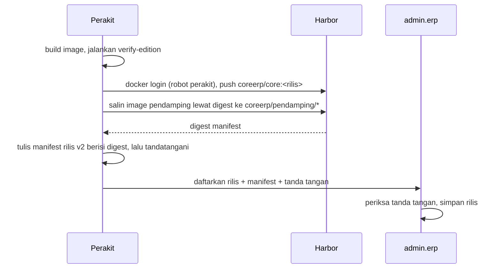
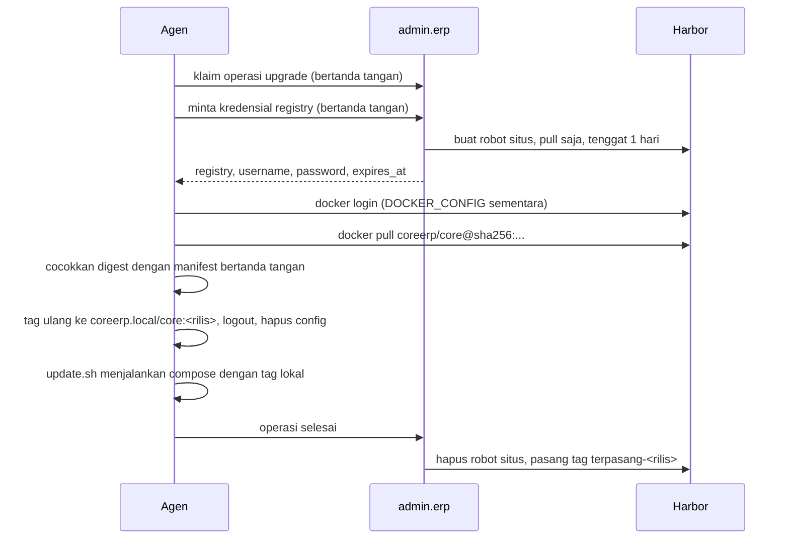

# Registry image sendiri dengan Harbor

Rencana kerja, bukan desain kanonik. Ditulis 15 September 2026 setelah pemilik produk memutuskan
image aplikasi untuk server klien disimpan dan dibagikan dari **registry milik kita sendiri**, tidak
dari GitHub. Dokumen ini ditulis supaya tim atau agen lain dapat mengerjakannya **tanpa ikut
percakapan yang melahirkannya**: setiap keputusan membawa alasannya, dan setiap butir kerja membawa
kriteria terima.

Halaman ini **menggantikan** bagian image dan distribusi rilis di
[On-prem yang dikelola vendor](/todo/on-prem-dikelola/) — image lewat GHCR, bundle `images.tar.gz`,
dan paket per kombinasi modul. Usulan yang dulu opt-in di
[Opt-in: satu image untuk semua klien](/todo/opt-in-image-tunggal/) — satu image, lisensi mengunci,
image ramping, dan registry sendiri — sekarang sudah diputuskan, dan detailnya berlaku dari halaman
ini.

## Pertanyaan yang dijawab halaman ini

- Dari mana server klien menarik image CoreERP, dan bagaimana ia membuktikan image itu asli?
- Bagaimana setiap server klien hanya boleh menarik, tidak boleh menulis, dan dapat dicabut kapan
  saja?
- Bagaimana registry dipasang di server pertama tanpa mengganggu admin.erp, SaaS dev, dan layanan
  lain di sana — dan kapan ia harus pindah?
- Bagaimana versi lama dibuang tanpa pernah membuang versi yang masih terpasang di klien?
- Apa saja yang harus dikerjakan, di bagian repo mana, dengan urutan apa?

## Kenapa ada

Tiga keputusan pemilik produk pada 14–15 September 2026 menyempitkan pilihannya:

1. **Tidak ada biaya GitHub untuk membangun dan membagikan rilis.** Menit GitHub Actions dan penyimpanan
   paket berbayar dalam dolar, dan repo ini akan kembali privat.
2. **Satu image untuk semua klien.** Image berisi Core dan seluruh modul. App yang boleh dibuka tenant
   diatur dari admin.erp dan dijaga lisensi yang **mengunci**, bukan hanya memperingatkan.
3. **Klien tanpa internet tidak akan ada.** Setiap server klien menarik rilis lewat internet.

### Kenapa bukan GHCR

| Yang ditimbang | GHCR privat |
| --- | --- |
| Biaya | Penyimpanan dan bandwidth image Container registry **saat ini gratis**, termasuk yang privat, tetapi GitHub hanya berjanji memberi tahu sebulan sebelum kebijakan berubah. Kuota paket privat untuk organisasi gratis — 500 MB penyimpanan, 1 GB transfer per bulan — cukup untuk kira-kira sepuluh pemasangan pertama sebulan |
| Akses per klien | Server klien butuh token GitHub. Token pribadi membuka seluruh paket organisasi dan berumur panjang |
| Paket publik | Gratis penuh, tetapi **tidak dapat dikembalikan ke privat** dan siapa pun dapat menarik image berisi kode seluruh modul |

### Kenapa bukan tarball lewat admin.erp

Rancangan sebelumnya mengirim `images.tar.gz` lewat admin.erp. Registry hanya mengirim **lapisan yang
berubah**, dan tarball selalu mengirim seluruhnya:

| Diukur 15 September 2026, Core + seluruh modul, terkompres | Ukuran |
| --- | --- |
| Image sekarang (`php:8.4-apache`) | 237,1 MB |
| Debian slim + PHP dari paket Debian, tanpa perkakas kompilasi | 113,5 MB |
| Ditambah Perl dibuang | **99,4 MB** |
| Lapisan kode aplikasi di image ramping — satu-satunya yang berubah di rilis biasa | **10,6 MB** |

Lewat registry, pembaruan rutin menarik belasan megabyte per klien. Lewat tarball, hampir seratus.
Dockerfile percobaannya dan hasil ukurnya ada di laptop pemilik produk,
`C:\Users\Msi_\coreerp-catatan\ukur-image-2026-09-15\` — belum di repo, lihat IMG-01.

## Keputusan

| Keputusan | Diambil | Yang dibeli | Yang dibayar |
| --- | --- | --- | --- |
| Software registry | **Harbor**, dipasang dari installer resminya | Robot account yang dibuat, diberi tenggat, dan dihapus lewat API; retensi, GC yang tidak memblok, audit, UI, metrik — semuanya bawaan | Lebih berat: PostgreSQL, Valkey, dan beberapa container; ikut dirawat dan dicadangkan |
| Bukan Zot | — | Zot jauh lebih ringan | Zot tidak punya API untuk membuat kredensial per klien; kita harus menulis token server sendiri, dan itu kode keamanan yang paling mudah salah |
| Bukan Distribution polos | — | Paling kecil | Token server, retensi, dan GC harus dirakit sendiri |
| Tempat kode | **Monorepo, `deploy/registry/`** | Kontraknya menempel pada monorepo — rute Traefik di `deploy/saas/dynamic/coreerp.yaml`, slug tenant di Core, integrasi admin.erp, manifest perakit, agen — dan satu PR dapat mengubah semuanya bersamaan | Tim registry bekerja di repo yang sama dengan tim aplikasi |
| Nama | `registry.erp.grenery.xyz` | Sudah tercakup DNS wildcard dan sertifikat wildcard yang ada; tanpa record baru | Slug tenant `registry` harus dicadangkan (CORE-01) |
| Tempat | **Server pertama**, sebagai stack tersendiri | Tanpa biaya mesin baru | Berbagi mesin dengan admin.erp, SaaS dev, Dokploy, dan SigNoz — enam syarat di bawah |
| Image | **Satu image per rilis** untuk semua klien, `linux/amd64` saja | Satu build per rilis, pemasangan pertama tidak pernah menunggu perakitan | Kode seluruh modul ada di server klien; app yang tidak dibayar dijaga lisensi |
| Kunci rilis | Tetap di server pertama selama pengembangan; **dipindah ke mesin terpisah sebelum klien produksi pertama** | Pengembangan tidak tertahan | Selama di sana, siapa pun yang menembus Docker di server pertama dapat menandatangani rilis |
| Kepercayaan agen | Agen memercayai **dua** kunci publik rilis sejak awal | Kunci dapat diputar tanpa memasang ulang agen | Satu kunci cadangan yang harus disimpan terpisah |

### Enam syarat Harbor di server pertama

Registry yang mati **tidak menghentikan aplikasi klien** — container yang berjalan tidak butuh
registry; yang tertunda hanya pembaruan. Risiko yang tersisa adalah kehilangan data dan berbagi mesin,
dan keenam syarat ini penjaganya:

1. **Diperlakukan sebagai layanan produksi walaupun servernya server dev.** Pembaruan Harbor dijadwalkan
   dan database dicadangkan lebih dulu. Tidak ada `docker system prune --volumes` di mesin itu. Data
   Harbor disimpan di folder bind `/var/lib/harbor`, bukan volume Docker bernama.
2. **Stack tersendiri.** Compose hasil installer Harbor adalah proyek sendiri, bukan bagian dari
   `coreerp-saas`, dan alur `deploy-dev` tidak pernah menyentuhnya.
3. **Tanpa port publik.** Container proxy Harbor bergabung ke jaringan `dokploy-network` dan tidak
   menerbitkan port ke internet. Satu-satunya pintu masuk dari luar adalah Traefik. UI dan API admin
   dibatasi `ipAllowList`; `/v2/` dan `/service/token` tetap terbuka karena itu jalur `docker`.
4. **Cadangan harian ke luar server pertama, terenkripsi, dengan uji pulihkan terjadwal.** Isinya
   database Harbor, folder data registry, `harbor.yml`, dan rahasianya. **Image yang terpasang di klien
   tidak dapat dibangun ulang dengan digest yang sama**, jadi folder data bukan cadangan pilihan.
5. **Batas sumber daya.** Peringatan disk di SigNoz pada 70% dan 85%. Build perakit tidak dijadwalkan di
   jam sibuk SaaS.
6. **Pemicu pindah ke server khusus** — pulihkan cadangan di mesin baru lalu ubah arah DNS, tanpa
   menyentuh satu pun server klien:
   - pemakaian disk atau CPU konsisten melewati batas;
   - ada penyewa yang menuntut ketersediaan registry dalam kontraknya;
   - akses Docker di server pertama diberikan kepada pihak yang tidak boleh memegang registry.

Server pertama per 14 September 2026: 8 CPU, RAM 22 GB dengan 5,3 GB terpakai, disk sisa 256 GB,
uplink terukur 658 Mbps. Spesifikasi Harbor menurut dokumennya: minimum 2 CPU, 4 GB, 40 GB; disarankan
4 CPU, 8 GB, 160 GB.

### Keputusan terkait yang dikerjakan di luar halaman ini

- **Lisensi mengunci**: berisi daftar app yang dibeli, ditandatangani admin.erp, diperpanjang agen,
  dan Core menolak app di luar lisensi. Butuh halaman tersendiri; halaman ini hanya bergantung padanya
  karena satu image membawa seluruh modul.
- **Pemasangan satu perintah dan panel "Server klien" di admin.erp**: rancangannya di catatan
  `C:\Users\Msi_\coreerp-catatan\spec-pasang-satu-perintah.md`. Bagian per kombinasi modul,
  `images.tar.gz`, dan lisensi yang hanya memperingatkan di sana **sudah usang** oleh halaman ini.

## Arsitektur

### Siapa bicara dengan siapa

| Pihak | Berbicara ke | Untuk | Dengan identitas |
| --- | --- | --- | --- |
| Perakit (server pertama) | Harbor | push image rilis dan image pendamping | robot perakit — push dan pull di project `coreerp` |
| Perakit | admin.erp | mendaftarkan rilis beserta manifest bertanda tangan | jalur perakit yang sudah ada |
| admin.erp | API Harbor, lewat jaringan Docker internal | membuat dan menghapus robot situs, memberi dan mencabut tag `terpasang-*` | robot sistem — hanya izin robot dan tag |
| Agen (server klien) | admin.erp | meminta kredensial registry untuk operasi yang sedang dikerjakannya | permintaan bertanda tangan kunci situs, pola yang sudah ada |
| Agen | Harbor | menarik image lewat digest | robot situs — pull saja, satu hari |
| Traefik (server pertama) | proxy Harbor | meneruskan permintaan dari internet | — |

### Alur rilis

### Alur pembaruan di server klien

### Tumbuh tanpa menyentuh server klien

Server klien tidak pernah menyimpan alamat registry: alamat dan kredensial selalu datang dari
admin.erp pada setiap operasi. Karena itu setiap tahap di bawah hanya mengubah sisi kita.

| Tahap | Bentuk | Yang berubah |
| --- | --- | --- |
| 1 — sekarang | Harbor tunggal di server pertama, disk lokal | — |
| 2 | Harbor di server khusus, penyimpanan registry di object storage S3-compatible | pulihkan cadangan + ubah arah DNS |
| 3 | Beberapa lokasi, direplikasi Harbor | admin.erp memberi alamat registry terdekat per situs |

## Kontrak antar-komponen

Bagian ini yang mengikat tim registry, tim admin.erp, tim perakit, dan tim agen. Mengubah satu butir
berarti mengubah semua pihak di PR yang sama.

### Harbor

- Project **`coreerp`**, privat, tanpa akses anonim, tanpa pendaftaran mandiri.
- Repositori:
  - `coreerp/core` — image aplikasi, satu per rilis, bertag nomor rilis;
  - `coreerp/pendamping/<nama>` — salinan image pendamping (`postgres`, `gotenberg`, dan apa pun yang
    disebut `deploy/compose.edition.yaml`) supaya server klien tidak pernah menarik dari Docker Hub.
- **Tag rilis immutable**: aturan immutability Harbor untuk tag bernomor rilis. Robot perakit yang
  dicuri tidak dapat menimpa rilis yang sudah ada.
- **Tag `terpasang-<rilis>`** dipasang admin.erp pada artifact yang sedang terpasang di minimal satu
  situs, dan dicabut ketika tidak ada lagi yang memakainya.

### Robot account

| Robot | Pemilik rahasia | Izin | Umur |
| --- | --- | --- | --- |
| Sistem admin.erp | admin.erp, terenkripsi di database konsol | kelola robot project `coreerp`; baca dan beri tag artifact | tanpa tenggat, diputar lewat runbook |
| Perakit | berkas root-only di mesin perakit | push dan pull `coreerp` | tanpa tenggat, diputar lewat runbook |
| Situs | agen, hanya di memori operasi dan `DOCKER_CONFIG` sementara | **pull** `coreerp` | tenggat 1 hari; **dihapus** saat operasinya selesai atau situsnya dicabut |

Satu robot situs lahir per operasi `install` atau `upgrade` yang diklaim, bukan satu per situs untuk
selamanya. Rahasia yang bocor dari server klien karena itu berumur pendek dan mati bersama operasinya.

**Yang harus diukur di spike, bukan ditebak:** token yang sudah diterbitkan Harbor untuk robot yang
kemudian dihapus tetap berlaku sampai tokennya kedaluwarsa. Lama jeda itulah jeda pencabutan yang
sebenarnya; setel kedaluwarsa token robot serendah yang tidak memutus pull besar.

### API agen: kredensial registry

`POST /api/agent/v1/registry-credential` — bertanda tangan kunci situs lewat
`VerifyAgentSignature`, sama dengan endpoint agen lain. Didaftarkan di
`apps/control-plane/contracts/openapi-agent.yaml`, dan pemeriksa cakupan kontrak harus tetap hijau.

- Hanya dijawab bila situs punya operasi `install` atau `upgrade` yang **sedang ia pegang**
  (`running`, lease belum habis). Selain itu `409`.
- Situs yang dicabut: `401`, sama dengan endpoint agen lain.
- Jawaban: `{registry, username, password, expires_at}`. `registry` adalah host, bukan URL.
- Dipanggil ulang selama operasi yang sama: robot yang sama boleh diputar rahasianya, bukan robot baru
  menumpuk.
- Setiap penerbitan dan penghapusan robot dicatat di `operator_audit_events` bersama operasinya.

### Manifest rilis v2

Ditandatangani perakit **sesudah** push, karena digest manifest baru diketahui setelah registry
menerimanya.

| Bidang | Isi |
| --- | --- |
| `rilis` | nomor rilis |
| `commit` | SHA commit sumber |
| `image` | jalur repositori tanpa host, `coreerp/core` |
| `digest` | **digest manifest** di registry, `sha256:...` |
| `config_digest` | digest config image, untuk pemeriksaan kedua |
| `pendamping` | daftar `{nama, image, digest}`, juga tanpa host |

**Tidak ada host registry dan tidak ada nama edisi di manifest.** Yang dicatat `scripts/build-release-files.sh`
hari ini sebagai `digest` adalah `.Id` image lokal — pada store klasik itu digest config, pada store
containerd Docker Engine 29 itu digest manifest. Keduanya dicatat terpisah supaya pemeriksaannya tidak
bergantung pada store yang dipakai.

### Agen dan server klien

1. `DOCKER_CONFIG` diarahkan ke folder sementara. Kredensial tidak pernah ditulis ke
   `/root/.docker/config.json`.
2. `docker login <registry> --username ... --password-stdin`.
3. `docker pull <registry>/coreerp/core@<digest>`, lalu image pendamping lewat digest masing-masing.
4. Digest yang ditarik dicocokkan dengan manifest bertanda tangan lewat `RepoDigests`. Tidak cocok berarti
   operasi gagal dan tidak ada yang dijalankan.
5. Tag ulang ke nama lokal **`coreerp.local/core:<rilis>`** dan `coreerp.local/pendamping/<nama>:<rilis>`.
6. `docker logout`, folder config sementara dihapus.
7. Pull yang gagal dengan `401` di tengah jalan: minta kredensial lagi, ulangi.

Di `deploy/compose.edition.yaml`, setiap service memakai **tag lokal** dan **`pull_policy: never`**.
Dua alasan yang sama pentingnya:

- host registry tidak pernah tertulis di server klien, sehingga registry dapat pindah tanpa menyentuh
  klien;
- tag lokal yang terhapus tidak membuat Compose diam-diam menarik `docker.io/coreerp/core` — nama yang
  dapat didaftarkan siapa pun di Docker Hub. Awalan `coreerp.local` tidak pernah di-resolve ke Docker
  Hub, dan `pull_policy: never` membuat Compose gagal alih-alih menarik.

### Retensi

- **Harbor adalah pelaksana, admin.erp adalah sumber kebenaran.** admin.erp tahu rilis mana yang
  terpasang di situs mana, dari laporan agen.
- Aturan retensi Harbor pada project `coreerp`:
  - selalu simpan tag yang cocok `terpasang-*`;
  - simpan beberapa rilis terakhir yang di-push, jumlahnya setelan, bukan konstanta kode.
- Rilis yang tidak lagi dipakai **dipensiunkan** dulu di admin.erp — tidak boleh diminta untuk operasi
  baru — dan tag `terpasang-*`-nya baru dicabut paling cepat 24 jam kemudian.
- GC Harbor mingguan. Harbor tidak memblok push dan pull saat GC dan tidak menyapu lapisan yang diunggah
  dalam dua jam terakhir.
- Opsi "hapus artifact tanpa tag" hanya dinyalakan setelah terbukti setiap artifact yang dipakai
  memang bertag.

## Keamanan

| Ancaman | Penjaga |
| --- | --- |
| Kunci rilis di server pertama dicuri | Tahap 7 memindahkan penandatanganan ke mesin terpisah sebelum klien produksi pertama; agen memercayai dua kunci sehingga kunci dapat diputar |
| Robot perakit dicuri | Tag rilis immutable; agen hanya menjalankan digest yang disebut manifest bertanda tangan kunci rilis — image baru tanpa tanda tangan tidak pernah dijalankan |
| Robot situs dicuri dari server klien | Pull saja; mati bersama operasinya atau paling lama satu hari; dicabut saat situs dicabut |
| Harbor dibobol | Sama dengan robot perakit dicuri: image palsu tidak punya tanda tangan yang sah |
| UI Harbor diserang dari internet | Jalur UI dan API admin dibatasi `ipAllowList`; admin.erp memanggil API lewat jaringan internal; kata sandi admin awal diganti saat pemasangan dan tidak pernah dicetak di log |
| Namespace Docker Hub diserobot | Tag lokal `coreerp.local/*` + `pull_policy: never` |
| Brute force login | Pembatasan bawaan Harbor + rate limit Traefik pada `/service/token` |
| Slug tenant `registry` merampas alamat | CORE-01 dikerjakan **sebelum** rute registry dipasang |

## Operasional

- **Memasang dan memperbarui Harbor**: versi dipin di `deploy/registry`, database dicadangkan sebelum
  pembaruan, catatan rilis Harbor dibaca lebih dulu — pembaruan Harbor dapat memigrasikan database
  bawaannya saat container menyala.
- **Cadangan**: harian, terenkripsi, ke luar server pertama; uji pulihkan terjadwal ke mesin kosong
  sampai `docker pull` lewat digest berhasil.
- **Monitoring**: metrik Harbor (`metric.enabled` di `harbor.yml`) dikumpulkan SigNoz yang sudah
  berjalan di server pertama; port metrik tidak pernah diterbitkan ke internet.
- **Runbook** di `deploy/registry/RUNBOOK.md`:
  - memutar rahasia robot sistem dan robot perakit;
  - Harbor mati: yang terjadi di klien, yang dilakukan operator;
  - pindah ke server lain;
  - memulihkan dari cadangan;
  - menaikkan versi Harbor.

## Di luar cakupan

- Pemindaian kerentanan (Trivy) — tahap berikutnya, setelah beban server terukur.
- Beberapa lokasi dan replikasi.
- Mirror ke GHCR atau registry lain.
- Klien tanpa internet — tidak akan ada.
- Lisensi mengunci dan panel "Server klien" — lihat "Keputusan terkait".

## Tahapan dan kriteria terima

**Tahap 0 — spike di server pertama.** Hasilnya ditulis di `deploy/registry/SPIKE.md`, termasuk yang
gagal.

- Harbor dari installer online terpasang di `/opt/harbor`, data di `/var/lib/harbor`, proxy bergabung
  ke `dokploy-network` tanpa port publik, dan rute Traefik dengan sertifikat wildcard melayani
  `docker login` dari server kedua.
- Push image 99,4 MB **dari server kedua lewat Traefik** berhasil. Bila terputus karena batas waktu baca
  Traefik, catat angkanya dan ajukan penaikan ke pemilik produk — setelan statis Traefik milik Dokploy
  berlaku untuk seluruh rute.
- Robot situs dibuat lewat API dengan tenggat satu hari; `docker pull` berhasil; robot dihapus lalu pull
  berikutnya ditolak. Jeda sampai ditolak diukur.
- Tag `terpasang-*` dipasang lewat API pada artifact yang sudah ada, dan pratinjau retensi menyimpannya.
- Push ulang tag rilis yang sama ditolak aturan immutability.
- Digest manifest yang dicatat sesudah push sama dengan yang terlihat di `RepoDigests` setelah pull di
  server kedua, dan dicatat untuk store klasik maupun containerd.
- Compose dengan `coreerp.local/core:<rilis>` dan `pull_policy: never` menyala saat image ada, dan gagal
  tanpa menarik apa pun saat image tidak ada.

**Tahap 1 — Harbor berdiri.** CORE-01 selesai. Harbor terpasang dari `deploy/registry` secara idempoten,
UI dibatasi, cadangan pertama dipulihkan di mesin lain.

**Tahap 2 — admin.erp.** Robot situs lahir dan mati bersama operasi; situs yang dicabut tidak dapat
menarik; kontrak dan audit lengkap.

**Tahap 3 — perakit.** Satu rilis menghasilkan satu image ramping di Harbor, image pendamping tersalin,
manifest v2 bertanda tangan terdaftar di admin.erp.

**Tahap 4 — agen.** Agen menarik lewat digest, menolak digest yang tidak cocok, dan menjalankan compose
dengan tag lokal saja.

**Tahap 5 — perawatan.** Retensi dan GC berjalan tanpa pernah menghapus rilis terpasang; peringatan disk
dan metrik tampil di SigNoz.

**Tahap 6 — uji ujung-ke-ujung di server kedua.** Lihat E2E-01.

**Tahap 7 — sebelum klien produksi pertama.** Penandatanganan pindah ke mesin terpisah; langkah push GHCR
dan jalur tarball sudah hilang dari repo.

## TODO

Setiap butir menyebut tempat kerjanya, kriteria terimanya, dan butir yang harus selesai lebih dulu.

### Pemilik produk

| ID | Pekerjaan | Selesai bila |
| --- | --- | --- |
| OWN-01 | Memastikan record wildcard `*.erp.grenery.xyz` di Cloudflare **DNS-only**, bukan proxied | Terlihat di UI Cloudflare; hari ini nama itu memang menunjuk langsung ke IP server pertama |
| OWN-02 | Menentukan tujuan cadangan di luar server pertama | Tujuan dan pemegang aksesnya tertulis di RUNBOOK |
| OWN-03 | Memberi izin bila spike membuktikan batas waktu baca Traefik harus dinaikkan | Keputusan tertulis di SPIKE.md |
| OWN-04 | Menyiapkan mesin penandatangan sebelum klien produksi pertama | Mesin tersedia untuk Tahap 7 |

### Core

| ID | Pekerjaan | Selesai bila | Setelah |
| --- | --- | --- | --- |
| CORE-01 | Cadangkan slug tenant yang dipakai layanan: minimal `admin` dan `registry`, di satu daftar yang dibaca `RegisterBusiness::uniqueSlug` (`apps/core/app/Actions/Onboarding/RegisterBusiness.php`) dan validasi pembuatan tenant di admin.erp | Tenant bernama "Registry" atau "Admin" memperoleh slug lain; test membuktikannya; data yang ada diperiksa tidak memakai slug itu. `admin` sudah bertabrakan hari ini — router konsol berprioritas lebih tinggi daripada router tenant | — |

### Registry — `deploy/registry/`

| ID | Pekerjaan | Selesai bila | Setelah |
| --- | --- | --- | --- |
| REG-01 | Spike Tahap 0 dan `SPIKE.md` | Seluruh kriteria Tahap 0 tertulis beserta hasilnya | OWN-01 |
| REG-02 | `harbor.yml` versi terkunci: `external_url`, `data_volume: /var/lib/harbor`, metrik menyala, kata sandi awal dan database dibaca dari berkas rahasia di server, bukan dari repo | Tidak ada rahasia di repo; `./install.sh` menghasilkan stack yang sama dua kali berturut-turut | REG-01 |
| REG-03 | Override compose: proxy ke `dokploy-network` dengan alias unik (bukan nama umum seperti `nginx`), tanpa port publik | `ss -tlnp` di server pertama tidak menunjukkan port Harbor di alamat publik | REG-02 |
| REG-04 | Rute Traefik `registry.erp.grenery.xyz`: prioritas di atas router tenant, sertifikat wildcard yang ada, **tanpa healthCheck ke `/v2/`** (dijawab 401 dan Traefik akan menandainya mati), `ipAllowList` untuk selain `/v2/` dan `/service/token`, rate limit untuk `/service/token` | `docker login` dari server kedua berhasil; UI dari IP di luar daftar ditolak | REG-03, CORE-01 |
| REG-05 | `pasang.sh` idempoten: folder, izin, installer, override, rute | Dijalankan dua kali tanpa perubahan kedua | REG-04 |
| REG-06 | Uji asap dengan `crane`: login, push, pull lewat digest, robot pull-only tidak dapat push | Skrip keluar nol di server pertama dan merah bila salah satu syarat dilanggar | REG-05 |
| REG-07 | Project `coreerp`, aturan immutability tag rilis, aturan retensi `terpasang-*`, jadwal GC | Pratinjau retensi menyimpan artifact bertag `terpasang-*`; push ulang tag rilis ditolak | REG-05 |
| REG-08 | Cadangan harian terenkripsi ke tujuan OWN-02 + uji pulihkan terjadwal | Pemulihan ke mesin kosong menghasilkan `docker pull` lewat digest yang berhasil | REG-05, OWN-02 |
| REG-09 | Metrik Harbor ke SigNoz, peringatan disk 70% dan 85% | Peringatan uji terkirim | REG-05 |
| REG-10 | `README.md` dan `RUNBOOK.md` | Pembaca baru dapat memutar robot dan memulihkan cadangan hanya dari dokumen | REG-08 |

### admin.erp — `apps/control-plane`

| ID | Pekerjaan | Selesai bila | Setelah |
| --- | --- | --- | --- |
| CP-01 | Klien API Harbor lewat jaringan Docker internal; rahasia robot sistem terenkripsi di database konsol, dikelola dari halaman Pengaturan, tidak pernah ditampilkan ulang | Test dengan Harbor tiruan yang memeriksa header dan jalur; rahasia tidak muncul di log | REG-07 |
| CP-02 | Robot situs per operasi: dibuat saat kredensial pertama diminta, dihapus saat operasi `succeeded`/`failed`/`expired`/`cancelled` dan saat situs dicabut; diaudit | Test setiap jalur penutupan operasi; robot tidak menumpuk untuk operasi yang sama | CP-01 |
| CP-03 | `POST /api/agent/v1/registry-credential` + kontrak | Test: tanpa operasi dipegang `409`, situs dicabut `401`, tanda tangan salah ditolak; pemeriksa cakupan kontrak hijau | CP-02 |
| CP-04 | Rilis menyimpan manifest v2 (`image`, `digest`, `config_digest`, `pendamping`) dan menolak manifest tanpa tanda tangan sah | Test pendaftaran; perubahan pada `app/Sites/ReleaseRegistry.php` dan tabel rilis | — |
| CP-05 | Penyelarasan tag `terpasang-*` dari laporan situs, pensiun rilis dengan jeda 24 jam | Test: rilis yang masih dilaporkan satu situs tidak pernah kehilangan tagnya | CP-01 |
| CP-06 | Status Harbor di halaman Pengaturan: terjangkau, robot sistem sah, pemakaian disk dari metrik | Tampil di UI, dengan pesan jelas saat Harbor mati | CP-01, REG-09 |

Pola yang dipakai ulang: `app/Sites/SignedAgentRequest.php` dan `app/Http/Middleware/VerifyAgentSignature.php`
untuk endpoint bertanda tangan, `app/Sites/SiteOperations.php` untuk klaim dan lease operasi,
`app/Audit/OperatorAudit.php` untuk audit, `routes/api.php` untuk pendaftaran rute.

### Perakit — `deploy/perakit/`

| ID | Pekerjaan | Selesai bila | Setelah |
| --- | --- | --- | --- |
| PK-01 | Satu image ramping per rilis (bukan per kombinasi modul) | Satu build menghasilkan satu image berisi seluruh modul | IMG-01 |
| PK-02 | Push dengan robot perakit, ambil digest manifest dari registry, tulis dan tandatangani manifest v2 **sesudah** push, daftarkan ke admin.erp | Manifest yang terdaftar sama dengan digest di Harbor | PK-01, REG-07, CP-04 |
| PK-03 | Salin image pendamping lewat digest ke `coreerp/pendamping/*`, `linux/amd64` | Digest pendamping di manifest dapat ditarik dari Harbor | PK-02 |
| PK-04 | Push perakit dan GC tidak bertabrakan: perakit tidak push saat GC terjadwal berjalan | Jadwal tertulis dan diperiksa perakit sebelum push | REG-07 |
| PK-05 | Cabut push GHCR dan pendaftaran rilis lama dari `.github/workflows/release.yml` | Merge ke `main` tidak lagi membuat paket di GHCR | PK-02 |

Cabang lokal `feat/perakit` di laptop pemilik produk dibangun untuk rancangan tarball dan belum selesai;
ia ditulis ulang, bukan dilanjutkan apa adanya.

### Agen — `deploy/agent/`, `scripts/update.sh`, `deploy/compose.edition.yaml`

| ID | Pekerjaan | Selesai bila | Setelah |
| --- | --- | --- | --- |
| AG-01 | Alur kredensial → login → pull lewat digest → cocokkan `RepoDigests` → tag ulang `coreerp.local/*` → logout | Suite agen: digest salah menggagalkan operasi tanpa menjalankan compose; kredensial tidak tertinggal di disk | CP-03, PK-02 |
| AG-02 | Compose memakai tag lokal dan `pull_policy: never` di setiap service | Test statis di suite agen; compose tidak pernah menyebut host registry | AG-01 |
| AG-03 | Agen memercayai dua kunci publik rilis | Rilis bertanda tangan kunci cadangan diterima; kunci lain ditolak | — |
| AG-04 | Buang jalur `images.tar.gz` dan tarik lewat GHCR dari `update.sh` dan agen | Setelah E2E-01 lulus; grep repo bersih | E2E-01 |

### Image — `apps/core/Dockerfile`

| ID | Pekerjaan | Selesai bila | Setelah |
| --- | --- | --- | --- |
| IMG-01 | Dockerfile ramping versi produksi dari percobaan 15 September 2026, **tanpa** mencabut paket secara paksa: klien PostgreSQL diambil dari tahap build, perkakas Apache tidak membawa Perl ke tahap akhir | Suite Core hijau, `scripts/verify-edition.sh` lulus, deploy dev menyala, image ≤ 100 MB terkompres; `pg_dump` dan `pg_restore` berjalan, ekstensi `intl gd pdo_pgsql zip bcmath opcache opentelemetry` termuat | — |

`apps/core/Dockerfile` dipakai SaaS juga. Perubahannya diuji di kedua jalur sebelum digabung.

### Uji ujung-ke-ujung — server kedua

| ID | Skenario | Selesai bila |
| --- | --- | --- |
| E2E-01 | Pemasangan baru, pembaruan, pembaruan gagal lalu mundur | Aplikasi menyala di setiap langkah, data utuh setelah mundur |
| | Kredensial kedaluwarsa atau robot dihapus di tengah pull | Agen meminta kredensial baru dan pull selesai, atau operasi gagal dengan pesan jelas |
| | GC berjalan saat pull | Pull selesai |
| | Image lokal terhapus | Compose gagal dan tidak menarik apa pun dari Docker Hub |
| | Situs dicabut | Pull berikutnya ditolak, aplikasi klien tetap melayani |
| | Harbor dimatikan | Aplikasi klien tetap melayani, operasi pembaruan gagal dengan pesan jelas |

Server kedua bukan server kosong — ada Dokploy, stack CoreERP lama di `/opt/coreerp`, dan layanan lain
yang tidak berhubungan. Stack lama dibersihkan dulu sesuai kesepakatan dengan pemilik produk;
volume databasenya dihapus oleh pemilik produk sendiri.

## Panduan untuk pelaksana

- **Konvensi repo**: nama kelas dan metode PHP/TS dalam bahasa Inggris; tabel, URL, teks layar, dan
  komentar dalam bahasa Indonesia; komentar menjelaskan **kenapa**. Aturan yang tidak boleh dilanggar
  ditulis sebagai constraint database. Audit ditulis di transaksi yang sama dengan tindakannya.
- **Tabel baru milik sisi pusat** butuh model penanda `OwnedByControlPlane` di `apps/core/app/Models` dan
  dicatat di `tests/Feature/Boundary/BatasPusatTest.php`. Jalankan `tests/Feature/Boundary` setiap kali
  menambah migration.
- **Perintah uji di laptop Windows**: `php vendor/phpunit/phpunit/phpunit` (bukan `php artisan test`),
  `node node_modules/<alat>/bin/...` (bukan `npx`), suite konsol dengan `DB_TEST_SCHEMA=coreerp_test_konsol`,
  suite agen di container `ubuntu:24.04`. Setiap putaran test dibatasi paling lama sepuluh menit.
- **Server**: tidak mengubah setelan keamanan server — SSH, firewall, setelan statis Traefik — tanpa
  persetujuan pemilik produk. Rahasia tidak pernah dicetak di terminal, log, atau percakapan.
- **Bukti**: setiap penjaga baru dibuktikan dapat merah, dengan mencabut penjaganya di salinan dan
  melihat test yang sesuai gagal.

## Keadaan kode per 15 September 2026

| Tempat | Keadaan |
| --- | --- |
| `main` | Registry situs, API agen bertanda tangan, agen bash, dan alur rilis ke GHCR dari PR #118 |
| PR #119 | Agen membaca `agent.env` sendiri; port aplikasi on-prem diikat ke loopback |
| PR #120 | PRD opt-in yang kini diputuskan di halaman ini |
| Cabang `chore/buang-jalur-offline` | Jalur klien tanpa internet dibuang dari agen, admin.erp, kontrak, dan database; route pendaftaran menjadi `/situs/{situs}/pendaftaran` |
| Cabang lokal `feat/pasang-inti` | WIP: hosting `client_server`, tabel antrean build per edisi — antrean itu diganti build per rilis |
| Cabang lokal `feat/perakit` | WIP rancangan tarball — ditulis ulang oleh PK-01..05 |
| Server pertama | Kunci privat rilis di `/etc/coreerp/perakit/kunci-rilis-privat.pem` (root, 0600), kunci publiknya di `/etc/coreerp/kunci/rilis-publik.pem`; Harbor belum dipasang |
| GHCR | Paket edisi lama sudah dihapus pemilik produk; akan muncul lagi pada merge berikutnya sampai PK-05 |

## Sumber

- [Harbor — installation prerequisites](https://goharbor.io/docs/main/install-config/installation-prereqs/)
  — spesifikasi minimum dan yang disarankan.
- [Harbor — configure the Harbor YML file](https://goharbor.io/docs/main/install-config/configure-yml-file/)
  — `external_url`, `data_volume`, `metric`.
- [Harbor — robot accounts](https://goharbor.io/docs/main/administration/robot-accounts/) — tenggat,
  robot sistem yang mengelola robot lain.
- [Harbor — garbage collection](https://goharbor.io/docs/main/administration/garbage-collection/) — GC
  tanpa memblok, jendela dua jam.
- [Harbor — tag retention rules](https://goharbor.io/docs/main/working-with-projects/working-with-images/create-tag-retention-rules/)
  — penyaring tag, penghapusan di tingkat artifact.
- [Harbor releases](https://github.com/goharbor/harbor/releases) — installer online dan berkas tanda
  tangannya.
- [zot — authentication and authorization](https://zotregistry.dev/v2.1.21/articles/authn-authz/) — kontrol
  akses dari berkas konfigurasi, tanpa API pembuatan kredensial.
- [Distribution — token authentication](https://distribution.github.io/distribution/spec/auth/token/) —
  alur token yang juga dipakai Harbor.
- [Traefik — entrypoints](https://doc.traefik.io/traefik/reference/install-configuration/entrypoints/) —
  batas waktu baca permintaan.
- [Docker Engine v29](https://www.docker.com/blog/docker-engine-version-29/) — store image containerd.
- [GitHub Packages billing](https://docs.github.com/en/billing/concepts/product-billing/github-packages)
  dan [visibilitas paket](https://docs.github.com/en/packages/learn-github-packages/configuring-a-packages-access-control-and-visibility)
  — kuota privat, status gratis Container registry, paket publik yang tidak dapat dikembalikan.
- [go-containerregistry `crane`](https://github.com/google/go-containerregistry/tree/main/cmd/crane) —
  alat uji push, pull, dan digest.
