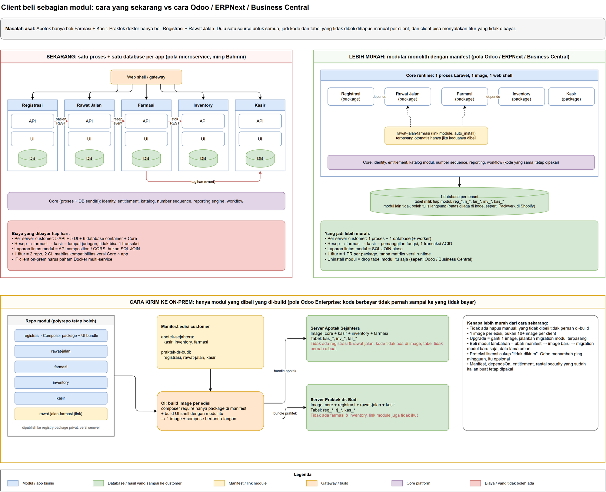

# Keputusan: satu runtime, satu database per tenant

> **Ini catatan keputusan sekali jalan, bukan desain kanonik.** Rencana kerjanya ada di
> [PRD](01-prd.md). Setelah pemindahan selesai, aturannya dipindahkan ke `docs/dev` dan folder ini
> boleh dihapus. Sampai itu terjadi, [grand design](../../dev/01-grand-design.md) dan
> [standar app](../../dev/02-module-standard.md) masih menggambarkan kode yang berjalan hari ini.

CoreERP saat ini menjalankan tiap app bisnis sebagai proses dan database sendiri. Halaman ini membandingkan desain itu dengan desain yang diusulkan: satu repo, satu runtime Laravel, satu database per tenant, modul sebagai unit yang bisa dipasang dan dicabut. Angka di sini diukur di laptop pengembang dengan stack `erp-dev`, lalu dikalikan untuk skala production supaya perbedaannya terlihat sebelum ada yang dibangun.

## Masalah yang mau diselesaikan tidak berubah

Client boleh membeli sebagian modul saja, dipasang di server mereka atau di cloud kita, tanpa kita menghapus kode dan tabel secara manual per client, dan tanpa client bisa menyalakan fitur yang tidak dibayar.

Sistem lama (CodeIgniter 3 HMVC untuk klinik dan puskesmas) sudah modular secara folder. Yang tidak ada adalah batas: tidak ada deklarasi tabel milik siapa, tidak ada dependency tertulis, tidak ada manifest. Pembacaan kode legacy menemukan 445 tabel yang disentuh tujuh modul inti, sekitar 30 tabel dipakai lima sampai enam modul sekaligus, dan 299 pemanggilan model lintas modul. Rasa sakit "hapus manual" datang dari tidak adanya kepemilikan, bukan dari monolith.

Ada dua cara memperbaiki itu. Cara mahal: pisahkan proses dan database per modul supaya batasnya dipaksa jaringan. Cara murah: tetap satu proses, tapi tiap modul mendeklarasikan tabelnya dan CI menolak pelanggaran. Odoo, ERPNext, dan Dynamics 365 Business Central memakai cara kedua.

## Yang diputuskan

| Bagian | Keputusan | Alasan singkat |
| --- | --- | --- |
| Repo | Satu repo, satu `main`, rilis lewat edisi bertanggal | Satu fitur lintas modul jadi satu PR; tidak ada matriks versi Core × app |
| Runtime | Satu image Laravel; image edisi client hanya menyalin folder modul yang dibeli | Modul yang tidak dibeli tidak pernah ada di server client |
| Database | Satu per tenant. On-prem: satu DB. SaaS: satu DB per tenant, bentuk identik | Bug isolasi hilang sebagai kategori; on-prem dan SaaS satu bentuk |
| Batas modul | Tabel berprefix, FK hanya ke master Core, test di CI yang menolak akses lintas modul | Ini yang menggantikan "database terpisah" |
| Number sequence | Fungsi Core di dalam transaksi dokumen | Seperti F&O dan Odoo; nomor batal ikut batal, tanpa HTTP |
| Update | Pull, bukan push | Server client tidak dibuka dari luar |
| Yang tetap | `app.yaml`, dependsOn, link module, entitlement, rantai security, workflow, reporting, shell | Semua ini cuma pindah dari "dipanggil lewat HTTP" jadi "dipanggil sebagai fungsi" |



Berkas draw.io yang bisa diedit: `docs/diagrams/drawio/coreerp-modular-monolith-vs-microservice.drawio`.

## Angka yang diukur di laptop

Ada dua tanggal pengukuran di halaman ini, dan keduanya disebut di tempatnya masing-masing.
**7 September 2026** adalah pengukuran desain lama, ketika Core dan app aset masih dua proses
dengan dua database; itu yang menjadi pembanding. **10 September 2026** adalah pengukuran ulang
sesudah kedua modul bisnis dilayani satu runtime, dan itu yang menggantikan baris proyeksi.

Angka 7 September diukur dengan stack `erp-dev` (`start.ps1 -Apps management-aset`), idle setelah 40 request pemanasan, container `docs` tidak dihitung.

### RAM per container, desain lama (7 September 2026)

| Container | Milik | RAM |
| --- | --- | --- |
| core-app | Core | 56,9 MiB |
| core-worker | Core | 39,8 MiB |
| core-scheduler | Core | 40,1 MiB |
| core-db (Postgres) | Core | 31,6 MiB |
| core-renderer | Core | 22,8 MiB |
| **Subtotal Core, 5 container** | | **191 MiB** |
| management-aset-api | app | 46,4 MiB |
| management-aset-db (Postgres) | app | 27,9 MiB |
| management-aset-ui (nginx) | app | 9,6 MiB |
| **Subtotal satu app, 3 container** | | **84 MiB** |

### RAM idle satu runtime, dua modul terpasang (10 September 2026)

Diukur sesudah Human Resources menjadi modul kedua. Caranya ditulis lengkap supaya orang berikutnya
dapat mengulangnya dan membandingkan dengan angka di atas:

```powershell
# 1. Bangun ulang image dan nyalakan stack. Tanpa -Apps, semua modul bisnis didaftarkan;
#    hari ini itu berarti management-aset dan human-resources.
powershell -NoProfile -ExecutionPolicy Bypass -File D:\Kerja\erp-dev\start.ps1 -Build

# 2. Empat puluh request pemanasan, sama seperti pengukuran 7 September.
1..40 | ForEach-Object { Invoke-WebRequest -UseBasicParsing http://localhost:8000/up }

# 3. Biarkan diam, lalu baca. Angka di bawah diambil pada menit keenam sesudah pemanasan.
docker stats --no-stream --format "{{.Name}}`t{{.MemUsage}}"
docker compose --env-file D:\Kerja\erp-dev\.env --project-directory D:\Kerja\erp-dev -f D:\Kerja\erp-dev\compose.yaml ps
```

| Container | RAM |
| --- | --- |
| core-app | 55,2 MiB |
| core-worker | 42,5 MiB |
| core-scheduler | 40,1 MiB |
| core-db (Postgres; Core dan kedua modul dalam satu database) | 38,6 MiB |
| core-renderer | 26,2 MiB |
| **Subtotal, 5 container** | **202,7 MiB** |

`docs` terbaca 10,8 MiB dan tetap tidak dihitung, sama seperti 7 September.

**Jumlah container: enam, dan lima di antaranya dihitung.** `docker compose ps` memulangkan
`core-app`, `core-db`, `core-renderer`, `core-scheduler`, `core-worker`, dan `docs`. Modul tidak
menambah satu container pun: `php artisan module:list` memulangkan empat entri — dua modul bisnis
dan dua bahan uji — dari lima container yang sama.

**Bacalah selisih terhadap 191 MiB dengan hati-hati.** 7 September Core diukur sendirian, sebelum
satu modul pun ada di dalamnya. Selisih 11,7 MiB ke angka hari ini bukan milik modul saja: di
antara dua tanggal itu Core sendiri bertambah kode fase 5 dan 6, dan `core-db` kini memegang tabel
kedua modul. Biaya kode modul yang benar-benar dapat dipisahkan diukur tersendiri di bawah.

**Ambil bacaan idle sebelum menjalankan pengukuran apa pun di dalam container.** Sesudah tabel
opcache di bawah diukur lewat `docker exec`, `core-app` terbaca 67,7 MiB: memori proses pengukur
ikut dihitung cgroup container. Angka itu turun sendiri, tetapi bacaan pada saat itu bukan angka
idle dan tidak boleh dicatat sebagai idle.

Pengambilan tiap menit selama enam menit menunjukkan angkanya berhenti bergerak sejak menit kedua;
sebelum itu `core-app` masih naik dari 52,5 ke 55,2 MiB. Membaca `docker stats` tepat sesudah stack
menyala akan memberi angka yang lebih kecil dan salah.

### Kode modul di dalam proses

Semua file PHP modul aset dikompilasi ke opcache di container-nya, dibandingkan dengan framework
(7 September 2026, di dalam container app aset):

| Yang dimuat | File | Di memori |
| --- | --- | --- |
| Kode modul aset (`app`, `routes`, `config`, migration) | 153 | 1,95 MB |
| Laravel dan library (`vendor`) | 5.874 | 74,2 MB |

Kode modul 2,6% dari yang dimuat satu proses Laravel. Sisanya framework yang identik di tiap container app. Di satu runtime, framework dimuat sekali dan tiap modul menambah kodenya sendiri.

Diukur ulang **10 September 2026 di dalam `core-app`**, untuk keempat modul yang dimuat runtime.
Caranya: kompilasi seluruh berkas PHP modul (`src`, `app`, `routes`, `config`, `database`) ke
opcache satu proses, lalu selisihkan `used_memory` sebelum dan sesudah —
`docker exec erp-core-app-1 php -d opcache.enable_cli=1 -d opcache.memory_consumption=256 <skrip>`,
dengan skrip yang memanggil `opcache_compile_file()` per berkas dan membaca `opcache_get_status()`.

| Yang dimuat | Berkas | Di memori |
| --- | --- | --- |
| management-aset | 165 | 2.141.624 bytes (2,04 MB) |
| human-resources | 15 | 140.744 bytes (0,13 MB) |
| contoh-a (bahan uji) | 8 | 34.336 bytes |
| contoh-b (bahan uji) | 7 | 24.536 bytes |
| `vendor` Core, Laravel dan library | 8.649 | 118,46 MB |

Angka `vendor` bukan pembanding langsung terhadap 74,2 MB di atas: yang ini `vendor` milik Core,
yang itu `vendor` milik app aset — dua daftar paket yang berbeda, bukan satu daftar yang tumbuh.

**"Tiap modul menambah sekitar 2 MB" ternyata bukan aturan, melainkan ukuran satu modul.** Human
Resources hari ini lima belas kali lebih kecil daripada modul aset, karena layarnya belum dipindah
dan halamannya masih penampung. Yang benar: biaya kode sebuah modul sebanding dengan besar modul
itu, dan 2 MB adalah contoh modul yang sudah berisi — bukan konstanta per modul.

### Satu server Postgres, tanpa mengubah source

Database aset di-dump, di-restore ke `core-db`, lalu container API aset dijalankan ulang dari image yang sama dengan `DB_HOST=core-db`. API sehat, Core tetap melihat app-nya.

| Keadaan | Container | RAM | Kapan diukur |
| --- | --- | --- | --- |
| Desain saat ini, database terpisah | 8 | 275 MiB | 7 September 2026 |
| Satu server Postgres, API aset masih proses terpisah | 7 | 275 MiB | 7 September 2026 |
| Satu runtime, dua modul terpasang | 5 | 202,7 MiB | 10 September 2026 |

Baris ketiga dulu berbunyi "satu runtime, proyeksi, sekitar 225 MiB". Ia sekarang terukur, dan
**menanggung lebih banyak** daripada dua baris di atasnya: kedua baris pertama melayani satu app
bisnis, baris ketiga melayani dua modul bisnis. Proyeksinya meleset ke arah yang aman — 22 MiB
lebih hemat daripada yang diperkirakan, dengan satu modul lebih banyak.

Temuan yang jujur: menyatukan server database saja hampir tidak menghemat RAM, karena Postgres yang memegang dua database (`core-db` naik dari 32 ke 57 MiB) memakai memori sebesar dua Postgres kecil. Yang dihemat adalah proses PHP dan nginx per app, sekitar 50 MiB dan dua container per modul.

### Biaya satu lompatan HTTP app ke Core

200 request dari container aset ke `http://core-app/up` lewat jaringan Docker lokal:

| Jalur | Rata-rata | p95 |
| --- | --- | --- |
| aset-api → core-app (HTTP) | 9,8 ms | 13,4 ms |
| aset-api → localhost (pembanding) | 6,9 ms | 8,2 ms |
| pemanggilan fungsi di proses yang sama | di bawah 0,1 ms | |

Kode `app-erp-management-aset` memanggil Core secara sinkron saat membuat dokumen: `number-sequences/{ref}/issue` untuk setiap nomor, `fiscal-periods` untuk validasi tanggal, `units-of-measure/resolve` untuk baris barang, dan `workflow-instances` bila ada approval. Tiga lompatan per dokumen adalah angka yang dipakai di perhitungan beban di bawah.

## Perhitungan production: angka lokal dikalikan

**Seluruh angka di bagian ini adalah perhitungan, bukan pengukuran.** Yang diukur adalah
bahan-bahannya, dan tanggalnya disebut: RAM per container dan latensi lompatan HTTP pada 7
September 2026, RAM idle satu runtime dengan dua modul dan ukuran bundel pada 10 September 2026.
Yang dikalikan di sini adalah jumlah modul dan jumlah tenant — dan **jumlah itu belum pernah ada
di mesin mana pun yang kami jalankan**. Lima modul belum pernah terpasang bersamaan; hari ini ada
dua. Seratus tenant belum pernah dijalankan. Baris yang menyebut lima modul atau seratus tenant
karena itu tetap perhitungan, dan ditandai begitu.

Rumusnya ditulis supaya bisa dicek. Angka absolut di production lebih besar (PHP-FPM dengan banyak worker, Postgres dengan shared buffers lebih besar), tapi yang dikalikan adalah pola yang sama: di desain saat ini biaya bertambah per app dan per tenant, di satu runtime hampir datar.

### Ringkasan: di mana keunggulannya paling terlihat

| Skenario | Desain saat ini | Satu runtime | Jenis angka |
| --- | --- | --- | --- |
| **Dua modul, keadaan hari ini** | 359 MiB, 11 container, 3 database | **202,7 MiB, 5 container, 1 database** | satu runtime **terukur** 10 September 2026; desain saat ini dihitung dari 191 + 2 × 84 |
| Satu server client, 5 modul | 611 MiB, 20 container, 6 database | sekitar 209 MiB, 5 container, 1 database | perhitungan |
| SaaS 100 tenant terisolasi: database | 501 | 100 | perhitungan |
| SaaS 100 tenant: RAM idle Postgres | sekitar 13 GiB | sekitar 2,6 GiB | perhitungan |
| Migrasi per rilis, 100 tenant | 500, lima jenis, harus urut | 100, satu jenis | perhitungan |
| 2.000 pengguna aktif: beban tambahan di Core | 300 request per detik dari lompatan nomor, periode, satuan | 0 | perhitungan |
| Latensi tambahan per dokumen | sekitar 30 ms, p95 40 ms | di bawah 1 ms | perhitungan dari latensi terukur 7 September 2026 |
| Worker PHP di puncak | sekitar 60, tiap app dipesan untuk puncaknya sendiri | sekitar 25, satu pool berbagi | perhitungan |
| Image per rilis, 5 modul | 11 | 1 | sisi kiri perhitungan; sisi kanan terukur — satu image `erp-core-app:local` sudah melayani kedua modul yang ada |

Baris pertama adalah satu-satunya yang tidak perlu dikalikan: ia keadaan yang sedang berjalan.
Rincian dan rumus tiap baris lain ada di tabel-tabel berikut.

### Bundel JavaScript sesudah UI menyatu

Diukur ulang **10 September 2026** sesudah modul kedua masuk; angka F4-10 tanggal 9 September
diukur sebelum itu. Caranya sama persis supaya kedua tanggal bisa dibandingkan: dari
`apps/control-plane`, jalankan `npm run build`, jumlahkan seluruh isi `public/build/assets`,
lalu bangun lagi setelah folder `ui/Pages` sebuah modul dipindahkan sementara ke luar repo.
Yang dipindah hanya `modules/<penerbit>/<modul>/ui/Pages`, karena hanya folder itu yang
ditangkap pola glob halaman modul di `resources/js/app.tsx`.

Empat susunan dibangun: tiga menyusun tabel berikut, dan yang keempat mengembalikan
`public/build` ke keadaan lengkap — ia memulangkan angka baris terakhir lagi, sama persis sampai
ke bytes-nya, yang sekaligus membuktikan pengukurannya dapat diulang:

| Yang ikut dibangun | Bytes | Aset | Tambahannya |
| --- | --- | --- | --- |
| Shell saja, tanpa halaman modul apa pun | 2.344.537 | 158 | — |
| + `management-aset` | 2.539.211 | 161 | **194.674 bytes, 3 aset** |
| + `human-resources` (keadaan hari ini) | 2.541.035 | 162 | **1.824 bytes, 1 aset** |

Sumbangan tiap modul terpisah bersih: 2.344.537 + 194.674 + 1.824 = 2.541.035, tepat.

**Angka shell turun 911.870 bytes dan 30 aset di hari yang sama, dan itu bukan kesalahan
pengukuran.** Pengukuran pertama hari ini masih memuat galeri animasi peninggalan templat lama —
satu halaman contoh beserta 33 berkas `.lottie` — yang dibuang pada F7-06 beberapa jam kemudian.
Satu halaman contoh yang tidak pernah dipakai siapa pun ternyata menanggung **26%** seluruh bundel.
Angka sebelum pembuangan, untuk pembanding: 3.255.848 bytes / 186 aset tanpa halaman modul, dan
3.452.905 / 192 dengan keduanya.

**Sumbangan tiap modul tidak berubah oleh pembuangan itu**, dan itu yang membuat kedua pengukuran
dapat dipercaya: aset 194.720 → 194.674 bytes (selisih 46 bytes, panjang nama berhash yang ikut
berubah — bukan kode), HR 1.824 → 1.824 bytes, sama persis. Yang berubah hanya shell-nya.

**Angka 1.824 bytes milik HR tidak boleh dibaca sebagai "modul HR murah".** Layarnya belum
dipindah: halaman Inertia-nya masih penampung yang menjelaskan bahwa layarnya belum ada, jadi yang
terukur adalah biaya jalur masuknya, bukan biaya layarnya. Potongan halamannya 1.639 bytes,
sedangkan potongan halaman induk modul aset 9.109 bytes ditambah 153 bytes CSS.

Sebagai aplikasi Vite tersendiri, modul aset mengirim **702 KB** — angka yang dicatat pada
[PRD](01-prd.md) sebelum pemindahan. Layarnya sama persis; yang hilang adalah salinan kedua
React, `@apperp/ui`, dan pustaka bersama lainnya yang dulu ikut turun di dalam iframe.

Halaman module dipecah per entri menu, jadi tenant yang membuka satu layar tidak mengunduh
kode 32 layar lainnya: potongan terbesar `MasterDetailPage` 53,5 kB dan `WorkOrderPage` 34,8 kB,
sedangkan halaman induknya sendiri hanya 9,1 kB.

**React termuat sekali, dan itu dijaga alat, bukan ingatan.** `npm run bundle:check` membaca
hasil build dan menolak lebih dari satu potongan yang membawa implementasi React. Ia dibuktikan
bisa merah dengan menaruh satu potongan palsu berisi penanda React di folder aset; pemeriksanya
melaporkan dua salinan dan gagal. Ia juga gagal bila penandanya tidak ditemukan sama sekali —
pemeriksa yang tidak menemukan apa pun tidak boleh dianggap hijau. Dijalankan lagi 10 September
2026 dengan dua modul terpasang, ia tetap hijau dengan satu pemakai React.

### Satu server client on-prem, lima modul

**Lima modul belum pernah terpasang bersamaan; hari ini ada dua.** Kolom kanan karena itu
perhitungan, dengan satu pengecualian yang ditandai: jumlah container dan jumlah database sudah
terukur, dan keduanya tidak berubah oleh jumlah modul — itu justru inti klaimnya.

| | Desain saat ini | Satu runtime |
| --- | --- | --- |
| Rumus | 191 + 5 × 84, keduanya terukur 7 September 2026 | 202,7 terukur untuk dua modul 10 September 2026, + 3 modul lagi × 2,04 MB kode modul |
| RAM idle | sekitar 611 MiB — perhitungan | sekitar 209 MiB — perhitungan; yang **terukur** 202,7 MiB untuk dua modul |
| Container | 5 + 5 × 3 = 20 — perhitungan | 5 — **terukur**, dan tidak bertambah oleh modul |
| Database | 6 — perhitungan | 1 — **terukur** |
| Yang di-backup tiap malam | 6 dump yang harus konsisten satu sama lain | 1 dump |

Angka 2,04 MB per modul dipinjam dari modul aset, modul terbesar yang ada, jadi 209 MiB adalah
sisi mahalnya. Modul HR hari ini hanya 0,13 MB. Jangan membalik arahnya: yang tidak diketahui
adalah seberapa besar tiga modul yang belum ditulis, bukan seberapa hemat runtime-nya.

### SaaS 100 tenant terisolasi, lima modul

"Terisolasi" berarti tiap tenant punya database sendiri, kebutuhan klinik dan rumah sakit yang tidak mau datanya bercampur.

**Seluruh tabel ini perhitungan.** Seratus tenant belum pernah dijalankan di mesin mana pun; yang
ada hari ini satu instalasi. Angka dasarnya — 26 MiB per database — pengukuran 7 September 2026 dan
tidak diukur ulang pada 10 September, karena mengukurnya menuntut seratus database yang belum ada.

| | Desain saat ini | Satu runtime |
| --- | --- | --- |
| Database | 100 × 5 app + 1 Core = 501 | 100 |
| RAM idle Postgres (26 MiB per database, angka lokal 7 September 2026) | sekitar 13 GiB | sekitar 2,6 GiB |
| Container database bila satu per DB seperti Compose | 500 | 1 sampai 3 cluster |
| Migrasi per rilis | 500 migrasi app, 5 jenis, urutan Core lalu app, event antar app harus kompatibel dua arah | 100 migrasi, satu jenis, canary lalu batch |
| Backup per hari | 501 | 100 |
| Kegagalan migrasi | Tenant setengah versi: kasir v2, farmasi v1, event nyangkut | Tenant tertinggal satu versi |

Kalau memilih SaaS pooled (semua tenant satu database dengan `tenant_id`), desain saat ini punya 6 database dan satu runtime punya 1. Perbandingannya tetap searah.

### Beban besar: 2.000 pengguna aktif

Asumsi: 100 tenant × 20 pengguna aktif di jam sibuk, satu request tiap 5 detik per pengguna, seperempatnya membuat dokumen.

**Seluruh tabel ini perhitungan dari asumsi di atas**, dengan satu bahan terukur: latensi 9,8 ms
per lompatan HTTP, diukur 7 September 2026. Beban sebesar ini belum pernah dijalankan; menjalankan
skenario bebannya adalah pekerjaan tersendiri (F7-03).

| | Desain saat ini | Satu runtime |
| --- | --- | --- |
| Request ke app | 400 per detik | 400 per detik |
| Dokumen dibuat | 100 per detik | 100 per detik |
| Lompatan sinkron ke Core per dokumen | 3 (nomor, periode fiskal, satuan) | 0 |
| Beban tambahan di Core | 300 request per detik, di atas lalu lintas shell dan auth | tidak ada |
| Latensi tambahan per dokumen sebelum tersimpan | 3 × 9,8 ms ≈ 30 ms, p95 ≈ 40 ms | di bawah 1 ms |
| Replika Core yang dibutuhkan | sebanding dengan gabungan semua app, karena tiap dokumen memukul Core tiga kali | sebanding dengan lalu lintas shell saja |
| Worker PHP | tiap app diukur untuk puncaknya sendiri, jadi jumlah puncak: kasir sibuk pagi, laporan sibuk sore, keduanya tetap dipesan | puncak dari jumlah: satu pool melayani semua modul, kasir dan laporan bergantian memakai worker yang sama |
| Perkiraan worker di puncak (40 MiB per worker) | 5 app × 10 + Core 10 = 60 worker, sekitar 2,4 GiB | 25 worker, sekitar 1 GiB |

Yang tidak berubah di kedua desain: database dan baris counter nomor dokumen adalah batas terakhir. Di satu runtime, counter itu satu `UPDATE ... RETURNING` di dalam transaksi dokumen, dikunci beberapa milidetik. Di desain saat ini, counter yang sama ada di balik satu lompatan HTTP.

### Satu rilis ke 100 tenant

| | Desain saat ini | Satu runtime |
| --- | --- | --- |
| Image yang di-build | 11 (Core + 5 API + 5 UI) | 1 |
| Container yang diganti per replika | 20 | 5 |
| Urutan yang harus dijaga | Core dulu, lalu app yang kontraknya berubah; event dua arah kompatibel selama jendela migrasi | tidak ada, semua modul satu versi |
| Kombinasi versi yang mungkin ada di lapangan | Core × 5 app, tiap tenant bisa beda | satu nomor edisi per tenant |

## Yang hilang, supaya adil

Scaling per modul independen, bahasa berbeda per modul, dan satu modul crash tidak menjatuhkan yang lain. Untuk klinik dan apotek dengan puluhan pengguna per instalasi, ketiganya belum relevan. Scaling di satu runtime tetap bisa: beberapa replika image yang sama, dan proxy mengarahkan `/api/kasir/*` ke pool dengan replika lebih banyak. Ini cara Shopify menjalankan monolith-nya di banyak pod.

## Aturan yang dijaga, dan alasannya

Satu repo dan satu database lebih murah, tapi legacy CI3 kita adalah contoh apa yang terjadi kalau batasnya tidak dijaga mesin. Lima hal berikut tidak boleh ditawar.

**Migration modul hanya boleh membuat tabel dengan prefix miliknya, dan namespace modul A tidak boleh mengimpor model modul B.** Tanpa ini, dalam setahun kita membangun legacy baru dengan Laravel. Penjaganya test di CI dan alat seperti deptrac; Shopify memakai Packwerk untuk hal yang sama.

**Registry modul di database, migration dicatat per modul.** Tanpa ini tidak ada cara tahu modul apa terpasang di tenant mana, dan uninstall tidak bisa jalan urut kebalikan dependency. Uninstall menonaktifkan; hapus data adalah tombol terpisah dengan konfirmasi, pola Business Central, bukan Odoo, karena rekam medis dan data keuangan.

**Modul mendaftar diri lewat `app.yaml`, tidak ada file pusat.** File pusat yang diedit lima orang tiap hari adalah tempat konflik, dan itu yang terjadi di legacy.

**Image dan ekspor source per edisi dibuat script dan diverifikasi CI.** CI membangun image edisi, mencari string modul yang tidak dibeli, migrate ke database kosong, menghitung tabel per prefix, memeriksa bundle JavaScript. Satu saja bocor, build gagal. Tanpa ini, klaim "modul yang tidak dibeli tidak ada di server client" cuma janji.

**Branch pemeliharaan per edisi, maksimal dua edisi ke belakang.** Hotfix untuk client di edisi lama dibuat dari `release/2026.09`, bukan `main`. Tanpa batas dua edisi, tim empat orang akan memelihara sepuluh versi.

## Kapan keputusan ini ditinjau ulang

Tim melewati sekitar 15 engineer di beberapa squad yang saling menghambat deploy, atau ada satu modul dengan beban yang jelas beda kelas (antrean online yang dipukul ribuan pasien jam 7 pagi, PACS, mesin lab) dan angkanya terbukti dari k6, atau ada kebutuhan bahasa berbeda untuk satu modul. Saat itu tarik modul itu saja keluar, bukan semuanya.

## Rencana

1. Script matriks kepemilikan tabel dari legacy: tabel apa disentuh modul mana, dibaca atau ditulis. Jadi daftar tabel yang pindah ke Core dan fitness function pertama.
2. Pindahkan management-aset masuk ke runtime Core sebagai modul pertama, dengan tabel berprefix, number sequence sebagai fungsi, dan test penjaga batas. Baris "proyeksi" di halaman ini diganti angka nyata setelah ini selesai. **Sudah dikerjakan 10 September 2026, sesudah modul kedua masuk**: satu-satunya baris berlabel proyeksi kini terukur, dan baris yang tetap perhitungan ditandai begitu di tempatnya.
3. Dockerfile per edisi dan `update.sh`: build image apotek dan praktek dokter dari repo yang sama, verifikasi isi, pasang di VM kosong dari file, update ke versi berikutnya, rollback.

Sampai ketiganya selesai, tidak ada app baru yang di-scaffold.

## Sumber

- [Martin Fowler, MonolithFirst](https://martinfowler.com/bliki/MonolithFirst.html) dan [Microservice Premium](https://martinfowler.com/bliki/MicroservicePremium.html)
- [microservices.io, Database per service](https://microservices.io/patterns/data/database-per-service.html)
- [Shopify, Deconstructing the Monolith](https://shopify.engineering/deconstructing-monolith-designing-software-maximizes-developer-productivity), [State of Shopify's Monolith](https://shopify.engineering/shopify-monolith), [Pods architecture](https://shopify.engineering/a-pods-architecture-to-allow-shopify-to-scale)
- [Odoo, Module Manifests](https://www.odoo.com/documentation/18.0/developer/reference/backend/module.html) dan [`ir_sequence.py`](https://github.com/odoo/odoo/blob/18.0/odoo/addons/base/models/ir_sequence.py)
- [Frappe Forum, Separating healthcare module into an app](https://discuss.frappe.io/t/separating-healthcare-module-into-an-app/80995)
- [Microsoft Learn, Business Central: Unpublish and uninstall an extension](https://learn.microsoft.com/en-us/dynamics365/business-central/dev-itpro/developer/devenv-unpublish-and-uninstall-extension-v2)
- [Microsoft Learn, Dynamics 365 F&O: Number sequences overview](https://learn.microsoft.com/en-us/dynamics365/fin-ops-core/fin-ops/organization-administration/number-sequence-overview)
- [Bahmni vs HospitalOS (2026)](https://www.medsoftwares.com/news/bahmni-vs-hospitalos-hospital-software-2026), contoh rumah sakit dengan tiga sistem dan tiga database

## Halaman terkait

- [Grand design dan boundary](../../dev/01-grand-design.md), desain yang halaman ini usulkan untuk diubah
- [Standar module](../../dev/02-module-standard.md), bagian manifest yang tetap dipakai
- [Release dan on-prem](../../dev/03-release-and-on-prem.md), Customer Edition Manifest dan bundle bertanda tangan yang tetap dipakai
- [Number sequence](../../dev/14-number-sequences.md), yang berubah dari HTTP menjadi fungsi
- [Load dan concurrency testing](../../dev/20-load-and-concurrency-testing.md), cara memakai k6 untuk mengganti proyeksi dengan angka nyata
